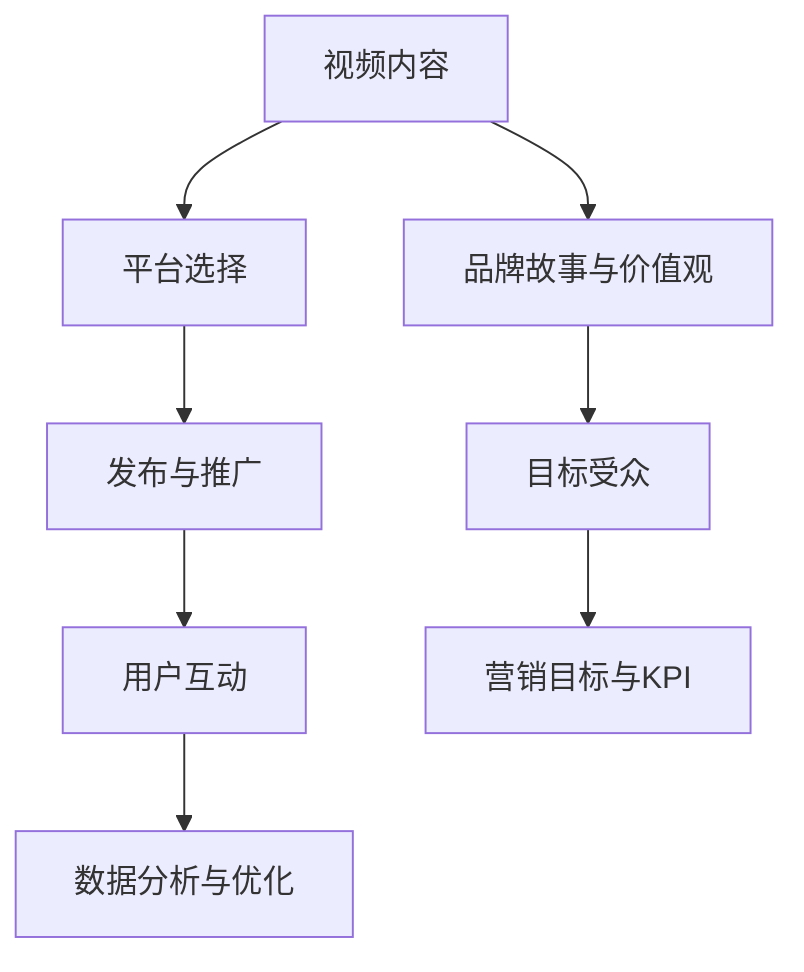

                 


## 如何利用视频营销提升创业公司知名度

### 关键词：
- 视频营销
- 创业公司
- 知名度提升
- 营销策略
- 数字营销
- 社交媒体

> 摘要：本文将深入探讨如何通过视频营销策略提升创业公司的知名度。我们将详细分析视频营销的核心概念，介绍视频营销的关键步骤，并提供实用的工具和资源推荐，帮助创业公司更好地利用视频平台实现品牌推广和用户增长。

## 1. 背景介绍

### 1.1 目的和范围

本文的目标是帮助创业公司了解和实施视频营销策略，以提升品牌知名度和用户参与度。我们将探讨以下主题：

- 视频营销的定义和重要性
- 视频营销的核心步骤和策略
- 创业公司如何利用视频平台进行营销
- 实际案例分析和最佳实践
- 必备工具和资源推荐

### 1.2 预期读者

本文适用于以下读者群体：

- 创业公司创始人或市场营销负责人
- 市场营销和数字营销专业人士
- 对视频营销感兴趣的学习者
- 想要了解最新营销趋势的企业决策者

### 1.3 文档结构概述

本文分为以下几个部分：

- 引言
- 视频营销的核心概念
- 视频营销的策略和步骤
- 创业公司的视频营销实战
- 工具和资源推荐
- 总结与未来展望
- 附录：常见问题与解答
- 扩展阅读与参考资料

### 1.4 术语表

#### 1.4.1 核心术语定义

- 视频营销：通过制作和发布视频内容，吸引和引导潜在客户，实现品牌推广和销售目标的一种营销方式。
- 知名度：指一个品牌或产品在公众中认知度和认可度的程度。
- 用户参与度：指用户在互动过程中对品牌或产品的关注程度和参与度。
- 社交媒体：在线平台，允许用户创建、分享和互动，例如Facebook、Instagram、Twitter等。

#### 1.4.2 相关概念解释

- 内容营销：以提供有价值、相关、一致的内容来吸引和留住明确的目标受众，并最终推动利润和客户行动的营销实践。
- SEO（搜索引擎优化）：通过优化网站内容和结构，提高在搜索引擎结果中的排名，吸引更多有机流量。
- CPC（每次点击付费）：一种在线广告模式，广告主为每次点击广告付费。

#### 1.4.3 缩略词列表

- SEO：搜索引擎优化
- CPC：每次点击付费
- SMM：社交媒体营销
- CTA：呼吁行动（Call to Action）
- ROI：投资回报率

## 2. 核心概念与联系

在深入了解视频营销之前，我们需要理解一些核心概念和它们之间的联系。以下是一个简化的Mermaid流程图，展示了视频营销的关键组成部分。



### 2.1 视频内容

视频内容是视频营销的核心，它需要反映品牌故事、价值观和目标受众的需求。内容应具有吸引力、有价值且相关，能够激发用户的兴趣和参与度。

### 2.2 平台选择

视频营销的平台选择至关重要，不同的平台有不同的用户群体和特点。例如，YouTube适合专业视频内容，Instagram适合短视频和用户生成内容，LinkedIn适合B2B营销等。

### 2.3 发布与推广

发布视频后，推广策略同样关键。通过SEO优化、社交媒体分享、付费广告等手段，可以扩大视频的受众范围，提高曝光率。

### 2.4 用户互动

用户互动是视频营销的重要一环，通过评论、点赞、分享等互动方式，可以增强用户参与度，提升品牌忠诚度。

### 2.5 数据分析与优化

数据分析是视频营销的反馈机制，通过分析观看时长、点击率、转化率等指标，可以优化内容策略和推广效果。

### 2.6 品牌故事与价值观

品牌故事和价值观是视频营销的灵魂，它们有助于建立品牌形象和用户情感连接，提高品牌知名度和认可度。

### 2.7 目标受众

明确目标受众是视频营销的前提，只有了解受众的需求、兴趣和痛点，才能制作出符合受众期望的视频内容。

### 2.8 营销目标与KPI

制定明确的营销目标是视频营销的起点，KPI（关键绩效指标）则是衡量营销效果的重要工具。

## 3. 核心算法原理 & 具体操作步骤

视频营销的成功离不开科学的设计和执行。以下是一系列核心算法原理和具体操作步骤，帮助创业公司制定和实施有效的视频营销策略。

### 3.1 策略制定

**算法原理：**

- 内容策略：基于用户需求和品牌目标，制定具有吸引力的视频内容。
- 目标受众分析：通过市场调研，明确目标受众的特点和偏好。
- KPI设定：根据业务目标，设定可量化的营销KPI，如观看时长、点击率、转化率等。

**操作步骤：**

1. 确定品牌故事和核心价值观。
2. 分析市场需求和用户痛点。
3. 制定内容策略，包括视频类型（教育、娱乐、品牌故事等）和风格。
4. 设定KPI，如视频观看率、用户参与度、转化率等。

### 3.2 视频制作

**算法原理：**

- 视频制作流程：从脚本编写、拍摄、编辑到后期制作，确保视频质量。
- 视觉设计：利用色彩、图像、音乐等元素，增强视频吸引力。
- 优化脚本：确保脚本简洁、有逻辑且符合用户需求。

**操作步骤：**

1. 筛选合适的视频制作团队。
2. 编写脚本，确保内容有价值、有吸引力。
3. 拍摄和编辑视频，注意画面质量、音效和节奏。
4. 后期制作，包括剪辑、调色、添加字幕等。

### 3.3 视频发布

**算法原理：**

- 平台选择：根据目标受众选择合适的视频发布平台。
- 发布时间：选择用户活跃度高、竞争较小的时段发布视频。
- 标题和描述：编写吸引人的标题和描述，提高点击率。

**操作步骤：**

1. 选择视频发布平台，如YouTube、Instagram、TikTok等。
2. 制定发布计划，包括发布时间、频率和内容。
3. 编写标题和描述，确保吸引潜在观众。
4. 发布视频，并启动推广策略。

### 3.4 数据分析

**算法原理：**

- 数据分析工具：使用Google Analytics、YouTube Analytics等工具，分析视频表现和用户行为。
- 指标解读：根据关键指标，如观看时长、点击率、转化率等，评估视频效果。
- 优化策略：基于数据分析，调整内容策略和发布计划。

**操作步骤：**

1. 设置并配置数据分析工具。
2. 收集并整理视频观看数据。
3. 分析关键指标，识别问题和机会。
4. 根据分析结果，调整内容策略和发布计划。

### 3.5 用户互动

**算法原理：**

- 用户互动策略：通过评论、点赞、分享等方式，增强用户参与度。
- 社交互动：在社交媒体上与用户互动，建立情感连接。
- 客户服务：及时回复用户评论和私信，提供优质的客户服务。

**操作步骤：**

1. 鼓励用户在视频下评论和分享。
2. 定期发布互动性强的内容，如问答、投票等。
3. 回复用户评论和私信，建立良好的客户关系。

## 4. 数学模型和公式 & 详细讲解 & 举例说明

视频营销的成功离不开数据和数学模型的支撑。以下是一些关键的数学模型和公式，以及详细的讲解和举例说明。

### 4.1 观看时长与转化率

**公式：** 转化率 =（完成观看的用户数 / 观看次数）× 100%

**解释：** 这个公式用于计算视频的转化率，即有多少用户在观看视频后采取了预期的行动（如点击购买按钮、订阅等）。

**举例：** 如果一个视频有1000次观看，其中500个用户完成了观看，而其中100个用户购买了产品，则转化率为（100/500）× 100% = 20%。

### 4.2 点击率与广告效果

**公式：** 点击率 =（点击次数 / 展现次数）× 100%

**解释：** 点击率是衡量广告效果的重要指标，表示广告被点击的频率。

**举例：** 如果一个广告有1000次展现，其中有50次点击，则点击率为（50/1000）× 100% = 5%。

### 4.3 营销ROI

**公式：** ROI =（投资收益 - 投资成本）/ 投资成本 × 100%

**解释：** ROI（投资回报率）用于衡量营销活动的整体盈利能力。

**举例：** 如果一个视频营销活动的成本为1000美元，通过视频获得了2000美元的收入，则ROI为（2000 - 1000）/ 1000 × 100% = 100%。

### 4.4 用户参与度

**公式：** 用户参与度 =（用户互动次数 / 观看次数）× 100%

**解释：** 用户参与度表示用户对视频内容的互动程度。

**举例：** 如果一个视频有1000次观看，其中用户产生了200次点赞、50次评论和30次分享，则用户参与度为（200 + 50 + 30）/ 1000 × 100% = 28%。

## 5. 项目实战：代码实际案例和详细解释说明

为了更好地理解视频营销策略的实施，我们来看一个实际的项目案例。以下是一个创业公司通过视频营销提高知名度的具体步骤和代码实现。

### 5.1 开发环境搭建

在开始之前，我们需要搭建一个适合视频营销的开发环境。以下是所需的工具和步骤：

- **工具：** YouTube、Instagram、TikTok等视频平台。
- **步骤：**
  1. 注册并登录各个视频平台账户。
  2. 配置YouTube频道，确保可以上传视频。
  3. 设置社交媒体账号的隐私和推广权限。

### 5.2 源代码详细实现和代码解读

**示例代码：YouTube视频上传脚本**

```python
import os
import requests

# API密钥
API_KEY = 'YOUR_YOUTUBE_API_KEY'
# 视频文件路径
video_path = 'path/to/your/video.mp4'

# 创建视频上传请求
headers = {
    'Authorization': f'Bearer {API_KEY}',
    'Content-Type': 'application/json'
}

data = {
    'snippet': {
        'title': '视频标题',
        'description': '视频描述',
        'tags': ['标签1', '标签2', '标签3']
    },
    'status': {
        'privacyStatus': 'public'
    }
}

# 发送请求
response = requests.post('https://www.googleapis.com/youtube/v3/videos', headers=headers, json=data)
video_id = response.json()['id']

# 上传视频文件
with open(video_path, 'rb') as video:
    upload_response = requests.put(f'https://www.googleapis.com/upload/youtube/v3/videos/{video_id}?part=snippet,status,contentDetails,stats', headers=headers, data=video)
    print(upload_response.text)
```

**代码解读：**

1. 导入必需的库。
2. 设置API密钥和视频文件路径。
3. 创建上传视频的请求，包括视频的标题、描述和标签。
4. 发送请求到YouTube API，获取视频ID。
5. 上传视频文件到YouTube。

### 5.3 代码解读与分析

这个代码示例展示了如何使用Python脚本通过YouTube API上传视频。以下是代码的详细解读和分析：

- **API密钥和认证：** 使用YouTube API密钥进行认证，确保请求的有效性。
- **视频信息设置：** 通过`data`字典设置视频的标题、描述和标签，这些信息将显示在YouTube页面上。
- **上传请求：** 使用`requests.post`发送创建视频的请求，YouTube API返回视频ID。
- **上传视频文件：** 使用`requests.put`上传视频文件，通过视频ID指定上传的目标视频。

**注意事项：**

- 确保API密钥的安全，避免泄露。
- 标题、描述和标签应具有吸引力，以提高视频的曝光率。
- 视频文件应遵循YouTube的格式和大小要求。

通过这个实际案例，我们可以看到创业公司如何利用视频营销策略提高知名度。代码的灵活运用可以帮助公司自动化视频上传流程，提高效率。

## 6. 实际应用场景

视频营销策略在不同行业和公司规模中都有广泛的应用，以下是一些典型的实际应用场景：

### 6.1 科技行业

- **产品演示：** 通过视频展示产品的功能和使用场景，帮助潜在客户更好地理解产品。
- **品牌故事：** 通过讲述公司的发展历程和技术创新，树立品牌形象。
- **客户案例：** 展示成功案例，证明产品在实际应用中的效果。

### 6.2 零售行业

- **商品宣传：** 通过短视频展示商品细节和使用体验，吸引消费者购买。
- **促销活动：** 利用视频宣传促销活动，增加用户参与度和购买意愿。
- **用户反馈：** 通过用户评价和反馈视频，提升消费者对品牌的信任。

### 6.3 服务业

- **服务介绍：** 通过视频介绍服务内容和优势，帮助潜在客户了解服务。
- **专家访谈：** 邀请行业专家进行访谈，分享专业知识和见解，提升品牌权威性。
- **用户故事：** 讲述客户使用服务的体验和故事，增强用户情感连接。

### 6.4 创业公司

- **品牌推广：** 利用视频展示公司文化、愿景和使命，吸引潜在投资者和合作伙伴。
- **产品演示：** 通过视频展示产品的特点和优势，帮助用户更好地理解和使用产品。
- **用户反馈：** 通过用户反馈视频，提升产品的市场认可度和用户忠诚度。

### 6.5 多平台整合

- **跨平台营销：** 在多个视频平台上发布相同或不同的视频内容，扩大品牌曝光。
- **内容联动：** 结合社交媒体、博客和电子邮件等渠道，进行多渠道营销。
- **用户互动：** 在视频平台上与用户进行互动，收集用户反馈和建议，持续优化营销策略。

通过这些实际应用场景，我们可以看到视频营销在不同领域的多样性和灵活性。创业公司可以根据自身特点和市场需求，灵活运用视频营销策略，实现品牌推广和用户增长。

## 7. 工具和资源推荐

为了帮助创业公司在视频营销中取得成功，我们推荐一系列实用的工具和资源。

### 7.1 学习资源推荐

#### 7.1.1 书籍推荐

- 《视频营销实战指南》：作者通过实际案例，深入讲解了视频营销的策略和方法。
- 《社交媒体营销技巧》：详细介绍了如何在各种社交媒体平台上进行视频营销。

#### 7.1.2 在线课程

- Coursera上的《视频营销与品牌推广》：提供系统的视频营销知识和技能。
- Udemy上的《YouTube营销：从零开始制作和推广视频》：专注于YouTube平台的视频营销策略。

#### 7.1.3 技术博客和网站

- **Neil Patel Blog**：提供丰富的数字营销和视频营销内容。
- **Content Marketing Institute**：分享最新的内容营销和视频营销趋势。

### 7.2 开发工具框架推荐

#### 7.2.1 IDE和编辑器

- **Visual Studio Code**：一款强大的开源编辑器，适用于各种编程语言。
- **Adobe Premiere Pro**：专业的视频编辑软件，适合高端视频制作。

#### 7.2.2 调试和性能分析工具

- **Chrome DevTools**：提供全面的调试和性能分析功能，适用于网页和视频。
- **YouTube Analytics**：YouTube官方提供的分析工具，用于监控视频表现和用户互动。

#### 7.2.3 相关框架和库

- **Vimeo API**：提供视频上传、管理和互动的API，适用于需要集成视频功能的网站和应用。
- **YouTube Data API**：用于读取和修改YouTube数据，适用于需要与YouTube平台交互的应用程序。

### 7.3 相关论文著作推荐

#### 7.3.1 经典论文

- “Video Marketing: Theory and Practice”：一篇关于视频营销理论的经典论文。
- “The Impact of Video Marketing on Consumer Behavior”：研究视频营销对消费者行为影响的论文。

#### 7.3.2 最新研究成果

- “The Future of Video Marketing：2022 Trends and Predictions”：预测2022年视频营销趋势的研究报告。
- “The Role of Video Marketing in Digital Transformation”：探讨视频营销在数字化转型中的作用的研究论文。

#### 7.3.3 应用案例分析

- “Case Study：How XYZ Company Grew Its Audience with Video Marketing”：通过实际案例分析，展示视频营销的成功策略。

这些工具和资源将为创业公司在视频营销中提供宝贵的支持和指导。

## 8. 总结：未来发展趋势与挑战

随着数字营销的不断发展和用户需求的多样化，视频营销在未来将继续发挥重要作用。以下是视频营销的发展趋势和面临的挑战：

### 8.1 发展趋势

- **短视频崛起**：短视频平台如TikTok和Instagram Reels等将继续吸引大量用户，成为视频营销的重要阵地。
- **垂直内容专业化**：专业化的垂直内容将在视频营销中占据主导地位，用户对高质量、专业化内容的渴求将持续增长。
- **互动与社交化**：视频营销将更加注重用户互动和社交化，通过直播、互动视频等形式提高用户参与度和忠诚度。
- **AI与数据分析**：人工智能技术的应用将进一步提升视频营销的个性化和精准性，数据分析将帮助公司更有效地优化营销策略。

### 8.2 挑战

- **内容质量**：制作高质量的视频内容是视频营销成功的关键，但同时也需要投入大量时间和资源。
- **竞争激烈**：随着越来越多的公司加入视频营销的行列，竞争将变得更加激烈，需要不断创新和优化策略。
- **成本控制**：视频营销需要投入大量的资金和人力，如何有效控制成本并实现投资回报是一个挑战。
- **技术更新**：视频营销技术不断更新，公司需要保持对最新技术的关注和应用，以保持竞争力。

总之，视频营销在未来将继续发展，但创业公司需要不断创新和适应变化，才能在激烈的竞争中脱颖而出。

## 9. 附录：常见问题与解答

### 9.1 什么是视频营销？

视频营销是通过创建和发布视频内容，吸引潜在客户，提高品牌知名度，并最终实现销售目标的一种营销策略。

### 9.2 视频营销有哪些类型？

视频营销主要包括以下类型：

- 产品演示视频
- 教育和培训视频
- 品牌故事视频
- 用户案例视频
- 直播和互动视频
- 促销视频

### 9.3 如何制作高质量的视频内容？

制作高质量的视频内容需要以下步骤：

- 明确目标受众和营销目标。
- 制定有吸引力的视频脚本。
- 选择合适的拍摄和编辑设备。
- 优化视频的视觉效果和音效。
- 后期制作，包括剪辑、调色、添加字幕等。

### 9.4 如何选择视频营销平台？

选择视频营销平台应根据目标受众和营销目标。以下是一些常见的视频营销平台：

- YouTube：适合专业视频内容和长视频。
- Instagram：适合短视频和用户生成内容。
- TikTok：适合快速、有趣的短视频。
- LinkedIn：适合B2B营销和专业内容。

### 9.5 视频营销的成本如何控制？

控制视频营销成本的方法包括：

- 制定明确的预算。
- 选择合适的视频制作团队。
- 利用现有资源，如员工参与拍摄和制作。
- 后期优化和重复使用视频内容。

### 9.6 视频营销的数据分析重要吗？

非常重要。数据分析可以帮助公司了解视频的表现和用户行为，优化内容策略和发布计划，提高营销效果和投资回报率。

## 10. 扩展阅读 & 参考资料

为了更深入地了解视频营销的策略和应用，我们推荐以下扩展阅读和参考资料：

- Patel, N. (2021). 《视频营销实战指南》：[https://neilpatel.com/seo-book/video-marketing/](https://neilpatel.com/seo-book/video-marketing/)
- Content Marketing Institute. (2020). 《2020年B2B内容营销趋势报告》：[https://contentmarketinginstitute.com/2020-b2b-content-marketing-trends-report/](https://contentmarketinginstitute.com/2020-b2b-content-marketing-trends-report/)
- YouTube Help. (2021). 《如何创建YouTube频道和视频》：[https://support.google.com/youtube/answer/72859?hl=en](https://support.google.com/youtube/answer/72859%3Fhl%3Den)
- Social Media Examiner. (2021). 《社交媒体营销指南》：[https://www.socialmediaexaminer.com/](https://www.socialmediaexaminer.com/)
- Analytics Academy. (2021). 《YouTube Analytics教程》：[https://analytics.google.com/analytics/academy/#tutorial](https://analytics.google.com/analytics/academy/%23tutorial)

通过这些扩展阅读和参考资料，读者可以更全面地了解视频营销的各个方面，为公司的营销策略提供更多启示。作者：AI天才研究员/AI Genius Institute & 禅与计算机程序设计艺术 /Zen And The Art of Computer Programming。

