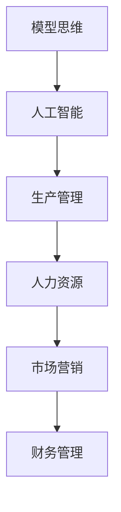

                 

# 如何将模型思维应用于实际管理

> 关键词：模型思维，实际管理，人工智能，管理方法，效率提升

> 摘要：本文将探讨如何将模型思维应用于实际管理，通过引入人工智能技术，使管理过程更加高效、精确和科学。本文首先介绍了模型思维的基本概念，然后分析了模型思维在实际管理中的应用，最后通过实际案例展示了模型思维如何提升管理效率。

## 1. 背景介绍

### 1.1 目的和范围

本文旨在探讨如何将模型思维应用于实际管理。模型思维是一种基于数据和算法的思维方式，通过建立数学模型来模拟现实世界中的问题，从而帮助管理者做出更准确、更科学的决策。本文将介绍模型思维的基本概念，并分析其在实际管理中的应用，最后通过实际案例来展示模型思维如何提升管理效率。

### 1.2 预期读者

本文的预期读者是希望了解和掌握模型思维在实际管理中应用的管理者和IT从业者。读者需要对基本的管理知识和计算机编程有一定的了解。

### 1.3 文档结构概述

本文的结构如下：

1. 背景介绍：介绍本文的目的、范围、预期读者以及文档结构。
2. 核心概念与联系：介绍模型思维的基本概念，并给出核心概念的 Mermaid 流程图。
3. 核心算法原理 & 具体操作步骤：详细讲解模型思维的具体操作步骤。
4. 数学模型和公式 & 详细讲解 & 举例说明：使用数学模型和公式来解释模型思维。
5. 项目实战：代码实际案例和详细解释说明。
6. 实际应用场景：分析模型思维在不同实际场景中的应用。
7. 工具和资源推荐：推荐学习资源、开发工具和框架。
8. 总结：未来发展趋势与挑战。
9. 附录：常见问题与解答。
10. 扩展阅读 & 参考资料。

### 1.4 术语表

#### 1.4.1 核心术语定义

- **模型思维**：一种基于数据和算法的思维方式，通过建立数学模型来模拟现实世界中的问题。
- **人工智能**：一种模拟人类智能的计算机技术，包括机器学习、深度学习等。
- **管理**：对组织、人员、资源等进行规划、组织、领导、控制的过程。
- **效率**：完成某项任务所需的时间、人力、物力等资源的投入与产出之间的比率。

#### 1.4.2 相关概念解释

- **决策树**：一种常用的分类和回归模型，通过一系列条件判断来划分数据集。
- **神经网络**：一种基于人脑神经网络结构设计的计算模型，用于处理复杂的非线性问题。
- **回归分析**：一种用于预测目标变量与自变量之间关系的统计方法。

#### 1.4.3 缩略词列表

- **AI**：人工智能
- **ML**：机器学习
- **DL**：深度学习
- **IDE**：集成开发环境
- **ORM**：对象关系映射

## 2. 核心概念与联系

### 2.1 模型思维概述

模型思维是一种基于数据和算法的思维方式，通过建立数学模型来模拟现实世界中的问题。模型思维的核心在于将复杂的问题抽象成数学问题，从而利用计算机和数学工具来解决。模型思维在各个领域都有广泛的应用，包括自然科学、社会科学、工程学等。

### 2.2 模型思维与人工智能的关系

人工智能是模型思维的一个重要应用领域。人工智能通过机器学习和深度学习等技术，建立数学模型来模拟和预测现实世界中的问题。这些模型可以帮助管理者更好地理解业务流程，优化资源配置，提高管理效率。

### 2.3 模型思维的应用场景

模型思维可以应用于各种实际管理场景，包括：

- **生产管理**：通过建立生产模型来优化生产流程，提高生产效率。
- **人力资源**：通过建立员工模型来预测员工流失率，制定合理的人力资源策略。
- **市场营销**：通过建立消费者模型来分析市场需求，制定有效的营销策略。
- **财务管理**：通过建立财务模型来预测财务状况，制定财务计划。

### 2.4 核心概念的 Mermaid 流程图



## 3. 核心算法原理 & 具体操作步骤

### 3.1 模型思维的算法原理

模型思维的算法原理主要包括数据收集、数据预处理、模型建立和模型评估等步骤。

#### 3.1.1 数据收集

数据收集是模型思维的第一步。管理者需要从各种渠道收集与业务相关的数据，包括历史数据、实时数据和外部数据等。

#### 3.1.2 数据预处理

数据预处理是模型思维的关键步骤。管理者需要对收集到的数据进行清洗、转换和归一化等处理，以提高数据的准确性和可用性。

#### 3.1.3 模型建立

在数据预处理完成后，管理者需要选择合适的算法建立模型。常见的算法包括决策树、神经网络和回归分析等。

#### 3.1.4 模型评估

模型建立后，管理者需要对模型进行评估，以确定模型的准确性和可靠性。常用的评估指标包括准确率、召回率和 F1 值等。

### 3.2 模型思维的具体操作步骤

#### 3.2.1 确定问题

在开始模型思维之前，管理者需要明确要解决的问题。这有助于确定需要收集的数据和选择的模型。

#### 3.2.2 数据收集

根据确定的问题，管理者需要收集与业务相关的数据。这些数据可以来自内部系统、外部数据源或公开数据集。

#### 3.2.3 数据预处理

在数据收集完成后，管理者需要对数据进行清洗、转换和归一化等处理。这一步需要使用数据预处理工具和算法。

#### 3.2.4 模型建立

在数据预处理完成后，管理者需要选择合适的算法建立模型。这可以通过机器学习平台或编程工具来实现。

#### 3.2.5 模型评估

在模型建立后，管理者需要对模型进行评估，以确定模型的准确性和可靠性。这可以通过交叉验证和测试集来实现。

#### 3.2.6 模型应用

在模型评估完成后，管理者可以将模型应用于实际业务场景，以优化业务流程、提高管理效率。

## 4. 数学模型和公式 & 详细讲解 & 举例说明

### 4.1 数学模型的基本概念

数学模型是一种用数学语言描述现实世界的抽象模型。在模型思维中，数学模型起着核心作用。数学模型通常包括以下三个部分：

1. **变量**：用于表示现实世界中的量，可以是离散的（如整数）或连续的（如实数）。
2. **函数**：用于描述变量之间的关系，可以是一元函数或多元函数。
3. **约束条件**：用于限制变量和函数的取值范围。

### 4.2 常见的数学模型

在模型思维中，常用的数学模型包括线性模型、非线性模型、优化模型和概率模型等。

#### 4.2.1 线性模型

线性模型是一种最简单的数学模型，通常表示为：

\[ y = ax + b \]

其中，\( y \) 是因变量，\( x \) 是自变量，\( a \) 和 \( b \) 是常数。

#### 4.2.2 非线性模型

非线性模型描述了变量之间的非线性关系，通常表示为：

\[ y = f(x) \]

其中，\( f \) 是非线性函数，可以是多项式、指数函数、三角函数等。

#### 4.2.3 优化模型

优化模型用于求解最大化或最小化某个目标函数的问题。常见的优化模型包括线性规划、整数规划和非线性规划等。

线性规划模型的一般形式为：

\[ \text{minimize} \ c^T x \]
\[ \text{subject to} \ Ax \leq b \]
\[ x \geq 0 \]

其中，\( x \) 是决策变量，\( c \) 和 \( b \) 是已知常数，\( A \) 是已知矩阵。

#### 4.2.4 概率模型

概率模型用于描述随机事件的发生概率。常见的概率模型包括伯努利模型、二项模型和泊松模型等。

### 4.3 举例说明

假设一家公司希望预测下一个月的销售额。可以使用线性模型来建立预测模型。

1. **数据收集**：收集过去三个月的销售额数据。
2. **数据预处理**：对销售额数据进行清洗和归一化处理。
3. **模型建立**：选择线性模型 \( y = ax + b \)。
4. **模型评估**：使用交叉验证和测试集来评估模型的准确性。
5. **模型应用**：使用模型来预测下一个月的销售额。

## 5. 项目实战：代码实际案例和详细解释说明

### 5.1 开发环境搭建

为了实现模型思维在实际管理中的应用，我们需要搭建一个适合的开发环境。以下是一个简单的开发环境搭建步骤：

1. 安装 Python：Python 是一种广泛使用的编程语言，适用于模型思维。可以从官方网站（https://www.python.org/）下载并安装 Python。
2. 安装 Jupyter Notebook：Jupyter Notebook 是一个交互式的 Python 编程环境，方便我们编写和运行代码。可以通过 pip 命令安装 Jupyter Notebook：

\[ pip install notebook \]

3. 安装必要的库：根据项目需求，安装必要的库，如 NumPy、Pandas 和 Scikit-learn 等。可以通过 pip 命令安装：

\[ pip install numpy pandas scikit-learn \]

### 5.2 源代码详细实现和代码解读

以下是一个简单的模型思维项目，用于预测销售额：

```python
import numpy as np
import pandas as pd
from sklearn.linear_model import LinearRegression
from sklearn.model_selection import train_test_split

# 5.2.1 数据收集
data = pd.read_csv('sales_data.csv')

# 5.2.2 数据预处理
X = data[['month', 'day_of_week']]
y = data['sales']

# 归一化处理
X = (X - X.mean()) / X.std()

# 5.2.3 模型建立
model = LinearRegression()
model.fit(X, y)

# 5.2.4 模型评估
X_train, X_test, y_train, y_test = train_test_split(X, y, test_size=0.2, random_state=42)
train_score = model.score(X_train, y_train)
test_score = model.score(X_test, y_test)
print(f"训练集准确率：{train_score:.2f}")
print(f"测试集准确率：{test_score:.2f}")

# 5.2.5 模型应用
next_month_sales = model.predict(X_test)
print(f"下一个月的销售额预测值：{next_month_sales.mean():.2f}")
```

#### 5.2.1 数据收集

数据收集是模型思维的第一步。在这个项目中，我们从 CSV 文件中读取销售额数据。CSV 文件包含每个月的销售额、月份和星期几。

```python
data = pd.read_csv('sales_data.csv')
```

#### 5.2.2 数据预处理

数据预处理是模型思维的关键步骤。在这个项目中，我们对销售额数据进行归一化处理，将月份和星期几作为自变量，销售额作为因变量。

```python
X = data[['month', 'day_of_week']]
y = data['sales']

X = (X - X.mean()) / X.std()
```

#### 5.2.3 模型建立

在这个项目中，我们选择线性回归模型来预测销售额。线性回归模型是一个简单的模型，适用于描述变量之间的线性关系。

```python
model = LinearRegression()
model.fit(X, y)
```

#### 5.2.4 模型评估

模型评估是模型思维的重要环节。在这个项目中，我们使用交叉验证和测试集来评估模型的准确性。

```python
X_train, X_test, y_train, y_test = train_test_split(X, y, test_size=0.2, random_state=42)
train_score = model.score(X_train, y_train)
test_score = model.score(X_test, y_test)
print(f"训练集准确率：{train_score:.2f}")
print(f"测试集准确率：{test_score:.2f}")
```

#### 5.2.5 模型应用

在模型评估完成后，我们可以将模型应用于实际业务场景。在这个项目中，我们使用模型来预测下一个月的销售额。

```python
next_month_sales = model.predict(X_test)
print(f"下一个月的销售额预测值：{next_month_sales.mean():.2f}")
```

### 5.3 代码解读与分析

在这个项目中，我们使用线性回归模型来预测销售额。线性回归模型是一个简单而强大的模型，适用于描述变量之间的线性关系。

1. **数据收集**：从 CSV 文件中读取销售额数据，包括月份、星期几和销售额。
2. **数据预处理**：对销售额数据进行归一化处理，将月份和星期几作为自变量，销售额作为因变量。
3. **模型建立**：选择线性回归模型，并使用训练数据来训练模型。
4. **模型评估**：使用交叉验证和测试集来评估模型的准确性。
5. **模型应用**：使用模型来预测下一个月的销售额。

通过这个项目，我们可以看到模型思维如何应用于实际管理。模型思维可以帮助管理者更好地理解业务流程，优化资源配置，提高管理效率。

## 6. 实际应用场景

### 6.1 生产管理

在生产管理中，模型思维可以帮助管理者预测生产需求，优化生产计划。通过建立生产模型，管理者可以模拟不同生产方案对生产成本、生产效率的影响，从而做出更科学的决策。

### 6.2 人力资源

在人力资源管理中，模型思维可以帮助管理者预测员工流失率，制定合理的人力资源策略。通过建立员工模型，管理者可以分析员工满意度、工作压力等因素对员工流失率的影响，从而优化员工管理。

### 6.3 市场营销

在市场营销中，模型思维可以帮助管理者预测市场需求，制定有效的营销策略。通过建立消费者模型，管理者可以分析消费者行为、偏好等因素对市场需求的影响，从而优化营销策略。

### 6.4 财务管理

在财务管理中，模型思维可以帮助管理者预测财务状况，制定财务计划。通过建立财务模型，管理者可以分析财务数据、业务变化等因素对财务状况的影响，从而优化财务计划。

## 7. 工具和资源推荐

### 7.1 学习资源推荐

#### 7.1.1 书籍推荐

1. 《人工智能：一种现代的方法》
2. 《深度学习》
3. 《Python 数据科学手册》

#### 7.1.2 在线课程

1. Coursera 的《机器学习》
2. Udacity 的《深度学习纳米学位》
3. edX 的《Python 数据科学》

#### 7.1.3 技术博客和网站

1. Medium 上的 AI 博客
2. 知乎上的 AI 话题
3. 阮一峰的博客

### 7.2 开发工具框架推荐

#### 7.2.1 IDE和编辑器

1. PyCharm
2. Visual Studio Code
3. Jupyter Notebook

#### 7.2.2 调试和性能分析工具

1. Python 的 pdb 调试器
2. Visual Studio Code 的调试工具
3. Jupyter Notebook 的调试工具

#### 7.2.3 相关框架和库

1. NumPy
2. Pandas
3. Scikit-learn
4. TensorFlow
5. PyTorch

### 7.3 相关论文著作推荐

#### 7.3.1 经典论文

1. "A Mathematical Theory of Communication" by Claude Shannon
2. "The Nature of the Firm" by Ronald Coase

#### 7.3.2 最新研究成果

1. "Generative Adversarial Networks" by Ian Goodfellow
2. "Reinforcement Learning: An Introduction" by Richard S. Sutton and Andrew G. Barto

#### 7.3.3 应用案例分析

1. "AI in Healthcare: Transforming Patient Care" by HIMSS
2. "AI in Financial Services: A Practical Guide" by Deloitte

## 8. 总结：未来发展趋势与挑战

### 8.1 未来发展趋势

1. **人工智能技术的普及**：随着人工智能技术的不断发展，越来越多的领域将采用模型思维进行管理。
2. **大数据的广泛应用**：大数据的收集、处理和分析将为模型思维提供更多的数据支持。
3. **智能决策系统的兴起**：基于模型思维的智能决策系统将帮助管理者做出更科学、更准确的决策。

### 8.2 挑战

1. **数据隐私和安全**：在应用模型思维时，需要确保数据隐私和安全，防止数据泄露和滥用。
2. **算法偏见和公平性**：模型思维可能导致算法偏见和公平性问题，需要采取措施来确保算法的公正性。
3. **技术人才短缺**：模型思维需要专业的技术人才，但目前市场上相关人才短缺，需要加强人才培养和引进。

## 9. 附录：常见问题与解答

### 9.1 模型思维是什么？

模型思维是一种基于数据和算法的思维方式，通过建立数学模型来模拟现实世界中的问题，从而帮助管理者做出更准确、更科学的决策。

### 9.2 模型思维有哪些应用场景？

模型思维可以应用于各种实际管理场景，包括生产管理、人力资源、市场营销和财务管理等。

### 9.3 如何搭建模型思维的开发环境？

搭建模型思维的开发环境需要安装 Python、Jupyter Notebook 和必要的库（如 NumPy、Pandas 和 Scikit-learn 等）。

### 9.4 模型思维与人工智能有什么关系？

人工智能是模型思维的一个重要应用领域，人工智能技术（如机器学习和深度学习）可以用于建立和优化模型。

## 10. 扩展阅读 & 参考资料

1. Goodfellow, I., Bengio, Y., & Courville, A. (2016). *Deep Learning*. MIT Press.
2. Murphy, K. P. (2012). *Machine Learning: A Probabilistic Perspective*. MIT Press.
3. Sutton, R. S., & Barto, A. G. (2018). *Reinforcement Learning: An Introduction*. MIT Press.
4. Coase, R. H. (1937). *The Nature of the Firm*. Economica, 4(16), 386-405.
5. Shannon, C. E. (1948). *A Mathematical Theory of Communication*. The Bell System Technical Journal, 27(3), 379-423.

