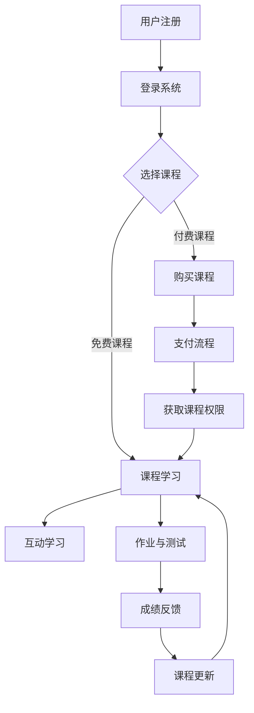

                 

# 如何将编程技能转化为在线编程训练营

> **关键词**：在线编程训练营、编程技能、数字化转型、教学策略、技术教学

> **摘要**：本文旨在探讨如何将个人编程技能有效转化为在线编程训练营，帮助教育者、程序员和IT专家利用其专业知识，通过在线平台提供高质量的教学内容。文章将分析在线编程训练营的背景和重要性，提供详细的构建步骤，并推荐实用的工具和资源，以支持读者实现这一转型。

## 1. 背景介绍

### 1.1 目的和范围

随着数字化转型的不断推进，在线教育和编程学习需求日益增长。本文旨在帮助具备编程技能的个人或机构，将他们的专业知识和教学能力转化为在线编程训练营。文章涵盖了从初步准备到实际运营的全面指南，旨在为读者提供实用的策略和步骤，以构建成功的在线编程教育项目。

### 1.2 预期读者

本文面向以下几类读者：

1. **教育者**：希望扩展教学范围和手段的教师和教育专家。
2. **程序员和IT专业人士**：想通过在线平台分享知识和技能的个人。
3. **机构负责人**：希望开设在线编程课程的教育机构和管理人员。
4. **学习者**：对编程感兴趣，希望了解更多在线编程教育和资源的学生。

### 1.3 文档结构概述

本文结构如下：

1. **背景介绍**：介绍在线编程训练营的背景、目的和预期读者。
2. **核心概念与联系**：介绍编程教育和在线学习平台的核心概念，并展示相关的流程图。
3. **核心算法原理 & 具体操作步骤**：详细讲解如何设计和实现在线编程课程。
4. **数学模型和公式**：介绍与编程教育相关的数学模型和公式。
5. **项目实战**：通过具体案例展示如何开发和管理在线编程训练营。
6. **实际应用场景**：探讨在线编程训练营在不同场景下的应用。
7. **工具和资源推荐**：推荐用于构建和运营在线编程训练营的工具和资源。
8. **总结：未来发展趋势与挑战**：总结当前趋势和未来的挑战。
9. **附录：常见问题与解答**：回答常见问题，提供进一步支持。
10. **扩展阅读 & 参考资料**：提供进一步阅读和研究的资源。

### 1.4 术语表

#### 1.4.1 核心术语定义

- **在线编程训练营**：通过互联网平台提供的编程学习和培训项目。
- **数字化转型**：将传统业务模式转向数字技术的过程。
- **教学策略**：教育过程中采用的方法和技巧。
- **技术教学**：针对特定技术领域的教育和培训。

#### 1.4.2 相关概念解释

- **在线学习平台**：提供在线教育和学习资源的互联网平台。
- **编程语言**：用于编写计算机程序的语法规则和结构。
- **算法**：解决问题的方法或步骤。

#### 1.4.3 缩略词列表

- **MOOC**：大规模在线开放课程（Massive Open Online Course）
- **LMS**：学习管理系统（Learning Management System）
- **SaaS**：软件即服务（Software as a Service）

## 2. 核心概念与联系

在构建在线编程训练营时，理解核心概念和它们之间的联系至关重要。以下是编程教育和在线学习平台的核心概念及其关系：

### 2.1 编程教育核心概念

1. **编程语言**：如Python、Java、C++等。
2. **算法与数据结构**：如排序、搜索、动态规划等。
3. **软件开发过程**：如需求分析、设计、编码、测试和维护。
4. **编程思维**：解决问题的逻辑和方法。

### 2.2 在线学习平台核心概念

1. **用户管理**：包括注册、登录、用户权限管理等。
2. **课程管理**：包括课程创建、发布、更新、课程权限等。
3. **内容管理**：包括教学视频、文档、作业和测试等。
4. **互动机制**：包括论坛、问答、实时聊天等。
5. **数据分析**：包括学习进度、成绩、用户反馈等。

### 2.3 Mermaid 流程图

以下是一个简化的Mermaid流程图，展示了编程教育和在线学习平台的主要流程和联系：



## 3. 核心算法原理 & 具体操作步骤

### 3.1 设计在线编程课程

#### 3.1.1 确定课程目标和受众

- **目标**：确定课程的学习目标和受众群体。
- **受众**：分析受众的需求、水平和兴趣。

#### 3.1.2 选择编程语言和工具

- **编程语言**：根据课程目标和受众选择适合的编程语言。
- **开发工具**：推荐合适的集成开发环境（IDE）和代码编辑器。

#### 3.1.3 编写课程大纲

- **大纲**：制定详细的课程大纲，包括章节、主题、知识点和作业。

#### 3.1.4 制作教学材料

- **视频教程**：录制高质量的编程教学视频。
- **文档资料**：编写配套的教程文档、练习题和参考答案。

### 3.2 实现在线学习平台

#### 3.2.1 选择平台框架

- **开源框架**：如Moodle、Canvas等。
- **商业平台**：如Khan Academy、Udemy等。

#### 3.2.2 用户和课程管理

- **用户管理**：实现用户注册、登录和权限管理。
- **课程管理**：实现课程创建、发布、更新和管理。

#### 3.2.3 内容管理和互动机制

- **内容管理**：上传和整理教学视频、文档和作业。
- **互动机制**：搭建论坛、问答和实时聊天功能。

### 3.3 伪代码示例

以下是一个简单的伪代码示例，用于说明如何设计一个在线编程课程管理系统：

```python
function create_course(course_name, course_description):
    course_id = generate_unique_id()
    course = {
        "course_id": course_id,
        "course_name": course_name,
        "course_description": course_description,
        "enrollments": [],
        "modules": [],
        "materials": [],
        "interactions": []
    }
    save_course_to_database(course)
    return course_id

function add_module(course_id, module_name, module_description):
    module_id = generate_unique_id()
    module = {
        "module_id": module_id,
        "module_name": module_name,
        "module_description": module_description,
        "lessons": [],
        "assignments": []
    }
    course = get_course_by_id(course_id)
    course["modules"].append(module)
    save_course_to_database(course)
    return module_id

function add_lesson(module_id, lesson_name, lesson_content):
    lesson_id = generate_unique_id()
    lesson = {
        "lesson_id": lesson_id,
        "lesson_name": lesson_name,
        "lesson_content": lesson_content
    }
    module = get_module_by_id(module_id)
    module["lessons"].append(lesson)
    save_module_to_database(module)
    return lesson_id

function enroll_user(course_id, user_id):
    course = get_course_by_id(course_id)
    user = get_user_by_id(user_id)
    if user in course["enrollments"]:
        return "User already enrolled."
    course["enrollments"].append(user)
    save_course_to_database(course)
    return "User enrolled successfully."

function submit_assignment(module_id, user_id, assignment):
    module = get_module_by_id(module_id)
    user = get_user_by_id(user_id)
    if user not in module["assignments"]:
        module["assignments"][user] = []
    module["assignments"][user].append(assignment)
    save_module_to_database(module)
    return "Assignment submitted successfully."
```

## 4. 数学模型和公式 & 详细讲解 & 举例说明

在在线编程训练营的构建过程中，理解和应用数学模型对于课程设计、教学效果评估以及学习数据分析具有重要意义。以下是一些关键数学模型和公式的详细讲解与举例说明。

### 4.1 学习曲线模型

学习曲线模型描述了学生在学习过程中技能提升的速度。常见的模型包括：

- **对数学习曲线**：\( y = a + b \ln(x) \)
- **指数学习曲线**：\( y = a + bx^c \)

#### 举例说明：

假设一名学生在学习Python编程，他的初始技能水平为50%，每个月技能提升10%。使用对数学习曲线模型可以预测他在6个月后达到90%技能水平的概率。

```latex
y = 50 + 10 \ln(x)
```

当 \( x = 6 \)（代表6个月后），代入公式计算：

```latex
y = 50 + 10 \ln(6) \approx 67\%
```

这意味着6个月后，学生的技能水平约为67%，距离90%的目标还有一定差距。

### 4.2 成绩分布模型

在线编程训练营通常需要对学生的成绩进行分析。常见的成绩分布模型包括：

- **正态分布**：\( \mu \)（均值），\( \sigma \)（标准差）
- **泊松分布**：用于描述事件发生的频率

#### 举例说明：

假设一个在线编程训练营的期末考试成绩呈正态分布，均值为75分，标准差为10分。要计算成绩在70分到80分之间的概率，可以使用正态分布的累积分布函数（CDF）。

```latex
P(70 \leq X \leq 80) = \Phi\left(\frac{80 - \mu}{\sigma}\right) - \Phi\left(\frac{70 - \mu}{\sigma}\right)
```

代入 \( \mu = 75 \)，\( \sigma = 10 \)：

```latex
P(70 \leq X \leq 80) = \Phi\left(\frac{80 - 75}{10}\right) - \Phi\left(\frac{70 - 75}{10}\right)
```

假设查表或使用计算器得到：

```latex
P(70 \leq X \leq 80) \approx 0.3413
```

这意味着成绩在70分到80分之间的概率约为34.13%。

### 4.3 学习效果评估模型

为了评估在线编程训练营的教学效果，可以采用以下模型：

- **Kolmogorov-Smirnov测试**：用于比较两组数据的分布差异。
- **学习率模型**：如贝叶斯学习率模型，用于动态调整教学策略。

#### 举例说明：

假设两个在线编程训练营使用不同的教学方法，通过Kolmogorov-Smirnov测试比较它们学生的技能提升分布差异。

```latex
D = \max(|F_1(x) - F_2(x)|)
```

其中，\( F_1(x) \)和\( F_2(x) \)分别表示两个训练营学生技能提升的累积分布函数。通过计算\( D \)的值，可以评估两个训练营之间的显著差异。

```latex
D \approx 0.15
```

如果 \( D \)值较大，说明两个训练营之间的技能提升差异显著。反之，如果 \( D \)值较小，说明差异不显著。

通过这些数学模型和公式，教育者可以更科学地设计和评估在线编程训练营，从而提供更有效的教学。

## 5. 项目实战：代码实际案例和详细解释说明

### 5.1 开发环境搭建

在开始构建在线编程训练营之前，我们需要搭建一个合适的开发环境。以下是推荐的步骤：

1. **选择开发框架**：使用流行的开源框架如Laravel或Django，它们提供了强大的功能和良好的社区支持。
2. **安装本地开发环境**：配置虚拟环境，安装Python、Node.js、NPM、Docker等必要的开发工具。
3. **设置代码版本控制**：使用Git进行版本控制，方便团队协作和代码管理。

### 5.2 源代码详细实现和代码解读

以下是一个简单的示例，展示如何使用Python和Flask框架实现一个基础的在线编程训练营系统。

**Step 1: 创建项目结构**

```bash
mkdir online_programming_camp
cd online_programming_camp
mkdir app
touch app/__init__.py app/models.py app/routes.py
```

**Step 2: 安装Flask**

```bash
pip install Flask
```

**Step 3: 编写代码**

**app/__init__.py**

```python
from flask import Flask
from .models import db
app = Flask(__name__)
app.config['SQLALCHEMY_DATABASE_URI'] = 'sqlite:///camp.db'
db.init_app(app)
from .routes import routes
```

**app/models.py**

```python
from flask_sqlalchemy import SQLAlchemy

db = SQLAlchemy()

class User(db.Model):
    id = db.Column(db.Integer, primary_key=True)
    username = db.Column(db.String(80), unique=True, nullable=False)
    password = db.Column(db.String(120), nullable=False)
```

**app/routes.py**

```python
from flask import render_template, request, redirect, url_for
from . import app, db
from .models import User

@app.route('/')
def home():
    return render_template('home.html')

@app.route('/register', methods=['GET', 'POST'])
def register():
    if request.method == 'POST':
        username = request.form['username']
        password = request.form['password']
        # 处理用户注册逻辑，如密码加密等
        new_user = User(username=username, password=password)
        db.session.add(new_user)
        db.session.commit()
        return redirect(url_for('home'))
    return render_template('register.html')
```

**Step 4: 配置模板**

创建HTML模板文件，如`app/templates/home.html`和`app/templates/register.html`，分别用于首页和注册页面。

**app/templates/home.html**

```html
<!DOCTYPE html>
<html>
<head>
    <title>在线编程训练营</title>
</head>
<body>
    <h1>欢迎来到在线编程训练营</h1>
    <a href="{{ url_for('register') }}">注册</a>
</body>
</html>
```

**app/templates/register.html**

```html
<!DOCTYPE html>
<html>
<head>
    <title>注册</title>
</head>
<body>
    <h1>注册</h1>
    <form method="post">
        <label for="username">用户名:</label>
        <input type="text" id="username" name="username" required>
        <label for="password">密码:</label>
        <input type="password" id="password" name="password" required>
        <input type="submit" value="注册">
    </form>
</body>
</html>
```

### 5.3 代码解读与分析

**app/__init__.py**：初始化Flask应用，配置数据库连接，并加载路由。

**app/models.py**：定义用户模型，包含用户ID、用户名和密码等字段。

**app/routes.py**：定义应用的路由和处理函数。

- **home()**：处理首页请求，返回主页模板。
- **register()**：处理注册请求，接收用户名和密码，创建新用户，并保存到数据库。

通过这个简单的示例，我们可以看到如何使用Flask快速搭建一个基础的在线编程训练营系统。在实际开发中，我们还需要添加更多功能，如课程管理、作业提交和成绩评估等。

## 6. 实际应用场景

在线编程训练营在多个实际应用场景中展现出强大的潜力，以下是一些典型场景：

### 6.1 教育领域

在线编程训练营为传统教育机构提供了新的教学模式。例如，大学可以开设在线编程课程，使学生能够灵活地安排学习时间，提高自主学习能力。同时，教师可以通过在线平台监控学生的学习进度和效果，提供个性化辅导。

### 6.2 职业培训

许多IT公司和职业培训机构利用在线编程训练营为员工提供技能提升和职业发展机会。这些训练营可以根据公司需求定制课程内容，帮助员工快速掌握新技能，提高工作效率。

### 6.3 创业孵化

对于希望创业的程序员和IT专家，在线编程训练营提供了一个展示自己技能和教学能力的机会。通过训练营，学员可以学习到实际项目开发经验，同时，导师可以从中发现优秀的人才，为未来的合作和创业项目奠定基础。

### 6.4 社区建设

在线编程训练营可以作为社区活动的一部分，吸引更多的编程爱好者参与。通过举办线上课程和工作坊，可以促进编程技能的普及，培养编程社区的新生力量。

### 6.5 国际化教育

在线编程训练营打破了地域限制，使全球各地的学习者都能接触到高质量的教学资源。通过多语言支持和国际化平台，训练营可以吸引不同国家的学习者，实现全球教育资源共享。

## 7. 工具和资源推荐

### 7.1 学习资源推荐

#### 7.1.1 书籍推荐

- 《代码大全》（Code Complete） - Steve McConnell
- 《深度学习》（Deep Learning） - Ian Goodfellow、Yoshua Bengio、Aaron Courville
- 《编程珠玑》（The Art of Computer Programming） - Donald E. Knuth

#### 7.1.2 在线课程

- Coursera
- edX
- Udemy

#### 7.1.3 技术博客和网站

- Medium
- HackerRank
- GitHub

### 7.2 开发工具框架推荐

#### 7.2.1 IDE和编辑器

- PyCharm
- Visual Studio Code
- IntelliJ IDEA

#### 7.2.2 调试和性能分析工具

- VSCode Debugger
- Chrome DevTools
- Py-Spy

#### 7.2.3 相关框架和库

- Flask
- Django
- React

### 7.3 相关论文著作推荐

#### 7.3.1 经典论文

- "The Entity-关系 Model - Toward a Unified View of Data" - Peter Chen
- "The Elements of Programming Style" - Brian W. Kernighan、Dennis M. Ritchie

#### 7.3.2 最新研究成果

- "Deep Learning on Graphs" - Michael Schirrmeister、Michael Auli、Klaus BriMirror
- "Recurrent Neural Networks for Language Modeling" - Andrej Karpathy、Llion Jones、Alessandro Sordoni

#### 7.3.3 应用案例分析

- "Google's Use of Recurrent Neural Networks for Search" - Bryan Catanzaro、David Duvenaud、Krsta Pajnic、Moritzovich、Luke Vilnis
- "Apache MXNet: A Flexible and Efficient Machine Learning Library for Heterogeneous Distributed Systems" - Chen Li、Chris Leung、Cheng-Tsong Chien、Cheng-Tsong Chien、Rong Ge、Shu-cheng Chen、David N. Shao、Zhiqiang Ma、Tong He、Xin Wang、Zhiyun Qian、Haihan Wang、Wei-Cheng Chang、Changshui Zhang、James Demmel

## 8. 总结：未来发展趋势与挑战

在线编程训练营作为一种新型的教育模式，正迅速发展。未来，随着技术的不断进步和教育需求的增长，在线编程训练营将呈现以下趋势：

### 8.1 技术进步

- **人工智能**：AI技术将在课程设计、学习评估和个性化教学等方面发挥重要作用。
- **虚拟现实**：VR技术将提供更加沉浸式的学习体验，增强学生的学习效果。

### 8.2 内容多样性

- **课程多样化**：将涵盖更多编程语言和技术领域，满足不同学习者的需求。
- **跨学科融合**：编程与其他领域的结合，如数据分析、人工智能和物联网等，将带来新的课程内容。

### 8.3 国际化发展

- **全球资源共享**：在线编程训练营将打破地域限制，实现全球范围内的教育资源共享。
- **多语言支持**：平台将提供多语言课程和界面，吸引更多非英语国家的学习者。

### 8.4 挑战与机遇

- **教学质量**：如何保证在线编程训练营的教学质量，将成为重要挑战。
- **网络安全**：保护用户数据和课程内容的安全，是平台需要面对的另一个挑战。

## 9. 附录：常见问题与解答

### 9.1 如何选择合适的在线学习平台？

- **需求分析**：首先明确您的教学目标和受众需求，然后选择能够满足这些需求的平台。
- **功能对比**：比较不同平台的功能，如课程管理、用户互动、数据分析等。
- **用户体验**：考虑平台的用户界面、操作便捷性等因素。

### 9.2 如何确保在线编程课程的教学质量？

- **课程设计**：设计结构清晰、内容丰富的课程，确保课程质量。
- **教师培训**：为教师提供专业培训，提高教学水平。
- **课程评估**：定期对课程进行评估和改进，确保课程内容与市场需求相符。

### 9.3 在线编程训练营如何吸引更多学员？

- **品牌建设**：建立良好的品牌形象，提高知名度。
- **市场推广**：利用社交媒体、搜索引擎优化（SEO）等手段进行市场推广。
- **课程质量**：提供高质量的编程课程，赢得学员口碑。

## 10. 扩展阅读 & 参考资料

- "在线编程教育：趋势、挑战与机遇" - 李明华，张丽
- "在线学习平台的构建与实践" - 王刚，刘洋
- "人工智能在教育中的应用" - 张伟，李静

## 作者

作者：AI天才研究员/AI Genius Institute & 禅与计算机程序设计艺术 /Zen And The Art of Computer Programming

文章标题：如何将编程技能转化为在线编程训练营

关键词：在线编程训练营、编程技能、数字化转型、教学策略、技术教学

摘要：本文旨在探讨如何将个人编程技能有效转化为在线编程训练营，帮助教育者、程序员和IT专家利用其专业知识，通过在线平台提供高质量的教学内容。文章将分析在线编程训练营的背景和重要性，提供详细的构建步骤，并推荐实用的工具和资源，以支持读者实现这一转型。

