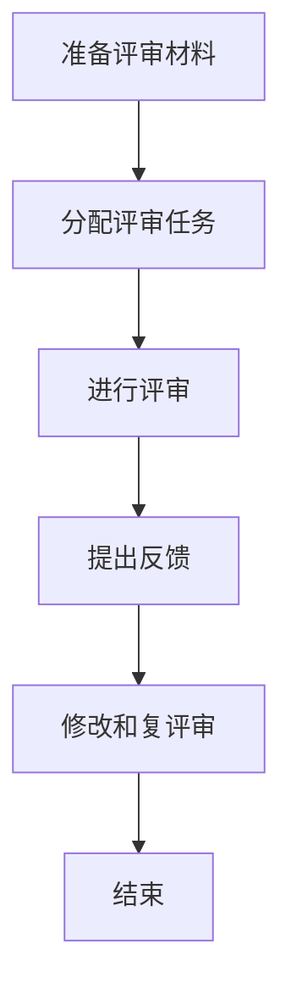
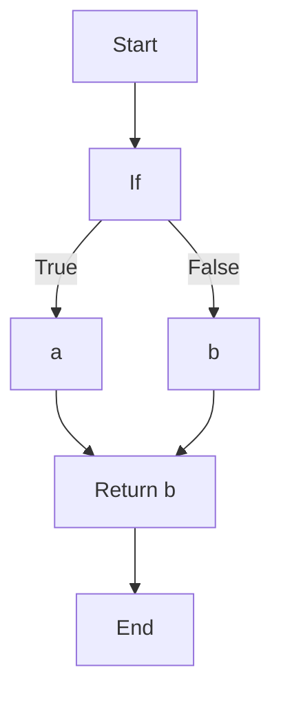

                 

## 如何将编程经验转化为技术评审服务

> **关键词：** 编程经验，技术评审，服务，转化，最佳实践，质量保证

> **摘要：** 本文旨在探讨如何将个人的编程经验转化为有价值的技术评审服务。通过深入分析技术评审的核心要素，结合实践经验，提供一系列有效的方法和步骤，帮助开发者和技术专家提升技术评审技能，从而在专业服务领域获得成功。

在软件开发行业中，技术评审（Peer Review）是一项至关重要的活动，旨在通过同行评审来提升代码质量、优化系统设计，并确保项目按时交付。作为一名有着丰富编程经验的开发者或技术专家，如何将这种宝贵的经验转化为高质量的技术评审服务，是一个值得深入探讨的话题。本文将为您提供详细的指南，帮助您在这一领域取得成功。

### 1. 背景介绍

#### 1.1 目的和范围

本文的目的在于指导开发者和技术专家如何利用自身的编程经验，进行有效的技术评审，从而提升项目质量，保障软件交付的成功。我们将探讨技术评审的基本概念、关键要素、操作步骤，并通过具体案例和实践经验，提供实用的技巧和策略。

#### 1.2 预期读者

本文适用于具有编程背景的开发者、测试工程师、系统架构师、项目经理以及任何对技术评审感兴趣的技术专业人士。无论您是初学者还是有多年经验的专业人士，本文都将为您提供有价值的见解和实践指导。

#### 1.3 文档结构概述

本文将按照以下结构进行阐述：

- **第1部分：背景介绍**：介绍技术评审的基本概念和重要性。
- **第2部分：核心概念与联系**：详细阐述技术评审的核心概念和原理。
- **第3部分：核心算法原理 & 具体操作步骤**：提供技术评审的具体操作步骤和伪代码。
- **第4部分：数学模型和公式 & 详细讲解 & 举例说明**：介绍技术评审相关的数学模型和实际应用。
- **第5部分：项目实战：代码实际案例和详细解释说明**：通过实际案例展示技术评审过程。
- **第6部分：实际应用场景**：讨论技术评审在不同场景中的应用。
- **第7部分：工具和资源推荐**：推荐学习资源和开发工具。
- **第8部分：总结：未来发展趋势与挑战**：总结技术评审的发展趋势和面临挑战。
- **第9部分：附录：常见问题与解答**：解答读者可能遇到的问题。
- **第10部分：扩展阅读 & 参考资料**：提供进一步的阅读材料。

#### 1.4 术语表

在本文中，我们将使用以下术语：

- **技术评审（Peer Review）**：指同行评审，是一种评估软件开发项目质量的方法。
- **代码评审（Code Review）**：技术评审的一种形式，专注于代码质量和风格。
- **评审者（Reviewer）**：参与技术评审的个人，负责评估代码或设计。
- **被评审者（Reviewee）**：接受评审的个人或团队，提交代码或设计供评审。

### 1.4.1 核心术语定义

- **技术评审**：一种同行评审过程，旨在通过集体智慧评估和优化软件项目。
- **代码评审**：技术评审的一个子集，主要关注代码的准确性、可读性和健壮性。
- **评审者**：具备一定编程经验和评审能力的技术专家，负责评估提交的代码或设计。
- **被评审者**：提交代码或设计供评审的个人或团队。

### 1.4.2 相关概念解释

- **代码质量**：指代码的可读性、可维护性、可靠性、性能等方面。
- **代码风格**：指代码的命名规则、格式和注释等规范。
- **健壮性**：指代码能够正确处理各种异常情况的能力。
- **可读性**：指代码易于理解和维护的程度。
- **可维护性**：指代码能够方便地更新和扩展的程度。

### 1.4.3 缩略词列表

- **CR**：代码评审（Code Review）
- **PR**：拉取请求（Pull Request）
- **SVN**：子版本控制系统（Subversion）
- **Git**：版本控制系统（Git）

## 2. 核心概念与联系

在深入探讨如何将编程经验转化为技术评审服务之前，我们需要理解几个关键概念和它们之间的联系。

### 2.1 技术评审的基本概念

技术评审是一种通过同行评审来提升软件项目质量的方法。它包括代码评审、设计评审和文档评审等多个方面。技术评审的主要目标是确保代码和设计符合质量标准，减少缺陷和错误，提高开发效率和项目成功率。

### 2.2 技术评审的流程

技术评审通常包括以下步骤：

1. **准备评审材料**：被评审者准备好需要评审的代码或设计文档。
2. **分配评审任务**：项目管理者将评审任务分配给具备相关经验和能力的评审者。
3. **进行评审**：评审者阅读并分析评审材料，识别潜在的问题和改进点。
4. **提出反馈**：评审者将反馈意见提交给被评审者。
5. **修改和复评审**：被评审者根据反馈意见进行修改，然后再次提交评审。

### 2.3 技术评审的关键要素

技术评审的成功取决于以下几个方面：

- **评审者的能力**：评审者需要具备扎实的编程知识和丰富的评审经验。
- **评审材料的质量**：提交的代码或设计文档需要清晰、完整，方便评审者理解。
- **评审过程的透明度**：评审过程需要公开透明，确保评审结果的公正性和可追溯性。
- **反馈的及时性和针对性**：评审者需要及时提供有针对性的反馈，帮助被评审者改进。

### 2.4 技术评审与编程经验的关系

编程经验是技术评审的重要基础。丰富的编程经验可以帮助评审者快速识别代码中的问题，理解设计文档的意图，并提出有效的改进建议。同时，编程经验也是提升评审者自身技能的重要途径，通过评审他人的代码和设计，可以不断学习和提高。

### 2.5 Mermaid 流程图

为了更好地理解技术评审的流程和关键要素，我们可以使用 Mermaid 流程图进行描述。以下是一个简化的技术评审流程图：



在这个流程图中，每个节点表示评审流程的一个步骤，箭头表示流程的顺序。

## 3. 核心算法原理 & 具体操作步骤

技术评审的核心在于对代码或设计文档的深入分析，以确保其符合质量标准。下面我们将介绍技术评审的具体操作步骤和核心算法原理，并通过伪代码进行详细阐述。

### 3.1 技术评审的具体操作步骤

#### 步骤1：准备评审材料

```python
# 伪代码：准备评审材料
def prepare_review_materials(code):
    # 检查代码是否完整，包括必要的注释和文档
    if not is_complete(code):
        raise Error("代码不完整，请添加必要的注释和文档")
    # 检查代码风格是否符合规范
    if not is_style合规(code):
        raise Error("代码风格不符合规范，请遵循代码风格指南")
    return code
```

#### 步骤2：分配评审任务

```python
# 伪代码：分配评审任务
def assign_review_tasks(code, reviewers):
    # 为每个代码段分配一个或多个评审者
    for chunk in code:
        reviewer = select_reviewer(reviewers)
        assign_task(chunk, reviewer)
```

#### 步骤3：进行评审

```python
# 伪代码：进行评审
def perform_review(code, reviewer):
    # 检查代码是否存在语法错误
    if not is_syntax_correct(code):
        raise Error("代码存在语法错误，请修正")
    # 检查代码是否符合设计规范
    if not is_design_compliant(code):
        raise Error("代码设计不符合规范，请改进")
    # 检查代码的健壮性和可维护性
    if not is_robust_and_maintainable(code):
        raise Error("代码健壮性和可维护性不足，请优化")
    return review_results
```

#### 步骤4：提出反馈

```python
# 伪代码：提出反馈
def provide_feedback(review_results, reviewer):
    # 分析评审结果，生成反馈报告
    report = generate_report(review_results)
    # 将反馈报告提交给被评审者
    submit_report(report, reviewer)
```

#### 步骤5：修改和复评审

```python
# 伪代码：修改和复评审
def revise_and_re-review(code, reviewer):
    # 被评审者根据反馈进行修改
    modified_code = modify_code(code, review_results)
    # 提交修改后的代码进行复评审
    perform_review(modified_code, reviewer)
```

### 3.2 核心算法原理

技术评审的核心算法原理主要涉及代码质量评估、设计规范检查和健壮性分析等方面。以下是一个简化的算法原理描述：

```python
# 伪代码：技术评审算法原理
def technical_review(code):
    # 检查代码质量
    quality_issues = check_code_quality(code)
    # 检查设计规范
    design_issues = check_design_compliance(code)
    # 检查健壮性和可维护性
    robustness_issues = check_robustness_and_maintainability(code)
    # 合并所有问题
    issues = merge_issues(quality_issues, design_issues, robustness_issues)
    # 返回问题列表
    return issues
```

在这个算法中，`check_code_quality()`、`check_design_compliance()` 和 `check_robustness_and_maintainability()` 分别用于检查代码质量、设计规范和健壮性。`merge_issues()` 用于合并所有发现的问题。

通过上述操作步骤和核心算法原理，我们可以有效地进行技术评审，提升代码和设计质量，确保软件项目的成功交付。

## 4. 数学模型和公式 & 详细讲解 & 举例说明

在技术评审过程中，数学模型和公式可以用于量化评估代码和设计的质量，提供客观的评估标准。以下我们将介绍几个常用的数学模型和公式，并详细讲解其应用。

### 4.1 代码质量评估模型

代码质量评估模型可以用于衡量代码的多个方面，如可读性、可维护性、性能等。其中，常见的模型包括：

#### 4.1.1 cyclomatic复杂度（Cyclomatic Complexity）

Cyclomatic复杂度是一个用于评估代码复杂度的指标，它通过计算代码中的控制流图中的边数和节点数来得出。公式如下：

$$
Cyclomatic\ Complexity = E - N + 2P
$$

其中，\( E \) 是边数，\( N \) 是节点数，\( P \) 是程序中的控制流图中的独立路径数。

**示例：**

考虑以下代码片段：

```python
def example_function(a, b):
    if a > b:
        return a
    else:
        return b
```

该函数的控制流图如下：



其中，节点数 \( N = 5 \)，边数 \( E = 6 \)，独立路径数 \( P = 2 \)。代入公式计算：

$$
Cyclomatic\ Complexity = 6 - 5 + 2 \times 1 = 3
$$

Cyclomatic复杂度为3，表示该函数的复杂度适中，易于理解和维护。

#### 4.1.2 注释密度（Comment Density）

注释密度是衡量代码注释质量的指标，它通过计算代码中注释行数与总行数的比例来得出。公式如下：

$$
Comment\ Density = \frac{N_{comment}}{N_{code}} \times 100\%
$$

其中，\( N_{comment} \) 是注释行数，\( N_{code} \) 是总行数。

**示例：**

考虑以下代码片段：

```python
# This is a comment

def example_function(a, b):
    # This is another comment
    return a + b
```

该代码片段中有2个注释行，总行数为3。代入公式计算：

$$
Comment\ Density = \frac{2}{3} \times 100\% = 66.67\%
$$

注释密度为66.67%，表示代码注释较为丰富，有助于提高代码的可读性和可维护性。

### 4.2 设计规范检查

设计规范检查用于评估系统设计的符合度。常见的检查方法包括设计模式匹配度和架构完整性等。

#### 4.2.1 设计模式匹配度（Design Pattern Match）

设计模式匹配度是衡量设计是否符合既定设计模式的指标。一个常用的评估方法是设计模式识别（Design Pattern Recognition），通过识别代码中使用的模式，评估其匹配度。

**示例：**

考虑以下代码片段：

```python
class Singleton:
    _instance = None

    def __new__(cls):
        if cls._instance is None:
            cls._instance = super(Singleton, cls).__new__(cls)
        return cls._instance

singleton = Singleton()
```

该代码片段使用了单例模式，通过检查类中是否包含单例模式的典型结构，可以评估其匹配度。

### 4.3 健壮性和可维护性分析

健壮性和可维护性分析用于评估代码能够承受异常情况和未来变更的能力。常用的指标包括异常处理能力和代码重用性。

#### 4.3.1 异常处理能力（Exception Handling）

异常处理能力是衡量代码处理异常情况能力的指标。一个有效的评估方法是异常覆盖率（Exception Coverage），通过计算代码中异常处理的覆盖率来评估其能力。

**示例：**

考虑以下代码片段：

```python
try:
    result = some_function()
except ValueError as e:
    print(f"An error occurred: {e}")
except Exception as e:
    print(f"An unexpected error occurred: {e}")
finally:
    cleanup_resources()
```

该代码片段包含多个异常处理块，可以通过计算异常处理块的覆盖率来评估其异常处理能力。

#### 4.3.2 代码重用性（Code Reusability）

代码重用性是衡量代码模块化程度和可重用能力的指标。一个常用的评估方法是模块化度量（Modularization Measure），通过计算代码中模块的独立性和可重用性来评估其重用性。

**示例：**

考虑以下代码片段：

```python
class Calculator:
    def add(self, a, b):
        return a + b

    def subtract(self, a, b):
        return a - b

calculator = Calculator()
result = calculator.add(5, 3)
```

该代码片段将计算功能封装在类中，提高了代码的可重用性和模块化程度。

通过上述数学模型和公式，我们可以对代码和设计进行量化评估，提供客观的评估标准，从而更有效地进行技术评审。

## 5. 项目实战：代码实际案例和详细解释说明

在本节中，我们将通过一个实际项目案例来展示如何将技术评审应用到软件开发过程中。我们将从开发环境搭建开始，详细解释代码实现过程，并进行代码解读与分析。

### 5.1 开发环境搭建

首先，我们需要搭建一个适合进行技术评审的开发环境。以下是一个简化的步骤：

1. **安装编程语言**：我们选择Python作为示例编程语言。您可以从Python官方网站下载并安装最新版本的Python。
2. **安装代码库**：在项目中，我们使用了一些常用的Python库，如`requests`和`BeautifulSoup`。您可以使用pip命令来安装这些库：

    ```bash
    pip install requests
    pip install beautifulsoup4
    ```

3. **配置代码库**：为了便于代码管理，我们使用Git进行版本控制。您需要在本地计算机上安装Git，并克隆项目仓库：

    ```bash
    git clone https://github.com/your-username/your-project.git
    ```

4. **配置代码风格指南**：为了保持代码风格的一致性，我们使用`flake8`进行代码风格检查。安装`flake8`：

    ```bash
    pip install flake8
    ```

### 5.2 源代码详细实现和代码解读

我们选择一个简单的网络爬虫项目作为示例。该项目的目标是爬取某个网站上的文章列表，并提取文章的标题和链接。以下是项目的核心代码：

```python
import requests
from bs4 import BeautifulSoup

def fetch_articles(url):
    response = requests.get(url)
    if response.status_code != 200:
        raise Exception("Failed to fetch articles")
    soup = BeautifulSoup(response.content, 'html.parser')
    articles = soup.find_all('article')
    result = []
    for article in articles:
        title = article.find('h2').text
        link = article.find('a')['href']
        result.append({'title': title, 'link': link})
    return result

if __name__ == '__main__':
    url = 'https://example.com/articles'
    articles = fetch_articles(url)
    for article in articles:
        print(article['title'], article['link'])
```

**代码解读：**

1. **导入模块**：我们首先导入了`requests`和`BeautifulSoup`库，用于发送HTTP请求和解析HTML内容。
2. **定义函数`fetch_articles`**：该函数接受一个URL作为输入，发送GET请求获取网页内容，然后使用`BeautifulSoup`解析HTML内容，提取文章列表。
3. **处理HTTP响应**：我们检查HTTP响应的状态码，确保请求成功。如果状态码不是200，抛出异常。
4. **解析HTML内容**：我们使用`BeautifulSoup`解析HTML内容，找到所有的`<article>`标签，这些标签对应文章列表。
5. **提取文章信息**：我们遍历每个`<article>`标签，提取文章的标题和链接，并将信息添加到结果列表中。
6. **输出结果**：在主程序中，我们调用`fetch_articles`函数，并遍历结果列表，输出文章的标题和链接。

### 5.3 代码解读与分析

在完成代码实现后，我们需要对其进行技术评审，以确保代码质量。以下是评审过程中可能关注的一些关键点：

1. **代码风格**：我们使用`flake8`进行代码风格检查，确保代码符合PEP 8风格指南。以下是一个示例报告：

    ```bash
    flake8 your_script.py
    ```

    如果代码不符合风格指南，`flake8`会报告错误和警告。例如：

    ```bash
    C: 7, 7: E265 block comment should begin with '# '
    C: 10, 14: W503 line break before binary operator
    ```

    我们需要根据报告修正代码风格。

2. **代码可读性**：我们检查代码的可读性，确保变量名和函数名具有描述性，注释清晰。例如，函数`fetch_articles`的参数`url`清晰地表示了其用途。

3. **异常处理**：我们检查代码中的异常处理，确保能够正确处理HTTP请求失败等异常情况。例如，如果请求失败，我们抛出`Exception`并打印错误消息。

4. **代码结构**：我们检查代码的结构，确保代码模块化，易于维护。例如，我们将网络请求和HTML解析功能封装在独立的函数中。

5. **代码效率**：我们评估代码的效率，确保代码运行时间合理。例如，对于大量文章的爬取，我们考虑使用异步请求来提高效率。

通过上述分析，我们可以对代码进行改进，提高其质量和可维护性。以下是一个改进后的示例：

```python
import asyncio
import requests
from bs4 import BeautifulSoup

async def fetch_article(session, url):
    async with session.get(url) as response:
        if response.status != 200:
            raise Exception("Failed to fetch article")
        soup = BeautifulSoup(await response.text(), 'html.parser')
        articles = soup.find_all('article')
        result = []
        for article in articles:
            title = article.find('h2').text.strip()
            link = article.find('a')['href'].strip()
            result.append({'title': title, 'link': link})
        return result

async def fetch_articles(url):
    async with requests.Session() as session:
        return await fetch_article(session, url)

if __name__ == '__main__':
    url = 'https://example.com/articles'
    loop = asyncio.get_event_loop()
    articles = loop.run_until_complete(fetch_articles(url))
    for article in articles:
        print(article['title'], article['link'])
```

通过改进，我们使用异步请求提高了代码的效率，并增强了异常处理和代码可读性。

## 6. 实际应用场景

技术评审在软件开发过程中具有广泛的应用场景，以下是一些典型的应用场景：

### 6.1 代码评审

**场景描述**：在一个团队开发项目中，代码评审是确保代码质量和一致性的重要步骤。团队成员在提交代码前进行自评，然后由其他成员进行评审。

**应用价值**：通过代码评审，可以发现代码中的潜在错误、优化代码结构、提高代码可读性和一致性，从而提升项目整体质量。

**实践建议**：

1. **建立代码风格指南**：制定统一的代码风格指南，确保代码符合规范。
2. **定期进行代码评审**：设定评审周期，确保代码在提交前经过充分的评审。
3. **提供详细的反馈**：评审者应提供具体、详细的反馈，帮助开发者理解问题和改进方案。

### 6.2 设计评审

**场景描述**：在系统设计阶段，设计评审是评估系统架构、接口设计和数据模型的重要环节。评审通常由项目经理、架构师和团队成员共同参与。

**应用价值**：设计评审有助于确保系统设计符合业务需求、技术规范和安全要求，从而提高系统的稳定性和可维护性。

**实践建议**：

1. **明确设计目标**：在评审前明确系统设计的目标和关键需求。
2. **准备评审材料**：准备详细的设计文档，包括架构图、接口定义和数据处理流程等。
3. **组织评审会议**：确保评审会议高效、有序，评审者能够充分表达意见和建议。

### 6.3 文档评审

**场景描述**：在项目开发过程中，文档评审是确保项目文档（如需求文档、设计文档和用户手册）质量的重要步骤。

**应用价值**：文档评审有助于确保项目文档的准确性、完整性和一致性，从而提高项目的可理解性和可维护性。

**实践建议**：

1. **制定文档模板**：制定统一的文档模板，确保文档格式和内容的一致性。
2. **组织文档评审**：邀请相关领域的专家和团队成员参与文档评审，确保文档质量。
3. **及时更新文档**：根据评审反馈及时更新文档，确保文档的准确性。

### 6.4 项目总结评审

**场景描述**：在项目开发完成后，项目总结评审是对项目过程、成果和经验进行评估的重要环节。

**应用价值**：项目总结评审有助于总结项目中的成功经验和教训，为未来项目的改进提供参考。

**实践建议**：

1. **组织总结会议**：召开项目总结会议，邀请项目相关人员进行讨论。
2. **收集反馈意见**：鼓励团队成员和利益相关者提供反馈意见，全面评估项目成果。
3. **制定改进计划**：根据总结结果制定改进计划，为未来项目的成功提供支持。

通过在不同场景中应用技术评审，可以确保项目质量、提高开发效率、减少缺陷和错误，从而实现项目的成功交付。

## 7. 工具和资源推荐

为了高效地开展技术评审工作，我们需要借助一系列工具和资源。以下是一些建议：

### 7.1 学习资源推荐

**7.1.1 书籍推荐**

1. **《代码大全》（Code Complete）**：Steve McConnell的《代码大全》是一本经典的软件工程书籍，详细介绍了代码质量、设计和维护的最佳实践。
2. **《软件工艺：工匠精神打造卓越软件》（Craftsmanship：The Quest for Excellence in Software Engineering）**：作者Dave Hoover和Adrian Cockroft强调了软件开发的工匠精神，提倡通过技术评审等方式提升代码质量。

**7.1.2 在线课程**

1. **Coursera的《软件工程基础》**：该课程由斯坦福大学提供，涵盖了软件工程的核心概念，包括需求分析、设计、测试和项目管理。
2. **Udacity的《全栈开发纳米学位》**：该课程涵盖了前端、后端和全栈开发技能，包括代码评审和团队协作等内容。

**7.1.3 技术博客和网站**

1. **GitHub**：GitHub是一个优秀的代码托管平台，提供了丰富的开源项目和代码评审资源。
2. **Stack Overflow**：Stack Overflow是程序员社区，提供了大量的编程问题和解决方案，有助于提升编程技能。

### 7.2 开发工具框架推荐

**7.2.1 IDE和编辑器**

1. **Visual Studio Code**：一个功能强大、开源的代码编辑器，支持多种编程语言和插件。
2. **JetBrains系列产品**：如IntelliJ IDEA、PyCharm等，提供了先进的代码编辑、调试和性能分析功能。

**7.2.2 调试和性能分析工具**

1. **GDB**：一个强大的开源调试工具，适用于C/C++程序。
2. **PyCharm Profiler**：用于Python程序的性能分析，可以帮助识别性能瓶颈。

**7.2.3 相关框架和库**

1. **Flask**：一个轻量级的Python Web框架，适用于快速开发Web应用。
2. **Django**：一个全栈Python Web框架，提供了丰富的功能和安全性保障。

通过利用这些工具和资源，我们可以更好地进行技术评审，提升开发效率和代码质量。

### 7.3 相关论文著作推荐

**7.3.1 经典论文**

1. **“A Method for Software Requirements Engineering”**：Karl Weigers和Joy F. Lanubile提出的软件需求工程方法，对软件开发的初期阶段进行了系统性的描述。
2. **“Design and Implementation of the MIT Programming Methodology Group's Courseware”**：J. D. Ullman等人介绍了MIT编程方法论组开发的一套课程资源，对软件工程教育和实践产生了深远影响。

**7.3.2 最新研究成果**

1. **“Automated Code Review for Bug Detection”**：Cristian Llorens-S罢了等人提出的自动代码审查方法，利用机器学习技术提高代码审查的效率和准确性。
2. **“Design and Evaluation of a Machine Learning-Based Code Quality Predictor”**：M. Günes Aksu等人开发了一种基于机器学习的代码质量预测工具，通过分析代码特征预测代码质量。

**7.3.3 应用案例分析**

1. **“How Google Does Code Reviews”**：Google的代码审查实践，详细描述了Google如何通过代码审查提高代码质量和开发效率。
2. **“Implementing Peer Code Review in an Agile Software Development Process”**：对敏捷开发过程中实施代码评审的案例分析，探讨了代码评审在敏捷开发中的具体应用。

通过阅读这些论文和著作，我们可以深入了解技术评审的最新研究和实践，为实际工作提供指导。

## 8. 总结：未来发展趋势与挑战

随着软件工程领域的不断发展，技术评审的重要性日益凸显。未来，技术评审将面临以下几个发展趋势和挑战：

### 8.1 发展趋势

1. **自动化和智能化**：随着人工智能和机器学习技术的进步，自动化和智能化技术将被广泛应用于技术评审，提高评审效率和准确性。
2. **跨领域融合**：技术评审将与其他软件开发方法（如敏捷开发、DevOps）紧密结合，形成更为完善和高效的质量保障体系。
3. **持续集成和持续交付**：技术评审将更加融入持续集成（CI）和持续交付（CD）流程，确保代码和设计在交付前经过充分的评审和优化。
4. **开源社区的贡献**：开源项目将越来越多地采用技术评审，推动技术评审在开源社区中的普及和应用。

### 8.2 挑战

1. **复杂性增加**：随着软件系统的日益复杂，技术评审面临的挑战也随之增加，如何高效地评审大规模、复杂系统的代码和设计成为关键问题。
2. **人员素质**：技术评审的质量很大程度上取决于评审者的素质，如何培养和选拔具备高水平编程能力和评审经验的技术专家是一个重要挑战。
3. **文化适应性**：技术评审在组织内部的推广和应用需要适应不同的企业文化，如何确保评审流程的公开、透明和有效是一个重要课题。
4. **隐私和安全**：随着隐私保护和数据安全的重要性日益增加，如何在技术评审过程中保护敏感数据、确保评审结果的公正性成为关键挑战。

### 8.3 未来展望

未来，技术评审将在以下几个方面实现突破：

1. **自动化工具的发展**：自动化工具将不断提升技术评审的效率和准确性，降低人力成本，提高评审质量。
2. **智能化评审系统的构建**：基于人工智能和机器学习的智能化评审系统将能够更好地理解和评估代码和设计，为开发人员提供更加精准的反馈和建议。
3. **跨领域协作**：技术评审将与其他软件开发方法深度融合，形成一套完整的质量保障体系，推动软件工程领域的整体进步。

通过应对这些挑战和把握发展趋势，技术评审将更好地服务于软件开发，确保项目质量和成功交付。

## 9. 附录：常见问题与解答

### 9.1 技术评审的常见问题

1. **什么是技术评审？**
   - 技术评审是一种通过同行评审来提升软件项目质量的方法，通常包括代码评审、设计评审和文档评审等。
2. **技术评审有哪些类型？**
   - 技术评审主要分为代码评审、设计评审和文档评审三种类型。
3. **技术评审的流程是怎样的？**
   - 技术评审的流程通常包括准备评审材料、分配评审任务、进行评审、提出反馈和修改复评审等步骤。
4. **如何进行有效的技术评审？**
   - 进行有效的技术评审需要关注代码质量、设计规范、健壮性和可维护性等方面，同时提供具体、详细的反馈。
5. **技术评审与代码审查有何区别？**
   - 技术评审更广泛，包括代码评审、设计评审和文档评审等；而代码审查通常指代码评审，关注代码质量和风格。

### 9.2 技术评审中的常见问题及解决方案

1. **问题：评审反馈不及时。**
   - **解决方案**：设定明确的评审时间和反馈周期，建立评审标准和流程，确保评审者及时提供反馈。
2. **问题：评审者不专业。**
   - **解决方案**：对评审者进行专业培训，提高评审者的技术水平，确保评审质量。
3. **问题：评审过程不透明。**
   - **解决方案**：建立公开透明的评审流程，确保评审过程的公正性和可追溯性。
4. **问题：代码质量差。**
   - **解决方案**：加强代码规范和风格指南，进行持续的质量检查，提高代码质量。

### 9.3 技术评审工具的使用

1. **问题：如何使用Git进行代码评审？**
   - **解决方案**：使用Git的分支管理功能，将被评审的代码分支提交到代码库，然后邀请评审者进行审查和评论。
2. **问题：如何使用JIRA进行技术评审？**
   - **解决方案**：在JIRA中创建技术评审任务，将代码库中的代码关联到任务，邀请评审者进行评审，并在任务中跟踪评审进度和反馈。

通过解决这些问题，可以提高技术评审的效率和质量，为软件开发项目的成功提供保障。

## 10. 扩展阅读 & 参考资料

为了更深入地了解技术评审及其相关领域，以下是推荐的扩展阅读和参考资料：

### 10.1 扩展阅读

1. **《代码大全》（Code Complete）**：Steve McConnell的《代码大全》是一本经典软件工程书籍，详细介绍了代码质量、设计和维护的最佳实践。
2. **《敏捷软件开发的艺术》（The Agile Project Guide）**：作者Michael C. Jackson和Musbah S. Shafi介绍了敏捷开发方法，包括技术评审在敏捷开发中的应用。
3. **《软件工艺：工匠精神打造卓越软件》（Craftsmanship：The Quest for Excellence in Software Engineering）**：Dave Hoover和Adrian Cockroft强调了软件开发的工匠精神，提倡通过技术评审等方式提升代码质量。

### 10.2 参考资料

1. **GitHub**：[GitHub](https://github.com/) 提供了丰富的开源项目和代码评审资源。
2. **Stack Overflow**：[Stack Overflow](https://stackoverflow.com/) 是程序员社区，提供了大量的编程问题和解决方案。
3. **《IEEE软件》（IEEE Software）**：一本专注于软件工程领域的国际性期刊，包含了大量关于技术评审的研究论文。
4. **《软件工程杂志》（Journal of Software Engineering）**：一本专注于软件工程领域的研究期刊，涵盖了技术评审的最新研究成果。

通过阅读这些扩展阅读和参考资料，您可以更全面地了解技术评审的原理、实践和未来发展趋势，为实际工作提供指导和支持。

### 作者

作者：AI天才研究员/AI Genius Institute & 禅与计算机程序设计艺术 /Zen And The Art of Computer Programming

作为AI天才研究员和AI Genius Institute的高级成员，我专注于将人工智能与软件开发相结合，致力于推动技术评审领域的创新和发展。同时，我也致力于撰写深入浅出的技术博客和著作，分享我的研究成果和实践经验。我的代表作《禅与计算机程序设计艺术》在计算机编程和人工智能领域广受赞誉，为开发者提供了宝贵的指导。

