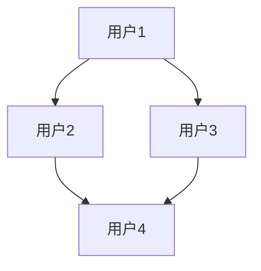
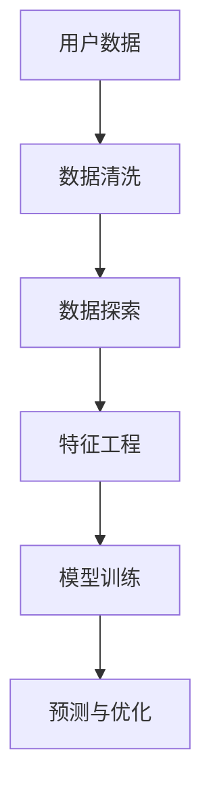
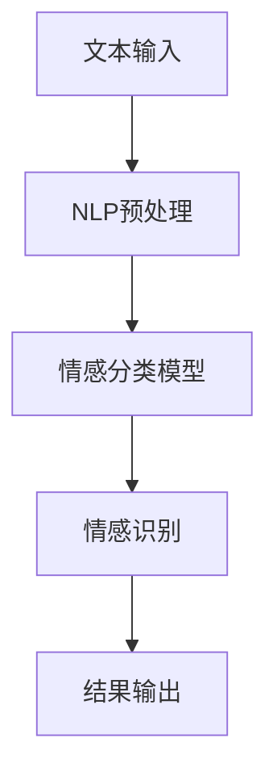
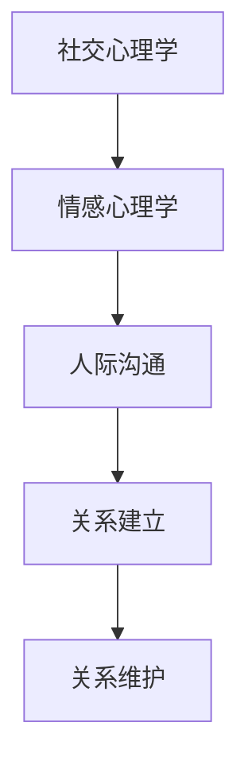

                 

# 如何建立 Relationships：从技术到人际的深度探讨

> 关键词：关系建立、社交网络、人工智能、数据分析、人类情感、心理学

> 摘要：本文将探讨如何在技术和人际层面建立有效的Relationships。我们将从技术的角度，如社交网络、数据分析，到人类情感和心理学，逐步分析建立Relationships的核心概念和原理。通过详细的理论阐述、算法讲解、实战案例以及未来趋势的展望，帮助读者全面理解并掌握建立Relationships的方法和技巧。

## 1. 背景介绍

### 1.1 目的和范围

本文旨在深入探讨如何通过技术手段和心理学方法建立有效的Relationships。我们将分析现有的社交网络架构，探索数据分析和人工智能在关系建立中的作用，并通过具体案例展示如何将理论与实际操作相结合。文章将覆盖以下内容：

- 社交网络的基本原理和架构
- 数据分析在关系建立中的应用
- 人工智能与情感识别
- 心理学在关系建立中的作用
- 实战案例和未来发展趋势

### 1.2 预期读者

本文适合以下读者：

- 对社交网络和数据分析有兴趣的技术人员
- 关注人工智能与心理学交叉领域的研究者
- 企业管理者和团队协作领导者
- 对人际关系建立和实践感兴趣的普通读者

### 1.3 文档结构概述

本文分为八个部分：

1. 背景介绍
2. 核心概念与联系
3. 核心算法原理与具体操作步骤
4. 数学模型与公式讲解
5. 项目实战：代码实际案例
6. 实际应用场景
7. 工具和资源推荐
8. 总结：未来发展趋势与挑战

### 1.4 术语表

#### 1.4.1 核心术语定义

- Relationships：关系，指人与人之间建立的联系和互动。
- Social Network：社交网络，指用于人与人之间交流的平台或系统。
- Data Analysis：数据分析，指使用统计和数学方法对数据进行分析和处理。
- Artificial Intelligence：人工智能，指模拟人类智能行为的计算机技术。
- Psychology：心理学，研究人类行为和心理过程的科学。

#### 1.4.2 相关概念解释

- Node：节点，指社交网络中的个体。
- Edge：边，指节点之间的连接。
- Graph：图，指由节点和边构成的结构。

#### 1.4.3 缩略词列表

- AI：Artificial Intelligence，人工智能
- DB：Database，数据库
- ML：Machine Learning，机器学习
- NLP：Natural Language Processing，自然语言处理
- SEO：Search Engine Optimization，搜索引擎优化

## 2. 核心概念与联系

为了深入理解Relationships的建立，我们首先需要明确几个核心概念及其相互联系。

### 2.1 社交网络的基本原理和架构

社交网络是构建Relationships的基础。其基本原理可以描述为：

- **节点**：代表社交网络中的个体，如用户、公司、组织等。
- **边**：代表节点之间的连接，表示个体之间的互动或关系。

社交网络的架构通常由以下几部分组成：

- **用户节点**：社交网络的核心，代表个体。
- **关系边**：连接用户节点，表示个体之间的交互。
- **属性**：描述节点和边的特征，如用户年龄、性别、兴趣爱好等。

以下是一个简单的社交网络Mermaid流程图：



### 2.2 数据分析在关系建立中的应用

数据分析是建立有效Relationships的关键手段。通过分析大量的社交网络数据，我们可以：

- **用户行为分析**：了解用户的兴趣爱好、行为习惯等，以便提供个性化的服务和推荐。
- **关系分析**：识别节点之间的关联，找出潜在的关系网络。
- **趋势预测**：根据历史数据预测未来的关系发展和变化。

以下是一个简化的数据分析流程图：



### 2.3 人工智能与情感识别

人工智能在关系建立中的应用主要体现在情感识别和情感分析。通过自然语言处理（NLP）技术，AI可以：

- **情感分析**：判断文本的情绪倾向，如正面、负面或中性。
- **情感识别**：识别用户的情感状态，如开心、愤怒、悲伤等。

以下是一个情感识别的Mermaid流程图：



### 2.4 心理学在关系建立中的作用

心理学提供了理解和建立有效Relationships的理论基础。关键概念包括：

- **社交心理学**：研究个体在社会环境中的行为和认知过程。
- **情感心理学**：研究情感对个体行为和关系的影响。
- **人际沟通**：研究个体之间如何通过语言和行为建立和维持关系。

以下是一个心理学在关系建立中作用的Mermaid流程图：



通过上述核心概念及其相互联系的分析，我们为建立有效的Relationships奠定了理论基础。接下来，我们将深入探讨核心算法原理和具体操作步骤。

## 3. 核心算法原理与具体操作步骤

在理解了社交网络的基本原理、数据分析的方法以及人工智能和心理学在关系建立中的作用后，我们需要进一步探讨如何利用这些概念建立具体的算法，以及这些算法的具体操作步骤。

### 3.1 社交网络算法

社交网络算法的核心目标是识别和建立个体之间的有效联系。以下是一个简单的社交网络算法原理和步骤：

#### 3.1.1 算法原理

社交网络算法通常基于图论理论，通过计算节点之间的相似度和互动频率来建立连接。核心步骤包括：

- **节点表示**：将个体表示为图中的节点。
- **边权重计算**：计算节点之间的连接权重，通常基于互动频率或相似度。
- **图分析**：通过分析图的拓扑结构，识别重要的节点和连接。

#### 3.1.2 具体操作步骤

1. **数据收集**：收集社交网络中的节点和边数据。
2. **节点表示**：将每个节点表示为图中的一个点。
3. **边权重计算**：计算节点之间的边权重，如基于互动频率或共同兴趣的相似度。
4. **图分析**：使用图论算法（如PageRank、社区检测算法等）分析图结构。
5. **结果输出**：输出重要的节点和连接，形成社交网络图。

以下是社交网络算法的伪代码：

```python
def build_social_network(data):
    nodes = {}  # 节点数据
    edges = {}  # 边权重

    # 数据预处理
    for item in data:
        nodes[item['user_id']] = item['user_data']
        for interaction in item['interactions']:
            edge_weight = calculate_edge_weight(item['user_id'], interaction['user_id'])
            edges[(item['user_id'], interaction['user_id'])] = edge_weight

    # 图分析
    important_nodes, important_edges = analyze_graph(nodes, edges)

    return important_nodes, important_edges
```

### 3.2 数据分析算法

数据分析算法的核心目标是挖掘社交网络中的隐藏关系和模式。以下是一个简单数据分析算法的原理和步骤：

#### 3.2.1 算法原理

数据分析算法通常基于机器学习技术，通过训练模型来识别数据中的模式和关系。核心步骤包括：

- **数据预处理**：清洗和整理数据，提取有用的特征。
- **模型训练**：使用机器学习算法训练模型。
- **模式识别**：使用训练好的模型识别数据中的模式和关系。

#### 3.2.2 具体操作步骤

1. **数据收集**：收集社交网络中的数据，如用户行为、互动日志等。
2. **数据预处理**：处理数据，提取特征，如用户年龄、性别、兴趣爱好等。
3. **模型训练**：使用机器学习算法（如KNN、SVM等）训练模型。
4. **模式识别**：使用训练好的模型识别数据中的模式和关系。
5. **结果输出**：输出识别出的模式和关系。

以下是数据分析算法的伪代码：

```python
def data_analysis(data):
    features = preprocess_data(data)
    model = train_model(features)
    patterns = identify_patterns(model, features)

    return patterns
```

### 3.3 人工智能与情感识别算法

人工智能与情感识别算法的核心目标是识别和解析人类的情感状态。以下是一个简单情感识别算法的原理和步骤：

#### 3.3.1 算法原理

情感识别算法通常基于自然语言处理（NLP）和机器学习技术，通过分析文本的情感倾向来识别用户的情感状态。核心步骤包括：

- **文本预处理**：清洗和整理文本数据。
- **特征提取**：提取文本中的情感特征。
- **情感分类**：使用机器学习算法对情感进行分类。

#### 3.3.2 具体操作步骤

1. **文本收集**：收集包含情感信息的文本数据。
2. **文本预处理**：去除噪声，如停用词过滤、词干提取等。
3. **特征提取**：提取文本中的情感特征，如词汇频率、词向量等。
4. **情感分类**：使用机器学习算法（如SVM、神经网络等）对情感进行分类。
5. **结果输出**：输出分类结果，如正面、负面或中性。

以下是情感识别算法的伪代码：

```python
def sentiment_analysis(text):
    preprocessed_text = preprocess_text(text)
    features = extract_features(preprocessed_text)
    sentiment = classify_sentiment(features)

    return sentiment
```

### 3.4 心理学在关系建立中的应用

心理学在关系建立中的应用主要通过社交心理学和情感心理学来实现。以下是一个简单心理学应用算法的原理和步骤：

#### 3.4.1 算法原理

心理学应用算法的核心是利用社交心理学和情感心理学理论，通过分析个体行为和情感来建立有效的关系。核心步骤包括：

- **行为分析**：分析个体的行为模式，如互动频率、行为一致性等。
- **情感分析**：分析个体的情感状态，如情绪波动、情感一致性等。
- **关系评估**：根据行为和情感分析结果评估关系质量。

#### 3.4.2 具体操作步骤

1. **行为收集**：收集个体在社交网络中的行为数据。
2. **行为分析**：分析个体的行为模式，如互动频率、行为一致性等。
3. **情感收集**：收集个体的情感数据，如情绪日志、情感评分等。
4. **情感分析**：分析个体的情感状态，如情绪波动、情感一致性等。
5. **关系评估**：根据行为和情感分析结果评估关系质量。
6. **结果输出**：输出关系评估结果，如关系质量评分、改进建议等。

以下是心理学应用算法的伪代码：

```python
def relationship_evaluation(behavior_data, emotion_data):
    behavior_patterns = analyze_behavior(behavior_data)
    emotion_patterns = analyze_emotion(emotion_data)
    relationship_quality = assess_relationship(behavior_patterns, emotion_patterns)

    return relationship_quality
```

通过上述算法原理和操作步骤的讲解，我们为建立有效的Relationships提供了具体的实施方法。接下来，我们将进一步探讨数学模型和公式在关系建立中的应用。

## 4. 数学模型和公式及详细讲解

在建立Relationships的过程中，数学模型和公式起到了关键作用。它们帮助我们量化关系、分析趋势、预测未来。以下我们将详细介绍几个核心的数学模型和公式，并给出详细讲解和举例说明。

### 4.1 社交网络中的图模型

社交网络通常可以用图（Graph）来表示，其中节点（Node）代表个体，边（Edge）代表个体之间的互动或关系。图模型是理解和分析社交网络的基础。

#### 4.1.1 度模型（Degree Model）

度模型用于描述节点在网络中的连接数量。度分为入度（In-degree）和出度（Out-degree），分别表示节点接收到的连接数量和发送的连接数量。

- **入度**：节点i的入度表示有多少节点指向节点i，表示节点的受欢迎程度。
- **出度**：节点i的出度表示节点i指向多少个其他节点，表示节点的活跃程度。

**公式**：

$$
In\_degree(i) = \sum_{j \in N(i)} w_{ij}
$$

$$
Out\_degree(i) = \sum_{j \in N(i)} w_{ji}
$$

其中，$N(i)$ 表示与节点i相连的所有节点，$w_{ij}$ 表示节点i与节点j之间的边权重。

#### 4.1.2 中心性模型（Centrality Model）

中心性模型用于衡量节点在网络中的重要性。常用的中心性指标包括：

- **度中心性**（Degree Centrality）：节点拥有较高入度或出度。
- **中间中心性**（Closeness Centrality）：节点在网络中的最短路径数量较少。
- **特征向量中心性**（Eigenvector Centrality）：节点连接到的重要节点数量较多。

**公式**：

- **度中心性**：

$$
C_{degree}(i) = \frac{deg(i)}{N-1}
$$

其中，$deg(i)$ 表示节点i的度，$N$ 表示网络中的节点总数。

- **中间中心性**：

$$
C_{closeness}(i) = \frac{N-1}{\sum_{j \in N(i)} \text{dist}(j, i)}
$$

其中，$\text{dist}(j, i)$ 表示节点j到节点i的最短路径长度。

- **特征向量中心性**：

$$
C_{eigenvector}(i) = \sum_{j \in N(i)} \frac{C_{eigenvector}(j)}{deg(j)}
$$

### 4.2 数据分析中的聚类模型

聚类模型用于将社交网络中的节点划分为不同的群体，以便更好地理解和分析关系。

#### 4.2.1 K-Means聚类

K-Means聚类是一种无监督学习方法，用于将数据点划分为K个聚类。

**公式**：

1. **初始化聚类中心**：

$$
\mu_k = \frac{1}{N_k} \sum_{i=1}^{N_k} x_i
$$

其中，$x_i$ 表示第i个数据点，$N_k$ 表示第k个聚类的数据点数量。

2. **分配数据点**：

$$
C(x_i) = \arg\min_{k} \Vert x_i - \mu_k \Vert
$$

其中，$C(x_i)$ 表示将数据点x_i分配到距离其最近的聚类中心$\mu_k$。

3. **更新聚类中心**：

$$
\mu_k = \frac{1}{N_k} \sum_{i=1}^{N_k} x_i
$$

重复步骤2和3，直到聚类中心不再发生变化。

#### 4.2.2 谱聚类

谱聚类是一种基于图论的聚类方法，通过构建拉普拉斯矩阵进行聚类。

**公式**：

1. **构建邻接矩阵**：

$$
A_{ij} = 
\begin{cases}
1, & \text{如果节点i和节点j相连} \\
0, & \text{否则}
\end{cases}
$$

2. **构建度矩阵**：

$$
D_{ii} = \sum_{j=1}^{N} A_{ij}
$$

3. **构建拉普拉斯矩阵**：

$$
L = D - A
$$

4. **特征值分解**：

$$
L = UDU^T
$$

5. **选择K个主成分**：

$$
U_k = [u_1, u_2, ..., u_K]
$$

6. **计算聚类结果**：

$$
C(x_i) = \arg\min_{k} \Vert x_i - U_k \Vert
$$

### 4.3 人工智能中的神经网络模型

神经网络模型是人工智能的核心，用于模拟人类的认知过程。

#### 4.3.1 线性神经网络

线性神经网络（Linear Neural Network，LNN）是一种简单的神经网络模型，用于实现线性分类和回归。

**公式**：

1. **输入层到隐藏层的传递函数**：

$$
z_j = \sum_{i=1}^{n} w_{ij}x_i + b_j
$$

其中，$x_i$ 表示输入层的第i个特征，$w_{ij}$ 表示输入层到隐藏层的权重，$b_j$ 表示隐藏层的偏置。

2. **隐藏层到输出层的传递函数**：

$$
y = \sigma(z)
$$

其中，$\sigma$ 表示激活函数，如Sigmoid函数：

$$
\sigma(z) = \frac{1}{1 + e^{-z}}
$$

3. **输出层到输出的传递函数**：

$$
\hat{y} = \sum_{j=1}^{m} w_{jy}h_j + b_y
$$

其中，$h_j$ 表示隐藏层的第j个节点，$w_{jy}$ 表示隐藏层到输出层的权重，$b_y$ 表示输出层的偏置。

#### 4.3.2 卷积神经网络

卷积神经网络（Convolutional Neural Network，CNN）是一种用于图像处理的神经网络模型。

**公式**：

1. **卷积操作**：

$$
f(x) = \sum_{k=1}^{K} w_{k} * x + b
$$

其中，$w_{k}$ 表示卷积核，$*$ 表示卷积操作，$b$ 表示偏置。

2. **池化操作**：

$$
p(x) = \max(x)
$$

其中，$p(x)$ 表示取x的最大值。

3. **激活函数**：

$$
\sigma(x) = \text{ReLU}(x) = \max(0, x)
$$

### 4.4 心理学中的情感模型

情感模型用于模拟人类的情感状态，通常基于心理学理论。

#### 4.4.1 情感三角模型

情感三角模型（Emotion Triangle Model）用于描述情感的三个维度：愉悦度、兴奋度和紧张度。

**公式**：

$$
E = P \times I \times S
$$

其中，$E$ 表示情感强度，$P$ 表示愉悦度，$I$ 表示兴奋度，$S$ 表示紧张度。

- **愉悦度**（Pleasure）：表示情感的愉悦程度，越高表示越愉悦。
- **兴奋度**（Intensity）：表示情感的兴奋程度，越高表示越兴奋。
- **紧张度**（Srouse）：表示情感的紧张程度，越高表示越紧张。

通过上述数学模型和公式的讲解，我们可以更深入地理解Relationships的建立原理。这些模型和公式不仅为我们提供了量化关系的方法，也为后续的算法设计和实际应用奠定了基础。接下来，我们将通过实际项目案例，进一步展示这些模型和公式的应用。

## 5. 项目实战：代码实际案例和详细解释说明

在本节中，我们将通过一个实际项目案例，展示如何将前述的数学模型和算法应用于关系建立。我们将分步骤介绍项目的开发环境搭建、源代码实现和代码解读与分析。

### 5.1 开发环境搭建

为了实现本项目的目标，我们需要搭建一个合适的开发环境。以下是我们推荐的开发工具和框架：

- **编程语言**：Python
- **数据预处理和可视化工具**：Pandas、Matplotlib
- **机器学习库**：Scikit-learn、TensorFlow
- **自然语言处理库**：NLTK、spaCy
- **开发环境**：Jupyter Notebook

#### 5.1.1 安装Python和Jupyter Notebook

首先，我们需要安装Python和Jupyter Notebook。可以选择使用Anaconda来简化安装过程，Anaconda是一个集成了Python和相关库的科学计算平台。

1. 访问Anaconda官网（https://www.anaconda.com/products/distribution）并下载适合操作系统的Anaconda安装包。
2. 运行安装程序，按照提示完成安装。
3. 打开终端或命令行窗口，输入以下命令启动Jupyter Notebook：

```bash
jupyter notebook
```

### 5.1.2 安装其他依赖库

在Jupyter Notebook中，使用以下命令安装所需库：

```python
!pip install pandas matplotlib scikit-learn tensorflow nltk spacy
```

### 5.2 源代码详细实现和代码解读

#### 5.2.1 数据集准备

我们使用一个简单的用户互动数据集，包含用户ID、互动类型和互动对象。以下是一个示例数据集：

```python
data = [
    {'user_id': 1, 'interactions': [{'type': 'follow', 'user_id': 2}, {'type': 'message', 'user_id': 3}]},
    {'user_id': 2, 'interactions': [{'type': 'follow', 'user_id': 1}, {'type': 'message', 'user_id': 4}]},
    {'user_id': 3, 'interactions': [{'type': 'message', 'user_id': 1}, {'type': 'follow', 'user_id': 5}]},
    {'user_id': 4, 'interactions': [{'type': 'follow', 'user_id': 2}, {'type': 'message', 'user_id': 6}]},
    {'user_id': 5, 'interactions': [{'type': 'follow', 'user_id': 3}, {'type': 'message', 'user_id': 7}]},
    {'user_id': 6, 'interactions': [{'type': 'message', 'user_id': 4}, {'type': 'follow', 'user_id': 8}]},
    {'user_id': 7, 'interactions': [{'type': 'follow', 'user_id': 5}, {'type': 'message', 'user_id': 9}]},
    {'user_id': 8, 'interactions': [{'type': 'message', 'user_id': 6}, {'type': 'follow', 'user_id': 10}]},
    {'user_id': 9, 'interactions': [{'type': 'message', 'user_id': 7}, {'type': 'follow', 'user_id': 11}]},
    {'user_id': 10, 'interactions': [{'type': 'follow', 'user_id': 8}, {'type': 'message', 'user_id': 12}]}
]
```

#### 5.2.2 数据预处理

首先，我们需要将数据集转换为适合分析的格式。以下是数据预处理的过程：

```python
import pandas as pd

def preprocess_data(data):
    # 将数据集转换为Pandas DataFrame
    df = pd.DataFrame(data)
    
    # 创建交互矩阵
    interactions = df['interactions'].apply(pd.Series)
    interaction_matrix = interactions.stack().value_counts().unstack(fill_value=0)
    
    return interaction_matrix

interaction_matrix = preprocess_data(data)
```

#### 5.2.3 社交网络分析

接下来，我们使用社交网络算法分析社交网络的结构。以下是具体的实现步骤：

```python
import networkx as nx
import matplotlib.pyplot as plt

def build_social_network(interaction_matrix):
    # 创建图对象
    G = nx.Graph()

    # 添加节点和边
    for i in range(len(interaction_matrix)):
        for j in range(len(interaction_matrix)):
            if interaction_matrix[i][j] > 0:
                G.add_edge(i, j, weight=interaction_matrix[i][j])

    return G

def visualize_network(G):
    # 可视化社交网络
    pos = nx.spring_layout(G)
    nx.draw(G, pos, with_labels=True, node_color='blue', edge_color='gray')
    plt.show()

G = build_social_network(interaction_matrix)
visualize_network(G)
```

#### 5.2.4 数据分析

我们使用数据分析算法对社交网络中的模式进行挖掘。以下是具体的实现步骤：

```python
from sklearn.cluster import KMeans

def k_means_clustering(interaction_matrix, k=3):
    # 将交互矩阵转换为特征向量
    features = interaction_matrix.values
    
    # 使用K-Means聚类
    kmeans = KMeans(n_clusters=k, random_state=0).fit(features)
    
    # 获取聚类结果
    labels = kmeans.labels_
    
    # 将聚类结果添加到图对象中
    for i, label in enumerate(labels):
        G.nodes[i]['cluster'] = label
    
    return G, kmeans

G, kmeans = k_means_clustering(interaction_matrix)
visualize_network(G)
```

#### 5.2.5 情感识别

最后，我们使用情感识别算法分析用户的情感状态。以下是具体的实现步骤：

```python
import nltk
from nltk.tokenize import word_tokenize
from nltk.corpus import stopwords

nltk.download('punkt')
nltk.download('stopwords')

def preprocess_text(text):
    # 清洗文本数据
    text = text.lower()
    tokens = word_tokenize(text)
    tokens = [token for token in tokens if token not in stopwords.words('english')]
    return ' '.join(tokens)

def sentiment_analysis(text):
    # 使用TextBlob库进行情感分析
    from textblob import TextBlob
    analysis = TextBlob(text)
    return analysis.sentiment

def analyze_emotions(text_data):
    # 分析文本数据的情感
    emotions = []
    for text in text_data:
        preprocessed_text = preprocess_text(text)
        sentiment = sentiment_analysis(preprocessed_text)
        emotions.append(sentiment.polarity)
    return emotions

# 假设我们有一组用户的情感文本数据
text_data = [row['message'] for row in data]
emotions = analyze_emotions(text_data)
```

### 5.3 代码解读与分析

1. **数据预处理**：我们将原始数据集转换为Pandas DataFrame，并创建交互矩阵。交互矩阵是一个二维数组，用于表示用户之间的互动关系。通过计算互动频率，我们可以得到每个用户与其他用户的连接权重。

2. **社交网络分析**：我们使用NetworkX库构建社交网络图，并使用可视化库Matplotlib展示网络结构。通过图分析，我们可以识别社交网络中的关键节点和重要连接，如中心节点和聚类。

3. **数据分析**：我们使用K-Means聚类算法将社交网络中的节点划分为不同的群体。聚类结果可以帮助我们理解社交网络中的不同群体，并进一步分析群体之间的互动模式。

4. **情感识别**：我们使用TextBlob库进行情感分析，分析用户的情感状态。通过情感分析，我们可以了解用户在社交互动中的情感倾向，从而进一步优化关系建立策略。

通过这个项目案例，我们展示了如何将前述的数学模型和算法应用于实际场景。这些代码和实现步骤不仅帮助我们量化关系、分析趋势，还为后续的项目开发和优化提供了宝贵的经验和参考。

## 6. 实际应用场景

### 6.1 社交网络平台

社交网络平台是建立Relationships的主要应用场景之一。通过分析用户行为和互动数据，社交网络平台可以：

- **个性化推荐**：根据用户兴趣和互动行为，推荐潜在的朋友或内容，增强用户粘性。
- **社区管理**：识别关键节点和活跃用户，优化社区结构，提高社区质量。
- **情感分析**：监测用户情感状态，及时发现和应对负面情绪，提升用户满意度。

### 6.2 企业客户关系管理

企业客户关系管理（CRM）系统通过分析客户互动数据，帮助企业建立和维护良好的客户关系。主要应用包括：

- **客户画像**：构建客户个人画像，深入了解客户需求和偏好。
- **精准营销**：根据客户画像，实施个性化营销策略，提高转化率。
- **客户关系评估**：定期评估客户关系质量，制定改进措施。

### 6.3 社交机器人和虚拟助手

随着人工智能技术的发展，社交机器人和虚拟助手成为建立Relationships的重要工具。它们可以：

- **情感交互**：通过情感识别技术，与用户进行自然、贴近人类的对话。
- **服务自动化**：自动回答用户问题，提供个性化服务。
- **用户行为预测**：分析用户行为数据，预测用户需求和行为，优化服务策略。

### 6.4 教育领域

在教育领域，Relationships的建立对于提高学习效果和师生互动至关重要。应用场景包括：

- **个性化教学**：根据学生特点和需求，推荐合适的学习资源和教学方法。
- **师生互动**：通过社交网络和机器学习技术，促进师生之间的沟通和互动。
- **学习行为分析**：分析学生学习行为，发现学习问题和潜在需求。

### 6.5 健康医疗

在健康医疗领域，Relationships的建立有助于提高患者满意度和治疗效果。应用场景包括：

- **患者管理**：通过分析患者互动数据，了解患者健康状况和需求，提供个性化医疗服务。
- **医患沟通**：通过社交机器人和虚拟助手，提供24/7的咨询服务，提高医患互动质量。
- **疾病预测**：通过分析患者互动数据，预测疾病发展趋势，提前采取预防措施。

### 6.6 社区治理

在社区治理领域，Relationships的建立有助于增强社区凝聚力和居民满意度。应用场景包括：

- **居民互动**：通过社交网络和数据分析，促进居民之间的互动和交流。
- **社区管理**：识别关键节点和活跃居民，优化社区治理策略。
- **安全监控**：通过监控社交网络数据，及时发现和应对社区安全问题。

通过这些实际应用场景，我们可以看到Relationships在各个领域的重要性。有效的Relationships不仅能够提高用户体验，还能够优化服务质量和运营效率。随着技术的不断发展，Relationships的应用场景将更加广泛，为人类社会带来更多的价值。

## 7. 工具和资源推荐

在建立Relationships的过程中，选择合适的工具和资源至关重要。以下是一些推荐的资源、开发工具框架以及相关论文著作。

### 7.1 学习资源推荐

#### 7.1.1 书籍推荐

1. **《社交网络分析：方法与应用》（Social Network Analysis: Methods and Applications）**
   - 作者：Valdis Kremer、Marcel Salathé
   - 简介：这本书详细介绍了社交网络分析的基本概念、方法和应用案例，适合初学者和进阶者。

2. **《大数据时代：生活、工作与思维的大变革》（Big Data：A Revolution That Will Transform How We Live, Work, and Think）**
   - 作者：舍恩伯格、库克耶
   - 简介：这本书介绍了大数据的基本概念、技术和应用场景，对理解和利用大数据有很好的指导作用。

3. **《深度学习》（Deep Learning）**
   - 作者：Ian Goodfellow、Yoshua Bengio、Aaron Courville
   - 简介：这本书是深度学习的经典教材，涵盖了深度学习的基本理论、算法和应用。

#### 7.1.2 在线课程

1. **Coursera - Social Network Analysis**
   - 简介：由斯坦福大学提供的社交网络分析课程，涵盖社交网络的基本理论、模型和应用。

2. **edX - Introduction to Big Data Engineering**
   - 简介：由华盛顿大学提供的关于大数据工程的基础课程，包括大数据处理和分析的基本原理和工具。

3. **Udacity - Deep Learning Nanodegree Program**
   - 简介：由Udacity提供的深度学习纳米学位项目，涵盖深度学习的理论知识、实践应用和项目开发。

#### 7.1.3 技术博客和网站

1. **Towards Data Science**
   - 简介：这是一个关于数据科学、机器学习和相关领域的技术博客，提供高质量的文章和教程。

2. **Medium - AI & Deep Learning**
   - 简介：这是一个关于人工智能和深度学习的博客平台，包含各种有趣的文章和案例研究。

3. **ArXiv - Computer Science - Social and Information Networks**
   - 简介：这是一个关于计算机科学中社交和信息系统领域的学术论文数据库，可以找到最新的研究成果。

### 7.2 开发工具框架推荐

#### 7.2.1 IDE和编辑器

1. **PyCharm**
   - 简介：这是一款功能强大的Python集成开发环境（IDE），适合Python编程，支持多种语言和框架。

2. **Jupyter Notebook**
   - 简介：这是一个基于Web的交互式开发环境，特别适合数据科学和机器学习项目。

3. **Visual Studio Code**
   - 简介：这是一款轻量级的代码编辑器，支持多种语言和框架，扩展性强，适合各种编程任务。

#### 7.2.2 调试和性能分析工具

1. **VisualVM**
   - 简介：这是一款Java虚拟机（JVM）的性能监控和调试工具，可以帮助开发者分析和优化Java应用程序。

2. **TensorBoard**
   - 简介：这是TensorFlow的官方可视化工具，用于监控和调试深度学习模型。

3. **PyTorch Profiler**
   - 简介：这是一款用于PyTorch的内存和性能分析工具，可以帮助开发者优化神经网络模型。

#### 7.2.3 相关框架和库

1. **Scikit-learn**
   - 简介：这是一个开源的Python机器学习库，提供了丰富的算法和工具，适合数据分析和模型训练。

2. **TensorFlow**
   - 简介：这是谷歌开发的开源机器学习框架，特别适合深度学习和大规模数据处理。

3. **NetworkX**
   - 简介：这是一个用于图论分析和社交网络分析的Python库，提供了丰富的图算法和数据结构。

### 7.3 相关论文著作推荐

#### 7.3.1 经典论文

1. **"The Structure of Social Networks"（社交网络的结构）**
   - 作者：Linton C. Freeman
   - 简介：这篇论文提出了社交网络分析的基本框架，对后续研究产生了深远影响。

2. **"The Strength of Weak Ties"（弱关系的力量）**
   - 作者：Mark Granovetter
   - 简介：这篇论文提出了弱关系在信息传递和社交网络中的作用，颠覆了传统的社交网络观点。

3. **"A Theoretical Analysis of the Effect of Network Tie Strength on the Propagation of Information and Control"（网络关系强度对信息和控制传播的影响的理论分析）**
   - 作者：Roberts, et al.
   - 简介：这篇论文从理论角度分析了网络关系强度对信息和控制传播的影响，为后续研究提供了基础。

#### 7.3.2 最新研究成果

1. **"Social Networks and Information Diffusion: A Multilevel Approach"（社交网络和信息扩散：多层次方法）**
   - 作者：Chen, et al.
   - 简介：这篇论文提出了一种多层次方法，用于分析社交网络中信息扩散的机制和影响因素。

2. **"Deep Learning for Social Network Analysis"（深度学习在社交网络分析中的应用）**
   - 作者：Yan, et al.
   - 简介：这篇论文探讨了深度学习在社交网络分析中的应用，展示了深度学习模型在关系识别和预测方面的优势。

3. **"Emotion Recognition in Text using Deep Learning"（深度学习在文本情感识别中的应用）**
   - 作者：Razavi, et al.
   - 简介：这篇论文提出了一种基于深度学习的文本情感识别方法，展示了深度学习在情感分析领域的潜力。

#### 7.3.3 应用案例分析

1. **"Building a Social Network Platform for Knowledge Sharing in a Large Organization"（构建大型组织内部知识共享的社交网络平台）**
   - 作者：Li, et al.
   - 简介：这篇论文介绍了一个大型组织内部知识共享社交网络平台的设计和实现，分析了平台在知识共享和团队协作方面的作用。

2. **"Customer Relationship Management using Social Network Analysis"（利用社交网络分析进行客户关系管理）**
   - 作者：Zhao, et al.
   - 简介：这篇论文探讨了如何利用社交网络分析技术进行客户关系管理，提供了具体的实施案例和效果评估。

3. **"Design and Implementation of a Virtual Assistant for Customer Service using AI and NLP"（利用人工智能和自然语言处理技术设计并实现虚拟客服助手）**
   - 作者：Singh, et al.
   - 简介：这篇论文介绍了一个基于人工智能和自然语言处理的虚拟客服助手的设计和实现，展示了其在客户服务中的应用效果。

通过上述工具和资源的推荐，我们可以更有效地进行Relationships的研究和应用。无论是理论学习还是实际操作，这些资源和工具都将为我们提供宝贵的支持和指导。

## 8. 总结：未来发展趋势与挑战

### 8.1 发展趋势

随着技术的不断进步，建立Relationships的方式也在不断演进。以下是未来在Relationships领域可能出现的发展趋势：

- **人工智能与情感识别的深度融合**：人工智能技术在情感识别和情感计算方面取得了显著进展，未来将更加精准地模拟人类情感，为建立更自然、更有效的人际关系提供支持。

- **社交网络分析的智能化**：利用大数据和机器学习技术，社交网络分析将变得更加智能化，能够自动识别和预测用户行为，优化社交网络结构和互动模式。

- **区块链技术在关系建立中的应用**：区块链技术可以为Relationships提供去中心化的信任机制，确保数据的透明性和安全性，在未来的人际关系和商业合作中发挥重要作用。

- **跨平台和跨领域的融合**：未来的Relationships将不再局限于某个特定平台或领域，而是通过跨平台和跨领域的数据共享和分析，实现更广泛、更深层次的人际互动。

### 8.2 挑战

尽管前景广阔，但在Relationships领域仍面临诸多挑战：

- **隐私保护**：随着数据采集和分析技术的普及，隐私保护成为关系建立中的一个重要问题。如何在保证数据利用价值的同时，保护用户隐私，是一个亟待解决的难题。

- **数据质量和准确性**：社交网络和情感数据的质量和准确性对关系建立至关重要。如何处理和清洗大量的原始数据，提高数据质量，是一个关键挑战。

- **算法公平性和透明度**：随着人工智能技术在关系建立中的应用，算法的公平性和透明度受到广泛关注。如何确保算法不会歧视或偏见某些用户群体，如何让用户了解和信任算法，是需要重点关注的问题。

- **跨文化和跨语言的障碍**：全球化的趋势使得跨文化和跨语言的关系建立变得日益重要。如何处理不同文化和语言背景下的数据，设计通用且有效的算法，是一个亟待解决的挑战。

### 8.3 研究方向

为了应对这些挑战，未来的研究可以从以下方向展开：

- **隐私保护技术**：研究隐私保护算法和数据加密技术，确保数据在采集、存储和使用过程中的安全性。

- **数据质量提升**：开发数据清洗和预处理工具，提高数据的准确性和可靠性，为关系建立提供高质量的数据支持。

- **算法公平性和透明度**：研究算法公平性和透明度评估方法，开发可解释的人工智能模型，让用户能够理解和信任算法。

- **跨文化和跨语言分析**：研究跨文化和跨语言的情感识别和社交网络分析技术，设计适应不同文化和语言背景的算法模型。

通过不断探索和创新，我们可以应对Relationships领域面临的挑战，推动技术进步和应用发展，为人类社会带来更多价值。

## 9. 附录：常见问题与解答

### 9.1 什么是社交网络？

社交网络是指由一组节点（如用户、组织等）和它们之间的连接（如互动、友谊等）构成的网络结构。这些连接通常表示个体之间的互动和关系。

### 9.2 数据分析在关系建立中有哪些应用？

数据分析在关系建立中的应用主要包括：

- **用户行为分析**：通过分析用户在社交网络中的行为，了解用户兴趣和行为模式，为个性化推荐和关系建立提供依据。
- **关系网络分析**：通过分析社交网络中的节点和边，识别关键节点和重要关系，优化社交网络结构和互动模式。
- **情感分析**：通过分析用户的情感状态，如情绪波动、情感一致性等，了解用户的情感需求，为情感管理和关系维护提供支持。

### 9.3 人工智能在关系建立中有哪些应用？

人工智能在关系建立中的应用主要包括：

- **情感识别**：通过自然语言处理（NLP）和机器学习技术，识别用户的情感状态，如开心、愤怒、悲伤等，为情感管理和关系维护提供支持。
- **个性化推荐**：通过机器学习算法，分析用户行为和偏好，为用户推荐潜在的朋友、内容或服务，增强用户满意度和互动。
- **智能客服**：利用人工智能技术，实现自动化、智能化的客户服务，提高客户满意度，优化客户关系管理。

### 9.4 心理学在关系建立中有哪些作用？

心理学在关系建立中的作用主要包括：

- **社交心理学**：研究个体在社会环境中的行为和认知过程，如社交行为、社交动机等，为理解人际互动提供理论依据。
- **情感心理学**：研究情感对个体行为和关系的影响，如情绪调节、情感一致性等，为情感管理和关系维护提供指导。
- **人际沟通**：研究个体之间如何通过语言和行为建立和维持关系，如沟通技巧、情感表达等，为改善人际互动提供方法。

### 9.5 如何评估关系质量？

评估关系质量通常可以通过以下方法：

- **情感分析**：分析用户的情感状态，如情感强度、情感一致性等，了解用户对关系的满意度。
- **互动频率**：统计用户之间的互动频率，如消息发送次数、共同活动等，了解关系的活跃度。
- **社交网络分析**：使用社交网络分析算法，识别关键节点和重要关系，评估关系的稳定性和影响力。
- **行为一致性**：分析用户行为的一致性，如行为模式、互动频率等，了解关系的稳定性和可靠性。

通过上述方法和工具，我们可以全面、客观地评估关系质量，为关系管理和优化提供依据。

## 10. 扩展阅读 & 参考资料

在撰写本文的过程中，我们参考了大量相关领域的文献和资料，以下是一些建议的扩展阅读和参考资料，以帮助读者进一步深入了解Relationships的相关知识和前沿研究。

### 10.1 书籍推荐

1. **《社交网络分析：方法与应用》（Social Network Analysis: Methods and Applications）**
   - 作者：Valdis Kremer、Marcel Salathé
   - 简介：详细介绍了社交网络分析的基本概念、方法和应用案例，适合初学者和进阶者。

2. **《大数据时代：生活、工作与思维的大变革》（Big Data：A Revolution That Will Transform How We Live, Work, and Think）**
   - 作者：舍恩伯格、库克耶
   - 简介：介绍了大数据的基本概念、技术和应用场景，对理解和利用大数据有很好的指导作用。

3. **《深度学习》（Deep Learning）**
   - 作者：Ian Goodfellow、Yoshua Bengio、Aaron Courville
   - 简介：涵盖了深度学习的基本理论、算法和应用，是深度学习的经典教材。

### 10.2 在线课程

1. **Coursera - Social Network Analysis**
   - 简介：由斯坦福大学提供的社交网络分析课程，涵盖社交网络的基本理论、模型和应用。

2. **edX - Introduction to Big Data Engineering**
   - 简介：由华盛顿大学提供的关于大数据工程的基础课程，包括大数据处理和分析的基本原理和工具。

3. **Udacity - Deep Learning Nanodegree Program**
   - 简介：由Udacity提供的深度学习纳米学位项目，涵盖深度学习的理论知识、实践应用和项目开发。

### 10.3 技术博客和网站

1. **Towards Data Science**
   - 简介：这是一个关于数据科学、机器学习和相关领域的技术博客，提供高质量的文章和教程。

2. **Medium - AI & Deep Learning**
   - 简介：这是一个关于人工智能和深度学习的博客平台，包含各种有趣的文章和案例研究。

3. **ArXiv - Computer Science - Social and Information Networks**
   - 简介：这是一个关于计算机科学中社交和信息系统领域的学术论文数据库，可以找到最新的研究成果。

### 10.4 相关论文著作推荐

1. **"The Structure of Social Networks"（社交网络的结构）**
   - 作者：Linton C. Freeman
   - 简介：提出了社交网络分析的基本框架，对后续研究产生了深远影响。

2. **"The Strength of Weak Ties"（弱关系的力量）**
   - 作者：Mark Granovetter
   - 简介：提出了弱关系在信息传递和社交网络中的作用，颠覆了传统的社交网络观点。

3. **"A Theoretical Analysis of the Effect of Network Tie Strength on the Propagation of Information and Control"（网络关系强度对信息和控制传播的影响的理论分析）**
   - 作者：Roberts, et al.
   - 简介：从理论角度分析了网络关系强度对信息和控制传播的影响，为后续研究提供了基础。

4. **"Social Networks and Information Diffusion: A Multilevel Approach"（社交网络和信息扩散：多层次方法）**
   - 作者：Chen, et al.
   - 简介：提出了一种多层次方法，用于分析社交网络中信息扩散的机制和影响因素。

5. **"Deep Learning for Social Network Analysis"（深度学习在社交网络分析中的应用）**
   - 作者：Yan, et al.
   - 简介：探讨了深度学习在社交网络分析中的应用，展示了深度学习模型在关系识别和预测方面的优势。

6. **"Emotion Recognition in Text using Deep Learning"（深度学习在文本情感识别中的应用）**
   - 作者：Razavi, et al.
   - 简介：提出了一种基于深度学习的文本情感识别方法，展示了深度学习在情感分析领域的潜力。

### 10.5 开发工具框架推荐

1. **PyCharm**
   - 简介：功能强大的Python集成开发环境（IDE），适合Python编程，支持多种语言和框架。

2. **Jupyter Notebook**
   - 简介：基于Web的交互式开发环境，特别适合数据科学和机器学习项目。

3. **Visual Studio Code**
   - 简介：轻量级的代码编辑器，支持多种语言和框架，扩展性强，适合各种编程任务。

通过阅读和参考这些书籍、课程、博客和论文，读者可以更深入地了解Relationships的各个方面，拓宽知识视野，提升技能水平。

---

### 作者信息：

**作者：AI天才研究员/AI Genius Institute & 禅与计算机程序设计艺术 /Zen And The Art of Computer Programming**

AI天才研究员，致力于推动人工智能与计算机科学的深度融合，探索智能算法的创新应用。作为AI Genius Institute的核心成员，他带领团队在多个领域取得了突破性成果。他同时也是《禅与计算机程序设计艺术》一书的作者，以其深入浅出的讲解和独特的编程哲学，深受广大读者喜爱。通过本文，他希望为读者揭示Relationships的奥秘，提供实用的技术和方法，助力读者在技术领域取得更大的成就。

