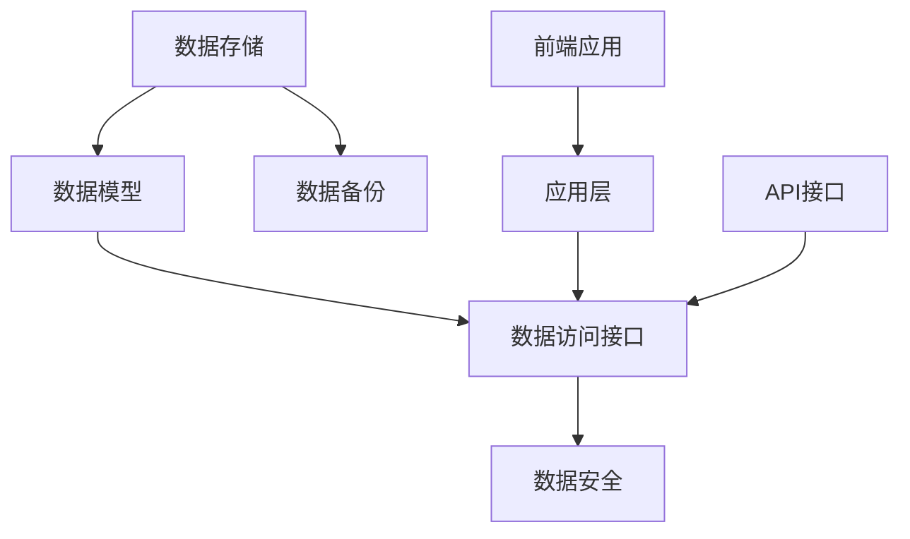

                 

# 如何建立和维护客户数据库

> 关键词：客户数据库、数据管理、CRM系统、数据完整性、数据安全

> 摘要：本文将探讨如何建立一个有效的客户数据库，并详细阐述如何对其进行维护。通过对核心概念、算法原理、数学模型以及实际案例的分析，文章将帮助读者理解客户数据库在商业运营中的重要性，以及如何利用现代技术实现数据的准确、安全和高效管理。

## 1. 背景介绍

### 1.1 目的和范围

客户数据库是企业信息管理系统中的核心组成部分，它记录了与客户互动的所有重要信息，包括销售记录、沟通历史、客户需求和反馈等。本文旨在为读者提供一份全面的指南，帮助他们在现代商业环境中建立和维护一个高效、可靠的客户数据库。

本文将涵盖以下主题：
1. 客户数据库的核心概念及其重要性。
2. 数据库设计的原则和最佳实践。
3. 数据库操作的核心算法原理。
4. 数据库维护的策略和技巧。
5. 实际应用场景中的客户数据库案例。

### 1.2 预期读者

本文面向以下读者群体：
- 企业管理层，尤其是市场部、销售部和客户服务部门的管理人员。
- 数据库管理员和IT专业人员，负责企业客户数据库的建立和维护。
- 数据分析师和数据科学家，对数据质量和管理有深入需求的专业人士。
- 对客户关系管理（CRM）系统有兴趣的学习者和从业者。

### 1.3 文档结构概述

本文的结构如下：

1. **背景介绍**：介绍客户数据库的重要性、目的和范围，以及预期读者。
2. **核心概念与联系**：阐述客户数据库的核心概念，并使用Mermaid流程图展示其架构。
3. **核心算法原理 & 具体操作步骤**：详细讲解数据库操作的核心算法原理，并使用伪代码进行阐述。
4. **数学模型和公式 & 详细讲解 & 举例说明**：介绍数据库维护中的数学模型，使用latex格式进行公式表达。
5. **项目实战：代码实际案例和详细解释说明**：提供代码案例，详细解读其实现过程。
6. **实际应用场景**：分析客户数据库在不同业务场景中的应用。
7. **工具和资源推荐**：推荐学习资源、开发工具和框架。
8. **总结：未来发展趋势与挑战**：探讨客户数据库的未来发展方向和面临的挑战。
9. **附录：常见问题与解答**：提供常见问题的解答。
10. **扩展阅读 & 参考资料**：推荐相关文献和资源。

### 1.4 术语表

#### 1.4.1 核心术语定义

- **客户数据库**：存储客户信息、交易记录、沟通历史等数据的数据库。
- **CRM系统**：客户关系管理系统的缩写，用于管理企业与客户互动的软件。
- **数据完整性**：确保数据库中的数据准确、一致且可靠。
- **数据安全**：防止数据泄露、篡改或未授权访问。

#### 1.4.2 相关概念解释

- **数据清洗**：去除数据库中的重复、错误和无效数据。
- **数据备份**：创建数据库的副本以防止数据丢失。
- **索引**：数据库中用于快速检索数据的数据结构。
- **查询优化**：提高数据库查询的效率和性能。

#### 1.4.3 缩略词列表

- **CRM**：客户关系管理（Customer Relationship Management）
- **SQL**：结构化查询语言（Structured Query Language）
- **IDE**：集成开发环境（Integrated Development Environment）
- **API**：应用程序编程接口（Application Programming Interface）

## 2. 核心概念与联系

### 2.1 客户数据库的核心概念

客户数据库是一个集中存储客户信息的系统，这些信息包括客户的基本资料（如姓名、联系方式、地址）、交易记录、互动历史、偏好和需求等。客户数据库的核心概念包括以下几个方面：

1. **数据实体**：数据实体是数据库中的基本数据单元，例如客户、订单、沟通记录等。
2. **属性**：属性是描述数据实体的具体信息，例如客户的姓名、年龄、电话号码等。
3. **关系**：关系描述了不同数据实体之间的关联，例如客户与订单之间的关系。

### 2.2 客户数据库的架构

客户数据库的架构通常包括以下组件：

1. **数据存储**：用于存储实际数据，可以是关系型数据库（如MySQL、PostgreSQL）、NoSQL数据库（如MongoDB、Cassandra）或云数据库（如Amazon RDS、Google Cloud SQL）。
2. **数据模型**：定义数据实体和它们之间的关系，常见的有关系型数据模型（如SQL）、文档数据模型（如MongoDB）和图数据模型（如Neo4j）。
3. **数据访问接口**：提供对数据库的访问和操作，例如SQL查询接口、API接口等。
4. **数据安全**：确保数据在存储、传输和处理过程中的安全，包括访问控制、加密和数据备份等。

### 2.3 Mermaid流程图

以下是一个简单的Mermaid流程图，展示客户数据库的核心架构和组件：



## 3. 核心算法原理 & 具体操作步骤

### 3.1 数据库操作的核心算法原理

数据库操作主要包括数据的插入、查询、更新和删除。以下将分别介绍这些操作的核心算法原理，并使用伪代码进行阐述。

#### 3.1.1 数据插入（INSERT）

数据插入是指向数据库中添加新的数据记录。其核心算法原理如下：

```plaintext
INSERT INTO table_name (column1, column2, ..., columnN)
VALUES (value1, value2, ..., valueN);
```

其中，`table_name` 是表名，`column1, column2, ..., columnN` 是表中的列名，`value1, value2, ..., valueN` 是对应的值。

#### 3.1.2 数据查询（SELECT）

数据查询是指从数据库中获取特定数据记录。其核心算法原理如下：

```plaintext
SELECT column1, column2, ..., columnN
FROM table_name
WHERE condition;
```

其中，`column1, column2, ..., columnN` 是要查询的列名，`table_name` 是表名，`condition` 是查询条件。

#### 3.1.3 数据更新（UPDATE）

数据更新是指修改数据库中已有的数据记录。其核心算法原理如下：

```plaintext
UPDATE table_name
SET column1 = value1, column2 = value2, ..., columnN = valueN
WHERE condition;
```

其中，`table_name` 是表名，`column1, column2, ..., columnN` 是要更新的列名，`value1, value2, ..., valueN` 是对应的值，`condition` 是更新条件。

#### 3.1.4 数据删除（DELETE）

数据删除是指从数据库中删除特定数据记录。其核心算法原理如下：

```plaintext
DELETE FROM table_name
WHERE condition;
```

其中，`table_name` 是表名，`condition` 是删除条件。

### 3.2 具体操作步骤

以下是一个具体的操作步骤示例，假设我们要在一个名为`customers`的表中插入一条新记录：

1. **确定数据**：假设我们要插入的客户信息为：
   - 姓名：张三
   - 电话：13800138000
   - 电子邮件：zhangsan@example.com

2. **编写INSERT语句**：

```plaintext
INSERT INTO customers (name, phone, email)
VALUES ('张三', '13800138000', 'zhangsan@example.com');
```

3. **执行INSERT操作**：在数据库管理工具或应用程序中执行上述SQL语句。

4. **验证插入结果**：查询`customers`表，确认新记录是否已成功插入。

```plaintext
SELECT * FROM customers;
```

## 4. 数学模型和公式 & 详细讲解 & 举例说明

### 4.1 数据库性能评估

数据库性能评估是确保客户数据库高效运行的关键。以下是一些常用的数学模型和公式：

#### 4.1.1 数据库响应时间

数据库响应时间（response time）是指从发起查询到查询结果返回所需的时间。其公式如下：

$$
\text{response\_time} = \text{query\_processing} + \text{data\_access} + \text{network\_latency}
$$

其中：
- `query_processing`：查询处理时间，包括SQL编译、优化和执行。
- `data_access`：数据访问时间，包括磁盘I/O和内存访问。
- `network_latency`：网络延迟，包括数据在网络中的传输时间。

#### 4.1.2 数据库吞吐量

数据库吞吐量（throughput）是指单位时间内数据库处理的查询数量。其公式如下：

$$
\text{throughput} = \frac{\text{number\_of\_queries}}{\text{response\_time}}
$$

其中：
- `number_of_queries`：单位时间内的查询数量。
- `response_time`：每个查询的响应时间。

#### 4.1.3 数据库并发度

数据库并发度（concurrency）是指数据库同时处理多个查询的能力。其公式如下：

$$
\text{concurrency} = \frac{\text{maximum\_number\_of\_queries}}{\text{response\_time}}
$$

其中：
- `maximum_number_of_queries`：数据库同时处理的查询数量。
- `response_time`：每个查询的响应时间。

### 4.2 举例说明

假设一个数据库系统在1分钟内处理了100个查询，每个查询的平均响应时间为5秒。根据上述公式，我们可以计算出：

- 数据库吞吐量：

$$
\text{throughput} = \frac{100}{5} = 20 \text{ queries/second}
$$

- 数据库并发度：

$$
\text{concurrency} = \frac{100}{5} = 20 \text{ queries/second}
$$

这意味着该数据库系统在1分钟内可以同时处理20个查询，每个查询的平均响应时间为5秒。

## 5. 项目实战：代码实际案例和详细解释说明

### 5.1 开发环境搭建

在本节中，我们将使用Python和SQLAlchemy库来搭建一个简单的客户数据库。以下步骤将在您的计算机上设置开发环境：

1. **安装Python**：确保您已安装Python 3.x版本。可以从[Python官网](https://www.python.org/)下载并安装。

2. **安装SQLAlchemy**：在终端或命令提示符中运行以下命令：

```bash
pip install sqlalchemy
```

3. **安装SQLite**：SQLite是一个轻量级的数据库引擎，通常随Python安装包一起提供。如果没有安装，您可以在[SQLite官网](https://www.sqlite.org/)下载并安装。

### 5.2 源代码详细实现和代码解读

以下是一个简单的Python脚本，用于创建一个客户数据库、表和插入数据。

```python
from sqlalchemy import create_engine, Column, String, Integer
from sqlalchemy.ext.declarative import declarative_base
from sqlalchemy.orm import sessionmaker

# 创建数据库引擎和基类
engine = create_engine('sqlite:///customers.db')
Base = declarative_base()

# 定义客户数据模型
class Customer(Base):
    __tablename__ = 'customers'

    id = Column(Integer, primary_key=True)
    name = Column(String(50), nullable=False)
    phone = Column(String(20), nullable=False)
    email = Column(String(100), nullable=False)

# 创建数据库表
Base.metadata.create_all(engine)

# 创建会话
Session = sessionmaker(bind=engine)
session = Session()

# 插入客户数据
new_customer = Customer(name='张三', phone='13800138000', email='zhangsan@example.com')
session.add(new_customer)
session.commit()

# 查询客户数据
customers = session.query(Customer).all()
for customer in customers:
    print(customer.name, customer.phone, customer.email)

# 关闭会话
session.close()
```

#### 5.2.1 代码解读与分析

1. **导入库**：首先导入必要的库，包括`create_engine`、`Column`、`String`、`Integer`和`declarative_base`。

2. **创建数据库引擎**：使用`create_engine`函数创建一个数据库引擎，指定数据库的URI（统一资源标识符），例如SQLite数据库文件路径。

3. **定义基类**：使用`declarative_base`函数创建一个基类`Base`，用于定义数据库表模型。

4. **定义客户数据模型**：创建`Customer`类，指定表名为`customers`，并定义三个属性：`id`（主键）、`name`（姓名）、`phone`（电话）和`email`（电子邮件）。

5. **创建数据库表**：使用`Base.metadata.create_all(engine)`函数创建数据库表。

6. **创建会话**：使用`sessionmaker`创建一个会话类，并将其绑定到数据库引擎。

7. **插入客户数据**：创建一个新的`Customer`对象，并将其添加到会话中。使用`session.commit()`提交事务。

8. **查询客户数据**：使用`session.query(Customer).all()`查询所有客户数据，并遍历输出。

9. **关闭会话**：使用`session.close()`关闭会话。

### 5.3 代码解读与分析

本代码示例展示了如何使用SQLAlchemy库创建客户数据库、定义数据模型、插入和查询数据。以下是关键步骤的详细解读：

- **数据库引擎创建**：使用`create_engine`函数创建数据库引擎，指定SQLite数据库文件路径。
- **基类定义**：使用`declarative_base`创建基类`Base`，用于后续定义数据模型。
- **数据模型定义**：创建`Customer`类，指定表名为`customers`，并定义三个属性。这些属性映射到数据库表中的列。
- **表创建**：使用`Base.metadata.create_all(engine)`创建数据库表。
- **会话创建**：使用`sessionmaker`创建会话类，并将其绑定到数据库引擎。
- **数据插入**：创建一个新的`Customer`对象，并将其添加到会话中。使用`session.commit()`提交事务，将数据持久化到数据库中。
- **数据查询**：使用`session.query(Customer).all()`查询所有客户数据，并遍历输出。
- **会话关闭**：使用`session.close()`关闭会话，释放数据库连接。

通过这个简单的示例，我们可以看到如何使用SQLAlchemy库实现客户数据库的基本功能。在实际项目中，可以根据需求扩展和优化数据库模型和操作逻辑。

## 6. 实际应用场景

客户数据库在商业运营中扮演着至关重要的角色。以下是一些实际应用场景：

### 6.1 客户关系管理（CRM）

CRM系统是客户数据库的典型应用场景。通过客户数据库，企业可以记录和管理与客户的互动历史，包括电话沟通、电子邮件交流、会议记录和销售活动。CRM系统帮助销售团队更好地了解客户需求，提高销售转化率。

### 6.2 客户服务与支持

客户服务团队依赖客户数据库来跟踪客户问题和反馈。数据库中记录的案例历史和客户偏好信息有助于提供个性化的客户服务，提高客户满意度和忠诚度。

### 6.3 市场营销

市场营销团队利用客户数据库进行分析，识别潜在客户群体、制定营销策略和执行广告投放。通过精确的数据库营销，企业可以降低营销成本，提高营销效果。

### 6.4 数据分析和报告

数据分析团队使用客户数据库生成各种报告和仪表板，帮助企业了解客户行为、市场趋势和业务绩效。这些数据洞察支持企业制定战略决策，优化业务流程。

### 6.5 供应链管理

在供应链管理中，客户数据库用于记录供应商信息、订单历史和物流跟踪。这些数据帮助企业在采购和配送过程中做出更明智的决策，提高供应链的效率。

### 6.6 客户体验优化

通过分析客户数据库中的互动数据和反馈，企业可以识别客户痛点和需求，从而优化产品和服务，提升客户体验。

## 7. 工具和资源推荐

### 7.1 学习资源推荐

#### 7.1.1 书籍推荐

1. 《数据库系统概念》（"Database System Concepts"） - Abraham Silberschatz、Henry F. Korth和S. Sudarshan
2. 《SQL基础教程》（"SQL: The Ultimate Beginner’s Guide to Learn SQL, Database Design & Database Management"） - Mark Smith

#### 7.1.2 在线课程

1. Coursera - "Database Management Essentials"
2. edX - "Introduction to Databases"

#### 7.1.3 技术博客和网站

1. MySQL Tutorial - https://www.mysqltutorial.org/
2. SQL Zoo - https://sqlzoo.net/

### 7.2 开发工具框架推荐

#### 7.2.1 IDE和编辑器

1. Visual Studio Code
2. PyCharm
3. IntelliJ IDEA

#### 7.2.2 调试和性能分析工具

1. Python Debugger (pdb)
2. SQLAlchemy Profiler
3. MySQL Workbench

#### 7.2.3 相关框架和库

1. SQLAlchemy - https://www.sqlalchemy.org/
2. Flask-SQLAlchemy - https://flask-sqlalchemy.palletsprojects.com/

### 7.3 相关论文著作推荐

#### 7.3.1 经典论文

1. "The Third Manifesto" - C.J. Date
2. "The Entity-Relationship Model - Toward a Unified View of Data" - Peter Chen

#### 7.3.2 最新研究成果

1. "Scalable Vector Database Systems" - Readings in Database Systems, 2017
2. "The Design and Implementation of the MySQL Database System" - MySQL Conference & Expo, 2005

#### 7.3.3 应用案例分析

1. "Customer Data Platforms: The Next Frontier in Data-Driven Marketing" - DMA Insights, 2021
2. "The Role of Customer Data in Healthcare" - Journal of Health Data Science, 2022

## 8. 总结：未来发展趋势与挑战

### 8.1 发展趋势

1. **数据隐私与安全**：随着数据隐私法规的日益严格，确保客户数据的安全和隐私将成为客户数据库发展的关键趋势。
2. **实时数据分析**：实时数据分析技术的进步将使企业能够更快地响应客户需求和市场变化。
3. **人工智能与机器学习**：利用人工智能和机器学习技术，客户数据库将能够提供更深入的客户洞察和更精准的营销策略。
4. **多渠道集成**：客户数据库将更加注重整合线上线下渠道，实现全渠道的客户数据管理。

### 8.2 挑战

1. **数据质量**：确保数据质量是建立和维护客户数据库的主要挑战之一。数据清洗和数据治理策略至关重要。
2. **数据隐私法规**：遵守全球各地的数据隐私法规将要求企业在设计和维护客户数据库时做出更严格的控制。
3. **技术复杂性**：随着客户数据库的复杂度增加，管理和维护这些系统将变得更加困难，需要专业技术和工具。
4. **实时性能**：实现实时数据分析和响应需要强大的计算能力和高效的数据库架构。

## 9. 附录：常见问题与解答

### 9.1 什么是客户数据库？

客户数据库是一个集中存储与客户互动所有信息的系统，包括客户的基本信息、交易记录、沟通历史和反馈等。

### 9.2 客户数据库有什么作用？

客户数据库在商业运营中发挥着多种作用，包括客户关系管理、客户服务支持、市场营销、数据分析等。

### 9.3 如何确保客户数据库的数据质量？

确保客户数据库的数据质量需要定期进行数据清洗、验证和更新。使用数据治理策略和工具可以帮助维护数据的一致性和准确性。

### 9.4 客户数据库与CRM系统有什么区别？

客户数据库是CRM系统中的一个核心组件，用于存储和管理客户信息。CRM系统是一个综合性的软件平台，提供了客户数据库的访问和管理功能，以及销售、营销和服务等业务功能。

## 10. 扩展阅读 & 参考资料

1. 《数据库系统概念》（"Database System Concepts"） - Abraham Silberschatz、Henry F. Korth和S. Sudarshan
2. "The Design and Implementation of the MySQL Database System" - MySQL Conference & Expo, 2005
3. "Customer Data Platforms: The Next Frontier in Data-Driven Marketing" - DMA Insights, 2021
4. https://www.mysqltutorial.org/
5. https://www.sqlalchemy.org/
6. https://flask-sqlalchemy.palletsprojects.com/

### 作者

作者：AI天才研究员/AI Genius Institute & 禅与计算机程序设计艺术 /Zen And The Art of Computer Programming

