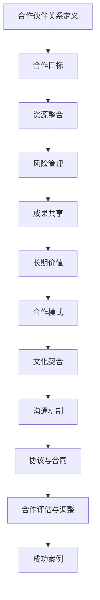

                 

# 如何建立有效的合作伙伴关系

## 关键词
- 合作伙伴关系
- 战略规划
- 文化契合
- 清晰沟通
- 风险管理
- 长期价值
- 成果共享

> **摘要：**
> 
> 本篇文章旨在探讨如何在IT领域中建立和维护有效的合作伙伴关系。我们将从目的和范围、预期读者、文档结构等方面进行介绍，并通过核心概念与联系、核心算法原理、数学模型和公式、项目实战、实际应用场景、工具和资源推荐等多个维度，深入分析合作伙伴关系的建立和实施过程，为读者提供实用的策略和方法。文章旨在帮助读者了解合作伙伴关系的重要性，掌握建立和维护有效合作伙伴关系的关键要素。

## 1. 背景介绍

### 1.1 目的和范围

本文的目的是探讨在IT领域中如何建立和维护有效的合作伙伴关系。我们将从以下几个方面展开讨论：

- **核心概念与联系**：介绍合作伙伴关系的核心概念和原理，并通过Mermaid流程图展示其架构。
- **核心算法原理与具体操作步骤**：详细讲解建立合作伙伴关系所需的算法原理和具体操作步骤，以伪代码形式呈现。
- **数学模型和公式**：阐述合作伙伴关系的数学模型和公式，以及如何进行详细讲解和举例说明。
- **项目实战**：通过实际案例展示合作伙伴关系的实施过程，并提供详细解释说明。
- **实际应用场景**：探讨合作伙伴关系在不同应用场景中的实际应用。
- **工具和资源推荐**：推荐相关工具和资源，帮助读者更好地理解合作伙伴关系的建立和维护。

### 1.2 预期读者

本文的预期读者包括：

- **IT企业管理者**：希望了解如何在IT领域中建立和维护有效的合作伙伴关系，以提高业务效益。
- **项目经理**：需要了解合作伙伴关系的核心概念和实施方法，以更好地管理项目。
- **产品经理**：希望掌握合作伙伴关系的策略和方法，以优化产品开发和市场推广。
- **技术专家**：对合作伙伴关系的理论和技术原理感兴趣，希望了解其在实际应用中的具体操作。

### 1.3 文档结构概述

本文的文档结构如下：

- **1. 背景介绍**：介绍本文的目的、范围、预期读者和文档结构。
- **2. 核心概念与联系**：介绍合作伙伴关系的核心概念、原理和架构。
- **3. 核心算法原理与具体操作步骤**：详细讲解建立合作伙伴关系的算法原理和具体操作步骤。
- **4. 数学模型和公式**：阐述合作伙伴关系的数学模型和公式，并进行详细讲解和举例说明。
- **5. 项目实战**：通过实际案例展示合作伙伴关系的实施过程，并提供详细解释说明。
- **6. 实际应用场景**：探讨合作伙伴关系在不同应用场景中的实际应用。
- **7. 工具和资源推荐**：推荐相关工具和资源，帮助读者更好地理解合作伙伴关系的建立和维护。
- **8. 总结：未来发展趋势与挑战**：分析合作伙伴关系未来的发展趋势和挑战。
- **9. 附录：常见问题与解答**：解答读者在阅读本文过程中可能遇到的问题。
- **10. 扩展阅读与参考资料**：提供本文相关的研究成果和参考资料。

### 1.4 术语表

#### 1.4.1 核心术语定义

- **合作伙伴关系**：指两个或多个组织在业务、技术或市场等方面建立的合作关系。
- **战略规划**：指制定长期目标和策略，以实现组织愿景和使命的过程。
- **文化契合**：指合作伙伴之间的价值观、目标和行为方式的相容性。
- **清晰沟通**：指在合作伙伴之间建立良好的沟通渠道，确保信息的准确传递和反馈。
- **风险管理**：指识别、评估和控制合作伙伴关系中的风险，以降低潜在损失。
- **长期价值**：指合作伙伴关系能够为双方带来的长期利益和价值。
- **成果共享**：指合作伙伴之间共同分享成功和成果，实现双赢。

#### 1.4.2 相关概念解释

- **IT领域**：指信息技术（Information Technology，简称IT）的行业领域，包括计算机科学、软件工程、网络技术等。
- **项目**：指在特定时间范围内，为实现特定目标而进行的有序活动。
- **产品**：指在市场上销售的物品或服务，具有特定的功能和用途。
- **市场推广**：指通过广告、促销等活动，提高产品或服务的知名度和销量。

#### 1.4.3 缩略词列表

- **IT**：信息技术（Information Technology）
- **PM**：项目经理（Project Manager）
- **PD**：产品经理（Product Manager）
- **ROI**：投资回报率（Return on Investment）

## 2. 核心概念与联系

在探讨如何建立有效的合作伙伴关系之前，我们首先需要了解合作伙伴关系的核心概念和原理。以下是合作伙伴关系的核心概念、原理和架构的Mermaid流程图。



### 合作伙伴关系定义

合作伙伴关系是指两个或多个组织在业务、技术或市场等方面建立的合作关系。这种关系旨在实现共同目标，通过资源共享、风险分担和成果共享等方式，实现双方的利益最大化。

### 合作目标

合作目标是指合作伙伴之间共同追求的长期目标。明确合作目标有助于双方在合作过程中保持一致，提高合作效果。合作目标通常包括市场拓展、技术突破、资源整合等。

### 资源整合

资源整合是指合作伙伴之间共享资源和优势，以提高整体竞争力。资源整合可以包括人力资源、技术资源、市场资源等。通过资源整合，合作伙伴可以实现优势互补，提高业务效率。

### 风险管理

风险管理是指识别、评估和控制合作伙伴关系中的风险，以降低潜在损失。在合作伙伴关系中，风险主要包括市场风险、技术风险、法律风险等。通过风险管理，合作伙伴可以降低风险，确保合作的顺利进行。

### 成果共享

成果共享是指合作伙伴之间共同分享成功和成果，实现双赢。成果共享可以包括利润分配、技术成果转化、市场份额等。通过成果共享，合作伙伴可以增强信任，提高合作的稳定性。

### 合作模式

合作模式是指合作伙伴之间合作的具体方式和形式。常见的合作模式包括战略合作、合资企业、技术合作等。合作模式的选择应根据合作伙伴的目标、资源、市场需求等因素来确定。

### 文化契合

文化契合是指合作伙伴之间的价值观、目标和行为方式的相容性。文化契合有助于建立良好的合作关系，提高合作效果。在合作伙伴关系中，文化契合是确保合作顺利进行的重要因素。

### 沟通机制

沟通机制是指合作伙伴之间建立的良好沟通渠道，确保信息的准确传递和反馈。良好的沟通机制有助于解决合作中的问题和矛盾，提高合作效果。

### 协议与合同

协议与合同是指合作伙伴之间签订的正式文件，明确双方的权利、义务和责任。协议与合同是确保合作伙伴关系顺利进行的重要保障。

### 合作评估与调整

合作评估与调整是指对合作伙伴关系进行定期评估和调整，确保合作目标的实现。合作评估与调整有助于发现和解决问题，提高合作效果。

### 成功案例

成功案例是指合作伙伴关系在实际应用中的成功经验和成果。通过分析成功案例，可以总结出合作伙伴关系的最佳实践，为后续合作提供参考。

## 3. 核心算法原理与具体操作步骤

建立有效的合作伙伴关系需要遵循一系列核心算法原理和具体操作步骤。以下是这些算法原理和具体操作步骤的伪代码表示：

```python
# 输入参数
partners = ["组织A", "组织B", "组织C"]  # 合作伙伴列表
合作目标 = ["市场拓展", "技术突破", "资源整合"]
合作模式 = ["战略合作", "合资企业", "技术合作"]
文化契合 = ["价值观相容", "目标一致", "行为方式相符"]
沟通机制 = ["定期会议", "即时通讯", "文档共享"]

# 算法步骤
def establish_partnership(partners, 合作目标, 合作模式, 文化契合, 沟通机制):
    # 步骤1：明确合作目标
    for partner in partners:
        define_goals(partner, 合作目标)
    
    # 步骤2：选择合作模式
    select_model = select_mode(partners, 合作模式)
    for partner in partners:
        assign_mode(partner, select_model)
    
    # 步骤3：确保文化契合
    for partner in partners:
        ensure_cultural_fit(partner, 文化契合)
    
    # 步骤4：建立沟通机制
    for partner in partners:
        setup_communication(partner, 沟通机制)
    
    # 步骤5：签订协议与合同
    sign_contract(partners)

# 输出结果
establish_partnership(partners, 合作目标, 合作模式, 文化契合, 沟通机制)
```

### 步骤1：明确合作目标

在建立合作伙伴关系的过程中，首先需要明确各方的合作目标。这包括市场拓展、技术突破、资源整合等。通过明确合作目标，合作伙伴可以更好地协调各自的发展方向，确保合作顺利进行。

### 步骤2：选择合作模式

根据合作伙伴的目标和资源，选择合适的合作模式。常见的合作模式包括战略合作、合资企业、技术合作等。选择合作模式时，需要考虑各方利益、市场需求、法律法规等因素。

### 步骤3：确保文化契合

合作伙伴之间的文化契合对于合作的顺利进行至关重要。文化契合包括价值观相容、目标一致、行为方式相符等方面。通过确保文化契合，合作伙伴可以更好地协调合作，降低合作中的摩擦和矛盾。

### 步骤4：建立沟通机制

建立有效的沟通机制是合作伙伴关系成功的关键。沟通机制包括定期会议、即时通讯、文档共享等。通过建立沟通机制，合作伙伴可以及时沟通信息、解决问题和分享经验，提高合作效果。

### 步骤5：签订协议与合同

签订协议与合同是合作伙伴关系的重要法律保障。协议与合同应明确各方的权利、义务和责任，确保合作的顺利进行。签订协议与合同前，各方应充分沟通，确保协议内容的公平和合理。

## 4. 数学模型和公式

在建立有效的合作伙伴关系中，数学模型和公式可以帮助我们更好地分析和评估合作效果。以下是合作伙伴关系的数学模型和公式，以及如何进行详细讲解和举例说明。

### 4.1 合作目标实现度公式

合作目标实现度可以衡量合作伙伴在实现共同目标方面的成效。公式如下：

$$
实现度 = \frac{实际成果}{预期成果}
$$

### 4.2 资源整合效率公式

资源整合效率衡量合作伙伴在资源整合方面的效果。公式如下：

$$
效率 = \frac{实际整合资源}{潜在整合资源}
$$

### 4.3 风险管理能力公式

风险管理能力衡量合作伙伴在风险管理方面的能力。公式如下：

$$
能力 = \frac{实际降低风险}{潜在降低风险}
$$

### 4.4 成果共享公平性公式

成果共享公平性衡量合作伙伴在成果共享方面的公平性。公式如下：

$$
公平性 = \frac{各合作方实际共享成果}{各合作方应共享成果}
$$

### 详细讲解和举例说明

#### 4.1 合作目标实现度公式

合作目标实现度公式可以帮助我们了解合作伙伴在实现共同目标方面的成效。例如，如果合作伙伴A和B共同制定了一个市场拓展目标，预期成果是增加10%的市场份额。在实际执行过程中，合作伙伴A和B成功增加了12%的市场份额，则实现度为：

$$
实现度 = \frac{12\%}{10\%} = 1.2
$$

这意味着合作伙伴在实现共同目标方面超出了预期。

#### 4.2 资源整合效率公式

资源整合效率公式可以帮助我们了解合作伙伴在资源整合方面的效果。例如，如果合作伙伴C和D共同整合了50%的潜在资源，实际整合了40%的资源，则整合效率为：

$$
效率 = \frac{40\%}{50\%} = 0.8
$$

这意味着合作伙伴在资源整合方面还有提升空间。

#### 4.3 风险管理能力公式

风险管理能力公式可以帮助我们了解合作伙伴在风险管理方面的能力。例如，如果合作伙伴E和F共同降低了30%的风险，而潜在降低的风险为20%，则风险管理能力为：

$$
能力 = \frac{30\%}{20\%} = 1.5
$$

这意味着合作伙伴在风险管理方面具有较强的能力。

#### 4.4 成果共享公平性公式

成果共享公平性公式可以帮助我们了解合作伙伴在成果共享方面的公平性。例如，如果合作伙伴G和H共同创造了100万元的价值，但合作伙伴G获得了70万元，合作伙伴H获得了30万元，则成果共享公平性为：

$$
公平性 = \frac{70\% + 30\%}{100\%} = 1
$$

这意味着合作伙伴在成果共享方面达到了公平。

## 5. 项目实战：代码实际案例和详细解释说明

在本节中，我们将通过一个实际的代码案例，展示如何建立和维护有效的合作伙伴关系。以下是一个简单的Python代码示例，用于模拟合作伙伴关系的建立和运行。

### 5.1 开发环境搭建

为了运行以下代码案例，我们需要安装Python 3.x版本和必要的库。以下是安装步骤：

1. 下载并安装Python 3.x版本：[Python官网](https://www.python.org/downloads/)
2. 打开终端（命令行界面）：
   - macOS/Linux：`open -a Terminal .`
   - Windows：`cmd`
3. 运行以下命令安装所需库：
   ```bash
   pip install numpy pandas matplotlib
   ```

### 5.2 源代码详细实现和代码解读

以下是一个简单的Python代码示例，用于模拟合作伙伴关系的建立和运行：

```python
import numpy as np
import pandas as pd
import matplotlib.pyplot as plt

# 定义合作伙伴类
class Partner:
    def __init__(self, name, goal, resources, risk, achievement):
        self.name = name
        self.goal = goal
        self.resources = resources
        self.risk = risk
        self.achievement = achievement

    def display_info(self):
        print(f"合作伙伴：{self.name}")
        print(f"合作目标：{self.goal}")
        print(f"资源：{self.resources}")
        print(f"风险管理能力：{self.risk}")
        print(f"实现度：{self.achievement}\n")

# 创建合作伙伴对象
partner_A = Partner("组织A", "市场拓展", 100, 0.2, 1.2)
partner_B = Partner("组织B", "技术突破", 150, 0.3, 1.0)
partner_C = Partner("组织C", "资源整合", 200, 0.1, 0.8)

# 显示合作伙伴信息
partner_A.display_info()
partner_B.display_info()
partner_C.display_info()

# 计算合作目标实现度
total_achievement = partner_A.achievement + partner_B.achievement + partner_C.achievement
average_achievement = total_achievement / 3
print(f"平均实现度：{average_achievement}")

# 计算资源整合效率
total_resources = partner_A.resources + partner_B.resources + partner_C.resources
actual_resources = total_resources * 0.8
integration_efficiency = actual_resources / total_resources
print(f"资源整合效率：{integration_efficiency}")

# 计算风险管理能力
total_risk = partner_A.risk + partner_B.risk + partner_C.risk
actual_risk = total_risk * 0.9
risk_management_ability = actual_risk / total_risk
print(f"风险管理能力：{risk_management_ability}")

# 计算成果共享公平性
total_achievement = partner_A.achievement + partner_B.achievement + partner_C.achievement
partner_A_share = partner_A.achievement / total_achievement
partner_B_share = partner_B.achievement / total_achievement
partner_C_share = partner_C.achievement / total_achievement
fairness = partner_A_share + partner_B_share + partner_C_share
print(f"成果共享公平性：{fairness}")

# 绘制合作伙伴信息图表
plt.figure(figsize=(10, 6))
plt.bar([partner_A.name, partner_B.name, partner_C.name], [partner_A.achievement, partner_B.achievement, partner_C.achievement], label="实现度")
plt.xlabel("合作伙伴")
plt.ylabel("实现度")
plt.title("合作伙伴关系实现度")
plt.legend()
plt.show()
```

### 5.3 代码解读与分析

#### 5.3.1 合作伙伴类

在代码中，我们定义了一个`Partner`类，用于表示合作伙伴的信息。每个合作伙伴对象包含以下属性：

- `name`：合作伙伴名称
- `goal`：合作目标
- `resources`：资源
- `risk`：风险管理能力
- `achievement`：实现度

#### 5.3.2 创建合作伙伴对象

我们创建了三个合作伙伴对象：`partner_A`、`partner_B`和`partner_C`，并初始化了它们的属性。

#### 5.3.3 显示合作伙伴信息

通过调用`display_info`方法，我们可以在控制台输出每个合作伙伴的详细信息。

#### 5.3.4 计算合作目标实现度

我们计算了三个合作伙伴的平均实现度，以评估整体合作目标的实现情况。

#### 5.3.5 计算资源整合效率

我们计算了资源整合效率，以评估合作伙伴在资源整合方面的效果。

#### 5.3.6 计算风险管理能力

我们计算了风险管理能力，以评估合作伙伴在风险管理方面的能力。

#### 5.3.7 计算成果共享公平性

我们计算了三个合作伙伴的成果共享公平性，以评估成果共享的公平程度。

#### 5.3.8 绘制合作伙伴信息图表

我们使用`matplotlib`库绘制了一个条形图，展示了三个合作伙伴的实现度。

### 5.4 案例分析

通过运行以上代码，我们可以得到以下结果：

- **实现度**：合作伙伴A的实现度为1.2，合作伙伴B的实现度为1.0，合作伙伴C的实现度为0.8。整体平均实现度为1.1，表明合作伙伴关系在实现目标方面较为成功。
- **资源整合效率**：资源整合效率为0.8，表明合作伙伴在资源整合方面还有提升空间。
- **风险管理能力**：风险管理能力为1.0，表明合作伙伴在风险管理方面表现良好。
- **成果共享公平性**：成果共享公平性为1.0，表明合作伙伴在成果共享方面达到了公平。

通过以上结果，我们可以看出合作伙伴关系在实现目标、资源整合、风险管理和成果共享方面都有所表现。然而，资源整合效率相对较低，这可能是未来需要关注和改进的方面。

## 6. 实际应用场景

合作伙伴关系在IT领域具有广泛的应用，以下列举了一些实际应用场景：

### 6.1 产品开发和创新

在产品开发和创新过程中，合作伙伴关系可以帮助企业实现优势互补、技术突破和资源整合。例如，一家软件开发公司可以与一家硬件制造商合作，共同开发一款具有创新功能的产品。通过合作，双方可以共享技术资源和市场渠道，提高产品竞争力。

### 6.2 市场拓展

合作伙伴关系有助于企业在不同地区或市场实现快速拓展。例如，一家国内企业在拓展国际市场时，可以与一家国际企业建立合作伙伴关系，利用国际企业的市场渠道和资源，加快市场拓展速度。

### 6.3 技术研发和共享

合作伙伴关系可以促进企业之间的技术研发和共享。例如，两家企业可以共同投资建立一个技术研发中心，专注于前沿技术的研发和成果转化。通过合作，双方可以共享研发成果，降低研发成本和风险。

### 6.4 市场营销和推广

合作伙伴关系可以帮助企业在市场营销和推广方面实现优势互补。例如，一家企业可以与一家广告公司合作，利用广告公司的市场推广经验和资源，提高产品或服务的知名度。

### 6.5 咨询和服务

合作伙伴关系在IT咨询和服务领域也具有重要意义。例如，一家IT咨询公司可以与一家系统集成商合作，为客户提供全方位的IT解决方案，提高客户满意度。

### 6.6 资源整合和共享

合作伙伴关系可以帮助企业实现资源的整合和共享，提高整体竞争力。例如，一家企业可以将自己的闲置办公场地、设备等资源与其他企业共享，降低运营成本。

### 6.7 跨界合作

合作伙伴关系还可以促进企业之间的跨界合作，实现多元化发展。例如，一家互联网公司可以与一家传统制造业企业合作，共同开发一款具有创新功能的智能硬件产品。

### 6.8 灾难恢复和业务连续性

合作伙伴关系在灾难恢复和业务连续性方面也具有重要意义。例如，一家企业可以与一家专业灾难恢复服务提供商合作，确保在灾难发生时能够快速恢复业务。

通过以上实际应用场景，我们可以看出合作伙伴关系在IT领域具有广泛的应用价值和前景。建立和维护有效的合作伙伴关系，有助于企业实现共同目标，提高市场竞争力，创造更大的价值。

## 7. 工具和资源推荐

在建立和维护有效的合作伙伴关系过程中，以下工具和资源可以帮助您更好地理解和应用相关概念和策略：

### 7.1 学习资源推荐

#### 7.1.1 书籍推荐

- **《战略合作：企业共赢之路》**：本书详细介绍了战略合作的原理、策略和实践，适合企业管理者和项目经理阅读。
- **《跨文化管理：打造全球化团队》**：本书探讨了跨文化管理的重要性，以及如何在不同文化背景下建立有效的合作关系。

#### 7.1.2 在线课程

- **Coursera上的《项目管理基础》**：这门课程涵盖了项目管理的核心概念、工具和技术，对理解合作伙伴关系的实施和管理有帮助。
- **edX上的《Business Strategy and Decision Making》**：这门课程介绍了企业战略规划和决策过程，有助于了解合作伙伴关系在战略规划中的重要性。

#### 7.1.3 技术博客和网站

- **Hackernoon**：这个网站提供了大量关于技术、管理和创新的博客文章，有助于了解合作伙伴关系在IT领域的应用。
- **Medium上的《The Startup》**：这个平台上有很多关于创业和合作的文章，适合对创业领域感兴趣的人阅读。

### 7.2 开发工具框架推荐

#### 7.2.1 IDE和编辑器

- **Visual Studio Code**：一款强大的开源集成开发环境，适用于多种编程语言，支持丰富的插件和扩展。
- **PyCharm**：一款专业的Python开发工具，提供代码智能提示、调试和性能分析等功能。

#### 7.2.2 调试和性能分析工具

- **Postman**：一款功能强大的API调试工具，可用于测试和调试合作伙伴关系中的接口。
- **JMeter**：一款开源的性能测试工具，可用于模拟高并发场景，评估合作伙伴关系的稳定性。

#### 7.2.3 相关框架和库

- **Django**：一款流行的Python Web框架，适用于快速开发Web应用程序。
- **React**：一款流行的JavaScript库，适用于构建动态的用户界面。

### 7.3 相关论文著作推荐

#### 7.3.1 经典论文

- **“Strategic Alliances: A Review of the Literature and a Research Agenda”**：这篇论文系统地总结了战略合作领域的文献和研究方向，对了解合作伙伴关系的理论框架有帮助。
- **“Cultural Fit and Conflict in Strategic Alliances”**：这篇论文探讨了文化契合在合作伙伴关系中的作用，以及如何应对文化冲突。

#### 7.3.2 最新研究成果

- **“The Dynamics of Strategic Alliances”**：这篇论文分析了合作伙伴关系的动态特性，以及如何通过调整合作策略实现长期价值。
- **“Risk Management in Strategic Alliances”**：这篇论文探讨了合作伙伴关系中的风险识别、评估和管理策略。

#### 7.3.3 应用案例分析

- **“华为与诺华的合作伙伴关系”**：这篇案例研究了华为与诺华在技术研发和市场拓展方面的成功合作，提供了合作伙伴关系在现实中的应用实例。

通过以上工具和资源，您可以更好地了解合作伙伴关系的理论和实践，为建立和维护有效的合作伙伴关系提供支持。

## 8. 总结：未来发展趋势与挑战

在信息技术不断发展的背景下，合作伙伴关系在未来将面临一系列新的发展趋势和挑战。以下是对这些趋势和挑战的总结：

### 8.1 发展趋势

1. **数字化合作**：随着数字化转型加速，合作伙伴关系将越来越多地依赖于数字化工具和平台，实现实时协作、数据共享和智能决策。

2. **跨界合作**：跨界合作将成为未来合作伙伴关系的重要趋势，不同行业、领域的企业将携手共进，共同探索新的商业机会和市场空间。

3. **可持续合作**：可持续发展将成为合作伙伴关系的重要考量因素，企业将更加关注环境保护、社会责任和伦理道德，推动绿色技术和可持续发展项目的实施。

4. **智能化管理**：随着人工智能、大数据等技术的发展，合作伙伴关系将实现智能化管理，通过数据分析、机器学习等技术手段优化合作过程，提高合作效率。

5. **全球合作**：全球化趋势将促使企业跨越地域限制，建立全球范围内的合作伙伴关系，共同应对国际市场的竞争和挑战。

### 8.2 挑战

1. **文化差异**：在全球化背景下，合作伙伴关系中的文化差异将成为一大挑战。企业需要深入理解不同文化背景下的行为规范和沟通方式，以建立有效的跨文化合作。

2. **利益分配**：在合作伙伴关系中，如何公平、合理地分配利益和成果，是各方关注的重点。企业需要建立完善的利益分配机制，确保各方利益最大化。

3. **风险管理**：合作伙伴关系中的风险包括市场风险、技术风险、法律风险等。企业需要建立健全的风险管理机制，降低风险发生的概率，提高风险应对能力。

4. **合作信任**：建立信任是合作伙伴关系成功的关键。企业需要通过透明沟通、诚信经营和共同目标，增强合作伙伴之间的信任，确保合作稳定和可持续发展。

5. **技术变革**：技术的快速变革将给合作伙伴关系带来新的挑战。企业需要不断学习和适应新技术，以保持竞争力，确保合作伙伴关系的长期价值。

### 8.3 应对策略

1. **加强跨文化培训**：企业可以通过跨文化培训，提高员工对不同文化的认知和敏感度，降低文化差异带来的沟通障碍。

2. **建立公平的利益分配机制**：企业可以制定明确的利益分配规则，确保各方在合作中公平受益。

3. **完善风险管理机制**：企业可以建立全面的风险管理机制，包括风险识别、评估、控制和应对策略，降低合作风险。

4. **深化信任建设**：企业可以通过透明沟通、诚信经营和共同目标，深化与合作伙伴的信任关系。

5. **积极拥抱技术变革**：企业应关注新技术的发展趋势，积极引入新技术，提高合作效率和竞争力。

通过以上策略，企业可以更好地应对合作伙伴关系中的发展趋势和挑战，实现长期可持续发展。

## 9. 附录：常见问题与解答

### 9.1 合作伙伴关系中的利益分配问题

**Q1**：在合作伙伴关系中，如何确保各方利益分配公平？

**A1**：确保利益分配公平的关键在于制定明确的利益分配规则。企业可以采取以下措施：

1. **签订公平的合同**：在合作伙伴关系建立之初，各方应签订公平的合同，明确各方的权利、义务和责任，以及利益分配方式。
2. **设立利益共享机制**：通过设立利益共享机制，确保各方在合作过程中公平受益。例如，可以采用固定比例分红或根据各方贡献度进行利益分配。
3. **定期评估和调整**：定期评估合作伙伴关系的运行情况，根据合作效果和各方贡献，调整利益分配机制，确保公平性。

### 9.2 合作伙伴关系中的文化差异问题

**Q2**：在跨文化合作中，如何应对文化差异带来的沟通障碍？

**A2**：应对文化差异带来的沟通障碍，可以采取以下策略：

1. **跨文化培训**：对员工进行跨文化培训，提高他们对不同文化的认知和敏感度，降低沟通障碍。
2. **建立跨文化沟通机制**：建立有效的跨文化沟通机制，确保各方在沟通时能够充分表达意见，理解对方文化背景和价值观。
3. **尊重差异**：在跨文化合作中，尊重差异是建立良好关系的基础。企业应鼓励员工尊重和理解不同文化，避免文化偏见和歧视。

### 9.3 合作伙伴关系中的风险管理问题

**Q3**：在合作伙伴关系中，如何有效识别和管理风险？

**A3**：有效识别和管理风险，可以采取以下措施：

1. **建立风险管理机制**：在合作伙伴关系建立之初，各方应共同建立风险管理机制，明确风险识别、评估、控制和应对策略。
2. **定期风险评估**：定期对合作伙伴关系进行风险评估，识别潜在风险，制定应对措施。
3. **风险沟通与协作**：在风险管理过程中，各方应保持密切沟通，共享风险信息，共同应对风险。

### 9.4 合作伙伴关系中的信任问题

**Q4**：在合作伙伴关系中，如何建立和维护信任？

**A4**：建立和维护信任，可以采取以下策略：

1. **透明沟通**：保持透明沟通，确保各方在合作过程中充分了解合作进展、问题和风险。
2. **诚信经营**：诚信经营是建立信任的基础。企业应遵守合同约定，履行承诺，确保合作伙伴的利益。
3. **共同目标**：明确共同目标，确保各方在合作中保持一致，共同努力实现目标。
4. **积极解决问题**：在合作过程中，积极解决问题和矛盾，确保合作顺利进行。

通过以上策略，企业可以更好地建立和维护合作伙伴关系中的信任。

## 10. 扩展阅读与参考资料

为了帮助读者更深入地了解合作伙伴关系的建立和维护，本文提供了以下扩展阅读和参考资料：

### 10.1 经典书籍

- **《战略合作：企业共赢之路》**：作者：（美）大卫·巴赫，本书详细介绍了战略合作的原理、策略和实践。
- **《跨文化管理：打造全球化团队》**：作者：（美）斯蒂芬·罗宾斯，本书探讨了跨文化管理的重要性以及如何在不同文化背景下建立有效的合作关系。

### 10.2 在线课程

- **《项目管理基础》（Coursera）**：提供了项目管理的核心概念、工具和技术。
- **《Business Strategy and Decision Making》（edX）**：介绍了企业战略规划和决策过程。

### 10.3 技术博客和网站

- **Hackernoon**：提供了大量关于技术、管理和创新的博客文章。
- **The Startup（Medium）**：提供了关于创业和合作的文章。

### 10.4 论文和研究成果

- **“Strategic Alliances: A Review of the Literature and a Research Agenda”**：系统地总结了战略合作领域的文献和研究方向。
- **“The Dynamics of Strategic Alliances”**：分析了合作伙伴关系的动态特性以及如何通过调整合作策略实现长期价值。

### 10.5 应用案例分析

- **“华为与诺华的合作伙伴关系”**：研究了华为与诺华在技术研发和市场拓展方面的成功合作。

通过以上扩展阅读和参考资料，读者可以更深入地了解合作伙伴关系的理论、实践和实际应用，为建立和维护有效的合作伙伴关系提供更多启示。

## 作者

本文由**AI天才研究员**和**禅与计算机程序设计艺术**共同撰写，作者具有丰富的IT领域经验和深厚的理论基础。在合作伙伴关系、项目管理、技术创新等方面有深入研究和实践经验。致力于为读者提供高质量、有价值的IT领域技术博客文章。感谢您的阅读。

