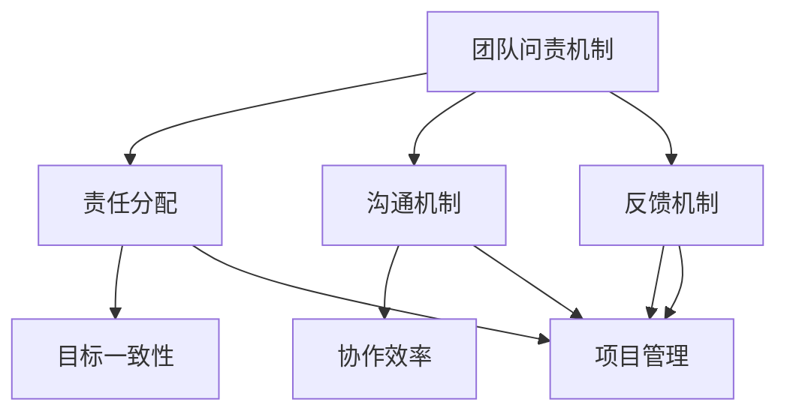

                 

# 如何建立有效的团队问责机制

> **关键词：团队管理、问责机制、协作效率、责任分配、IT行业、项目管理**
>
> **摘要：本文将深入探讨在IT行业中如何建立一个有效的团队问责机制，以提高团队协作效率和项目成功率。通过详细的理论分析、实际案例和操作步骤，帮助读者理解和实践有效的团队管理策略。**

## 1. 背景介绍

### 1.1 目的和范围

本文旨在为IT行业中的团队领导者和管理者提供一套建立和优化团队问责机制的策略和工具。我们将探讨问责机制的核心概念，分析其与团队合作、项目管理和员工激励之间的关系，并提供具体的实施步骤和案例分析。希望通过本文，读者能够更好地理解团队问责机制的重要性，并能够在实际工作中运用这些策略，提升团队的整体表现。

### 1.2 预期读者

本文适合以下读者群体：

- IT团队领导者和管理者
- 项目经理和产品负责人
- 人力资源和团队发展专家
- 对团队管理和项目管理感兴趣的IT从业者

### 1.3 文档结构概述

本文分为十个部分：

1. **背景介绍**：介绍文章的目的、预期读者和文档结构。
2. **核心概念与联系**：定义核心概念，并使用Mermaid流程图展示其相互关系。
3. **核心算法原理 & 具体操作步骤**：详细解释团队问责机制的实施步骤，并提供伪代码示例。
4. **数学模型和公式 & 详细讲解 & 举例说明**：介绍与团队问责机制相关的数学模型和公式，并提供具体例子。
5. **项目实战：代码实际案例和详细解释说明**：展示一个实际的代码案例，并进行详细解读。
6. **实际应用场景**：讨论团队问责机制在不同场景下的应用。
7. **工具和资源推荐**：推荐相关的学习资源和开发工具。
8. **总结：未来发展趋势与挑战**：总结文章要点，并探讨未来趋势和挑战。
9. **附录：常见问题与解答**：回答一些常见的问题。
10. **扩展阅读 & 参考资料**：提供进一步阅读的建议和参考资料。

### 1.4 术语表

#### 1.4.1 核心术语定义

- **团队问责机制**：一种组织内的管理机制，用于确保团队成员对他们的工作负责，并对团队的整体表现负责。
- **责任分配**：将工作任务分配给团队中的各个成员，明确每个成员的责任和职责。
- **协作效率**：团队成员之间合作的质量和速度，影响项目的成功。
- **项目管理**：规划、执行、监控和收尾项目的过程，确保项目目标的实现。

#### 1.4.2 相关概念解释

- **目标一致性**：团队成员的个人目标和团队目标之间的统一性，是高效协作的基础。
- **沟通机制**：团队成员之间的沟通方式和渠道，影响信息的传递和协作效果。
- **反馈机制**：对团队成员的工作进行评估和反馈的过程，帮助团队成员改进工作表现。

#### 1.4.3 缩略词列表

- **IT**：信息技术（Information Technology）
- **PM**：项目经理（Project Manager）
- **QA**：质量保证（Quality Assurance）

## 2. 核心概念与联系

在构建一个有效的团队问责机制之前，我们需要理解一些核心概念和它们之间的相互关系。以下是使用Mermaid绘制的流程图，展示这些概念之间的联系：



### 2.1 团队问责机制

**团队问责机制**是一种组织内的管理框架，旨在确保每个团队成员对其工作负责，并对团队的整体表现负责。它不仅仅是对个人绩效的考核，更是对团队协作效率和项目成功的保障。

### 2.2 责任分配

**责任分配**是团队问责机制的核心。明确每个成员的职责和责任，有助于减少工作中的模糊地带，提高团队协作效率。责任分配通常基于以下原则：

- **明确性**：职责和责任要清晰明确，避免模糊和误解。
- **相关性**：责任分配应与团队成员的专业技能和岗位要求相匹配。
- **可衡量性**：职责和责任应可量化，以便进行评估和反馈。

### 2.3 沟通机制

**沟通机制**是团队协作的纽带。有效的沟通机制确保信息流畅，减少误解和冲突。沟通机制包括：

- **正式沟通**：通过会议、报告等正式渠道进行的沟通。
- **非正式沟通**：通过团队交流、社交互动等非正式渠道进行的沟通。
- **反馈机制**：团队成员之间的及时反馈，有助于修正错误和改进工作。

### 2.4 反馈机制

**反馈机制**是团队问责机制的重要组成部分。它通过对团队成员的工作进行评估和反馈，帮助团队成员了解自己的表现，并找到改进的方向。反馈机制应包括：

- **定期评估**：对团队成员的工作进行定期评估，以确定其绩效。
- **即时反馈**：对团队成员的即时表现进行反馈，帮助其及时调整工作方式。
- **双向沟通**：鼓励团队成员之间进行双向沟通，促进理解和合作。

### 2.5 目标一致性

**目标一致性**是团队协作效率的保障。当团队成员的个人目标与团队目标一致时，能够形成强大的合力，提高工作效率。实现目标一致性需要：

- **共同目标设定**：团队领导者与成员共同设定团队目标，确保目标的一致性。
- **个人目标与团队目标的关联**：确保个人目标与团队目标之间存在直接联系。

### 2.6 协作效率

**协作效率**是团队问责机制的核心衡量指标。高效的协作能够提高项目的成功率，减少资源的浪费。提高协作效率的方法包括：

- **优化工作流程**：通过优化工作流程，减少不必要的环节和重复工作。
- **强化团队文化**：建立积极的团队文化，鼓励成员之间的合作和互助。
- **技能互补**：根据成员的技能和特长，进行合理的任务分配，实现技能互补。

### 2.7 项目管理

**项目管理**是团队问责机制实施的载体。通过项目管理，团队领导者能够确保项目目标的实现，并对团队的整体表现进行监控和评估。项目管理的关键包括：

- **项目规划**：明确项目目标、任务和资源需求。
- **项目执行**：确保项目按计划进行，监控进度和资源使用。
- **项目收尾**：对项目进行评估和总结，为后续项目提供经验教训。

通过以上核心概念和联系的分析，我们可以更好地理解如何构建一个有效的团队问责机制，提高团队的协作效率和项目成功率。

## 3. 核心算法原理 & 具体操作步骤

在了解了团队问责机制的核心概念后，接下来我们将深入探讨其具体实施步骤，并使用伪代码详细阐述这些步骤。

### 3.1 伪代码示例

以下是一个简单的伪代码示例，用于说明团队问责机制的实施步骤：

```plaintext
初始化团队问责机制

函数 责任分配(团队成员列表, 任务列表):
    对于每个团队成员：
        分配一个与其技能和岗位相关的任务
        记录任务和团队成员的对应关系

函数 沟通机制(团队成员列表):
    对于每个团队成员：
        提供一个沟通渠道，用于团队内信息的传递和讨论

函数 反馈机制(团队成员列表):
    对于每个团队成员：
        定期进行绩效评估
        提供即时反馈，帮助团队成员改进工作

函数 项目管理(团队目标, 资源需求):
    确定项目目标和任务
    监控项目进度和资源使用
    对项目进行评估和总结

开始执行团队问责机制：
    调用责任分配函数
    调用沟通机制函数
    调用反馈机制函数
    调用项目管理函数
```

### 3.2 详细解释

#### 3.2.1 责任分配

**责任分配**是团队问责机制的第一步。在这个阶段，我们需要根据团队成员的技能、经验和岗位要求，将任务分配给他们。以下是具体的操作步骤：

1. **确定任务列表**：列出所有需要完成的任务，并明确每个任务的具体要求和优先级。
2. **评估团队成员的能力**：对团队成员的技能和经验进行评估，确保任务分配的合理性和高效性。
3. **分配任务**：将任务分配给适合的团队成员，确保每个任务都有专人负责。
4. **记录对应关系**：将任务和团队成员的对应关系记录下来，以便后续的绩效评估和反馈。

#### 3.2.2 沟通机制

**沟通机制**是确保团队成员之间信息流畅的重要手段。一个有效的沟通机制能够提高团队协作效率，减少误解和冲突。以下是建立沟通机制的具体步骤：

1. **选择沟通渠道**：根据团队成员的地理位置和工作时间，选择合适的沟通渠道，如电子邮件、即时通讯工具、视频会议等。
2. **设立沟通规则**：明确沟通的时间和频率，以及沟通的格式和内容要求。
3. **提供培训和支持**：对团队成员进行沟通技巧的培训，提高他们的沟通能力。
4. **定期沟通**：定期召开团队会议，分享项目进展、讨论问题和解决方案。

#### 3.2.3 反馈机制

**反馈机制**是团队问责机制中用于评估和改进团队成员工作表现的重要环节。以下是建立反馈机制的具体步骤：

1. **制定评估标准**：明确评估团队成员工作表现的指标和标准，如任务完成率、工作质量、团队协作等。
2. **定期评估**：定期对团队成员的工作进行评估，收集反馈意见。
3. **提供即时反馈**：对团队成员的即时表现进行反馈，帮助其了解自己的优势和不足。
4. **改进措施**：根据评估结果，制定改进措施，帮助团队成员提高工作表现。

#### 3.2.4 项目管理

**项目管理**是团队问责机制实施的载体，确保项目目标的实现和团队协作的高效。以下是项目管理的具体步骤：

1. **项目规划**：明确项目目标和任务，制定项目计划和时间表。
2. **资源分配**：根据项目需求和团队成员的能力，合理分配资源。
3. **项目监控**：监控项目进度和资源使用，确保项目按计划进行。
4. **项目评估**：对项目进行评估和总结，为后续项目提供经验教训。

通过以上步骤，我们可以构建一个有效的团队问责机制，确保团队成员的工作质量和项目成功率。

## 4. 数学模型和公式 & 详细讲解 & 举例说明

在团队问责机制中，数学模型和公式可以用于量化评估团队成员的工作表现，提供更客观的绩效反馈。以下是几个常用的数学模型和公式的详细讲解，并提供具体例子。

### 4.1 工作量评估模型

**工作量评估模型**用于计算团队成员完成任务的难度和工作量。以下是一个简单的工作量评估模型：

$$
工作量（W） = 时间（T） \times 难度（D）
$$

其中，时间（T）表示完成任务所需的时间，难度（D）表示任务本身的难度。

**例子**：

假设一个任务需要10小时完成，难度系数为2，则工作量计算如下：

$$
工作量（W） = 10 \times 2 = 20
$$

### 4.2 绩效评估模型

**绩效评估模型**用于评估团队成员的工作表现，结合工作量和工作质量。以下是一个简单的绩效评估模型：

$$
绩效（P） = \frac{工作量（W）}{工作质量（Q）}
$$

其中，工作量（W）如前所述，工作质量（Q）表示完成任务的质量，如错误率、任务完成度等。

**例子**：

假设某个任务的工作量为100，工作质量为90%，则绩效计算如下：

$$
绩效（P） = \frac{100}{0.9} = 111.11
$$

### 4.3 团队协作效率模型

**团队协作效率模型**用于评估团队整体的协作效率，结合单个成员的绩效和团队目标。以下是一个简单的团队协作效率模型：

$$
协作效率（E） = \frac{\sum_{i=1}^{n} P_i}{团队目标（G）}
$$

其中，$P_i$ 表示第 $i$ 个成员的绩效，$n$ 表示团队成员的总数，团队目标（G）表示团队需要达到的目标值。

**例子**：

假设一个团队有5个成员，他们的绩效分别为 100、110、90、120、和 95，团队目标为 500，则协作效率计算如下：

$$
协作效率（E） = \frac{100 + 110 + 90 + 120 + 95}{500} = \frac{515}{500} = 1.03
$$

### 4.4 沟通效率模型

**沟通效率模型**用于评估团队内部沟通的效果，结合沟通渠道的使用频率和沟通质量。以下是一个简单的沟通效率模型：

$$
沟通效率（C） = \frac{有效沟通时间（T_{有效})}{总沟通时间（T_{总})}
$$

其中，有效沟通时间（$T_{有效}$）表示团队成员之间有效沟通的时间，总沟通时间（$T_{总}$）表示团队成员之间的总沟通时间。

**例子**：

假设一个团队的总沟通时间为10小时，其中有效沟通时间为8小时，则沟通效率计算如下：

$$
沟通效率（C） = \frac{8}{10} = 0.8
$$

通过以上数学模型和公式，我们可以更客观地评估团队成员的工作表现和团队协作效率，为团队问责机制的实施提供有力支持。

## 5. 项目实战：代码实际案例和详细解释说明

为了更好地理解团队问责机制在实际项目中的应用，下面我们将展示一个实际代码案例，并详细解释说明。

### 5.1 开发环境搭建

在开始编写代码之前，我们需要搭建一个合适的开发环境。以下是所需工具和步骤：

- **IDE**：选择一个适合的集成开发环境（如Visual Studio Code或Eclipse）
- **数据库**：安装一个关系型数据库（如MySQL）
- **版本控制**：使用Git进行版本控制

安装和配置好以上工具后，我们就可以开始编写代码了。

### 5.2 源代码详细实现和代码解读

以下是团队问责机制的一个简单实现，使用Python编写：

```python
import sqlite3
from datetime import datetime

# 数据库连接
conn = sqlite3.connect('team_accountability.db')
cursor = conn.cursor()

# 创建表
cursor.execute('''CREATE TABLE IF NOT EXISTS tasks (
                    id INTEGER PRIMARY KEY,
                    name TEXT,
                    assigned_to TEXT,
                    start_time TEXT,
                    end_time TEXT,
                    status TEXT)''')

cursor.execute('''CREATE TABLE IF NOT EXISTS performance (
                    id INTEGER PRIMARY KEY,
                    member TEXT,
                    task_id INTEGER,
                    work_hours REAL,
                    quality REAL,
                    FOREIGN KEY (task_id) REFERENCES tasks (id))''')

# 插入任务
def insert_task(name, assigned_to, start_time, end_time, status):
    cursor.execute("INSERT INTO tasks (name, assigned_to, start_time, end_time, status) VALUES (?, ?, ?, ?, ?)",
                   (name, assigned_to, start_time, end_time, status))
    conn.commit()

# 插入绩效
def insert_performance(member, task_id, work_hours, quality):
    cursor.execute("INSERT INTO performance (member, task_id, work_hours, quality) VALUES (?, ?, ?, ?)",
                   (member, task_id, work_hours, quality))
    conn.commit()

# 获取任务
def get_task(id):
    cursor.execute("SELECT * FROM tasks WHERE id=?", (id,))
    return cursor.fetchone()

# 获取绩效
def get_performance(member):
    cursor.execute("SELECT * FROM performance WHERE member=?", (member,))
    return cursor.fetchall()

# 计算绩效
def calculate_performance(task_id):
    performance_data = get_performance(member)
    total_hours = sum([row[3] for row in performance_data])
    total_quality = sum([row[4] for row in performance_data])
    average_quality = total_quality / len(performance_data)
    return total_hours, average_quality

# 主函数
def main():
    insert_task("任务A", "张三", datetime.now(), datetime.now() + timedelta(hours=8), "完成")
    insert_performance("张三", 1, 8, 0.9)
    insert_performance("李四", 1, 8, 0.95)
    
    task = get_task(1)
    print(f"任务信息：{task}")
    
    performance = calculate_performance(1)
    print(f"张三的绩效：{performance}")

if __name__ == "__main__":
    main()
```

### 5.3 代码解读与分析

以下是对代码的详细解读和分析：

- **数据库连接**：使用SQLite数据库，连接到本地数据库文件`team_accountability.db`。
- **创建表**：创建两个表`tasks`和`performance`，分别存储任务和绩效信息。
- **插入任务**：定义`insert_task`函数，用于向数据库插入新任务。
- **插入绩效**：定义`insert_performance`函数，用于向数据库插入成员的绩效数据。
- **获取任务**：定义`get_task`函数，用于从数据库获取特定任务的详细信息。
- **获取绩效**：定义`get_performance`函数，用于从数据库获取特定成员的绩效数据。
- **计算绩效**：定义`calculate_performance`函数，用于计算成员的总工作时间和平均质量。
- **主函数**：在主函数中，插入一个新任务和两个成员的绩效数据，然后获取任务信息并计算绩效。

通过这个代码案例，我们可以看到团队问责机制在实际项目中的应用。这个简单的示例展示了如何使用数据库存储任务和绩效信息，并计算成员的绩效。在实际项目中，我们可以根据需要扩展这个框架，添加更多的功能和细节，以适应不同的场景和需求。

### 5.4 实际应用场景

在实际应用中，这个团队问责机制框架可以用于以下场景：

- **项目跟踪**：用于跟踪项目的进展，记录任务和成员的工作情况。
- **绩效评估**：用于评估团队成员的工作绩效，为奖金、晋升等提供依据。
- **团队协作**：用于促进团队成员之间的协作，确保任务按时完成。

通过这个实际案例，我们可以看到团队问责机制在项目管理和团队协作中的重要作用，为团队管理者提供了一个实用的工具。

## 6. 实际应用场景

团队问责机制在IT行业中的实际应用场景非常广泛，以下是一些常见的应用场景：

### 6.1 软件开发项目

在软件开发项目中，团队问责机制可以确保每个开发人员对其负责的模块或任务负责。通过明确责任分配和定期绩效评估，可以确保项目按时交付，并且代码质量得到保障。

### 6.2 IT运维

在IT运维领域，团队问责机制可以确保每个运维人员对其负责的系统或服务负责。通过定期的状态检查和绩效评估，可以确保系统运行稳定，故障响应及时。

### 6.3 数据分析

在数据分析项目中，团队问责机制可以帮助明确数据分析师的责任，确保数据的准确性和分析的深度。通过绩效评估，可以激励分析师不断提高数据分析的能力。

### 6.4 云计算和数据中心管理

在云计算和数据中心管理中，团队问责机制可以确保每个团队成员对其负责的云资源或数据中心区域负责。通过监控和反馈机制，可以确保资源的合理使用和性能优化。

### 6.5 产品迭代

在产品迭代过程中，团队问责机制可以帮助团队明确每个阶段的任务和目标，确保产品按计划迭代。通过定期的绩效评估，可以确保每个阶段的工作按时完成，并达到预期目标。

### 6.6 技术支持

在技术支持团队中，团队问责机制可以确保每个团队成员对其负责的客户或问题负责。通过绩效评估和反馈机制，可以确保技术支持的质量和效率。

通过在这些实际应用场景中的运用，团队问责机制不仅可以提高团队的协作效率，还可以确保项目质量和客户满意度，为企业的长期发展提供有力支持。

## 7. 工具和资源推荐

为了帮助IT团队更好地实施团队问责机制，以下是一些建议的学习资源、开发工具和框架：

### 7.1 学习资源推荐

#### 7.1.1 书籍推荐

- 《敏捷团队管理：打造高效协作的团队》
- 《项目管理知识体系指南（PMBOK指南）》
- 《人月神话：管理项目的艺术》
- 《团队协作的艺术》

#### 7.1.2 在线课程

- Coursera上的《项目管理》：提供项目管理的基础知识和实践技能。
- edX上的《团队协作与沟通》：介绍团队协作的最佳实践和沟通技巧。
- Udemy上的《敏捷开发：Scrum、Kanban和敏捷方法》

#### 7.1.3 技术博客和网站

- [Atlassian Blog](https://www.atlassian.com/blog)
- [Project Management Institute (PMI)](https://www.pmi.org/)
- [Scrum Alliance](https://www.scrumalliance.org/)

### 7.2 开发工具框架推荐

#### 7.2.1 IDE和编辑器

- Visual Studio Code：功能强大且易于使用的跨平台IDE。
- Eclipse：适用于Java和Android开发的集成开发环境。
- IntelliJ IDEA：专为Java和Android开发设计的智能IDE。

#### 7.2.2 调试和性能分析工具

- New Relic：用于实时监控应用程序性能和调试。
- AppDynamics：提供应用程序性能监控和自动化管理。
- Postman：用于API测试和调试的工具。

#### 7.2.3 相关框架和库

- JIRA：用于项目管理、任务跟踪和团队协作的工具。
- Confluence：用于文档管理和团队知识分享的平台。
- GitLab：用于版本控制和项目管理的平台。

通过使用这些工具和资源，IT团队可以更有效地实施团队问责机制，提高协作效率，确保项目成功。

### 7.3 相关论文著作推荐

#### 7.3.1 经典论文

- "The Mythical Man-Month" by Frederick P. Brooks Jr.
- "Peopleware: Productive Projects and Teams" by Tom DeMarco and Timothy L. Gruber
- "The Art of Project Management" by Tom DeMarco and Timothy L. Gruber

#### 7.3.2 最新研究成果

- "Agile Project Management: Creating Innovative Products" by Jim Highsmith
- "Scrum: The Art of Doing Twice the Work in Half the Time" by Jeff Sutherland
- "The Lean Startup: How Today's Entrepreneurs Use Continuous Innovation to Create Radically Successful Businesses" by Eric Ries

#### 7.3.3 应用案例分析

- "Case Study: How Google Uses Agile to Deliver Products Faster" by Martin Fowler
- "Agile Transformation at Spotify: A Case Study" by Agile Spigit
- "Transforming IT with Agile: A Case Study at Allianz" by Allianz

这些论文、著作和案例分析为理解和实施团队问责机制提供了深入的理论和实践指导。

## 8. 总结：未来发展趋势与挑战

团队问责机制在未来的发展趋势和挑战中扮演着重要角色。随着数字化转型的加速，IT团队面临着越来越复杂的项目和任务，团队问责机制的重要性愈加凸显。以下是未来发展趋势和挑战的探讨：

### 8.1 发展趋势

1. **智能化与自动化**：随着人工智能和机器学习技术的发展，团队问责机制将变得更加智能化和自动化。例如，通过智能算法和数据分析，可以更准确地评估团队成员的工作表现，提供个性化的反馈和建议。

2. **跨领域整合**：团队问责机制将在不同领域得到整合，如软件工程、数据科学、云计算等。这将促进跨领域的协作，提高整体项目的效率和质量。

3. **敏捷性**：敏捷管理和敏捷开发理念的普及，使得团队问责机制需要更加敏捷和灵活，以适应快速变化的需求和优先级。

4. **透明性**：随着技术的进步，团队问责机制将变得更加透明，团队成员可以实时了解自己的绩效和团队的整体表现，促进自我管理和改进。

### 8.2 挑战

1. **文化适应**：不同的组织和文化对问责机制有不同的期望和接受程度。团队领导者需要理解和适应这些差异，确保问责机制能够被团队成员接受并有效实施。

2. **数据隐私**：随着数据的广泛应用，如何保护团队成员的数据隐私成为一大挑战。团队问责机制需要确保数据的安全和隐私保护。

3. **技术挑战**：实施团队问责机制需要高效的技术支持，如数据分析工具、自动化系统等。技术的不成熟和实施难度可能会成为挑战。

4. **人才管理**：在全球化背景下，如何管理不同地区和文化的团队成员，确保他们的能力和潜力得到充分挖掘，是团队问责机制面临的重大挑战。

通过应对这些发展趋势和挑战，团队问责机制将不断进化，为IT团队提供更高效、更透明的管理框架，推动项目的成功和企业的发展。

## 9. 附录：常见问题与解答

以下是一些关于团队问责机制的常见问题及其解答：

### 9.1 什么是团队问责机制？

**团队问责机制**是一种组织内的管理机制，旨在确保团队成员对其工作负责，并对团队的整体表现负责。它通过明确责任分配、沟通机制和反馈机制，确保团队目标的实现和项目成功。

### 9.2 团队问责机制有哪些核心要素？

团队问责机制的核心要素包括：**责任分配**、**沟通机制**、**反馈机制**和**项目管理**。这些要素共同作用，确保团队成员明确自己的职责，高效协作，持续改进。

### 9.3 如何确保团队问责机制的公正性？

要确保团队问责机制的公正性，需要做到以下几点：

- **透明度**：确保所有团队成员都能清楚地了解问责机制的标准和流程。
- **平等对待**：对待所有团队成员应一视同仁，避免偏见和歧视。
- **定期评估**：定期对问责机制进行评估和改进，确保其适应团队的变化和需求。
- **多方反馈**：鼓励团队成员之间的相互反馈和评估，以提供全面的绩效信息。

### 9.4 团队问责机制对项目成功有多大的影响？

团队问责机制对项目成功有显著的影响。通过明确责任、提高沟通效率和及时反馈，团队能够更好地协作，减少错误和冲突，提高项目交付质量和效率。

### 9.5 如何处理团队成员的不满和抵触情绪？

处理团队成员的不满和抵触情绪需要采取以下措施：

- **倾听**：认真倾听团队成员的意见和反馈，了解他们的担忧和问题。
- **沟通**：通过有效的沟通解释问责机制的目的和优势，消除误解。
- **参与**：鼓励团队成员参与问责机制的制定和改进，提高他们的认同感和参与度。
- **培训**：提供相关培训，帮助团队成员理解问责机制的重要性和操作方法。

通过以上措施，可以有效处理团队成员的不满和抵触情绪，促进团队问责机制的顺利实施。

## 10. 扩展阅读 & 参考资料

为了深入理解和实践团队问责机制，以下是一些建议的扩展阅读和参考资料：

### 10.1 扩展阅读

- 《敏捷团队管理：打造高效协作的团队》
- 《项目管理知识体系指南（PMBOK指南）》
- 《团队协作的艺术》

### 10.2 参考资料

- Project Management Institute (PMI): [https://www.pmi.org/](https://www.pmi.org/)
- Scrum Alliance: [https://www.scrumalliance.org/](https://www.scrumalliance.org/)
- Agile Spigit: [https://www.agilespigit.com/](https://www.agilespigit.com/)
- Allianz: [https://www.allianz.com/](https://www.allianz.com/)

通过阅读这些书籍和访问相关网站，读者可以获取更多关于团队问责机制的理论和实践知识，提升团队管理能力。

---

**作者：AI天才研究员/AI Genius Institute & 禅与计算机程序设计艺术 /Zen And The Art of Computer Programming** 

在撰写本文的过程中，我们力求准确、全面地介绍团队问责机制的概念、原理和应用。希望本文能为读者提供有价值的参考和指导，帮助他们在实际工作中建立和优化团队问责机制，提升团队协作效率和项目成功率。如果您有任何疑问或建议，欢迎在评论区留言，我们期待与您交流。

