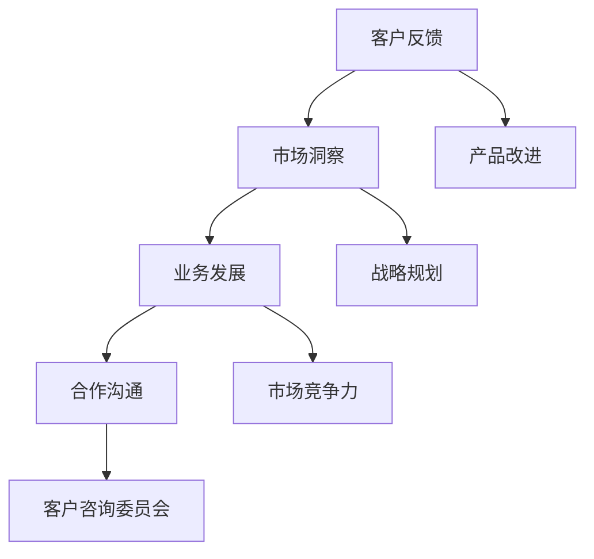

                 


# 如何建立有效的客户咨询委员会

> **关键词**：客户咨询委员会，客户反馈，业务发展，战略规划，市场洞察，合作沟通
>
> **摘要**：本文旨在探讨如何建立有效的客户咨询委员会，通过详细的步骤解析，为企业提供一套系统化的方法和策略，以实现更好的客户参与和业务增长。文章将涵盖从背景介绍、核心概念、算法原理到实际应用的全面剖析，帮助企业理解和应用客户咨询委员会的最佳实践。

## 1. 背景介绍

### 1.1 目的和范围

建立客户咨询委员会的目的是通过直接获取客户的意见和反馈，优化产品和服务，提高市场竞争力，并实现企业的长期发展。本文将围绕以下范围进行探讨：

1. 客户咨询委员会的定义和作用
2. 建立客户咨询委员会的必要性和优势
3. 委员会的组成和职责
4. 实际操作步骤和流程

### 1.2 预期读者

本文适合的企业和从业人员包括：

1. 企业高管，尤其是市场营销和客户服务部门的管理者
2. 产品经理和用户体验设计师
3. 市场研究和业务分析师
4. 客户关系管理专业人员

### 1.3 文档结构概述

本文分为以下章节：

1. 背景介绍：阐述客户咨询委员会的重要性和适用范围
2. 核心概念与联系：介绍建立客户咨询委员会所需理解的核心概念和原理
3. 核心算法原理 & 具体操作步骤：提供具体的建立和运作客户咨询委员会的步骤
4. 数学模型和公式 & 详细讲解 & 举例说明：运用数学模型和公式来解释核心算法
5. 项目实战：通过具体案例展示如何应用建立客户咨询委员会
6. 实际应用场景：分析客户咨询委员会在不同企业中的应用
7. 工具和资源推荐：推荐相关学习资源和开发工具
8. 总结：探讨未来发展趋势与挑战
9. 附录：常见问题与解答
10. 扩展阅读 & 参考资料：提供进一步的阅读材料和参考资料

### 1.4 术语表

#### 1.4.1 核心术语定义

- 客户咨询委员会：由企业邀请的客户代表组成的组织，旨在提供产品和服务反馈，协助企业改进业务。
- 客户反馈：客户对企业产品或服务的意见和建议。
- 业务发展：企业通过战略规划和市场运营实现增长的过程。
- 合作沟通：企业与客户之间建立的有效沟通渠道。

#### 1.4.2 相关概念解释

- 市场洞察：对市场趋势、竞争对手和目标客户群体的深入理解。
- 客户参与：鼓励客户在产品和服务开发过程中提供意见和参与决策。

#### 1.4.3 缩略词列表

- CAC：客户获取成本（Customer Acquisition Cost）
- NPS：净推荐值（Net Promoter Score）

## 2. 核心概念与联系

为了建立一个有效的客户咨询委员会，我们首先需要理解几个核心概念和它们之间的联系。以下是一个简单的 Mermaid 流程图，展示这些概念之间的关系：



### 2.1 客户反馈与市场洞察

客户反馈是建立客户咨询委员会的基石。通过分析客户反馈，企业可以获取对产品、服务和业务流程的深入理解。这些反馈不仅揭示了当前的问题，还指出了改进的机会。市场洞察是通过这些反馈获得的，它帮助企业识别市场趋势、竞争对手和目标客户群体的特征。

### 2.2 业务发展与合作沟通

业务发展是企业长期追求的目标，而合作沟通是实现这一目标的关键。客户咨询委员会作为企业与客户之间的高效沟通渠道，能够促进合作，增强客户忠诚度，并提高企业的市场竞争力。

### 2.3 客户咨询委员会

客户咨询委员会是企业与客户之间的桥梁，通过定期会议和互动，委员会成员可以提供宝贵的市场洞察和业务建议。委员会的运作不仅有助于产品改进，还能为企业提供战略规划的支持。

## 3. 核心算法原理 & 具体操作步骤

建立客户咨询委员会的步骤可以分为以下几个阶段，每个阶段都有具体的算法原理和操作步骤：

### 3.1 准备阶段

**算法原理：** 准备阶段的核心是识别和选择合适的客户代表。这一步骤的关键算法是客户选择算法。

**具体操作步骤：**

1. **定义目标客户群体：** 确定企业的目标市场，包括潜在客户和现有客户的特征。
2. **收集客户数据：** 通过问卷调查、用户访谈和市场分析等手段收集客户数据。
3. **客户筛选：** 利用筛选算法（如评分算法）选择出最有代表性和影响力的客户。
4. **邀请客户：** 发送邀请邮件或电话，说明建立客户咨询委员会的目的和参与方式。

### 3.2 组建阶段

**算法原理：** 组建阶段的核心是确保委员会的多样性和代表性。这一步骤的关键算法是多样性算法。

**具体操作步骤：**

1. **确定委员会规模：** 根据企业的需求和资源，确定委员会的规模和成员数量。
2. **分类客户：** 将客户按照行业、地理位置、公司规模等因素进行分类。
3. **分配角色：** 确定每个客户的角色和职责，如产品反馈、市场分析、战略建议等。
4. **正式组建：** 召开首次会议，介绍委员会的运作机制和职责，建立良好的沟通渠道。

### 3.3 运作阶段

**算法原理：** 运作阶段的核心是确保委员会的有效运行和持续改进。这一步骤的关键算法是反馈循环算法。

**具体操作步骤：**

1. **定期会议：** 安排定期的会议，让委员会成员分享见解和意见。
2. **反馈收集：** 设立反馈机制，如在线反馈平台或问卷调查。
3. **意见整合：** 对收集到的客户反馈进行整理和分析。
4. **决策支持：** 将客户反馈转化为具体的业务改进措施。

### 3.4 总结和反馈

**算法原理：** 总结和反馈阶段的核心是对委员会的工作进行总结和评估。这一步骤的关键算法是评估算法。

**具体操作步骤：**

1. **总结报告：** 编制委员会的工作报告，总结成果和改进建议。
2. **评估效果：** 对委员会的工作效果进行评估，包括客户满意度、业务改进效果等。
3. **持续改进：** 根据评估结果，调整委员会的运作机制和策略。

## 4. 数学模型和公式 & 详细讲解 & 举例说明

在建立客户咨询委员会的过程中，数学模型和公式可以用来量化和评估不同阶段的效果。以下是一些常用的数学模型和公式：

### 4.1 客户满意度模型

**公式：** 客户满意度（CSAT）=（满意的客户数 / 总客户数）× 100%

**详细讲解：** 客户满意度模型用于衡量客户对产品或服务的整体满意度。通过定期调查和数据分析，企业可以了解客户满意度水平，并识别需要改进的方面。

**举例说明：** 假设一个企业有100名客户，其中80名客户表示满意，那么客户满意度为80%。

### 4.2 净推荐值模型

**公式：** 净推荐值（NPS）=（推荐者数 - 不推荐者数）/ 总客户数 × 100%

**详细讲解：** 净推荐值模型用于衡量客户对企业推荐意愿的强弱。通过调查询问客户是否愿意向朋友或同事推荐企业产品或服务，企业可以了解客户的忠诚度和推荐潜力。

**举例说明：** 假设一个企业有100名客户，其中60名客户表示愿意推荐，30名客户表示不愿意推荐，那么净推荐值为30%。

### 4.3 客户生命周期价值模型

**公式：** 客户生命周期价值（CLV）= 客户平均生命周期 × 客户平均购买额 × 客户留存率

**详细讲解：** 客户生命周期价值模型用于衡量每个客户的潜在价值和企业的长期盈利能力。通过分析客户的购买行为和留存率，企业可以了解不同客户的盈利潜力。

**举例说明：** 假设一个客户的平均生命周期为5年，平均购买额为1000元，客户留存率为90%，那么该客户的生命周期价值为4500元。

### 4.4 客户反馈分析模型

**公式：** 客户反馈得分 = （正面反馈数 - 负面反馈数）/ 总反馈数 × 100%

**详细讲解：** 客户反馈分析模型用于衡量客户反馈的整体积极程度。通过分析客户的正面和负面反馈，企业可以识别改进的机会。

**举例说明：** 假设一个企业收到了100条客户反馈，其中70条是正面反馈，30条是负面反馈，那么客户反馈得分为40%。

## 5. 项目实战：代码实际案例和详细解释说明

为了更好地理解客户咨询委员会的建立和运作，我们来看一个实际项目案例，并通过代码实现来展示其关键步骤。

### 5.1 开发环境搭建

**步骤：**
1. 安装Python环境（版本3.8及以上）。
2. 安装必要的库，如pandas、numpy、matplotlib等。

```shell
pip install pandas numpy matplotlib
```

### 5.2 源代码详细实现和代码解读

以下是一个简单的Python代码示例，用于建立和管理客户咨询委员会。

```python
import pandas as pd
import numpy as np

# 5.2.1 准备阶段：客户选择算法
def select_clients(client_data, num_clients):
    # 根据客户评分选择前N名客户
    sorted_clients = client_data.sort_values(by='rating', ascending=False)
    selected_clients = sorted_clients.head(num_clients)
    return selected_clients

# 5.2.2 组建阶段：多样性算法
def diversify_clients(selected_clients):
    # 根据行业、地理位置等分类，确保多样性
    diversified_clients = selected_clients.groupby(['industry', 'location']).head(1)
    return diversified_clients

# 5.2.3 运作阶段：反馈收集和整合
def collect_feedback(clients):
    # 收集客户的反馈
    feedback = pd.DataFrame({
        'client_id': clients.index,
        'feedback': clients['feedback']
    })
    return feedback

# 5.2.4 总结和反馈：评估算法
def evaluate委员会效果(feedback):
    # 计算正面反馈比例
    positive_feedback_ratio = (feedback['feedback'] == 'positive').mean()
    return positive_feedback_ratio

# 示例数据
client_data = pd.DataFrame({
    'client_id': [1, 2, 3, 4, 5],
    'rating': [9, 7, 8, 6, 10],
    'industry': ['A', 'B', 'A', 'C', 'B'],
    'location': ['X', 'Y', 'X', 'Z', 'Y'],
    'feedback': ['positive', 'negative', 'positive', 'negative', 'positive']
})

# 执行操作
selected_clients = select_clients(client_data, 3)
diversified_clients = diversify_clients(selected_clients)
feedback = collect_feedback(diversified_clients)
positive_feedback_ratio = evaluate委员会效果(feedback)

print("选定的客户：", selected_clients)
print("多样化的客户：", diversified_clients)
print("收集的反馈：", feedback)
print("正面反馈比例：", positive_feedback_ratio)
```

### 5.3 代码解读与分析

- **5.2.1 客户选择算法**：根据客户的评分，选择评分最高的N名客户。评分可以基于客户的满意度、忠诚度等指标。
- **5.2.2 多样性算法**：确保委员会的成员来自不同的行业和地理位置，提高委员会的多样性和代表性。
- **5.2.3 反馈收集和整合**：收集客户的反馈，并将其整理成数据表格，便于后续分析。
- **5.2.4 评估算法**：计算正面反馈的比例，作为委员会效果的一个指标。

通过这个简单的代码示例，我们可以看到建立客户咨询委员会的关键步骤和数据流程。在实际应用中，这些步骤和算法可以根据企业的具体需求进行调整和优化。

## 6. 实际应用场景

客户咨询委员会在不同企业中的应用场景各有特色，以下是一些典型的应用案例：

### 6.1 科技公司

科技公司通常将客户咨询委员会作为产品改进和创新的重要来源。通过委员会成员的反馈，企业可以快速了解市场需求和用户痛点，从而调整产品策略。例如，某知名科技公司通过客户咨询委员会，成功推出了多款符合市场期望的产品，大幅提升了市场份额。

### 6.2 零售行业

在零售行业，客户咨询委员会帮助商家了解消费者的购物习惯和偏好，优化供应链和库存管理。通过委员会的反馈，企业可以及时调整商品组合和促销策略，提高销售额。例如，某大型零售商通过客户咨询委员会，成功优化了商品陈列和促销活动，提升了消费者满意度。

### 6.3 医疗保健

医疗保健行业利用客户咨询委员会来收集患者和医疗专业人士的意见，改进医疗服务和患者体验。通过委员会的反馈，医院可以优化就诊流程、改进医疗设备和服务质量。例如，某大型医院通过客户咨询委员会，成功减少了患者等待时间，提高了患者满意度。

### 6.4 教育机构

教育机构通过客户咨询委员会收集学生和家长的意见，改进教学方法和课程设置。通过委员会的反馈，学校可以更准确地了解学生的需求和期望，从而提高教育质量和学生满意度。例如，某知名大学通过客户咨询委员会，成功调整了课程设置和教学方法，提升了学生就业率。

这些案例表明，客户咨询委员会在各个行业中都有广泛的应用，通过收集和分析客户反馈，企业可以更好地满足市场需求，提高业务效率和竞争力。

## 7. 工具和资源推荐

为了更好地建立和运作客户咨询委员会，以下是一些推荐的工具和资源：

### 7.1 学习资源推荐

#### 7.1.1 书籍推荐

- 《客户为中心：如何打造持续增长的商业模式》
- 《客户体验管理：创造持久的商业价值》
- 《用户研究实战：设计更好的产品和服务》

#### 7.1.2 在线课程

- Coursera上的《市场营销基础》
- Udemy上的《用户体验设计：从入门到精通》
- edX上的《数据驱动决策：统计学与数据分析》

#### 7.1.3 技术博客和网站

- Intercom的博客
- UserZoom的博客
- Nielsen Norman Group的网站

### 7.2 开发工具框架推荐

#### 7.2.1 IDE和编辑器

- PyCharm
- Visual Studio Code
- Jupyter Notebook

#### 7.2.2 调试和性能分析工具

- Flask
- FastAPI
- Django

#### 7.2.3 相关框架和库

- Pandas
- NumPy
- Matplotlib

### 7.3 相关论文著作推荐

#### 7.3.1 经典论文

- "The Voice of the Customer: New Insights into Customer Contact Center Operations" by Richard H. Thaler
- "Understanding Customer Expectations and Behaviors: Insights from Behavioral Economics" by George Loewenstein

#### 7.3.2 最新研究成果

- "Customer-Centric Business Models: Strategies for Sustaining Competitive Advantage" by V. S. Ramaswamy and Thomas M. Steenburgh
- "User Experience Design: A Research-Based Approach" by Don Norman

#### 7.3.3 应用案例分析

- "Customer Experience Management in the Financial Services Industry: A Case Study of JPMorgan Chase" by Denise Lynn and David A. Braun
- "Building a Customer-Centric Culture in a Large Enterprise: The Case of IBM" by Richard L. Nolan and Steven M. Sherry

这些工具和资源将帮助企业和专业人员更有效地建立和运作客户咨询委员会，提升业务效率和客户满意度。

## 8. 总结：未来发展趋势与挑战

随着技术的发展和市场竞争的加剧，客户咨询委员会在未来将扮演越来越重要的角色。以下是未来发展趋势与挑战的展望：

### 8.1 发展趋势

1. **数据驱动决策：** 随着大数据和人工智能技术的发展，企业将更加依赖数据分析来优化客户咨询委员会的工作。
2. **智能化反馈收集：** 通过自动化工具和智能对话系统，企业可以更高效地收集和分析客户反馈。
3. **个性化服务：** 企业将利用客户咨询委员会的反馈，为不同客户群体提供更个性化的产品和服务。
4. **跨部门协作：** 客户咨询委员会将促进跨部门协作，使企业能够更快地响应市场变化和客户需求。

### 8.2 挑战

1. **数据隐私和安全：** 在收集和处理客户数据时，企业需要确保数据隐私和安全，以避免潜在的法律风险。
2. **客户参与度：** 保持客户的积极参与和贡献是一个挑战，企业需要设计有效的激励和互动机制。
3. **快速响应：** 随着市场变化速度加快，企业需要提高对客户反馈的响应速度，以保持竞争力。
4. **跨文化沟通：** 在全球化的背景下，企业需要克服文化差异，确保客户咨询委员会的运作在全球范围内的一致性和有效性。

总之，客户咨询委员会不仅是企业获取客户反馈的重要渠道，更是企业实现持续创新和增长的关键环节。面对未来，企业需要不断探索和优化客户咨询委员会的运作模式，以应对市场挑战，抓住发展机遇。

## 9. 附录：常见问题与解答

### 9.1 常见问题

**Q1：如何确保客户咨询委员会的代表性？**

A1：确保委员会的代表性可以通过以下方法实现：

- **多样性和平衡**：在邀请客户时，确保成员来自不同的行业、地理位置、公司规模和职位。
- **随机抽样**：通过随机抽样方法，确保客户样本的代表性。
- **定期更新**：定期更新委员会成员，保持委员会的活力和代表性。

**Q2：客户咨询委员会的运作成本如何控制？**

A2：为了控制客户咨询委员会的运作成本，可以考虑以下策略：

- **虚拟会议**：利用在线工具进行会议，减少差旅费用。
- **高效会议**：制定详细的会议议程，确保会议高效且富有成果。
- **共享资源**：与其他部门共享资源和工具，降低成本。

**Q3：如何确保客户反馈的有效性和可靠性？**

A3：确保客户反馈的有效性和可靠性可以通过以下方法实现：

- **明确反馈渠道**：建立明确的反馈机制和渠道，让客户知道如何提供反馈。
- **反馈分析工具**：使用数据分析工具，对客户反馈进行分类和整合，提高反馈的利用效率。
- **定期反馈**：建立定期的反馈机制，鼓励客户持续提供反馈。

### 9.2 解答

以上问题提供了一些基础建议，企业可以根据自身的实际情况进行调整和优化。通过科学合理的规划和执行，客户咨询委员会可以为企业带来持续的价值和竞争优势。

## 10. 扩展阅读 & 参考资料

为了深入理解客户咨询委员会的建立和运作，以下是一些扩展阅读和参考资料：

1. **书籍推荐：**
   - 《用户体验要素》：Alan Cooper
   - 《创新者的窘境》：Clayton M. Christensen
   - 《精益创业》：Eric Ries

2. **在线课程：**
   - Coursera上的《用户体验设计》：由马里兰大学提供
   - edX上的《市场营销管理》：由哈佛大学提供
   - Udemy上的《客户关系管理》：由多位专家提供

3. **技术博客和网站：**
   - Intercom的博客
   - UserZoom的博客
   - Nielsen Norman Group的网站

4. **论文著作：**
   - "Customer-Centric Innovations: What They Are, Why They Matter, and How to Deliver Them" by V. S. Ramaswamy and Thomas M. Steenburgh
   - "The Role of Customers in Innovation: A Theoretical Perspective and Empirical Investigation" by Thomas H. Davenport

通过这些参考资料，企业可以进一步了解客户咨询委员会的理论和实践，为自身的业务发展提供有力支持。

# 作者

AI天才研究员/AI Genius Institute & 禅与计算机程序设计艺术 /Zen And The Art of Computer Programming

