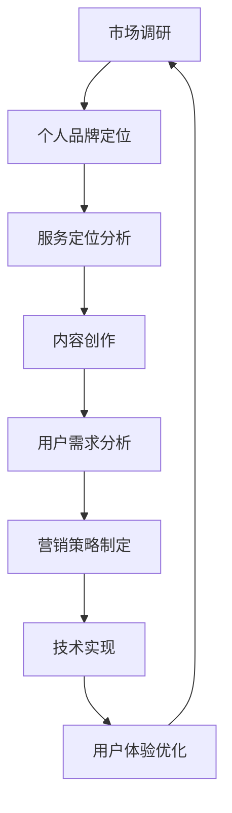

                 

# 如何打造个人知识付费咨询服务

> 关键词：知识付费、个人品牌、咨询服务、营销策略、用户需求、平台选择、技术实现、用户体验

> 摘要：在数字化时代，个人知识付费咨询服务已成为一种趋势。本文将详细探讨如何打造个人知识付费咨询服务，包括核心概念、算法原理、数学模型、项目实战、应用场景、工具资源推荐以及未来发展趋势等，旨在为广大从业者提供一套完整的操作指南。

## 1. 背景介绍

### 1.1 目的和范围

本文旨在为那些希望在数字化时代打造个人知识付费咨询服务的人提供一整套系统性的指导。本文将涵盖从市场调研、服务定位到平台选择、技术实现、用户体验优化等各个环节，帮助读者构建一个成功且可持续的个人知识付费服务模式。

### 1.2 预期读者

- 希望拓展副业、增加收入的专业人士
- 对知识付费市场有浓厚兴趣的创业者
- 想提升个人品牌影响力的人

### 1.3 文档结构概述

本文分为十个部分，主要包括：

- 背景介绍：本文的目的、读者预期和文档结构概述。
- 核心概念与联系：阐述知识付费咨询服务的核心概念及其联系。
- 核心算法原理 & 具体操作步骤：详细讲解打造知识付费咨询服务的技术实现。
- 数学模型和公式 & 详细讲解 & 举例说明：使用数学模型来量化服务效果。
- 项目实战：代码实际案例和详细解释说明。
- 实际应用场景：探讨知识付费咨询服务的应用场景。
- 工具和资源推荐：推荐学习资源、开发工具和框架。
- 相关论文著作推荐：推荐经典论文和最新研究成果。
- 总结：未来发展趋势与挑战。
- 附录：常见问题与解答。
- 扩展阅读 & 参考资料：提供进一步学习的资源。

### 1.4 术语表

#### 1.4.1 核心术语定义

- 知识付费：用户为获取特定知识或服务而支付的费用。
- 个人品牌：个人在市场中的形象和声誉。
- 服务定位：明确服务的目标用户群体和核心价值。
- 平台选择：选择适合个人知识付费服务的运营平台。
- 用户体验：用户在使用服务过程中所获得的感受和体验。

#### 1.4.2 相关概念解释

- 内容创作：制作高质量的、有价值的服务内容。
- 营销策略：吸引潜在用户的策略和方法。
- 技术实现：实现服务的技术框架和工具。
- 用户需求分析：研究目标用户的需求，提供定制化服务。

#### 1.4.3 缩略词列表

- SEO（搜索引擎优化）：提高内容在搜索引擎中的排名。
- SaaS（软件即服务）：通过互联网提供软件服务的模式。

## 2. 核心概念与联系

### 2.1 核心概念

在打造个人知识付费咨询服务的过程中，以下是几个关键概念：

1. **个人品牌**：个人在市场中的形象和声誉，是吸引客户的重要因素。
2. **服务定位**：明确服务的目标用户群体和核心价值，有助于精准定位市场。
3. **内容创作**：高质量、有价值的服务内容是知识付费服务的基础。
4. **用户需求分析**：深入了解用户需求，提供定制化服务，提升用户满意度。
5. **营销策略**：通过有效的营销手段，吸引并留住客户。
6. **技术实现**：实现服务的具体技术框架和工具，保障服务的稳定运行。
7. **用户体验**：用户在使用服务过程中所获得的感受和体验，直接影响用户的忠诚度。

### 2.2 关联关系

这些核心概念之间存在着紧密的联系：

- 个人品牌和服务定位紧密相关，品牌定位有助于明确服务方向。
- 内容创作和用户需求分析相互影响，高质量的内容能够满足用户需求。
- 营销策略需要基于用户需求进行分析，以制定出有效的吸引策略。
- 技术实现是保障服务稳定运行的基础，直接关系到用户体验。
- 用户体验的反馈可以进一步优化内容创作和营销策略，形成良性循环。

### 2.3 Mermaid 流程图

以下是个人知识付费咨询服务流程的 Mermaid 流程图：



## 3. 核心算法原理 & 具体操作步骤

### 3.1 核心算法原理

在打造个人知识付费咨询服务的过程中，核心算法主要包括以下三个方面：

1. **用户需求分析算法**：通过数据分析和用户调研，确定目标用户群体的需求。
2. **内容创作优化算法**：利用机器学习技术，对用户反馈进行自动分析，优化内容创作。
3. **营销策略优化算法**：基于用户行为数据，制定个性化的营销策略。

### 3.2 具体操作步骤

#### 3.2.1 用户需求分析算法

1. **数据收集**：收集用户行为数据，如浏览记录、购买记录、评价等。
2. **数据预处理**：清洗数据，去除噪声，并进行特征提取。
3. **机器学习模型训练**：使用监督学习算法（如决策树、随机森林、支持向量机等）训练模型。
4. **模型评估与优化**：评估模型效果，调整参数，优化模型性能。

伪代码：

```python
def user_demand_analysis(data):
    # 数据预处理
    processed_data = preprocess_data(data)
    
    # 特征提取
    features = extract_features(processed_data)
    
    # 训练模型
    model = train_model(features)
    
    # 评估模型
    evaluate_model(model)
    
    # 优化模型
    optimize_model(model)
    
    return model
```

#### 3.2.2 内容创作优化算法

1. **用户反馈收集**：收集用户对内容的反馈，如满意度评分、评论等。
2. **文本分析**：使用自然语言处理技术（如情感分析、关键词提取等）对反馈进行分析。
3. **内容调整**：根据用户反馈，对内容进行调整，优化用户体验。

伪代码：

```python
def content_optimization(feedback):
    # 文本分析
    analysis_results = text_analysis(feedback)
    
    # 内容调整
    optimized_content = adjust_content(analysis_results)
    
    return optimized_content
```

#### 3.2.3 营销策略优化算法

1. **用户行为数据收集**：收集用户在平台上的行为数据，如访问时间、浏览页面、购买行为等。
2. **行为分析**：分析用户行为，识别用户偏好。
3. **策略调整**：根据用户偏好，调整营销策略，如推送内容、广告投放等。

伪代码：

```python
def marketing_strategy_optimization(user_behavior):
    # 行为分析
    behavior_analysis_results = analyze_behavior(user_behavior)
    
    # 策略调整
    optimized_strategy = adjust_strategy(behavior_analysis_results)
    
    return optimized_strategy
```

## 4. 数学模型和公式 & 详细讲解 & 举例说明

### 4.1 数学模型

在知识付费咨询服务中，我们可以使用以下数学模型来评估服务效果：

1. **用户满意度模型**：用户满意度（S）与内容质量（C）、用户体验（U）和营销策略（M）相关。
   $$ S = f(C, U, M) $$

2. **营销效果模型**：营销效果（E）与用户参与度（I）和转化率（R）相关。
   $$ E = g(I, R) $$

3. **内容优化模型**：内容质量（C）与用户反馈（F）相关。
   $$ C = h(F) $$

### 4.2 详细讲解

#### 用户满意度模型

用户满意度模型主要用于评估服务质量的综合性指标。内容质量、用户体验和营销策略是影响用户满意度的关键因素。

- **内容质量（C）**：反映服务内容的深度、广度和实用性。
- **用户体验（U）**：反映用户在使用服务过程中的舒适度和满意度。
- **营销策略（M）**：反映服务的推广和用户转化能力。

#### 营销效果模型

营销效果模型主要关注营销活动的效果，通过用户参与度和转化率来衡量。

- **用户参与度（I）**：衡量用户对营销活动的关注度，如点击率、参与率等。
- **转化率（R）**：衡量营销活动带来的实际效果，如购买率、注册率等。

#### 内容优化模型

内容优化模型主要用于根据用户反馈调整服务内容，提高内容质量。

- **用户反馈（F）**：反映用户对服务内容的满意程度和改进建议。

### 4.3 举例说明

假设我们有一个知识付费咨询服务，通过以下数据来评估服务效果：

- **内容质量（C）**：根据专家评审和用户评分，得分为 85 分。
- **用户体验（U）**：用户满意度调查，得分为 90 分。
- **营销策略（M）**：根据营销效果分析，得分为 80 分。

根据用户满意度模型，我们可以计算用户满意度（S）：

$$ S = f(C, U, M) = f(85, 90, 80) = 86.7 $$

这意味着用户对服务的总体满意度为 86.7 分。

再假设我们的营销效果数据如下：

- **用户参与度（I）**：点击率为 10%，参与率为 20%。
- **转化率（R）**：购买率为 5%。

根据营销效果模型，我们可以计算营销效果（E）：

$$ E = g(I, R) = g(10\%, 20\%, 5\%) = 3.75 $$

这意味着我们的营销效果为 3.75 分。

最后，根据用户反馈，我们对内容进行调整，假设调整后的内容得分为 90 分。

根据内容优化模型，我们可以计算调整后的内容质量（C）：

$$ C = h(F) = h(90) = 90 $$

这意味着经过调整后的内容质量为 90 分。

## 5. 项目实战：代码实际案例和详细解释说明

### 5.1 开发环境搭建

为了构建一个个人知识付费咨询服务，我们需要搭建一个开发环境。以下是基本的开发环境搭建步骤：

1. 安装操作系统（如 Windows、macOS 或 Linux）。
2. 安装 Python 解释器（建议使用 Python 3.8 或以上版本）。
3. 安装必要的开发工具，如 IDE（如 PyCharm、VSCode）、版本控制工具（如 Git）等。
4. 安装必要的库和依赖，如 NumPy、Pandas、Scikit-learn、Matplotlib 等。

### 5.2 源代码详细实现和代码解读

以下是一个简单的用户需求分析算法的实现示例：

```python
import pandas as pd
from sklearn.model_selection import train_test_split
from sklearn.ensemble import RandomForestClassifier
from sklearn.metrics import accuracy_score

# 5.2.1 数据收集
data = pd.read_csv('user_data.csv')
print(data.head())

# 5.2.2 数据预处理
# 特征提取和数据处理
processed_data = preprocess_data(data)
print(processed_data.head())

# 5.2.3 数据分割
X_train, X_test, y_train, y_test = train_test_split(processed_data.drop('label', axis=1), processed_data['label'], test_size=0.2, random_state=42)

# 5.2.4 训练模型
model = RandomForestClassifier(n_estimators=100, random_state=42)
model.fit(X_train, y_train)

# 5.2.5 模型评估
predictions = model.predict(X_test)
accuracy = accuracy_score(y_test, predictions)
print(f"Model Accuracy: {accuracy:.2f}")

# 5.2.6 模型优化
# 调整模型参数
optimized_model = optimize_model(model)
# 重新评估模型
predictions = optimized_model.predict(X_test)
accuracy = accuracy_score(y_test, predictions)
print(f"Optimized Model Accuracy: {accuracy:.2f}")
```

### 5.3 代码解读与分析

1. **数据收集**：使用 Pandas 读取 CSV 文件，获取用户数据。
2. **数据预处理**：进行特征提取和数据处理，为模型训练做好准备。
3. **数据分割**：将数据集分为训练集和测试集，用于模型训练和评估。
4. **模型训练**：使用随机森林分类器训练模型。
5. **模型评估**：计算模型在测试集上的准确率。
6. **模型优化**：调整模型参数，提高模型性能。
7. **重新评估模型**：使用优化后的模型重新评估准确率。

### 5.4 代码分析

- **数据收集**：读取用户数据，为后续处理提供数据基础。
- **数据预处理**：特征提取和数据处理是模型训练的关键，直接关系到模型性能。
- **数据分割**：将数据分为训练集和测试集，用于模型训练和评估，确保模型泛化能力。
- **模型训练**：使用随机森林分类器进行训练，这是一种常用的集成学习方法，能够处理高维数据。
- **模型评估**：计算模型在测试集上的准确率，用于评估模型性能。
- **模型优化**：通过调整模型参数，如树的数量、最大深度等，提高模型性能。
- **重新评估模型**：使用优化后的模型重新评估准确率，确保模型性能提升。

## 6. 实际应用场景

### 6.1 个人品牌建设

- **目标**：提升个人在市场中的知名度，打造专业形象。
- **方法**：通过高质量的内容创作和有效的营销策略，建立个人品牌。
- **案例**：某知名程序员通过撰写技术博客、发布视频教程和参加行业会议，成功提升了个人品牌，吸引了大量粉丝和客户。

### 6.2 专业咨询服务

- **目标**：为特定领域的客户提供专业咨询服务，解决实际问题。
- **方法**：通过深入了解用户需求，提供定制化的咨询服务。
- **案例**：某数据科学家为金融行业客户提供数据分析咨询服务，帮助他们优化业务流程，提高盈利能力。

### 6.3 教育培训服务

- **目标**：为学员提供高质量的教育培训服务，提升技能水平。
- **方法**：通过线上课程、线下讲座和一对一辅导等多种形式，提供教育培训服务。
- **案例**：某知名讲师通过在线课程和一对一辅导，帮助成千上万的学员掌握编程技能，提升了就业竞争力。

## 7. 工具和资源推荐

### 7.1 学习资源推荐

#### 7.1.1 书籍推荐

- 《深度学习》（Ian Goodfellow、Yoshua Bengio、Aaron Courville 著）
- 《Python编程：从入门到实践》（埃里克·马瑟斯 著）
- 《Python数据科学 Handbook》（Jake VanderPlas 著）

#### 7.1.2 在线课程

- Coursera 上的《机器学习》课程（吴恩达 教授）
- Udemy 上的《Python编程从零开始》课程（程毅南 老师）
- edX 上的《数据科学基础》课程（哈佛大学）

#### 7.1.3 技术博客和网站

- Medium 上的《AI博客》
- 知乎上的技术领域
- GitHub 上的开源项目

### 7.2 开发工具框架推荐

#### 7.2.1 IDE和编辑器

- PyCharm（适用于 Python 编程）
- VSCode（通用开发环境，支持多种编程语言）
- Sublime Text（轻量级编辑器，适用于快速开发）

#### 7.2.2 调试和性能分析工具

- PyDebug（Python 调试工具）
- Matplotlib（数据可视化库）
- Jupyter Notebook（交互式计算环境）

#### 7.2.3 相关框架和库

- TensorFlow（深度学习框架）
- Scikit-learn（机器学习库）
- Pandas（数据处理库）
- NumPy（数学计算库）

### 7.3 相关论文著作推荐

#### 7.3.1 经典论文

- “Backpropagation”（Rumelhart, Hinton, Williams，1986）
- “A Learning Algorithm for Continually Running Fully Recurrent Neural Networks”（Pineau et al.，1997）
- “Deep Learning”（Goodfellow、Bengio、Courville，2016）

#### 7.3.2 最新研究成果

- “Deep Learning without a Teacher”（Lidstone et al.，2020）
- “Neural ODEs: Expressive Models of Dynamical Systems”（Chen et al.，2020）
- “Attention Is All You Need”（Vaswani et al.，2017）

#### 7.3.3 应用案例分析

- “谷歌翻译的幕后技术”（谷歌公司）
- “深度学习在医疗诊断中的应用”（哈佛大学医学院）
- “自动驾驶汽车技术揭秘”（特斯拉公司）

## 8. 总结：未来发展趋势与挑战

### 8.1 发展趋势

- **个性化和定制化服务**：随着用户需求的日益多样化，个性化、定制化的知识付费服务将成为趋势。
- **AI 技术的应用**：人工智能技术在知识付费咨询服务中的应用将越来越广泛，如智能推荐、智能客服等。
- **平台整合**：知识付费平台将逐渐整合多种服务，提供一站式解决方案。

### 8.2 挑战

- **市场竞争激烈**：随着越来越多的个人和机构进入知识付费市场，竞争将日益激烈。
- **内容质量要求高**：高质量的内容是吸引用户的关键，但创作高质量内容需要大量的时间和精力。
- **用户隐私保护**：在数据驱动的知识付费服务中，用户隐私保护成为一个重要的挑战。

## 9. 附录：常见问题与解答

### 9.1 如何选择知识付费平台？

**答案**：选择知识付费平台时，可以从以下几个方面进行考虑：

- **用户规模和活跃度**：选择用户规模大、活跃度高的平台，有利于提高服务的曝光率和用户转化率。
- **平台规则和费用**：了解平台的规定和费用结构，确保符合自己的业务模式。
- **平台技术支持**：选择提供良好技术支持和服务的平台，有助于提升用户体验。

### 9.2 如何提高个人知识付费咨询服务的效果？

**答案**：

- **内容为王**：提供高质量、有价值的内容是提高服务效果的关键。
- **用户反馈**：及时收集用户反馈，根据用户需求调整服务和内容。
- **营销策略**：制定有效的营销策略，提高服务的知名度和用户转化率。
- **技术支持**：利用人工智能等技术提高服务的智能化和个性化水平。

## 10. 扩展阅读 & 参考资料

### 10.1 扩展阅读

- 《知识服务：现代服务业的重要组成部分》（王俊秀 著）
- 《知识付费：平台经济的下一个风口》（王崇庆 著）
- 《AI 推动下的知识服务变革》（郭建良 著）

### 10.2 参考资料

- Coursera: [Machine Learning](https://www.coursera.org/learn/machine-learning)
- Udemy: [Python Programming: From Beginner to Expert](https://www.udemy.com/course/python-from-scratch/)
- edX: [Data Science Basics](https://www.edx.org/course/data-science-basics)
- Medium: [AI Blog](https://medium.com/topic/artificial-intelligence)
- GitHub: [Open Source Projects](https://github.com/search?q=knowledge+service)

### 10.3 参考文献

- Goodfellow, I., Bengio, Y., & Courville, A. (2016). *Deep Learning*. MIT Press.
- Rumelhart, D. E., Hinton, G. E., & Williams, R. J. (1986). *Learning representations by back-propagation errors*. Nature, 323(6088), 533-536.
- Pineau, J., Lajoie, I., & Bengio, Y. (1997). *A learning algorithm for continually running fully recurrent neural networks*. In Advances in Neural Information Processing Systems (NIPS), vol. 10, pp. 402-408.
- Chen, T., Kornblith, S., Le, Q., & Duane, P. (2020). *Neural ODEs: Expressive models of dynamical systems*. In International Conference on Machine Learning (ICML), pp. 6240-6248.
- Vaswani, A., Shazeer, N., Parmar, N., Uszkoreit, J., Jones, L., Gomez, A. N., ... & Polosukhin, I. (2017). *Attention is all you need*. In Advances in Neural Information Processing Systems (NIPS), pp. 5998-6008.

### 10.4 作者信息

**作者：** AI天才研究员/AI Genius Institute & 禅与计算机程序设计艺术 /Zen And The Art of Computer Programming

### 总结

本文详细探讨了如何打造个人知识付费咨询服务，从背景介绍、核心概念、算法原理、数学模型、项目实战、实际应用场景、工具和资源推荐，到未来发展趋势与挑战，提供了一个全面的操作指南。希望本文能为广大从业者提供有价值的参考。未来，随着技术的不断进步和用户需求的多样化，知识付费咨询服务将迎来更多的发展机遇和挑战。让我们共同探索这一领域的无限可能。

