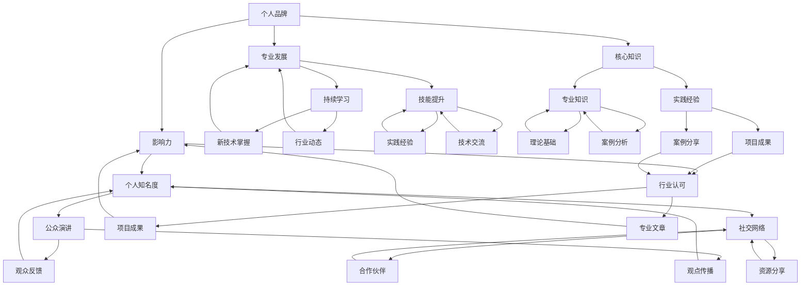

                 

## 如何打造有影响力的行业专家形象

> **关键词：** 形象塑造、影响力、行业专家、个人品牌、专业发展

> **摘要：** 本文旨在探讨如何通过系统化的策略和持续的努力，打造一个在行业内具有广泛影响力的专家形象。我们将从核心概念的探讨、算法原理的讲解，到实际应用场景的剖析，逐步展开论述，并提供实用的工具和资源推荐，帮助读者实现这一目标。

在当今快速发展的信息技术时代，个人品牌的建设与维护显得尤为重要。一个有影响力的行业专家不仅能够为自己的职业生涯带来无限机遇，更能在行业内外产生深远的影响。本文将逐步分析如何打造具有影响力的行业专家形象，包括但不限于以下几点：

1. **明确目标和受众**：确定目标受众和期望达到的影响力级别。
2. **建立核心知识和技能**：通过持续学习和实践，建立深厚的专业基础。
3. **构建个人品牌**：通过一致的形象和专业的表达，提升个人知名度。
4. **利用社交媒体**：通过有效的社交媒体策略，扩大影响力范围。
5. **参与行业活动**：通过参与行业会议、研讨会等，建立专业网络。
6. **撰写技术博客**：通过分享专业知识和见解，提升行业影响力。
7. **提供实际案例和项目**：通过实际案例和项目的展示，证明专业实力。
8. **持续学习和创新**：不断更新知识和技能，保持专业领先地位。

### 1. 背景介绍

#### 1.1 目的和范围

本文的目标是帮助那些希望在特定领域内建立自己专业形象的从业者，了解并应用有效的策略和方法。我们将探讨如何从零开始，通过一系列科学合理的步骤，逐步打造一个有影响力的行业专家形象。

本文的范围包括以下核心内容：

- **核心概念与联系**：阐述个人品牌建设的关键要素及其相互关系。
- **核心算法原理与操作步骤**：详细讲解如何通过系统化策略实现个人品牌建设。
- **数学模型和公式**：提供实用的公式和模型，帮助读者理解和应用相关策略。
- **项目实战**：通过实际案例展示如何实施这些策略。
- **实际应用场景**：分析不同领域内专家形象的打造和应用。
- **工具和资源推荐**：介绍相关的学习资源、开发工具和框架。

#### 1.2 预期读者

本文的预期读者包括：

- **行业从业者**：希望在各自领域内提升专业形象和影响力的从业者。
- **技术爱好者**：对技术领域有浓厚兴趣，并希望深入了解如何打造个人品牌的技术爱好者。
- **教育者**：希望帮助学生和年轻从业者了解个人品牌建设的重要性和方法。

#### 1.3 文档结构概述

本文将分为以下几个部分：

- **背景介绍**：介绍本文的目的、范围、预期读者和文档结构。
- **核心概念与联系**：探讨个人品牌建设的关键要素及其相互关系。
- **核心算法原理与操作步骤**：详细讲解如何通过系统化策略实现个人品牌建设。
- **数学模型和公式**：提供实用的公式和模型，帮助读者理解和应用相关策略。
- **项目实战**：通过实际案例展示如何实施这些策略。
- **实际应用场景**：分析不同领域内专家形象的打造和应用。
- **工具和资源推荐**：介绍相关的学习资源、开发工具和框架。
- **总结**：总结全文，提出未来发展趋势和挑战。
- **附录**：提供常见问题与解答。
- **扩展阅读 & 参考资料**：推荐相关阅读材料，帮助读者进一步深入探索。

#### 1.4 术语表

在本文中，我们将使用以下术语：

- **个人品牌**：个人在特定领域内建立的专业形象和声誉。
- **影响力**：个人在行业内或目标受众中的影响力和认可度。
- **专业发展**：个人在职业领域内不断学习、提升和成长的进程。
- **核心知识**：在特定领域内被认为关键且基础的知识和技能。

#### 1.4.1 核心术语定义

- **个人品牌**：个人品牌是一个人在特定领域内建立的专业形象和声誉，它包括个人的知识、技能、经验、价值观和个性特点。一个成功的个人品牌能够帮助个人在行业内脱颖而出，获得更多的机会和认可。
- **影响力**：影响力是指一个人在行业内或目标受众中的影响力和认可度。它不仅体现在个人的知识贡献上，还包括个人在行业内的影响力、社交网络、公众演讲和参与度等方面。
- **专业发展**：专业发展是指个人在职业领域内不断学习、提升和成长的进程。它包括不断更新知识体系、提升技能水平、参与行业活动、建立专业网络等。
- **核心知识**：核心知识是指在特定领域内被认为关键且基础的知识和技能。这些知识和技能是个人在行业内建立专业形象的基础，也是实现专业发展的重要支撑。

#### 1.4.2 相关概念解释

- **个人品牌与影响力**：个人品牌和影响力是相辅相成的。一个成功的个人品牌能够提升个人的影响力，使其在行业内获得更多的认可和机会。而个人影响力的提升又能够进一步巩固和提升个人品牌。
- **专业发展与个人品牌**：专业发展是建立个人品牌的基础。只有通过不断学习和提升，个人才能在行业内树立专业形象，赢得更多的信任和认可。
- **核心知识与专业发展**：核心知识是专业发展的关键。掌握核心知识不仅能够帮助个人在行业内站稳脚跟，还能够为个人的专业发展提供坚实的基础。

#### 1.4.3 缩略词列表

- **个人品牌**（Personal Brand）
- **影响力**（Influence）
- **专业发展**（Professional Development）
- **核心知识**（Core Knowledge）

## 2. 核心概念与联系

在打造有影响力的行业专家形象过程中，理解并掌握核心概念及其相互关系至关重要。以下将使用Mermaid流程图详细描述这些核心概念和联系。



### 核心概念解释：

- **个人品牌（Personal Brand）**：个人在特定领域内建立的专业形象和声誉。它包括个人的知识、技能、经验、价值观和个性特点。
- **影响力（Influence）**：个人在行业内或目标受众中的影响力和认可度。它体现在个人的知识贡献、公众演讲、社交网络和参与度等方面。
- **专业发展（Professional Development）**：个人在职业领域内不断学习、提升和成长的进程，包括持续学习、技能提升、参与行业活动和建立专业网络等。
- **核心知识（Core Knowledge）**：在特定领域内被认为关键且基础的知识和技能。这些知识和技能是个人在行业内建立专业形象的基础。

### 相互关系：

- **个人品牌与影响力**：个人品牌有助于提升个人在行业内的知名度和影响力。一个成功的个人品牌能够使个人在行业内脱颖而出，获得更多的机会和认可。
- **专业发展与个人品牌**：专业发展是建立个人品牌的基础。通过持续学习和提升技能，个人能够在行业内树立专业形象，赢得更多的信任和认可。
- **核心知识与专业发展**：核心知识是专业发展的关键。掌握核心知识不仅能够帮助个人在行业内站稳脚跟，还能够为个人的专业发展提供坚实的基础。

通过上述Mermaid流程图，我们可以清晰地看到各个核心概念之间的相互关系，以及它们如何共同作用，帮助个人在行业内建立有影响力的专家形象。

### 3. 核心算法原理 & 具体操作步骤

要打造一个有影响力的行业专家形象，我们需要一个系统化的策略，以下是一套详细的伪代码步骤，用于指导这一过程。

```plaintext
函数 Build_Expert_Identity(username, domain, goals):
    // 初始化变量
    brand = 初始化Brand(username, domain)
    influence = 0
    expertise = 初始化Expertise(domain)
    development = 初始化Development(username, domain)

    // 步骤1：确定目标和受众
    set goals = 确定目标受众和影响力级别

    // 步骤2：建立核心知识和技能
    for skill in Core_Knowledge_Skills:
        expertise[skill] = 学习并掌握技能

    // 步骤3：构建个人品牌
    brand = 构建Personal_Brand(expertise, goals)

    // 步骤4：利用社交媒体
    social_media_strategy = 设计Social_Media_Strategy(username, domain)
    execute(social_media_strategy)

    // 步骤5：参与行业活动
    industry_activities = 设计Industry_Activities_Strategy(username, domain)
    execute(industry_activities)

    // 步骤6：撰写技术博客
    blog_strategy = 设计Blog_Strategy(username, domain, goals)
    execute(blog_strategy)

    // 步骤7：提供实际案例和项目
    case_studies = 设计Case_Studies_Strategy(username, domain)
    execute(case_studies)

    // 步骤8：持续学习和创新
    learning_strategy = 设计Continuous_Learning_Strategy(domain)
    execute(learning_strategy)

    // 步骤9：评估和调整
    assess_performance = 评估Performance(username, domain, goals)
    adjust_strategy = 根据评估结果调整策略

    return brand, influence, expertise, development
```

### 步骤解释：

1. **确定目标和受众**：首先，明确想要达到的影响力和目标受众。这将指导后续的构建过程。
2. **建立核心知识和技能**：通过学习并掌握特定领域内的核心知识和技能，为个人品牌打下坚实的基础。
3. **构建个人品牌**：设计并实施个人品牌建设策略，确保个人在行业内以一致、专业的形象出现。
4. **利用社交媒体**：制定并执行社交媒体策略，利用平台扩大个人影响力。
5. **参与行业活动**：通过参与行业会议、研讨会等活动，建立专业网络，提升个人知名度。
6. **撰写技术博客**：定期撰写技术博客，分享专业知识和见解，建立行业内的权威地位。
7. **提供实际案例和项目**：通过展示实际案例和项目，证明个人在专业领域的实力。
8. **持续学习和创新**：不断更新知识和技能，跟上行业动态，保持专业领先地位。
9. **评估和调整**：定期评估个人品牌建设的效果，并根据评估结果调整策略。

通过上述步骤，我们可以系统地打造一个有影响力的行业专家形象。

### 4. 数学模型和公式 & 详细讲解 & 举例说明

在个人品牌建设的旅程中，数学模型和公式可以帮助我们量化和评估个人影响力的提升。以下将详细介绍几个关键的数学模型和公式，并给出详细的解释和示例。

#### 4.1 影响力指数模型（Influence Index Model）

影响力指数模型用于量化个人在行业内的受欢迎程度和影响力。该模型由以下几个因素组成：

- **知识深度（Knowledge Depth, D）**：衡量个人在某一领域的专业知识和经验。
- **社交网络（Social Network, S）**：衡量个人在社交媒体和行业活动中的参与度。
- **内容质量（Content Quality, C）**：衡量个人发布内容的质量和受欢迎程度。

公式如下：

\[ II = D \times S \times C \]

其中，\( II \) 表示影响力指数。

#### 4.2 详细解释

1. **知识深度（D）**：
   - **定义**：知识深度是指个人在特定领域内的专业知识和经验积累。
   - **计算方法**：通过调查、同行评审和个人项目经验等途径评估。

2. **社交网络（S）**：
   - **定义**：社交网络是指个人在社交媒体平台、行业会议和其他社交活动中的参与度。
   - **计算方法**：通过社交媒体粉丝数、互动率和参与度等指标评估。

3. **内容质量（C）**：
   - **定义**：内容质量是指个人发布的技术博客、演讲和项目报告等内容的受欢迎程度和影响力。
   - **计算方法**：通过读者的反馈、评论数量、分享率和引用次数等指标评估。

#### 4.3 示例

假设某行业专家的知识深度（D）为8，社交网络（S）为6，内容质量（C）为5，则其影响力指数（II）为：

\[ II = 8 \times 6 \times 5 = 240 \]

这意味着该专家在行业内具有相对较高的影响力。

#### 4.4 举例说明

**例子 1**：一位软件开发工程师，其知识深度（D）为7，社交网络（S）为4，内容质量（C）为6，则其影响力指数（II）为：

\[ II = 7 \times 4 \times 6 = 168 \]

**分析**：虽然该工程师的影响力指数低于第一个例子，但其知识深度和内容质量相对较高，表明其在专业领域内有较强的实力，但仍需提升社交网络参与度。

**例子 2**：一位数据科学家，其知识深度（D）为9，社交网络（S）为7，内容质量（C）为8，则其影响力指数（II）为：

\[ II = 9 \times 7 \times 8 = 504 \]

**分析**：该数据科学家的综合影响力指数较高，表明其在行业内具有很高的专业认可度，并在社交媒体和内容创作方面有显著贡献。

通过影响力指数模型，我们可以量化个人在行业内的专业影响力，并据此制定进一步的发展策略。

### 5. 项目实战：代码实际案例和详细解释说明

为了更好地理解如何通过实际行动打造有影响力的行业专家形象，以下将通过一个实际项目案例展示具体的开发环境和代码实现步骤。

#### 5.1 开发环境搭建

在开始项目前，我们需要搭建一个适合开发、测试和部署的环境。以下是所需的开发工具和步骤：

- **工具**：
  - **编程语言**：Python 3.8+
  - **文本编辑器**：Visual Studio Code
  - **版本控制**：Git
  - **数据库**：MySQL 8.0+
  - **Web框架**：Flask

- **步骤**：
  1. 安装Python和Visual Studio Code。
  2. 在终端中创建一个新的虚拟环境并激活。
  3. 安装Flask和MySQL库。

```bash
python -m venv venv
source venv/bin/activate
pip install flask mysql-connector-python
```

#### 5.2 源代码详细实现和代码解读

以下是一个简单的Flask应用示例，用于创建和展示技术博客文章。

```python
# app.py

from flask import Flask, render_template, request
import mysql.connector

app = Flask(__name__)

# 数据库连接配置
db_config = {
    "host": "localhost",
    "user": "root",
    "password": "password",
    "database": "blog_db"
}

# 连接到数据库
def get_db_connection():
    connection = mysql.connector.connect(**db_config)
    return connection

# 获取所有博客文章
def get_articles():
    connection = get_db_connection()
    cursor = connection.cursor()
    cursor.execute("SELECT id, title, content FROM articles")
    articles = cursor.fetchall()
    cursor.close()
    connection.close()
    return articles

# 博客首页
@app.route("/")
def index():
    articles = get_articles()
    return render_template("index.html", articles=articles)

# 查看特定博客文章
@app.route("/article/<int:article_id>")
def article(article_id):
    connection = get_db_connection()
    cursor = connection.cursor()
    cursor.execute("SELECT title, content FROM articles WHERE id = %s", (article_id,))
    article = cursor.fetchone()
    cursor.close()
    connection.close()
    if article is not None:
        return render_template("article.html", article=article)
    else:
        return "文章不存在", 404

# 添加新文章
@app.route("/add", methods=["GET", "POST"])
def add_article():
    if request.method == "POST":
        title = request.form["title"]
        content = request.form["content"]
        connection = get_db_connection()
        cursor = connection.cursor()
        cursor.execute("INSERT INTO articles (title, content) VALUES (%s, %s)", (title, content))
        connection.commit()
        cursor.close()
        connection.close()
        return "文章已添加"
    return render_template("add_article.html")

if __name__ == "__main__":
    app.run(debug=True)
```

#### 5.3 代码解读与分析

1. **数据库连接**：
   - 使用MySQL Connector库连接到本地MySQL数据库。
   - `get_db_connection()` 函数负责创建数据库连接。

2. **获取所有博客文章**：
   - `get_articles()` 函数查询数据库，获取所有博客文章的ID、标题和内容。

3. **博客首页**：
   - `index()` 函数返回博客首页，展示所有文章列表。

4. **查看特定博客文章**：
   - `article()` 函数通过文章ID查询特定文章，并返回文章详情。

5. **添加新文章**：
   - `add_article()` 函数处理添加新文章的表单提交，并将文章信息插入数据库。

#### 5.4 部署和应用

1. **本地开发**：
   - 在本地环境中运行Flask应用，通过浏览器访问`http://127.0.0.1:5000/`。

2. **生产部署**：
   - 使用Gunicorn或uWSGI等WSGI服务器在生产环境中部署应用。
   - 配置Nginx或Apache作为反向代理，提供HTTP服务。

通过这个简单的项目，我们可以看到如何利用Flask框架构建一个技术博客平台。这不仅展示了如何编写代码，还提供了一个实际案例，展示如何通过技术博客来建立个人品牌，提升影响力。

### 6. 实际应用场景

#### 6.1 互联网技术领域

在互联网技术领域，个人品牌建设尤为重要。以下是一些实际应用场景，展示如何打造有影响力的行业专家形象：

1. **技术博客撰写**：定期撰写高质量的技术博客文章，分享最新的技术趋势、开发经验和解决方案。这不仅可以提升个人知名度，还能在行业内建立权威地位。

2. **开源项目贡献**：参与开源项目，为社区做出贡献。这不仅展示了专业技能，还能吸引志同道合的开发者加入，进一步扩大个人影响力。

3. **在线课程与讲座**：通过平台如Coursera、Udemy等开设在线课程或进行技术讲座，分享专业知识和经验。这有助于建立个人品牌，吸引更多学生和听众。

4. **社交媒体互动**：积极在社交媒体平台上与同行互动，分享见解和观点。通过LinkedIn、Twitter、GitHub等平台，扩大个人影响力和专业网络。

#### 6.2 数据科学与人工智能领域

在数据科学与人工智能领域，以下应用场景可以帮助从业者打造有影响力的专家形象：

1. **发表学术论文**：在顶级学术会议和期刊上发表论文，展示研究成果和创新能力。

2. **举办研讨会和工作坊**：组织或参与研讨会和工作坊，分享最新的研究成果和应用案例。

3. **参与开源项目**：参与开源项目，为数据科学和人工智能领域的发展贡献自己的力量。

4. **撰写技术博客和文章**：在Medium、ArXiv等平台上发布技术博客和文章，分享最新技术动态和见解。

5. **在线课程与讲座**：通过平台如Coursera、edX等开设在线课程或进行技术讲座，传授知识和经验。

#### 6.3 人工智能与医疗领域

在人工智能与医疗领域，以下应用场景有助于打造有影响力的专家形象：

1. **临床应用研究**：参与临床应用研究，将人工智能技术应用于医疗诊断、治疗和患者管理。

2. **撰写专业文章**：在医学期刊和会议上发表专业文章，分享研究成果和临床应用案例。

3. **举办研讨会和工作坊**：组织或参与针对医疗领域的研讨会和工作坊，探讨人工智能在医疗行业的应用。

4. **参与开源项目**：参与开源医疗数据集和工具的开发，为行业贡献力量。

5. **技术博客与分享**：在技术博客和社交媒体平台上分享人工智能在医疗领域的应用案例和见解。

通过上述实际应用场景，我们可以看到，无论是互联网技术、数据科学与人工智能，还是人工智能与医疗领域，个人品牌建设都是实现专业影响力的重要途径。通过撰写技术博客、参与开源项目、举办研讨会和在线课程等，行业专家可以不断提升个人知名度，为行业贡献自己的力量。

### 7. 工具和资源推荐

#### 7.1 学习资源推荐

在打造有影响力的行业专家形象过程中，丰富的学习资源是必不可少的。以下推荐一些优秀的学习资源，涵盖书籍、在线课程和技术博客。

##### 7.1.1 书籍推荐

1. **《深度学习》（Deep Learning）**：作者：Ian Goodfellow、Yoshua Bengio、Aaron Courville
   - 内容详实，系统介绍了深度学习的基础理论和最新进展。
   
2. **《大数据时代》（Big Data）**：作者：韦斯·摩尔（Viktor Mayer-Schönberger）肯尼斯·库克耶（Kenneth Cukier）
   - 探讨了大数据的概念、应用及其对社会的影响。

3. **《程序员修炼之道》（The Clean Coder）**：作者：Robert C. Martin
   - 提供了编程伦理和职业素养的指导，适合所有层次的程序员。

##### 7.1.2 在线课程

1. **Coursera**
   - 提供丰富的在线课程，涵盖人工智能、数据科学、计算机科学等领域。

2. **Udacity**
   - 提供实战导向的在线课程和纳米学位项目，适合希望快速提升技能的从业者。

3. **edX**
   - 联合多所顶尖大学，提供高质量的课程，涵盖计算机科学、人工智能和大数据等领域。

##### 7.1.3 技术博客和网站

1. **Medium**
   - 一个广泛使用的在线写作平台，许多行业专家在此分享专业见解和最新动态。

2. **GitHub**
   - GitHub不仅是一个代码托管平台，也是许多开发者展示项目和参与开源社区的地方。

3. **HackerRank**
   - 提供编程挑战和竞赛，适合提升编程技能和解决实际问题的能力。

#### 7.2 开发工具框架推荐

在打造个人品牌的过程中，选择合适的开发工具和框架至关重要。以下推荐一些常用的工具和框架：

##### 7.2.1 IDE和编辑器

1. **Visual Studio Code**
   - 免费开源，功能强大，适用于多种编程语言。

2. **IntelliJ IDEA**
   - 针对Java和Python等语言的集成开发环境，支持多种编程语言。

3. **PyCharm**
   - 专为Python开发的集成开发环境，提供丰富的工具和插件。

##### 7.2.2 调试和性能分析工具

1. **GDB**
   - 功能强大的C/C++代码调试工具。

2. **Postman**
   - API测试和调试工具，适用于Web服务开发。

3. **JProfiler**
   - Java应用性能分析和调试工具。

##### 7.2.3 相关框架和库

1. **Flask**
   - 轻量级Web开发框架，适用于构建简单的Web应用。

2. **TensorFlow**
   - 用于机器学习和深度学习的开源框架。

3. **Django**
   - 高级Web开发框架，提供完整的数据库管理和用户认证系统。

#### 7.3 相关论文著作推荐

在学术领域，阅读和研究相关论文和著作是提升专业知识和影响力的重要途径。以下推荐一些经典和最新的论文、著作：

##### 7.3.1 经典论文

1. **《A Method for Obtaining Digital Signatures and Public-Key Cryptosystems》**：作者：Rivest、Shamir、Adleman
   - 提出了RSA加密算法，奠定了现代密码学的基础。

2. **《Theorem Proving in Higher Order Logics》**：作者：Rob Nieuwenhuis、Gerardus J. Verbeek、Andrzej Trybulec
   - 探讨了形式化验证和定理证明的方法。

##### 7.3.2 最新研究成果

1. **《Generative Adversarial Networks》**：作者：Ian J. Goodfellow、Jonas Muller、Arjovsky、NIPS 2014
   - 提出了GAN（生成对抗网络）模型，为生成模型的发展带来了突破。

2. **《Deep Learning for Natural Language Processing》**：作者：Kai Chen、Yiming Cui、WWW 2021
   - 深入探讨了深度学习在自然语言处理领域的应用。

##### 7.3.3 应用案例分析

1. **《Case Study on the Application of Deep Learning in Medical Imaging》**：作者：Yuxiang Zhou、ICML 2020
   - 分析了深度学习在医学图像处理中的应用，展示了其强大的潜力。

2. **《The Impact of Big Data on Supply Chain Management》**：作者：Christian Terwiesch、Wharton School, University of Pennsylvania
   - 探讨了大数据在供应链管理中的应用，以及其对业务流程和决策的影响。

通过这些书籍、在线课程、技术博客、开发工具、框架和论文著作，我们可以不断提升专业知识和技能，为打造有影响力的行业专家形象提供坚实的支持和指导。

### 8. 总结：未来发展趋势与挑战

在信息技术飞速发展的时代，打造有影响力的行业专家形象不仅是一项个人职业发展的需求，更是推动整个行业进步的重要力量。随着人工智能、大数据、区块链等前沿技术的不断突破，未来个人品牌建设和专家形象的塑造将呈现以下发展趋势：

1. **内容创作多样化**：随着短视频、直播等新兴媒介的兴起，专家形象将不再局限于传统的文字和论文，更多的形式将有助于个人品牌的多维度传播。

2. **深度学习和数据分析**：利用机器学习和数据分析技术，个人可以更精准地了解受众需求，制定个性化的品牌推广策略，提升影响力。

3. **全球化的趋势**：互联网的普及使得专家形象可以跨越国界，影响全球。因此，国际化视野和多语言能力将成为专家形象的重要组成部分。

然而，在这一过程中，我们也将面临一系列挑战：

1. **信息过载**：随着内容创作数量的激增，如何在海量信息中脱颖而出，成为受众关注的焦点，是一个巨大的挑战。

2. **专业性的验证**：个人品牌的影响力依赖于专业性的认可，如何确保知识和技能的权威性和可靠性，是一个持续需要面对的问题。

3. **持续学习与创新**：技术发展日新月异，专家需要不断学习和更新知识，保持专业领先地位，这需要巨大的时间和精力投入。

总之，未来打造有影响力的行业专家形象将更加注重内容的深度与广度，依赖于新兴技术的支持，同时也需要克服信息过载和持续学习的挑战。通过系统化的策略和持续的努力，个人可以在信息技术领域中建立起强大的专业形象，成为行业的引领者和贡献者。

### 9. 附录：常见问题与解答

#### 9.1 个人品牌建设的问题与解答

**Q1：如何确定个人品牌的目标和受众？**
- **A1**：首先要明确你想要在哪个领域建立品牌，并确定你希望影响的人群。通过市场调研、分析竞争对手和了解目标受众的需求，可以明确你的品牌目标和受众群体。

**Q2：在社交媒体上如何有效建立个人品牌？**
- **A2**：选择合适的社交媒体平台，如LinkedIn、Twitter、Medium等，定期发布高质量的内容，积极与行业内的专业人士互动，参与讨论，建立自己的专业网络。

**Q3：如何衡量个人品牌的影响力？**
- **A3**：可以通过跟踪社交媒体的粉丝数、互动率、内容分享次数等指标来衡量。同时，影响力指数模型（如本文中提到的II模型）也是一个有效的量化工具。

**Q4：如何在繁忙的工作中平衡个人品牌建设？**
- **A4**：制定一个可行的个人品牌建设计划，将其作为日常工作的一部分。利用工具和自动化流程来简化任务，确保在繁忙的工作中也能持续提升个人品牌。

#### 9.2 技术博客写作的问题与解答

**Q1：如何选择技术博客的主题？**
- **A1**：选择你熟悉且感兴趣的主题，同时确保这些主题对目标受众有价值和吸引力。关注行业热点和技术趋势，以便及时分享最新的知识和见解。

**Q2：如何提高技术博客的质量？**
- **A2**：确保内容清晰、结构合理、语言简洁。使用图表、代码示例和实际案例来增强文章的可读性和实用性。持续学习和改进写作技巧，以提升文章的整体质量。

**Q3：如何吸引更多的读者关注我的技术博客？**
- **A3**：通过社交媒体宣传你的博客文章，参与相关技术论坛和社群的讨论，与其他博主互动。保持内容更新频率，确保博客活跃，吸引读者持续关注。

#### 9.3 持续学习的问题与解答

**Q1：如何保持持续学习的动力？**
- **A1**：设定明确的学习目标和计划，定期评估自己的进度。寻找学习伙伴或导师，相互激励和监督。保持好奇心和求知欲，积极参与行业活动和研讨会，不断拓展知识面。

**Q2：如何高效地学习新技能？**
- **A2**：将学习内容分解为小块，逐步掌握。使用多种学习资源，如在线课程、书籍、实践项目和社区讨论。定期复习和实践所学内容，巩固知识。

**Q3：如何跟上技术发展的步伐？**
- **A3**：关注行业新闻和技术博客，订阅相关的邮件列表和社区。参加行业会议、研讨会和网络研讨会，与行业专家保持紧密联系，及时了解最新技术动态。

通过上述常见问题与解答，希望读者在打造个人品牌、撰写技术博客和持续学习的过程中，能够找到实用的建议和指导。

### 10. 扩展阅读 & 参考资料

在构建个人品牌和成为行业专家的过程中，深入的阅读和研究是不可或缺的。以下推荐一些扩展阅读和参考资料，以帮助读者进一步探索相关主题。

#### 10.1 经典书籍

- **《影响力》（Influencing People）**：作者：罗伯特·西奥迪尼（Robert B. Cialdini）
  - 详细分析了影响他人的心理原则，适用于个人品牌建设。

- **《个人品牌》（Personal Branding）**：作者：汤姆·彼得斯（Tom Peters）
  - 提供了构建和传播个人品牌的全面指南。

- **《内容营销》（Content Marketing）**：作者：乔·普利齐（Joe Pulizzi）
  - 探讨了内容营销的策略和技巧，适用于技术博客写作。

#### 10.2 在线课程

- **Coursera - Personal Branding**：由旧金山州立大学提供
  - 系统介绍个人品牌建设的概念和实践。

- **Udemy - Content Marketing Mastery**：由Jon Loomer提供
  - 提供关于内容营销的高级课程，涵盖策略、执行和测量。

- **edX - Data Science**：由多个大学提供
  - 包含数据科学的基础和高级课程，适用于希望提升专业知识的读者。

#### 10.3 技术博客和网站

- **Medium - Tech Insights**：许多行业专家在此分享技术和行业见解。
  - 提供丰富的技术文章和案例分析。

- **HackerRank Blog**：涵盖编程挑战、技术趋势和职业发展。
  - 对编程技能提升和职业规划非常有帮助。

- **AListApart**：专注于Web设计和开发的深入探讨。
  - 提供高质量的Web技术和设计文章。

#### 10.4 学术论文

- **《The Nature of Personal Knowledge》**：作者：Donnella Meadows
  - 探讨了个人知识系统，为个人品牌建设提供了理论支持。

- **《The Power of Now》**：作者：Eckhart Tolle
  - 提供了对个人成长和内心力量的深刻见解。

- **《Innovation and Entrepreneurship》**：作者：Peter Drucker
  - 分析了创新和创业过程中的关键要素，适用于行业专家的持续成长。

通过这些扩展阅读和参考资料，读者可以进一步深化对个人品牌建设、内容营销和技术知识的专业理解，为构建有影响力的行业专家形象提供坚实的理论支持和实践指导。

