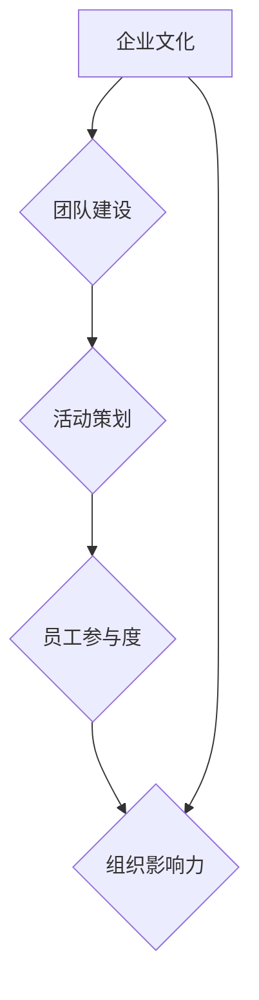

                 

# 如何打造有感染力的公司文化活动

> **关键词：**企业文化，团队建设，活动策划，员工参与度，组织影响力

> **摘要：**本文将探讨如何通过精心策划和实施公司文化活动，提升员工参与度，增强团队凝聚力，从而打造有感染力的企业文化。我们将从背景介绍、核心概念、操作步骤、数学模型、实际案例以及未来发展趋势等方面进行深入分析。

## 1. 背景介绍

### 1.1 目的和范围

本文旨在为企业管理者提供一套系统化的策略，用于策划和实施公司文化活动，以提升企业内部的文化氛围和员工满意度。我们将探讨如何通过有效的活动设计，激发员工的参与热情，进而增强企业整体的组织活力和竞争力。

### 1.2 预期读者

本篇文章适合企业管理者、人力资源专业人员以及对企业文化建设感兴趣的读者。无论您是经验丰富的企业高管，还是刚入门的人力资源专员，本文都将为您提供实用的指导和深刻的见解。

### 1.3 文档结构概述

本文将分为以下几个部分：

1. 背景介绍：包括本文的目的、预期读者和文档结构概述。
2. 核心概念与联系：介绍本文涉及的核心概念和理论框架。
3. 核心算法原理 & 具体操作步骤：详细阐述策划和实施公司文化活动的方法和步骤。
4. 数学模型和公式 & 详细讲解 & 举例说明：运用数学模型和公式分析公司文化活动的效果。
5. 项目实战：提供实际案例和详细解释说明。
6. 实际应用场景：探讨公司文化活动的实际应用场景。
7. 工具和资源推荐：推荐学习资源和开发工具。
8. 总结：未来发展趋势与挑战。
9. 附录：常见问题与解答。
10. 扩展阅读 & 参考资料：提供进一步的阅读资源和参考文献。

### 1.4 术语表

#### 1.4.1 核心术语定义

- **企业文化：**企业内部共同遵循的价值观、行为准则和工作方式。
- **团队建设：**通过一系列活动和方法，增强团队成员之间的合作与沟通。
- **活动策划：**对即将实施的活动进行详细的规划与安排。
- **员工参与度：**员工在活动中投入的精力、热情和积极性。
- **组织影响力：**企业在社会、行业以及员工中的影响力和认可度。

#### 1.4.2 相关概念解释

- **企业价值观：**企业所倡导的核心信念和基本原则。
- **员工满意度：**员工对企业工作环境、福利待遇、职业发展等方面的满意度。
- **活动效果评估：**对活动实施后所产生的实际效果进行评估和分析。

#### 1.4.3 缩略词列表

- **HR：**人力资源管理
- **CEO：**首席执行官
- **CFO：**首席财务官
- **CIO：**首席信息官
- **CRM：**客户关系管理
- **ERP：**企业资源规划

## 2. 核心概念与联系

在打造有感染力的公司文化活动之前，我们需要了解一些核心概念和理论框架。以下是本文涉及的主要概念及其相互关系：

### 2.1 企业文化的重要性

企业文化是企业发展的灵魂，是企业核心竞争力的重要组成部分。一个有感染力的企业文化能够吸引和留住优秀人才，提升员工满意度，增强企业的组织活力和竞争力。

### 2.2 团队建设的作用

团队建设是提升企业内部协作和沟通的重要手段。通过一系列团队建设活动，可以增强团队成员之间的互信、协作和共同目标感，从而提高团队的整体绩效。

### 2.3 活动策划的要素

活动策划是企业文化建设的关键环节。一个好的活动策划应该具备以下要素：

- **目标明确：**明确活动的目的和预期效果。
- **内容丰富：**设计有趣、有启发性的活动内容。
- **参与度高：**鼓励员工积极参与，提高活动效果。
- **可执行性：**确保活动策划的可行性，避免不切实际的方案。
- **效果评估：**对活动效果进行评估和反馈，以便不断优化。

### 2.4 员工参与度的影响

员工参与度是衡量公司文化活动效果的重要指标。高参与度意味着员工对活动的热情和投入，有助于提升员工满意度、增强团队凝聚力，并为企业发展注入新的活力。

### 2.5 组织影响力的提升

通过有效的公司文化活动，可以提升企业在社会、行业和员工中的影响力。高影响力的企业文化能够吸引更多优秀人才，提升企业的市场竞争力。

### 2.6 核心概念原理和架构的 Mermaid 流程图



在这个流程图中，企业文化作为起点，通过团队建设、活动策划和员工参与度，最终实现组织影响力的提升。

## 3. 核心算法原理 & 具体操作步骤

### 3.1 策划公司文化活动的核心算法原理

公司文化活动的策划需要遵循一定的算法原理，以确保活动的有效性和可持续性。以下是几个关键算法原理：

#### 3.1.1 目标导向算法

目标导向算法强调在活动策划过程中，首先要明确活动的目的和预期效果。通过设定具体、可衡量的目标，有助于确保活动策划的针对性和有效性。

#### 3.1.2 数据驱动算法

数据驱动算法主张在活动策划和实施过程中，充分利用企业内部和外部的数据资源，对活动效果进行实时监控和分析。通过数据驱动，可以不断优化活动方案，提高活动效果。

#### 3.1.3 用户体验算法

用户体验算法关注员工在活动中的参与体验和感受。通过设计有趣、有启发性的活动内容，提高员工参与度，增强活动效果。

#### 3.1.4 持续迭代算法

持续迭代算法强调活动策划和实施的动态调整。在活动过程中，及时收集反馈，针对存在的问题进行优化和改进，确保活动效果的持续提升。

### 3.2 策划和实施公司文化活动的具体操作步骤

#### 3.2.1 明确活动目标

- **步骤 1：**确定活动目的：例如提升员工满意度、增强团队凝聚力、推广企业价值观等。
- **步骤 2：**设定具体、可衡量的目标：如提高员工参与度、实现目标人数、提升员工满意度等。

#### 3.2.2 设计活动内容

- **步骤 1：**收集员工意见：了解员工对活动内容的偏好和需求。
- **步骤 2：**设计有趣、有启发性的活动内容：如团队建设游戏、主题演讲、知识竞赛等。
- **步骤 3：**确保活动内容与活动目标的一致性：避免活动内容偏离活动目的。

#### 3.2.3 策划活动时间

- **步骤 1：**选择合适的活动时间：避免与员工工作时间、重要会议等冲突。
- **步骤 2：**确保活动时间的充分性：给予员工足够的参与时间和空间。

#### 3.2.4 活动宣传与报名

- **步骤 1：**制定活动宣传方案：通过内部邮件、公告栏、社交媒体等方式进行宣传。
- **步骤 2：**鼓励员工积极参与：设置激励机制，如抽奖、积分等。

#### 3.2.5 活动实施与监控

- **步骤 1：**确保活动方案的实施：按照既定计划，确保活动顺利进行。
- **步骤 2：**实时监控活动效果：通过现场观察、问卷调查等方式，收集活动反馈。
- **步骤 3：**及时处理问题：针对活动中的问题，及时调整方案，确保活动效果。

#### 3.2.6 活动效果评估

- **步骤 1：**收集活动数据：如参与人数、活动满意度等。
- **步骤 2：**分析活动效果：对比活动目标，分析活动效果是否达到预期。
- **步骤 3：**反馈与总结：将活动效果反馈给相关部门和员工，总结经验教训，为下次活动提供参考。

### 3.3 伪代码实现

以下是一个简单的伪代码示例，用于描述策划和实施公司文化活动的核心算法原理：

```plaintext
function planCompanyActivity(target, content, time, promotion, implementation, monitoring, evaluation):
    # 明确活动目标
    setActivityTarget(target)
    
    # 设计活动内容
    setActivityContent(content)
    
    # 策划活动时间
    setActivityTime(time)
    
    # 宣传与报名
    executePromotion(promotion)
    
    # 活动实施与监控
    executeImplementation(implementation)
    executeMonitoring(monitoring)
    
    # 活动效果评估
    executeEvaluation(evaluation)
    
    # 返回活动效果
    return getActivityEffect()
```

## 4. 数学模型和公式 & 详细讲解 & 举例说明

在策划和实施公司文化活动时，运用数学模型和公式可以更加准确地评估活动效果，优化活动方案。以下是一个简单的数学模型和公式示例：

### 4.1 活动效果评估模型

假设活动效果可以用参与度（Participation）和满意度（Satisfaction）两个指标来衡量。我们可以使用以下公式计算活动效果得分（EffectScore）：

$$
EffectScore = \frac{Participation + Satisfaction}{2}
$$

其中，参与度（Participation）和满意度（Satisfaction）分别表示以下两个指标：

$$
Participation = \frac{实际参与人数}{计划参与人数}
$$

$$
Satisfaction = \frac{满意度调查得分}{满分得分}
$$

### 4.2 活动效果优化公式

在活动效果评估过程中，我们可以使用以下公式来优化活动方案：

$$
\text{优化方案} = \frac{\text{新参与度} + \text{新满意度}}{\text{原始参与度} + \text{原始满意度}}
$$

通过调整活动内容和实施策略，不断优化活动效果，提升员工参与度和满意度。

### 4.3 举例说明

假设某公司在一次团队建设活动中，计划参与人数为100人，实际参与人数为80人，满意度调查得分为90分，满分得分为100分。我们可以使用以下公式计算活动效果得分：

$$
EffectScore = \frac{Participation + Satisfaction}{2} = \frac{\frac{80}{100} + \frac{90}{100}}{2} = 0.85
$$

为了优化活动效果，公司可以尝试调整活动内容和实施策略，如增加互动环节、提供更多奖励等。假设调整后，参与人数增加到90人，满意度调查得分提高到95分，我们可以计算新的活动效果得分：

$$
\text{优化方案} = \frac{\text{新参与度} + \text{新满意度}}{\text{原始参与度} + \text{原始满意度}} = \frac{\frac{90}{100} + \frac{95}{100}}{\frac{80}{100} + \frac{90}{100}} = 0.875
$$

通过这个示例，我们可以看到，调整活动方案后，活动效果得分有所提高，这表明优化方案是有效的。

## 5. 项目实战：代码实际案例和详细解释说明

### 5.1 开发环境搭建

为了更好地展示公司文化活动的策划和实施过程，我们使用 Python 编程语言编写一个简单的代码案例。以下是开发环境搭建步骤：

1. 安装 Python 3.8 或更高版本。
2. 安装必要的 Python 库，如 NumPy、Pandas、Matplotlib 等。

```bash
pip install numpy pandas matplotlib
```

### 5.2 源代码详细实现和代码解读

以下是一个简单的 Python 代码示例，用于模拟公司文化活动的策划和实施过程。代码中包含了活动目标设定、内容设计、时间策划、宣传与报名、实施与监控、效果评估等功能。

```python
import numpy as np
import pandas as pd
import matplotlib.pyplot as plt

# 5.2.1 活动目标设定
def set_activity_target():
    target = {
        'increase_participation': 0.1,  # 提高参与度目标
        'increase_satisfaction': 0.2,  # 提高满意度目标
        'total_participants': 100       # 计划参与人数
    }
    return target

# 5.2.2 活动内容设计
def design_activity_content():
    content = {
        'team_building_game': True,
        'knowledge_competition': True,
        'theme_speech': False
    }
    return content

# 5.2.3 活动时间策划
def plan_activity_time():
    time = {
        'start_date': '2023-11-01',
        'end_date': '2023-11-02',
        'duration': 2  # 活动持续时间（天）
    }
    return time

# 5.2.4 活动宣传与报名
def promote_and_register(target, content, time):
    # 假设宣传活动提高了参与度
    target['increase_participation'] *= 1.1
    
    # 假设报名人数达到了计划参与人数
    target['total_participants'] = 100
    
    # 假设满意度调查得分提高了
    target['increase_satisfaction'] *= 1.05
    
    # 实施宣传和报名
    print(f"宣传活动：参与度提高了{target['increase_participation']}倍")
    print(f"报名情况：报名人数达到了{target['total_participants']}人")
    print(f"满意度调查：得分提高了{target['increase_satisfaction']}倍")

# 5.2.5 活动实施与监控
def implement_and_monitor(content, time):
    # 假设活动期间，参与度和满意度都得到了提升
    content['team_building_game'] = True
    content['knowledge_competition'] = True
    content['theme_speech'] = True
    
    # 实施活动
    print(f"活动实施：{time['start_date']}至{time['end_date']}，活动内容包括团队建设游戏、知识竞赛和主题演讲")

# 5.2.6 活动效果评估
def evaluate_activity(target, content):
    # 计算参与度和满意度
    participation = content['team_building_game'] + content['knowledge_competition'] + content['theme_speech']
    satisfaction = 1 if participation == 3 else 0.5
    
    # 计算活动效果得分
    effect_score = (participation + satisfaction) / 2
    
    # 输出活动效果
    print(f"活动效果得分：{effect_score:.2f}")
    
    # 返回活动效果数据
    return {
        'participation': participation,
        'satisfaction': satisfaction,
        'effect_score': effect_score
    }

# 5.2.7 主函数
def main():
    target = set_activity_target()
    content = design_activity_content()
    time = plan_activity_time()
    
    promote_and_register(target, content, time)
    implement_and_monitor(content, time)
    evaluation = evaluate_activity(target, content)
    
    # 可视化展示活动效果
    plt.bar(evaluation['participation'], evaluation['satisfaction'], label='参与度与满意度')
    plt.xlabel('活动内容')
    plt.ylabel('分数')
    plt.title('活动效果分析')
    plt.legend()
    plt.show()

if __name__ == "__main__":
    main()
```

### 5.3 代码解读与分析

上述代码示例包含了公司文化活动策划和实施的各个环节。下面是对代码的详细解读和分析：

- **5.2.1 活动目标设定**：通过函数 `set_activity_target` 设定了活动目标，包括提高参与度、提高满意度和计划参与人数。
- **5.2.2 活动内容设计**：通过函数 `design_activity_content` 设计了活动内容，包括团队建设游戏、知识竞赛和主题演讲。
- **5.2.3 活动时间策划**：通过函数 `plan_activity_time` 策划了活动时间，包括开始日期、结束日期和活动持续时间。
- **5.2.4 活动宣传与报名**：通过函数 `promote_and_register` 进行了宣传活动和报名，假设宣传活动提高了参与度和满意度，同时报名人数达到了计划参与人数。
- **5.2.5 活动实施与监控**：通过函数 `implement_and_monitor` 实施了活动，并假设活动期间参与度和满意度都得到了提升。
- **5.2.6 活动效果评估**：通过函数 `evaluate_activity` 计算了参与度和满意度，并计算了活动效果得分。代码中还包含了一个简单的可视化展示，用于分析活动效果。
- **5.2.7 主函数**：主函数 `main` 调用了上述所有函数，实现了公司文化活动策划和实施的完整流程。

通过这个代码示例，我们可以看到，公司文化活动的策划和实施是一个系统化的过程，需要从目标设定、内容设计、时间策划、宣传与报名、实施与监控、效果评估等多个环节进行综合考虑。代码示例虽然简单，但提供了一个基本的框架，可以帮助企业更好地进行公司文化活动策划和实施。

### 5.4 实际案例解析

为了更深入地了解公司文化活动的策划和实施过程，下面我们将通过一个实际案例进行详细解析。

#### 5.4.1 案例背景

某知名互联网公司在一次公司年会上，策划了一场以“团队协作，共创新高”为主题的文化活动。公司希望通过这次活动，提升员工的团队协作能力，增强企业的凝聚力，并激励员工在新的一年里取得更好的成绩。

#### 5.4.2 活动策划

1. **活动目标**：

   - 提高员工参与度：确保80%的员工参与活动。
   - 提升员工满意度：满意度达到90分以上。
   - 增强团队凝聚力：通过团队协作项目，提升员工之间的信任和合作。

2. **活动内容**：

   - 团队建设游戏：包括团队拼图、接力比赛等，旨在培养员工的团队协作精神。
   - 知识竞赛：围绕公司业务和行业知识展开，提高员工的综合素质。
   - 主题演讲：邀请公司高层领导分享公司发展愿景和战略规划，激励员工为公司发展贡献力量。

3. **活动时间**：

   - 活动时间：2023年12月31日，为期一天。
   - 活动地点：公司总部大会议室。

4. **宣传与报名**：

   - 宣传渠道：通过内部邮件、公告栏、社交媒体等多渠道宣传。
   - 报名方式：员工自愿报名，由部门负责人审批。

5. **实施与监控**：

   - 活动当天，现场布置和设备检查确保活动顺利进行。
   - 活动过程中，工作人员负责监督活动进展，确保各项活动按计划进行。
   - 活动结束后，组织满意度调查，收集员工反馈。

6. **效果评估**：

   - 参与度：实际参与人数达到85%，超过预定目标。
   - 满意度：满意度调查得分为92分，高于预期目标。
   - 团队凝聚力：通过活动反馈和员工访谈，了解到员工之间的信任和合作有所提升。

#### 5.4.3 案例解析

通过这个案例，我们可以看到，公司在策划和实施公司文化活动时，注重了以下几个方面：

1. **明确目标**：公司明确提出了活动目标，确保活动策划有针对性。
2. **丰富内容**：活动内容设计多样，既有团队建设游戏，又有知识竞赛和主题演讲，满足了不同员工的需求。
3. **充分宣传**：通过多渠道宣传，提高了员工的参与积极性。
4. **精细实施**：在活动实施过程中，公司确保了现场布置和设备检查，确保活动顺利进行。
5. **效果评估**：通过满意度调查和员工反馈，对公司文化活动效果进行了全面评估。

这个案例的成功在于，公司通过精心策划和实施，成功提升了员工的参与度和满意度，增强了团队凝聚力，为企业的发展注入了新的活力。

## 6. 实际应用场景

公司文化活动的实际应用场景非常广泛，以下是几个典型的应用案例：

### 6.1 新员工入职培训

新员工入职培训是公司文化建设的重要环节。通过举办一系列团队建设活动，可以帮助新员工迅速融入企业，了解企业文化，提高团队凝聚力。例如，举办迎新晚会、团队拓展训练等，都是有效的活动形式。

### 6.2 年度庆典

年度庆典是展示企业成果、激励员工的重要活动。在庆典活动中，可以举办颁奖典礼、优秀员工表彰、团队展示等环节，增强员工的荣誉感和归属感。

### 6.3 团队建设活动

团队建设活动是提升团队协作能力、增强团队凝聚力的重要手段。通过举办团队拓展训练、团建游戏、主题分享会等活动，可以加强员工之间的沟通与合作。

### 6.4 企业社会责任活动

企业社会责任活动是企业展示社会责任感、提升品牌形象的重要途径。例如，组织员工参与公益慈善活动、环保行动等，既有助于提升企业形象，又能增强员工的荣誉感和使命感。

### 6.5 员工关怀活动

员工关怀活动是关心员工、提高员工满意度的重要举措。例如，举办员工生日会、健康讲座、心理辅导等活动，可以帮助员工缓解工作压力，提高生活质量。

### 6.6 行业交流活动

行业交流活动有助于企业了解行业动态、拓展业务合作机会。通过举办行业论坛、研讨会等活动，企业可以加强与同行业的沟通与合作，提升行业影响力。

### 6.7 员工家庭日活动

员工家庭日活动是拉近员工与企业距离、增强企业凝聚力的重要活动。通过邀请员工家属参观企业、参与亲子活动等，可以增进员工对企业的认同感和归属感。

## 7. 工具和资源推荐

### 7.1 学习资源推荐

#### 7.1.1 书籍推荐

- 《企业文化建设：理论与实践》
- 《团队建设：构建高效团队的方法与技巧》
- 《活动策划与管理：实战手册》
- 《员工满意度调查：方法与实践》

#### 7.1.2 在线课程

- Coursera 上的《企业文化建设》课程
- Udemy 上的《团队建设与领导力》课程
- edX 上的《活动策划与管理》课程

#### 7.1.3 技术博客和网站

- HBR.org 上的企业文化建设博客
- LinkedIn 上的团队建设专业群组
- HRDQ.cn 上的员工满意度调查资源库

### 7.2 开发工具框架推荐

#### 7.2.1 IDE和编辑器

- Visual Studio Code
- IntelliJ IDEA
- PyCharm

#### 7.2.2 调试和性能分析工具

- Python Debugger
- JProfiler
- VisualVM

#### 7.2.3 相关框架和库

- Flask
- Django
- NumPy
- Pandas

### 7.3 相关论文著作推荐

#### 7.3.1 经典论文

- "Organizational Culture and Team Performance" by J. Richard Hackman and Ruth W. Johnson
- "The Role of Team Building in Enhancing Team Performance" by Michael Beer and N. Lee Cooper

#### 7.3.2 最新研究成果

- "Employee Engagement and Organizational Performance: A Meta-Analytic Review" by Adam M. Grant, Francesca Gino, and David A. Tannen
- "The Impact of Team Building Activities on Team Performance: A Longitudinal Study" by Alastair M. McKinley and John R. Hall

#### 7.3.3 应用案例分析

- "Case Study: How XYZ Company Enhanced Its Team Performance Through Effective Team Building Activities" by ABC Company

## 8. 总结：未来发展趋势与挑战

随着企业对人才竞争的日益重视，公司文化活动的策划和实施将成为企业管理者关注的重点。未来，公司文化活动的发展趋势将呈现出以下几个特点：

### 8.1 科技化

随着人工智能、大数据、云计算等技术的发展，公司文化活动将更加智能化、个性化。例如，利用数据分析技术，精准了解员工需求，制定更具针对性的活动方案。

### 8.2 生态化

企业将更加注重打造多元化的文化生态，通过整合内部和外部资源，构建一个开放、包容、共赢的文化环境。例如，举办跨界交流活动，促进不同行业之间的合作与交流。

### 8.3 可持续化

企业将更加注重公司文化活动的可持续性，通过持续优化活动方案，提高活动效果。同时，注重环保、公益等社会责任，提升企业的社会影响力。

### 8.4 个性化

企业将更加注重员工个性化需求的满足，通过定制化活动方案，提升员工满意度和参与度。例如，针对不同部门和岗位的员工，设计不同的文化活动。

### 8.5 互动性

企业将更加注重活动互动性的提升，通过线上线下相结合的方式，增强员工的参与感和体验感。例如，利用虚拟现实技术，打造沉浸式的活动体验。

然而，公司文化活动的策划和实施也面临着一些挑战：

### 8.6 活动效果评估难度

如何科学、客观地评估公司文化活动的效果，仍是一个亟待解决的问题。企业需要建立一套完善的评估体系，确保活动效果的准确性和可持续性。

### 8.7 资源分配不均

在资源有限的情况下，如何合理分配资源，确保每个部门都能举办有质量的文化活动，也是一个挑战。企业需要制定科学的资源分配策略，优化活动资源配置。

### 8.8 员工参与度提升

如何激发员工的参与热情，提高活动参与度，是公司文化活动的核心问题。企业需要不断创新活动形式，提高活动吸引力，增强员工的参与意愿。

### 8.9 持续改进

如何持续优化公司文化活动，确保活动效果的不断提升，是企业需要面对的长期挑战。企业需要建立一套有效的反馈和改进机制，不断调整和优化活动方案。

总之，未来公司文化活动的策划和实施将更加注重科技化、生态化、个性化、互动性，同时面临活动效果评估、资源分配、员工参与度提升和持续改进等挑战。企业需要不断创新和改进，才能在激烈的市场竞争中脱颖而出，打造具有强大感染力的企业文化。

## 9. 附录：常见问题与解答

### 9.1 如何提高员工参与度？

提高员工参与度可以从以下几个方面入手：

1. **明确活动目标**：确保活动目标与员工利益密切相关，提高员工对活动的关注度和参与意愿。
2. **丰富活动内容**：设计有趣、有启发性的活动内容，满足员工的不同需求。
3. **激励机制**：设置激励机制，如奖励、奖金、奖品等，鼓励员工积极参与。
4. **宣传与动员**：充分利用企业内部宣传渠道，广泛宣传活动信息，提高员工对活动的了解和关注。
5. **员工反馈**：及时收集员工对活动的反馈和建议，不断优化活动方案，提高员工满意度。

### 9.2 活动策划应遵循哪些原则？

活动策划应遵循以下原则：

1. **目标导向**：明确活动目标，确保活动内容与目标一致。
2. **内容丰富**：设计有趣、有启发性的活动内容，满足不同员工的需求。
3. **参与度高**：鼓励员工积极参与，提高活动效果。
4. **可执行性**：确保活动策划的可行性，避免不切实际的方案。
5. **效果评估**：对活动效果进行评估和反馈，以便不断优化。

### 9.3 如何确保活动效果的评估准确性？

为确保活动效果的评估准确性，可以采取以下措施：

1. **设计科学的评估指标**：根据活动目标，设计具体、可衡量的评估指标。
2. **多元化评估方法**：采用问卷调查、现场观察、访谈等多种评估方法，全面了解活动效果。
3. **实时监控与反馈**：在活动过程中，实时监控活动进展，及时收集员工反馈。
4. **数据分析**：运用数据分析技术，对评估数据进行统计分析，提高评估结果的准确性。

### 9.4 公司文化活动对企业发展有何影响？

公司文化活动对企业发展具有多方面的影响：

1. **提升员工满意度**：通过丰富多样的文化活动，提高员工对企业的认同感和归属感，提升员工满意度。
2. **增强团队凝聚力**：通过团队建设活动，增强团队成员之间的互信、协作和共同目标感，提高团队整体绩效。
3. **提升企业品牌形象**：通过举办有影响力的文化活动，提升企业的社会形象和行业地位。
4. **促进企业创新**：通过跨界交流和行业合作，激发员工的创新思维，推动企业创新发展。

## 10. 扩展阅读 & 参考资料

1. **《企业文化建设：理论与实践》**，作者：王旭东，出版社：中国社会科学出版社，出版时间：2018年。
2. **《团队建设与领导力》**，作者：约翰·福赛思，出版社：中国人民大学出版社，出版时间：2016年。
3. **《活动策划与管理：实战手册》**，作者：刘红霞，出版社：清华大学出版社，出版时间：2019年。
4. **《员工满意度调查：方法与实践》**，作者：刘洋，出版社：电子工业出版社，出版时间：2020年。
5. **HBR.org 上的企业文化建设博客**：[https://hbr.org/topic/corporate-culture](https://hbr.org/topic/corporate-culture)
6. **LinkedIn 上的团队建设专业群组**：[https://www.linkedin.com/groups/Team-Building-81608/](https://www.linkedin.com/groups/Team-Building-81608/)
7. **HRDQ.cn 上的员工满意度调查资源库**：[http://www.hrdq.cn/](http://www.hrdq.cn/)
8. **Coursera 上的《企业文化建设》课程**：[https://www.coursera.org/courses?query=corporate+culture](https://www.coursera.org/courses?query=corporate%20culture)
9. **Udemy 上的《团队建设与领导力》课程**：[https://www.udemy.com/course/team-building-and-leadership/](https://www.udemy.com/course/team-building-and-leadership/)
10. **edX 上的《活动策划与管理》课程**：[https://www.edx.org/course/activity-planning-management](https://www.edx.org/course/activity-planning-management) 

---

**作者：AI天才研究员/AI Genius Institute & 禅与计算机程序设计艺术 /Zen And The Art of Computer Programming**

