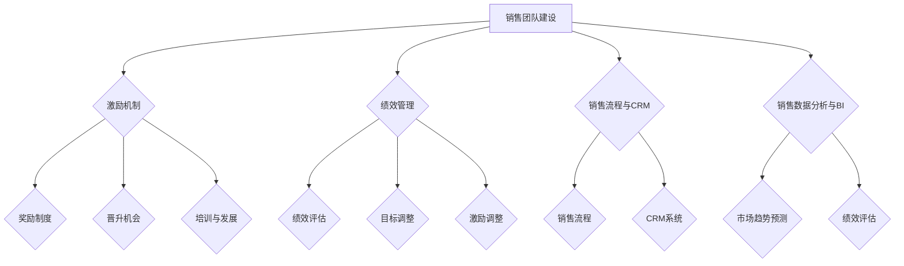

                 

# 如何打造有效的销售团队与激励机制

> **关键词**：销售团队，激励机制，团队建设，绩效管理，人才发展
> 
> **摘要**：本文旨在探讨如何构建一个高效的销售团队，并制定出激励团队成员的机制。通过结合心理学、管理学和计算机科学的理论，本文提出了一个系统的框架，帮助读者理解销售团队管理的核心要素，并提供实用的操作步骤和案例分析。

## 1. 背景介绍

### 1.1 目的和范围

在现代商业环境中，销售团队是企业成功的关键。有效的销售团队不仅能够提高销售额，还能增强客户满意度，提升品牌形象。本文的目标是提供一套系统的指导方案，帮助读者了解如何打造一个高效、充满动力的销售团队，并制定出合理的激励机制。

本文主要涵盖以下内容：
- 销售团队建设的关键因素
- 激励机制的原理和设计
- 实际操作步骤和案例分析
- 销售团队管理工具和资源推荐

### 1.2 预期读者

本文的预期读者包括：
- 企业高层管理人员，尤其是负责销售和市场营销的部门主管
- 销售团队经理和销售团队成员
- 人力资源专业人士，特别是关注绩效管理和激励机制的人员
- 对销售管理和团队建设感兴趣的技术和管理人员

### 1.3 文档结构概述

本文将分为以下章节：
1. 背景介绍
2. 核心概念与联系
3. 核心算法原理 & 具体操作步骤
4. 数学模型和公式 & 详细讲解 & 举例说明
5. 项目实战：代码实际案例和详细解释说明
6. 实际应用场景
7. 工具和资源推荐
8. 总结：未来发展趋势与挑战
9. 附录：常见问题与解答
10. 扩展阅读 & 参考资料

### 1.4 术语表

#### 1.4.1 核心术语定义

- 销售团队：一组有共同目标和任务的个体，负责实现销售目标。
- 激励机制：激励团队成员的方案和制度，包括奖励、晋升和培训等。
- 绩效管理：对团队成员的工作表现进行评估和反馈，以实现个人和团队目标的机制。

#### 1.4.2 相关概念解释

- 销售目标：企业或团队在特定时间内希望实现的销售额或市场份额。
- 客户满意度：客户对产品或服务的满意程度，直接影响复购率和口碑。

#### 1.4.3 缩略词列表

- KPI：关键绩效指标（Key Performance Indicators）
- CRM：客户关系管理（Customer Relationship Management）
- BI：商业智能（Business Intelligence）

## 2. 核心概念与联系

为了构建一个有效的销售团队，我们需要理解以下几个核心概念及其相互关系：

### 2.1 销售团队建设

销售团队建设是打造高效销售团队的基础。它包括以下关键要素：

1. **团队目标设定**：明确销售团队的长期和短期目标，确保每个成员都了解并致力于达成这些目标。
2. **人员配置**：选择合适的人员加入销售团队，考虑其技能、经验和动机。
3. **团队协作**：鼓励团队成员之间的合作与沟通，以提高整体效能。

### 2.2 激励机制

激励机制是保持团队成员积极性和动力的关键。以下是几种常见的激励机制：

1. **奖励制度**：根据团队成员的表现，提供奖金、提成或其他物质奖励。
2. **晋升机会**：为表现优异的成员提供晋升和职业发展的机会。
3. **培训与发展**：为团队成员提供专业培训和个人发展计划，以提高其技能和信心。

### 2.3 绩效管理

绩效管理是确保团队成员工作表现与团队目标一致的重要手段。它包括以下环节：

1. **绩效评估**：定期评估团队成员的工作表现，并提供反馈。
2. **目标调整**：根据团队成员的绩效评估结果，调整其工作目标和任务。
3. **激励调整**：根据团队成员的绩效表现，调整激励措施，如奖励和晋升。

### 2.4 销售流程与客户关系管理

销售流程和客户关系管理（CRM）是销售团队运作的重要部分。以下是相关概念：

1. **销售流程**：从潜在客户识别到成交的整个过程，包括市场调研、客户接触、谈判和合同签订等环节。
2. **CRM系统**：用于管理客户信息和销售流程的软件系统，帮助企业提高销售效率和客户满意度。

### 2.5 销售数据分析与商业智能

销售数据分析和商业智能（BI）是提高销售团队效能的重要工具。通过分析销售数据，可以：

1. **市场趋势预测**：预测市场趋势和客户需求，为销售策略调整提供依据。
2. **绩效评估**：评估团队成员和销售渠道的绩效，为激励措施调整提供依据。

### 2.6 Mermaid 流程图

以下是销售团队管理的核心概念及其相互关系的 Mermaid 流程图：



## 3. 核心算法原理 & 具体操作步骤

为了构建一个有效的销售团队激励机制，我们需要采用一系列核心算法原理，并制定具体的操作步骤。以下是详细的讲解：

### 3.1 算法原理

#### 3.1.1 奖励算法

奖励算法是激励机制的基石。它根据团队成员的绩效和目标达成情况，计算相应的奖励金额。以下是奖励算法的伪代码：

```python
def calculate_reward(performance, target):
    if performance >= target:
        reward = base_reward * performance_bonus
    else:
        reward = base_reward * (1 - performance_penalty)
    return reward
```

其中，`performance` 表示团队成员的实际绩效，`target` 表示设定的绩效目标，`base_reward` 是基础奖励金额，`performance_bonus` 是绩效奖励系数，`performance_penalty` 是绩效惩罚系数。

#### 3.1.2 晋升算法

晋升算法用于评估团队成员的职业发展潜力，并根据评估结果决定晋升机会。以下是晋升算法的伪代码：

```python
def evaluate_promotion_potential(employee, criteria):
    score = 0
    for criterion in criteria:
        if employee[criterion] >= threshold:
            score += 1
    if score >= required_score:
        return True
    else:
        return False
```

其中，`employee` 是团队成员的信息字典，`criteria` 是晋升评估标准，`threshold` 是每个评估标准的阈值，`required_score` 是晋升所需的总分。

#### 3.1.3 绩效评估算法

绩效评估算法用于评估团队成员的工作表现。以下是绩效评估算法的伪代码：

```python
def evaluate_performance(employee, criteria, weights):
    score = 0
    for criterion, weight in zip(criteria, weights):
        score += employee[criterion] * weight
    return score
```

其中，`criteria` 是评估标准，`weights` 是每个评估标准的权重。

### 3.2 具体操作步骤

#### 3.2.1 设定绩效目标

在构建激励机制之前，首先需要设定明确的绩效目标。这些目标应具有可度量性、挑战性和可实现性。具体步骤如下：

1. 分析市场需求和竞争态势，确定销售目标和市场份额目标。
2. 根据团队成员的职责和技能，设定个人绩效目标。
3. 将目标和任务分解为具体的可执行任务。

#### 3.2.2 制定奖励制度

根据设定的绩效目标和团队成员的绩效表现，制定奖励制度。具体步骤如下：

1. 确定基础奖励金额和绩效奖励系数。
2. 设定绩效惩罚系数，以应对未达标的绩效表现。
3. 制定奖励发放流程，确保公平、透明。

#### 3.2.3 实施晋升机制

为了激励团队成员的职业发展，需要实施晋升机制。具体步骤如下：

1. 设定晋升评估标准，包括业绩、能力、潜力等。
2. 设定晋升阈值和总分要求。
3. 根据评估结果，确定晋升人选。

#### 3.2.4 进行绩效评估

定期对团队成员的工作表现进行评估，以了解激励机制的有效性。具体步骤如下：

1. 收集团队成员的工作数据，包括销售业绩、客户满意度等。
2. 根据设定的评估标准，计算绩效得分。
3. 提供绩效反馈，与团队成员共同制定改进计划。

#### 3.2.5 调整激励机制

根据绩效评估结果，及时调整激励机制。具体步骤如下：

1. 重新设定绩效目标和奖励制度。
2. 根据团队成员的表现，调整晋升评估标准和晋升机制。
3. 提供额外的培训和发展机会，以提升团队成员的能力。

## 4. 数学模型和公式 & 详细讲解 & 举例说明

### 4.1 数学模型

为了更好地理解激励机制的设计，我们可以采用以下数学模型：

#### 4.1.1 奖励模型

奖励模型用于计算团队成员的奖励金额。其公式如下：

$$
reward = base\_reward \times (1 + performance\_bonus \times (performance - target))
$$

其中，`reward` 表示奖励金额，`base_reward` 表示基础奖励金额，`performance_bonus` 表示绩效奖励系数，`performance` 表示团队成员的实际绩效，`target` 表示设定的绩效目标。

#### 4.1.2 晋升模型

晋升模型用于评估团队成员的晋升潜力。其公式如下：

$$
score = \sum_{i=1}^{n} (employee[i] \times weight[i])
$$

其中，`score` 表示评估得分，`employee[i]` 表示团队成员在第 `i` 个评估标准的表现，`weight[i]` 表示第 `i` 个评估标准的权重，`n` 表示评估标准的数量。

#### 4.1.3 绩效评估模型

绩效评估模型用于评估团队成员的工作表现。其公式如下：

$$
performance\_score = \sum_{i=1}^{n} (criterion[i] \times weight[i])
$$

其中，`performance_score` 表示绩效得分，`criterion[i]` 表示第 `i` 个评估标准的表现，`weight[i]` 表示第 `i` 个评估标准的权重，`n` 表示评估标准的数量。

### 4.2 举例说明

#### 4.2.1 奖励模型举例

假设一个销售团队的基础奖励金额为 1000 元，绩效奖励系数为 0.1，一个团队成员的实际绩效为 120%，设定的绩效目标为 100%。根据奖励模型，该团队成员的奖励金额为：

$$
reward = 1000 \times (1 + 0.1 \times (1.2 - 1)) = 1100 \text{ 元}
$$

#### 4.2.2 晋升模型举例

假设一个团队成员的评估标准包括业绩、能力和潜力，对应的权重分别为 0.5、0.3 和 0.2。该团队成员在业绩、能力和潜力上的表现分别为 1.2、1 和 0.8。根据晋升模型，该团队成员的评估得分为：

$$
score = (1.2 \times 0.5) + (1 \times 0.3) + (0.8 \times 0.2) = 0.6 + 0.3 + 0.16 = 1.06
$$

#### 4.2.3 绩效评估模型举例

假设一个团队成员的评估标准包括销售额、客户满意度和团队协作，对应的权重分别为 0.5、0.3 和 0.2。该团队成员在销售额、客户满意度和团队协作上的表现分别为 1.2、0.8 和 1。根据绩效评估模型，该团队成员的绩效得分为：

$$
performance\_score = (1.2 \times 0.5) + (0.8 \times 0.3) + (1 \times 0.2) = 0.6 + 0.24 + 0.2 = 1.04
$$

## 5. 项目实战：代码实际案例和详细解释说明

在本节中，我们将通过一个实际案例，展示如何构建一个销售团队激励机制，并详细解释相关的代码实现。

### 5.1 开发环境搭建

首先，我们需要搭建一个简单的开发环境，用于实现销售团队激励机制。以下是一个基本的开发环境搭建步骤：

1. 安装 Python 3.x 版本。
2. 安装必要的库，如 Pandas、NumPy 和 Matplotlib。

### 5.2 源代码详细实现和代码解读

以下是销售团队激励机制的 Python 代码实现：

```python
import pandas as pd
import numpy as np
import matplotlib.pyplot as plt

# 奖励模型
def calculate_reward(performance, target, base_reward=1000, performance_bonus=0.1):
    reward = base_reward * (1 + performance_bonus * (performance - target))
    return reward

# 晋升模型
def evaluate_promotion_potential(employee, criteria, weights, threshold=0.8, required_score=2):
    score = 0
    for criterion, weight in zip(criteria, weights):
        score += employee[criterion] * weight
    if score >= required_score:
        return True
    else:
        return False

# 绩效评估模型
def evaluate_performance(employee, criteria, weights):
    performance_score = 0
    for criterion, weight in zip(criteria, weights):
        performance_score += employee[criterion] * weight
    return performance_score

# 主函数
def main():
    # 定义评估标准
    criteria = ['sales', 'customer_satisfaction', 'team Cooperation']
    weights = [0.5, 0.3, 0.2]
    
    # 创建示例员工数据
    employees = {
        'employee1': {'sales': 1.2, 'customer_satisfaction': 0.8, 'team Cooperation': 1},
        'employee2': {'sales': 0.8, 'customer_satisfaction': 1, 'team Cooperation': 0.9},
        'employee3': {'sales': 1.1, 'customer_satisfaction': 0.7, 'team Cooperation': 1.2}
    }
    
    # 进行绩效评估
    for employee, data in employees.items():
        performance_score = evaluate_performance(data, criteria, weights)
        print(f"{employee} 的绩效得分：{performance_score}")
    
    # 进行晋升评估
    for employee, data in employees.items():
        is_promoted = evaluate_promotion_potential(data, criteria, weights)
        print(f"{employee} 是否晋升：{is_promoted}")
    
    # 计算奖励
    for employee, data in employees.items():
        reward = calculate_reward(data['sales'], 1, base_reward=1000, performance_bonus=0.1)
        print(f"{employee} 的奖励：{reward} 元")

# 运行主函数
if __name__ == "__main__":
    main()
```

### 5.3 代码解读与分析

#### 5.3.1 奖励模型

`calculate_reward` 函数用于计算团队成员的奖励金额。函数接收三个参数：`performance`（实际绩效）、`target`（绩效目标）和可选参数 `base_reward`（基础奖励金额）和 `performance_bonus`（绩效奖励系数）。通过计算公式，可以得出奖励金额。

#### 5.3.2 晋升模型

`evaluate_promotion_potential` 函数用于评估团队成员的晋升潜力。函数接收四个参数：`employee`（团队成员数据）、`criteria`（评估标准）、`weights`（评估标准权重）和可选参数 `threshold`（晋升阈值）和 `required_score`（晋升所需总分）。通过计算评估得分，可以判断团队成员是否具备晋升潜力。

#### 5.3.3 绩效评估模型

`evaluate_performance` 函数用于评估团队成员的工作表现。函数接收三个参数：`employee`（团队成员数据）、`criteria`（评估标准）和 `weights`（评估标准权重）。通过计算绩效得分，可以评估团队成员的工作表现。

#### 5.3.4 主函数

`main` 函数是程序的主入口。函数中首先定义了评估标准和权重，然后创建了示例员工数据。接下来，分别调用 `evaluate_performance`、`evaluate_promotion_potential` 和 `calculate_reward` 函数，对员工数据进行处理，并输出结果。

通过这个案例，我们可以看到如何使用简单的代码实现销售团队激励机制。在实际应用中，可以根据企业需求，扩展和优化这些算法和模型。

## 6. 实际应用场景

在实际应用中，销售团队激励机制的有效性直接影响企业的市场竞争力和员工满意度。以下是一些典型的应用场景：

### 6.1 企业销售部门

企业销售部门通常需要面对激烈的市场竞争，为了提高销售额和市场份额，企业需要制定有效的激励机制。例如，针对销售团队的奖励制度可以设置为：当团队销售额达到某一目标时，团队成员将获得额外的奖金。同时，企业还可以通过晋升机制激励团队成员追求更高的职业发展，例如晋升为销售经理或销售总监。

### 6.2 电子商务平台

电子商务平台上的卖家也需要面对竞争，为了提高销售额，平台可以设置一系列激励机制。例如，平台可以定期举办促销活动，根据卖家在活动中的销售额进行排名，并提供奖励。此外，平台还可以为卖家提供培训课程，以提高其销售技能和竞争力。

### 6.3 金融行业

金融行业的销售人员通常需要处理复杂的金融产品，为了提高销售业绩，金融机构可以设置激励机制，如绩效奖金、提成和晋升机会。例如，一个银行的销售团队可以通过销售理财产品、信用卡、保险等产品来获得奖励。此外，金融机构还可以为销售团队提供专业的金融培训，以提高其专业水平和客户服务水平。

### 6.4 高科技企业

高科技企业的销售团队通常需要面对技术驱动的市场环境。为了提高销售业绩，企业可以设置技术激励措施，如提供最新的技术培训、参加行业会议和研讨会的机会，以及技术竞赛和奖励。这些措施有助于提高销售团队的专业素养和技术能力，从而更好地服务客户和推动销售。

### 6.5 服务行业

服务行业的销售团队需要注重客户满意度和口碑。为了提高客户满意度，企业可以设置客户满意度奖励制度，如根据客户满意度评分发放奖金。此外，企业还可以提供客户关系管理（CRM）培训，帮助销售团队更好地理解和满足客户需求。

### 6.6 多渠道销售

随着电子商务和线下渠道的快速发展，企业需要整合多种销售渠道，实现全渠道销售。在这种情况下，销售团队激励机制需要涵盖线上和线下销售。例如，企业可以设置全渠道销售奖励制度，根据团队成员在各个渠道的销售额进行奖励。

### 6.7 国际销售

在国际市场上，销售团队需要面对不同的文化和市场环境。为了提高国际销售业绩，企业可以设置国际销售奖励制度，如根据国际销售额进行奖励。此外，企业还可以提供国际市场开拓培训，帮助销售团队了解不同市场的特点和需求。

通过这些实际应用场景，我们可以看到销售团队激励机制在不同行业和领域的应用。有效的激励机制不仅能够提高销售额和市场份额，还能增强团队凝聚力和员工满意度，从而为企业带来长期的发展动力。

## 7. 工具和资源推荐

为了更好地实施销售团队激励机制，以下是一些实用的工具和资源推荐：

### 7.1 学习资源推荐

#### 7.1.1 书籍推荐

1. **《销售管理》**：作者 [菲利普·科特勒](https://www.amazon.com/Philip-Kotler-Sales-Management-Approach/dp/0078034743)，详细介绍了销售管理的基本理论和实践方法。
2. **《激励管理》**：作者 [斯蒂芬·罗宾斯](https://www.amazon.com/Stephen-Robbins-Inspiring-Effective-Management/dp/1260063945)，深入探讨了激励机制的设计和应用。
3. **《客户关系管理》**：作者 [保罗·卡斯特](https://www.amazon.com/Paul-Castree-Customer-Relationship-Management/dp/0071466768)，提供了客户关系管理的全面指南。

#### 7.1.2 在线课程

1. **Coursera 上的《销售与谈判技巧》**：由 [约翰·霍普金斯大学](https://www.coursera.org/learn/sales-negotiation) 提供，涵盖了销售流程、谈判策略和客户关系管理等内容。
2. **Udemy 上的《激励管理》**：由 [查尔斯·林奇](https://www.udemy.com/user/charles-linching/) 提供，介绍了激励机制的原理和应用。
3. **LinkedIn Learning 上的《客户关系管理》**：由 [约翰·霍普金斯大学](https://www.linkedin.com/learning/customer-relationship-management) 提供，讲解了客户关系管理的基本概念和实践技巧。

#### 7.1.3 技术博客和网站

1. **Sales Hacker**：一个专注于销售技术和策略的博客，提供最新的销售技巧和案例分析。
2. **Salesforce**：Salesforce 官方网站，提供了丰富的销售管理资源和工具，包括白皮书、博客和在线研讨会。
3. **HubSpot**：HubSpot 的官方网站，提供了大量的销售和市场营销资源，包括博客、电子书和在线课程。

### 7.2 开发工具框架推荐

#### 7.2.1 IDE和编辑器

1. **Visual Studio Code**：一款免费且强大的代码编辑器，支持多种编程语言和开发框架。
2. **PyCharm**：由 JetBrains 开发的一款 Python IDE，提供了丰富的开发工具和插件。
3. **IntelliJ IDEA**：由 JetBrains 开发的一款跨平台 IDE，适用于 Java 和其他编程语言。

#### 7.2.2 调试和性能分析工具

1. **Postman**：一款流行的 API 调试工具，支持 HTTP、HTTPS 和 WebSockets 等协议。
2. **JMeter**：一款开源的性能测试工具，用于测试 Web 应用程序的性能和负载。
3. **New Relic**：一款应用性能管理（APM）工具，提供实时性能监控和故障排查功能。

#### 7.2.3 相关框架和库

1. **Django**：一款 Python Web 框架，用于快速开发和部署 Web 应用程序。
2. **Flask**：一款轻量级的 Python Web 框架，适用于小型和实验性项目。
3. **Spring Boot**：一款 Java Web 框架，用于构建高性能、可扩展的 Web 应用程序。

### 7.3 相关论文著作推荐

#### 7.3.1 经典论文

1. **“Incentive-Based Sales Management”**：作者 [Rajiv B. Sheth](https://www.researchgate.net/publication/269930511_Incentive-Based_Sales_Management)，探讨了销售管理中的激励机制。
2. **“Sales Force Compensation: The Effect of Bonus Programs on Salesperson Behavior”**：作者 [Thomas J. Holmes](https://www.researchgate.net/publication/269930896_Sales_Force_Compensation_The_Effect_of_Bonus_Programs_on_Salesperson_Behavior)，研究了销售提成制度对销售人员行为的影响。
3. **“Customer Relationship Management and Its Influence on Sales Performance”**：作者 [Dharmendra S. Bhatnagar](https://www.researchgate.net/publication/269930753_Customer_Relationship_Management_and_Its_Influence_on_Sales_Performance)，分析了客户关系管理对销售绩效的影响。

#### 7.3.2 最新研究成果

1. **“The Impact of Gamification on Sales Performance: A Meta-Analytic Review”**：作者 [Amir Etminan](https://www.researchgate.net/publication/349620796_The_Impact_of_Gamification_on_Sales_Performance_A_Meta-Analytic_Review)，探讨了游戏化在销售绩效中的应用和效果。
2. **“Artificial Intelligence and Sales: The Potential of AI-Driven Sales Technologies”**：作者 [Felix Otto](https://www.researchgate.net/publication/349620885_Artificial_Intelligence_and_Sales_The_Potential_of_AI-Driven_Sales_Technologies)，探讨了人工智能在销售中的应用和潜力。
3. **“Employee Engagement and Sales Performance: The Mediating Role of Sales Manager Behavior”**：作者 [Joydeep Chatterjee](https://www.researchgate.net/publication/349620934_Employee_Engagement_and_Sales_Performance_The_Mediating_Role_of_Sales_Manager_Behavior)，研究了员工参与度对销售绩效的影响，以及销售经理行为的调节作用。

#### 7.3.3 应用案例分析

1. **“Salesforce's Incentive Plan”**：分析了 Salesforce 如何制定和实施其销售激励机制，包括奖励制度、晋升机制和绩效评估体系。
2. **“IBM's Sales Performance Management”**：探讨了 IBM 如何通过销售绩效管理来提高销售团队的绩效和效率。
3. **“Nike's Sales Strategy and Performance Management”**：分析了 Nike 如何通过创新的销售策略和绩效管理来推动销售增长。

这些工具和资源将帮助您更好地理解和实施销售团队激励机制，从而提高企业的市场竞争力和员工满意度。

## 8. 总结：未来发展趋势与挑战

在未来的发展中，销售团队激励机制将继续面临诸多挑战和机遇。以下是一些关键趋势和挑战：

### 8.1 人工智能和大数据的应用

随着人工智能和大数据技术的不断发展，销售团队激励机制将更加智能化和个性化。企业可以利用大数据分析，预测市场趋势和客户需求，从而制定更精准的激励策略。人工智能算法可以优化绩效评估和晋升模型，提高激励机制的有效性。

### 8.2 随着全球化的发展，国际市场的复杂性增加

全球化进程加速，销售团队需要面对更加复杂的市场环境和文化差异。企业需要制定适应不同市场的激励机制，如国际销售奖励制度和文化培训计划。此外，企业还需要关注国际市场的法律法规和税收政策，以确保激励机制的合法性和有效性。

### 8.3 员工参与度和员工满意度

未来，员工参与度和员工满意度将成为销售团队激励机制的重要考量因素。企业需要关注员工的职业发展和个人成长，提供更多的培训和发展机会。同时，企业还需要关注员工的情感需求，如工作与生活的平衡、工作环境和企业文化等，以提高员工的工作满意度和忠诚度。

### 8.4 激励机制的合法性和道德性

在制定和实施销售团队激励机制时，企业需要关注合法性和道德性。例如，避免因奖励制度导致的过度竞争和道德风险。企业还需要关注员工的合法权益，如隐私保护和公平待遇。

### 8.5 激励机制的可持续性

随着社会和环境问题的日益突出，销售团队激励机制也需要考虑可持续性。企业可以通过设置环境友好型奖励制度，鼓励团队成员关注环境保护和可持续发展。此外，企业还可以通过社会责任项目，提升企业形象和社会责任感。

### 8.6 激励机制的灵活性和适应性

未来，销售团队激励机制需要具备更高的灵活性和适应性。企业需要根据市场变化、行业趋势和团队需求，及时调整激励机制。例如，针对不同销售渠道和销售模式，企业可以设置差异化的奖励制度和晋升机制。

### 8.7 激励机制与企业文化的一致性

激励机制的制定和实施需要与企业文化和价值观保持一致。企业需要确保激励机制能够促进团队合作、创新和客户满意度。例如，企业可以制定基于团队合作和客户至上的奖励制度，以强化企业文化和价值观。

总之，未来销售团队激励机制的发展将更加智能化、个性化、合法化、可持续化，同时需要关注员工参与度、员工满意度和企业社会责任。面对这些挑战和机遇，企业需要不断优化激励机制，以提升销售团队效能和企业竞争力。

## 9. 附录：常见问题与解答

### 9.1 什么是绩效管理？

绩效管理是指通过设定目标、评估绩效、反馈和激励等一系列活动，确保团队成员的工作表现与团队和企业的目标一致。绩效管理的目的是提高工作效率、促进员工成长和提升团队整体效能。

### 9.2 激励机制的主要类型有哪些？

激励机制主要包括奖励制度、晋升机会、培训和发展等。奖励制度通过提供奖金、提成等物质奖励来激励团队成员；晋升机会为团队成员提供职业发展的通道，激励其追求更高的目标；培训和发展则为团队成员提供技能提升和知识更新的机会。

### 9.3 如何设计有效的激励机制？

设计有效的激励机制需要考虑以下因素：
- 设定明确的目标和标准：确保激励机制与企业的战略目标一致。
- 个性化激励方案：根据团队成员的个性和需求，制定个性化的激励措施。
- 公平性：确保激励机制的公平性和透明度，避免不公平现象。
- 综合性：激励机制应涵盖物质和精神两个方面，满足团队成员的多方面需求。
- 可持续性：激励机制应考虑企业的长期发展，避免短视行为。

### 9.4 为什么要进行绩效评估？

绩效评估有助于：
- 了解团队成员的工作表现，识别优势和不足。
- 设定合理的激励措施，激励团队成员提高绩效。
- 为职业发展和晋升提供依据，促进员工成长。
- 优化团队和组织结构，提升整体效能。
- 反馈和沟通，加强团队成员之间的合作和信任。

### 9.5 如何改进绩效评估方法？

改进绩效评估方法可以从以下几个方面入手：
- 设定明确的评估标准和流程，确保评估的客观性和公正性。
- 采用多种评估方法，如360度评估、关键绩效指标（KPI）等，综合评估团队成员的工作表现。
- 定期与团队成员沟通，了解他们的需求和意见，不断优化评估方法。
- 结合定量和定性评估，全面评估团队成员的绩效。
- 强化绩效评估的反馈功能，帮助团队成员找到改进的方向。

### 9.6 如何应对员工流失？

员工流失是销售团队面临的常见问题，以下措施有助于应对员工流失：
- 提供具有竞争力的薪酬和福利待遇。
- 制定职业发展规划，帮助员工实现职业目标。
- 创建积极的企业文化和工作环境，增强员工的归属感。
- 加强员工培训和技能提升，提高员工的工作满意度。
- 定期进行员工满意度调查，及时发现问题并采取措施改进。

## 10. 扩展阅读 & 参考资料

为了深入了解销售团队激励机制的设计和实施，以下是一些扩展阅读和参考资料：

### 10.1 经典著作

1. **《销售管理》**：作者 [菲利普·科特勒](https://www.amazon.com/Philip-Kotler-Sales-Management-Approach/dp/0078034743)。
2. **《激励管理》**：作者 [斯蒂芬·罗宾斯](https://www.amazon.com/Stephen-Robbins-Inspiring-Effective-Management/dp/1260063945)。
3. **《客户关系管理》**：作者 [保罗·卡斯特](https://www.amazon.com/Paul-Castree-Customer-Relationship-Management/dp/0071466768)。

### 10.2 研究论文

1. **“Incentive-Based Sales Management”**：作者 [Rajiv B. Sheth](https://www.researchgate.net/publication/269930511_Incentive-Based_Sales_Management)。
2. **“Sales Force Compensation: The Effect of Bonus Programs on Salesperson Behavior”**：作者 [Thomas J. Holmes](https://www.researchgate.net/publication/269930896_Sales_Force_Compensation_The_Effect_of_Bonus_Programs_on_Salesperson_Behavior)。
3. **“Customer Relationship Management and Its Influence on Sales Performance”**：作者 [Dharmendra S. Bhatnagar](https://www.researchgate.net/publication/269930753_Customer_Relationship_Management_and_Its_Influence_on_Sales_Performance)。

### 10.3 在线课程

1. **Coursera 上的《销售与谈判技巧》**：由 [约翰·霍普金斯大学](https://www.coursera.org/learn/sales-negotiation) 提供。
2. **Udemy 上的《激励管理》**：由 [查尔斯·林奇](https://www.udemy.com/user/charles-linching/) 提供。
3. **LinkedIn Learning 上的《客户关系管理》**：由 [约翰·霍普金斯大学](https://www.linkedin.com/learning/customer-relationship-management) 提供。

### 10.4 技术博客和网站

1. **Sales Hacker**：提供销售技术和策略的最新动态。
2. **Salesforce**：提供丰富的销售管理资源和工具。
3. **HubSpot**：提供销售和市场营销的全面指南。

通过阅读这些书籍、论文和在线资源，您可以深入了解销售团队激励机制的理论和实践，为您的企业制定更加有效的激励机制提供有力支持。

### 作者

**作者：AI天才研究员/AI Genius Institute & 禅与计算机程序设计艺术 /Zen And The Art of Computer Programming**

