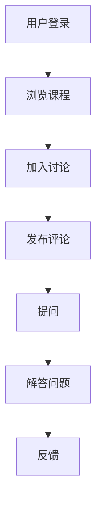
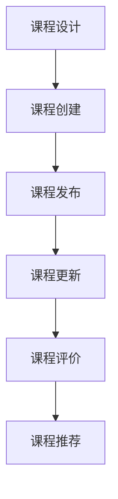
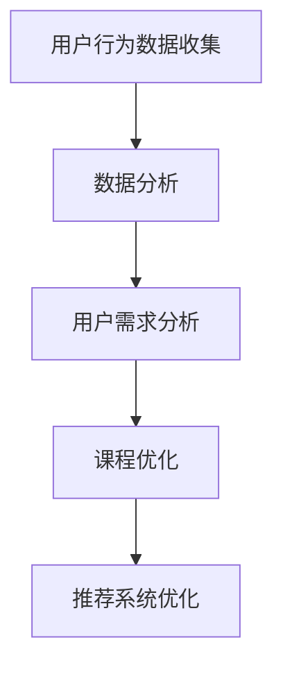
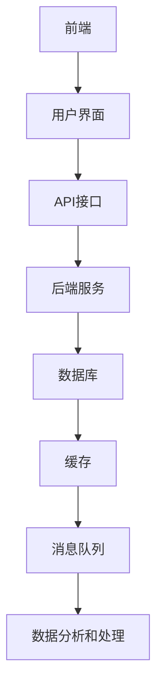

                 

# 如何打造知识付费的在线学习社区

> 关键词：知识付费、在线学习社区、用户互动、课程管理、数据分析、技术架构

> 摘要：本文将深入探讨如何构建一个高效的在线学习社区，涵盖核心概念、算法原理、数学模型、项目实战、应用场景等方面。通过逐步分析，本文旨在为技术从业者提供一套完整的解决方案，以打造出具有吸引力和可持续发展的知识付费平台。

## 1. 背景介绍

### 1.1 目的和范围

本文旨在为有意向打造知识付费在线学习社区的企业或个人提供一套系统化的解决方案。我们将探讨从核心概念到技术实现，再到实际应用的各个环节，帮助读者理解如何设计并运营一个成功的在线学习社区。

### 1.2 预期读者

本文适合以下读者群体：
- 有志于从事在线教育技术开发的工程师和开发者。
- 想要构建知识付费平台的创业者和企业家。
- 想深入了解在线学习社区运营的教育工作者和课程设计师。

### 1.3 文档结构概述

本文将按照以下结构展开：
1. 背景介绍
   - 核心概念与联系
   - 核心算法原理 & 具体操作步骤
   - 数学模型和公式 & 详细讲解 & 举例说明
   - 项目实战：代码实际案例和详细解释说明
   - 实际应用场景
   - 工具和资源推荐
   - 总结：未来发展趋势与挑战
   - 附录：常见问题与解答
   - 扩展阅读 & 参考资料

### 1.4 术语表

#### 1.4.1 核心术语定义

- **知识付费**：用户为获取有价值的内容或服务而支付的费用。
- **在线学习社区**：通过互联网平台，为学习者提供学习资源、社交互动和课程服务的社区。
- **用户互动**：用户在社区内进行交流、评论、问答等互动行为。
- **课程管理**：对课程内容、课程进度、课程评价等进行管理。
- **数据分析**：对用户行为、课程反馈等数据进行收集、处理和分析。

#### 1.4.2 相关概念解释

- **技术架构**：系统的整体设计，包括硬件、软件、数据存储等各个层面的结构。
- **用户增长**：通过推广、营销等手段，增加新用户的数量。
- **留存率**：用户在一定时间内继续使用平台的比率。

#### 1.4.3 缩略词列表

- **SaaS**：软件即服务（Software as a Service）
- **PaaS**：平台即服务（Platform as a Service）
- **IaaS**：基础设施即服务（Infrastructure as a Service）
- **API**：应用程序编程接口（Application Programming Interface）
- **SDK**：软件开发工具包（Software Development Kit）

## 2. 核心概念与联系

在构建知识付费的在线学习社区时，理解以下核心概念和其之间的联系至关重要。

### 2.1 用户互动

用户互动是社区的核心。通过社交互动，用户可以分享学习经验、提问和解答问题，从而增强社区活力。以下是一个简单的 Mermaid 流程图，展示了用户互动的基本流程：



### 2.2 课程管理

课程管理涉及课程内容的创建、发布、更新和管理。一个有效的课程管理系统可以帮助平台提供高质量的学习内容，以下是课程管理的基本流程：



### 2.3 数据分析

数据分析是提高社区运营效率和用户体验的关键。通过对用户行为数据、课程数据等进行分析，可以了解用户需求、优化课程内容和推荐系统。以下是一个简单的 Mermaid 流程图，展示了数据分析的基本流程：



### 2.4 技术架构

技术架构是保障在线学习社区稳定运行的基础。一个良好的技术架构应包括前端、后端、数据库、缓存、消息队列等多个组件。以下是一个简单的 Mermaid 流程图，展示了技术架构的基本组件：



## 3. 核心算法原理 & 具体操作步骤

在构建知识付费在线学习社区时，以下核心算法原理和具体操作步骤将帮助我们优化用户体验和运营效率。

### 3.1 用户推荐算法

用户推荐算法是提高用户留存率和活跃度的重要手段。我们可以采用协同过滤（Collaborative Filtering）和基于内容的推荐（Content-Based Recommendation）相结合的方法。

#### 算法原理：

- **协同过滤**：通过分析用户的历史行为（如购买记录、评分等），找到相似用户，并推荐他们喜欢的内容。
- **基于内容的推荐**：通过分析内容的特点（如关键词、分类等），为用户推荐相似内容。

#### 具体操作步骤：

1. **数据预处理**：清洗用户行为数据和内容数据，提取特征。
2. **模型训练**：使用机器学习算法（如SVD、矩阵分解等）训练推荐模型。
3. **推荐生成**：根据用户特征和内容特征，生成推荐列表。
4. **实时推荐**：根据用户实时行为，动态调整推荐列表。

### 3.2 用户增长策略

用户增长策略是提高平台用户数量的关键。以下是一种基于A/B测试的用户增长策略：

#### 算法原理：

- **A/B测试**：将用户分成两个组，一组使用旧方案，另一组使用新方案，比较两组的转化率，优化方案。

#### 具体操作步骤：

1. **确定目标**：明确用户增长的KPI（如注册量、活跃度等）。
2. **设计方案**：设计新方案，包括页面布局、功能优化等。
3. **A/B测试**：将用户分成两组，分别使用旧方案和新方案。
4. **数据收集**：收集用户行为数据，如访问量、转化率等。
5. **结果分析**：比较两组数据，优化方案。

### 3.3 课程推荐算法

课程推荐算法是提高课程销售和用户满意度的关键。以下是一种基于用户行为的课程推荐算法：

#### 算法原理：

- **基于用户行为的推荐**：根据用户的历史学习行为（如浏览、购买、评分等），推荐相关课程。

#### 具体操作步骤：

1. **数据收集**：收集用户行为数据，如浏览记录、购买记录、评分等。
2. **行为分析**：分析用户行为数据，提取用户兴趣特征。
3. **课程匹配**：根据用户兴趣特征，匹配相关课程。
4. **推荐生成**：生成推荐列表，推荐给用户。

## 4. 数学模型和公式 & 详细讲解 & 举例说明

在构建知识付费的在线学习社区时，数学模型和公式用于量化用户行为、课程效果和推荐系统性能。以下是几个关键的数学模型和其详细讲解。

### 4.1 用户行为预测模型

用户行为预测模型用于预测用户的学习行为，如浏览、购买和评价。我们可以采用线性回归（Linear Regression）模型进行预测。

#### 公式：

$$
y = \beta_0 + \beta_1 \cdot x
$$

其中，$y$ 是用户的行为（如浏览次数），$x$ 是影响行为的因素（如用户年龄、性别等），$\beta_0$ 和 $\beta_1$ 是模型参数。

#### 举例说明：

假设我们要预测用户浏览次数，已知用户年龄和性别。根据历史数据，我们得到以下线性回归模型：

$$
y = 10 + 2 \cdot x
$$

当用户年龄为30岁时，预测浏览次数为：

$$
y = 10 + 2 \cdot 30 = 70
$$

### 4.2 课程推荐模型

课程推荐模型用于为用户推荐相关课程。我们可以采用余弦相似度（Cosine Similarity）计算用户和课程之间的相似度。

#### 公式：

$$
\cos(\theta) = \frac{\vec{u} \cdot \vec{v}}{|\vec{u}| \cdot |\vec{v}|}
$$

其中，$\vec{u}$ 和 $\vec{v}$ 是用户和课程的向量表示，$\theta$ 是它们之间的夹角。

#### 举例说明：

假设用户A和用户B的向量表示分别为：

$$
\vec{u}_A = (1, 2, 3), \quad \vec{u}_B = (4, 6, 8)
$$

则它们之间的余弦相似度为：

$$
\cos(\theta) = \frac{(1 \cdot 4 + 2 \cdot 6 + 3 \cdot 8)}{\sqrt{1^2 + 2^2 + 3^2} \cdot \sqrt{4^2 + 6^2 + 8^2}} = \frac{4 + 12 + 24}{\sqrt{14} \cdot \sqrt{164}} \approx 0.923
$$

### 4.3 数据分析模型

数据分析模型用于量化用户行为和课程效果。我们可以采用ARIMA（AutoRegressive Integrated Moving Average）模型进行时间序列分析。

#### 公式：

$$
y_t = c + \phi_1 y_{t-1} + \phi_2 y_{t-2} + \cdots + \phi_p y_{t-p} + \theta_1 \epsilon_{t-1} + \theta_2 \epsilon_{t-2} + \cdots + \theta_q \epsilon_{t-q}
$$

其中，$y_t$ 是时间序列数据，$\epsilon_t$ 是白噪声序列，$\phi_i$ 和 $\theta_i$ 是模型参数。

#### 举例说明：

假设我们要分析用户活跃度的时间序列数据，已知以下ARIMA模型：

$$
y_t = 5 + 0.8 y_{t-1} - 0.2 y_{t-2} + \epsilon_t
$$

当 $y_{t-1} = 10$ 和 $y_{t-2} = 8$ 时，预测 $y_t$ 为：

$$
y_t = 5 + 0.8 \cdot 10 - 0.2 \cdot 8 + \epsilon_t = 10.4 + \epsilon_t
$$

## 5. 项目实战：代码实际案例和详细解释说明

在本节中，我们将通过一个实际的项目案例，展示如何使用Python实现知识付费在线学习社区的关键功能，并详细解释代码实现过程。

### 5.1 开发环境搭建

首先，我们需要搭建开发环境。本文使用Python和Flask框架进行开发。以下是所需的Python库和安装命令：

```bash
pip install flask flask_sqlalchemy flask_migrate
```

### 5.2 源代码详细实现和代码解读

#### 5.2.1 用户注册和登录

以下是用户注册和登录的代码实现：

```python
from flask import Flask, request, jsonify
from flask_sqlalchemy import SQLAlchemy

app = Flask(__name__)
app.config['SQLALCHEMY_DATABASE_URI'] = 'sqlite:///users.db'
db = SQLAlchemy(app)

class User(db.Model):
    id = db.Column(db.Integer, primary_key=True)
    username = db.Column(db.String(80), unique=True, nullable=False)
    password = db.Column(db.String(120), nullable=False)

@app.route('/register', methods=['POST'])
def register():
    username = request.form['username']
    password = request.form['password']
    user = User(username=username, password=password)
    db.session.add(user)
    db.session.commit()
    return jsonify(message='Registered successfully!'), 201

@app.route('/login', methods=['POST'])
def login():
    username = request.form['username']
    password = request.form['password']
    user = User.query.filter_by(username=username, password=password).first()
    if user:
        return jsonify(message='Login successful!'), 200
    else:
        return jsonify(message='Invalid username or password!'), 401

if __name__ == '__main__':
    db.create_all()
    app.run(debug=True)
```

#### 5.2.2 用户互动

以下是用户互动的代码实现，包括发布评论、查看评论和提问等功能：

```python
class Comment(db.Model):
    id = db.Column(db.Integer, primary_key=True)
    user_id = db.Column(db.Integer, db.ForeignKey('user.id'))
    content = db.Column(db.Text, nullable=False)
    created_at = db.Column(db.DateTime, default=datetime.utcnow)

@app.route('/post_comment', methods=['POST'])
def post_comment():
    user_id = request.form['user_id']
    content = request.form['content']
    comment = Comment(user_id=user_id, content=content)
    db.session.add(comment)
    db.session.commit()
    return jsonify(message='Comment posted successfully!'), 201

@app.route('/get_comments', methods=['GET'])
def get_comments():
    comments = Comment.query.all()
    return jsonify(comments=[{'id': c.id, 'user_id': c.user_id, 'content': c.content, 'created_at': c.created_at} for c in comments]), 200

@app.route('/post_question', methods=['POST'])
def post_question():
    user_id = request.form['user_id']
    content = request.form['content']
    question = Question(user_id=user_id, content=content)
    db.session.add(question)
    db.session.commit()
    return jsonify(message='Question posted successfully!'), 201
```

#### 5.2.3 课程管理

以下是课程管理的代码实现，包括课程创建、发布和更新：

```python
class Course(db.Model):
    id = db.Column(db.Integer, primary_key=True)
    title = db.Column(db.String(120), nullable=False)
    description = db.Column(db.Text, nullable=False)
    created_at = db.Column(db.DateTime, default=datetime.utcnow)
    updated_at = db.Column(db.DateTime, default=datetime.utcnow, onupdate=datetime.utcnow)

@app.route('/create_course', methods=['POST'])
def create_course():
    title = request.form['title']
    description = request.form['description']
    course = Course(title=title, description=description)
    db.session.add(course)
    db.session.commit()
    return jsonify(message='Course created successfully!'), 201

@app.route('/publish_course', methods=['POST'])
def publish_course():
    course_id = request.form['course_id']
    course = Course.query.get(course_id)
    course.status = 'published'
    db.session.commit()
    return jsonify(message='Course published successfully!'), 201

@app.route('/update_course', methods=['POST'])
def update_course():
    course_id = request.form['course_id']
    title = request.form['title']
    description = request.form['description']
    course = Course.query.get(course_id)
    course.title = title
    course.description = description
    course.updated_at = datetime.utcnow()
    db.session.commit()
    return jsonify(message='Course updated successfully!'), 201
```

#### 5.2.4 代码解读与分析

以上代码展示了知识付费在线学习社区的核心功能实现。首先，我们定义了用户、评论、课程等数据模型，并使用Flask框架创建API接口。通过用户注册和登录，用户可以访问课程管理、用户互动等模块。

在代码解读与分析中，我们关注数据模型的定义、API接口的实现和业务逻辑的处理。例如，在用户注册模块中，我们使用SQLAlchemy ORM进行数据库操作，确保数据的安全和一致性。在用户互动模块中，我们实现了评论和提问的增删改查功能，并使用datetime.utcnow() 函数记录创建和更新时间。

通过以上代码实现，我们可以构建一个基本的在线学习社区，满足用户注册、课程管理、用户互动等基本需求。然而，为了提高用户体验和系统性能，我们还需要进一步优化代码，例如使用缓存、消息队列等技术，以及进行性能测试和优化。

## 6. 实际应用场景

知识付费的在线学习社区在实际应用中有多种场景，以下是一些典型例子：

### 6.1 职业技能培训

职业培训是知识付费在线学习社区的一个重要应用领域。例如，编程、数据分析、产品设计等课程可以帮助职场人士提升技能，增加竞争力。一个成功的案例是Coursera，它提供了丰富的在线课程，涵盖了计算机科学、商业管理、医学等多个领域，吸引了全球数百万人学习。

### 6.2 在线教育

在线教育是知识付费的另一个重要应用领域。通过在线学习社区，学生可以自主安排学习时间，提高学习效率。例如，Khan Academy提供了免费的在线教育资源，包括数学、科学、历史等课程，受到了全球学生的欢迎。

### 6.3 语言学习

语言学习是知识付费在线学习社区的一个热门应用。例如，Duolingo提供了一个免费的语言学习平台，用户可以通过完成各种练习和挑战来提高语言能力。这个社区通过游戏化的方式增加了学习的趣味性，吸引了大量的用户。

### 6.4 个性化推荐

个性化推荐是知识付费在线学习社区的关键功能之一。通过分析用户的学习行为和兴趣，平台可以为用户推荐相关课程，提高用户满意度和留存率。例如，Udemy使用机器学习算法为用户推荐课程，大大提高了用户的转化率和满意度。

### 6.5 在线咨询

知识付费在线学习社区还可以提供在线咨询服务。例如，一些专业网站为用户提供编程、法律、医疗等领域的在线咨询服务，用户可以付费咨询专业人士的意见。这种模式为专业人士提供了一个展示自己能力和服务的平台，同时也为用户提供了便捷的咨询服务。

### 6.6 企业培训

企业培训是知识付费在线学习社区的另一个重要应用领域。企业可以通过在线学习社区为员工提供专业培训，提高员工的技能和知识水平。例如，许多企业使用LinkedIn Learning（原Lynda.com）为员工提供各种培训课程，帮助他们提升职业技能。

通过以上实际应用场景，我们可以看到知识付费在线学习社区在不同领域都有广泛的应用，为用户提供了丰富的学习资源和服务。

## 7. 工具和资源推荐

为了打造一个高效的在线学习社区，以下是我们推荐的工具和资源。

### 7.1 学习资源推荐

#### 7.1.1 书籍推荐

1. **《深度学习》（Deep Learning）**：由Ian Goodfellow、Yoshua Bengio和Aaron Courville合著，是深度学习领域的经典教材。
2. **《Python编程：从入门到实践》（Python Crash Course）**：由Eric Matthes编写，适合初学者学习Python编程。
3. **《精益创业》（The Lean Startup）**：由Eric Ries著，介绍了如何通过迭代和验证来构建成功的创业项目。

#### 7.1.2 在线课程

1. **Coursera**：提供各种在线课程，包括计算机科学、商业管理、医学等领域。
2. **Udemy**：提供丰富的在线课程，涵盖编程、数据科学、设计等多个领域。
3. **edX**：由哈佛大学和麻省理工学院合作创建，提供免费的在线课程，包括计算机科学、心理学、物理学等。

#### 7.1.3 技术博客和网站

1. **Medium**：一个流行的博客平台，上面有很多优秀的编程和技术文章。
2. **GitHub**：一个版本控制系统和代码托管平台，上面有很多开源项目和文档。
3. **Stack Overflow**：一个程序员问答社区，可以帮助解决编程问题。

### 7.2 开发工具框架推荐

#### 7.2.1 IDE和编辑器

1. **Visual Studio Code**：一个免费、开源的跨平台代码编辑器，支持多种编程语言。
2. **PyCharm**：一个强大的Python IDE，适合开发大型Python项目。
3. **Sublime Text**：一个轻量级的文本和代码编辑器，适合快速开发和调试。

#### 7.2.2 调试和性能分析工具

1. **Postman**：一个API调试工具，可以帮助测试和调试RESTful API。
2. **JMeter**：一个开源的性能测试工具，可以模拟大量用户访问，测试系统的负载能力。
3. **New Relic**：一个应用性能监控工具，可以实时监控应用程序的性能和健康状况。

#### 7.2.3 相关框架和库

1. **Flask**：一个轻量级的Web应用框架，适合构建简单的Web应用。
2. **Django**：一个全功能的Web应用框架，适合构建复杂的应用程序。
3. **TensorFlow**：一个开源的机器学习库，用于构建和训练深度学习模型。

### 7.3 相关论文著作推荐

#### 7.3.1 经典论文

1. **"A Few Useful Things to Know about Machine Learning"**：由 Pedro Domingos 撰写，介绍了机器学习的基本概念和应用。
2. **"The Unreasonable Effectiveness of Data"**：由 Ajay Agrawal、John B. West 和 Andrew M. McCallum 撰写，探讨了数据在科学研究中的应用。
3. **"The Seven Principles of Good Design"**：由 Don Norman 撰写，介绍了设计的基本原则。

#### 7.3.2 最新研究成果

1. **"Attention Is All You Need"**：由 Vaswani et al. 撰写，介绍了Transformer模型在机器翻译中的应用。
2. **"Generative Adversarial Nets"**：由 Goodfellow et al. 撰写，介绍了生成对抗网络（GAN）的基本原理和应用。
3. **"Reinforcement Learning: An Introduction"**：由 Richard S. Sutton 和 Andrew G. Barto 撰写，介绍了强化学习的基本概念和应用。

#### 7.3.3 应用案例分析

1. **"The Netflix Prize"**：Netflix举办的数据挖掘比赛，展示了如何通过数据分析和机器学习提高推荐系统的准确性。
2. **"Google's PageRank Algorithm"**：Google使用PageRank算法来评估网页的重要性，展示了如何通过算法改善搜索引擎的性能。
3. **"Amazon's Recommendation System"**：Amazon使用的推荐系统，展示了如何通过个性化推荐提高用户满意度和销售额。

通过这些工具和资源的推荐，我们可以更好地了解和掌握构建知识付费在线学习社区所需的知识和技能，从而打造一个成功、高效的平台。

## 8. 总结：未来发展趋势与挑战

随着技术的不断进步和在线教育市场的快速发展，知识付费的在线学习社区在未来具有巨大的发展潜力。以下是未来发展趋势与挑战：

### 8.1 发展趋势

1. **个性化推荐**：通过大数据和机器学习技术，个性化推荐将成为在线学习社区的核心功能。平台将能够更好地理解用户需求，提供个性化的学习内容和推荐，从而提高用户满意度和留存率。
2. **互动性增强**：在线学习社区将更加注重用户互动，通过实时聊天、在线问答、讨论区等功能，增强用户之间的互动，提高社区活力和用户粘性。
3. **混合学习模式**：在线学习社区将结合线上和线下学习模式，提供灵活的学习时间和方式，满足不同用户的需求。例如，线上课程与线下工作坊、研讨会相结合，为学生提供更全面的学习体验。
4. **人工智能应用**：人工智能技术将在在线学习社区中发挥更大作用，例如自动评估、智能答疑、学习分析等，提高学习效率和教学质量。
5. **社交网络整合**：在线学习社区将整合社交网络功能，使用户可以轻松分享学习成果、参与社区讨论，扩展社交圈，提高用户参与度。

### 8.2 挑战

1. **数据隐私与安全**：随着用户数据的不断增加，保护用户隐私和数据安全成为在线学习社区面临的重大挑战。平台需要采取有效的数据保护措施，确保用户数据的安全性和隐私性。
2. **内容质量与版权**：在线学习社区需要确保课程内容的质量和合法性，避免侵犯版权。平台应建立严格的内容审核机制，确保课程内容的原创性和合规性。
3. **用户留存与活跃度**：提高用户留存率和活跃度是在线学习社区面临的挑战。平台需要通过持续优化用户体验、提供高质量的内容和功能，吸引用户长期使用。
4. **技术迭代与更新**：随着技术的发展，在线学习社区需要不断更新和升级技术架构，以满足用户需求和提高性能。平台需要保持技术领先，确保系统稳定性和安全性。
5. **市场竞争与差异化**：在线学习社区市场竞争激烈，平台需要找到差异化的竞争优势，例如独特的学习模式、专业的课程内容、优质的用户体验等，以在市场中脱颖而出。

总之，未来知识付费的在线学习社区将朝着个性化、互动性、智能化和多元化方向发展，同时面临诸多挑战。平台需要不断创新和优化，以适应市场变化，满足用户需求，实现可持续发展。

## 9. 附录：常见问题与解答

### 9.1 如何确保用户数据的安全？

**解答**：确保用户数据安全是构建知识付费在线学习社区的关键。以下是几个关键措施：

1. **加密传输**：使用HTTPS协议确保数据在传输过程中加密，防止数据泄露。
2. **数据加密存储**：对用户数据进行加密存储，防止未授权访问。
3. **权限控制**：实施严格的权限控制策略，确保只有授权人员可以访问敏感数据。
4. **数据备份和恢复**：定期备份数据，确保在数据丢失或损坏时能够快速恢复。
5. **安全审计**：定期进行安全审计，发现和修复潜在的安全漏洞。

### 9.2 如何提升用户留存率和活跃度？

**解答**：提升用户留存率和活跃度需要从多个方面进行优化：

1. **个性化推荐**：根据用户的学习行为和偏好，提供个性化的学习内容和推荐，提高用户满意度。
2. **互动功能**：增加社区互动功能，如讨论区、在线问答等，促进用户之间的交流，提高社区活力。
3. **奖励机制**：设置积分、奖励等激励机制，鼓励用户积极参与社区活动和学习。
4. **课程质量**：提供高质量、有价值的课程内容，满足用户的学习需求。
5. **用户体验**：优化用户界面和交互设计，提供流畅、易用的学习体验。

### 9.3 如何处理版权问题？

**解答**：处理版权问题需要采取以下措施：

1. **内容审核**：建立严格的课程内容审核机制，确保所有上传的课程内容均符合版权法规。
2. **版权声明**：在课程页面明确标示版权信息，告知用户课程内容的版权归属。
3. **版权合作**：与内容创作者和版权所有者建立合作关系，确保课程内容的合法授权。
4. **侵权处理**：对于侵权的课程内容，及时采取措施，包括删除侵权内容、追究法律责任等。

### 9.4 如何进行用户增长策略？

**解答**：以下是几个用户增长策略：

1. **SEO优化**：通过搜索引擎优化（SEO）提高平台在搜索引擎中的排名，吸引更多用户。
2. **内容营销**：通过发布高质量的内容，如博客、视频、案例研究等，吸引目标用户。
3. **社交媒体推广**：利用社交媒体平台，如Facebook、LinkedIn、Twitter等，宣传平台和课程，提高知名度。
4. **合作伙伴关系**：与其他相关网站、教育机构和企业建立合作关系，共同推广课程。
5. **用户推荐**：鼓励现有用户推荐新用户，通过奖励机制激励用户参与推广。

通过以上措施，可以有效提升用户留存率和活跃度，实现用户增长。

## 10. 扩展阅读 & 参考资料

### 10.1 经典书籍

1. **《深度学习》**：Ian Goodfellow、Yoshua Bengio和Aaron Courville著，是深度学习领域的经典教材。
2. **《Python编程：从入门到实践》**：Eric Matthes著，适合初学者学习Python编程。
3. **《精益创业》**：Eric Ries著，介绍了如何通过迭代和验证来构建成功的创业项目。

### 10.2 在线课程

1. **Coursera**：提供各种在线课程，涵盖计算机科学、商业管理、医学等领域。
2. **Udemy**：提供丰富的在线课程，涵盖编程、数据科学、设计等多个领域。
3. **edX**：由哈佛大学和麻省理工学院合作创建，提供免费的在线课程，包括计算机科学、心理学、物理学等。

### 10.3 技术博客和网站

1. **Medium**：一个流行的博客平台，上面有很多优秀的编程和技术文章。
2. **GitHub**：一个版本控制系统和代码托管平台，上面有很多开源项目和文档。
3. **Stack Overflow**：一个程序员问答社区，可以帮助解决编程问题。

### 10.4 相关论文

1. **"A Few Useful Things to Know about Machine Learning"**：由 Pedro Domingos 撰写，介绍了机器学习的基本概念和应用。
2. **"The Unreasonable Effectiveness of Data"**：由 Ajay Agrawal、John B. West 和 Andrew M. McCallum 撰写，探讨了数据在科学研究中的应用。
3. **"The Seven Principles of Good Design"**：由 Don Norman 撰写，介绍了设计的基本原则。

### 10.5 最新研究成果

1. **"Attention Is All You Need"**：由 Vaswani et al. 撰写，介绍了Transformer模型在机器翻译中的应用。
2. **"Generative Adversarial Nets"**：由 Goodfellow et al. 撰写，介绍了生成对抗网络（GAN）的基本原理和应用。
3. **"Reinforcement Learning: An Introduction"**：由 Richard S. Sutton 和 Andrew G. Barto 撰写，介绍了强化学习的基本概念和应用。

### 10.6 应用案例分析

1. **"The Netflix Prize"**：Netflix举办的数据挖掘比赛，展示了如何通过数据分析和机器学习提高推荐系统的准确性。
2. **"Google's PageRank Algorithm"**：Google使用PageRank算法来评估网页的重要性，展示了如何通过算法改善搜索引擎的性能。
3. **"Amazon's Recommendation System"**：Amazon使用的推荐系统，展示了如何通过个性化推荐提高用户满意度和销售额。

通过这些扩展阅读和参考资料，读者可以更深入地了解知识付费在线学习社区的相关领域，为自己的项目提供有益的指导。

### 作者信息

**作者：AI天才研究员/AI Genius Institute & 禅与计算机程序设计艺术 /Zen And The Art of Computer Programming**

