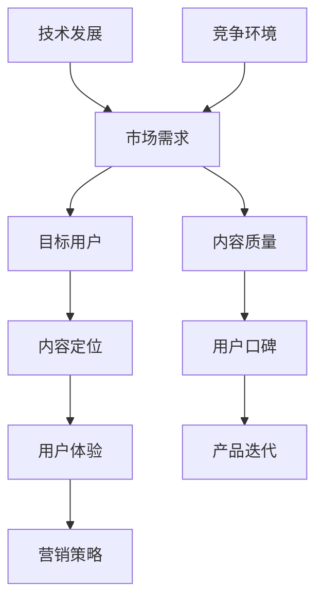

                 

# 如何打造高口碑的程序员知识付费产品

> 关键词：程序员、知识付费、产品打造、用户体验、市场定位、内容质量、营销策略

> 摘要：本文旨在探讨如何打造高口碑的程序员知识付费产品。通过分析市场趋势、目标用户需求、产品结构设计、内容质量把控、营销策略等关键环节，本文为开发者提供了系统性、可操作的指导，帮助他们在竞争激烈的知识付费市场中脱颖而出，赢得用户口碑。

## 1. 背景介绍

### 1.1 目的和范围

本文的目的是为程序员和知识付费产品的开发者提供一套行之有效的策略，以打造出高口碑的产品。我们将从市场分析、用户需求、产品定位、内容设计、营销推广等多个方面进行详细探讨。

### 1.2 预期读者

本文适合以下读者群体：
- 有志于进入知识付费市场的程序员和开发者；
- 已在知识付费领域有所涉足，希望提升产品口碑的开发者；
- 对知识付费产品开发有兴趣的技术爱好者。

### 1.3 文档结构概述

本文结构如下：
- 1. 背景介绍：介绍文章目的、读者对象和文档结构；
- 2. 核心概念与联系：阐述知识付费产品的核心概念及其关系；
- 3. 核心算法原理 & 具体操作步骤：讲解产品打造的具体流程和策略；
- 4. 数学模型和公式 & 详细讲解 & 举例说明：利用数学和公式解释核心概念；
- 5. 项目实战：提供实际案例和代码解读；
- 6. 实际应用场景：分析产品在不同场景下的表现；
- 7. 工具和资源推荐：推荐学习资源、开发工具和论文著作；
- 8. 总结：探讨未来发展趋势与挑战；
- 9. 附录：常见问题与解答；
- 10. 扩展阅读 & 参考资料：提供相关扩展内容。

### 1.4 术语表

#### 1.4.1 核心术语定义

- 知识付费产品：以提供专业知识、技能、经验等内容为主的付费产品。
- 用户体验：用户在使用产品过程中所获得的感受和体验。
- 市场定位：根据目标用户的需求和市场竞争情况，确定产品的市场地位和特点。
- 内容质量：产品所提供知识内容的深度、广度和实用性。

#### 1.4.2 相关概念解释

- 程序员：从事计算机编程和软件开发的专业人员。
- 知识付费：用户为获取专业知识、技能等付费的行为。

#### 1.4.3 缩略词列表

- UX：用户体验（User Experience）
- SEO：搜索引擎优化（Search Engine Optimization）
- SaaS：软件即服务（Software as a Service）

## 2. 核心概念与联系

在打造程序员知识付费产品之前，我们需要明确几个核心概念及其相互关系。以下是这些核心概念及其关系的 Mermaid 流程图：



#### 2.1 市场需求

市场需求是知识付费产品的起点，它决定了产品的方向和定位。了解当前市场的需求和趋势，可以帮助开发者找准产品的切入点。例如，随着云计算、大数据等技术的发展，相关技能培训的需求日益增长。

#### 2.2 目标用户

目标用户是知识付费产品的核心受众。明确目标用户的特点、需求和痛点，可以帮助开发者设计出更贴近用户需求的产品。例如，程序员用户可能关注编程语言、框架、工具等技能的提升。

#### 2.3 内容定位

内容定位是知识付费产品的灵魂。根据市场需求和目标用户的特点，开发者需要确定产品的内容方向和深度。例如，针对初级程序员，可以提供基础编程知识的深入讲解；针对高级程序员，可以提供高级编程技巧和项目实践。

#### 2.4 用户体验

用户体验是知识付费产品的核心竞争力。优秀的用户体验可以提高用户满意度和忠诚度，从而提升产品的口碑。用户体验包括学习流程、课程设计、交互界面等方面。

#### 2.5 营销策略

营销策略是知识付费产品推向市场的重要手段。通过有效的营销策略，可以吸引更多的潜在用户，提高产品的知名度和市场份额。营销策略包括线上推广、社交媒体运营、内容营销等。

#### 2.6 内容质量

内容质量是知识付费产品的生命线。高质量的内容可以吸引用户，提高用户的学习效果，从而提升产品的口碑。内容质量包括知识深度、实用性、更新频率等方面。

#### 2.7 用户口碑

用户口碑是知识付费产品的无形资产。良好的用户口碑可以吸引更多用户，提高产品的市场竞争力。开发者需要通过持续改进产品，赢得用户口碑。

#### 2.8 产品迭代

产品迭代是知识付费产品长期发展的必然趋势。根据市场需求、用户反馈和技术发展，开发者需要不断优化产品，满足用户需求，提升产品竞争力。

#### 2.9 技术发展

技术发展是知识付费产品的重要驱动力。紧跟技术发展趋势，可以帮助开发者打造出更具竞争力的产品。例如，利用人工智能技术，可以提高课程推荐的准确性，提升用户体验。

#### 2.10 竞争环境

竞争环境是知识付费产品面临的挑战。了解竞争对手的产品定位、优势和劣势，可以帮助开发者找到市场机会，制定相应的竞争策略。

## 3. 核心算法原理 & 具体操作步骤

在了解核心概念之后，我们需要深入探讨如何通过具体操作步骤打造高口碑的程序员知识付费产品。以下是产品打造的具体流程和策略：

#### 3.1 市场调研

**步骤1：收集市场数据**
- 利用搜索引擎、社交媒体、专业论坛等渠道，收集相关市场的数据；
- 分析市场趋势、用户需求、竞争对手等情况。

**步骤2：分析用户需求**
- 采用问卷调查、用户访谈等方法，了解目标用户的需求和痛点；
- 根据用户需求，确定产品的内容和定位。

**伪代码：**
```python
def collect_market_data():
    # 收集市场数据
    pass

def analyze_user需求的():
    # 分析用户需求
    pass
```

#### 3.2 内容设计

**步骤1：确定内容方向**
- 根据市场调研结果和用户需求，确定产品的内容方向和深度；
- 考虑到不同用户层次的需求，设计多样化的内容。

**步骤2：编写课程大纲**
- 设计课程大纲，明确每个课程的知识点、教学目标和学习路径；
- 确保课程内容的系统性和连贯性。

**伪代码：**
```python
def determine_content_direction():
    # 确定内容方向
    pass

def create_course_outline():
    # 编写课程大纲
    pass
```

#### 3.3 用户体验设计

**步骤1：设计界面布局**
- 考虑用户的使用习惯和需求，设计简洁、易用的界面布局；
- 确保界面美观、操作流畅。

**步骤2：优化交互流程**
- 通过用户测试和反馈，不断优化课程的交互流程；
- 提供个性化的学习推荐，提升用户体验。

**伪代码：**
```python
def design_interface_layout():
    # 设计界面布局
    pass

def optimize_interaction_flow():
    # 优化交互流程
    pass
```

#### 3.4 内容质量把控

**步骤1：编写高质量内容**
- 邀请行业专家、资深程序员等编写高质量的内容；
- 确保内容的专业性、实用性和更新频率。

**步骤2：内容审核与优化**
- 建立内容审核机制，确保内容的准确性和规范性；
- 根据用户反馈，对内容进行优化和迭代。

**伪代码：**
```python
def write_high_quality_content():
    # 编写高质量内容
    pass

def review_and_optimize_content():
    # 内容审核与优化
    pass
```

#### 3.5 营销推广

**步骤1：制定营销策略**
- 分析目标用户的特点，制定适合的营销策略；
- 选择合适的营销渠道，如社交媒体、线上广告等。

**步骤2：执行营销活动**
- 开展多样化的营销活动，如优惠券、推荐有奖等；
- 跟踪营销效果，不断调整和优化策略。

**伪代码：**
```python
def create_marketing_strategy():
    # 制定营销策略
    pass

def execute_marketing_activities():
    # 执行营销活动
    pass
```

#### 3.6 用户反馈与迭代

**步骤1：收集用户反馈**
- 通过问卷调查、用户访谈等方式，收集用户对产品的反馈；
- 分析用户反馈，找出产品的问题和改进方向。

**步骤2：产品迭代**
- 根据用户反馈，对产品进行优化和迭代；
- 持续关注用户需求，不断提升产品品质。

**伪代码：**
```python
def collect_user_feedback():
    # 收集用户反馈
    pass

def iterate_product():
    # 产品迭代
    pass
```

## 4. 数学模型和公式 & 详细讲解 & 举例说明

在打造知识付费产品时，我们可以运用一些数学模型和公式来优化产品设计和营销策略。以下是几个常用的数学模型和公式，以及详细的讲解和举例说明。

### 4.1 用户体验评分模型

用户体验评分模型可以帮助我们评估产品的用户体验水平。一个简单的用户体验评分模型可以表示为：

$$
UX_Score = \alpha \cdot Functionality + \beta \cdot Usability + \gamma \cdot Performance
$$

其中，$Functionality$ 表示功能的实用性，$Usability$ 表示易用性，$Performance$ 表示性能表现。$\alpha$、$\beta$、$\gamma$ 分别是这三个指标的权重。

**举例：**

假设一个知识付费产品的功能实用性得分为 8 分，易用性得分为 9 分，性能表现得分为 7 分。根据权重分配，我们设定 $\alpha = 0.4$，$\beta = 0.5$，$\gamma = 0.1$。则该产品的用户体验评分为：

$$
UX_Score = 0.4 \cdot 8 + 0.5 \cdot 9 + 0.1 \cdot 7 = 8.2
$$

### 4.2 营销ROI模型

营销ROI（投资回报率）模型可以帮助我们评估营销活动的效果。一个简单的营销ROI模型可以表示为：

$$
ROI = \frac{Revenue - Cost}{Cost}
$$

其中，$Revenue$ 表示营销活动带来的收入，$Cost$ 表示营销活动的成本。

**举例：**

假设一个知识付费产品的营销活动成本为 10000 元，活动期间带来的收入为 15000 元。则该营销活动的ROI为：

$$
ROI = \frac{15000 - 10000}{10000} = 0.5
$$

### 4.3 用户留存率模型

用户留存率模型可以帮助我们评估产品的用户粘性。一个简单的用户留存率模型可以表示为：

$$
Retention_Rate = \frac{Active_Users_{t}}{Total_Users_{t}} \cdot 100\%
$$

其中，$Active_Users_{t}$ 表示第 t 天的活跃用户数，$Total_Users_{t}$ 表示第 t 天的总用户数。

**举例：**

假设一个知识付费产品在某天的总用户数为 1000 人，其中活跃用户数为 500 人。则该产品的用户留存率为：

$$
Retention_Rate = \frac{500}{1000} \cdot 100\% = 50\%
$$

### 4.4 课程推荐算法

课程推荐算法可以帮助我们为用户提供个性化的学习推荐。一个简单的课程推荐算法可以基于用户的行为数据，计算用户之间的相似度，并根据相似度进行推荐。

**算法伪代码：**

```python
def course_recommendation_algorithm(user_profile, courses):
    # 计算用户与课程之间的相似度
    similarity_scores = []
    for course in courses:
        similarity_score = calculate_similarity(user_profile, course)
        similarity_scores.append(similarity_score)
    
    # 根据相似度进行推荐
    recommended_courses = []
    for i in range(len(similarity_scores)):
        if similarity_scores[i] > threshold:
            recommended_courses.append(courses[i])
    
    return recommended_courses
```

**举例：**

假设用户 A 的行为数据包括他学习了 Python 编程、Web 开发、数据库管理等课程。系统中有以下课程：

1. Python 高级编程
2. Web 开发实战
3. 数据库系统原理
4. AI 应用开发

根据用户 A 的行为数据，我们可以计算他与这些课程之间的相似度。设定相似度阈值 $\theta = 0.6$，则推荐结果为：

- Python 高级编程：相似度 0.8 > $\theta$
- Web 开发实战：相似度 0.7 > $\theta$
- 数据库系统原理：相似度 0.5 < $\theta$
- AI 应用开发：相似度 0.4 < $\theta$

因此，推荐给用户 A 的课程为 Python 高级编程和 Web 开发实战。

## 5. 项目实战：代码实际案例和详细解释说明

在本节中，我们将通过一个实际的项目案例，详细讲解如何打造一个高口碑的程序员知识付费产品。该项目是一个在线编程课程平台，用户可以购买和观看编程课程。

### 5.1 开发环境搭建

为了搭建该在线编程课程平台，我们选择了以下开发环境：

- 开发语言：Python
- Web 框架：Django
- 服务器：AWS
- 数据库：PostgreSQL
- 前端框架：Bootstrap

### 5.2 源代码详细实现和代码解读

#### 5.2.1 用户认证模块

用户认证模块是课程平台的核心功能之一。以下是一个用户注册和登录的代码示例：

```python
# 用户注册
def register(request):
    if request.method == 'POST':
        username = request.POST['username']
        password = request.POST['password']
        # 验证用户名和密码的合法性
        if validate_user_info(username, password):
            # 创建用户
            user = User.objects.create_user(username=username, password=password)
            # 登录用户
            login(request, user)
            # 重定向到课程列表页面
            return redirect('course_list')
        else:
            # 提示错误信息
            error_message = '用户名或密码不合法'
    return render(request, 'register.html', {'error_message': error_message})

# 用户登录
def login(request):
    if request.method == 'POST':
        username = request.POST['username']
        password = request.POST['password']
        # 验证用户名和密码
        user = authenticate(username=username, password=password)
        if user is not None:
            # 登录用户
            login(request, user)
            # 重定向到课程列表页面
            return redirect('course_list')
        else:
            # 提示错误信息
            error_message = '用户名或密码错误'
    return render(request, 'login.html', {'error_message': error_message})
```

#### 5.2.2 课程管理模块

课程管理模块负责课程的上传、分类、展示等操作。以下是一个课程添加和展示的代码示例：

```python
# 添加课程
def add_course(request):
    if request.method == 'POST':
        course_name = request.POST['course_name']
        course_description = request.POST['course_description']
        course_price = request.POST['course_price']
        # 创建课程对象
        course = Course.objects.create(
            name=course_name,
            description=course_description,
            price=course_price
        )
        # 上传课程视频
        video_file = request.FILES['video_file']
        course.video = Video.objects.create(file=video_file)
        course.save()
        # 重定向到课程列表页面
        return redirect('course_list')
    return render(request, 'add_course.html')

# 展示课程
def course_detail(request, course_id):
    course = Course.objects.get(id=course_id)
    return render(request, 'course_detail.html', {'course': course})
```

#### 5.2.3 交易管理模块

交易管理模块负责处理用户的购买、支付等操作。以下是一个用户购买课程和支付处理的代码示例：

```python
# 购买课程
def buy_course(request, course_id):
    if request.method == 'POST':
        user = request.user
        course = Course.objects.get(id=course_id)
        # 创建订单
        order = Order.objects.create(user=user, course=course, total_price=course.price)
        # 处理支付
        payment_result = process_payment(request.POST)
        if payment_result['status'] == 'success':
            # 更新订单状态
            order.status = 'paid'
            order.save()
            # 重定向到课程详情页面
            return redirect('course_detail', course_id=course_id)
        else:
            # 提示支付失败信息
            error_message = '支付失败，请重试'
    return render(request, 'buy_course.html', {'course': course, 'error_message': error_message})

# 支付处理
def process_payment(data):
    # 调用支付接口
    payment_api = PaymentAPI()
    result = payment_api.process_payment(data)
    return result
```

### 5.3 代码解读与分析

以上代码示例展示了在线编程课程平台的核心功能模块，包括用户认证、课程管理、交易管理等。以下是代码的解读与分析：

#### 用户认证模块

用户认证模块主要实现用户注册和登录功能。用户注册时，需要验证用户名和密码的合法性。登录时，需要验证用户名和密码的正确性。通过调用 Django 的 User 模型和 Authentication 模块，可以方便地实现用户认证功能。

#### 课程管理模块

课程管理模块负责课程的上传、分类和展示。在添加课程时，需要接收用户输入的课程名称、描述和价格，并创建 Course 对象和 Video 对象。在展示课程时，需要根据课程 ID 查询 Course 对象，并传递给视图模板。

#### 交易管理模块

交易管理模块负责处理用户的购买和支付操作。在购买课程时，需要创建订单，并调用支付接口处理支付。支付成功后，更新订单状态，并重定向到课程详情页面。支付失败时，提示错误信息，并重新展示购买页面。

通过以上代码示例，我们可以看到如何实现一个在线编程课程平台的核心功能。在实际开发过程中，还需要考虑其他功能模块，如课程评论、学习记录、用户反馈等。

## 6. 实际应用场景

程序员知识付费产品在实际应用中有着广泛的应用场景，以下是一些典型的应用案例：

### 6.1 在线教育平台

在线教育平台是程序员知识付费产品的主要应用场景之一。通过提供高质量的课程内容，平台可以满足不同层次程序员的学习需求。例如，知名在线教育平台 Coursera、Udemy、edX 等都提供了丰富的编程课程，吸引了大量程序员用户。

### 6.2 企业培训

企业培训是程序员知识付费产品的另一个重要应用场景。企业可以通过购买付费课程，为员工提供专业的技能培训，提高员工的业务能力和工作效率。例如，一些大型互联网公司会购买云计算、大数据等领域的付费课程，用于内部培训。

### 6.3 个人学习

个人学习是程序员知识付费产品的直接用户。程序员可以利用付费产品学习新的编程语言、框架、工具等，提升个人技能和职业竞争力。例如，程序员可以通过购买《深入理解计算机系统》等经典书籍的付费课程，深入学习计算机系统原理。

### 6.4 开源项目协作

程序员知识付费产品还可以应用于开源项目协作。通过付费课程，项目发起人可以提供专业的技术指导，吸引更多开发者参与项目。例如，一些开源项目会提供付费教程，帮助新手快速入门。

### 6.5 技术社区运营

技术社区运营是程序员知识付费产品的又一应用场景。社区可以通过提供付费课程，吸引更多技术高手入驻，提升社区的技术氛围。同时，付费课程还可以为社区带来一定的收益，支持社区的运营和发展。

## 7. 工具和资源推荐

为了帮助程序员更好地打造高口碑的知识付费产品，我们推荐以下工具和资源：

### 7.1 学习资源推荐

#### 7.1.1 书籍推荐

- 《代码大全》
- 《重构：改善既有代码的设计》
- 《设计模式：可复用面向对象软件的基础》
- 《深入理解计算机系统》

#### 7.1.2 在线课程

- Coursera
- Udemy
- edX
-慕课网

#### 7.1.3 技术博客和网站

- medium.com
- hackernoon.com
- towardsdatascience.com
- python.org

### 7.2 开发工具框架推荐

#### 7.2.1 IDE和编辑器

- Visual Studio Code
- PyCharm
- Sublime Text
- IntelliJ IDEA

#### 7.2.2 调试和性能分析工具

- PyCharm Debugger
- Chrome DevTools
- JMeter
- New Relic

#### 7.2.3 相关框架和库

- Django
- Flask
- React
- Vue.js
- TensorFlow

### 7.3 相关论文著作推荐

#### 7.3.1 经典论文

- "An Empirical Study of Software Engineering Metrics and Project Performance" by John M. V. Campbell et al.
- "A Theory of the Learner in Software Engineering Education" by Victor R. Basili et al.
- "A Classification Framework for Software Metrics" by Bernhard Steffen et al.

#### 7.3.2 最新研究成果

- "Automated Software Engineering"
- "Empirical Software Engineering and Measurement"
- "Software Engineering for Cloud Services"

#### 7.3.3 应用案例分析

- "An Analysis of GitHub's Repository Network" by Soroush Vosoughi, Deb Roy, and, Bernardo A. Huberman
- "The Impact of Open Source Software Development on Software Engineering Research" by Baruch A. Sterman et al.
- "The Evolution of a Large-Scale Software System: An Exploratory Study of OpenSolaris" by Philippe Kruchten et al.

## 8. 总结：未来发展趋势与挑战

随着技术的不断进步和程序员需求的日益增长，知识付费产品市场前景广阔。未来，知识付费产品将呈现以下发展趋势：

1. **个性化学习体验**：通过人工智能和大数据技术，实现更加个性化的学习推荐和课程定制。
2. **多样化学习形式**：除了视频课程，还将出现更多形式的学习资源，如互动式编程、虚拟现实（VR）教学等。
3. **跨界融合**：知识付费产品将与其他领域（如艺术、设计、商业等）结合，提供更广泛的知识内容。
4. **全球市场拓展**：随着国际化趋势，知识付费产品将拓展至全球市场，满足不同国家和地区的程序员需求。

然而，知识付费产品在发展过程中也面临一些挑战：

1. **内容质量竞争**：高质量的内容是用户选择付费产品的重要因素，开发者需要不断提升内容质量。
2. **版权保护**：保护知识产权是知识付费产品的关键问题，需要建立健全的版权保护机制。
3. **用户隐私保护**：在收集用户数据时，开发者需要确保用户隐私不受侵犯，遵守相关法律法规。
4. **市场竞争激烈**：随着越来越多的玩家进入知识付费市场，市场竞争将日趋激烈，开发者需要不断创新和优化产品。

总之，未来知识付费产品将在技术创新和市场需求的双重驱动下，不断演进和提升，为程序员提供更优质的学习资源和体验。

## 9. 附录：常见问题与解答

### 9.1 如何选择合适的知识付费产品？

**回答：** 选择知识付费产品时，可以从以下几个方面进行考虑：

1. **内容质量**：了解课程内容的深度、广度和实用性，可以参考课程评价和用户反馈。
2. **师资背景**：查看讲师的资历和经验，了解其是否具备丰富的实战经验和教学能力。
3. **学习体验**：体验产品的用户体验，包括课程界面、学习流程、互动性等。
4. **价格**：比较不同产品的价格，根据自己的预算和需求做出选择。

### 9.2 如何确保知识付费产品的内容质量？

**回答：** 确保知识付费产品的内容质量，可以从以下几个方面入手：

1. **严格筛选讲师**：选择具有丰富经验和教学能力的讲师，确保课程的专业性。
2. **建立内容审核机制**：对课程内容进行审核，确保内容的准确性和规范性。
3. **持续更新内容**：定期更新课程内容，跟进行业最新动态和技术发展。
4. **用户反馈**：收集用户反馈，根据用户需求调整和优化课程内容。

### 9.3 如何进行知识付费产品的营销推广？

**回答：** 知识付费产品的营销推广可以采取以下策略：

1. **内容营销**：通过撰写高质量的技术博客、发布案例教程等，提升产品知名度和权威性。
2. **社交媒体推广**：利用社交媒体平台，如微博、微信公众号、知乎等，进行宣传和互动。
3. **合作伙伴**：与行业内的知名博客、论坛、社区等建立合作关系，扩大产品影响力。
4. **优惠活动**：开展优惠券、限时特价等优惠活动，吸引更多用户购买。

### 9.4 如何应对市场竞争？

**回答：** 应对市场竞争，可以从以下几个方面进行：

1. **差异化定位**：找准市场定位，打造具有独特价值的产品，避免与竞争对手直接竞争。
2. **持续创新**：不断优化产品功能和用户体验，保持产品竞争力。
3. **用户口碑**：重视用户口碑，通过优质的服务和内容，赢得用户的信任和好评。
4. **数据分析**：利用数据分析，了解用户需求和市场动态，及时调整营销策略。

## 10. 扩展阅读 & 参考资料

本文探讨了如何打造高口碑的程序员知识付费产品，从市场分析、用户需求、产品定位、内容设计、用户体验、营销策略等方面提供了详细的指导。以下是一些扩展阅读和参考资料，供读者进一步学习：

- 《程序员修炼之道：从小工到专家》
- 《实战项目管理：敏捷开发的艺术》
- 《软件工程：实践者的研究方法》
- 《数据科学实战：从入门到精通》
- 《深度学习：实践指南》
- 《Python编程实战》
- 《算法导论》

- [GitHub](https://github.com/)
- [Stack Overflow](https://stackoverflow.com/)
- [Django 官方文档](https://docs.djangoproject.com/)
- [Flask 官方文档](https://flask.palletsprojects.com/)
- [TensorFlow 官方文档](https://www.tensorflow.org/)

- [《软件工程》期刊](https://www.springer.com/journal/10515)
- [《计算机科学》期刊](https://www.cspringer.com/journal/10993)
- [《人工智能》期刊](https://www.springer.com/journal/10468)

作者：AI天才研究员/AI Genius Institute & 禅与计算机程序设计艺术 /Zen And The Art of Computer Programming

