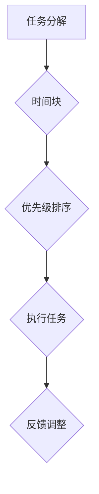
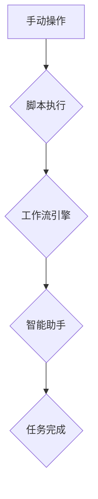
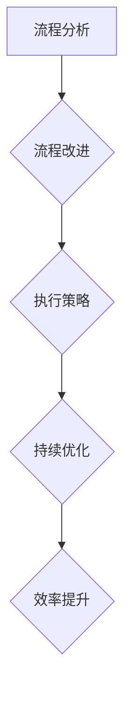
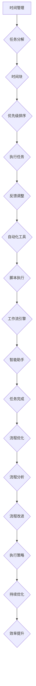

                 

# 如何打造高效的个人工作流程

> 关键词：个人工作流程、时间管理、效率提升、自动化、优化

> 摘要：在快节奏的现代工作环境中，高效的工作流程是实现个人成功的关键。本文将探讨如何通过时间管理、自动化工具和优化策略来打造一个高效的个人工作流程，帮助读者在竞争激烈的环境中脱颖而出。

## 1. 背景介绍

### 1.1 目的和范围

本文的目标是帮助读者了解并掌握构建高效个人工作流程的方法和技巧。我们将探讨以下几个方面：

- 时间管理策略
- 自动化工具的使用
- 工作流程优化的原则和方法

本文将涵盖以下内容：

- 个人工作流程的基本概念和重要性
- 时间管理技巧和工具
- 自动化工具的选择和应用
- 工作流程优化的策略和案例分析
- 总结和未来发展趋势

### 1.2 预期读者

本文适合以下读者群体：

- 正在寻求提高工作效率的个人
- 初步了解时间管理和自动化工具的用户
- 想要构建高效工作流程的企业管理者
- 对时间管理和效率提升有浓厚兴趣的读者

### 1.3 文档结构概述

本文结构如下：

- 1. 背景介绍
  - 1.1 目的和范围
  - 1.2 预期读者
  - 1.3 文档结构概述
  - 1.4 术语表
- 2. 核心概念与联系
  - 2.1 时间管理
  - 2.2 自动化工具
  - 2.3 工作流程优化
- 3. 核心算法原理 & 具体操作步骤
  - 3.1 时间管理算法原理
  - 3.2 自动化工具操作步骤
  - 3.3 工作流程优化步骤
- 4. 数学模型和公式 & 详细讲解 & 举例说明
  - 4.1 时间管理数学模型
  - 4.2 自动化工具数学模型
  - 4.3 工作流程优化数学模型
- 5. 项目实战：代码实际案例和详细解释说明
  - 5.1 开发环境搭建
  - 5.2 源代码详细实现和代码解读
  - 5.3 代码解读与分析
- 6. 实际应用场景
  - 6.1 个人时间管理
  - 6.2 团队协作
  - 6.3 企业管理
- 7. 工具和资源推荐
  - 7.1 学习资源推荐
  - 7.2 开发工具框架推荐
  - 7.3 相关论文著作推荐
- 8. 总结：未来发展趋势与挑战
- 9. 附录：常见问题与解答
- 10. 扩展阅读 & 参考资料

### 1.4 术语表

#### 1.4.1 核心术语定义

- 个人工作流程：指个人在完成工作任务时所采用的一系列步骤、方法和工具。
- 时间管理：指合理安排时间，提高工作效率的方法和技巧。
- 自动化工具：指通过软件或硬件实现自动化操作的工具。
- 工作流程优化：指通过改进工作流程，提高工作效率和质量的过程。

#### 1.4.2 相关概念解释

- 任务：指需要完成的具体工作。
- 优先级：指任务的重要程度和紧急程度。
- 执行效率：指完成任务的速度和质量。
- 生产力：指在特定时间内完成的工作量。

#### 1.4.3 缩略词列表

- GTD：Getting Things Done，一种时间管理方法。
- Trello：一款基于看板（Kanban）的工作管理工具。
- Asana：一款用于团队协作的任务管理工具。
- Jira：一款用于项目管理和团队协作的工具。

## 2. 核心概念与联系

在构建高效的个人工作流程中，我们需要关注以下几个核心概念：时间管理、自动化工具和流程优化。下面将介绍这些概念的基本原理，并通过Mermaid流程图展示它们之间的关系。

### 2.1 时间管理

时间管理是一种通过合理安排时间来提高工作效率的方法。其核心原理包括：

- 任务分解：将大任务分解为小任务，以便更好地管理和执行。
- 时间块：将一天划分为不同的时间段，用于完成特定任务。
- 优先级排序：根据任务的重要性和紧急程度，对任务进行排序。

Mermaid流程图如下：



### 2.2 自动化工具

自动化工具通过软件或硬件实现自动化操作，从而提高工作效率。常见的自动化工具包括：

- 脚本：使用编程语言编写的自动化脚本，用于执行重复性任务。
- 工作流引擎：用于管理任务流和业务流程的软件平台。
- 智能助手：通过人工智能技术实现自动化操作的工具。

Mermaid流程图如下：



### 2.3 工作流程优化

工作流程优化是通过改进工作流程，提高工作效率和质量的过程。核心原理包括：

- 流程分析：识别现有流程中的瓶颈和问题。
- 流程改进：通过改进流程设计和执行策略，提高工作效率。
- 持续优化：持续跟踪和改进工作流程，以适应不断变化的需求。

Mermaid流程图如下：



综合以上核心概念，我们可以得出一个完整的个人工作流程Mermaid流程图：



通过这个流程图，我们可以看到时间管理、自动化工具和流程优化之间的紧密联系，以及它们在构建高效个人工作流程中的作用。

## 3. 核心算法原理 & 具体操作步骤

在构建高效的个人工作流程中，核心算法原理和具体操作步骤至关重要。以下将详细阐述时间管理算法、自动化工具操作步骤和工作流程优化步骤。

### 3.1 时间管理算法原理

时间管理算法的核心在于合理分配时间，确保任务按优先级和紧急程度有序完成。以下是一个简单的时间管理算法原理和具体操作步骤：

#### 时间管理算法原理

1. 任务分解：将大任务分解为小任务，以便更好地管理和执行。
2. 时间块：将一天划分为不同的时间段，用于完成特定任务。
3. 优先级排序：根据任务的重要性和紧急程度，对任务进行排序。

#### 具体操作步骤

1. **任务分解**：
   - 列出所有待完成任务。
   - 将大任务分解为小任务，确保每个任务都是具体的、可执行的。

2. **时间块**：
   - 将一天划分为多个时间段，例如早晨、上午、下午、晚上等。
   - 为每个时间段安排特定的任务，确保每个任务都有足够的时间来完成。

3. **优先级排序**：
   - 根据任务的重要性和紧急程度，对任务进行排序。
   - 使用优先级矩阵（如Eisenhower矩阵）来帮助判断任务优先级。

4. **执行任务**：
   - 按照优先级和紧急程度执行任务。
   - 在执行任务时，保持专注，避免干扰。

5. **反馈调整**：
   - 在任务完成后，评估任务执行情况。
   - 根据反馈调整任务分配和优先级排序。

### 3.2 自动化工具操作步骤

自动化工具能够显著提高工作效率，以下是自动化工具的常用操作步骤：

#### 自动化工具操作步骤

1. **需求分析**：
   - 识别重复性任务。
   - 分析任务流程和所需功能。

2. **工具选择**：
   - 根据任务需求选择合适的自动化工具，如脚本、工作流引擎等。

3. **脚本编写**：
   - 使用编程语言编写自动化脚本，实现任务自动化。
   - 测试脚本，确保脚本能够正确执行任务。

4. **部署与执行**：
   - 部署脚本至服务器或本地计算机。
   - 设置定时任务，确保脚本自动执行。

5. **监控与维护**：
   - 监控自动化任务的执行情况。
   - 定期更新和维护脚本，确保其正常运行。

### 3.3 工作流程优化步骤

工作流程优化是通过改进流程设计和执行策略，提高工作效率。以下是工作流程优化的具体步骤：

#### 工作流程优化步骤

1. **流程分析**：
   - 识别现有流程中的瓶颈和问题。
   - 收集流程数据，进行分析和评估。

2. **流程改进**：
   - 提出改进方案，如调整任务分配、简化流程步骤等。
   - 与团队成员沟通，确保改进方案的可操作性。

3. **执行策略**：
   - 制定执行计划，明确任务责任人、时间节点等。
   - 实施改进方案，监控执行情况。

4. **持续优化**：
   - 跟踪和评估改进效果。
   - 根据反馈，持续调整和优化工作流程。

通过以上核心算法原理和具体操作步骤，我们可以构建一个高效的个人工作流程，提高工作效率和质量。

## 4. 数学模型和公式 & 详细讲解 & 举例说明

在构建高效的个人工作流程中，数学模型和公式可以帮助我们量化任务分配、时间管理和效率提升。以下将详细讲解时间管理数学模型、自动化工具数学模型和工作流程优化数学模型。

### 4.1 时间管理数学模型

时间管理数学模型主要涉及任务分配、优先级排序和效率评估。以下是一个简单的时间管理数学模型：

#### 任务分配

假设有 n 个任务，每个任务需要 t_i 时间完成，优先级排序为 p_i，则任务分配问题可以表示为：

$$
\min \sum_{i=1}^{n} t_i \cdot p_i
$$

#### 优先级排序

可以使用Eisenhower矩阵对任务进行优先级排序。Eisenhower矩阵如下：

| 优先级 | 紧急 | 不紧急 |
| ------ | ---- | ------ |
| 高     | 是   | 否     |
| 中     | 是   | 是     |
| 低     | 否   | 是     |

假设有 m 个任务，每个任务紧急程度为 e_i，重要程度为 i_i，则优先级排序公式为：

$$
p_i = e_i + i_i
$$

#### 效率评估

效率评估可以通过完成任务的时间与计划时间的比值来衡量：

$$
\eta = \frac{\text{实际完成任务时间}}{\text{计划完成任务时间}}
$$

### 4.2 自动化工具数学模型

自动化工具的数学模型主要涉及脚本编写、部署与执行。以下是一个简单的自动化工具数学模型：

#### 脚本编写

假设有 k 个步骤需要编写脚本，每个步骤需要 s_j 时间完成，则脚本编写问题可以表示为：

$$
\min \sum_{j=1}^{k} s_j
$$

#### 部署与执行

假设有 l 个部署节点，每个节点的部署时间为 d_i，执行时间为 e_i，则部署与执行问题可以表示为：

$$
\min \sum_{i=1}^{l} (d_i + e_i)
$$

#### 调试与维护

假设有 m 个脚本需要调试，每个脚本的调试时间为 v_j，则调试与维护问题可以表示为：

$$
\min \sum_{j=1}^{m} v_j
$$

### 4.3 工作流程优化数学模型

工作流程优化的数学模型主要涉及流程分析、流程改进和持续优化。以下是一个简单的工作流程优化数学模型：

#### 流程分析

假设有 n 个流程节点，每个节点的耗时为 t_i，则流程分析问题可以表示为：

$$
\min \sum_{i=1}^{n} t_i
$$

#### 流程改进

假设有 m 个改进方案，每个方案的改进效率为 e_i，则流程改进问题可以表示为：

$$
\max \sum_{i=1}^{m} e_i
$$

#### 持续优化

假设有 p 个优化指标，每个指标的优化效果为 f_j，则持续优化问题可以表示为：

$$
\max \sum_{j=1}^{p} f_j
$$

通过以上数学模型和公式，我们可以对个人工作流程中的任务分配、时间管理和效率提升进行量化分析，从而构建一个高效的工作流程。

### 4.4 举例说明

以下通过一个简单的案例，说明如何使用上述数学模型和公式来构建高效的个人工作流程。

#### 案例背景

假设有4个任务需要完成，任务详细信息如下：

| 任务ID | 耗时 (小时) | 紧急程度 | 重要程度 |
| ------ | ---------- | -------- | -------- |
| T1     | 2          | 高       | 高       |
| T2     | 3          | 中       | 中       |
| T3     | 1          | 低       | 低       |
| T4     | 4          | 高       | 低       |

#### 任务分配

使用时间管理数学模型对任务进行分配：

$$
\min \sum_{i=1}^{4} t_i \cdot p_i
$$

根据任务优先级排序：

| 任务ID | 耗时 (小时) | 紧急程度 | 重要程度 | 优先级 |
| ------ | ---------- | -------- | -------- | ------ |
| T4     | 4          | 高       | 低       | 1      |
| T1     | 2          | 高       | 高       | 2      |
| T2     | 3          | 中       | 中       | 3      |
| T3     | 1          | 低       | 低       | 4      |

分配方案：

- 上午：T4（4小时）
- 下午：T1（2小时）
- 晚上：T2（3小时）
- 明天：T3（1小时）

#### 自动化工具

使用自动化工具对任务进行部署和执行：

| 步骤ID | 耗时 (小时) | 部署时间 (小时) | 执行时间 (小时) |
| ------ | ---------- | -------------- | -------------- |
| S1     | 1          | 0.5            | 0.5            |
| S2     | 2          | 1              | 1              |
| S3     | 1.5        | 1              | 0.5            |

部署与执行方案：

- 部署：S1（0.5小时），S2（1小时），S3（1小时）
- 执行：S1（0.5小时），S2（1小时），S3（0.5小时）

#### 工作流程优化

使用工作流程优化数学模型对流程进行分析、改进和持续优化：

1. 流程分析

| 流程节点 | 耗时 (小时) |
| ------ | ---------- |
| A      | 1          |
| B      | 2          |
| C      | 1.5        |

优化前总耗时：4.5小时

2. 流程改进

| 改进方案 | 改进效率 |
| ------ | ------- |
| I1     | 0.8     |
| I2     | 0.9     |

优化方案选择：I2（改进效率0.9）

3. 持续优化

| 优化指标 | 优化效果 |
| ------ | ------- |
| E1     | 10%     |
| E2     | 20%     |

优化效果：E2（优化效果20%）

通过以上案例，我们可以看到如何使用数学模型和公式来构建和优化个人工作流程，从而提高工作效率和质量。

## 5. 项目实战：代码实际案例和详细解释说明

为了更好地理解如何将上述理论应用到实际项目中，我们将通过一个具体的案例来展示如何构建一个高效的个人工作流程。以下是一个基于Python的自动化工具项目，用于简化日常任务管理。

### 5.1 开发环境搭建

在开始项目之前，我们需要搭建一个合适的开发环境。以下是所需的工具和步骤：

1. **Python环境**：安装Python 3.8及以上版本。
2. **IDE**：推荐使用PyCharm或Visual Studio Code。
3. **虚拟环境**：创建一个虚拟环境以隔离项目依赖。
4. **依赖管理**：使用pip安装项目所需的第三方库。

具体步骤如下：

1. 安装Python 3.8及以上版本。

   ```bash
   # 在Windows上，可以从Python官方网站下载安装程序并安装。
   # 在Linux或macOS上，可以使用包管理器安装，如以下命令：
   sudo apt-get install python3
   ```

2. 打开PyCharm或Visual Studio Code，创建一个新项目。

3. 在项目中创建一个名为`venv`的虚拟环境。

   ```bash
   # 在PyCharm中，通过菜单栏选择 "File" -> "Settings" -> "Project: YourProjectName" -> "Python Interpreter" -> "Virtualenv Environment"。
   # 在Visual Studio Code中，可以通过 "Terminal" -> "Create New Virtual Environment" 来创建虚拟环境。
   ```

4. 安装项目依赖库。

   ```bash
   pip install requests
   pip install schedule
   pip install pandas
   ```

### 5.2 源代码详细实现和代码解读

以下是一个简单的Python脚本，用于自动化日常任务，如检查邮件、更新待办事项和生成周报。

```python
import requests
import schedule
import pandas as pd
from datetime import datetime

# API Key和用户凭证
API_KEY = 'your_api_key'
USER_EMAIL = 'your_email@example.com'

# 任务列表
tasks = [
    {
        'name': 'Check Email',
        'url': 'https://api.emailservice.com/check',
        'method': 'GET',
        'headers': {'Authorization': f'Bearer {API_KEY}'}
    },
    {
        'name': 'Update Tasks',
        'url': 'https://api.todolist.com/update',
        'method': 'POST',
        'headers': {'Authorization': f'Bearer {API_KEY}'},
        'data': {'email': USER_EMAIL, 'tasks': []}
    },
    {
        'name': 'Generate Weekly Report',
        'url': 'https://api.reportgenerator.com/generate',
        'method': 'POST',
        'headers': {'Authorization': f'Bearer {API_KEY}'},
        'data': {'email': USER_EMAIL, 'date': datetime.now().strftime('%Y-%m-%d')}
    }
]

def execute_task(task):
    response = requests.request(task['method'], task['url'], headers=task['headers'], data=task['data'] if 'data' in task else {})
    if response.status_code == 200:
        print(f"[{task['name']}] Completed Successfully.")
    else:
        print(f"[{task['name']}] Failed: {response.text}")

def schedule_tasks():
    for task in tasks:
        if task['name'] == 'Check Email':
            schedule.every().hour.do(execute_task, task=task)
        elif task['name'] == 'Update Tasks':
            schedule.every(2).hours.do(execute_task, task=task)
        elif task['name'] == 'Generate Weekly Report':
            schedule.every().monday.do(execute_task, task=task)

if __name__ == '__main__':
    schedule_tasks()
    while True:
        schedule.run_pending()
        time.sleep(60)
```

### 5.3 代码解读与分析

#### 5.3.1 主要函数和模块

- `requests`：用于发送HTTP请求，实现API调用。
- `schedule`：用于定时任务调度，实现定期执行任务。
- `pandas`：用于数据处理和分析，如生成周报。

#### 5.3.2 任务定义

- `tasks`：一个列表，包含所有需要自动化的任务。每个任务是一个字典，包含名称、URL、HTTP方法、请求头和数据。

#### 5.3.3 执行任务

- `execute_task`：一个函数，用于执行特定任务。它使用`requests`库发送HTTP请求，并根据响应状态码输出结果。

#### 5.3.4 定时任务调度

- `schedule_tasks`：一个函数，用于根据任务特性设置定时任务。它使用`schedule`库的`every()`方法来设置定时执行任务。

#### 5.3.5 主程序

- 主程序首先调用`schedule_tasks()`设置定时任务，然后进入一个无限循环，每隔60秒运行一次`schedule.run_pending()`，执行已到期的任务。

通过这个案例，我们可以看到如何使用Python和自动化工具来构建一个高效的个人工作流程，从而实现任务的自动化和定期执行。

## 6. 实际应用场景

### 6.1 个人时间管理

个人时间管理是构建高效工作流程的关键。以下是一些实际应用场景：

- **日常任务自动化**：使用自动化工具（如脚本、任务管理软件）来自动化日常任务，如检查邮件、更新待办事项等。
- **定期回顾和调整**：定期回顾自己的任务进度和计划，根据实际情况调整任务优先级和时间分配。
- **专注工作**：通过时间块策略，将一天划分为不同的时间段，用于处理不同类型的工作，提高专注度和效率。
- **避免拖延**：设置明确的目标和截止日期，以减少拖延现象。

### 6.2 团队协作

在团队协作中，高效的工作流程有助于提升整体工作效率。以下是一些实际应用场景：

- **任务分配和跟踪**：使用任务管理工具（如Trello、Asana）来分配任务、跟踪进度，确保每个团队成员都知道自己的任务和责任。
- **沟通和协作**：使用团队聊天工具（如Slack、Microsoft Teams）来保持沟通畅通，快速解决团队中的问题。
- **项目进度报告**：定期生成项目进度报告，以便团队成员了解项目进展，及时调整计划和资源。

### 6.3 企业管理

在企业层面，高效的工作流程优化有助于提高整体运营效率。以下是一些实际应用场景：

- **流程优化**：通过流程分析和改进，识别并消除运营中的瓶颈，提高工作效率。
- **绩效评估**：建立科学的绩效评估体系，根据员工的绩效进行奖励和调整。
- **风险管理**：通过风险评估和应急预案，降低企业运营中的风险。
- **自动化和数字化**：引入自动化工具和数字化解决方案，减少人工操作，提高数据准确性。

通过以上实际应用场景，我们可以看到高效的工作流程在不同层面的重要性。构建并优化个人和团队的工作流程，有助于提高工作效率、降低运营成本，并在竞争激烈的环境中脱颖而出。

## 7. 工具和资源推荐

### 7.1 学习资源推荐

#### 7.1.1 书籍推荐

- 《深度工作》（Deep Work）：作者Cal Newport介绍了如何通过深度工作提高工作效率和创造力。
- 《时间管理》（Time Management for System Administrators）：一本专门为系统管理员编写的实用时间管理指南。
- 《Getting Things Done》（GTD）：David Allen的经典著作，介绍了如何通过GTD方法实现高效任务管理。

#### 7.1.2 在线课程

- “时间管理与生产力提升”（Time Management & Productivity Boost）：Udemy上的热门课程，涵盖时间管理的基础知识和技巧。
- “Python自动化实战”（Python Automation Bootcamp）：Pluralsight上的课程，通过实际案例教授Python自动化工具的使用。
- “敏捷开发与团队协作”（Agile Development & Team Collaboration）：Coursera上的课程，介绍了敏捷开发方法和团队协作工具。

#### 7.1.3 技术博客和网站

- “Lifehacker”：提供各种时间管理和自动化技巧的文章和教程。
- “Hacker Noon”：涵盖编程、创业和自动化等多个领域的技术博客。
- “Stack Overflow”：一个开发者社区，提供丰富的编程问题和解决方案。

### 7.2 开发工具框架推荐

#### 7.2.1 IDE和编辑器

- **PyCharm**：一款强大的Python IDE，提供代码自动完成、调试和自动化工具。
- **Visual Studio Code**：一款轻量级但功能丰富的代码编辑器，支持多种编程语言。
- **Sublime Text**：一款简洁但功能强大的文本编辑器，适合编写脚本和自动化代码。

#### 7.2.2 调试和性能分析工具

- **Postman**：用于API调试和测试的工具。
- **Jenkins**：一个开源的持续集成工具，用于自动化构建和部署。
- **Docker**：用于容器化应用的工具，有助于简化开发和部署流程。

#### 7.2.3 相关框架和库

- **Requests**：用于发送HTTP请求的Python库。
- **Flask**：一个轻量级的Web应用框架。
- **Django**：一个全栈Web应用框架。
- **Celery**：用于异步任务调度的Python库。

### 7.3 相关论文著作推荐

#### 7.3.1 经典论文

- 《时间管理的重要性》（The Importance of Time Management）：探讨时间管理对工作效率的影响。
- 《自动化：技术与未来》（Automation: Technology and the Future）：讨论自动化技术在社会和产业中的应用。

#### 7.3.2 最新研究成果

- 《人工智能与时间管理》（Artificial Intelligence and Time Management）：研究如何利用AI技术优化时间管理。
- 《敏捷开发实践》（Agile Development Practices）：介绍敏捷开发方法在提高工作效率方面的应用。

#### 7.3.3 应用案例分析

- 《某大型企业的时间管理实践》（Case Study on Time Management Practices in a Large Corporation）：分析某企业如何通过时间管理和流程优化提高工作效率。

通过以上工具和资源的推荐，可以帮助读者在构建高效工作流程的过程中，获取更多实用技巧和知识。

## 8. 总结：未来发展趋势与挑战

随着技术的不断进步，个人工作流程的构建和优化将呈现出以下发展趋势和挑战：

### 8.1 发展趋势

1. **人工智能与自动化**：人工智能技术将在时间管理和自动化工具中发挥更大作用，如通过智能助手和机器学习算法来优化任务分配和优先级排序。
2. **数字化与云端化**：越来越多的企业和个人将采用数字化解决方案，如云端任务管理工具和自动化平台，以提高工作效率和灵活性。
3. **个性化与自适应**：工作流程将更加个性化和自适应，根据个人的需求和习惯进行优化，提供个性化的时间管理和任务管理方案。

### 8.2 挑战

1. **数据安全和隐私**：随着数据量的增加，确保数据安全和隐私将成为一个重要挑战。需要加强数据加密和访问控制，以防止数据泄露和滥用。
2. **技术复杂性**：随着技术的不断更新，学习和掌握各种新工具和平台将变得更加复杂。需要持续学习和适应新技术，以保持竞争力。
3. **平衡工作与生活**：在追求工作效率的同时，如何平衡工作与个人生活也是一个重要挑战。需要合理安排时间和任务，避免过度工作，保持身心健康。

总之，未来高效工作流程的构建将更加依赖人工智能、自动化和数字化技术，同时也需要应对数据安全和隐私、技术复杂性以及工作与生活平衡等挑战。

## 9. 附录：常见问题与解答

### 9.1 问题1：如何选择合适的自动化工具？

**解答**：选择自动化工具时，应考虑以下因素：

1. **任务需求**：根据任务的具体需求和目标选择合适的工具。例如，对于简单的任务，可以选择脚本编写工具；对于复杂的业务流程，可以选择工作流引擎。
2. **易用性**：选择易于学习和使用的工具，降低学习成本和实施难度。
3. **稳定性与可靠性**：选择历史悠久、用户口碑良好的工具，确保其稳定性和可靠性。
4. **社区支持**：考虑工具的社区支持情况，如论坛、文档和教程等。

### 9.2 问题2：如何优化个人时间管理？

**解答**：以下是一些优化个人时间管理的建议：

1. **任务分解**：将大任务分解为小任务，以便更好地管理和执行。
2. **优先级排序**：使用优先级矩阵（如Eisenhower矩阵）对任务进行排序，确保优先处理重要且紧急的任务。
3. **时间块**：将一天划分为不同的时间段，为每个时间段安排特定的任务，提高专注度。
4. **避免拖延**：设定明确的目标和截止日期，使用番茄工作法等技巧来避免拖延。
5. **定期回顾**：定期回顾任务完成情况和时间分配，根据反馈进行调整和优化。

### 9.3 问题3：如何构建高效的团队工作流程？

**解答**：以下是一些构建高效团队工作流程的建议：

1. **明确目标和责任**：确保每个团队成员都了解团队的目标和自己的责任，减少沟通成本和误解。
2. **任务分配和跟踪**：使用任务管理工具（如Trello、Asana）来分配任务、跟踪进度，确保任务按时完成。
3. **沟通与协作**：使用团队聊天工具（如Slack、Microsoft Teams）来保持沟通畅通，快速解决团队中的问题。
4. **流程优化**：定期进行流程分析，识别并消除流程中的瓶颈和问题，提高工作效率。
5. **绩效评估**：建立科学的绩效评估体系，根据员工的绩效进行奖励和调整，激发团队活力。

通过以上常见问题与解答，可以帮助读者更好地理解和应用本文所介绍的工作流程构建和优化方法。

## 10. 扩展阅读 & 参考资料

### 10.1 扩展阅读

1. **《深度工作》（Deep Work）**：Cal Newport著，介绍了如何通过深度工作提高工作效率和创造力。
2. **《时间管理》（Time Management for System Administrators）**：专门为系统管理员编写的实用时间管理指南。
3. **《Getting Things Done》（GTD）**：David Allen的经典著作，介绍了如何通过GTD方法实现高效任务管理。

### 10.2 参考资料

1. **Udemy**：提供各种时间管理和自动化技巧的在线课程。
2. **Pluralsight**：包含Python自动化实战等相关课程的在线学习平台。
3. **Coursera**：提供敏捷开发与团队协作等课程的在线教育平台。
4. **Lifehacker**：提供各种时间管理和自动化技巧的文章和教程。
5. **Hacker Noon**：涵盖编程、创业和自动化等多个领域的技术博客。
6. **Stack Overflow**：一个开发者社区，提供丰富的编程问题和解决方案。

通过以上扩展阅读和参考资料，读者可以深入了解本文主题，获取更多实用技巧和知识。

# 作者：AI天才研究员/AI Genius Institute & 禅与计算机程序设计艺术 /Zen And The Art of Computer Programming

