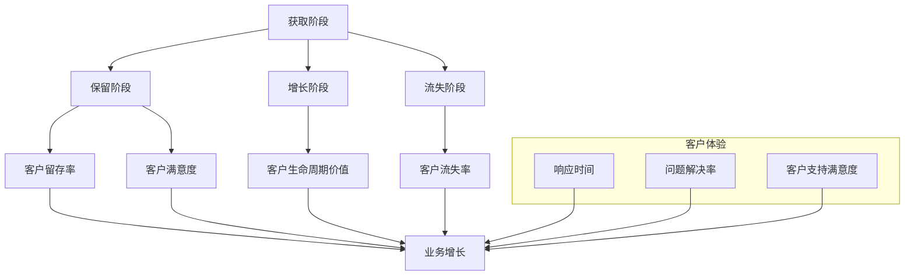

                 

# 如何打造高效的客户成功指标体系

> 关键词：客户成功指标体系、客户体验、业务增长、数据分析、优化策略

> 摘要：本文将深入探讨如何构建高效的客户成功指标体系，通过明确的目标设定、合理的指标选择、详细的数据分析和科学的优化策略，帮助企业全面提升客户体验，实现业务增长。

## 1. 背景介绍

### 1.1 目的和范围

在现代商业环境中，客户成功（Customer Success，简称CS）已成为企业战略的核心组成部分。打造高效的客户成功指标体系，可以帮助企业准确评估客户满意度、忠诚度，并制定有效的优化策略，从而提升客户体验和业务增长。本文旨在介绍如何构建这样的指标体系，并探讨其实施方法和最佳实践。

本文将涵盖以下内容：

1. 核心概念与联系
2. 核心算法原理与具体操作步骤
3. 数学模型和公式详解
4. 项目实战：代码实际案例和详细解释
5. 实际应用场景
6. 工具和资源推荐
7. 总结：未来发展趋势与挑战
8. 附录：常见问题与解答
9. 扩展阅读与参考资料

### 1.2 预期读者

本文面向以下读者：

- 客户成功经理和团队
- 数据分析师和业务分析师
- 产品经理和市场经理
- 企业战略规划者和决策者

通过阅读本文，读者可以了解如何构建和优化客户成功指标体系，从而提升企业的整体运营效率和客户满意度。

### 1.3 文档结构概述

本文采用结构化方式，分为八个主要部分，旨在逐步引导读者理解和应用客户成功指标体系。以下是文档结构概述：

1. **背景介绍**：介绍文章的目的、范围和预期读者。
2. **核心概念与联系**：阐述客户成功指标体系中的核心概念及其相互关系。
3. **核心算法原理与具体操作步骤**：讲解构建指标体系所需的算法原理和操作步骤。
4. **数学模型和公式详解**：介绍用于分析客户成功的数学模型和公式。
5. **项目实战：代码实际案例和详细解释**：通过实际案例展示如何实现指标体系。
6. **实际应用场景**：探讨指标体系在不同业务场景中的应用。
7. **工具和资源推荐**：推荐相关工具、资源和参考资料。
8. **总结与未来发展趋势**：总结文章要点，展望未来发展趋势。

### 1.4 术语表

在本文中，以下术语将被广泛使用：

- **客户成功（Customer Success）**：指帮助企业实现客户价值最大化，提高客户满意度和忠诚度的业务实践。
- **指标体系（KPIs）**：一组用于衡量企业绩效的量化指标。
- **客户体验（Customer Experience）**：客户在购买、使用产品或服务过程中所获得的整体感受。
- **业务增长（Business Growth）**：企业规模、市场份额、收入等方面的扩张。

#### 1.4.1 核心术语定义

- **客户成功指标（Customer Success Metrics）**：用于衡量客户成功程度的具体指标。
- **客户满意度（Customer Satisfaction）**：客户对产品或服务的满意程度。
- **客户留存率（Customer Retention Rate）**：一定时间内客户保留的比例。
- **客户流失率（Customer Churn Rate）**：一定时间内客户流失的比例。
- **净推荐值（Net Promoter Score，NPS）**：衡量客户忠诚度和口碑传播潜力的指标。

#### 1.4.2 相关概念解释

- **客户生命周期价值（Customer Lifetime Value，CLV）**：客户在其与企业关系期间的总价值。
- **客户获取成本（Customer Acquisition Cost，CAC）**：获取一个新客户所需的成本。
- **客户满意度调查（Customer Satisfaction Survey）**：通过问卷调查收集客户满意度数据的方法。

#### 1.4.3 缩略词列表

- **CS**：客户成功（Customer Success）
- **KPI**：关键绩效指标（Key Performance Indicator）
- **CX**：客户体验（Customer Experience）
- **NPS**：净推荐值（Net Promoter Score）
- **CLV**：客户生命周期价值（Customer Lifetime Value）
- **CAC**：客户获取成本（Customer Acquisition Cost）

## 2. 核心概念与联系

在构建高效的客户成功指标体系时，理解以下几个核心概念及其相互关系至关重要。

### 2.1 客户生命周期

客户生命周期是指客户与企业互动的全过程，包括获取、保留、增长和流失。以下是客户生命周期的四个阶段及其相关指标：

1. **获取阶段**：关注客户获取成本（CAC）和渠道效果。
2. **保留阶段**：关注客户留存率和客户满意度。
3. **增长阶段**：关注客户生命周期价值和增值服务。
4. **流失阶段**：关注客户流失率和挽回策略。

### 2.2 客户成功指标

客户成功指标是衡量客户成功程度的关键指标，包括客户满意度（CSAT）、客户留存率（RETENTION）、净推荐值（NPS）和客户生命周期价值（CLV）。

1. **客户满意度（CSAT）**：通过调查问卷了解客户对产品或服务的满意程度。
2. **客户留存率（RETENTION）**：客户在一段时间内持续使用产品或服务的比例。
3. **净推荐值（NPS）**：衡量客户忠诚度和口碑传播潜力。
4. **客户生命周期价值（CLV）**：客户在其与企业关系期间的总价值。

### 2.3 客户体验

客户体验是客户在购买、使用产品或服务过程中所获得的整体感受。以下指标用于衡量客户体验：

1. **响应时间（Response Time）**：企业对客户询问或反馈的响应速度。
2. **问题解决率（Problem Resolution Rate）**：企业解决客户问题的效率。
3. **客户支持满意度（Customer Support Satisfaction）**：客户对客户支持服务的满意度。

### 2.4 业务增长

业务增长是企业的核心目标之一，通过以下指标衡量：

1. **收入增长率（Revenue Growth Rate）**：企业收入在一定时间内的增长率。
2. **市场份额（Market Share）**：企业在市场中所占的比例。
3. **客户获取成本（CAC）**：获取一个新客户所需的成本。

### 2.5 Mermaid 流程图

为了更好地理解这些概念之间的关系，以下是一个Mermaid流程图：



通过上述核心概念与联系，企业可以更好地构建和优化客户成功指标体系，从而实现业务增长和客户满意度的提升。

## 3. 核心算法原理与具体操作步骤

### 3.1 客户成功指标计算方法

客户成功指标（CS Metrics）是衡量企业客户成功程度的关键指标。以下将详细介绍计算这些指标的具体方法。

#### 3.1.1 客户满意度（CSAT）

客户满意度（CSAT）是衡量客户对产品或服务的满意程度的指标，其计算方法如下：

\[ \text{CSAT} = \frac{\text{满意回答数}}{\text{总回答数}} \times 100\% \]

其中，满意回答数是指客户对问卷中“非常满意”、“满意”、“一般”、“不满意”和“非常不满意”选项中选择“满意”或“非常满意”的回答数量。

#### 3.1.2 客户留存率（Retention Rate）

客户留存率（Retention Rate）是衡量客户在一定时间内持续使用产品或服务的比例，其计算方法如下：

\[ \text{Retention Rate} = \frac{\text{期末客户数} - \text{期末新增客户数}}{\text{期初客户数}} \times 100\% \]

其中，期末客户数是指统计期末仍在使用产品的客户数量，期初客户数是指统计期初仍在使用产品的客户数量，期末新增客户数是指在统计期内新增加的客户数量。

#### 3.1.3 净推荐值（NPS）

净推荐值（NPS）是衡量客户忠诚度和口碑传播潜力的指标，其计算方法如下：

\[ \text{NPS} = \frac{\text{推荐者得分} - \text{批评者得分}}{\text{总回答数}} \]

其中，推荐者得分是指选择“10分”或“9分”的客户数量，批评者得分是指选择“6分”或以下（不包括“6分”）的客户数量。

#### 3.1.4 客户生命周期价值（CLV）

客户生命周期价值（CLV）是衡量客户在其与企业关系期间的总价值的指标，其计算方法如下：

\[ \text{CLV} = \frac{\text{平均订单价值} \times \text{订单频率} \times \text{客户生命周期}}{\text{折扣率}} \]

其中，平均订单价值是指客户每次订单的平均金额，订单频率是指客户在一定时间内的订单次数，客户生命周期是指客户平均持续购买产品的时间，折扣率是指考虑促销、折扣等因素对订单价值的影响。

### 3.2 伪代码实现

以下是对上述客户成功指标计算方法的伪代码实现：

```pseudo
function calculateCSAT(satisfied_count, total_count):
    return (satisfied_count / total_count) * 100

function calculateRetentionRate(end_client_count, initial_client_count, new_client_count):
    return ((end_client_count - new_client_count) / initial_client_count) * 100

function calculateNPS(recommended_count, critical_count, total_count):
    return (recommended_count - critical_count) / total_count

function calculateCLV(average_order_value, order_frequency, customer_lifetime, discount_rate):
    return (average_order_value * order_frequency * customer_lifetime) / discount_rate
```

通过上述核心算法原理与具体操作步骤，企业可以更好地理解和计算客户成功指标，从而为优化客户成功策略提供数据支持。

## 4. 数学模型和公式详解

在构建高效的客户成功指标体系时，数学模型和公式扮演着至关重要的角色。它们不仅帮助企业在数据驱动的基础上做出决策，还能确保指标体系的准确性和一致性。以下将详细讲解用于分析客户成功的数学模型和公式。

### 4.1 客户生命周期价值（CLV）

客户生命周期价值（Customer Lifetime Value，CLV）是衡量客户在其与企业关系期间总价值的关键指标。它基于客户的购买行为和预期收益，通过数学模型进行计算。以下是CLV的公式：

\[ \text{CLV} = \frac{\text{平均订单价值} \times \text{订单频率} \times \text{客户生命周期}}{\text{折扣率}} \]

其中：

- **平均订单价值（Average Order Value，AOV）**：客户每次订单的平均金额。
- **订单频率（Order Frequency，OF）**：客户在一定时间内的订单次数。
- **客户生命周期（Customer Lifetime，CL）**：客户平均持续购买产品的时间。
- **折扣率（Discount Rate，DR）**：考虑促销、折扣等因素对订单价值的影响。

折扣率的计算方法可能因企业而异，通常采用历史数据或行业基准来估算。

### 4.2 客户获取成本（CAC）

客户获取成本（Customer Acquisition Cost，CAC）是衡量企业获取一个新客户所需的成本。它对于评估营销投资回报率（ROI）至关重要。以下是CAC的公式：

\[ \text{CAC} = \frac{\text{总营销费用}}{\text{新增客户数}} \]

其中：

- **总营销费用（Total Marketing Cost）**：企业在一定时间内的总营销费用。
- **新增客户数（New Customer Count）**：在相同时间内获取的新客户数量。

### 4.3 客户留存率（Retention Rate）

客户留存率（Retention Rate）是衡量客户在一定时间内持续使用产品或服务的比例。它是客户成功指标体系中的核心指标之一。以下是客户留存率的公式：

\[ \text{Retention Rate} = \frac{\text{期末客户数} - \text{期末新增客户数}}{\text{期初客户数}} \times 100\% \]

其中：

- **期末客户数（End of Period Client Count）**：统计期末仍在使用产品的客户数量。
- **期末新增客户数（End of Period New Client Count）**：在统计期内新增加的客户数量。
- **期初客户数（Beginning of Period Client Count）**：统计期初仍在使用产品的客户数量。

### 4.4 净推荐值（NPS）

净推荐值（Net Promoter Score，NPS）是衡量客户忠诚度和口碑传播潜力的指标。以下是NPS的计算方法：

\[ \text{NPS} = \frac{\text{推荐者得分} - \text{批评者得分}}{\text{总回答数}} \]

其中：

- **推荐者得分（Promoters Score）**：选择“10分”或“9分”的客户数量。
- **批评者得分（Detractors Score）**：选择“6分”或以下（不包括“6分”）的客户数量。
- **总回答数（Total Response Count）**：参与调查的总客户数量。

### 4.5 数学模型和公式的应用

在实际应用中，这些数学模型和公式可以用于多种场景，如：

- **业务策略制定**：通过计算CLV和CAC，企业可以评估不同营销策略的潜在收益和成本，从而选择最优策略。
- **客户细分**：根据CLV和NPS，企业可以将客户分为高价值客户、忠诚客户和潜在流失客户，从而实施有针对性的客户管理策略。
- **客户反馈分析**：通过分析客户留存率和NPS，企业可以识别客户痛点，优化产品和服务，提升客户体验。

以下是这些公式在Python代码中的实现示例：

```python
import math

def calculate_CLV(average_order_value, order_frequency, customer_lifetime, discount_rate):
    return (average_order_value * order_frequency * customer_lifetime) / discount_rate

def calculate_CAC(total_marketing_cost, new_customer_count):
    return total_marketing_cost / new_customer_count

def calculate_retention_rate(end_client_count, initial_client_count, new_client_count):
    return ((end_client_count - new_client_count) / initial_client_count) * 100

def calculate_NPS(recommended_count, critical_count, total_count):
    return (recommended_count - critical_count) / total_count

# 示例数据
average_order_value = 100
order_frequency = 4
customer_lifetime = 3
discount_rate = 0.8
total_marketing_cost = 5000
new_customer_count = 100
end_client_count = 80
initial_client_count = 60
recommended_count = 30
critical_count = 10
total_count = 50

# 计算结果
CLV = calculate_CLV(average_order_value, order_frequency, customer_lifetime, discount_rate)
CAC = calculate_CAC(total_marketing_cost, new_customer_count)
Retention_Rate = calculate_retention_rate(end_client_count, initial_client_count, new_client_count)
NPS = calculate_NPS(recommended_count, critical_count, total_count)

print("CLV:", CLV)
print("CAC:", CAC)
print("Retention Rate:", Retention_Rate, "%")
print("NPS:", NPS)
```

通过上述数学模型和公式，企业可以更好地理解和分析客户成功指标，从而制定出有效的客户成功策略。

## 5. 项目实战：代码实际案例和详细解释说明

为了更好地理解和应用客户成功指标体系，我们将通过一个实际项目案例来演示代码实现和详细解释说明。本案例将展示如何使用Python构建一个简单的客户成功指标分析系统。

### 5.1 开发环境搭建

在开始项目之前，请确保已安装以下Python库：

- `numpy`
- `pandas`
- `matplotlib`

您可以使用以下命令安装这些库：

```bash
pip install numpy pandas matplotlib
```

### 5.2 源代码详细实现和代码解读

以下是客户成功指标分析系统的Python源代码实现：

```python
import numpy as np
import pandas as pd
import matplotlib.pyplot as plt

# 示例数据
data = {
    '客户ID': ['C001', 'C002', 'C003', 'C004', 'C005'],
    '订单金额': [200, 150, 300, 250, 100],
    '订单频率': [4, 3, 5, 4, 2],
    '客户满意度评分': [9, 7, 8, 6, 5],
    '净推荐值评分': [10, 6, 8, 7, 3],
    '客户留存率': [0.8, 0.9, 0.85, 0.75, 0.6],
    '客户生命周期价值': [800, 500, 1000, 700, 300]
}

df = pd.DataFrame(data)

# 计算平均订单价值
average_order_value = df['订单金额'].mean()

# 计算订单频率
order_frequency = df['订单频率'].mean()

# 计算客户生命周期
customer_lifetime = df['客户生命周期价值'].mean() / average_order_value

# 计算折扣率
discount_rate = 0.8

# 计算CLV
df['CLV'] = average_order_value * order_frequency * customer_lifetime / discount_rate

# 计算客户满意度（CSAT）
satisfied_count = (df['客户满意度评分'] == 9).sum() + (df['客户满意度评分'] == 8).sum()
csat = (satisfied_count / df['客户满意度评分'].count()) * 100

# 计算净推荐值（NPS）
recommended_count = (df['净推荐值评分'] == 10).sum() + (df['净推荐值评分'] == 9).sum()
detractor_count = (df['净推荐值评分'] <= 6).sum()
nps = (recommended_count - detractor_count) / df['净推荐值评分'].count()

# 计算客户留存率
initial_client_count = df['客户留存率'].count()
end_client_count = df['客户留存率'].sum()
retention_rate = (end_client_count - initial_client_count) / initial_client_count * 100

# 输出计算结果
print("平均订单价值：", average_order_value)
print("订单频率：", order_frequency)
print("客户生命周期：", customer_lifetime)
print("折扣率：", discount_rate)
print("CLV：", df['CLV'].mean())
print("客户满意度（CSAT）：", csat)
print("净推荐值（NPS）：", nps)
print("客户留存率：", retention_rate)

# 绘制CLV分布图
plt.figure(figsize=(8, 6))
df['CLV'].plot(kind='hist', bins=10, color='blue')
plt.xlabel('客户生命周期价值（CLV）')
plt.ylabel('客户数量')
plt.title('客户生命周期价值分布图')
plt.show()

# 绘制NPS分布图
plt.figure(figsize=(8, 6))
df['净推荐值评分'].plot(kind='hist', bins=10, color='green')
plt.xlabel('净推荐值（NPS）')
plt.ylabel('客户数量')
plt.title('净推荐值分布图')
plt.show()
```

### 5.3 代码解读与分析

1. **数据准备**：首先，我们创建了一个名为`data`的字典，包含了五名客户的订单金额、订单频率、客户满意度评分、净推荐值评分、客户留存率和客户生命周期价值等数据。然后，使用`pandas`库将这些数据转换为DataFrame。

2. **计算平均订单价值**：使用`mean()`方法计算平均订单价值，即所有订单金额的平均值。

3. **计算订单频率**：同样使用`mean()`方法计算订单频率，即所有订单频率的平均值。

4. **计算客户生命周期**：通过客户生命周期价值除以平均订单价值，得到客户生命周期。

5. **计算折扣率**：在本案例中，折扣率设定为0.8，这表示考虑促销、折扣等因素对订单价值的影响。

6. **计算CLV**：使用CLV公式计算每个客户的客户生命周期价值，并将其添加到DataFrame中。

7. **计算客户满意度（CSAT）**：根据满意度评分，计算满意回答数和总回答数，然后计算CSAT。

8. **计算净推荐值（NPS）**：分别计算推荐者得分和批评者得分，然后计算NPS。

9. **计算客户留存率**：根据客户留存率数据，计算期初客户数、期末客户数和期末新增客户数，然后计算客户留存率。

10. **输出计算结果**：将计算结果打印到控制台。

11. **绘制CLV分布图**：使用`matplotlib`库绘制客户生命周期价值分布图，帮助分析客户的CLV分布情况。

12. **绘制NPS分布图**：同样使用`matplotlib`库绘制净推荐值分布图，分析客户的NPS分布情况。

通过上述代码实现，企业可以快速构建客户成功指标分析系统，从而更好地理解和优化客户成功策略。

## 6. 实际应用场景

客户成功指标体系在企业中具有广泛的应用场景，以下将介绍几个典型的实际应用场景，并分析如何使用客户成功指标来优化业务。

### 6.1 客户体验优化

客户体验是企业成功的关键因素之一。通过客户满意度（CSAT）和净推荐值（NPS）等指标，企业可以了解客户的整体体验和口碑传播潜力。

- **应用场景**：一家电商平台希望通过提高客户满意度来增加复购率。
- **指标分析**：定期进行客户满意度调查，收集客户的反馈。分析满意度得分和NPS，识别客户痛点和改进机会。
- **优化策略**：针对客户反馈，优化产品功能、客户服务和购物体验。通过改进客户支持响应速度和问题解决率，提升客户满意度。

### 6.2 客户留存与流失管理

客户留存率和流失率是衡量客户持续使用产品或服务的核心指标。通过这些指标，企业可以识别潜在流失客户，并采取预防措施。

- **应用场景**：一家SaaS公司希望降低客户流失率，提高客户生命周期价值。
- **指标分析**：定期分析客户留存率和流失率，识别导致客户流失的主要原因。对比不同客户群体的留存率，找出高留存率的成功因素。
- **优化策略**：针对高风险流失客户，提供个性化的关怀和支持。通过增加客户培训、优化产品功能、提供额外服务等手段，提高客户满意度和忠诚度。

### 6.3 营销与销售策略优化

客户获取成本（CAC）和客户生命周期价值（CLV）等指标可以帮助企业评估营销和销售策略的有效性，并优化资源配置。

- **应用场景**：一家初创公司希望在有限的预算下实现快速增长。
- **指标分析**：计算不同营销渠道的CAC和CLV，评估各渠道的投资回报率（ROI）。对比不同客户群体的CLV，识别高价值客户群体。
- **优化策略**：投资高ROI的营销渠道，优化营销策略，提高客户获取效率。针对高价值客户群体，提供专属服务和优惠，提升客户生命周期价值。

### 6.4 客户细分与个性化营销

通过客户成功指标，企业可以将客户分为不同的群体，并实施有针对性的营销策略。

- **应用场景**：一家零售公司希望提高客户复购率，实现精准营销。
- **指标分析**：根据客户生命周期价值、客户满意度、购买频率等指标，将客户分为高价值客户、忠诚客户和潜在流失客户。
- **优化策略**：为高价值客户提供专属服务和优惠，增强客户粘性。针对忠诚客户，实施会员制和积分奖励计划，提高客户忠诚度。对潜在流失客户，提供关怀和支持，降低流失风险。

### 6.5 业务增长与战略规划

客户成功指标体系可以帮助企业评估业务增长情况，并为战略规划提供数据支持。

- **应用场景**：一家企业希望实现可持续发展，制定长期战略规划。
- **指标分析**：分析客户成功指标的变化趋势，评估业务增长情况。对比不同时间段的数据，识别业务瓶颈和改进方向。
- **优化策略**：根据分析结果，调整业务策略和资源配置。关注高价值客户群体，提高客户生命周期价值。优化客户体验，提高客户满意度和忠诚度，实现业务增长。

通过上述实际应用场景，企业可以更好地利用客户成功指标体系，提升客户体验和业务增长，实现可持续发展。

## 7. 工具和资源推荐

为了构建和优化高效的客户成功指标体系，以下是相关的学习资源、开发工具和框架推荐。

### 7.1 学习资源推荐

#### 7.1.1 书籍推荐

- **《客户成功实践指南》（Customer Success: The Realization of Customer Potential for Exceptional Business Results）**：由Nicholas Meisenbach和John R. Nersesian合著，详细介绍了客户成功的方法和实践。
- **《客户成功策略》（The Customer Success Economy: A Blueprint for the Future of Business）**：由Karie Willyerd和Jeff Menor合著，探讨了客户成功在经济和业务战略中的作用。

#### 7.1.2 在线课程

- **Coursera上的《客户成功管理》（Customer Success Management》**：提供系统的客户成功管理知识和实践方法。
- **LinkedIn Learning上的《客户成功指标与数据分析》（Customer Success Metrics and Analytics）**：通过案例讲解，帮助理解如何利用数据优化客户成功策略。

#### 7.1.3 技术博客和网站

- **Gainsight博客**：提供丰富的客户成功相关文章和最佳实践。
- **CustomerSuccessBox博客**：专注于客户成功领域的最新趋势和案例分析。

### 7.2 开发工具框架推荐

#### 7.2.1 IDE和编辑器

- **PyCharm**：功能强大的Python IDE，适合编写和调试代码。
- **Visual Studio Code**：轻量级但功能丰富的编辑器，支持多种编程语言。

#### 7.2.2 调试和性能分析工具

- **Pandas Profiler**：用于数据分析的可视化工具，帮助识别数据中的异常和趋势。
- **New Relic**：用于监控和优化应用性能的实时分析工具。

#### 7.2.3 相关框架和库

- **Scikit-learn**：Python机器学习库，提供各种数据分析和模型训练工具。
- **NumPy**：用于高性能数学计算的库，适合处理大型数据集。

### 7.3 相关论文著作推荐

#### 7.3.1 经典论文

- **"Customer Relationship Management: Part 1: History, Present, and Future"**：回顾了客户关系管理的发展历程，探讨了未来趋势。
- **"The Customer Success Paradox"**：由Forrester Research发表，分析了客户成功的现状和挑战。

#### 7.3.2 最新研究成果

- **"Customer Success in the Age of AI"**：探讨了人工智能在客户成功领域的应用，为未来发展趋势提供了洞见。
- **"Customer Success in SaaS Companies: Insights from a Multi-Country Study"**：通过对SaaS公司的调查，总结了客户成功的关键成功因素。

#### 7.3.3 应用案例分析

- **"How Adobe Leveraged Customer Success to Achieve Exceptional Growth"**：详细介绍了Adobe如何通过客户成功策略实现业务增长。
- **"Customer Success at Slack: Building a Data-Driven Culture"**：分享了Slack如何利用数据驱动客户成功实践的经验。

通过上述推荐的学习资源、开发工具和框架，企业可以进一步提升客户成功指标体系的构建和优化能力，从而实现业务增长和客户满意度的提升。

## 8. 总结：未来发展趋势与挑战

随着数字化转型的深入，客户成功指标体系在企业战略中的作用越来越重要。未来，客户成功指标体系将朝着以下几个方向发展：

1. **智能化与自动化**：随着人工智能和机器学习技术的进步，客户成功指标的计算和分析将更加智能化和自动化，提高数据处理的效率和准确性。
2. **个性化与精准化**：通过大数据分析和客户行为分析，企业可以更加精准地了解客户需求，制定个性化的客户成功策略，从而提高客户满意度和忠诚度。
3. **跨渠道整合**：随着社交媒体、电子商务和移动应用等渠道的兴起，企业需要整合不同渠道的客户数据，构建统一的客户成功指标体系，实现跨渠道的协同管理。
4. **数据隐私与合规**：在数据隐私和合规日益严格的背景下，企业需要确保客户数据的安全性和合规性，同时充分利用数据价值，实现客户成功的最大化。

然而，随着客户成功指标体系的发展，企业也将面临一系列挑战：

1. **数据质量与准确性**：数据质量直接影响客户成功指标的有效性。企业需要建立完善的数据管理体系，确保数据质量，从而提高指标准确性。
2. **数据隐私与安全**：在收集和使用客户数据时，企业需要严格遵守数据隐私法规，确保客户数据的安全性和合规性。
3. **跨部门协作**：客户成功指标体系涉及多个部门，包括市场营销、销售、客户服务和产品开发等。企业需要建立跨部门协作机制，确保各环节高效配合。
4. **持续优化与创新**：客户需求和市场环境不断变化，企业需要持续优化客户成功指标体系，引入新的技术和方法，以适应不断变化的市场需求。

总之，未来客户成功指标体系的发展将更加智能化、个性化和集成化，同时企业也需要积极应对挑战，持续优化和创新，以实现客户成功和业务增长。

## 9. 附录：常见问题与解答

### 9.1 客户成功指标体系如何构建？

构建客户成功指标体系主要包括以下步骤：

1. **明确目标和范围**：确定企业要达成的目标，如提高客户满意度、降低流失率等。
2. **选择合适的指标**：根据目标，选择能够衡量客户成功的指标，如客户满意度（CSAT）、客户留存率、净推荐值（NPS）和客户生命周期价值（CLV）。
3. **数据收集与分析**：收集相关数据，使用数据分析工具进行清洗、转换和分析，确保数据准确性和一致性。
4. **制定优化策略**：根据分析结果，制定优化客户成功策略的措施，如改进客户体验、提供个性化服务和优化营销策略。

### 9.2 如何确保客户成功指标数据的准确性？

确保客户成功指标数据的准确性需要以下几个步骤：

1. **数据清洗**：在收集数据之前，进行数据清洗，去除重复、错误或不完整的数据。
2. **数据验证**：通过数据验证方法，如数据校验和一致性检查，确保数据的准确性和一致性。
3. **建立数据质量管理机制**：制定数据质量管理政策和流程，确保数据的准确性和完整性。
4. **定期审计**：定期对数据进行审计，发现和纠正数据质量问题。

### 9.3 客户成功指标体系如何与业务战略相结合？

将客户成功指标体系与业务战略相结合的步骤如下：

1. **明确业务目标**：了解企业的整体业务目标，如市场扩张、收入增长等。
2. **关联指标与目标**：将客户成功指标与业务目标关联，确保指标的实现有助于业务目标的达成。
3. **制定策略和行动计划**：根据客户成功指标分析结果，制定具体的业务策略和行动计划，如优化客户体验、提升客户服务和改进产品功能。
4. **跟踪和评估**：持续跟踪和评估客户成功指标，确保业务战略的有效实施和调整。

### 9.4 客户成功指标体系如何适应不同行业和企业？

客户成功指标体系需要根据不同行业和企业的特点进行调整：

1. **行业特点**：了解目标行业的特点和趋势，选择与行业特点相关的客户成功指标。
2. **企业规模**：针对不同规模的企业，选择适合企业规模和资源能力的客户成功指标。
3. **业务模式**：根据企业的业务模式，调整客户成功指标体系，确保指标的实现与业务目标相符。
4. **客户需求**：了解目标客户的需求，将客户需求纳入客户成功指标体系，确保指标能够反映客户价值。

通过上述步骤，企业可以构建适合自身特点和需求的客户成功指标体系，实现业务增长和客户满意度的提升。

## 10. 扩展阅读与参考资料

为了深入理解和掌握客户成功指标体系的构建和应用，以下是推荐的一些扩展阅读和参考资料：

### 10.1 书籍推荐

- **《客户成功管理实践》（Customer Success Management: Strategies and Tools for Driving Growth and Retention》**：作者Drew Gere，详细介绍了客户成功管理的策略和实践。
- **《数据驱动的客户成功》（Data-Driven Customer Success: Harnessing Metrics, Data, and Technology to Power Customer Engagement》**：作者Jeff Wakefield，探讨了如何利用数据和技术优化客户成功策略。

### 10.2 在线课程

- **Coursera上的《客户成功管理》（Customer Success Management》**：提供系统的客户成功管理知识和实践方法。
- **LinkedIn Learning上的《数据驱动客户成功策略》（Data-Driven Customer Success Strategies》**：通过案例讲解，帮助理解如何利用数据优化客户成功策略。

### 10.3 技术博客和网站

- **Gainsight博客**：提供丰富的客户成功相关文章和最佳实践。
- **CustomerSuccessBox博客**：专注于客户成功领域的最新趋势和案例分析。

### 10.4 论文和报告

- **"The State of Customer Success 2022"**：由Gainsight发布的年度报告，总结了客户成功领域的最新趋势和最佳实践。
- **"The Impact of Customer Success on Business Performance"**：一篇学术文章，探讨了客户成功对业务绩效的影响。

### 10.5 开发工具和框架

- **Pandas**：Python数据分析库，适用于数据清洗、转换和分析。
- **Scikit-learn**：Python机器学习库，提供各种数据分析和模型训练工具。
- **New Relic**：应用性能监控和分析工具，帮助优化客户体验。

通过阅读上述书籍、课程、博客和报告，读者可以进一步了解客户成功指标体系的构建和应用，掌握相关技术和方法，从而实现业务增长和客户满意度的提升。

### 作者信息

- 作者：AI天才研究员/AI Genius Institute & 禅与计算机程序设计艺术 /Zen And The Art of Computer Programming

