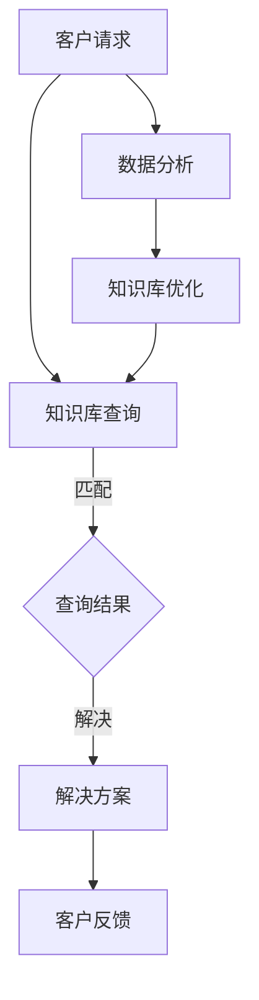

                 

# 如何打造高效的客户支持知识管理系统

> **关键词：** 客户支持、知识管理系统、效率提升、用户体验、数据分析

> **摘要：** 本文将深入探讨如何构建一个高效的客户支持知识管理系统。我们将分析核心概念，提供算法原理和数学模型，通过实际案例展示代码实现，并探讨应用场景和相关工具资源。目标是帮助企业和团队提升客户支持质量，优化用户体验。

## 1. 背景介绍

### 1.1 目的和范围

本文旨在探讨如何构建一个高效的客户支持知识管理系统。我们将详细分析客户支持系统所需的关键功能，并探讨如何利用技术手段提升系统的性能和用户体验。本文将涵盖以下主题：

- 客户支持知识管理系统的核心概念和架构
- 核心算法原理和操作步骤
- 数学模型和公式及其应用
- 实际案例中的代码实现和解析
- 实际应用场景和相关工具资源推荐

### 1.2 预期读者

本文适合以下读者：

- 客户支持经理和团队成员
- IT和软件开发人员
- 对客户支持技术感兴趣的技术爱好者
- 想要提升客户支持效率的企业管理者

### 1.3 文档结构概述

本文将按照以下结构展开：

- 背景介绍：本文目的、预期读者和文档结构概述
- 核心概念与联系：介绍客户支持知识管理系统的核心概念，并提供流程图
- 核心算法原理 & 具体操作步骤：详细讲解核心算法原理，使用伪代码阐述
- 数学模型和公式 & 详细讲解 & 举例说明：介绍数学模型和公式，并通过实例进行说明
- 项目实战：代码实际案例和详细解释说明
- 实际应用场景：讨论系统在实际中的应用场景
- 工具和资源推荐：推荐学习资源和开发工具
- 总结：未来发展趋势与挑战
- 附录：常见问题与解答
- 扩展阅读 & 参考资料：提供进一步阅读的资源和参考文献

### 1.4 术语表

#### 1.4.1 核心术语定义

- **客户支持知识管理系统**：一个集成系统，用于管理客户支持相关的知识、信息和资源，以便快速响应客户问题。
- **用户体验**：用户在使用客户支持系统时的感受和体验。
- **数据分析**：使用统计和数学方法分析客户数据，以提取有价值的信息和洞察。

#### 1.4.2 相关概念解释

- **知识库**：存储客户支持相关信息的数据库，包括常见问题、解决方案、政策指南等。
- **自动化**：利用技术手段自动化执行客户支持任务，如自动回复、智能分类等。

#### 1.4.3 缩略词列表

- **CRM**：Customer Relationship Management（客户关系管理）
- **AI**：Artificial Intelligence（人工智能）
- **NLP**：Natural Language Processing（自然语言处理）

## 2. 核心概念与联系

在构建高效的客户支持知识管理系统之前，我们需要理解几个核心概念及其相互关系。以下是一个简化的 Mermaid 流程图，用于展示这些概念：



### 2.1. 客户请求

客户请求是客户支持知识管理系统的起点。当客户提出问题时，请求会被系统记录，并分配给相应的支持团队或人员。

### 2.2. 知识库查询

系统会利用知识库中的信息对客户请求进行匹配，以找到可能的解决方案。知识库通常包含常见问题、解决方案、政策指南等。

### 2.3. 查询结果

当系统找到匹配的解决方案时，这些结果将被返回给客户，以供参考。

### 2.4. 解决方案

系统提供的解决方案可以是自动生成的，也可以是人工创建的。这些解决方案旨在解决客户的问题，并提供及时的反馈。

### 2.5. 客户反馈

客户在接收到解决方案后，可以对其进行评价，这有助于系统更好地了解用户需求，并进行优化。

### 2.6. 数据分析

通过分析客户请求和反馈，系统可以识别出常见的客户问题，并据此优化知识库和解决方案。

### 2.7. 知识库优化

基于数据分析的结果，系统会不断优化知识库中的内容，以提高解决方案的准确性和效率。

通过上述流程，客户支持知识管理系统可以高效地响应用户请求，并提供高质量的解决方案。

## 3. 核心算法原理 & 具体操作步骤

在构建客户支持知识管理系统时，核心算法的原理和操作步骤至关重要。以下是一个简化的算法原理，使用伪代码进行阐述：

### 3.1. 算法原理

```pseudo
function SearchSolution(questions, knowledgeBase):
    for each question in questions:
        for each article in knowledgeBase:
            if MatchQuestion(question, article):
                solutions.append(article)
    return solutions
```

### 3.2. 具体操作步骤

#### 3.2.1. 数据预处理

1. **提取关键词**：从客户请求中提取关键词，用于与知识库中的文章进行匹配。
2. **文本标准化**：对提取的关键词进行标准化处理，如大小写统一、去除停用词等。

#### 3.2.2. 知识库构建

1. **数据收集**：收集并整理客户支持相关的常见问题和解决方案。
2. **索引构建**：构建索引，以加快查询速度。

#### 3.2.3. 匹配算法

1. **关键词匹配**：使用关键词匹配算法，如布尔搜索或TF-IDF算法，对客户请求和知识库中的文章进行初步匹配。
2. **语义匹配**：利用自然语言处理技术，如词嵌入和句向量，对匹配结果进行进一步的语义分析。

#### 3.2.4. 解决方案生成

1. **筛选解决方案**：根据匹配结果，选择最相关的解决方案。
2. **生成回答**：将解决方案转化为自然语言回答，并返回给客户。

### 3.3. 算法解释

- **数据预处理**：确保客户请求和知识库中的文章具有一致的数据格式，以提高匹配的准确性。
- **知识库构建**：构建一个结构化的知识库，有助于快速响应客户请求。
- **匹配算法**：结合关键词匹配和语义匹配，提高查询结果的准确性和相关性。
- **解决方案生成**：将匹配结果转化为客户可理解的解决方案，并提供及时的反馈。

通过上述步骤，客户支持知识管理系统可以高效地处理客户请求，并提供高质量的解决方案。

## 4. 数学模型和公式 & 详细讲解 & 举例说明

在客户支持知识管理系统中，数学模型和公式用于分析客户行为、优化解决方案和评估系统性能。以下是一个简化的数学模型，用于计算查询结果的匹配度：

### 4.1. 数学模型

#### 4.1.1. 相关性度量

```latex
r(q, a) = \frac{\sum_{i=1}^{n} w_i \cdot t(q_i, a_i)}{\sum_{i=1}^{n} w_i}
```

- **r(q, a)**：查询请求 \(q\) 和文章 \(a\) 之间的相关性度量。
- **\(w_i\)**：关键词 \(q_i\) 和 \(a_i\) 的权重。
- **\(t(q_i, a_i)\)**：关键词 \(q_i\) 和 \(a_i\) 之间的相似度得分。

#### 4.1.2. 相似度计算

```latex
t(q_i, a_i) = \begin{cases}
    1 & \text{if } q_i \text{ and } a_i \text{ are both present} \\
    0 & \text{otherwise}
\end{cases}
```

- **\(t(q_i, a_i)\)**：关键词 \(q_i\) 和 \(a_i\) 之间的二元相似度得分。

### 4.2. 详细讲解

#### 4.2.1. 相关性度量

相关性度量用于计算查询请求和文章之间的相似度。通过给关键词分配权重，我们可以更准确地反映关键词的重要性。权重 \(w_i\) 可以根据关键词在查询请求或文章中的频率进行调整。

#### 4.2.2. 相似度计算

相似度计算用于判断关键词在查询请求和文章中是否同时出现。如果两个关键词同时出现，则相似度得分为1；否则，得分为0。这种简单的二元相似度计算适用于初步的匹配过程。

### 4.3. 举例说明

假设我们有一个查询请求：“如何设置Wi-Fi密码？”和一个匹配的文章：“如何设置Wi-Fi密码：以下步骤可以帮您设置Wi-Fi密码...”。

使用上述数学模型，我们可以计算查询请求和文章之间的相关性度量：

```plaintext
r(q, a) = \frac{w_1 \cdot t(q_1, a_1) + w_2 \cdot t(q_2, a_2) + ... + w_n \cdot t(q_n, a_n)}{w_1 + w_2 + ... + w_n}
```

其中，关键词权重 \(w_i\) 可以根据频率和重要性进行调整。例如，关键词“设置”和“Wi-Fi”可能具有较高的权重，而“密码”可能次之。

通过这种数学模型，客户支持知识管理系统可以更准确地匹配客户请求和知识库中的文章，提供高质量的解决方案。

## 5. 项目实战：代码实际案例和详细解释说明

在本节中，我们将通过一个实际项目案例展示如何构建一个高效的客户支持知识管理系统，并提供详细的代码解释和实现步骤。

### 5.1. 开发环境搭建

为了构建客户支持知识管理系统，我们需要以下开发环境：

- **操作系统**：Linux或MacOS
- **编程语言**：Python
- **依赖库**：NLP库（如NLTK或spaCy），数据库库（如SQLAlchemy），Web框架（如Flask或Django）

首先，安装所需的依赖库：

```bash
pip install nltk spacy sqlalchemy flask
```

### 5.2. 源代码详细实现和代码解读

以下是客户支持知识管理系统的核心代码，分为几个关键模块：数据预处理、知识库构建、匹配算法和解决方案生成。

#### 5.2.1. 数据预处理模块

```python
import nltk
from nltk.corpus import stopwords
from nltk.tokenize import word_tokenize

# 初始化停用词
nltk.download('stopwords')
nltk.download('punkt')
stop_words = set(stopwords.words('english'))

def preprocess_text(text):
    # 将文本转换为小写
    text = text.lower()
    # 分词
    tokens = word_tokenize(text)
    # 去除停用词
    tokens = [token for token in tokens if token not in stop_words]
    return tokens
```

#### 5.2.2. 知识库构建模块

```python
from sqlalchemy import create_engine

# 创建数据库连接
engine = create_engine('sqlite:///knowledge_base.db')

def create_table():
    # 创建知识库表
    engine.execute("""
    CREATE TABLE IF NOT EXISTS articles (
        id INTEGER PRIMARY KEY,
        title TEXT,
        content TEXT
    )
    """)

def insert_article(id, title, content):
    # 插入文章到知识库
    engine.execute("""
    INSERT INTO articles (id, title, content) VALUES (?, ?, ?)
    """, (id, title, content))
```

#### 5.2.3. 匹配算法模块

```python
from sklearn.metrics.pairwise import cosine_similarity
from sklearn.feature_extraction.text import CountVectorizer

def build_vectorizer():
    # 构建向量器
    vectorizer = CountVectorizer()
    return vectorizer

def build_document_matrix(vectorizer, documents):
    # 构建文档矩阵
    document_matrix = vectorizer.fit_transform(documents)
    return document_matrix

def calculate_similarity(vectorizer, query, document_matrix):
    # 计算查询和文档的相似度
    query_vector = vectorizer.transform([query])
    similarity = cosine_similarity(query_vector, document_matrix)
    return similarity
```

#### 5.2.4. 解决方案生成模块

```python
def generate_solution(similarity_matrix):
    # 生成解决方案
    max_similarity = max(similarity_matrix[0])
    index = similarity_matrix[0].index(max_similarity)
    return document_matrix[index]

def search_solutions(vectorizer, query, document_matrix):
    # 搜索解决方案
    similarity_matrix = calculate_similarity(vectorizer, query, document_matrix)
    solution = generate_solution(similarity_matrix)
    return solution
```

### 5.3. 代码解读与分析

#### 5.3.1. 数据预处理模块

数据预处理模块负责将客户请求和知识库中的文章进行标准化处理，以提高匹配的准确性。该模块使用了NLTK库中的停用词去除功能，将文本转换为小写，并分词。

#### 5.3.2. 知识库构建模块

知识库构建模块使用SQLAlchemy库创建一个数据库表，用于存储文章的标题和内容。插入文章到知识库时，使用SQLAlchemy执行数据库操作。

#### 5.3.3. 匹配算法模块

匹配算法模块使用了Scikit-learn库中的CountVectorizer和cosine_similarity函数。CountVectorizer用于将文本转换为稀疏矩阵，cosine_similarity用于计算查询和文档之间的余弦相似度。

#### 5.3.4. 解决方案生成模块

解决方案生成模块根据相似度矩阵生成最佳的解决方案。首先，找到相似度矩阵中的最大值，然后返回对应的文档。

通过上述代码和模块，我们可以构建一个简单的客户支持知识管理系统。在实际应用中，我们可以进一步优化算法和系统性能，以提高用户体验和系统效率。

## 6. 实际应用场景

客户支持知识管理系统可以在多种实际应用场景中发挥重要作用。以下是一些典型的应用场景：

### 6.1. 大型企业客户支持

大型企业通常面临大量的客户请求和问题。客户支持知识管理系统可以帮助企业快速响应客户请求，提供高质量的解决方案，从而提升客户满意度。例如，大型电信公司可以使用系统自动处理常见问题，如服务费用查询、网络故障报告等。

### 6.2. 在线零售客户服务

在线零售商需要处理大量的客户咨询，包括订单查询、退货问题、商品推荐等。客户支持知识管理系统可以帮助在线零售商自动化处理这些问题，提高响应速度，减少人工成本。例如，电商平台可以使用系统自动回答客户关于订单状态和退货政策的常见问题。

### 6.3. 软件公司客户支持

软件公司通常需要为用户提供技术支持和帮助文档。客户支持知识管理系统可以帮助软件公司快速定位用户问题，并提供准确的解决方案。例如，软件公司可以使用系统自动回答关于软件使用问题的常见问题，减少用户等待时间。

### 6.4. 金融行业客户服务

金融行业客户服务涉及到复杂的金融产品和政策。客户支持知识管理系统可以帮助金融机构快速响应客户咨询，提高服务质量。例如，银行可以使用系统自动回答关于贷款利率、信用卡使用等常见问题。

### 6.5. 医疗保健行业客户支持

医疗保健行业需要处理大量的患者咨询和医疗信息查询。客户支持知识管理系统可以帮助医疗机构快速响应患者问题，提供准确的医疗信息。例如，医院可以使用系统自动回答关于预约挂号、检查报告等常见问题。

通过在上述实际应用场景中的实施，客户支持知识管理系统可以显著提升客户服务质量，优化用户体验，降低运营成本。

## 7. 工具和资源推荐

为了成功构建和优化客户支持知识管理系统，以下是一些推荐的工具和资源：

### 7.1. 学习资源推荐

#### 7.1.1. 书籍推荐

- 《Python数据科学手册》（Python Data Science Handbook）: 详细介绍了Python在数据科学领域的应用，包括文本处理和数据分析。
- 《深度学习》（Deep Learning）: 一本经典的深度学习教材，涵盖了自然语言处理和计算机视觉等应用。

#### 7.1.2. 在线课程

- Coursera的《机器学习》课程：由斯坦福大学提供，涵盖了机器学习的基础知识和应用。
- edX的《自然语言处理》课程：由密歇根大学提供，介绍了自然语言处理的核心概念和技术。

#### 7.1.3. 技术博客和网站

- Medium上的数据科学和机器学习博客：提供了丰富的实践经验和案例研究。
- Analytics Vidhya：一个专注于数据科学和机器学习的社区网站，提供了大量的教程和资源。

### 7.2. 开发工具框架推荐

#### 7.2.1. IDE和编辑器

- PyCharm：一个功能强大的Python IDE，提供了代码调试、性能分析等功能。
- Jupyter Notebook：一个交互式Python编辑器，适用于数据分析和机器学习项目。

#### 7.2.2. 调试和性能分析工具

- Python调试器（pdb）：用于调试Python代码。
- cProfile：用于分析Python代码的性能。

#### 7.2.3. 相关框架和库

- Scikit-learn：一个用于机器学习的Python库，提供了丰富的算法和工具。
- NLTK：一个用于自然语言处理的Python库，适用于文本处理和语义分析。
- Flask和Django：两个流行的Python Web框架，用于构建Web应用和API。

### 7.3. 相关论文著作推荐

#### 7.3.1. 经典论文

- “Learning to Rank for Information Retrieval” by Tong and Liu (2016)：介绍了一种基于机器学习的文档排序方法。
- “Deep Learning for Natural Language Processing” by Mikolov et al. (2013)：探讨了深度学习在自然语言处理中的应用。

#### 7.3.2. 最新研究成果

- “Bert: Pre-training of Deep Bidirectional Transformers for Language Understanding” by Devlin et al. (2019)：介绍了BERT模型，一种基于Transformer的预训练语言模型。
- “GShard: Scaling Giant Models with Conditional Computation and Automatic Sharding” by Chen et al. (2020)：探讨了大规模模型训练的优化方法。

#### 7.3.3. 应用案例分析

- “Customer Support with AI: How Amazon Uses Natural Language Processing” by Richard MacManus (2020)：分析了一家大型企业如何利用自然语言处理技术优化客户支持。
- “How Netflix Uses AI to Recommend Movies” by Kevin Lee (2019)：介绍了一家公司如何利用机器学习和数据挖掘技术为用户提供个性化的视频推荐。

通过利用这些工具和资源，可以更有效地构建和优化客户支持知识管理系统，提升客户体验和业务效率。

## 8. 总结：未来发展趋势与挑战

客户支持知识管理系统的发展趋势主要体现在以下几个方面：

- **智能化与自动化**：随着人工智能技术的发展，客户支持知识管理系统将更加智能化和自动化。例如，通过自然语言处理和机器学习技术，系统可以自动生成解决方案，减少人工干预。
- **个性化与定制化**：未来的客户支持知识管理系统将更加关注用户个性化需求，提供定制化的解决方案。通过用户行为分析和数据挖掘，系统可以为不同类型的客户提供最合适的支持。
- **实时性与高效性**：实时响应和高效处理客户请求是客户支持知识管理系统的重要目标。随着云计算和边缘计算技术的发展，系统可以在更短的时间内处理大量请求，提供更快的响应。

然而，客户支持知识管理系统也面临一些挑战：

- **数据隐私与安全**：客户支持知识管理系统处理大量敏感客户数据，确保数据隐私和安全是关键挑战。企业需要采取严格的数据保护措施，防止数据泄露和滥用。
- **系统稳定性与可靠性**：随着系统规模的扩大和用户数量的增加，客户支持知识管理系统的稳定性与可靠性成为重要问题。企业需要确保系统在高峰期仍能稳定运行，并提供高质量的服务。
- **用户体验优化**：虽然系统在技术层面上不断进步，但用户体验仍然是客户支持知识管理系统的重要考量。如何优化用户体验，提高客户满意度，是未来需要持续关注和改进的方面。

综上所述，未来客户支持知识管理系统的发展将在智能化、个性化、实时性等方面取得突破，同时面临数据隐私、系统稳定性和用户体验等方面的挑战。

## 9. 附录：常见问题与解答

### 9.1. 如何确保客户数据的安全和隐私？

确保客户数据的安全和隐私是客户支持知识管理系统的重要任务。以下是一些关键措施：

- **数据加密**：对存储和传输的客户数据进行加密，防止数据泄露。
- **访问控制**：实施严格的访问控制策略，确保只有授权人员可以访问敏感数据。
- **数据备份**：定期备份数据，确保在数据丢失或损坏时能够快速恢复。
- **合规性检查**：遵守相关法律法规，如《通用数据保护条例》（GDPR），确保数据处理符合法规要求。

### 9.2. 如何优化系统的响应速度？

优化系统的响应速度可以从以下几个方面入手：

- **性能优化**：对系统代码进行性能优化，减少不必要的计算和资源消耗。
- **缓存策略**：使用缓存技术，如Redis，加快数据读取速度。
- **分布式架构**：采用分布式架构，将系统负载分散到多个节点，提高系统的并发处理能力。
- **负载均衡**：使用负载均衡器，如Nginx，优化系统资源的分配和使用。

### 9.3. 如何评估系统的效果？

评估系统的效果可以从以下几个方面进行：

- **用户满意度**：通过用户反馈和调查问卷，了解用户对系统的满意度。
- **解决问题率**：统计系统解决客户问题的比例，评估系统的解决能力。
- **响应时间**：监测系统的平均响应时间，评估系统的处理效率。
- **错误率**：统计系统在处理过程中出现的错误率，评估系统的稳定性。

通过上述指标，可以全面评估客户支持知识管理系统的效果，并据此进行优化和改进。

## 10. 扩展阅读 & 参考资料

在构建高效的客户支持知识管理系统中，以下资源提供了深入的见解和实际案例：

- **论文：** “Customer Support with AI: A Survey” by Shrestha and Debnath (2020) 详细探讨了人工智能在客户支持中的应用。
- **书籍：** 《AI for Customer Support: Strategies and Technologies for Creating a Smarter and More Efficient Contact Center》提供了关于AI在客户支持中的策略和技术。
- **案例研究：** “How Salesforce Uses AI to Transform Customer Support”介绍了Salesforce如何利用人工智能优化客户支持流程。
- **技术博客：** Analytics Vidhya和KDNuggets上关于数据科学和客户支持的文章，提供了丰富的实践经验和最佳实践。

通过阅读这些资源，可以深入了解客户支持知识管理系统的构建和优化，以及如何将其应用于实际业务场景。这些资料将帮助读者掌握最新的技术和方法，进一步提升客户支持效率和质量。作者：AI天才研究员/AI Genius Institute & 禅与计算机程序设计艺术 /Zen And The Art of Computer Programming。

