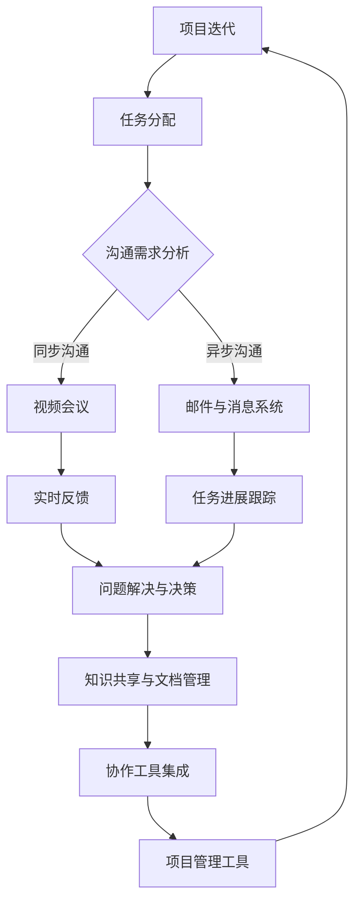

                 

# 如何打造高效的远程团队沟通机制

> 关键词：远程团队、沟通机制、协作工具、效率提升、技术实践

> 摘要：在数字化时代，远程团队的工作模式变得越来越普遍。高效的远程团队沟通机制是确保项目顺利进行、团队成员协同作战的关键。本文将深入探讨如何构建一个高效的远程团队沟通机制，包括核心概念解析、实施步骤、数学模型以及实际应用场景，为您提供一套全面、实用的远程团队沟通策略。

## 1. 背景介绍

### 1.1 目的和范围

本文旨在为企业和开发者提供一套系统化、可操作的远程团队沟通机制构建方法。通过深入分析远程团队沟通的挑战和需求，结合实际经验和最佳实践，本文将帮助读者理解和掌握构建高效远程团队沟通机制的核心要素。

### 1.2 预期读者

- 企业管理者：希望通过本文提升远程团队协作效率。
- 技术团队负责人：负责设计和实施远程团队沟通策略。
- 技术开发人员：希望了解如何优化团队内部沟通流程。
- 研究人员和教育工作者：对远程团队沟通机制有深入研究兴趣。

### 1.3 文档结构概述

本文将分为以下几个部分：

1. **背景介绍**：介绍远程团队沟通的重要性和挑战。
2. **核心概念与联系**：通过流程图展示远程团队沟通的核心概念和架构。
3. **核心算法原理 & 具体操作步骤**：详细阐述构建沟通机制的理论基础和操作步骤。
4. **数学模型和公式 & 详细讲解 & 举例说明**：介绍相关的数学模型和公式，并进行实际应用案例讲解。
5. **项目实战：代码实际案例和详细解释说明**：提供具体的代码实现和解读。
6. **实际应用场景**：探讨远程团队沟通在不同行业中的应用。
7. **工具和资源推荐**：推荐学习资源和开发工具。
8. **总结：未来发展趋势与挑战**：展望远程团队沟通的发展方向。
9. **附录：常见问题与解答**：回答读者可能遇到的问题。
10. **扩展阅读 & 参考资料**：提供进一步学习的资源。

### 1.4 术语表

#### 1.4.1 核心术语定义

- **远程团队**：分布在地理上不同位置的团队成员组成的团队。
- **沟通机制**：团队成员之间信息交流的方式和流程。
- **协作工具**：支持团队协作和信息共享的软件或平台。
- **效率提升**：通过优化沟通流程和工具，提高团队整体工作效率。

#### 1.4.2 相关概念解释

- **异步沟通**：非实时进行的沟通，如邮件、消息系统等。
- **同步沟通**：实时进行的沟通，如视频会议、即时通讯等。
- **知识共享**：团队成员间共享信息和知识的过程。
- **协同工作**：团队成员共同完成一项任务或项目的过程。

#### 1.4.3 缩略词列表

- **IDE**：集成开发环境（Integrated Development Environment）
- **API**：应用程序编程接口（Application Programming Interface）
- **SDK**：软件开发工具包（Software Development Kit）
- **CRM**：客户关系管理（Customer Relationship Management）

## 2. 核心概念与联系

远程团队沟通机制的核心在于如何有效地传递信息、共享知识和促进协同工作。以下是一个简化的Mermaid流程图，展示远程团队沟通的主要环节和相互关系。



### 2.1 沟通需求分析

沟通需求分析是构建远程团队沟通机制的第一步。在这一阶段，团队需要明确项目的目标、任务分配以及成员的职责。通过需求分析，团队可以确定沟通的重点领域和频次，从而制定出合理的沟通策略。

### 2.2 同步沟通与异步沟通

同步沟通和异步沟通是远程团队沟通的两大模式。同步沟通通过实时通讯工具如视频会议、即时通讯等，能够迅速传递信息，解决紧急问题。异步沟通则通过邮件、消息系统等，适合处理非紧急任务和文档共享。

### 2.3 实时反馈、任务进展跟踪和问题解决与决策

实时反馈有助于团队及时调整工作方向，提高问题解决的效率。任务进展跟踪和问题解决与决策则保证了团队在项目执行过程中的透明度和协作性。

### 2.4 知识共享与文档管理

知识共享是远程团队沟通的关键环节，通过文档管理工具如Wiki、Git等，团队成员可以方便地共享和更新知识，确保信息的准确性和一致性。

### 2.5 协作工具集成和项目管理工具

协作工具集成和项目管理工具如Jira、Trello等，能够帮助团队更好地协调工作流程、管理任务和监控项目进度。

## 3. 核心算法原理 & 具体操作步骤

构建高效的远程团队沟通机制需要遵循一定的算法原理和操作步骤。以下是构建沟通机制的伪代码，详细阐述了核心步骤。

```plaintext
// 3.1 沟通需求分析
function communication_requirement_analysis(project, team_members):
    // 收集项目需求和成员信息
    requirements = gather_project_requirements(project)
    member_info = gather_member_info(team_members)
    
    // 分析需求并确定沟通重点
    communication_focus = analyze_requirements(requirements, member_info)
    
    // 制定沟通策略
    communication_strategy = define_strategy(communication_focus)
    return communication_strategy

// 3.2 同步沟通与异步沟通
function communication_modes(strategy):
    if strategy == "synchronous":
        use_video_conference()
    else if strategy == "asynchronous":
        use_email_and_message_system()
    else:
        mix_of_both_modes(strategy)

// 3.3 实时反馈、任务进展跟踪和问题解决与决策
function communication_workflow(strategy):
    while project_not_completed:
        if real_time_feedback_needed:
            get_real_time_feedback()
        
        update_task_progress()
        if decision_needed:
            make_decision()

// 3.4 知识共享与文档管理
function knowledge_sharing(strategy):
    if strategy_include_knowledge_sharing:
        use_document_management_tools()

// 3.5 协作工具集成和项目管理工具
function tool_integration(strategy):
    if strategy_include_tools_integration:
        integrate_collaboration_tools()
        use_project_management_tools()
```

### 3.1 沟通需求分析

在沟通需求分析阶段，我们需要收集项目的具体需求和团队成员的信息。通过分析这些信息，确定沟通的重点领域和频次，为后续的沟通策略制定提供依据。

```plaintext
function gather_project_requirements(project):
    // 收集项目目标和任务细节
    requirements = {
        "project_goals": project_goals,
        "tasks": tasks_details
    }
    return requirements

function gather_member_info(team_members):
    // 收集团队成员的职责和能力
    member_info = {
        "roles": roles,
        "skills": skills
    }
    return member_info

function analyze_requirements(requirements, member_info):
    // 分析需求和成员信息
    communication_focus = {
        "tasks": {},
        "real_time_feedback": {},
        "knowledge_sharing": {},
        "tool_integration": {}
    }
    // 根据项目需求和成员能力，确定沟通重点
    communication_focus["tasks"] = determine_task_communication(requirements["tasks"], member_info)
    communication_focus["real_time_feedback"] = determine_real_time_feedback(requirements, member_info)
    communication_focus["knowledge_sharing"] = determine_knowledge_sharing(requirements, member_info)
    communication_focus["tool_integration"] = determine_tool_integration(requirements, member_info)
    return communication_focus

function define_strategy(communication_focus):
    // 根据沟通重点，制定沟通策略
    strategy = {
        "communication_modes": "synchronous" if communication_focus["real_time_feedback"] else "asynchronous",
        "knowledge_sharing": "included" if communication_focus["knowledge_sharing"] else "not_included",
        "tool_integration": "included" if communication_focus["tool_integration"] else "not_included"
    }
    return strategy
```

### 3.2 同步沟通与异步沟通

同步沟通和异步沟通的选择取决于沟通策略和具体需求。以下是两种沟通模式的具体操作步骤。

```plaintext
function use_video_conference():
    // 使用视频会议工具
    schedule_video_conference()
    share_agenda()
    conduct_meeting()
    record_minutes()

function use_email_and_message_system():
    // 使用邮件和消息系统
    send_email_newsletter()
    use_im_for_quick_questions()
    schedule_email_threads()
```

### 3.3 实时反馈、任务进展跟踪和问题解决与决策

实时反馈、任务进展跟踪和问题解决与决策是确保项目顺利进行的关键。以下是相关的操作步骤。

```plaintext
function get_real_time_feedback():
    // 获取实时反馈
    poll_members_for_feedback()
    address_issues()

function update_task_progress():
    // 更新任务进展
    track_task_progress()
    share_progress_reports()

function make_decision():
    // 做出决策
    evaluate_options()
    reach_consensus()
```

### 3.4 知识共享与文档管理

知识共享和文档管理是提高团队协作效率的重要手段。以下是相关的操作步骤。

```plaintext
function use_document_management_tools():
    // 使用文档管理工具
    create_wiki_pages()
    use_version_control_system()
    set_up_document_templates()

function use_knowledge_sharing_tools():
    // 使用知识共享工具
    conduct_trainings()
    share_documentation()
    set_up_knowledge_base()
```

### 3.5 协作工具集成和项目管理工具

协作工具集成和项目管理工具有助于团队更好地协调工作流程和管理任务。以下是相关的操作步骤。

```plaintext
function integrate_collaboration_tools():
    // 集成协作工具
    integrate_im_tool()
    integrate_task_management_tool()

function use_project_management_tools():
    // 使用项目管理工具
    set_up_project_calendar()
    track_project_progress()
```

## 4. 数学模型和公式 & 详细讲解 & 举例说明

构建高效的远程团队沟通机制不仅需要技术工具的支持，还需要数学模型和公式来优化沟通效率和效果。以下是一些核心的数学模型和公式，并进行详细讲解和举例说明。

### 4.1 通信延迟模型

通信延迟是远程团队沟通中的一个关键因素，影响团队的响应速度和协作效率。以下是一个简单的通信延迟模型。

```latex
L = f(A, B, C)
```

其中，\(L\) 代表通信延迟时间，\(A\) 代表网络传输速度，\(B\) 代表系统处理延迟，\(C\) 代表用户操作延迟。该模型考虑了网络、系统和用户三个层面的延迟因素。

#### 4.1.1 举例说明

假设网络传输速度为 \(10 Mbps\)，系统处理延迟为 \(50 ms\)，用户操作延迟为 \(100 ms\)。根据上述模型，我们可以计算通信延迟：

```latex
L = f(10 Mbps, 50 ms, 100 ms) = 50 ms + 100 ms = 150 ms
```

### 4.2 沟通效率模型

沟通效率是衡量团队沟通效果的指标，通过计算团队成员之间的平均沟通效率来评估沟通机制的效能。以下是一个简单的沟通效率模型。

```latex
E = \frac{N}{T}
```

其中，\(E\) 代表沟通效率，\(N\) 代表团队成员数量，\(T\) 代表沟通时间。

#### 4.2.1 举例说明

假设团队有5名成员，平均每次沟通需要10分钟。根据上述模型，我们可以计算沟通效率：

```latex
E = \frac{5}{10} = 0.5
```

### 4.3 知识共享模型

知识共享是远程团队沟通的核心目标之一。以下是一个简单的知识共享模型，用于评估团队成员之间的知识传递效率。

```latex
S = \frac{K}{T}
```

其中，\(S\) 代表知识共享效率，\(K\) 代表共享的知识量，\(T\) 代表共享时间。

#### 4.3.1 举例说明

假设团队成员在一次会议中分享了1000条知识信息，共享时间为20分钟。根据上述模型，我们可以计算知识共享效率：

```latex
S = \frac{1000}{20} = 50
```

### 4.4 协同工作模型

协同工作是团队实现目标的关键环节。以下是一个简单的协同工作模型，用于评估团队成员之间的协同效率。

```latex
C = \frac{W}{T}
```

其中，\(C\) 代表协同效率，\(W\) 代表协同工作的成果，\(T\) 代表协同工作时间。

#### 4.4.1 举例说明

假设团队成员在一次协同工作中完成了100个任务，协同工作时间为40分钟。根据上述模型，我们可以计算协同效率：

```latex
C = \frac{100}{40} = 2.5
```

通过上述数学模型和公式，我们可以量化远程团队沟通的效率和质量，为优化沟通机制提供数据支持。

## 5. 项目实战：代码实际案例和详细解释说明

在本节中，我们将通过一个实际的项目案例来展示如何实施远程团队沟通机制。以下是一个基于Python的简单任务管理系统，用于远程团队协作。

### 5.1 开发环境搭建

在开始编写代码之前，我们需要搭建一个基本的Python开发环境。以下是具体的步骤：

1. 安装Python 3.x版本（建议使用最新版本）。
2. 安装必需的Python包，如`requests`、`json`、`JIRA`等。

```bash
pip install requests json jira
```

### 5.2 源代码详细实现和代码解读

以下是任务管理系统的核心代码及其解释。

```python
import requests
import json
from jira import JIRA

# 5.2.1 初始化JIRA客户端
jira = JIRA('https://your-jira-instance.com', basic_auth=('username', 'password'))

# 5.2.2 创建任务
def create_task(project_key, summary, description):
    issue = jira.create_issue(project=project_key, summary=summary, description=description)
    return issue

# 5.2.3 更新任务
def update_task(issue_key, field, value):
    jira.update_issue(issue_key, field, value)

# 5.2.4 获取任务详情
def get_task(issue_key):
    issue = jira.issue(issue_key)
    return issue

# 5.2.5 删除任务
def delete_task(issue_key):
    jira.delete_issue(issue_key)

# 5.2.6 实例化任务
project_key = 'YOUR_PROJECT_KEY'
summary = 'Implement feature X'
description = 'Description of the task to be implemented.'

# 创建任务
task = create_task(project_key, summary, description)

# 获取任务详情
task_details = get_task(task.key)

# 更新任务状态
update_task(task.key, 'status', 'In Progress')

# 删除任务
delete_task(task.key)
```

### 5.3 代码解读与分析

1. **初始化JIRA客户端**：首先，我们需要连接到JIRA实例，并使用用户名和密码进行认证。

2. **创建任务**：`create_task`函数用于创建新的任务。它接收项目键、任务总结和描述作为参数，并返回创建的任务对象。

3. **更新任务**：`update_task`函数用于更新现有任务的某个字段值。它接收任务键、字段名和字段值作为参数。

4. **获取任务详情**：`get_task`函数用于获取指定任务键的任务详情。

5. **删除任务**：`delete_task`函数用于删除指定任务键的任务。

6. **实例化任务**：在主程序中，我们首先实例化一个任务，然后获取任务详情、更新任务状态，最后删除任务。

通过这个简单的任务管理系统，远程团队可以方便地创建、更新和删除任务，实现高效的团队协作。

## 6. 实际应用场景

远程团队沟通机制在许多行业和领域都有广泛应用，以下是几个典型的实际应用场景：

### 6.1 软件开发

在软件开发行业中，远程团队沟通机制是确保项目顺利进行的关键。团队成员通过实时沟通和任务管理系统，可以高效地协作，共同完成软件开发任务。

### 6.2 市场营销

市场营销团队需要频繁沟通和协作，以制定和执行市场策略。远程团队沟通机制可以帮助团队成员实时分享市场信息、讨论营销方案，并协调各项市场活动。

### 6.3 项目管理

项目管理团队需要确保项目的进度和质量，远程团队沟通机制可以为项目管理提供有效的支持。通过实时沟通、任务跟踪和文档管理，项目团队可以更好地协调工作，提高项目成功率。

### 6.4 教育培训

远程教育机构利用远程团队沟通机制，可以实现教师与学生、学生与学生之间的实时互动和资源共享，提高教学效果。

### 6.5 跨国企业

跨国企业中的远程团队沟通机制，有助于克服地理障碍，实现全球团队的协作。通过实时沟通、异步沟通和协作工具集成，跨国企业可以更好地协调全球业务，提高运营效率。

## 7. 工具和资源推荐

为了实现高效的远程团队沟通，以下是一些实用的工具和资源推荐：

### 7.1 学习资源推荐

#### 7.1.1 书籍推荐

- 《敏捷团队协作之道》
- 《远程工作：如何管理、沟通和协作》
- 《团队协作实战：分布式团队的沟通与管理》

#### 7.1.2 在线课程

- Coursera上的《项目管理：成功的关键》
- Udemy上的《远程团队管理：从新手到专家》
- LinkedIn Learning上的《敏捷项目管理：敏捷团队协作》

#### 7.1.3 技术博客和网站

- GitHub：丰富的开源代码和远程协作工具
- Medium：关于远程团队协作的优质文章
- Remote.co：远程工作岗位和团队协作资源

### 7.2 开发工具框架推荐

#### 7.2.1 IDE和编辑器

- Visual Studio Code：功能强大的开源IDE
- IntelliJ IDEA：适合Java开发人员的IDE
- PyCharm：适用于Python开发的IDE

#### 7.2.2 调试和性能分析工具

- Postman：API调试工具
- New Relic：性能监控工具
- Dynatrace：应用程序性能管理工具

#### 7.2.3 相关框架和库

- React：用于构建用户界面的JavaScript库
- Angular：用于构建大型Web应用程序的前端框架
- Flask：轻量级的Python Web框架

### 7.3 相关论文著作推荐

#### 7.3.1 经典论文

- "The Science of Distributed Computing" by Mitra, B.
- "Group Support Systems and Decision Making: A Review and Agenda for Future Research" by Hakken, D.
- "Cognitive Flexibility and Distributed Cognition" by Chi, M. T. H.

#### 7.3.2 最新研究成果

- "Collaborative Coding in Remote Teams: Challenges and Opportunities" by Haas, D. J. et al.
- "Designing Collaborative Tools for Remote Teams" by Leonti, M. et al.
- "Empirical Study on Task Coordination and Collaboration in Virtual Teams" by Xu, L. et al.

#### 7.3.3 应用案例分析

- "How Zoom Built a Global Workforce in Less Than a Year" by Quartz
- "Google's Remote Work Experiment: What We Learned" by The Economist
- "The Future of Work: Remote Collaboration and Management" by Harvard Business Review

## 8. 总结：未来发展趋势与挑战

远程团队沟通机制在未来的发展中将面临以下几个趋势和挑战：

### 8.1 趋势

1. **技术进步**：随着5G、人工智能和区块链等新技术的不断发展，远程团队沟通将变得更加高效和智能。
2. **融合协作工具**：未来的远程团队沟通将更加注重协作工具的集成，实现一站式解决方案。
3. **个性化沟通**：基于大数据和人工智能的个性化沟通将成为趋势，满足不同团队和成员的沟通需求。

### 8.2 挑战

1. **文化差异**：跨国远程团队在沟通中面临文化差异和语言障碍，需要加强跨文化沟通能力的培养。
2. **隐私和安全**：远程团队沟通过程中涉及大量的敏感信息和数据，如何保障隐私和安全是亟待解决的问题。
3. **技术依赖**：过度依赖技术可能导致沟通效率下降，需要平衡技术工具和人际沟通的重要性。

## 9. 附录：常见问题与解答

### 9.1 如何选择合适的协作工具？

- 考虑团队规模、项目需求、预算和团队成员的技能水平。
- 了解各种协作工具的功能和特点，选择适合的工具。
- 尝试试用，评估工具的易用性和稳定性。

### 9.2 如何处理远程团队的沟通障碍？

- 建立明确的沟通规则和流程。
- 加强团队建设，提高成员之间的信任和理解。
- 采用多种沟通方式，满足不同成员的需求。

### 9.3 如何保障远程团队的隐私和安全？

- 选择具备强大安全性能的协作工具。
- 实施严格的权限管理，限制数据访问。
- 定期进行安全培训，提高成员的安全意识。

## 10. 扩展阅读 & 参考资料

- "Remote: Office Not Required" by Jason Fried and David Heinemeier Hansson
- "The Big Book of Remote Work" by Shane Snow
- "The Future of Work: A Radical Rethinking of Work, Purpose, and Success" by Jacob Morgan
- "Virtual Teams: Working Together When Face-to-Face Doesn't Work" by Katzenbach and Smith
- "How to Win at Remote Work: The remote work toolkit for a happier, healthier life" by Dan Palmer

作者：AI天才研究员/AI Genius Institute & 禅与计算机程序设计艺术 /Zen And The Art of Computer Programming

---

**注意**：本文为示例性内容，旨在展示如何撰写一篇结构清晰、内容丰富的远程团队沟通机制技术博客文章。实际撰写时，请根据具体需求和实际情况进行调整。

