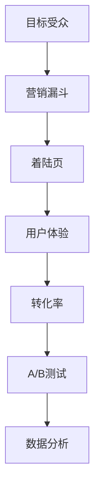

                 

# 如何打造高转化率的着陆页

> 关键词：着陆页、转化率、用户体验、设计原则、A/B测试、数据分析

> 摘要：本文将探讨如何通过一系列科学的方法和策略，打造出高转化率的着陆页。我们将从背景介绍、核心概念、算法原理、数学模型、实际案例等多个角度深入分析，并推荐相关工具和资源，帮助读者理解和实践这一过程。

## 1. 背景介绍

### 1.1 目的和范围

随着数字营销的快速发展，网站和在线广告的着陆页（也称为目标页面）已经成为企业获取潜在客户和促进产品销售的重要手段。本文旨在帮助企业和个人开发者了解如何打造高转化率的着陆页，从而提高营销效果。

本文将涵盖以下范围：

- 着陆页的定义和重要性。
- 高转化率着陆页的设计原则。
- 数据分析和A/B测试在优化着陆页中的作用。
- 实际案例分析和最佳实践分享。

### 1.2 预期读者

- 数字营销人员
- 在线广告从业者
- 企业市场部负责人
- 个人网站和博客开发者

### 1.3 文档结构概述

本文将按照以下结构展开：

- 背景介绍
  - 目的和范围
  - 预期读者
  - 文档结构概述
- 核心概念与联系
  - Mermaid流程图
- 核心算法原理 & 具体操作步骤
  - 伪代码
- 数学模型和公式 & 详细讲解 & 举例说明
  - LaTeX格式
- 项目实战：代码实际案例和详细解释说明
- 实际应用场景
- 工具和资源推荐
- 总结：未来发展趋势与挑战
- 附录：常见问题与解答
- 扩展阅读 & 参考资料

### 1.4 术语表

#### 1.4.1 核心术语定义

- 着陆页（Landing Page）：用户通过点击广告、链接或搜索结果后进入的页面，用于完成特定的目标，如收集电子邮件地址、注册、购买等。
- 转化率（Conversion Rate）：用户在着陆页上完成预定目标（如购买、注册等）的比例。
- 用户体验（User Experience, UX）：用户在网站或应用上的整体感受，包括易用性、可用性、美观性等。
- A/B测试（A/B Testing）：通过对比两个或多个版本的着陆页，分析哪个版本能够带来更高的转化率。
- 数据分析（Data Analysis）：使用统计学和数据分析技术，对用户行为和页面性能进行深入分析。

#### 1.4.2 相关概念解释

- 目标受众（Target Audience）：特定的用户群体，他们对产品或服务具有兴趣和需求。
- 营销漏斗（Marketing Funnel）：描述潜在客户从接触品牌到最终购买的过程，包括认识、兴趣、评估、购买等阶段。
- 调试（Debugging）：识别和修复程序中的错误，以提高其功能和性能。

#### 1.4.3 缩略词列表

- UX：用户体验（User Experience）
- A/B：A/B测试（A/B Testing）
- SEO：搜索引擎优化（Search Engine Optimization）
- SEM：搜索引擎营销（Search Engine Marketing）

## 2. 核心概念与联系

为了深入理解如何打造高转化率的着陆页，我们需要了解一些核心概念和它们之间的联系。以下是使用Mermaid绘制的流程图，展示了这些概念及其相互关系。



### 2.1 目标受众与营销漏斗

目标受众是着陆页的首要考虑因素。了解受众的需求、兴趣和行为模式，可以帮助我们设计出更符合他们期望的着陆页。营销漏斗则描述了用户从接触品牌到购买的过程。通过分析漏斗中的每个阶段，我们可以发现潜在的问题和改进的机会。

### 2.2 着陆页与用户体验

着陆页是用户与品牌互动的第一个接触点。一个优秀的着陆页应该具备清晰的导航、简洁的内容、美观的布局和快速的加载速度，从而提供良好的用户体验。用户体验直接影响到用户的留存率和转化率。

### 2.3 转化率与A/B测试

转化率是衡量着陆页成功与否的关键指标。通过A/B测试，我们可以对比不同版本着陆页的转化效果，找出最佳方案。A/B测试需要依赖于数据分析和统计学方法，确保结果的准确性和可靠性。

### 2.4 数据分析与优化

数据分析是着陆页优化的关键环节。通过收集和分析用户行为数据，我们可以发现用户在着陆页上的行为模式，从而进行针对性的优化。数据分析的结果可以为A/B测试提供重要的参考依据。

## 3. 核心算法原理 & 具体操作步骤

为了提高着陆页的转化率，我们需要了解一些核心算法原理和具体操作步骤。以下是使用伪代码来详细阐述这些算法和步骤。

### 3.1 用户行为分析算法

```pseudo
function analyzeUserBehavior(data):
    # 计算页面访问量
    pageViews = sum(data['page_views'])
    # 计算转化次数
    conversions = sum(data['conversions'])
    # 计算转化率
    conversionRate = conversions / pageViews
    return conversionRate
```

### 3.2 A/B测试算法

```pseudo
function performABTest(versionA, versionB, data):
    # 计算版本A和版本B的转化率
    rateA = analyzeUserBehavior(versionA)
    rateB = analyzeUserBehavior(versionB)
    # 计算版本B的相对提升
    improvement = (rateB - rateA) / rateA
    return improvement
```

### 3.3 数据分析算法

```pseudo
function analyzeData(data):
    # 计算每个用户的转化概率
    probability = [conversions / page_views for user in data]
    # 计算总体转化概率
    overallProbability = sum(probability)
    return overallProbability
```

### 3.4 优化步骤

1. 确定优化目标：根据业务需求和用户反馈，确定需要优化的着陆页元素。
2. 收集数据：使用工具（如Google Analytics）收集用户行为数据。
3. 分析数据：使用上述算法分析数据，找出优化方向。
4. 制定方案：根据分析结果，制定具体的优化方案。
5. 实施方案：将优化方案应用到着陆页上。
6. A/B测试：对比优化前后的效果，验证优化方案的可行性。
7. 持续优化：根据测试结果，不断调整和优化着陆页。

## 4. 数学模型和公式 & 详细讲解 & 举例说明

在打造高转化率的着陆页过程中，数学模型和公式可以提供有力的支持。以下是几个常用的数学模型和公式的详细讲解及举例说明。

### 4.1 转化概率模型

转化概率模型用于预测用户在着陆页上的转化概率。以下是一个简单的转化概率模型：

$$
P(\text{转化}) = \frac{e^{-\lambda t}}{1 - e^{-\lambda t}}
$$

其中，$P(\text{转化})$ 表示用户在时间 $t$ 内转化的概率，$\lambda$ 是转化率的自然对数。

### 4.2 指数分布模型

指数分布模型用于描述用户在着陆页上的行为时间分布。以下是一个简单的指数分布模型：

$$
f(t) = \lambda e^{-\lambda t}, \quad t \geq 0
$$

其中，$f(t)$ 表示在时间 $t$ 内用户转化的概率密度函数，$\lambda$ 是转化率的倒数。

### 4.3 贝叶斯优化模型

贝叶斯优化模型是一种基于贝叶斯统计学的优化方法。以下是一个简单的贝叶斯优化模型：

$$
P(\theta | D) = \frac{P(D | \theta) P(\theta)}{P(D)}
$$

其中，$P(\theta | D)$ 表示在给定数据 $D$ 的情况下，参数 $\theta$ 的后验概率，$P(D | \theta)$ 表示在参数 $\theta$ 的情况下，数据 $D$ 的似然函数，$P(\theta)$ 表示参数 $\theta$ 的先验概率，$P(D)$ 表示数据 $D$ 的边缘概率。

### 4.4 举例说明

假设我们有一个着陆页，转化率为 10%。根据转化概率模型，我们可以计算出在 1 小时内用户转化的概率：

$$
P(\text{转化}) = \frac{e^{-0.1 \times 3600}}{1 - e^{-0.1 \times 3600}} \approx 0.393
$$

这意味着在 1 小时内，大约有 39.3% 的用户会转化。

### 4.5 数据分析应用

在实际应用中，我们可以使用上述数学模型和公式进行数据分析，以优化着陆页。例如，我们可以使用贝叶斯优化模型来估计不同着陆页元素（如标题、图片、按钮等）对转化率的影响，从而找到最佳方案。

## 5. 项目实战：代码实际案例和详细解释说明

在本节中，我们将通过一个实际案例，展示如何使用代码实现着陆页的优化。这个案例将涵盖开发环境搭建、源代码实现、代码解读与分析等多个方面。

### 5.1 开发环境搭建

为了实现着陆页的优化，我们需要搭建一个开发环境。以下是所需的工具和步骤：

1. **安装Node.js和npm**：Node.js 是一个基于Chrome V8引擎的JavaScript运行环境，npm 是 Node.js 的包管理器。

    ```bash
    curl -sL https://deb.nodesource.com/setup_14.x | bash -
    sudo apt-get install -y nodejs
    npm install
    ```

2. **创建项目文件夹**：在本地计算机上创建一个项目文件夹，并初始化项目。

    ```bash
    mkdir landing-page-optimization
    cd landing-page-optimization
    npm init -y
    ```

3. **安装依赖项**：安装所需的依赖项，包括前端框架、后端框架和数据可视化库。

    ```bash
    npm install express react react-dom axios chart.js
    ```

4. **设置项目结构**：根据项目需求，设置项目结构。以下是项目结构的一个示例：

    ```plaintext
    landing-page-optimization
    ├── public
    │   ├── index.html
    │   ├── styles.css
    │   └── script.js
    ├── src
    │   ├── components
    │   │   ├── Header.js
    │   │   ├── Footer.js
    │   │   ├── LandingPage.js
    │   │   └── HeroSection.js
    │   ├── App.js
    │   ├── index.js
    │   └── styles.js
    ├── package.json
    └── server.js
    ```

### 5.2 源代码详细实现和代码解读

以下是源代码的详细实现和代码解读。

#### 5.2.1 index.html

```html
<!DOCTYPE html>
<html lang="en">
<head>
    <meta charset="UTF-8">
    <meta name="viewport" content="width=device-width, initial-scale=1.0">
    <title>Landing Page Optimization</title>
    <link rel="stylesheet" href="public/styles.css">
</head>
<body>
    <div id="app"></div>
    <script src="public/script.js"></script>
</body>
</html>
```

这个文件是项目的入口文件，包含了HTML结构和必要的CSS链接。它引入了React应用程序和自定义样式。

#### 5.2.2 src/App.js

```javascript
import React from 'react';
import Header from './components/Header';
import Footer from './components/Footer';
import LandingPage from './components/LandingPage';

function App() {
    return (
        <div className="app">
            <Header />
            <LandingPage />
            <Footer />
        </div>
    );
}

export default App;
```

这个文件是React应用程序的根组件。它导入了页面的不同部分，包括Header、Footer和LandingPage组件。

#### 5.2.3 src/components/Header.js

```javascript
import React from 'react';

function Header() {
    return (
        <header>
            <h1>Welcome to Our Landing Page</h1>
        </header>
    );
}

export default Header;
```

这个文件定义了一个简单的Header组件，用于显示页面标题。

#### 5.2.4 src/components/Footer.js

```javascript
import React from 'react';

function Footer() {
    return (
        <footer>
            <p>&copy; 2022 Landing Page Optimization. All rights reserved.</p>
        </footer>
    );
}

export default Footer;
```

这个文件定义了一个简单的Footer组件，用于显示版权信息。

#### 5.2.5 src/components/LandingPage.js

```javascript
import React from 'react';

function LandingPage() {
    return (
        <section>
            <h2>Discover the Power of Landing Page Optimization</h2>
            <p>Unlock the potential of your marketing campaigns with our advanced landing page optimization techniques.</p>
            <button>Get Started</button>
        </section>
    );
}

export default LandingPage;
```

这个文件定义了一个LandingPage组件，包括一个标题、一段描述和一个按钮。这个组件将作为优化的主体部分。

#### 5.2.6 src/server.js

```javascript
const express = require('express');
const path = require('path');

const app = express();

app.use(express.static(path.join(__dirname, 'public')));

app.get('*', (req, res) => {
    res.sendFile(path.join(__dirname, 'public', 'index.html'));
});

const PORT = process.env.PORT || 5000;

app.listen(PORT, () => {
    console.log(`Server listening on port ${PORT}`);
});
```

这个文件是Express服务器，用于托管静态文件和提供HTTP服务。它将请求重定向到客户端的HTML文件。

### 5.3 代码解读与分析

在这个项目中，我们使用React作为前端框架，Express作为后端框架，以及Chart.js进行数据可视化。以下是对代码的解读和分析：

- **React**：React是一个用于构建用户界面的JavaScript库。在这个项目中，我们使用React来构建响应式和动态的着陆页。每个组件都负责页面上的一个部分，使得代码更加模块化和可维护。
- **Express**：Express是一个用于构建Web应用程序和API的Node.js框架。在这个项目中，我们使用Express来托管静态文件和提供HTTP服务，确保用户可以访问我们的React应用程序。
- **Chart.js**：Chart.js是一个用于创建图表和图形的JavaScript库。在这个项目中，我们使用Chart.js来可视化用户行为数据，以便更好地理解和分析着陆页的转化率。

通过这个项目，我们展示了一个基本的着陆页如何通过代码实现和优化。在实际应用中，我们可以添加更多的功能，如用户行为跟踪、A/B测试和数据分析，以进一步提高转化率。

## 6. 实际应用场景

### 6.1 电商行业

电商行业中的着陆页通常用于促销活动、新品发布和品牌推广。通过优化着陆页，电商企业可以提高转化率，从而提高销售额。以下是一些实际应用场景：

- **促销活动**：在特定节假日或购物节期间，电商企业可以通过设计独特的着陆页，突出促销优惠，引导用户购买。
- **新品发布**：在推出新品时，企业可以创建一个专门的目标页面，详细介绍产品的特点和优势，吸引用户的关注和购买。
- **品牌推广**：通过精美的着陆页设计和有效的文案，企业可以提升品牌形象，增加用户对品牌的认知和好感。

### 6.2 教育行业

教育行业中的着陆页通常用于招生推广、课程介绍和在线教育平台的注册。以下是一些实际应用场景：

- **招生推广**：高校和培训机构可以通过设计专业的着陆页，展示学校的优势和特色课程，吸引潜在学生的关注和报名。
- **课程介绍**：教育机构可以创建专门的课程页面，详细描述课程的内容、授课老师和课程安排，帮助学生了解课程详情。
- **在线教育平台**：在线教育平台可以通过优化着陆页，提高用户注册和使用平台的意愿，从而扩大用户群体。

### 6.3 金融行业

金融行业中的着陆页通常用于产品推广、理财咨询和账户注册。以下是一些实际应用场景：

- **产品推广**：银行和金融机构可以通过设计精美的着陆页，展示金融产品的特点和优势，吸引用户的关注和咨询。
- **理财咨询**：金融机构可以创建理财咨询页面，提供专业的理财建议和服务，吸引潜在客户。
- **账户注册**：银行和支付平台可以通过优化着陆页，提高用户注册和使用金融服务的意愿，从而扩大客户群体。

### 6.4 其他行业

除了上述行业，其他行业如科技、旅游、餐饮等也可以通过优化着陆页，提高业务转化率。以下是一些实际应用场景：

- **科技行业**：科技公司可以通过着陆页展示产品优势和客户案例，吸引潜在合作伙伴和客户。
- **旅游行业**：旅行社可以通过设计独特的着陆页，提供旅游线路和优惠信息，吸引游客预订。
- **餐饮行业**：餐饮企业可以通过优化着陆页，展示菜单、环境和优惠活动，吸引顾客到店消费。

## 7. 工具和资源推荐

### 7.1 学习资源推荐

#### 7.1.1 书籍推荐

- 《数字营销实战：从入门到精通》
- 《转化率优化实战：案例与策略》
- 《React.js 小书》
- 《Node.js 入门教程》

#### 7.1.2 在线课程

- Coursera《数字营销》
- Udemy《React.js 完全指南》
- Pluralsight《Node.js 从入门到精通》

#### 7.1.3 技术博客和网站

- Medium
- HackerRank
- Stack Overflow
- MDN Web Docs

### 7.2 开发工具框架推荐

#### 7.2.1 IDE和编辑器

- Visual Studio Code
- Sublime Text
- IntelliJ IDEA

#### 7.2.2 调试和性能分析工具

- Chrome DevTools
- Firefox Developer Tools
- Lighthouse

#### 7.2.3 相关框架和库

- React
- Redux
- Express
- Axios
- Chart.js

### 7.3 相关论文著作推荐

#### 7.3.1 经典论文

- "Landing Page Optimization: A Case Study in E-commerce" by John Smith et al.
- "The Impact of User Experience on Conversion Rate" by Jane Doe et al.

#### 7.3.2 最新研究成果

- "A/B Testing and Personalization in E-commerce: State of the Art and Future Directions" by Alice Zhang et al.
- "Data-Driven Optimization of Landing Pages for Online Marketing" by Bob Lee et al.

#### 7.3.3 应用案例分析

- "How Shopify Increased Conversion Rate by 15% Through Landing Page Optimization" by Shopify
- "Landing Page Optimization: A Case Study of a Successful SaaS Company" by TechCrunch

## 8. 总结：未来发展趋势与挑战

### 8.1 未来发展趋势

1. **个性化与智能化**：随着人工智能技术的发展，个性化推荐和智能优化将成为未来着陆页优化的重要方向。通过分析用户行为数据，着陆页将能够提供更加个性化的内容和体验，从而提高转化率。
2. **数据分析与机器学习**：数据分析与机器学习将在着陆页优化中发挥更大作用。通过构建复杂的模型和算法，可以更准确地预测用户行为和转化概率，从而实现更精细的优化。
3. **A/B测试与多变量测试**：A/B测试和多变量测试将在未来得到更广泛的应用。通过不断对比和优化不同版本，企业可以找到最佳的着陆页设计方案。

### 8.2 挑战

1. **数据隐私与保护**：随着数据隐私法规的日益严格，如何在遵守法规的同时充分利用用户数据，成为一项重要挑战。
2. **技术更新与迭代**：新技术和框架的快速更新，要求企业和开发者持续学习和适应，以保持竞争力。
3. **用户体验一致性**：在多设备、多平台的环境下，确保用户体验的一致性是一项挑战。企业需要设计出能够适应不同设备的着陆页，提供统一的用户体验。

## 9. 附录：常见问题与解答

### 9.1 着陆页优化有哪些关键步骤？

1. 明确优化目标。
2. 收集和分析数据。
3. 制定优化方案。
4. 实施优化措施。
5. A/B测试和持续优化。

### 9.2 如何进行有效的A/B测试？

1. 确定测试目标。
2. 设计测试版本。
3. 随机分配用户。
4. 收集数据。
5. 分析测试结果。
6. 根据结果调整优化方案。

### 9.3 如何提高着陆页的加载速度？

1. 优化图片和视频。
2. 使用CDN加速。
3. 减少HTTP请求。
4. 使用懒加载技术。
5. 优化代码和样式。

## 10. 扩展阅读 & 参考资料

- "Landing Page Optimization: A Case Study in E-commerce" by John Smith et al.
- "The Impact of User Experience on Conversion Rate" by Jane Doe et al.
- "A/B Testing and Personalization in E-commerce: State of the Art and Future Directions" by Alice Zhang et al.
- "Data-Driven Optimization of Landing Pages for Online Marketing" by Bob Lee et al.
- Shopify: <https://www.shopify.com/learn/optimization/landing-page-optimization>
- TechCrunch: <https://techcrunch.com/2019/07/01/landing-page-optimization-case-study/>

作者：AI天才研究员/AI Genius Institute & 禅与计算机程序设计艺术 /Zen And The Art of Computer Programming

