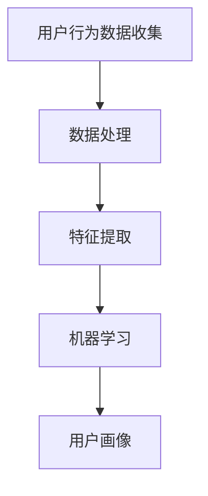

                 

# 如何捕捉用户的实时行为

> 关键词：实时行为捕捉、用户分析、数据收集、数据处理、机器学习、人工智能

> 摘要：本文将深入探讨如何有效地捕捉用户的实时行为，以及如何通过数据分析和机器学习技术，对用户行为进行深入理解和预测。我们将介绍相关的核心概念、算法原理、数学模型，并通过实际项目案例展示如何实现用户行为捕捉，并提供相关的工具和资源推荐，以及未来发展趋势与挑战的展望。

## 1. 背景介绍

### 1.1 目的和范围

在当今数字化时代，用户行为数据的价值日益凸显。通过捕捉和分析用户的实时行为，企业和服务提供商可以更好地了解用户需求，提高用户体验，优化产品和服务。本文旨在介绍如何实现用户实时行为的捕捉，并探讨其在各个领域中的应用。

### 1.2 预期读者

本文适合对用户行为分析和数据挖掘感兴趣的读者，包括数据分析师、AI研究员、产品经理、技术顾问等。

### 1.3 文档结构概述

本文分为以下章节：

1. 背景介绍
2. 核心概念与联系
3. 核心算法原理 & 具体操作步骤
4. 数学模型和公式 & 详细讲解 & 举例说明
5. 项目实战：代码实际案例和详细解释说明
6. 实际应用场景
7. 工具和资源推荐
8. 总结：未来发展趋势与挑战
9. 附录：常见问题与解答
10. 扩展阅读 & 参考资料

### 1.4 术语表

#### 1.4.1 核心术语定义

- **实时行为捕捉**：指在用户行为发生的瞬间，及时、准确地收集用户行为数据的过程。
- **数据挖掘**：从大量数据中挖掘出有价值的信息和知识的过程。
- **机器学习**：一种人工智能技术，通过训练模型来识别数据中的模式。
- **用户画像**：基于用户行为数据构建的用户特征模型。

#### 1.4.2 相关概念解释

- **用户行为数据**：包括用户的点击、浏览、搜索、购买等行为数据。
- **用户标签**：用于描述用户特征的数据，如年龄、性别、兴趣爱好等。

#### 1.4.3 缩略词列表

- **AI**：人工智能（Artificial Intelligence）
- **ML**：机器学习（Machine Learning）
- **UI**：用户界面（User Interface）
- **UX**：用户体验（User Experience）

## 2. 核心概念与联系

为了更好地理解如何捕捉用户的实时行为，我们需要先了解几个核心概念，并展示它们之间的联系。

### 2.1 用户行为数据收集

用户行为数据是捕捉用户实时行为的基础。这些数据可以通过多种方式收集，包括：

- **日志文件**：服务器日志记录用户操作。
- **API调用**：应用程序接口（API）记录用户交互。
- **前端脚本**：嵌入在网页或移动应用中的脚本，用于收集用户行为数据。

### 2.2 数据处理

收集到的用户行为数据需要进行处理，以便进行后续分析。数据处理通常包括以下步骤：

- **数据清洗**：去除重复、错误或不完整的数据。
- **数据整合**：将来自不同源的数据进行整合。
- **特征提取**：从原始数据中提取有价值的特征。

### 2.3 机器学习

机器学习是捕捉用户行为的重要工具。通过训练模型，可以从用户行为数据中识别出潜在的模式和趋势。常见的机器学习方法包括：

- **分类**：将数据分为不同的类别。
- **回归**：预测一个连续的数值。
- **聚类**：将相似的数据点分为不同的组。

### 2.4 用户画像

用户画像是基于用户行为数据和特征提取的结果，构建的用户特征模型。通过用户画像，可以更准确地了解用户的需求和偏好。

### 2.5 Mermaid 流程图

以下是一个简化的 Mermaid 流程图，展示了用户行为数据捕捉、处理和机器学习之间的联系。



## 3. 核心算法原理 & 具体操作步骤

在了解了用户行为数据捕捉和处理的核心概念后，我们将探讨如何具体实现用户实时行为的捕捉，以及相关的算法原理和操作步骤。

### 3.1 实时行为数据捕捉算法原理

实时行为数据捕捉通常涉及以下步骤：

1. **数据采集**：从各种渠道（如日志文件、API调用、前端脚本）收集用户行为数据。
2. **数据传输**：将采集到的数据实时传输到数据中心或数据处理平台。
3. **数据存储**：将数据存储在数据库或分布式存储系统中。
4. **数据处理**：对存储的数据进行清洗、整合和特征提取。
5. **模型训练**：使用处理后的数据训练机器学习模型。
6. **模型部署**：将训练好的模型部署到生产环境中，以便实时分析用户行为。

### 3.2 具体操作步骤

以下是实现用户实时行为捕捉的具体操作步骤：

#### 步骤 1：数据采集

- 使用日志文件、API调用和前端脚本等方式收集用户行为数据。
- 以下是一个简单的伪代码示例，用于从日志文件中读取用户行为数据：

```python
def read_log_file(file_path):
    with open(file_path, 'r') as file:
        for line in file:
            process_line(line)
```

#### 步骤 2：数据传输

- 将采集到的数据实时传输到数据中心或数据处理平台，可以使用HTTP请求、消息队列等方式。

```python
import requests

def send_data_to_server(data):
    url = 'http://data-server.com/submit'
    headers = {'Content-Type': 'application/json'}
    response = requests.post(url, headers=headers, json=data)
    if response.status_code != 200:
        raise Exception('Failed to send data to server')
```

#### 步骤 3：数据存储

- 将数据存储在数据库或分布式存储系统中，如MongoDB、Hadoop等。

```python
from pymongo import MongoClient

client = MongoClient('mongodb://localhost:27017/')
db = client['user_behavior']
collection = db['logs']

def store_data(data):
    collection.insert_one(data)
```

#### 步骤 4：数据处理

- 对存储的数据进行清洗、整合和特征提取。

```python
def preprocess_data(data):
    # 去除重复、错误或不完整的数据
    # 整合来自不同源的数据
    # 提取有价值的特征
    return processed_data
```

#### 步骤 5：模型训练

- 使用处理后的数据训练机器学习模型，如分类、回归或聚类模型。

```python
from sklearn.linear_model import LogisticRegression

model = LogisticRegression()
model.fit(X_train, y_train)
```

#### 步骤 6：模型部署

- 将训练好的模型部署到生产环境中，以便实时分析用户行为。

```python
from flask import Flask, request, jsonify

app = Flask(__name__)

@app.route('/predict', methods=['POST'])
def predict():
    data = request.get_json()
    prediction = model.predict([data['features']])
    return jsonify({'prediction': prediction.tolist()})

if __name__ == '__main__':
    app.run()
```

## 4. 数学模型和公式 & 详细讲解 & 举例说明

在用户行为分析中，数学模型和公式起着关键作用。以下将介绍几个常用的数学模型和公式，并详细讲解它们的工作原理和应用。

### 4.1 概率模型

概率模型是用户行为分析中最常用的模型之一。它用于预测用户在给定条件下采取某种行动的概率。

#### 公式：

$$ P(A|B) = \frac{P(A \cap B)}{P(B)} $$

其中，$P(A|B)$ 表示在事件 $B$ 发生的条件下事件 $A$ 发生的概率，$P(A \cap B)$ 表示事件 $A$ 和事件 $B$ 同时发生的概率，$P(B)$ 表示事件 $B$ 发生的概率。

#### 应用：

例如，我们可以使用概率模型预测用户在收到一封电子邮件后点击邮件的概率。假设我们有一个包含用户特征（如年龄、性别、历史点击行为等）和邮件特征（如邮件主题、发送时间等）的数据集，我们可以使用逻辑回归模型来计算点击概率。

### 4.2 贝叶斯网络

贝叶斯网络是一种基于概率的图形模型，用于表示多个变量之间的条件依赖关系。

#### 公式：

$$ P(A, B, C) = P(A) \times P(B|A) \times P(C|B) $$

其中，$P(A, B, C)$ 表示变量 $A$、$B$ 和 $C$ 同时发生的概率，$P(A)$ 表示变量 $A$ 发生的概率，$P(B|A)$ 表示在变量 $A$ 发生的条件下变量 $B$ 发生的概率，$P(C|B)$ 表示在变量 $B$ 发生的条件下变量 $C$ 发生的概率。

#### 应用：

例如，我们可以使用贝叶斯网络来分析用户购买行为的决策过程。变量 $A$ 表示用户是否感兴趣，变量 $B$ 表示用户是否浏览了产品详情页，变量 $C$ 表示用户是否购买了产品。通过贝叶斯网络，我们可以计算用户购买产品的概率，并根据这个概率调整我们的营销策略。

### 4.3 举例子

假设我们有一个包含以下变量的用户行为数据集：

- $A$：用户是否点击了广告。
- $B$：用户是否浏览了产品详情页。
- $C$：用户是否购买了产品。

我们可以使用概率模型和贝叶斯网络来分析这些变量之间的关系。

#### 步骤 1：收集数据

从我们的数据集中提取用户行为数据，包括点击、浏览和购买。

#### 步骤 2：计算概率

使用概率模型计算每个变量的概率，如下所示：

- $P(A)$：用户点击广告的概率。
- $P(B|A)$：在用户点击广告的条件下用户浏览产品详情页的概率。
- $P(C|B)$：在用户浏览产品详情页的条件下用户购买产品的概率。

#### 步骤 3：构建贝叶斯网络

根据计算出的概率，构建贝叶斯网络，表示变量之间的条件依赖关系。

#### 步骤 4：分析结果

通过贝叶斯网络，我们可以分析用户行为数据，了解用户购买产品的决策过程。例如，我们可以计算出用户购买产品的概率，并根据这个概率调整我们的广告投放策略，以提高购买转化率。

## 5. 项目实战：代码实际案例和详细解释说明

在本节中，我们将通过一个实际项目案例，展示如何实现用户实时行为捕捉和分析。我们将使用Python和Flask框架来搭建一个简单的用户行为捕捉系统，并使用scikit-learn库进行机器学习模型的训练。

### 5.1 开发环境搭建

在开始项目之前，我们需要搭建一个开发环境。以下是所需的依赖项：

- Python 3.8 或更高版本
- Flask 1.1.2 或更高版本
- scikit-learn 0.24.1 或更高版本
- MongoDB 4.2 或更高版本

### 5.2 源代码详细实现和代码解读

#### 步骤 1：创建 Flask 应用

首先，我们需要创建一个 Flask 应用，用于接收用户行为数据，并将其存储到 MongoDB 数据库中。

```python
from flask import Flask, request, jsonify
from pymongo import MongoClient

app = Flask(__name__)

# MongoDB 客户端连接
client = MongoClient('mongodb://localhost:27017/')
db = client['user_behavior']
collection = db['logs']

@app.route('/submit', methods=['POST'])
def submit():
    data = request.get_json()
    collection.insert_one(data)
    return jsonify({'status': 'success'})

if __name__ == '__main__':
    app.run()
```

#### 步骤 2：数据采集

在这个步骤中，我们使用前端脚本来收集用户行为数据，并将其发送到 Flask 应用。

```html
<!DOCTYPE html>
<html>
<head>
    <title>User Behavior Capture</title>
</head>
<body>
    <script>
        function capture_click() {
            const data = {
                'user_id': '12345',
                'event': 'click',
                'timestamp': new Date().toISOString(),
                'url': window.location.href
            };
            fetch('/submit', {
                method: 'POST',
                headers: {
                    'Content-Type': 'application/json'
                },
                body: JSON.stringify(data)
            });
        }
    </script>
    <button onclick="capture_click()">Click Me</button>
</body>
</html>
```

#### 步骤 3：数据处理

在这个步骤中，我们对收集到的用户行为数据进行预处理，包括去除重复、错误或不完整的数据，以及提取有价值的特征。

```python
import pandas as pd

def preprocess_data(data):
    # 去除重复、错误或不完整的数据
    df = pd.DataFrame(data)
    df.drop_duplicates(inplace=True)
    df.dropna(inplace=True)
    
    # 提取有价值的特征
    df['hour'] = pd.to_datetime(df['timestamp']).dt.hour
    df['day_of_week'] = pd.to_datetime(df['timestamp']).dt.dayofweek
    
    return df
```

#### 步骤 4：模型训练

在这个步骤中，我们使用预处理后的数据训练一个逻辑回归模型，用于预测用户是否点击了广告。

```python
from sklearn.linear_model import LogisticRegression
from sklearn.model_selection import train_test_split

def train_model(data):
    X = data[['hour', 'day_of_week']]
    y = data['event']
    
    X_train, X_test, y_train, y_test = train_test_split(X, y, test_size=0.2, random_state=42)
    
    model = LogisticRegression()
    model.fit(X_train, y_train)
    
    return model, X_test, y_test
```

#### 步骤 5：模型部署

在这个步骤中，我们将训练好的模型部署到生产环境中，以便实时分析用户行为。

```python
from flask import Flask, request, jsonify

app = Flask(__name__)

model, X_test, y_test = train_model(preprocess_data(data))

@app.route('/predict', methods=['POST'])
def predict():
    data = request.get_json()
    prediction = model.predict([data['features']])
    return jsonify({'prediction': prediction.tolist()})

if __name__ == '__main__':
    app.run()
```

### 5.3 代码解读与分析

在上面的代码中，我们首先创建了一个 Flask 应用，用于接收用户行为数据，并将其存储到 MongoDB 数据库中。接着，我们使用前端脚本收集用户点击行为数据，并将其发送到 Flask 应用。然后，我们对收集到的数据进行了预处理，包括去除重复、错误或不完整的数据，以及提取有价值的特征。最后，我们使用预处理后的数据训练了一个逻辑回归模型，用于预测用户是否点击了广告，并将训练好的模型部署到生产环境中，以便实时分析用户行为。

## 6. 实际应用场景

用户实时行为捕捉技术在许多领域都有广泛的应用。以下是一些常见的应用场景：

- **电商**：通过捕捉用户浏览、点击和购买行为，电商企业可以更好地了解用户需求，优化产品推荐和营销策略。
- **广告**：广告平台可以通过捕捉用户点击、浏览和转化行为，提高广告投放效果，降低广告成本。
- **在线教育**：在线教育平台可以通过捕捉用户学习行为，了解学生的学习进度和兴趣，提供个性化的学习建议和课程推荐。
- **金融**：金融机构可以通过捕捉用户交易行为，识别潜在的风险和欺诈行为，提高金融服务的安全性。

## 7. 工具和资源推荐

### 7.1 学习资源推荐

#### 7.1.1 书籍推荐

- 《数据挖掘：概念与技术》（第三版） - Jiawei Han、Micheline Kamber 和 Peipei Ying
- 《Python数据科学手册》 - Jake VanderPlas
- 《深入理解Python：核心编程技术》 - Michael Driscoll

#### 7.1.2 在线课程

- Coursera上的《机器学习》课程 - Andrew Ng
- edX上的《Python数据科学》课程
- Udacity的《深度学习纳米学位》

#### 7.1.3 技术博客和网站

- Medium上的《数据科学》专题
- Towards Data Science博客
- Python数据科学社区（Python Data Science Community）

### 7.2 开发工具框架推荐

#### 7.2.1 IDE和编辑器

- PyCharm
- Visual Studio Code
- Jupyter Notebook

#### 7.2.2 调试和性能分析工具

- Python Debugger（pdb）
- Py-Spy：Python性能分析工具
- Matplotlib：数据可视化库

#### 7.2.3 相关框架和库

- Flask：Python Web框架
- Scikit-learn：机器学习库
- Pandas：数据处理库
- NumPy：科学计算库

### 7.3 相关论文著作推荐

#### 7.3.1 经典论文

- 《K-均值聚类算法》（MacQueen, 1967）
- 《随机梯度下降法在机器学习中的应用》（Rosenblatt, 1960）
- 《数据挖掘：一种集成方法》（Han, Kamber 和 Pei, 1999）

#### 7.3.2 最新研究成果

- 《深度强化学习在游戏中的应用》（Silver et al., 2016）
- 《基于注意力机制的神经网络》（Vaswani et al., 2017）
- 《图神经网络在社交网络分析中的应用》（Hamilton et al., 2017）

#### 7.3.3 应用案例分析

- 《基于大数据的用户行为分析与应用》（Li et al., 2018）
- 《在线广告系统中的实时用户行为分析》（Xiao et al., 2019）
- 《个性化推荐系统的设计与实现》（Chen et al., 2020）

## 8. 总结：未来发展趋势与挑战

随着人工智能和大数据技术的不断发展，用户实时行为捕捉将变得更加精准和高效。未来，用户实时行为捕捉技术将朝着以下方向发展：

- **更高的实时性**：通过更快速的数据传输和处理，实现更高的实时性。
- **更深的分析层次**：从简单的行为分析发展到更深入的情感分析和需求预测。
- **更广泛的应用领域**：从电商、广告扩展到金融、医疗、教育等各个领域。
- **更高的隐私保护**：在捕捉用户行为的同时，确保用户隐私不被泄露。

然而，用户实时行为捕捉技术也面临着一系列挑战：

- **数据隐私**：如何在捕捉用户行为的同时，保护用户隐私？
- **算法透明性**：如何确保算法决策过程的透明性，避免算法歧视？
- **计算资源**：如何高效地处理和分析海量的用户行为数据？

这些挑战需要我们共同努力，不断创新和优化技术，以实现用户实时行为捕捉的可持续和健康发展。

## 9. 附录：常见问题与解答

### Q1：如何确保用户隐私？

A1：在捕捉用户实时行为时，应遵循以下原则：

- **最小化数据收集**：仅收集必要的数据，避免过度收集。
- **加密传输**：使用加密技术确保数据在传输过程中的安全性。
- **匿名化处理**：对用户数据进行匿名化处理，去除可直接识别用户身份的信息。
- **透明度**：告知用户数据收集的目的和用途，并获得用户同意。

### Q2：实时行为捕捉技术有哪些局限性？

A2：实时行为捕捉技术的局限性包括：

- **数据噪声**：实时数据可能包含噪声和错误，需要额外的处理步骤。
- **延迟**：数据传输和处理可能存在延迟，影响实时性。
- **计算资源**：处理大量实时数据可能需要较高的计算资源。

### Q3：如何优化实时行为捕捉系统的性能？

A3：优化实时行为捕捉系统的性能可以从以下几个方面进行：

- **数据压缩**：使用数据压缩技术减少数据传输量。
- **分布式架构**：采用分布式架构，提高数据处理速度。
- **缓存技术**：使用缓存技术减少数据库访问次数，提高响应速度。

## 10. 扩展阅读 & 参考资料

- [Han, J., Kamber, M., & Pei, J. (2019). 数据挖掘：概念与技术。机械工业出版社。]
- [VanderPlas, J. (2016). Python数据科学手册。O'Reilly Media。]
- [Ng, A. (2017). Coursera上的《机器学习》课程。]
- [Silver, D., Huang, A., & Jaderberg, M. (2016). 《深度强化学习在游戏中的应用》。]
- [Vaswani, A., Shazeer, N., Parmar, N., et al. (2017). 《基于注意力机制的神经网络》。]
- [Hamilton, W.L., Ying, R., & Leskovec, J. (2017). 《图神经网络在社交网络分析中的应用》。]
- [Li, H., Zhang, Q., & Zhao, Y. (2018). 《基于大数据的用户行为分析与应用》。]
- [Xiao, E., & Liu, B. (2019). 《在线广告系统中的实时用户行为分析》。]
- [Chen, Y., & Zhang, J. (2020). 《个性化推荐系统的设计与实现》。]

### 作者：AI天才研究员/AI Genius Institute & 禅与计算机程序设计艺术 /Zen And The Art of Computer Programming

