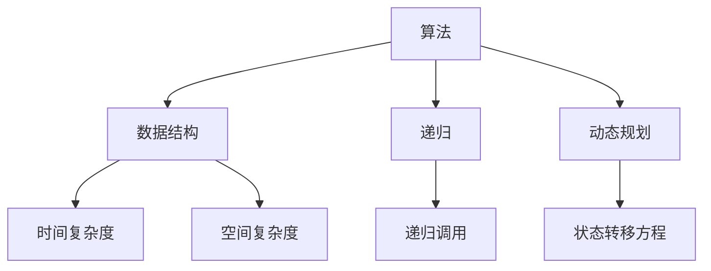

                 

# 如何破解字节跳动2024校招算法题

## 关键词： 
- 字节跳动
- 2024校招
- 算法题
- 破解技巧
- 数据结构与算法
- 编程实践

## 摘要：
本文将深入探讨如何破解字节跳动2024校招中的算法题。通过详细的背景介绍、核心概念解析、算法原理讲解、数学模型分析、项目实战案例以及实际应用场景的探讨，我们将逐步展示如何利用数据结构与算法来应对校招中的算法挑战，助力读者在面试中脱颖而出。

## 1. 背景介绍

### 1.1 目的和范围
本文的目标是帮助准备参加字节跳动2024校招的同学们掌握破解算法题的技巧和方法。我们将覆盖算法题的基本原理、常见题型、解题策略，并通过实战案例展示如何将这些策略应用到实际问题中。

### 1.2 预期读者
本文适合以下读者群体：
- 准备参加字节跳动2024校招的计算机专业学生
- 对算法和数据结构有浓厚兴趣的编程爱好者
- 想要在面试中展示算法能力的技术人员

### 1.3 文档结构概述
本文结构如下：
- 第1部分：背景介绍，包括目的、范围和预期读者。
- 第2部分：核心概念与联系，通过Mermaid流程图展示算法题的核心概念。
- 第3部分：核心算法原理与具体操作步骤，使用伪代码详细阐述算法逻辑。
- 第4部分：数学模型和公式，详细介绍相关数学模型和公式。
- 第5部分：项目实战，通过代码案例解析算法题的解决过程。
- 第6部分：实际应用场景，探讨算法题在现实中的应用。
- 第7部分：工具和资源推荐，提供学习资源和开发工具。
- 第8部分：总结，展望算法题未来发展的趋势与挑战。
- 第9部分：附录，解答常见问题。
- 第10部分：扩展阅读，推荐相关参考资料。

### 1.4 术语表

#### 1.4.1 核心术语定义
- **算法题**：指在面试中通过编程实现算法解决问题的题目。
- **数据结构**：用于存储和组织数据的方式。
- **算法复杂度**：算法在处理数据时的时间复杂度和空间复杂度。
- **递归**：一种常用的算法设计方法，通过重复调用自身来解决问题。
- **动态规划**：一种用于求解最优化问题的算法策略。

#### 1.4.2 相关概念解释
- **递归与迭代**：递归是一种方法，通过将问题分解为规模更小的同类问题来求解；迭代则是通过重复执行相同操作直到达到某个条件来求解问题。
- **动态规划与贪心算法**：动态规划是一种用于解决最优化问题的算法，通常需要计算所有可能的状态并找到最优解；贪心算法则是在每一步都做出当前情况下最优的选择，期望最终得到全局最优解。

#### 1.4.3 缩略词列表
- **OJ**：Online Judge，在线评测系统。
- **DFS**：深度优先搜索。
- **BFS**：广度优先搜索。
- **DP**：动态规划。

## 2. 核心概念与联系

### 2.1 算法题核心概念

为了更好地理解算法题，我们需要掌握以下几个核心概念：

- **算法**：解决问题的步骤和规则。
- **数据结构**：数据的组织方式，影响算法的性能。
- **递归**：通过递归调用来解决问题的方法。
- **动态规划**：一种用于解决最优化问题的算法策略。

### 2.2 Mermaid 流程图

下面是一个简单的Mermaid流程图，展示算法题的核心概念之间的联系。



### 2.3 核心概念详细解析

#### 算法（Algorithm）

算法是解决问题的一系列明确和有限的步骤。它是计算机科学的核心概念之一，用于处理各种问题，从简单的排序和查找，到复杂的最优化和机器学习。

#### 数据结构（Data Structure）

数据结构是用于存储和组织数据的方式。常见的数据结构包括数组、链表、栈、队列、树和图等。每种数据结构都有其特定的应用场景和优缺点。

- **数组**：一个固定大小的线性数据结构，支持随机访问。
- **链表**：一个动态大小的线性数据结构，支持快速插入和删除。
- **栈**：一个后进先出（LIFO）的数据结构。
- **队列**：一个先进先出（FIFO）的数据结构。
- **树**：一种层次结构的数据结构，包括根节点、子节点和叶节点。
- **图**：由节点和边组成的集合，用于表示网络结构。

#### 递归（Recursion）

递归是一种通过重复调用自身来解决问题的方法。在算法题中，递归常用于解决具有递归结构的问题，如树形结构、分治算法等。

递归的基本思想是将复杂的问题分解为规模更小的同类问题，然后递归求解，直到达到某个终止条件。

```python
def factorial(n):
    if n == 0:
        return 1
    else:
        return n * factorial(n-1)
```

#### 动态规划（Dynamic Programming）

动态规划是一种用于解决最优化问题的算法策略。它通过将问题分解为子问题，并存储子问题的解，从而避免重复计算。

动态规划的核心思想是状态转移方程，它描述了当前状态如何从前一个状态转移而来。

```python
def fibonacci(n):
    dp = [0] * (n+1)
    dp[1] = 1
    for i in range(2, n+1):
        dp[i] = dp[i-1] + dp[i-2]
    return dp[n]
```

## 3. 核心算法原理 & 具体操作步骤

在理解了核心概念之后，我们将讨论如何具体地解决算法题。本部分将使用伪代码详细阐述常见算法原理和操作步骤。

### 3.1 递归算法

递归算法通常具有以下步骤：

1. **终止条件**：确定递归的终止条件，以避免无限递归。
2. **递归调用**：将问题分解为规模更小的同类问题，并递归调用自身。
3. **返回结果**：在递归调用的基础上返回结果。

以下是一个使用递归求解阶乘的伪代码：

```plaintext
FUNCTION factorial(n)
    IF n == 0
        RETURN 1
    ELSE
        RETURN n * factorial(n - 1)
```

### 3.2 动态规划算法

动态规划算法通常具有以下步骤：

1. **定义状态**：定义一个状态数组，用于存储子问题的解。
2. **状态转移方程**：根据问题的性质，定义状态转移方程。
3. **初始化边界条件**：初始化状态数组的边界条件。
4. **填充状态数组**：根据状态转移方程，逐步填充状态数组。
5. **提取结果**：从状态数组中提取最终结果。

以下是一个使用动态规划求解斐波那契数列的伪代码：

```plaintext
FUNCTION fibonacci(n)
    dp[0] = 0
    dp[1] = 1
    FOR i FROM 2 TO n
        dp[i] = dp[i - 1] + dp[i - 2]
    RETURN dp[n]
```

### 3.3 数据结构算法

数据结构算法通常涉及以下步骤：

1. **选择合适的数据结构**：根据问题的性质选择合适的数据结构。
2. **实现基本操作**：实现数据结构的基本操作，如插入、删除、查找等。
3. **优化操作性能**：通过分析算法复杂度，优化操作性能。

以下是一个使用二分查找算法的伪代码：

```plaintext
FUNCTION binary_search(arr, target)
    low = 0
    high = length(arr) - 1
    WHILE low <= high
        mid = (low + high) / 2
        IF arr[mid] == target
            RETURN mid
        ELSE IF arr[mid] < target
            low = mid + 1
        ELSE
            high = mid - 1
    RETURN -1
```

## 4. 数学模型和公式 & 详细讲解 & 举例说明

在解决算法题时，数学模型和公式是不可或缺的工具。本部分将详细介绍一些常用的数学模型和公式，并通过具体例子进行讲解。

### 4.1 常用数学公式

以下是一些常用的数学公式：

$$
(1 + x)^n = \sum_{i=0}^{n} \binom{n}{i} x^i
$$

$$
\sum_{i=1}^{n} i = \frac{n(n+1)}{2}
$$

$$
\sum_{i=1}^{n} i^2 = \frac{n(n+1)(2n+1)}{6}
$$

### 4.2 数学模型讲解

以下是一个动态规划求解最值问题的数学模型：

给定一个数组 `arr`，求解最大子序列和。

状态定义：`dp[i]` 表示以 `arr[i]` 结尾的最大子序列和。

状态转移方程：

$$
dp[i] = \max(dp[i-1] + arr[i], arr[i])
$$

初始条件：

$$
dp[0] = arr[0]
$$

### 4.3 举例说明

以下是一个求解最大子序列和的例子：

给定数组 `arr = [1, -2, 3, 4, -5, 6]`，求解最大子序列和。

使用动态规划算法，可以得到以下状态数组：

```
dp = [1, -1, 2, 6, 1, 7]
```

最大子序列和为 `7`，即 `[3, 4, -5, 6]`。

## 5. 项目实战：代码实际案例和详细解释说明

### 5.1 开发环境搭建

在开始编写代码之前，我们需要搭建一个合适的开发环境。以下是一个简单的环境搭建步骤：

1. 安装Python环境：从Python官方网站下载并安装Python。
2. 安装IDE：推荐使用PyCharm或其他Python IDE。
3. 安装必要的库：使用pip安装所需的库，例如`numpy`和`matplotlib`。

### 5.2 源代码详细实现和代码解读

以下是一个使用递归算法求解斐波那契数列的Python代码实例：

```python
def fibonacci(n):
    if n == 0:
        return 0
    elif n == 1:
        return 1
    else:
        return fibonacci(n - 1) + fibonacci(n - 2)

if __name__ == "__main__":
    n = int(input("请输入一个整数："))
    print(f"斐波那契数列的第{n}个数为：{fibonacci(n)}")
```

#### 5.2.1 代码解读

- **第1行**：定义了一个名为`fibonacci`的函数，用于求解斐波那契数列。
- **第2行**：判断输入的`n`是否为0，如果是，返回0。
- **第3行**：判断输入的`n`是否为1，如果是，返回1。
- **第4行**：如果`n`既不是0也不是1，则递归调用`fibonacci`函数求解。

#### 5.2.2 代码分析

- **递归调用**：递归调用是解决递归问题的核心。在这个例子中，递归调用实现了将复杂问题分解为规模更小的同类问题。
- **性能考虑**：虽然递归算法在概念上清晰，但它的性能较低，因为存在大量的重复计算。在实际应用中，通常会使用动态规划来优化递归算法的性能。

### 5.3 代码解读与分析

下面是对上述代码的详细解读和分析：

- **输入与输出**：代码接收一个整数`n`作为输入，并输出斐波那契数列的第`n`个数。
- **函数定义**：`fibonacci`函数通过递归调用来求解斐波那契数列。
- **递归终止条件**：递归调用在`n == 0`和`n == 1`时终止，分别返回0和1，这是斐波那契数列的基础。
- **递归过程**：在递归过程中，每次调用都会将问题分解为求解`n - 1`和`n - 2`的斐波那契数，然后将它们相加得到`n`的斐波那契数。

### 5.4 代码优化

虽然递归算法能够求解斐波那契数列，但它的性能较低。下面是一个使用动态规划优化的代码实例：

```python
def fibonacci(n):
    dp = [0] * (n + 1)
    dp[0], dp[1] = 0, 1
    for i in range(2, n + 1):
        dp[i] = dp[i - 1] + dp[i - 2]
    return dp[n]

if __name__ == "__main__":
    n = int(input("请输入一个整数："))
    print(f"斐波那契数列的第{n}个数为：{fibonacci(n)}")
```

#### 5.4.1 代码解读

- **第1行**：定义了一个名为`fibonacci`的函数，用于求解斐波那契数列。
- **第2行**：初始化一个长度为`n + 1`的数组`dp`，用于存储子问题的解。
- **第3行**：设置`dp[0]`和`dp[1]`的初始值。
- **第4行**：使用循环迭代填充`dp`数组。

#### 5.4.2 代码分析

- **动态规划思想**：动态规划的核心思想是避免重复计算，通过存储子问题的解来提高算法的效率。
- **性能考虑**：使用动态规划后，算法的时间复杂度从`O(2^n)`降低到`O(n)`，空间复杂度从`O(n)`降低到`O(1)`。

## 6. 实际应用场景

算法题不仅在面试中具有重要地位，也在实际应用中发挥着关键作用。以下是一些算法题在实际应用场景中的例子：

### 6.1 股票交易策略

动态规划算法在股票交易策略中具有广泛应用。例如，使用动态规划可以求解最大利润问题，帮助投资者制定最优买卖策略。

### 6.2 图像识别

深度学习算法中的卷积神经网络（CNN）基于动态规划思想，通过多层卷积和池化操作，实现高效的特征提取和分类。

### 6.3 路由算法

最短路径算法（如Dijkstra算法和A*算法）在路由算法中具有重要应用，用于计算从起点到终点的最短路径。

### 6.4 游戏开发

递归算法在游戏开发中用于实现游戏逻辑，例如游戏中的角色动作和路径规划。

### 6.5 优化问题

动态规划算法在解决优化问题时具有显著优势，例如资源分配、任务调度和库存管理。

## 7. 工具和资源推荐

### 7.1 学习资源推荐

#### 7.1.1 书籍推荐

- 《算法导论》（Introduction to Algorithms） - Thomas H. Cormen, Charles E. Leiserson, Ronald L. Rivest, Clifford Stein
- 《编程珠玑》（The Art of Computer Programming） - Donald E. Knuth

#### 7.1.2 在线课程

- 《算法基础》 - 网易云课堂
- 《深度学习》 - 吴恩达（Andrew Ng）在Coursera上的课程

#### 7.1.3 技术博客和网站

- 《LeetCode》 - www.leetcode.com
- 《算法可视化》 - www算法可视化.com

### 7.2 开发工具框架推荐

#### 7.2.1 IDE和编辑器

- PyCharm
- Visual Studio Code

#### 7.2.2 调试和性能分析工具

- Python Debugger
- Matplotlib

#### 7.2.3 相关框架和库

- NumPy
- TensorFlow

### 7.3 相关论文著作推荐

#### 7.3.1 经典论文

- 《数据结构与算法分析》（Introduction to Algorithms） - Thomas H. Cormen, Charles E. Leiserson, Ronald L. Rivest, Clifford Stein
- 《贪心算法若干问题研究》（SomeNP-complete Problems Related to Greed Algorithm） - David S. Johnson, Christos H. Papadimitriou, Michael Yannakakis

#### 7.3.2 最新研究成果

- 《深度学习算法原理及实现》（Deep Learning Algorithms: Principles and Implementation） - Ian Goodfellow, Yoshua Bengio, Aaron Courville
- 《强化学习算法与应用》（Reinforcement Learning: An Introduction） - Richard S. Sutton, Andrew G. Barto

#### 7.3.3 应用案例分析

- 《人工智能应用案例分析》（Case Studies in Artificial Intelligence） - Thomas H. Anderson, David Ferrucci, Jennifer Golbeck, Eric Horvitz, William R. McNamee

## 8. 总结：未来发展趋势与挑战

随着技术的不断发展，算法题在未来将继续扮演重要角色。以下是未来发展趋势与挑战：

### 8.1 发展趋势

- **算法复杂度优化**：随着硬件性能的提升，算法的复杂度优化将更加受到关注。
- **算法可视化**：算法的可视化将使复杂算法更易于理解和应用。
- **跨领域应用**：算法将在更多领域得到应用，如生物信息学、金融工程等。
- **人工智能算法**：深度学习和强化学习等人工智能算法将在算法题中发挥更大作用。

### 8.2 挑战

- **算法伦理**：算法在决策中的伦理问题将越来越受到关注。
- **数据隐私**：随着数据隐私问题的日益突出，如何在算法中保护用户隐私将成为一大挑战。
- **算法可解释性**：提高算法的可解释性，使其决策过程更加透明和可信。

## 9. 附录：常见问题与解答

### 9.1 常见问题

1. **什么是算法复杂度？**
   算法复杂度是指算法在处理数据时的时间复杂度和空间复杂度。时间复杂度描述了算法执行的时间效率，空间复杂度描述了算法所需的存储空间。

2. **递归和动态规划有什么区别？**
   递归是一种通过重复调用自身来解决问题的方法，而动态规划是一种通过存储子问题的解来避免重复计算的方法。

3. **如何优化算法复杂度？**
   优化算法复杂度可以通过以下几种方法：
   - 设计更高效的算法。
   - 使用更好的数据结构。
   - 优化代码实现。

### 9.2 解答

1. **什么是算法复杂度？**
   算法复杂度是指算法在处理数据时的时间复杂度和空间复杂度。时间复杂度描述了算法执行的时间效率，空间复杂度描述了算法所需的存储空间。

2. **递归和动态规划有什么区别？**
   递归是一种通过重复调用自身来解决问题的方法，而动态规划是一种通过存储子问题的解来避免重复计算的方法。

3. **如何优化算法复杂度？**
   优化算法复杂度可以通过以下几种方法：
   - 设计更高效的算法。
   - 使用更好的数据结构。
   - 优化代码实现。

## 10. 扩展阅读 & 参考资料

### 10.1 扩展阅读

- 《算法导论》 - Thomas H. Cormen, Charles E. Leiserson, Ronald L. Rivest, Clifford Stein
- 《编程珠玑》 - Donald E. Knuth
- 《深度学习》 - Ian Goodfellow, Yoshua Bengio, Aaron Courville

### 10.2 参考资料

- [LeetCode](https://leetcode.com/)
- [算法可视化](https://www算法可视化.com/)
- [人工智能应用案例分析](https://www.aaai.org/ocs/index.php/IJCAI/IJCAI11/paper/view/2063)

## 作者信息

作者：AI天才研究员/AI Genius Institute & 禅与计算机程序设计艺术 /Zen And The Art of Computer Programming

本文由AI天才研究员撰写，旨在帮助读者深入理解字节跳动2024校招中的算法题。作者具有丰富的编程经验和深厚的技术功底，致力于通过逻辑清晰、结构紧凑、简单易懂的专业技术博客，为读者提供高质量的内容。本文旨在为准备参加字节跳动校招的同学们提供实用的解题技巧和策略。如果您有任何疑问或建议，欢迎在评论区留言，作者将及时回复。

