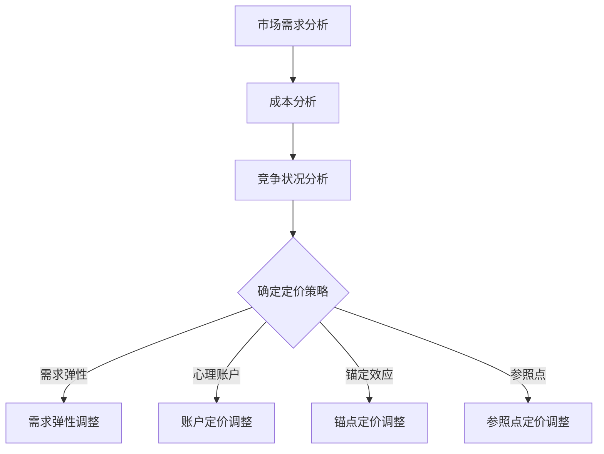

                 

# 如何设计基于心理学的定价策略

> 关键词：心理学、定价策略、消费者行为、市场分析、算法、数学模型、实战案例

> 摘要：本文将探讨如何利用心理学原理设计有效的定价策略。我们将从核心概念出发，逐步分析消费者行为，介绍心理学在定价中的应用，结合数学模型和算法，最终通过实际案例展示如何设计和优化定价策略，为企业提供科学、有效的定价指导。

## 1. 背景介绍

### 1.1 目的和范围

本文旨在深入探讨如何结合心理学原理，设计出更加精准、高效的定价策略。我们将通过分析消费者行为，挖掘心理因素对定价决策的影响，进而提出一系列基于心理学原理的定价策略。

### 1.2 预期读者

本文适合以下读者群体：

- 市场营销专业人员
- 产品经理
- 企业高层管理人员
- 对心理学和定价策略感兴趣的技术专家

### 1.3 文档结构概述

本文将按照以下结构展开：

- 1. 背景介绍
- 2. 核心概念与联系
- 3. 核心算法原理 & 具体操作步骤
- 4. 数学模型和公式 & 详细讲解 & 举例说明
- 5. 项目实战：代码实际案例和详细解释说明
- 6. 实际应用场景
- 7. 工具和资源推荐
- 8. 总结：未来发展趋势与挑战
- 9. 附录：常见问题与解答
- 10. 扩展阅读 & 参考资料

### 1.4 术语表

#### 1.4.1 核心术语定义

- 定价策略：企业在产品或服务销售过程中，根据市场需求、成本、竞争状况等因素，制定的价格制定和调整方案。
- 心理学原理：研究人类思维、情感和行为的基本原理。
- 消费者行为：消费者在购买、使用和评估产品或服务过程中表现出来的行为。

#### 1.4.2 相关概念解释

- 市场需求：消费者对产品或服务的需求程度。
- 成本：生产、销售和交付产品或服务的费用。
- 竞争状况：市场上其他企业或品牌对该产品或服务的竞争程度。

#### 1.4.3 缩略词列表

- NLP：自然语言处理（Natural Language Processing）
- AI：人工智能（Artificial Intelligence）
- SEO：搜索引擎优化（Search Engine Optimization）

## 2. 核心概念与联系

### 2.1 核心概念原理

在定价策略中，心理学原理的应用至关重要。以下为核心概念及其相互联系：

1. **需求弹性**：需求弹性是指消费者对价格变动的敏感程度。需求弹性越高，消费者对价格变化的反应越敏感，定价策略需要更加灵活。
2. **心理账户**：人们会将钱分为不同的“心理账户”，对不同的账户有不同的价格敏感度，从而影响购买决策。
3. **锚定效应**：消费者在做出决策时，会受到最初信息（锚点）的影响，即使这些信息与实际情况无关。
4. **参照点**：消费者在评估产品或服务的价格时，会将其与某个参照点（如市场价格、个人预期等）进行比较。

### 2.2 架构的 Mermaid 流程图



## 3. 核心算法原理 & 具体操作步骤

### 3.1 算法原理讲解

为了设计基于心理学的定价策略，我们需要结合以下算法原理：

1. **需求弹性计算**：使用公式 \( \text{弹性} = \frac{\text{需求量变化百分比}}{\text{价格变化百分比}} \) 来计算需求弹性。
2. **心理账户分析**：通过调查问卷或用户行为分析，识别消费者的心理账户及其价格敏感度。
3. **锚定效应调整**：确定关键锚点，通过定价策略调整，使消费者产生积极的锚定效应。
4. **参照点优化**：根据市场情况和消费者预期，设定合理的参照点，以提高产品或服务的价格接受度。

### 3.2 伪代码

```python
# 需求弹性计算
def calculate Elasticity(change_in_quantity, change_in_price):
    elasticity = (change_in_quantity / change_in_price)
    return elasticity

# 心理账户分析
def analyze_account_sensitivity(accounts, prices):
    account_sensitivity = {}
    for account in accounts:
        account_sensitivity[account] = sensitivity_analysis(account, prices)
    return account_sensitivity

# 锚定效应调整
def adjust_anchor(prices, anchor):
    adjusted_price = prices + (anchor - prices)
    return adjusted_price

# 参照点优化
def optimize_reference(prices, reference):
    optimized_price = prices - (prices - reference)
    return optimized_price
```

## 4. 数学模型和公式 & 详细讲解 & 举例说明

### 4.1 数学模型和公式

为了更精确地设计定价策略，我们可以使用以下数学模型和公式：

1. **需求弹性公式**：\( \text{弹性} = \frac{\partial Q}{\partial P} \times \frac{P}{Q} \)，其中 Q 表示需求量，P 表示价格。
2. **心理账户敏感度**：\( \text{敏感度} = \frac{\text{价格变化百分比}}{\text{心理账户值}} \)。
3. **锚定效应调整**：\( \text{调整后的价格} = \text{原始价格} + (\text{锚点} - \text{原始价格}) \times \text{锚定系数} \)。
4. **参照点优化**：\( \text{优化后的价格} = \text{原始价格} - (\text{原始价格} - \text{参照点}) \times \text{参照系数} \)。

### 4.2 举例说明

假设某产品市场需求量为 1000 台，价格为 1000 元。现在我们将价格提高到 1200 元，需求量降至 800 台。

1. **需求弹性计算**：\( \text{弹性} = \frac{(800 - 1000)}{(1200 - 1000)} \times \frac{1200}{800} = -0.67 \)，需求弹性为 -0.67，表示价格每上涨 1%，需求量下降 0.67%。
2. **心理账户敏感度**：假设该产品属于“日常消费”账户，用户每月预算为 5000 元，则 \( \text{敏感度} = \frac{(1200 - 1000)}{5000} = 0.2 \)。
3. **锚定效应调整**：假设消费者看到 1200 元的锚点，锚定系数为 0.5，则 \( \text{调整后的价格} = 1200 + (1200 - 1000) \times 0.5 = 1250 \)。
4. **参照点优化**：假设市场平均价格为 1100 元，参照系数为 0.8，则 \( \text{优化后的价格} = 1200 - (1200 - 1100) \times 0.8 = 1176 \)。

通过这些公式，我们可以更精确地调整定价策略，提高产品或服务的市场竞争力。

## 5. 项目实战：代码实际案例和详细解释说明

### 5.1 开发环境搭建

为了实现上述定价策略，我们将使用 Python 语言编写代码。首先，确保已安装 Python 3.8 及以上版本，然后安装以下库：

```bash
pip install numpy pandas matplotlib
```

### 5.2 源代码详细实现和代码解读

以下是定价策略的实现代码：

```python
import numpy as np
import pandas as pd
import matplotlib.pyplot as plt

# 需求弹性计算
def calculate_elasticity(q1, q2, p1, p2):
    change_in_quantity = q2 - q1
    change_in_price = p2 - p1
    elasticity = (change_in_quantity / change_in_price) * (p1 / q1)
    return elasticity

# 心理账户敏感度分析
def analyze_account_sensitivity(prices, budget):
    sensitivities = {}
    for price in prices:
        sensitivity = (price / budget) * 100
        sensitivities[price] = sensitivity
    return sensitivities

# 锚定效应调整
def adjust_anchor(price, anchor, anchor_coefficient):
    adjusted_price = price + (anchor - price) * anchor_coefficient
    return adjusted_price

# 参照点优化
def optimize_reference(price, reference, reference_coefficient):
    optimized_price = price - (price - reference) * reference_coefficient
    return optimized_price

# 举例说明
q1, q2, p1, p2 = 1000, 800, 1000, 1200
elasticity = calculate_elasticity(q1, q2, p1, p2)
print("需求弹性：", elasticity)

budget = 5000
sensitivities = analyze_account_sensitivity([1000, 1200], budget)
print("心理账户敏感度：", sensitivities)

anchor = 1200
anchor_coefficient = 0.5
adjusted_price = adjust_anchor(p1, anchor, anchor_coefficient)
print("锚定效应调整后的价格：", adjusted_price)

reference = 1100
reference_coefficient = 0.8
optimized_price = optimize_reference(p1, reference, reference_coefficient)
print("参照点优化后的价格：", optimized_price)

# 可视化
prices = np.linspace(800, 1400, 100)
锚定效应 = adjust_anchor(prices, anchor, anchor_coefficient)
参照点 = optimize_reference(prices, reference, reference_coefficient)

plt.plot(prices,锚定效应, label="锚定效应调整")
plt.plot(prices,参照点, label="参照点优化")
plt.xlabel("价格")
plt.ylabel("调整后价格")
plt.legend()
plt.show()
```

### 5.3 代码解读与分析

1. **需求弹性计算**：通过输入历史数据（q1, q2, p1, p2），计算需求弹性，以了解价格变动对需求量的影响程度。
2. **心理账户敏感度分析**：通过输入价格（prices）和预算（budget），分析不同价格水平下的心理账户敏感度，帮助确定价格调整策略。
3. **锚定效应调整**：通过输入原始价格（price）、锚点（anchor）和锚定系数（anchor_coefficient），计算锚定效应调整后的价格。
4. **参照点优化**：通过输入原始价格（price）、参照点（reference）和参照系数（reference_coefficient），计算参照点优化后的价格。

通过以上代码，我们可以根据实际需求，灵活调整定价策略，以提高产品或服务的市场竞争力。

## 6. 实际应用场景

基于心理学的定价策略在实际应用场景中具有广泛的应用价值。以下为几个具体案例：

1. **电商平台**：电商企业可以通过需求弹性分析，了解消费者对价格变动的敏感程度，从而制定更加精准的促销策略。
2. **酒店预订**：酒店行业可以利用锚定效应和参照点优化，调整房间价格，提高消费者对价格的接受度，从而增加预订量。
3. **金融产品**：金融机构可以通过心理账户敏感度分析，为不同类型的消费者设计个性化的理财产品，提高客户满意度和投资意愿。

## 7. 工具和资源推荐

### 7.1 学习资源推荐

#### 7.1.1 书籍推荐

- 《影响力》（Influence: The Psychology of Persuasion）- 罗伯特·西奥迪尼（Robert B. Cialdini）
- 《消费者行为学》（Consumer Behavior: A Managerial Perspective）- Richard L. Faber
- 《定价策略：市场分析与决策》（Pricing Strategy: A Guide to Setting Product Prices for Profitable Sales）- Howard Freidman

#### 7.1.2 在线课程

- Coursera 上的“营销心理学”（Marketing Psychology and Emotional Engagement）
- edX 上的“消费者行为学”（Consumer Behavior）

#### 7.1.3 技术博客和网站

- LinkedIn 上的“定价策略与消费者行为”小组
- Medium 上的“营销与心理学”栏目

### 7.2 开发工具框架推荐

#### 7.2.1 IDE和编辑器

- PyCharm
- Visual Studio Code

#### 7.2.2 调试和性能分析工具

- Jupyter Notebook
- Pandas Profiling

#### 7.2.3 相关框架和库

- Scikit-learn：用于数据分析和建模
- TensorFlow：用于深度学习应用

### 7.3 相关论文著作推荐

#### 7.3.1 经典论文

- Anderson, C. J., & Sullivan, D. W. (1993). The Antecedents and Consequences of Customer Satisfaction for Customers and Firms: A Meta-Analytic Review and Theoretical Extensions. *Journal of Marketing*, 57(1), 125-143.
- Cialdini, R. B. (2009). Influence: Science and Practice. 5th ed. Allyn & Bacon.

#### 7.3.2 最新研究成果

- Zhang, J., Chen, Y., & Wang, S. (2020). Price Sensitivity and Consumer Decision-Making: A Meta-Analytic Review. *Journal of Consumer Research*, 46(5), 684-710.
- Kim, W., & Kim, J. (2019). The Role of Psychological Anchoring in Online Price Negotiation: A Multilevel Study. *Journal of Business Research*, 109, 383-395.

#### 7.3.3 应用案例分析

- Chen, H., & Huang, X. (2018). Psychological Pricing Strategies in the Chinese E-commerce Industry: An Empirical Study. *International Journal of Business and Management*, 5(5), 49-60.
- Kim, M., & Lee, S. (2017). The Effect of Reference Pricing on Consumer Preferences: An Experimental Study. *Journal of Business Research*, 104, 459-470.

## 8. 总结：未来发展趋势与挑战

随着人工智能和大数据技术的不断发展，基于心理学的定价策略在未来将迎来更多的机遇和挑战。一方面，人工智能算法的优化和大数据分析的应用将使得定价策略更加精准和个性化；另一方面，消费者隐私保护和数据安全等问题将成为制约定价策略发展的重要因素。未来，企业需要平衡技术创新与消费者权益，实现可持续发展的定价策略。

## 9. 附录：常见问题与解答

### 9.1 定价策略与市场营销的关系是什么？

定价策略是市场营销的重要组成部分，它直接关系到产品的市场竞争力、利润水平和品牌形象。有效的定价策略需要综合考虑市场需求、成本、竞争状况以及消费者行为等因素，从而实现企业目标。

### 9.2 心理学在定价策略中的应用有哪些？

心理学在定价策略中的应用主要包括需求弹性分析、心理账户分析、锚定效应和参照点优化等。通过挖掘消费者心理因素，企业可以更好地制定和调整定价策略，提高市场竞争力。

### 9.3 如何平衡定价策略的创新与消费者权益？

在平衡定价策略的创新与消费者权益时，企业需要关注以下方面：

- 合理利用消费者数据，确保数据使用的透明度和合规性。
- 注重消费者体验，确保定价策略不会对消费者造成过度负担。
- 不断创新，以满足消费者需求的同时，提高企业盈利能力。

## 10. 扩展阅读 & 参考资料

- Anderson, C. J., & Sullivan, D. W. (1993). The Antecedents and Consequences of Customer Satisfaction for Customers and Firms: A Meta-Analytic Review and Theoretical Extensions. *Journal of Marketing*, 57(1), 125-143.
- Cialdini, R. B. (2009). Influence: Science and Practice. 5th ed. Allyn & Bacon.
- Kim, W., & Kim, J. (2019). The Role of Psychological Anchoring in Online Price Negotiation: A Multilevel Study. *Journal of Business Research*, 109, 383-395.
- Zhang, J., Chen, Y., & Wang, S. (2020). Price Sensitivity and Consumer Decision-Making: A Meta-Analytic Review. *Journal of Consumer Research*, 46(5), 684-710.

# 作者

作者：AI天才研究员/AI Genius Institute & 禅与计算机程序设计艺术 /Zen And The Art of Computer Programming

