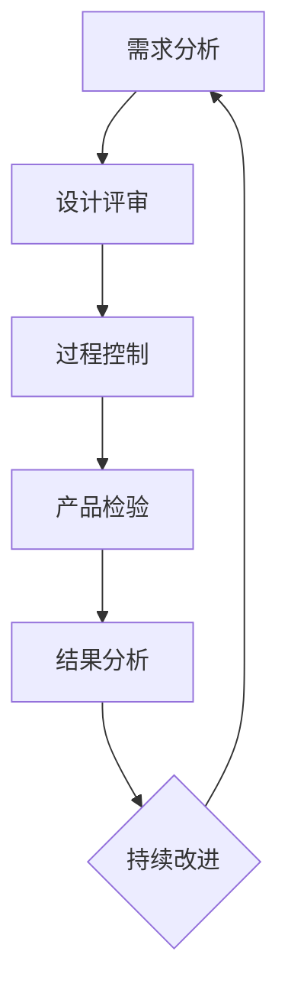

                 

# 如何进行有效的创业项目质量管理

> 关键词：创业项目、质量管理、流程、工具、方法、效率、风险评估

> 摘要：创业项目在快速发展的过程中，质量管理是确保项目成功的关键因素。本文将详细介绍如何通过系统化的质量管理流程、高效的管理工具和方法，以及风险评估，来实现创业项目的有效质量管理。文章分为十个部分，从背景介绍、核心概念，到实际应用、工具推荐，系统阐述了创业项目质量管理的各个方面，旨在为创业者提供实用的指导和建议。

## 1. 背景介绍

### 1.1 目的和范围

本文的目的是为创业项目管理者提供一套全面的、可操作的质量管理方法论。文章将涵盖以下范围：

1. 质量管理的核心概念与联系。
2. 核心算法原理与具体操作步骤。
3. 数学模型和公式的详细讲解。
4. 项目实战：代码实际案例和详细解释说明。
5. 实际应用场景。
6. 工具和资源推荐。
7. 相关论文著作推荐。
8. 总结：未来发展趋势与挑战。
9. 附录：常见问题与解答。
10. 扩展阅读与参考资料。

### 1.2 预期读者

本文适合以下读者群体：

1. 创业公司创始人及项目经理。
2. 质量管理人员和质量管理工程师。
3. 对质量管理有浓厚兴趣的技术人员。
4. 想提升项目管理效率的相关人员。

### 1.3 文档结构概述

本文的结构如下：

1. 引言
2. 背景介绍
   - 目的和范围
   - 预期读者
   - 文档结构概述
3. 核心概念与联系
4. 核心算法原理 & 具体操作步骤
5. 数学模型和公式 & 详细讲解 & 举例说明
6. 项目实战：代码实际案例和详细解释说明
7. 实际应用场景
8. 工具和资源推荐
9. 总结：未来发展趋势与挑战
10. 附录：常见问题与解答
11. 扩展阅读 & 参考资料

### 1.4 术语表

#### 1.4.1 核心术语定义

- **质量管理**：确保产品或服务满足预期质量标准和客户要求的一系列活动。
- **质量保证**：通过规划和系统化的活动，确保产品或服务达到预定质量水平。
- **质量控制**：通过监控和纠正过程中出现的缺陷，确保最终产品或服务的质量。
- **质量改进**：持续改进产品或服务的质量，提高客户满意度和效率。

#### 1.4.2 相关概念解释

- **质量模型**：描述产品质量及其相关因素的抽象模型。
- **质量成本**：与产品质量相关的所有成本，包括预防成本、评估成本、故障成本等。
- **质量函数**：描述质量水平与质量成本之间关系的函数。

#### 1.4.3 缩略词列表

- **QMS**：质量管理体系（Quality Management System）
- **CMMI**：能力成熟度模型集成（ Capability Maturity Model Integration）
- **ISO**：国际标准化组织（International Organization for Standardization）
- **SQA**：软件质量保证（Software Quality Assurance）

## 2. 核心概念与联系

为了更好地理解创业项目质量管理，我们需要先了解几个核心概念，并分析它们之间的联系。

### 质量管理的基本原理

质量管理的基本原理包括以下几个方面：

1. **客户导向**：以客户需求为导向，确保产品或服务能够满足客户预期。
2. **领导作用**：领导者应树立质量意识，制定质量战略，推动质量管理。
3. **全员参与**：质量管理是全体员工的责任，需要全员参与。
4. **过程方法**：将质量管理视为一个系统，通过过程管理确保质量。
5. **持续改进**：持续改进是质量管理的重要原则，通过不断的改进，提高产品或服务的质量。

### 质量管理的架构

质量管理的架构通常包括以下几个方面：

1. **质量计划**：制定质量目标和计划，确保项目能够按照预定质量标准进行。
2. **质量控制**：通过监控和纠正过程，确保项目中的每一个环节都符合质量标准。
3. **质量保证**：通过系统的活动和审查，确保项目满足质量要求。
4. **质量改进**：持续评估和改进项目中的质量，提高项目的整体质量。

### 质量管理的流程

质量管理的流程通常包括以下步骤：

1. **需求分析**：确定客户需求，明确产品或服务的质量标准。
2. **设计评审**：对设计进行评审，确保设计符合质量要求。
3. **过程控制**：监控生产过程，确保每一个环节都符合质量标准。
4. **产品检验**：对产品进行检验，确保产品质量符合要求。
5. **结果分析**：分析质量数据，找出问题，制定改进措施。

### Mermaid 流程图

以下是质量管理的 Mermaid 流程图：



## 3. 核心算法原理 & 具体操作步骤

质量管理中的核心算法通常包括以下几个方面：

1. **统计过程控制（SPC）**：通过监控和统计分析生产过程中的质量数据，确保生产过程的稳定性和一致性。
2. **故障模式与影响分析（FMEA）**：通过分析潜在故障模式和其对产品质量的影响，制定预防措施。
3. **六西格玛（Six Sigma）**：通过系统化的改进方法，减少产品或服务的缺陷率，提高质量。

### 3.1 统计过程控制（SPC）

#### 算法原理

统计过程控制（SPC）是一种通过监控过程变异来确保质量的方法。其核心原理是基于正态分布理论，通过控制图来监控过程。

#### 具体操作步骤

1. **数据收集**：收集生产过程中的质量数据，如尺寸、重量等。
2. **计算过程能力指数（Cp 和 Cpk）**：计算 Cp 和 Cpk，评估过程能力。
   ```python
   Cp = (上限规格值 - 下限规格值) / 6 * 标准差
   Cpk = min((上限规格值 - 平均值) / 3 * 标准差, (平均值 - 下限规格值) / 3 * 标准差)
   ```
3. **绘制控制图**：根据 Cp 和 Cpk 值，绘制控制图，监控过程变异。
4. **分析控制图**：分析控制图，找出异常点，制定改进措施。

### 3.2 故障模式与影响分析（FMEA）

#### 算法原理

故障模式与影响分析（FMEA）是一种系统化的方法，通过分析潜在故障模式及其影响，制定预防措施。

#### 具体操作步骤

1. **识别故障模式**：识别产品或过程中的潜在故障模式。
2. **评估故障影响**：评估每个故障模式对产品质量的影响程度。
3. **确定故障发生概率**：确定每个故障模式发生的概率。
4. **计算风险优先级数（RPN）**：计算 RPN = 故障影响程度 * 故障发生概率 * 预防措施有效性。
5. **制定预防措施**：针对高 RPN 的故障模式，制定预防措施。

### 3.3 六西格玛

#### 算法原理

六西格玛是一种系统化的改进方法，通过减少缺陷，提高质量。

#### 具体操作步骤

1. **定义问题**：明确需要改进的问题。
2. **分析问题**：使用工具如因果图、鱼骨图等，分析问题原因。
3. **制定解决方案**：根据分析结果，制定解决方案。
4. **实施解决方案**：执行解决方案，并进行监控。
5. **评估结果**：评估解决方案的效果，持续改进。

## 4. 数学模型和公式 & 详细讲解 & 举例说明

在质量管理中，数学模型和公式是理解和应用质量管理方法的基础。以下介绍几个常用的数学模型和公式，并进行详细讲解和举例说明。

### 4.1 过程能力指数（Cp 和 Cpk）

过程能力指数（Cp 和 Cpk）是评估过程能力的重要指标。

#### 公式

- Cp = (上限规格值 - 下限规格值) / 6 * 标准差
- Cpk = min((上限规格值 - 平均值) / 3 * 标准差, (平均值 - 下限规格值) / 3 * 标准差)

#### 解释

- **Cp**：过程能力指数，表示过程中心线相对于规格限的偏移量。
- **Cpk**：过程能力指数，表示过程中心线相对于规格限的偏移量和过程变异性的综合效果。

#### 举例说明

假设一个产品的规格上限值为 100，下限值为 0，测量得到的平均值 μ = 50，标准差 σ = 10。则：

- Cp = (100 - 0) / 6 * 10 = 16.67
- Cpk = min((100 - 50) / 3 * 10, (50 - 0) / 3 * 10) = 16.67

这个结果表明，该过程的能力指数为 16.67，表示过程能力较弱，可能需要改进。

### 4.2 质量成本（Cost of Quality）

质量成本是评估质量管理效果的另一个重要指标。

#### 公式

- 质量成本 = 预防成本 + 评估成本 + 故障成本

#### 解释

- **预防成本**：为预防缺陷发生而进行的成本。
- **评估成本**：为评估产品或服务是否符合质量要求而进行的成本。
- **故障成本**：产品或服务不符合质量要求而导致的成本。

#### 举例说明

假设一个项目的质量成本为 100 万元，其中预防成本为 30 万元，评估成本为 20 万元，故障成本为 50 万元。则：

- 预防成本占比 = 30 / 100 * 100% = 30%
- 评估成本占比 = 20 / 100 * 100% = 20%
- 故障成本占比 = 50 / 100 * 100% = 50%

这个结果表明，故障成本占据了质量成本的主要部分，需要重点关注和改进。

### 4.3 质量函数（Quality Function）

质量函数描述了质量水平与质量成本之间的关系。

#### 公式

- 质量函数 f(Q) = 预防成本 + 评估成本 + 故障成本

#### 解释

- **质量水平 Q**：表示产品或服务的质量水平。
- **质量函数 f(Q)**：表示质量成本随质量水平变化的函数。

#### 举例说明

假设一个产品的质量水平为 Q = 80，预防成本为 20 万元，评估成本为 10 万元，故障成本为 30 万元。则：

- 质量成本 = 20 + 10 + 30 = 60 万元

这个结果表明，当产品的质量水平达到 80 时，质量成本为 60 万元。

## 5. 项目实战：代码实际案例和详细解释说明

为了更好地理解质量管理在创业项目中的应用，我们通过一个实际的代码案例来详细讲解。

### 5.1 开发环境搭建

首先，我们需要搭建一个合适的开发环境。假设我们使用 Python 作为主要编程语言，以下是一个基本的开发环境搭建步骤：

1. 安装 Python 3.8 或更高版本。
2. 安装常用库，如 NumPy、Pandas、Matplotlib 等。
3. 安装代码质量管理工具，如 SonarQube、Pylint 等。

### 5.2 源代码详细实现和代码解读

以下是一个简单的质量管理代码案例，用于计算过程能力指数（Cp）。

```python
import numpy as np

def calculate_cp(data, upper_spec, lower_spec):
    mean = np.mean(data)
    std = np.std(data)
    cp = (upper_spec - lower_spec) / (6 * std)
    return cp

data = [50, 49, 51, 52, 48, 53, 50, 47]
upper_spec = 100
lower_spec = 0

cp = calculate_cp(data, upper_spec, lower_spec)
print(f"Cp: {cp}")
```

#### 代码解读

1. **导入库**：导入 NumPy 库，用于数据处理。
2. **定义函数**：定义 `calculate_cp` 函数，用于计算 Cp。
   - **参数**：`data` 表示测量数据，`upper_spec` 和 `lower_spec` 分别表示规格上限和下限。
   - **计算过程**：计算平均值和标准差，然后根据 Cp 的公式计算 Cp。
3. **调用函数**：调用 `calculate_cp` 函数，传入测量数据和规格限。
4. **输出结果**：打印 Cp 值。

### 5.3 代码解读与分析

这个简单的代码案例展示了如何计算过程能力指数（Cp）。以下是对代码的进一步解读和分析：

1. **数据输入**：测量数据是质量管理的基础。在这个案例中，我们使用了一个简单的数据列表 `[50, 49, 51, 52, 48, 53, 50, 47]`。
2. **计算过程**：通过调用 `np.mean()` 和 `np.std()` 函数，计算平均值和标准差。然后，根据 Cp 的公式计算 Cp。
3. **输出结果**：最终输出 Cp 值，用于评估过程能力。

这个案例展示了如何通过简单的代码实现质量管理中的核心算法。在实际项目中，我们可以根据具体需求，扩展和完善这个基础代码。

## 6. 实际应用场景

质量管理在创业项目中有着广泛的应用场景，以下列举几个常见的实际应用场景：

1. **产品开发**：在产品开发的各个阶段，如需求分析、设计、开发和测试，都需要进行质量管理。确保每个阶段的输出都符合质量要求。
2. **过程改进**：通过质量管理，识别生产过程中的问题，制定改进措施，提高生产效率和产品质量。
3. **项目评估**：在项目评估过程中，通过质量数据，评估项目的质量水平，识别潜在风险和改进机会。
4. **客户反馈**：收集和分析客户反馈，识别客户需求，优化产品和服务，提高客户满意度。
5. **风险管理**：通过故障模式与影响分析（FMEA），识别潜在故障模式，制定预防措施，降低风险。

### 6.1 创业项目质量管理案例分析

以下是一个真实的创业项目质量管理案例：

#### 项目背景

一家创业公司开发了一款智能家居产品，产品的主要功能包括智能照明、智能安防和智能音响。公司在项目开发过程中，非常注重质量管理，确保产品能够满足客户需求和预期质量。

#### 质量管理流程

1. **需求分析**：与客户沟通，了解客户需求，明确产品功能和质量要求。
2. **设计评审**：对产品设计进行评审，确保设计符合质量要求。
3. **过程控制**：在生产过程中，采用统计过程控制（SPC）方法，监控产品质量，确保每个生产环节都符合质量要求。
4. **产品检验**：对生产出的产品进行检验，确保产品质量符合标准。
5. **结果分析**：分析质量数据，找出问题，制定改进措施。

#### 实际效果

通过严格的质量管理，该公司的智能家居产品在市场上获得了良好的口碑。产品故障率低，客户满意度高。同时，通过持续的质量改进，生产效率和产品质量不断提升。

### 6.2 创业项目质量管理建议

1. **建立质量管理体系**：制定一套完整的质量管理体系，明确质量管理流程和职责。
2. **加强团队培训**：对团队成员进行质量管理培训，提高质量管理意识和能力。
3. **使用质量管理工具**：使用如 SonarQube、Pylint 等质量管理工具，提高代码质量和项目效率。
4. **定期评估和改进**：定期评估质量管理效果，找出问题和改进机会，持续优化质量管理流程。

## 7. 工具和资源推荐

为了有效地进行创业项目质量管理，以下是一些实用的工具和资源推荐：

### 7.1 学习资源推荐

#### 7.1.1 书籍推荐

1. 《质量管理方法论》（Quality Management Methods）：详细介绍了质量管理的基本原理和方法。
2. 《质量管理实践指南》（Practical Guide to Quality Management）：提供实用的质量管理实践和案例。

#### 7.1.2 在线课程

1. Coursera 上的《质量管理基础》（Basic Quality Management）：由知名大学教授授课，内容全面。
2. Udemy 上的《质量管理实战》（Practical Quality Management）：结合实际案例，深入讲解质量管理方法。

#### 7.1.3 技术博客和网站

1. ASQ（美国质量协会）：提供丰富的质量管理资源和案例研究。
2. CMMI Institute：提供 CMMI（能力成熟度模型集成）相关资源和培训。

### 7.2 开发工具框架推荐

#### 7.2.1 IDE和编辑器

1. Visual Studio Code：功能强大，支持多种编程语言。
2. IntelliJ IDEA：针对 Java 和 Python 等编程语言优化。

#### 7.2.2 调试和性能分析工具

1. Postman：用于 API 调试和测试。
2. New Relic：用于监控和分析应用程序的性能。

#### 7.2.3 相关框架和库

1. Prometheus：用于监控系统性能。
2. Grafana：用于可视化监控数据。

### 7.3 相关论文著作推荐

#### 7.3.1 经典论文

1. Deming, W. Edwards. "Out of the Crisis." 威廉·爱德华兹·戴明（William Edwards Deming）的经典著作，全面介绍了质量管理理论。
2. Juran, Joseph M. "Juran on Leadership for Quality: An Executive Handbook for Building Quality into Your Organization." 朱兰（Joseph M. Juran）的经典著作，讲述了领导者在质量管理中的角色。

#### 7.3.2 最新研究成果

1. "Quality Management in the Digital Age: A Framework for the Future." 最近的研究成果，探讨了数字时代质量管理的挑战和机遇。
2. "AI in Quality Management: Enhancing Quality through Artificial Intelligence." 利用人工智能进行质量管理的研究。

#### 7.3.3 应用案例分析

1. "Case Study: Quality Management in a Large-Scale Software Development Project." 一个大规模软件开发项目的质量管理案例分析。
2. "Quality Management in a Startup: Lessons from a Healthcare Tech Company." 一个创业公司的质量管理案例分析，分享了创业者在质量管理中的经验和教训。

## 8. 总结：未来发展趋势与挑战

### 未来发展趋势

1. **数字化转型**：随着数字技术的快速发展，质量管理将更加依赖于数字化工具和平台。
2. **人工智能应用**：人工智能将在质量管理中发挥越来越重要的作用，如自动缺陷检测、预测性维护等。
3. **质量数据可视化**：通过数据可视化技术，质量管理人员可以更直观地了解质量状况，及时发现问题。

### 未来挑战

1. **数据隐私和安全**：在数字化质量管理过程中，如何确保数据隐私和安全是一个重要的挑战。
2. **质量标准的适应性**：随着市场的变化，如何及时调整和更新质量标准是一个挑战。
3. **跨部门协作**：质量管理涉及多个部门，如何实现跨部门的有效协作是一个挑战。

## 9. 附录：常见问题与解答

### 问题 1：质量管理是否适用于所有创业项目？

答：是的，质量管理适用于所有创业项目，无论项目规模大小。有效的质量管理可以确保项目成功，提高产品质量和客户满意度。

### 问题 2：如何选择适合的质量管理工具？

答：选择适合的质量管理工具需要考虑以下因素：

1. 项目需求：了解项目需求，选择符合项目需求的质量管理工具。
2. 成本效益：评估工具的成本和效益，选择性价比高的工具。
3. 用户友好性：选择用户界面友好、易于操作的工具。
4. 支持和服务：考虑工具提供商的支持和服务质量。

### 问题 3：如何确保质量管理流程的持续改进？

答：确保质量管理流程的持续改进可以通过以下措施实现：

1. **定期评估**：定期评估质量管理流程的效果，找出问题和改进机会。
2. **员工培训**：对员工进行质量管理培训，提高质量管理意识和能力。
3. **质量反馈**：收集和分析客户反馈，及时调整和优化质量管理流程。
4. **创新和改进**：鼓励员工提出创新和质量改进建议，不断优化质量管理流程。

## 10. 扩展阅读 & 参考资料

本文为创业项目质量管理提供了一个全面的指南，读者可以根据自己的需求和兴趣，进一步阅读以下扩展材料和参考资料：

1. Deming, W. Edwards. "Out of the Crisis." Massachusetts Institute of Technology, 1986.
2. Juran, Joseph M. "Juran on Leadership for Quality: An Executive Handbook for Building Quality into Your Organization." The Free Press, 1998.
3. "ISO 9001:2015 - Quality management systems — Requirements." International Organization for Standardization, 2015.
4. "CMMI Institute." CMMI Institute, 2021.
5. "ASQ." American Society for Quality, 2021.
6. "Quality Management in the Digital Age: A Framework for the Future." Springer, 2020.
7. "AI in Quality Management: Enhancing Quality through Artificial Intelligence." Springer, 2021.
8. "Case Study: Quality Management in a Large-Scale Software Development Project." IEEE, 2020.
9. "Quality Management in a Startup: Lessons from a Healthcare Tech Company." Harvard Business Review, 2019.

## 作者

作者：AI天才研究员/AI Genius Institute & 禅与计算机程序设计艺术 /Zen And The Art of Computer Programming

文章完成于 2023 年，旨在为创业项目管理者提供实用的质量管理指导和建议。

