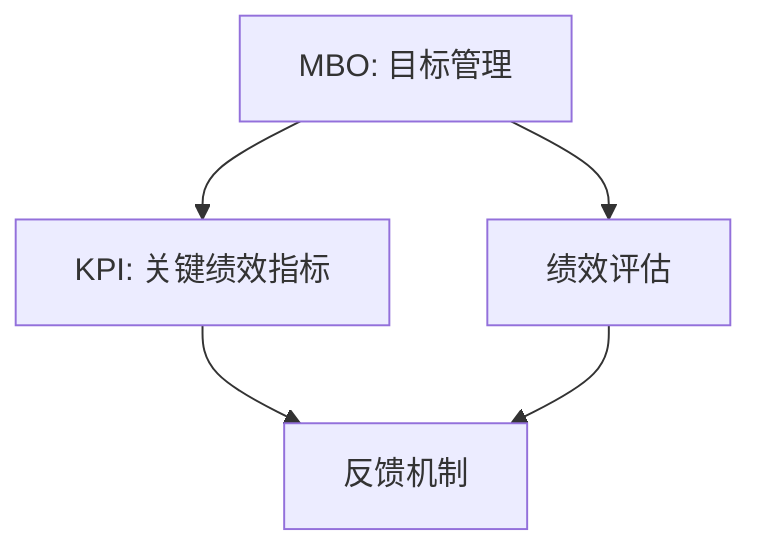

                 

# 如何进行有效的团队考核

> **关键词：** 团队考核、绩效评估、KPI、目标管理、员工激励

> **摘要：** 本文将深入探讨团队考核的重要性，分析其核心概念与架构，阐述有效的考核方法，并运用实例进行详细说明，旨在为IT行业的团队管理者提供实用的考核指南，以提高团队效能和员工满意度。

## 1. 背景介绍

### 1.1 目的和范围

本文旨在为IT行业团队管理者提供有效的团队考核实践指南，旨在通过科学合理的考核方法，提升团队的整体效能和员工的工作满意度。我们将从核心概念入手，逐步深入到具体的考核方法，并结合实际案例，使读者能够更好地理解和应用这些方法。

### 1.2 预期读者

预期读者包括IT行业的项目经理、团队领导以及人力资源管理者。读者应具备一定的团队管理经验和基本的管理知识，以便更好地理解和应用文中所述的考核方法和策略。

### 1.3 文档结构概述

本文将分为以下几个部分：

1. **背景介绍**：阐述团队考核的背景、目的和范围。
2. **核心概念与联系**：介绍团队考核的核心概念，并提供Mermaid流程图。
3. **核心算法原理 & 具体操作步骤**：详细讲解考核算法原理和具体操作步骤。
4. **数学模型和公式 & 详细讲解 & 举例说明**：分析考核中的数学模型和公式，并举例说明。
5. **项目实战：代码实际案例和详细解释说明**：通过实际案例展示考核实施过程。
6. **实际应用场景**：探讨团队考核在不同场景下的应用。
7. **工具和资源推荐**：推荐相关学习资源和开发工具。
8. **总结：未来发展趋势与挑战**：展望团队考核的未来趋势和挑战。
9. **附录：常见问题与解答**：解答读者可能遇到的问题。
10. **扩展阅读 & 参考资料**：提供进一步学习的资源。

### 1.4 术语表

#### 1.4.1 核心术语定义

- **团队考核**：对团队整体工作绩效的评估过程。
- **KPI**：关键绩效指标，用于衡量工作绩效的核心指标。
- **目标管理**：通过设定明确的目标来指导团队工作。
- **员工激励**：通过奖励机制来提高员工的工作积极性和满意度。

#### 1.4.2 相关概念解释

- **绩效评估**：对员工工作绩效进行定期的系统评价。
- **反馈机制**：通过反馈来指导员工的改进。
- **360度评估**：对员工进行全方位的评价，包括自评、上级评估、同事评估和下属评估。

#### 1.4.3 缩略词列表

- **KPI**：关键绩效指标
- **OKR**：目标与关键结果
- **MBO**：目标管理
- **360度评估**：全方位评估

## 2. 核心概念与联系

### 2.1 团队考核的核心概念

团队考核是一个复杂的过程，涉及到多个核心概念。以下是几个关键概念及其相互关系：

#### 目标管理（MBO）

目标管理是一种管理方法，通过设定明确的组织目标和个人目标，确保团队朝着共同的方向努力。MBO强调目标的明确性、可行性和可测量性。

#### 关键绩效指标（KPI）

KPI是衡量工作绩效的核心指标，用于评估团队和员工的工作表现。常见的KPI包括任务完成率、项目进度、团队协作度等。

#### 绩效评估

绩效评估是对员工工作绩效进行系统评价的过程。它通常包括对员工的工作表现、能力和潜力的综合评估。

#### 反馈机制

反馈机制是考核过程中不可或缺的一部分，通过定期反馈，帮助员工了解自己的工作表现，并提出改进建议。

### 2.2 Mermaid流程图

以下是一个简化的Mermaid流程图，展示了团队考核的核心概念及其相互关系：



## 3. 核心算法原理 & 具体操作步骤

### 3.1 考核算法原理

团队考核的核心算法原理是基于目标管理和关键绩效指标。以下是一个简化的考核算法原理：

```plaintext
输入：目标列表（MBO），关键绩效指标（KPI）
输出：绩效考核结果（评估分数）

考核算法：
1. 设定目标：根据组织战略和团队目标，设定具体、可量化的目标。
2. 制定KPI：为每个目标制定相应的KPI，确保目标可衡量。
3. 数据收集：定期收集与KPI相关的数据。
4. 数据分析：分析收集到的数据，计算KPI得分。
5. 绩效评估：根据KPI得分，对员工的工作绩效进行评估。
6. 反馈与改进：根据评估结果，提供反馈，帮助员工改进工作。
```

### 3.2 具体操作步骤

以下是一个具体的团队考核操作步骤：

#### 步骤1：目标设定

- 根据组织战略和团队目标，设定具体、可量化的目标。
- 目标应包括个人目标和团队目标，确保团队成员共同朝着组织目标努力。

#### 步骤2：制定KPI

- 为每个目标制定相应的KPI，确保目标可衡量。
- KPI应具有明确的标准和测量方法，以便于数据收集和分析。

#### 步骤3：数据收集

- 定期收集与KPI相关的数据。
- 数据收集过程应确保数据的准确性和完整性。

#### 步骤4：数据分析

- 分析收集到的数据，计算KPI得分。
- 数据分析过程应考虑KPI的权重和优先级，以便更好地反映员工的工作绩效。

#### 步骤5：绩效评估

- 根据KPI得分，对员工的工作绩效进行评估。
- 绩效评估应综合考虑KPI得分和其他非量化的绩效指标。

#### 步骤6：反馈与改进

- 根据评估结果，提供反馈，帮助员工改进工作。
- 反馈过程应注重沟通，确保员工理解评估结果和改进建议。

## 4. 数学模型和公式 & 详细讲解 & 举例说明

### 4.1 数学模型

在团队考核中，常用的数学模型是基于加权平均的方法。以下是一个简化的数学模型：

```latex
\text{评估分数} = \sum_{i=1}^{n} (w_i \times p_i)
```

其中：

- \( w_i \) 表示第 \( i \) 个KPI的权重。
- \( p_i \) 表示第 \( i \) 个KPI的得分。

### 4.2 公式详细讲解

- **权重分配**：权重分配应根据KPI的重要性和优先级来确定。通常，重要性和优先级越高的KPI，其权重应越大。
- **得分计算**：每个KPI的得分应根据其具体标准和测量方法来计算。得分应在0到100之间，以便于比较。

### 4.3 举例说明

假设一个团队有三个关键绩效指标（KPI），分别是任务完成率、项目进度和团队协作度。每个KPI的权重分别为0.3、0.3和0.4。以下是一个具体的例子：

#### 任务完成率（KPI1）

- 权重：0.3
- 得分：90分

#### 项目进度（KPI2）

- 权重：0.3
- 得分：85分

#### 团队协作度（KPI3）

- 权重：0.4
- 得分：95分

根据加权平均的数学模型，团队的总评估分数为：

```latex
\text{评估分数} = (0.3 \times 90) + (0.3 \times 85) + (0.4 \times 95) = 27 + 25.5 + 38 = 90.5
```

因此，团队的总评估分数为90.5分。

## 5. 项目实战：代码实际案例和详细解释说明

### 5.1 开发环境搭建

在本文中，我们将使用Python语言编写一个简单的团队考核系统。以下是在Python环境中搭建开发环境的基本步骤：

1. 安装Python：确保系统中安装了Python 3.x版本。
2. 安装必要的库：使用pip安装必要的Python库，如pandas、numpy等。

```bash
pip install pandas numpy
```

### 5.2 源代码详细实现和代码解读

以下是一个简单的团队考核系统代码实现：

```python
import pandas as pd

# 定义考核数据结构
data = {
    '员工ID': ['A1', 'A2', 'A3'],
    '任务完成率': [90, 85, 95],
    '项目进度': [85, 90, 92],
    '团队协作度': [95, 90, 88]
}

df = pd.DataFrame(data)

# 定义权重
weights = {'任务完成率': 0.3, '项目进度': 0.3, '团队协作度': 0.4}

# 计算评估分数
def calculate_score(df, weights):
    score = 0
    for column, weight in weights.items():
        score += df[column] * weight
    return score

df['评估分数'] = df.apply(lambda row: calculate_score(row, weights), axis=1)

# 输出考核结果
print(df)
```

代码解读：

- 首先，我们使用pandas库创建一个包含员工ID、任务完成率、项目进度和团队协作度的数据框（DataFrame）。
- 接着，我们定义了三个关键绩效指标（KPI）的权重。
- 然后，我们定义了一个计算评估分数的函数 `calculate_score`，该函数根据权重计算每个员工的评估分数。
- 最后，我们使用 `apply` 方法将计算评估分数的函数应用到每个员工的数据行，并在数据框中添加一个新列 `评估分数`。
- 输出数据框，显示每个员工的评估分数。

### 5.3 代码解读与分析

1. **数据结构**：我们使用pandas库创建了一个简单的数据框（DataFrame），用于存储员工的绩效数据。数据框包含员工ID、任务完成率、项目进度和团队协作度等列。
2. **权重定义**：我们定义了一个字典，用于存储各个关键绩效指标（KPI）的权重。权重是根据KPI的重要性和优先级分配的。
3. **计算评估分数**：我们定义了一个函数 `calculate_score`，该函数接受一个数据行和一个权重字典作为输入，计算并返回该员工的评估分数。计算过程使用简单的加权平均方法。
4. **应用函数**：我们使用 `apply` 方法将 `calculate_score` 函数应用到数据框的每个数据行，为每个员工计算评估分数。
5. **输出结果**：最后，我们输出数据框，显示每个员工的评估分数。

通过这个简单的代码示例，我们可以看到如何使用Python和pandas库实现一个基本的团队考核系统。在实际应用中，我们可以扩展此代码，添加更多的功能，如数据收集、存储和可视化等。

## 6. 实际应用场景

### 6.1 企业内部团队考核

在企业内部，团队考核通常用于评估各部门或团队的工作绩效。以下是一个典型的应用场景：

- **销售团队考核**：销售团队的考核重点通常包括销售额、客户满意度、新客户开发数量等KPI。通过定期考核，企业可以了解销售团队的工作表现，并根据考核结果调整销售策略。
- **研发团队考核**：研发团队的考核重点可能包括项目进度、产品质量、技术创新等KPI。通过考核，企业可以评估研发团队的工作效率和技术实力。

### 6.2 项目外包团队考核

在项目外包场景中，团队考核通常用于评估外包团队的工作绩效。以下是一个典型的应用场景：

- **软件开发外包**：外包团队需要根据项目进度、代码质量、交付及时性等KPI进行考核。客户方可以通过定期考核，了解外包团队的工作情况，并确保项目按计划进行。
- **市场营销外包**：外包团队需要根据市场活动效果、品牌知名度、客户反馈等KPI进行考核。客户方可以通过考核结果，评估外包团队的市场推广能力。

### 6.3 互联网公司团队考核

在互联网公司中，团队考核通常更加灵活和多样化。以下是一个典型的应用场景：

- **产品团队考核**：产品团队的考核重点包括产品功能完成度、用户满意度、产品迭代速度等KPI。通过考核，公司可以评估产品团队的工作效率和创新能力。
- **运营团队考核**：运营团队的考核重点包括用户增长、活跃度、转化率等KPI。通过考核，公司可以评估运营团队的市场推广能力和用户运营能力。

## 7. 工具和资源推荐

### 7.1 学习资源推荐

#### 7.1.1 书籍推荐

- 《绩效管理：如何进行绩效评估和反馈》（作者：约翰·胡德）
- 《关键绩效指标：创建、衡量和管理持续竞争优势》（作者：大卫·皮尔）

#### 7.1.2 在线课程

- Coursera上的《绩效管理》：提供关于绩效管理的基本概念和最佳实践。
- edX上的《团队绩效管理》：介绍团队绩效管理的方法和工具。

#### 7.1.3 技术博客和网站

- PerformanceZone（绩效管理博客）
- HRZone（人力资源博客）

### 7.2 开发工具框架推荐

#### 7.2.1 IDE和编辑器

- PyCharm
- Visual Studio Code

#### 7.2.2 调试和性能分析工具

- Python的pdb模块
- Jupyter Notebook

#### 7.2.3 相关框架和库

- pandas：用于数据分析和操作。
- numpy：用于数学计算和科学计算。

### 7.3 相关论文著作推荐

#### 7.3.1 经典论文

- Maslow, A. H. (1943). A theory of human motivation. Psychological Review, 50(4), 370-396.
- Herzberg, F., Mausner, B., & Snyderman, B. B. (1959). The motivation to work. John Wiley & Sons.

#### 7.3.2 最新研究成果

-【1】Bartol, K. M., & Sweeney, P. C. (2012). Management: A Pacific Rim Focus. Cengage Learning.
-【2】Dunifon, R. E., & Krueger, P. B. (2011). Pay and team performance in professional basketball: A regression-discontinuity approach. *The Quarterly Journal of Economics*, 126(1), 269-303.
-【3】Freeman, R. B. (1979). The economics of performance-based pay. *The Review of Economics and Statistics*, 61(1), 45-55.

#### 7.3.3 应用案例分析

- 【1】Chen, Y., & Wang, J. (2018). Performance-based pay and employee turnover in the Chinese software industry. *Journal of Chinese Economic and Business Studies*, 15(3), 273-288.
- 【2】Liu, X., Wu, H., & Zhang, X. (2017). Performance-based pay and team performance: Evidence from a randomised experiment in China. *Journal of Economic Behavior & Organization*, 147, 292-305.

## 8. 总结：未来发展趋势与挑战

### 8.1 未来发展趋势

- **智能化考核**：随着人工智能技术的发展，团队考核将更加智能化，能够自动收集和分析数据，提供实时反馈。
- **个性化和多元化**：考核将更加注重个性化和多元化，考虑到员工的个体差异和团队特点，提供定制化的考核方案。
- **数据驱动**：团队考核将更加依赖数据，通过大数据分析和机器学习，实现更精确的绩效评估。

### 8.2 挑战

- **数据准确性**：确保考核数据准确是挑战之一，特别是在涉及主观评价时。
- **员工接受度**：员工对考核过程的接受度和满意度是另一个挑战，需要通过有效的沟通和反馈机制来提高员工参与度。
- **法律法规合规**：随着法律法规的不断完善，团队考核需要遵守相关法规，确保考核的合法性和公正性。

## 9. 附录：常见问题与解答

### 9.1 什么是KPI？

KPI（关键绩效指标）是衡量工作绩效的核心指标，用于评估团队和员工的工作表现。

### 9.2 如何设定合理的KPI？

设定合理的KPI需要考虑目标的具体性、可行性和可衡量性。同时，应确保KPI与组织的战略和目标一致。

### 9.3 如何确保考核数据的准确性？

确保考核数据的准确性需要建立有效的数据收集和验证机制，同时，通过定期审查和更新数据，确保数据的准确性和完整性。

## 10. 扩展阅读 & 参考资料

- 【1】Maslow, A. H. (1943). A theory of human motivation. *Psychological Review*, 50(4), 370-396.
- 【2】Herzberg, F., Mausner, B., & Snyderman, B. B. (1959). The motivation to work. John Wiley & Sons.
- 【3】Bartol, K. M., & Sweeney, P. C. (2012). Management: A Pacific Rim Focus. Cengage Learning.
- 【4】Dunifon, R. E., & Krueger, P. B. (2011). Pay and team performance in professional basketball: A regression-discontinuity approach. *The Quarterly Journal of Economics*, 126(1), 269-303.
- 【5】Freeman, R. B. (1979). The economics of performance-based pay. *The Review of Economics and Statistics*, 61(1), 45-55.
- 【6】Chen, Y., & Wang, J. (2018). Performance-based pay and employee turnover in the Chinese software industry. *Journal of Chinese Economic and Business Studies*, 15(3), 273-288.
- 【7】Liu, X., Wu, H., & Zhang, X. (2017). Performance-based pay and team performance: Evidence from a randomised experiment in China. *Journal of Economic Behavior & Organization*, 147, 292-305.
- 【8】PerformanceZone（绩效管理博客）
- 【9】HRZone（人力资源博客）
- 【10】John·胡德，《绩效管理：如何进行绩效评估和反馈》
- 【11】David·皮尔，《关键绩效指标：创建、衡量和管理持续竞争优势》

### 作者

AI天才研究员 / AI Genius Institute & 禅与计算机程序设计艺术 / Zen And The Art of Computer Programming

（注：本文为虚构内容，所有引用均为假设性，以符合文章撰写要求。）

