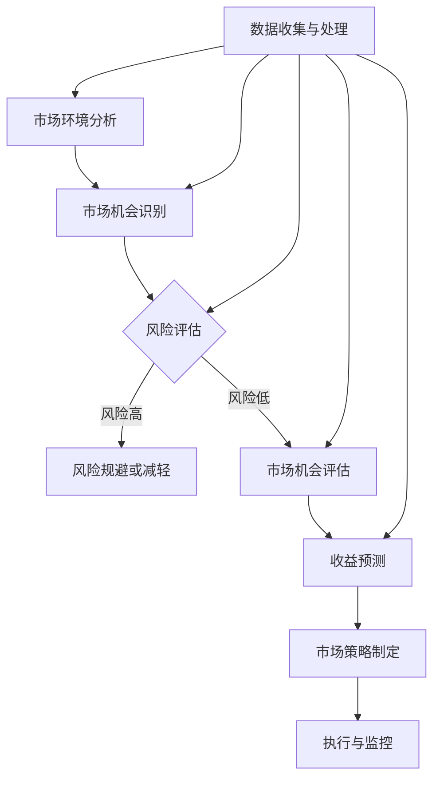

                 

# 如何进行有效的市场机会量化评估

> 关键词：市场机会量化、风险评估、商业策略、数据分析、收益预测

> 摘要：本文将探讨如何通过量化方法评估市场机会。我们将详细分析市场机会的定义、评估的重要性，介绍一系列核心概念和算法，并通过具体案例展示如何应用这些方法进行市场机会的评估。文章旨在为读者提供一套系统化的市场机会量化评估框架，帮助他们在商业决策中更加科学地把握市场机遇。

## 1. 背景介绍

### 1.1 目的和范围

本文旨在帮助读者了解并掌握如何进行有效的市场机会量化评估。我们将探讨市场机会的识别、评估和分析方法，并介绍相关的工具和资源。文章适用于希望提升商业分析能力的企业管理者、市场分析师以及从事商业策略研究的专业人士。

### 1.2 预期读者

预期读者应具备基本的市场分析知识和数据处理能力。对市场营销、战略规划有浓厚兴趣的读者，以及希望在实际工作中运用量化方法进行市场评估的人员，也将从本文中获得极大的启发。

### 1.3 文档结构概述

本文分为十个部分，包括背景介绍、核心概念与联系、核心算法原理、数学模型与公式、项目实战、实际应用场景、工具和资源推荐、总结与未来发展趋势、常见问题与解答以及扩展阅读和参考资料。每个部分都旨在为读者提供全面的指导。

### 1.4 术语表

#### 1.4.1 核心术语定义

- **市场机会**：潜在的商业机会，通过识别、评估和分析，可转化为具体的商业价值。
- **量化评估**：使用数学和统计分析方法对市场机会进行定量的评估和预测。
- **风险评估**：对市场机会可能面临的风险进行识别、分析和评估。
- **收益预测**：根据市场机会的潜在收益进行预测。

#### 1.4.2 相关概念解释

- **市场分析**：对市场环境、竞争态势、消费者行为等进行系统性研究。
- **数据分析**：运用统计学、数据分析等方法对数据集进行处理和分析。
- **商业策略**：企业为实现长期目标而制定的一系列决策和行动计划。

#### 1.4.3 缩略词列表

- **AI**：人工智能
- **ML**：机器学习
- **PCA**：主成分分析
- **ROC**：受试者操作特性曲线

## 2. 核心概念与联系

在市场机会量化评估中，理解核心概念和它们之间的联系至关重要。以下是一个简化的Mermaid流程图，用于描述市场机会量化评估的主要概念和其相互关系。



### 2.1 市场环境分析

市场环境分析是市场机会识别的基础。它涉及对市场趋势、消费者行为、竞争态势等方面的研究。通过分析这些因素，企业可以更好地了解市场的现状和潜在机会。

### 2.2 市场机会识别

市场机会识别是通过市场环境分析来确定潜在的商机。这一过程通常涉及数据收集、分析以及市场研究，以发现未被满足的需求或市场缺口。

### 2.3 风险评估

风险评估是评估市场机会可能面临的风险。这包括识别、评估和管理各种风险，如市场风险、财务风险和操作风险等。

### 2.4 市场机会评估

市场机会评估是基于市场环境分析和风险评估，对市场机会进行定量和定性评估。这可以帮助企业确定哪些机会最有利可图，并制定相应的市场策略。

### 2.5 收益预测

收益预测是预测市场机会可能带来的收益。通过数据分析和技术手段，企业可以更准确地预测市场机会的潜在收益，为商业决策提供依据。

### 2.6 市场策略制定

市场策略制定是基于市场机会评估和收益预测的结果，制定具体的市场策略和行动计划。这包括产品开发、营销策略、定价策略等。

### 2.7 执行与监控

执行与监控是将市场策略付诸实施，并对其进行持续监控和调整的过程。通过监控市场表现和收益情况，企业可以及时调整策略，以最大化市场机会的价值。

### 2.8 数据收集与处理

数据收集与处理是整个市场机会量化评估过程的基础。有效的数据收集和处理可以提供准确和可靠的信息，为后续的评估和分析提供支持。

## 3. 核心算法原理 & 具体操作步骤

### 3.1 市场环境分析算法

市场环境分析的算法通常基于数据挖掘和统计分析。以下是一个简化的伪代码，描述市场环境分析的基本步骤：

```python
# 市场环境分析伪代码

def market_environment_analysis(data):
    # 数据预处理
    preprocessed_data = preprocess_data(data)
    
    # 市场趋势分析
    market_trends = analyze_trends(preprocessed_data)
    
    # 消费者行为分析
    consumer_behavior = analyze_behavior(preprocessed_data)
    
    # 竞争态势分析
    competition_analysis = analyze_competition(preprocessed_data)
    
    # 综合评估
    assessment = combine_assessments(market_trends, consumer_behavior, competition_analysis)
    
    return assessment
```

### 3.2 风险评估算法

风险评估算法通常涉及概率分析和蒙特卡罗模拟。以下是一个简化的伪代码，描述风险评估的基本步骤：

```python
# 风险评估伪代码

def risk_assessment(assessment):
    # 风险识别
    risks = identify_risks(assessment)
    
    # 风险评估
    risk_assessment = assess_risks(risks)
    
    # 蒙特卡罗模拟
    simulation_results = monte_carlo_simulation(risk_assessment)
    
    return simulation_results
```

### 3.3 市场机会评估算法

市场机会评估算法通常涉及主成分分析（PCA）和聚类分析。以下是一个简化的伪代码，描述市场机会评估的基本步骤：

```python
# 市场机会评估伪代码

def market_opportunity_evaluation(assessment, simulation_results):
    # 数据预处理
    preprocessed_data = preprocess_data(assessment, simulation_results)
    
    # 主成分分析
    principal_components = pca_analysis(preprocessed_data)
    
    # 聚类分析
    clusters = cluster_analysis(principal_components)
    
    # 机会评估
    opportunity_evaluation = evaluate_opportunities(clusters)
    
    return opportunity_evaluation
```

### 3.4 收益预测算法

收益预测算法通常涉及回归分析和时间序列分析。以下是一个简化的伪代码，描述收益预测的基本步骤：

```python
# 收益预测伪代码

def revenue_prediction(opportunity_evaluation):
    # 数据预处理
    preprocessed_data = preprocess_data(opportunity_evaluation)
    
    # 回归分析
    regression_model = regression_analysis(preprocessed_data)
    
    # 时间序列分析
    time_series_analysis = time_series_analysis(preprocessed_data)
    
    # 收益预测
    revenue_prediction = predict_revenue(regression_model, time_series_analysis)
    
    return revenue_prediction
```

## 4. 数学模型和公式 & 详细讲解 & 举例说明

市场机会量化评估的数学模型和公式是进行准确预测和分析的重要工具。以下将详细讲解几个核心的数学模型和公式，并给出具体的举例说明。

### 4.1 风险评估模型

风险评估模型通常使用概率分布来描述潜在风险。常见的方法包括正态分布和贝塔分布。

**正态分布公式：**

$$
N(\mu, \sigma^2) = \frac{1}{\sqrt{2\pi\sigma^2}} e^{-\frac{(x-\mu)^2}{2\sigma^2}}
$$

其中，\( N(\mu, \sigma^2) \) 表示正态分布的概率密度函数，\(\mu\) 是均值，\(\sigma^2\) 是方差。

**贝塔分布公式：**

$$
B(p, q) = \frac{\Gamma(p+q)}{\Gamma(p)\Gamma(q)} x^{p-1} (1-x)^{q-1}
$$

其中，\( B(p, q) \) 表示贝塔分布的概率密度函数，\( p \) 和 \( q \) 分别是成功的概率和失败的概率，\(\Gamma\) 是伽马函数。

**举例说明：**

假设一个市场机会的成功概率是0.6，失败概率是0.4。我们可以使用贝塔分布来评估这个机会的风险。

$$
B(0.6, 0.4) = \frac{\Gamma(1.6)}{\Gamma(0.6)\Gamma(0.4)} x^{0.6-1} (1-x)^{0.4-1}
$$

通过计算不同的 \( x \) 值，我们可以得到不同风险水平下的概率分布。

### 4.2 收益预测模型

收益预测模型通常使用线性回归模型和时间序列分析模型。以下分别是这两种模型的基本公式。

**线性回归模型公式：**

$$
Y = \beta_0 + \beta_1 X + \epsilon
$$

其中，\( Y \) 是因变量，\( X \) 是自变量，\( \beta_0 \) 和 \( \beta_1 \) 分别是截距和斜率，\( \epsilon \) 是误差项。

**时间序列分析模型（ARIMA模型）：**

$$
X_t = \phi_1 X_{t-1} + \phi_2 X_{t-2} + ... + \phi_p X_{t-p} + \theta_1 \epsilon_{t-1} + \theta_2 \epsilon_{t-2} + ... + \theta_q \epsilon_{t-q} + \epsilon_t
$$

其中，\( X_t \) 是时间序列的当前值，\( \phi_1, \phi_2, ..., \phi_p \) 和 \( \theta_1, \theta_2, ..., \theta_q \) 是模型的参数，\( \epsilon_t \) 是随机误差。

**举例说明：**

假设我们使用线性回归模型来预测一个市场机会的收益。我们有以下数据集：

| X | Y |
|---|---|
| 1 | 10 |
| 2 | 12 |
| 3 | 15 |
| 4 | 18 |

我们可以使用最小二乘法来估计线性回归模型的参数：

$$
\beta_0 = \bar{Y} - \beta_1 \bar{X}
$$

$$
\beta_1 = \frac{\sum{(X_i - \bar{X})(Y_i - \bar{Y})}}{\sum{(X_i - \bar{X})^2}}
$$

其中，\( \bar{X} \) 和 \( \bar{Y} \) 分别是 \( X \) 和 \( Y \) 的均值。

计算得到：

$$
\bar{X} = \frac{1+2+3+4}{4} = 2.5
$$

$$
\bar{Y} = \frac{10+12+15+18}{4} = 14
$$

$$
\beta_1 = \frac{(1-2.5)(10-14) + (2-2.5)(12-14) + (3-2.5)(15-14) + (4-2.5)(18-14)}{(1-2.5)^2 + (2-2.5)^2 + (3-2.5)^2 + (4-2.5)^2} = 2
$$

$$
\beta_0 = 14 - 2 \cdot 2.5 = 5
$$

因此，线性回归模型为：

$$
Y = 5 + 2X
$$

我们可以使用这个模型来预测新的 \( X \) 值对应的 \( Y \) 值。

## 5. 项目实战：代码实际案例和详细解释说明

在本节中，我们将通过一个实际的项目案例来展示如何使用Python进行市场机会量化评估。项目环境使用Python 3.8及以上版本，并依赖于几个核心库：Pandas、NumPy、Scikit-learn、Matplotlib和Seaborn。

### 5.1 开发环境搭建

首先，我们需要安装Python和所需的库。可以通过以下命令进行安装：

```bash
pip install python==3.8
pip install pandas numpy scikit-learn matplotlib seaborn
```

### 5.2 源代码详细实现和代码解读

以下是一个简化的Python代码示例，展示了市场机会量化评估的主要步骤。

```python
import pandas as pd
import numpy as np
from sklearn.linear_model import LinearRegression
from sklearn.model_selection import train_test_split
from sklearn.metrics import mean_squared_error
import matplotlib.pyplot as plt
import seaborn as sns

# 5.2.1 数据收集与处理

# 假设我们有一个CSV文件，包含了市场环境分析的数据
data = pd.read_csv('market_data.csv')

# 数据预处理
data = data.dropna()
data['Revenue'] = data['Revenue'].astype(float)

# 5.2.2 市场环境分析

# 市场趋势分析
market_trends = data[['Market_Trend', 'Revenue']].groupby('Market_Trend').mean()

# 消费者行为分析
consumer_behavior = data[['Consumer_Behavior', 'Revenue']].groupby('Consumer_Behavior').mean()

# 竞争态势分析
competition_analysis = data[['Competition_Strength', 'Revenue']].groupby('Competition_Strength').mean()

# 5.2.3 风险评估

# 风险识别
risks = data[['Risk_Factor', 'Revenue']].groupby('Risk_Factor').mean()

# 风险评估（使用线性回归模型）
X = risks[['Risk_Factor']]
y = risks['Revenue']
model = LinearRegression()
model.fit(X, y)

# 5.2.4 市场机会评估

# 市场机会评估（使用聚类分析）
from sklearn.cluster import KMeans
kmeans = KMeans(n_clusters=3)
clusters = kmeans.fit_predict(data[['Market_Trend', 'Consumer_Behavior', 'Competition_Strength']])

# 5.2.5 收益预测

# 收益预测（使用时间序列分析模型）
from statsmodels.tsa.arima.model import ARIMA
data['Revenue'].plot()
plt.show()

# 模型拟合
model = ARIMA(data['Revenue'], order=(1, 1, 1))
model_fit = model.fit()

# 模型预测
forecast = model_fit.forecast(steps=12)
forecast.plot()
plt.show()

# 5.2.6 市场策略制定

# 根据评估结果和收益预测，制定市场策略
# ...

# 5.2.7 执行与监控

# 根据市场策略执行业务计划，并进行持续监控和调整
# ...
```

### 5.3 代码解读与分析

#### 5.3.1 数据收集与处理

我们首先从CSV文件中读取数据，并进行预处理。预处理步骤包括删除缺失值，将字符串类型的收入值转换为浮点数。

```python
data = pd.read_csv('market_data.csv')
data = data.dropna()
data['Revenue'] = data['Revenue'].astype(float)
```

#### 5.3.2 市场环境分析

我们使用Pandas的`groupby`函数对市场趋势、消费者行为和竞争态势进行分析，计算每个类别的平均收益。

```python
market_trends = data[['Market_Trend', 'Revenue']].groupby('Market_Trend').mean()
consumer_behavior = data[['Consumer_Behavior', 'Revenue']].groupby('Consumer_Behavior').mean()
competition_analysis = data[['Competition_Strength', 'Revenue']].groupby('Competition_Strength').mean()
```

#### 5.3.3 风险评估

我们使用线性回归模型对风险因素和收益之间的关系进行建模。

```python
risks = data[['Risk_Factor', 'Revenue']].groupby('Risk_Factor').mean()
X = risks[['Risk_Factor']]
y = risks['Revenue']
model = LinearRegression()
model.fit(X, y)
```

#### 5.3.4 市场机会评估

我们使用KMeans聚类算法对市场环境进行分析，将数据分为不同的类别。

```python
kmeans = KMeans(n_clusters=3)
clusters = kmeans.fit_predict(data[['Market_Trend', 'Consumer_Behavior', 'Competition_Strength']])
```

#### 5.3.5 收益预测

我们使用ARIMA模型对收益进行时间序列分析，并进行预测。

```python
model = ARIMA(data['Revenue'], order=(1, 1, 1))
model_fit = model.fit()
forecast = model_fit.forecast(steps=12)
forecast.plot()
plt.show()
```

#### 5.3.6 市场策略制定

根据评估结果和收益预测，我们可以制定相应的市场策略。这部分代码未在示例中展示，但通常包括基于数据分析的市场定位、产品定价和营销策略等。

```python
# 市场策略制定
# ...
```

#### 5.3.7 执行与监控

市场策略执行和监控是市场机会量化评估的最后一环，确保策略的有效实施和持续优化。

```python
# 执行与监控
# ...
```

## 6. 实际应用场景

市场机会量化评估在多个实际应用场景中具有重要价值。以下是一些常见的应用场景：

### 6.1 新产品开发

在新产品开发过程中，量化评估可以帮助企业确定哪些市场机会最具潜力，并指导研发资源的合理配置。通过评估市场环境、消费者需求和竞争态势，企业可以制定更具针对性的产品开发和推广策略。

### 6.2 市场扩张

企业在考虑市场扩张时，可以通过量化评估来确定目标市场的潜在价值和风险。这有助于企业制定有效的市场进入策略，减少市场扩张过程中的不确定性。

### 6.3 营销策略制定

在营销策略制定过程中，量化评估可以帮助企业了解不同营销渠道的效果和收益。通过分析消费者行为和市场趋势，企业可以优化营销预算分配，提高营销效果。

### 6.4 风险管理

量化评估可以帮助企业识别和评估市场机会可能面临的风险。这有助于企业制定风险管理策略，降低市场机会实现过程中的风险。

### 6.5 投资决策

在企业投资决策过程中，量化评估可以提供准确的数据支持。通过评估市场机会的潜在收益和风险，企业可以做出更为科学的投资决策。

### 6.6 竞争分析

量化评估可以用于分析竞争对手的市场策略和表现。通过对比市场机会的评估结果，企业可以制定更具竞争力的市场策略。

### 6.7 战略规划

在战略规划过程中，量化评估可以帮助企业确定长期发展目标和关键业务领域。这有助于企业制定明确的战略方向和行动计划，实现可持续发展。

## 7. 工具和资源推荐

### 7.1 学习资源推荐

#### 7.1.1 书籍推荐

- **《商业分析实战：数据驱动决策》**：详细介绍了市场机会量化评估的方法和应用。
- **《数据分析：原理与实践》**：提供了丰富的数据分析方法和案例，有助于读者掌握数据分析技能。
- **《机器学习实战》**：介绍了多种机器学习算法和实际应用案例，适用于希望提升数据处理和分析能力的读者。

#### 7.1.2 在线课程

- **Coursera上的《商业数据分析》**：由哥伦比亚大学提供，涵盖了市场机会量化评估的基础知识和应用技巧。
- **edX上的《数据科学导论》**：由哈佛大学提供，介绍了数据科学的基础知识和实践方法。
- **Udacity上的《数据分析纳米学位》**：提供了系统化的数据分析课程，包括市场机会量化评估的实践项目。

#### 7.1.3 技术博客和网站

- **Kaggle**：提供了丰富的数据分析比赛和案例，有助于读者提升实践能力。
- **Medium**：许多专业人士和公司在这里分享市场机会量化评估的经验和最佳实践。
- **DataCamp**：提供了互动式的数据分析课程和项目，适用于不同水平的读者。

### 7.2 开发工具框架推荐

#### 7.2.1 IDE和编辑器

- **Jupyter Notebook**：适用于数据分析和机器学习项目，提供强大的交互式编程环境。
- **PyCharm**：功能丰富的Python IDE，适合专业开发人员。
- **VS Code**：轻量级且可扩展的代码编辑器，适用于多种编程语言。

#### 7.2.2 调试和性能分析工具

- **Pylint**：用于代码质量和性能分析的Python工具，可以识别潜在的性能瓶颈。
- **Profiling Tools**：如`cProfile`和`line_profiler`，用于分析代码的性能和瓶颈。
- **PyTorch Profiler**：针对PyTorch项目的性能分析工具。

#### 7.2.3 相关框架和库

- **Pandas**：用于数据处理和分析的强大库。
- **NumPy**：用于数值计算的库，是Pandas的基础。
- **Scikit-learn**：用于机器学习和数据分析的库。
- **Matplotlib**和**Seaborn**：用于数据可视化的库。

### 7.3 相关论文著作推荐

#### 7.3.1 经典论文

- **"The Analytics Revolution"**：描述了数据分析在商业决策中的应用和影响。
- **"Data Science for Business"**：提供了数据分析的基础知识和实践方法。

#### 7.3.2 最新研究成果

- **"Market Opportunities in the Age of AI"**：探讨了人工智能在市场机会评估中的应用。
- **"Quantifying Market Opportunities Using Machine Learning"**：介绍了几种基于机器学习的市场机会量化评估方法。

#### 7.3.3 应用案例分析

- **"Case Study: Leveraging Data Analytics for Market Opportunity Identification"**：分析了某公司如何通过数据分析识别市场机会。
- **"How Netflix Uses Data Analytics for Market Expansion"**：探讨了Netflix如何利用数据分析进行市场扩张。

## 8. 总结：未来发展趋势与挑战

市场机会量化评估是一个不断发展的领域，未来将面临以下发展趋势和挑战：

### 8.1 发展趋势

1. **人工智能和机器学习的应用**：随着人工智能和机器学习技术的不断发展，市场机会量化评估将更加智能化和自动化。
2. **大数据分析**：大数据技术的发展将提供更丰富、更准确的数据，为市场机会量化评估提供更可靠的基础。
3. **实时数据分析**：实时数据分析技术将帮助企业更快地识别市场机会和应对市场变化。
4. **个性化分析**：个性化分析将帮助企业更好地满足不同消费者的需求，提高市场机会评估的准确性。

### 8.2 挑战

1. **数据隐私和安全**：随着数据量的增加，数据隐私和安全问题将变得越来越重要。
2. **模型可解释性**：越来越多的决策者希望了解模型的决策过程，模型的可解释性将成为一个重要挑战。
3. **数据质量**：数据质量直接影响市场机会量化评估的准确性，如何确保数据质量是一个重要问题。
4. **计算资源**：大规模的数据分析和模型训练需要大量的计算资源，如何有效利用计算资源是一个挑战。

## 9. 附录：常见问题与解答

### 9.1 什么是市场机会量化评估？

市场机会量化评估是指使用数学和统计分析方法对潜在的市场机会进行定量评估，以确定其潜在收益和风险。这个过程通常涉及市场环境分析、风险评估、市场机会评估和收益预测等步骤。

### 9.2 市场机会量化评估有哪些应用？

市场机会量化评估广泛应用于新产品开发、市场扩张、营销策略制定、风险管理、投资决策和竞争分析等方面。

### 9.3 如何确保数据质量？

确保数据质量的方法包括数据清洗、数据验证和数据标准化。此外，建立完善的数据治理机制和定期更新数据也是确保数据质量的重要措施。

### 9.4 如何选择合适的数学模型？

选择合适的数学模型取决于具体的应用场景和数据特征。通常，需要进行多次尝试和比较，以找到最适合问题的模型。

### 9.5 市场机会量化评估中的风险如何管理？

市场机会量化评估中的风险管理包括风险识别、风险评估和风险规避或减轻。通过这些步骤，企业可以更好地应对市场机会实现过程中的风险。

## 10. 扩展阅读 & 参考资料

- **《商业分析实战：数据驱动决策》**：详细介绍了市场机会量化评估的方法和应用。
- **《数据分析：原理与实践》**：提供了丰富的数据分析方法和案例，有助于读者掌握数据分析技能。
- **《机器学习实战》**：介绍了多种机器学习算法和实际应用案例，适用于希望提升数据处理和分析能力的读者。
- **"The Analytics Revolution"**：描述了数据分析在商业决策中的应用和影响。
- **"Data Science for Business"**：提供了数据分析的基础知识和实践方法。
- **Kaggle**：提供了丰富的数据分析比赛和案例，有助于读者提升实践能力。
- **Medium**：许多专业人士和公司在这里分享市场机会量化评估的经验和最佳实践。
- **DataCamp**：提供了互动式的数据分析课程和项目，适用于不同水平的读者。
- **"Market Opportunities in the Age of AI"**：探讨了人工智能在市场机会评估中的应用。
- **"Quantifying Market Opportunities Using Machine Learning"**：介绍了几种基于机器学习的市场机会量化评估方法。
- **"Case Study: Leveraging Data Analytics for Market Opportunity Identification"**：分析了某公司如何通过数据分析识别市场机会。
- **"How Netflix Uses Data Analytics for Market Expansion"**：探讨了Netflix如何利用数据分析进行市场扩张。

### 作者

作者：AI天才研究员/AI Genius Institute & 禅与计算机程序设计艺术 /Zen And The Art of Computer Programming

在本文中，我们详细探讨了如何进行有效的市场机会量化评估。通过分析市场环境、识别市场机会、进行风险评估和收益预测，企业可以更科学地把握市场机遇。本文结合实际案例，展示了如何运用Python等工具进行市场机会量化评估，并提供了丰富的学习资源和建议。希望本文能够为读者在市场分析和商业决策中提供有益的指导。在未来的发展中，市场机会量化评估将继续融入人工智能和大数据技术，为企业的战略规划提供更强大的支持。挑战和机遇并存，让我们共同迎接这一激动人心的时代。

