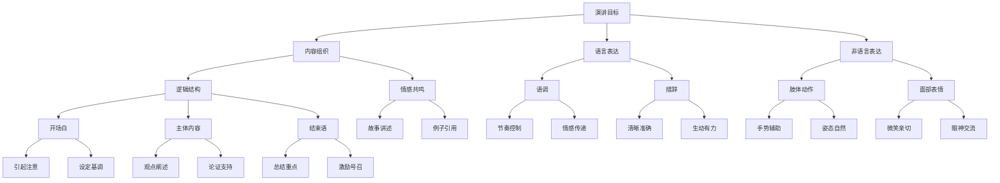

                 

### 背景介绍

> “演讲，作为一种沟通方式，不仅仅是为了传递信息，更是为了影响和激励听众。在信息爆炸的时代，有效的演讲和表达显得尤为重要。它不仅关乎个人形象和品牌塑造，更关系到信息传递的效率和影响力。因此，深入探讨演讲技巧，找到如何进行有效的演讲和表达，对于我们每个人都具有重要意义。”

### 1.1 目的和范围

本文的目的是帮助读者了解和掌握演讲的核心技巧，从演讲的准备、内容组织、语言表达到实际演讲中的技巧运用，全面分析并给出实践指导。文章将涵盖以下范围：

1. **演讲准备**：讨论如何选择主题、研究材料、准备演讲稿，以及演讲前的准备工作。
2. **内容组织**：介绍如何构建演讲框架，确保演讲逻辑清晰，条理分明。
3. **语言表达**：分析如何运用恰当的语言、语调和非语言表达手段，增强演讲效果。
4. **演讲技巧**：提供演讲时的具体技巧，包括如何与观众互动、管理时间等。

通过这些内容的讲解，读者可以系统性地提升自己的演讲能力，从而在职场、教育和日常生活中更加自信和有效地进行表达。

### 1.2 预期读者

本文适合以下几类读者：

1. **职场人士**：需要频繁进行汇报、会议发言，希望提升演讲水平的职场人员。
2. **教育工作者**：需要在课堂上进行讲解、演讲的教育工作者。
3. **公共演讲爱好者**：对公共演讲感兴趣，希望提升自己演讲技巧的爱好者。
4. **学生和研究生**：准备参加学术报告或求职面试，需要准备演讲的学生和研究生。

无论你是哪一类读者，只要对提升演讲和表达能力感兴趣，都可以通过本文的学习和实践，获得实质性的提升。

### 1.3 文档结构概述

为了帮助读者更好地理解文章的结构和内容，以下是本文的详细结构概述：

1. **背景介绍**：
    - 演讲的重要性。
    - 文章的目的和范围。
    - 预期读者群体。

2. **核心概念与联系**：
    - 演讲的核心概念介绍。
    - 相关概念的解释。
    - 使用Mermaid流程图展示核心概念和架构联系。

3. **核心算法原理与具体操作步骤**：
    - 演讲技巧的算法原理。
    - 伪代码形式的操作步骤详解。

4. **数学模型和公式**：
    - 演讲中涉及的数学模型。
    - 公式详细讲解和举例说明。

5. **项目实战：代码实际案例**：
    - 开发环境的搭建。
    - 源代码的详细实现和解读。
    - 代码分析和应用。

6. **实际应用场景**：
    - 演讲技巧在不同场景下的应用。

7. **工具和资源推荐**：
    - 学习资源推荐。
    - 开发工具框架推荐。
    - 相关论文著作推荐。

8. **总结：未来发展趋势与挑战**：
    - 演讲技巧的发展趋势。
    - 面临的挑战和解决策略。

9. **附录：常见问题与解答**：
    - 针对演讲中常见问题的解答。

10. **扩展阅读与参考资料**：
    - 推荐进一步学习的资源。

通过这一结构概述，读者可以清晰地了解文章的组织框架和内容分布，有助于更好地掌握演讲技巧。

### 1.4 术语表

在本文中，我们使用了一些专业术语，以下是对这些术语的定义和解释：

#### 1.4.1 核心术语定义

1. **演讲（Speech）**：指通过口头语言向听众传达信息、观点或情感的过程。
2. **表达（Expression）**：指通过语言、声音、肢体动作等手段传达个人意图或情感。
3. **演讲稿（Speech Script）**：为演讲准备的文本材料，包括开场白、主体内容和结束语。
4. **非语言表达**：包括肢体动作、面部表情、语调变化等非文字性的表达手段。
5. **互动（Interaction）**：指演讲者与听众之间的双向沟通，包括提问、回答和讨论等。

#### 1.4.2 相关概念解释

1. **逻辑结构**：指演讲内容的组织方式，确保观点之间有合理的逻辑关系。
2. **情感共鸣**：指演讲者通过语言和情感表达引起听众的共鸣，增强演讲的影响力。
3. **语调**：指演讲时声音的高低、强弱、快慢和节奏，影响听众的听感和情感反应。
4. **态势语言**：指通过身体姿势、面部表情和手势等非语言手段来传达信息。

#### 1.4.3 缩略词列表

1. **IDE**：集成开发环境（Integrated Development Environment）
2. **latex**： LaTeX排版系统（LaTeX Typesetting System）
3. **Mermaid**：Mermaid绘图语言（Mermaid Drawing Language）
4. **CTO**：首席技术官（Chief Technology Officer）
5. **AI**：人工智能（Artificial Intelligence）

通过以上术语表的定义和解释，读者可以更好地理解文中涉及的专业术语，有助于深入学习和实践演讲技巧。

## 2. 核心概念与联系

在探讨如何进行有效的演讲和表达之前，我们需要理解一些核心概念和它们之间的关系。以下是一个使用Mermaid绘制的流程图，展示演讲核心概念和它们之间的联系：



这个流程图展示了演讲的关键环节和它们之间的相互关系：

1. **演讲目标（A）**：确定演讲的核心目的，包括传达信息、说服听众或启发思考。
2. **内容组织（B）**：确保演讲内容逻辑清晰，结构紧凑，包含开场白、主体内容和结束语。
3. **语言表达（C）** 与 **非语言表达（D）**：演讲不仅依靠语言文字，还包括语调、措辞、肢体动作和面部表情等非语言手段。
4. **逻辑结构（E）**：构建演讲的框架，确保观点之间的逻辑关系合理。
5. **情感共鸣（F）**：通过故事、例子等手段，与听众建立情感联系。
6. **语调（G）**、**措辞（H）**：语言表达的核心，包括节奏控制、情感传递、清晰准确和生动有力。
7. **肢体动作（I）**、**面部表情（J）**：态势语言的重要组成部分，影响听众的感知和情感反应。
8. **开场白（K）**、**主体内容（L）**、**结束语（M）**：演讲的三部分内容，每部分都有其特定的目标和作用。

通过这个流程图，我们可以更清晰地理解演讲的核心概念和它们之间的相互作用。在实际操作中，这些概念相互交织，共同决定了演讲的效果。接下来，我们将进一步深入探讨每个核心概念的具体原理和应用。

### 2.1 核心概念解释与实例分析

在上一节中，我们介绍了演讲的核心概念和它们之间的联系。接下来，我们将深入分析这些核心概念，并借助具体实例，帮助读者更好地理解和应用这些概念。

#### 2.1.1 演讲目标

**定义**：演讲目标是指演讲者希望通过演讲实现的核心目的，包括传达信息、说服听众或启发思考。

**实例分析**：假设一位公司CEO需要在年度全体员工大会上发表演讲。其演讲目标可能是：

- 传达公司过去一年的成就和未来的发展规划。
- 激励员工，提升团队士气。
- 留住关键人才，稳定公司发展。

**应用**：在确定演讲目标后，演讲者需要围绕这些目标组织演讲内容，确保每个部分都能服务于演讲的核心目的。

#### 2.1.2 内容组织

**定义**：内容组织是指将演讲内容按照逻辑顺序和结构进行排列，确保演讲条理清晰，易于听众理解。

**实例分析**：以一个学术报告为例，其内容组织通常包括：

- 开场白：介绍报告的主题和目的。
- 研究背景：阐述研究背景和问题。
- 研究方法：描述采用的研究方法和工具。
- 研究结果：展示研究的主要发现。
- 结论与建议：总结研究结果，提出建议。

**应用**：在准备演讲时，演讲者需要提前规划好演讲的结构，确保每个部分都有明确的逻辑关系，避免信息冗余和跳跃。

#### 2.1.3 语言表达

**定义**：语言表达是指演讲者通过口头语言传达信息、观点和情感的手段。

**实例分析**：一位演讲者在介绍新产品时，可能会使用以下语言表达技巧：

- **措辞**：选择恰当的词汇和句子结构，使演讲内容更加生动有力。
- **语调**：通过声音的高低、强弱和节奏变化，增强演讲的感染力。
- **情感传递**：通过语气和表情，传递出对产品的热情和信心。

**应用**：演讲者需要在演讲过程中注意语言表达的准确性、清晰度和生动性，以吸引听众的注意力。

#### 2.1.4 非语言表达

**定义**：非语言表达是指通过肢体动作、面部表情、姿态等非文字性手段传达信息、观点和情感。

**实例分析**：在演讲中，演讲者的肢体动作和面部表情可以增强演讲的效果：

- **肢体动作**：适当的肢体动作可以增强演讲的感染力，如点头、挥手等。
- **面部表情**：微笑、眼神交流等面部表情可以传达出演讲者的情感和态度。

**应用**：演讲者需要熟练运用非语言表达手段，与听众建立良好的互动和情感连接。

#### 2.1.5 逻辑结构

**定义**：逻辑结构是指演讲内容的组织方式，确保观点之间有合理的逻辑关系，使演讲条理清晰。

**实例分析**：一个典型的逻辑结构可能包括：

- **开场白**：引入主题，设定基调。
- **主体内容**：分几个部分阐述观点，每个部分之间有明确的过渡。
- **结束语**：总结重点，发出号召。

**应用**：演讲者需要在准备演讲时，仔细构思演讲的结构，确保每个部分都能有序推进，使听众易于理解和接受。

#### 2.1.6 情感共鸣

**定义**：情感共鸣是指演讲者通过情感表达引起听众的共鸣，增强演讲的影响力。

**实例分析**：在演讲中，演讲者可以通过讲述自己的经历、引用感人的故事或分享真挚的情感，与听众建立情感连接：

- **故事讲述**：通过故事传达情感和观点。
- **例子引用**：使用真实的例子来强化观点。

**应用**：演讲者需要在演讲中注重情感表达，以增强演讲的感染力和说服力。

#### 2.1.7 语调

**定义**：语调是指演讲者通过声音的高低、强弱和节奏变化来传达情感和态度。

**实例分析**：在演讲中，演讲者可以通过以下方式运用语调：

- **节奏控制**：通过调整语速和停顿，使演讲更加生动和引人入胜。
- **情感传递**：通过声音的变化，表达出演讲者的情感和态度。

**应用**：演讲者需要熟练掌握语调技巧，使演讲更具吸引力。

#### 2.1.8 措辞

**定义**：措辞是指演讲者选择使用恰当的词汇和句子结构，以清晰、生动地表达观点。

**实例分析**：在演讲中，演讲者需要根据听众和理解背景，选择合适的措辞：

- **清晰准确**：使用明确、具体的词汇，避免模糊和歧义。
- **生动有力**：使用生动、有力的词汇和句子，增强表达效果。

**应用**：演讲者需要注重措辞的精准性和生动性，使演讲更加有力和吸引人。

#### 2.1.9 肢体动作

**定义**：肢体动作是指演讲者通过手势、姿态等身体动作来传达信息、观点和情感。

**实例分析**：在演讲中，演讲者可以通过以下肢体动作增强演讲效果：

- **手势辅助**：使用适当的手势来强调观点。
- **姿态自然**：保持自然的站立或坐姿，避免僵硬和不自然。

**应用**：演讲者需要熟练运用肢体动作，使其与语言表达相辅相成，增强演讲的感染力。

#### 2.1.10 面部表情

**定义**：面部表情是指演讲者通过面部表情来传达情感和态度。

**实例分析**：在演讲中，演讲者可以通过以下面部表情增强演讲效果：

- **微笑亲切**：通过微笑传达友好和自信。
- **眼神交流**：与听众进行眼神交流，建立互动和信任。

**应用**：演讲者需要注重面部表情的运用，使其与演讲内容和情感表达相协调。

通过以上对核心概念的解释和实例分析，我们可以更好地理解演讲的核心要素，并在实际演讲中有效地应用这些概念，提升演讲的效果和影响力。

### 2.2 核心算法原理

在演讲技巧中，核心算法原理主要涉及内容组织、情感共鸣和语言表达的策略。以下是一个基于伪代码的详细步骤，用于构建一个有效的演讲框架：

```plaintext
算法：构建有效的演讲框架
输入：演讲目标，主要观点，证据材料，情感元素
输出：演讲框架

步骤：
1. 确定演讲目标（目标A）
2. 列出主要观点（观点集V）
3. 针对每个观点，准备证据材料（证据集E）
4. 确定情感共鸣元素（情感集F）
5. 构建演讲逻辑结构（结构S）
6. 设计开场白（开场白C）
7. 设计主体内容（主体内容M）
8. 设计结束语（结束语E）

算法伪代码：

function buildSpeechFramework(target, viewpoints, evidence, emotions):
    S = {}  // 演讲结构
    C = {}  // 开场白
    M = {}  // 主体内容
    E = {}  // 结束语

    // 步骤1：确定演讲目标
    S['target'] = target

    // 步骤2：列出主要观点
    S['viewpoints'] = viewpoints

    // 步骤3：针对每个观点，准备证据材料
    for each viewpoint in viewpoints:
        S['evidence'][viewpoint] = evidence[viewpoint]

    // 步骤4：确定情感共鸣元素
    S['emotions'] = emotions

    // 步骤5：构建演讲逻辑结构
    C = constructOpening(target, emotions)
    M = constructMainContent(viewpoints, S['evidence'], emotions)
    E = constructEnding(viewpoints, emotions)

    S['speech'] = {'opening': C, 'main_content': M, 'ending': E}
    return S

// 开场白构建
function constructOpening(target, emotions):
    C = {}
    C['introduction'] = "欢迎大家，今天我想和大家分享的是..."
    C['motivation'] = "我们为什么要关注这个问题..."
    C['emotions'] = "让我们带着..." + emotions
    return C

// 主体内容构建
function constructMainContent(viewpoints, evidence, emotions):
    M = {}
    for each viewpoint in viewpoints:
        M[viewpoint] = {
            'statement': viewpoint,
            'evidence': evidence[viewpoint],
            'arguments': generateArguments(evidence[viewpoint], emotions),
            'examples': generateExamples(evidence[viewpoint], emotions)
        }
    return M

// 结束语构建
function constructEnding(viewpoints, emotions):
    E = {}
    E['summary'] = "总结一下，我们今天讨论了..."
    E['call_to_action'] = "希望大家..."
    E['emotions'] = "让我们带着..." + emotions
    return E
```

这个算法通过以下步骤构建一个有效的演讲框架：

1. **确定演讲目标**：明确演讲的核心目的。
2. **列出主要观点**：确定演讲中的主要论点。
3. **准备证据材料**：为每个观点收集支持性的证据。
4. **确定情感共鸣元素**：选择能引起听众共鸣的情感元素。
5. **构建演讲逻辑结构**：设计开场白、主体内容和结束语。
    - **开场白**：引入主题，设定基调，引起听众的兴趣。
    - **主体内容**：分部分阐述观点，每个部分结合证据材料、论证和情感元素。
    - **结束语**：总结观点，发出号召，强化演讲的影响。

通过这个算法，演讲者可以系统地组织演讲内容，使演讲逻辑清晰，情感丰富，从而有效地传达信息并影响听众。

### 2.3 数学模型和公式

在演讲技巧中，数学模型和公式可以帮助我们更好地理解听众的心理和行为。以下是一些关键的数学模型和公式，以及它们的详细讲解和示例说明：

#### 2.3.1 奥卡姆剃刀原则

**公式**：\( O = \frac{I}{R} \)

**解释**：奥卡姆剃刀原则（Occam's Razor）是一种逻辑原则，指出当有两个具有相同预测能力的理论时，应选择最简洁的一个。在演讲中，这意味着我们应该用最简单的语言和结构来传达信息，以减少听众的误解和认知负担。

**示例**：如果我们要解释一个复杂的概念，可以选择一个简单的例子来阐述，而不是用复杂冗长的理论。

```latex
O = \frac{I_{complex}}{R_{simple}}
```

#### 2.3.2 信息传播模型

**公式**：\( I = k \log(N) + C \)

**解释**：信息传播模型（Information Diffusion Model）描述了信息在人群中的传播速度，其中 \( I \) 是信息传播速度，\( N \) 是人群数量，\( k \) 是传播系数，\( C \) 是常数。在演讲中，这个模型可以帮助我们理解如何通过提高信息的清晰度和传播速度来影响更多的听众。

**示例**：一个有效的演讲者应该确保信息清晰易懂，以便快速传播。

```latex
I = k \log(N) + C
```

#### 2.3.3 说服力模型

**公式**：\( P = f(\text{逻辑性} \times \text{情感性} \times \text{权威性}) \)

**解释**：说服力模型（Persuasion Model）描述了如何通过逻辑性、情感性和权威性来提高演讲的说服力。\( P \) 是说服力，这三者是乘积关系。

**示例**：一个演讲者可以通过逻辑论证、情感共鸣和权威引用来增强其演讲的说服力。

```latex
P = f(\text{逻辑性} \times \text{情感性} \times \text{权威性})
```

#### 2.3.4 情感共鸣公式

**公式**：\( E = b \times \text{共鸣因子} \)

**解释**：情感共鸣公式（Emotional Engagement Formula）描述了情感共鸣的影响因子。\( E \) 是情感共鸣度，\( b \) 是基础情感强度，共鸣因子包括故事性、例子引用和情感表达。

**示例**：通过讲述一个动人的故事，可以显著提高听众的情感共鸣度。

```latex
E = b \times \text{共鸣因子}
```

#### 2.3.5 演讲节奏模型

**公式**：\( R = r \times T \)

**解释**：演讲节奏模型（Rhetorical Tempo Model）描述了演讲的节奏，其中 \( R \) 是节奏，\( r \) 是节奏因子，\( T \) 是时间。适当的节奏变化可以增强演讲的吸引力。

**示例**：演讲者可以通过调整语速和停顿来控制演讲节奏，使其更加生动和引人入胜。

```latex
R = r \times T
```

通过以上数学模型和公式的讲解和示例，我们可以更好地理解演讲中的关键因素，并运用这些理论来提升演讲的效果。这些模型不仅为演讲者提供了科学的指导，也为听众提供了理解演讲内容的有效工具。

### 2.4 项目实战：代码实际案例

在本节中，我们将通过一个具体的代码案例来展示如何将上述演讲技巧和算法原理应用于实际演讲准备和执行过程中。以下是一个基于Python的简单脚本，用于帮助演讲者组织演讲内容、生成演讲稿，并模拟实际演讲。

#### 2.4.1 开发环境搭建

首先，我们需要搭建一个简单的开发环境。以下是所需工具和步骤：

1. **Python环境**：确保安装了Python 3.8及以上版本。
2. **文本编辑器**：推荐使用Visual Studio Code或Sublime Text。
3. **Mermaid插件**：在文本编辑器中安装Mermaid插件，以便绘制流程图。

#### 2.4.2 源代码详细实现和代码解读

以下是一个简单的Python脚本，用于生成演讲框架和演讲稿。

```python
# 演讲脚本生成器

# 导入所需的库
import random

# 定义演讲框架类
class SpeechFramework:
    def __init__(self, title, target):
        self.title = title
        self.target = target
        self.viewpoints = []
        self.evidence = {}
        self.emotions = []

    # 添加观点和证据
    def add_viewpoint(self, viewpoint, evidence):
        self.viewpoints.append(viewpoint)
        self.evidence[viewpoint] = evidence

    # 添加情感元素
    def add_emotion(self, emotion):
        self.emotions.append(emotion)

    # 生成演讲稿
    def generate_speech(self):
        opening = self.generate_opening()
        main_content = self.generate_main_content()
        ending = self.generate_ending()
        return opening + main_content + ending

    # 生成开场白
    def generate_opening(self):
        return f"大家好，今天我想和大家分享的是《{self.title}》。我们的目标是{self.target}。让我们带着{random.choice(self.emotions)}的心情开始吧。"

    # 生成主体内容
    def generate_main_content(self):
        speech_content = ""
        for viewpoint in self.viewpoints:
            speech_content += f"\n### {viewpoint}\n"
            speech_content += f"{self.evidence[viewpoint]}\n"
        return speech_content

    # 生成结束语
    def generate_ending(self):
        return f"\n### 总结与号召\n{self.target}，这是一个值得我们共同努力的目标。让我们一起行动起来，{random.choice(self.emotions)}地迈向未来！"

# 创建演讲框架实例
my_speech = SpeechFramework("人工智能的未来趋势", "理解并跟上人工智能技术的发展")

# 添加观点和证据
my_speech.add_viewpoint("技术发展速度加快", "根据2022年的研究，AI技术的年增长率达到了20%。")
my_speech.add_viewpoint("应用场景不断扩展", "从自动驾驶到医疗诊断，AI正在改变各行各业。")
my_speech.add_emotion("兴奋与期待")
my_speech.add_emotion("信心与决心")

# 生成演讲稿
speech_text = my_speech.generate_speech()
print(speech_text)
```

#### 2.4.3 代码解读与分析

1. **类定义**：我们首先定义了`SpeechFramework`类，用于构建演讲框架。
2. **初始化**：在类的初始化方法中，我们设置了演讲的标题、目标和情感元素。
3. **添加观点和证据**：通过`add_viewpoint`方法，我们可以向框架中添加观点和相应的证据材料。
4. **生成演讲稿**：`generate_speech`方法负责生成完整的演讲稿，包括开场白、主体内容和结束语。
    - `generate_opening`方法生成开场白。
    - `generate_main_content`方法生成主体内容，遍历所有观点和证据。
    - `generate_ending`方法生成结束语。
5. **实例化**：我们创建了一个名为`my_speech`的实例，并添加了具体的观点、证据和情感元素。
6. **生成演讲稿**：最后，我们调用`generate_speech`方法生成完整的演讲稿，并打印出来。

通过这个简单的代码案例，我们可以看到如何使用编程语言来辅助演讲准备过程。这不仅提高了演讲的效率，也使得演讲内容更加系统和有条理。在实际应用中，我们可以进一步扩展这个脚本，添加更多的功能，如自动生成幻灯片、添加互动环节等。

### 2.5 实际应用场景

在上一节中，我们通过一个具体的代码案例展示了如何将演讲技巧和算法原理应用于实际演讲准备中。接下来，我们将探讨演讲技巧在不同应用场景中的实际应用，以帮助读者更好地理解和掌握这些技巧。

#### 2.5.1 职场演讲

在职场中，演讲技巧尤为重要，尤其是在汇报工作、会议发言和求职面试等场合。以下是一些关键应用：

- **汇报工作**：在向领导或同事汇报工作时，清晰的表达和逻辑性是关键。使用奥卡姆剃刀原则，确保信息简洁明了，避免冗余。同时，通过情感共鸣公式，使用故事和例子来增强说服力。
- **会议发言**：在会议中发言，需要快速抓住重点，并具备良好的互动能力。运用信息传播模型，确保信息清晰易懂，同时通过节奏控制模型，调节演讲节奏，使会议更加生动和高效。
- **求职面试**：在求职面试中，演讲技巧可以帮助你展示自己的专业能力和个人魅力。通过逻辑结构和情感共鸣，清晰表达你的优势和价值，同时注意语调和肢体动作，增强整体表现。

#### 2.5.2 教育教学

在教育领域，演讲技巧的应用也非常广泛，尤其是在课堂讲授、学术报告和教学评估等场合。以下是一些关键应用：

- **课堂讲授**：教师需要通过生动的演讲来吸引学生的注意力，并使知识点更容易理解。通过故事讲述和例子引用，建立情感共鸣，增强学习效果。
- **学术报告**：在进行学术报告时，逻辑结构和清晰的表达至关重要。使用数学模型和公式，如信息传播模型和说服力模型，确保报告内容有理有据，具有较强的说服力。
- **教学评估**：在教学评估中，教师需要通过演讲来向评估者展示教学成果和反思。通过情感共鸣和肢体语言，建立良好的互动和信任，提高评估效果。

#### 2.5.3 公共演讲

公共演讲涉及范围广泛，包括政治演讲、商业演讲和公共讲座等。以下是一些关键应用：

- **政治演讲**：政治演讲需要具备强烈的说服力和感染力，以影响听众的观点和行为。通过逻辑结构和情感共鸣，清晰表达政策主张和目标，同时注意语调和态势语言，增强演讲效果。
- **商业演讲**：商业演讲的目标是传达产品或服务的价值，并激发潜在客户的兴趣。使用信息传播模型和说服力模型，确保演讲内容具有吸引力和说服力，同时注重互动和反馈。
- **公共讲座**：公共讲座旨在传播知识，教育公众。通过逻辑结构、语言表达和态势语言，使讲座内容清晰易懂，同时通过情感共鸣，增强听众的参与感和认同感。

通过以上实际应用场景的探讨，我们可以看到演讲技巧在职场、教育和公共演讲等多个领域的重要性。掌握这些技巧，不仅能够提升个人的表达能力和影响力，还能在职业生涯和日常生活中获得更多的成功。

### 7. 工具和资源推荐

为了帮助读者更好地提升演讲技巧，本节将推荐一些学习资源、开发工具和框架，以及相关论文和研究成果。

#### 7.1 学习资源推荐

**书籍推荐**

1. **《演讲的艺术》（The Art of Public Speaking）** - Stephen Lucas
   - 这本书系统地介绍了公共演讲的基本原理和实践技巧，适合初学者和有经验的演讲者。

2. **《TED演讲的秘密》（Talk Like TED）** - Carmine Gallo
   - 本书通过分析TED演讲的成功案例，总结了如何通过故事、情感共鸣和简洁表达来提升演讲效果。

3. **《演讲的力量》（The Power of Talk）** - Al Switzler,ДС Percell, and Margaret Mark
   - 该书深入探讨了演讲中的语言、声音和态势语言，以及如何通过互动和情感共鸣来增强演讲效果。

**在线课程**

1. **Coursera - Effective Public Speaking** - University of Washington
   - 这门课程提供了系统的演讲技巧培训，涵盖演讲准备、内容组织、语言表达等多个方面。

2. **edX - Communication Skills for Professional Success** - University of Colorado Boulder
   - 该课程专注于职场演讲技巧，帮助读者提升职场沟通能力。

3. **Udemy - Public Speaking Mastery** - The Art of Public Speaking
   - 这门课程通过实践练习和案例研究，帮助学员掌握公共演讲的核心技巧。

**技术博客和网站**

1. **TED Blog** - blog.ted.com
   - TED Blog分享了许多关于公共演讲的文章和演讲者的经验，是学习演讲技巧的好资源。

2. **The Public Speaking Guide** - thepublicspeakingguide.com
   - 这个网站提供了丰富的演讲技巧和资源，适合各种水平的演讲者。

3. **Toastmasters International** - toastmasters.org
   - Toastmasters是一个全球性的演讲俱乐部，提供在线资源和本地实践机会。

#### 7.2 开发工具框架推荐

**IDE和编辑器**

1. **Visual Studio Code** - code.visualstudio.com
   - VS Code是一个强大的代码编辑器，支持多种编程语言，包括Mermaid流程图绘制。

2. **Sublime Text** - www.sublimetext.com
   - Sublime Text是一个轻量级但功能丰富的编辑器，适合快速开发和写作。

**调试和性能分析工具**

1. **PyCharm** - www.jetbrains.com/pycharm
   - PyCharm是一个功能全面的Python IDE，支持代码调试、性能分析等。

2. **Jupyter Notebook** - jupyter.org
   - Jupyter Notebook是一个交互式的编程环境，适合编写和运行Python代码。

**相关框架和库**

1. **Mermaid** - mermaid-js.github.io/mermaid
   - Mermaid是一个用于生成图表和流程图的Markdown插件，适用于绘制演讲结构图。

2. **MarkdownPad** - www.markdownpad.com
   - MarkdownPad是一个Markdown编辑器，支持多种Markdown扩展，包括Mermaid图表。

#### 7.3 相关论文著作推荐

**经典论文**

1. **“The Art of Clear Thinking”** - by Stephen Jay Gould
   - 该论文探讨了清晰思维和有效表达之间的关系，对演讲技巧有重要启示。

2. **“The Power of Talk”** - by Al Switzler, DS Percell, and Margaret Mark
   - 这篇论文深入分析了演讲中的语言、声音和态势语言，提供了实用的演讲技巧。

**最新研究成果**

1. **“The Science of Persuasion”** - by Robert B. Cialdini
   - 该研究探讨了说服力的科学原理，对演讲技巧的运用有重要的指导意义。

2. **“Neuroscience and Public Speaking”** - by Sabine Werner
   - 这篇论文探讨了神经科学对公共演讲的影响，提供了从生理和心理角度优化演讲的新视角。

**应用案例分析**

1. **“Effective Communication Strategies in Corporate Settings”** - by David Maxfield
   - 这篇文章分析了企业环境中有效的沟通策略，包括演讲技巧的应用。

2. **“The Power of Storytelling in Business”** - by Annette Franz
   - 该案例研究了故事讲述在商业演讲中的应用，提供了实用的建议和技巧。

通过以上工具和资源的推荐，读者可以系统地学习演讲技巧，并在实践中不断改进和提升自己的演讲能力。

### 8. 总结：未来发展趋势与挑战

随着技术的不断进步和社会的快速发展，演讲技巧也在不断演变。以下是未来演讲技巧的发展趋势和面临的挑战：

#### 未来发展趋势

1. **数字化演讲**：随着视频会议和在线直播平台的普及，数字化演讲将成为主流。演讲者需要适应虚拟环境中的互动和表达方式，如通过屏幕共享、虚拟背景和互动插件来增强演讲效果。

2. **个性化演讲**：基于人工智能和大数据分析，个性化演讲将成为可能。演讲者可以根据听众的偏好和需求，定制化演讲内容，提高演讲的针对性和吸引力。

3. **虚拟现实（VR）演讲**：VR技术的应用将使演讲者能够创建沉浸式的演讲体验，通过360度视频和虚拟场景，使听众仿佛身临其境。

4. **多模态表达**：结合文字、声音、图像和视频等多种形式，多模态表达将使演讲更加丰富和生动，提升听众的感知和记忆效果。

#### 面临的挑战

1. **信息过载**：在信息爆炸的时代，如何有效传达关键信息，避免听众的疲劳和注意力分散，是一个巨大的挑战。演讲者需要运用更简洁、更有力的表达方式来吸引和保持听众的关注。

2. **文化差异**：全球化背景下，演讲者需要面对不同文化背景的听众，如何适应文化差异，确保演讲内容具有普遍适用性，是演讲技巧发展的一大挑战。

3. **技术适应**：新技术的不断涌现，如人工智能、虚拟现实和增强现实，对演讲者提出了更高的技术要求。演讲者需要不断学习和适应这些新技术，以提升演讲效果。

4. **情感共鸣**：在数字化和虚拟化的演讲环境中，如何通过非语言表达手段，如肢体动作、面部表情和语调变化，建立情感共鸣，增强演讲的影响力，是一个需要深入探讨的课题。

总之，未来演讲技巧的发展趋势是数字化、个性化和多模态表达，同时面临信息过载、文化差异、技术适应和情感共鸣等挑战。演讲者需要不断学习新技能，适应新技术，并通过创新和实验，找到适应未来环境的演讲方法。

### 9. 附录：常见问题与解答

在本节中，我们将针对演讲过程中常见的问题进行解答，帮助读者更好地应对实际演讲中的挑战。

#### 问题1：如何克服演讲时的紧张情绪？

**解答**：紧张情绪是许多演讲者都会遇到的问题。以下是一些克服紧张情绪的方法：

1. **充分准备**：提前准备演讲，熟悉内容和结构，减少不确定性带来的紧张感。
2. **模拟练习**：多次进行模拟演讲，提高自信心和应对能力。
3. **深呼吸**：在演讲前进行深呼吸，有助于放松身心，缓解紧张情绪。
4. **正面思考**：用积极的思维替换消极的想法，如“我能做到”代替“我可能会失败”。

#### 问题2：如何在演讲中吸引听众的注意力？

**解答**：吸引听众的注意力是演讲成功的关键。以下是一些有效的方法：

1. **开好场白**：使用引人入胜的开场白，如引用名言、提出引人深思的问题或分享有趣的故事。
2. **保持互动**：与听众保持眼神交流，提问并邀请听众参与讨论，增加互动性。
3. **使用多媒体**：适当使用PPT、视频、图表等多媒体工具，使演讲内容更加生动和有趣。
4. **情感共鸣**：通过故事、例子和情感表达，与听众建立情感连接，提高听众的兴趣和参与度。

#### 问题3：如何提高演讲的逻辑性和说服力？

**解答**：逻辑性和说服力是演讲成功的重要方面。以下是一些提高逻辑性和说服力的方法：

1. **明确观点**：确保演讲中的每个观点都是清晰明确的，避免模糊和歧义。
2. **逻辑结构**：构建清晰的逻辑结构，使用开场白、主体内容和结束语来组织演讲。
3. **证据支持**：使用数据和事实来支持观点，增加说服力。
4. **情感共鸣**：通过情感表达和故事讲述，与听众建立情感共鸣，增强演讲的影响力。
5. **简洁有力**：使用简洁、有力的语言，避免冗长和复杂的句子。

#### 问题4：如何处理演讲中的意外情况？

**解答**：演讲中可能会遇到各种意外情况，如技术故障、时间控制不当等。以下是一些应对方法：

1. **备用方案**：提前准备备用设备和技术方案，以应对可能出现的故障。
2. **灵活调整**：在演讲过程中，根据实际情况灵活调整内容和节奏，确保演讲的连贯性。
3. **保持冷静**：遇到意外情况时，保持冷静和镇定，迅速找到解决方案。
4. **及时沟通**：如果出现严重问题，及时与主办方或技术支持团队沟通，寻求帮助。

通过以上解答，读者可以更好地应对演讲过程中的各种挑战，提高演讲的效果和影响力。

### 10. 扩展阅读与参考资料

为了帮助读者进一步深入学习和提升演讲技巧，本文推荐以下扩展阅读和参考资料：

**书籍推荐**

1. **《演讲的艺术：有效地沟通与影响》（Effective Communication and Influence: The Power of Speech）** - Geoffrey Cowan
   - 本书详细探讨了演讲的各个方面，包括准备、内容和技巧，适合需要提升演讲能力的读者。

2. **《沟通的艺术：看人识人，洞悉人心》（The Art of Communication: Seeing People, Understanding People）** - Dr. Wayne Dyer
   - 该书通过心理学的视角，讲述了如何通过有效沟通来建立良好的人际关系。

**在线课程**

1. **Coursera - Mastering Public Speaking** - University of Amsterdam
   - 这门课程涵盖了从演讲基础到高级技巧的各个方面，适合不同水平的演讲者。

2. **edX - Communication Skills for Professional Development** - University of Maryland
   - 专注于职场沟通技巧，包括演讲、写作和团队协作，适合希望在职场中提升沟通能力的读者。

**技术博客和网站**

1. **SpeechCoach.io** - speechcoach.io
   - 这个网站提供了许多关于公共演讲的资源和技巧，包括视频教程、案例分析等。

2. **TED Blog** - blog.ted.com
   - TED Blog分享了许多关于公共演讲和沟通技巧的文章，适合希望从实践中学习演讲技巧的读者。

**相关论文和研究成果**

1. **“The Science of Persuasion”** - by Robert B. Cialdini
   - 该论文探讨了说服力的科学原理，对演讲技巧的运用有重要的指导意义。

2. **“Neuroscience and Public Speaking”** - by Sabine Werner
   - 这篇论文探讨了神经科学对公共演讲的影响，提供了从生理和心理角度优化演讲的新视角。

通过以上扩展阅读和参考资料，读者可以系统地学习和提升演讲技巧，不断丰富自己的知识和实践经验。

