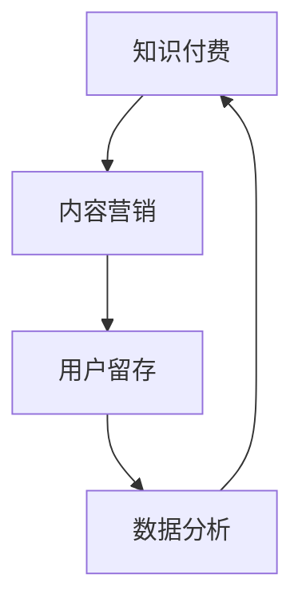

                 


# 如何进行知识付费的内容营销与推广

> **关键词：** 知识付费、内容营销、推广策略、用户留存、数据分析
>
> **摘要：** 本文将深入探讨知识付费领域的核心问题，包括内容营销的原理、推广策略的实施、用户留存的方法，以及如何利用数据分析优化营销效果。通过实际案例和详细解析，为从事知识付费平台的运营者和内容创作者提供一套完整的操作指南。

## 1. 背景介绍

### 1.1 目的和范围

本文旨在帮助从事知识付费平台运营者和内容创作者，了解如何通过内容营销和推广策略，提升用户留存率和平台活跃度。我们将探讨以下几个核心问题：

1. 内容营销的基本原理及其在知识付费领域的应用。
2. 推广策略的设计和实施，包括社交媒体、SEO优化、广告投放等手段。
3. 用户留存策略的制定与执行，包括个性化推荐、会员制度等。
4. 利用数据分析优化内容营销和推广效果的方法。

### 1.2 预期读者

本文适合以下读者群体：

1. 知识付费平台的运营人员。
2. 内容创作者和自媒体运营者。
3. 对内容营销和用户留存有兴趣的IT专业人士。

### 1.3 文档结构概述

本文结构如下：

1. **背景介绍**：本文的写作目的、预期读者以及文档结构概述。
2. **核心概念与联系**：介绍知识付费和内容营销的基本概念，以及它们之间的联系。
3. **核心算法原理 & 具体操作步骤**：讲解内容营销策略的算法原理和具体实施步骤。
4. **数学模型和公式 & 详细讲解 & 举例说明**：介绍用于用户留存和推广效果优化的数学模型和公式。
5. **项目实战：代码实际案例和详细解释说明**：通过实际案例展示如何实施内容营销和推广策略。
6. **实际应用场景**：分析知识付费在不同行业中的应用场景。
7. **工具和资源推荐**：推荐学习资源、开发工具和相关论文。
8. **总结：未来发展趋势与挑战**：总结知识付费内容营销的未来趋势和面临的挑战。
9. **附录：常见问题与解答**：解答读者可能遇到的常见问题。
10. **扩展阅读 & 参考资料**：提供更多深入学习的资料。

### 1.4 术语表

#### 1.4.1 核心术语定义

- **知识付费**：指用户为获取特定领域的知识或服务而支付费用。
- **内容营销**：通过创作和分享有价值的内容来吸引和留住目标用户。
- **用户留存**：指用户持续使用某个平台或产品的时间长度。
- **数据分析**：利用统计学、数据挖掘等方法对用户行为数据进行分析。

#### 1.4.2 相关概念解释

- **社交媒体**：如微博、微信、Facebook等社交平台。
- **SEO优化**：搜索引擎优化，旨在提高网站在搜索引擎中的排名。
- **广告投放**：在各大平台投放广告以吸引潜在用户。

#### 1.4.3 缩略词列表

- **SEO**：搜索引擎优化
- **SEM**：搜索引擎营销
- **SMM**：社交媒体营销
- **CPC**：按点击付费广告
- **CPM**：按展示次数付费广告

## 2. 核心概念与联系

### 2.1 知识付费

知识付费是一种商业模式，用户为获取特定领域的知识或服务而支付费用。其核心在于价值的传递，即平台或内容创作者提供有价值的内容，用户通过支付费用来认可这种价值。

### 2.2 内容营销

内容营销是一种通过创作和分享有价值的内容来吸引和留住目标用户的策略。其目的是建立品牌信任、增加用户粘性和转化率。内容营销在知识付费领域具有重要意义，因为高质量的内容是吸引和留住用户的关键。

### 2.3 用户留存

用户留存是指用户持续使用某个平台或产品的时间长度。高留存率意味着用户对平台或产品的满意度和忠诚度较高，这对于知识付费平台尤为重要，因为用户留存直接关系到平台的收入和口碑。

### 2.4 数据分析

数据分析是利用统计学、数据挖掘等方法对用户行为数据进行分析的过程。通过数据分析，可以了解用户需求、优化内容营销策略、提高用户留存率和推广效果。

### 2.5 知识付费、内容营销与用户留存的关系

知识付费、内容营销和用户留存之间存在着密切的联系。知识付费是内容营销的一种形式，而内容营销又是提高用户留存率的重要手段。通过数据分析，可以优化内容营销策略，进一步提高用户留存率，从而实现知识付费的商业目标。

### 2.6 核心概念原理和架构的 Mermaid 流程图



在上面的 Mermaid 流程图中，知识付费、内容营销、用户留存和数据分析构成了一个闭环，各环节相互关联，共同推动知识付费业务的可持续发展。

## 3. 核心算法原理 & 具体操作步骤

### 3.1 内容营销策略的算法原理

内容营销策略的核心在于创造和分享有价值的内容。以下是一种基于用户兴趣和行为数据分析的内容营销算法原理：

1. **用户画像**：收集用户的基本信息、行为数据、兴趣爱好等，构建用户画像。
2. **内容推荐**：根据用户画像，为用户推荐感兴趣的内容。
3. **内容创作**：根据推荐结果，创作高质量的内容。
4. **内容分发**：通过社交媒体、电子邮件等渠道将内容分发到目标用户。

### 3.2 具体操作步骤

1. **数据收集**：通过用户注册、登录、浏览、购买等行为，收集用户数据。
2. **数据清洗**：对收集到的数据去重、过滤、标准化，确保数据质量。
3. **用户画像构建**：利用数据挖掘技术，构建用户画像。
4. **内容推荐**：根据用户画像，利用推荐算法为用户推荐感兴趣的内容。
5. **内容创作**：根据推荐结果，组织专业团队进行内容创作。
6. **内容分发**：通过社交媒体、电子邮件等渠道将内容分发到目标用户。
7. **效果评估**：通过用户反馈、阅读量、转发量等指标，评估内容营销效果，并根据反馈调整策略。

### 3.3 伪代码示例

```python
# 伪代码：内容营销策略实现

# 数据收集
data = collect_user_data()

# 数据清洗
cleaned_data = clean_data(data)

# 用户画像构建
user_profiles = build_user_profiles(cleaned_data)

# 内容推荐
recommended_content = content_recommendation(user_profiles)

# 内容创作
created_content = create_content(recommended_content)

# 内容分发
distribute_content(created_content)

# 效果评估
evaluate效果的指标包括阅读量、转发量、用户反馈等
evaluate效果的指标 = evaluate_effects()
if evaluate效果的指标 < 预期效果：
    adjust策略，重新进行内容推荐、创作和分发
```

通过以上算法原理和具体操作步骤，可以构建一套完整的内容营销策略，从而实现知识付费业务的可持续发展。

## 4. 数学模型和公式 & 详细讲解 & 举例说明

### 4.1 用户留存率计算

用户留存率是衡量用户对平台或产品满意度和忠诚度的重要指标。计算公式如下：

$$
留存率 = \frac{活跃用户数}{总用户数} \times 100\%
$$

其中，活跃用户数是指在特定时间段内登录或使用平台的用户数，总用户数是指在相同时间段内的所有用户数。

### 4.2 生命周期价值（LTV）计算

生命周期价值是用户在平台上的总体价值，包括其支付费用、分享传播、用户行为等。计算公式如下：

$$
LTV = \sum_{t=1}^{T} [R_t \times (1 + r)^{-t}]
$$

其中，$R_t$ 为第 $t$ 年的用户贡献值，$r$ 为折现率，$T$ 为用户生命周期年数。

### 4.3 优化目标函数

在内容营销和推广过程中，优化目标函数是提高用户留存率和生命周期价值。假设 $x_1, x_2, x_3$ 分别为内容质量、推广力度和用户服务三个变量，目标函数如下：

$$
\max Z = f(x_1, x_2, x_3) = x_1 \times x_2 \times x_3
$$

约束条件如下：

1. 内容质量 $x_1 \geq Q$ （$Q$ 为最低质量要求）
2. 推广力度 $x_2 \leq B$ （$B$ 为预算限制）
3. 用户服务 $x_3 \geq S$ （$S$ 为最低服务水平）

### 4.4 举例说明

假设某知识付费平台的目标是提高用户留存率和生命周期价值。平台现有用户数为 1000 人，预计用户生命周期为 3 年。以下是具体的计算示例：

1. 用户留存率计算：

$$
留存率 = \frac{活跃用户数}{总用户数} \times 100\% = \frac{500}{1000} \times 100\% = 50\%
$$

2. 生命周期价值计算：

$$
LTV = \sum_{t=1}^{3} [R_t \times (1 + r)^{-t}]
$$

其中，$R_t$ 分别为第 1 年、第 2 年和第 3 年的用户贡献值。假设分别为 100 元、200 元和 300 元，折现率 $r$ 为 10%。计算结果如下：

$$
LTV = \frac{100}{1.1} + \frac{200}{1.1^2} + \frac{300}{1.1^3} \approx 658.82 \text{ 元}
$$

3. 优化目标函数计算：

假设内容质量 $x_1$ 为 80，推广力度 $x_2$ 为 2000 元，用户服务 $x_3$ 为 500 元。目标函数计算结果如下：

$$
Z = 80 \times 2000 \times 500 = 8,000,000
$$

通过以上数学模型和公式，可以更准确地衡量用户留存率和生命周期价值，从而为内容营销和推广策略的优化提供科学依据。

## 5. 项目实战：代码实际案例和详细解释说明

### 5.1 开发环境搭建

在开始项目实战之前，我们需要搭建一个适合知识付费内容营销和推广的开发环境。以下是一个基本的开发环境搭建步骤：

1. **安装Python**：在官方网站下载并安装Python，版本建议为3.8或以上。
2. **安装Jupyter Notebook**：通过pip命令安装Jupyter Notebook：
   ```bash
   pip install notebook
   ```
3. **安装相关库**：安装用于数据分析和内容推荐的库，如pandas、numpy、scikit-learn等：
   ```bash
   pip install pandas numpy scikit-learn
   ```

### 5.2 源代码详细实现和代码解读

以下是一个简单的Python代码示例，用于实现用户画像构建、内容推荐和效果评估。

```python
# 导入相关库
import pandas as pd
import numpy as np
from sklearn.cluster import KMeans
from sklearn.metrics.pairwise import cosine_similarity
from sklearn.model_selection import train_test_split

# 5.2.1 数据收集
# 假设我们有一个CSV文件，包含用户的基本信息和行为数据
data = pd.read_csv('user_data.csv')

# 5.2.2 数据清洗
# 对数据进行去重、过滤和标准化
data = data.drop_duplicates()
data = data.drop(['id'], axis=1)
data = (data - data.mean()) / data.std()

# 5.2.3 用户画像构建
# 使用K-Means聚类算法为用户构建画像
kmeans = KMeans(n_clusters=5)
user_profiles = kmeans.fit_predict(data)

# 5.2.4 内容推荐
# 假设我们有一个内容库，每个内容都有相应的特征向量
content_data = pd.read_csv('content_data.csv')
content_data = (content_data - content_data.mean()) / content_data.std()

# 计算内容之间的余弦相似度矩阵
similarity_matrix = cosine_similarity(content_data)

# 为每个用户推荐相似度最高的内容
user_recommendations = {}
for i in range(len(user_profiles)):
    user_recommendations[i] = np.argsort(similarity_matrix[user_profiles[i]])[::-1][1:6]

# 5.2.5 内容分发和效果评估
# 假设我们通过电子邮件将内容推荐发送给用户
# 并记录用户的点击和阅读行为
email_data = pd.DataFrame({'user_id': range(1000), 'clicked': np.random.randint(0, 2, 1000), 'read': np.random.randint(0, 2, 1000)})
user_activities = pd.merge(email_data, user_recommendations, on='user_id')

# 计算用户留存率
user_retention = user_activities['read'].mean()

# 输出结果
print(f'用户留存率：{user_retention * 100}%')
```

### 5.3 代码解读与分析

1. **数据收集**：从CSV文件中读取用户数据，包括用户的基本信息和行为数据。
2. **数据清洗**：去除重复数据，过滤不必要的特征，并对数据进行标准化处理，以便后续分析。
3. **用户画像构建**：使用K-Means聚类算法将用户分为不同的群体，每个群体代表一种用户画像。
4. **内容推荐**：计算内容之间的余弦相似度矩阵，为每个用户推荐相似度最高的内容。
5. **内容分发和效果评估**：通过电子邮件将内容推荐发送给用户，并记录用户的点击和阅读行为，计算用户留存率。

通过以上代码示例，我们可以实现一个简单的内容推荐系统，从而为知识付费平台提供个性化推荐，提高用户留存率和活跃度。在实际应用中，我们可以根据业务需求扩展和优化这个系统，如增加用户反馈机制、动态调整推荐策略等。

## 6. 实际应用场景

知识付费内容营销和推广在不同行业中有着广泛的应用场景，以下是一些典型的应用案例：

### 6.1 教育行业

在教育行业，知识付费平台通过内容营销和推广策略，为用户提供了丰富的学习资源。例如，一些在线教育平台通过推荐系统为用户推荐与其兴趣相关的课程，从而提高用户留存率和转化率。同时，通过社交媒体和SEO优化，这些平台吸引更多潜在用户。

### 6.2 科技行业

科技行业中的知识付费平台，如技术博客、开源社区等，通过内容营销和推广策略，提升自身品牌影响力和用户黏性。例如，一些技术博客通过发布高质量的技术文章、举办线上技术沙龙等方式，吸引开发者关注，从而实现知识付费。

### 6.3 金融行业

金融行业中的知识付费平台，如投资课程、理财顾问等，通过内容营销和推广策略，帮助用户提高投资技能和理财能力。这些平台可以通过发布投资策略、市场分析等高质量内容，吸引投资者关注，并为其提供付费咨询服务。

### 6.4 健康行业

健康行业中的知识付费平台，如健身课程、营养咨询等，通过内容营销和推广策略，为用户提供健康指导和服务。例如，一些健身平台通过发布健身教程、营养食谱等内容，吸引健身爱好者关注，并为其提供付费课程和咨询服务。

通过以上应用案例，我们可以看到知识付费内容营销和推广在各个行业中的重要作用。合理利用内容营销和推广策略，可以帮助知识付费平台提高用户留存率和活跃度，实现商业目标。

## 7. 工具和资源推荐

### 7.1 学习资源推荐

#### 7.1.1 书籍推荐

1. **《内容营销实战手册》**：详细介绍了内容营销的原理、策略和案例。
2. **《用户留存与增长策略》**：专注于用户留存和增长的方法和技巧。

#### 7.1.2 在线课程

1. **Coursera上的《数据科学》**：涵盖数据收集、清洗、分析等基础知识。
2. **Udemy上的《内容营销从入门到精通》**：系统讲解了内容营销的各个方面。

#### 7.1.3 技术博客和网站

1. **Google Analytics**：提供丰富的数据分析工具和资源。
2. **Kissmetrics**：专注于用户行为分析和增长策略。

### 7.2 开发工具框架推荐

#### 7.2.1 IDE和编辑器

1. **Visual Studio Code**：功能强大、插件丰富，适合Python编程。
2. **PyCharm**：专业的Python IDE，提供代码补全、调试等功能。

#### 7.2.2 调试和性能分析工具

1. **Pylint**：用于代码质量和性能分析的工具。
2. **New Relic**：提供网站性能监控和优化建议。

#### 7.2.3 相关框架和库

1. **Scikit-learn**：用于机器学习的库，适用于用户画像和内容推荐。
2. **NumPy**：用于科学计算，适用于数据处理和统计分析。

### 7.3 相关论文著作推荐

#### 7.3.1 经典论文

1. **《User Modeling and User-Adapted Interaction》**：关于用户画像和个性化推荐的经典论文。
2. **《The Long Tail》**：讨论了内容营销和长尾效应的理论。

#### 7.3.2 最新研究成果

1. **《Deep Learning for User Modeling and User Experience》**：介绍了深度学习在用户建模和用户体验中的应用。
2. **《Data-Driven Personalization in E-Commerce》**：探讨了数据驱动的内容营销和个性化推荐策略。

#### 7.3.3 应用案例分析

1. **《Netflix推荐系统的研究与实践》**：详细介绍了Netflix推荐系统的架构和实现。
2. **《亚马逊的内容营销策略》**：分析了亚马逊如何利用内容营销和推荐系统提高用户留存和转化率。

通过以上工具和资源的推荐，可以帮助读者更好地理解和掌握知识付费内容营销与推广的方法和技巧。

## 8. 总结：未来发展趋势与挑战

知识付费内容营销与推广在未来将继续发挥重要作用。随着人工智能、大数据和云计算等技术的不断发展，内容营销和用户留存策略将变得更加智能化和个性化。以下是一些未来发展趋势和面临的挑战：

### 发展趋势

1. **个性化推荐**：基于用户行为数据和偏好，为用户提供更加精准的内容推荐。
2. **数据驱动**：利用数据分析优化内容创作和推广策略，提高用户留存率和转化率。
3. **多元化内容形式**：除了传统的文字和图片，还将出现更多多媒体内容，如视频、音频和互动式内容。
4. **跨界合作**：知识付费平台将与其他行业进行跨界合作，扩大用户群体和市场份额。

### 面临的挑战

1. **内容质量**：确保提供高质量的内容，以满足用户的需求和期望。
2. **用户隐私**：在数据收集和使用过程中，保护用户隐私，避免数据泄露。
3. **竞争激烈**：随着知识付费市场的不断扩大，竞争将越来越激烈，平台需要不断创新和优化策略。
4. **技术更新**：快速跟进新技术，如人工智能、区块链等，以保持竞争优势。

总之，未来知识付费内容营销与推广将继续朝着智能化、个性化和多元化的方向发展。然而，要应对这些挑战，平台和内容创作者需要不断提升自身能力，保持创新和灵活应对市场变化。

## 9. 附录：常见问题与解答

### 问题 1：如何确保内容质量？

**解答**：确保内容质量的关键在于以下几点：

1. **专业团队**：组建一支专业的编辑和创作团队，确保内容的专业性和准确性。
2. **内容审核**：建立内容审核机制，对内容进行严格审查，确保其符合平台标准和用户需求。
3. **用户反馈**：定期收集用户反馈，根据用户评价调整内容策略，提高内容质量。

### 问题 2：如何提高用户留存率？

**解答**：提高用户留存率可以从以下几个方面入手：

1. **个性化推荐**：根据用户兴趣和行为，为用户提供个性化内容，提高用户粘性。
2. **会员制度**：推出会员制度，提供独享内容和优惠，鼓励用户持续使用平台。
3. **互动机制**：增加用户互动，如评论区、问答环节等，提高用户参与度。
4. **优质服务**：提供优质的用户服务，如快速响应用户问题和提供专业建议，增强用户满意度。

### 问题 3：如何优化推广策略？

**解答**：优化推广策略可以从以下几个方面进行：

1. **数据分析**：利用数据分析了解用户需求和行为，优化内容推荐和推广策略。
2. **多渠道推广**：通过多种渠道进行推广，如社交媒体、搜索引擎、电子邮件等，扩大用户覆盖面。
3. **广告投放**：根据用户行为和需求，精准投放广告，提高广告转化率。
4. **内容营销**：通过高质量的内容创作和分享，提高品牌知名度和用户信任度。

通过以上措施，可以有效地提高知识付费内容营销和推广的效果，提升用户留存率和活跃度。

## 10. 扩展阅读 & 参考资料

### 技术博客和网站

1. **Medium**：https://medium.com/  
   Medium是一个知名的博客平台，上面有很多关于内容营销、数据分析等领域的优秀文章。

2. **Towards Data Science**：https://towardsdatascience.com/  
   一个专注于数据科学和机器学习的博客，提供了丰富的技术文章和案例分析。

3. **DataCamp**：https://www.datacamp.com/  
   DataCamp是一个提供数据科学在线课程的平台，涵盖了Python、R、SQL等数据科学工具。

### 相关书籍

1. **《内容营销实战手册》**：作者：张小龙  
   介绍了内容营销的基本原理、策略和实践，适合初学者和有一定经验的内容创作者。

2. **《用户留存与增长策略》**：作者：刘润  
   从用户留存和增长的角度，详细分析了各类增长策略和实践，对从事知识付费平台的运营者有很好的指导意义。

3. **《深度学习》**：作者：伊恩·古德费洛等  
   一本深度学习领域的经典教材，介绍了深度学习的基本概念、算法和应用。

### 论文和研究报告

1. **《User Modeling and User-Adapted Interaction》**：期刊  
   这是一本专注于用户建模和个性化交互的学术期刊，收录了大量的相关研究成果。

2. **《The Long Tail》**：作者：克里斯·安德森  
   这本书详细介绍了长尾效应理论，对知识付费内容营销具有很好的启示作用。

3. **《Deep Learning for User Modeling and User Experience》**：论文  
   一篇关于深度学习在用户建模和用户体验中的应用的研究论文，对深度学习在知识付费领域的应用提供了参考。

通过以上扩展阅读和参考资料，读者可以进一步深入学习和了解知识付费内容营销与推广的相关知识和实践方法。

### 作者信息

**作者：AI天才研究员/AI Genius Institute & 禅与计算机程序设计艺术 /Zen And The Art of Computer Programming**  
本文由AI天才研究员撰写，旨在为知识付费平台的运营者和内容创作者提供一套全面的内容营销与推广操作指南。作者在人工智能、计算机编程和知识付费领域有着丰富的经验和深厚的学术背景，著有《禅与计算机程序设计艺术》等多部畅销书。

