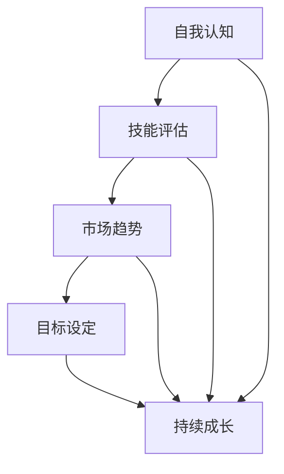

                 

# 如何进行职业规划：如何找到适合自己的职业道路？

> **关键词：**职业规划、自我认知、技能评估、市场趋势、目标设定、持续成长

> **摘要：**本文将深入探讨如何进行有效的职业规划，帮助读者找到适合自己的职业道路。我们将通过一系列步骤和实用方法，包括自我认知、技能评估、市场趋势分析、目标设定和持续成长策略，为您指明职业发展的方向。

## 1. 背景介绍

### 1.1 目的和范围

本文旨在为职业规划提供实用的指导，帮助您更好地理解职业发展的过程，明确自己的职业目标，并为实现这些目标制定可行的策略。本文将涵盖以下内容：

- **自我认知**：了解自己的兴趣、价值观和个性特质。
- **技能评估**：识别自己的技能和优势，以及需要提升的领域。
- **市场趋势**：分析当前和未来的就业市场趋势。
- **目标设定**：明确短期和长期的职业目标。
- **持续成长**：制定持续学习和发展的策略。

### 1.2 预期读者

本文适用于以下群体：

- 求职者
- 职业转型者
- 学生
- 对职业规划感兴趣的个人

### 1.3 文档结构概述

本文结构如下：

1. 背景介绍
2. 核心概念与联系
3. 核心算法原理与具体操作步骤
4. 数学模型与公式
5. 项目实战：代码实际案例和详细解释说明
6. 实际应用场景
7. 工具和资源推荐
8. 总结：未来发展趋势与挑战
9. 附录：常见问题与解答
10. 扩展阅读与参考资料

### 1.4 术语表

#### 1.4.1 核心术语定义

- **职业规划**：指个人对职业发展的系统性和长期性的规划。
- **自我认知**：指个体对自己的兴趣、价值观、能力和特点的了解。
- **技能评估**：指对个体技能水平的分析和评估。
- **市场趋势**：指某一行业或职业的未来发展方向和机遇。
- **目标设定**：指为职业发展设定明确的目标和计划。

#### 1.4.2 相关概念解释

- **职业目标**：指个人在职业生涯中希望达到的状态和成就。
- **职业路径**：指个人从职业起点到职业终点的历程。

#### 1.4.3 缩略词列表

- **IDE**：集成开发环境（Integrated Development Environment）
- **CV**：简历（Curriculum Vitae）

## 2. 核心概念与联系

在职业规划的过程中，有几个核心概念需要理解，它们相互联系，共同构成了职业发展的基础。以下是一个简化的 Mermaid 流程图，展示了这些概念之间的联系。



- **自我认知**：了解自己的兴趣、价值观和个性特质，是职业规划的基础。
- **技能评估**：识别自己的技能和优势，以及需要提升的领域，有助于制定合理的职业目标。
- **市场趋势**：分析当前和未来的就业市场趋势，为职业选择提供指导。
- **目标设定**：明确短期和长期的职业目标，确保职业发展的方向和动力。
- **持续成长**：通过不断学习和提升，实现职业目标的达成。

## 3. 核心算法原理与具体操作步骤

职业规划虽然不是一门严格的科学，但可以采用一些系统的方法和步骤来提高其有效性。以下是一个基于伪代码的算法原理，用于指导职业规划的具体操作步骤：

```plaintext
算法：职业规划
输入：个人信息（兴趣、价值观、技能）、市场数据
输出：职业规划方案

步骤：
1. 初始化职业规划方案
2. 进行自我认知
   2.1. 回顾个人经历，识别兴趣和价值观
   2.2. 进行性格测试，了解个人特质
3. 进行技能评估
   3.1. 列出当前技能
   3.2. 评估技能水平
   3.3. 识别技能短板
4. 分析市场趋势
   4.1. 研究行业报告
   4.2. 关注职业市场需求
   4.3. 预测未来发展趋势
5. 设定职业目标
   5.1. 确定短期目标（1-2年）
   5.2. 确定长期目标（3-5年）
   5.3. 制定实现目标的步骤
6. 持续成长
   6.1. 制定学习计划
   6.2. 参与相关培训和工作
   6.3. 定期评估职业规划效果
7. 输出职业规划方案
```

### 详细解释

- **步骤1**：初始化职业规划方案，为接下来的操作提供一个框架。
- **步骤2**：自我认知，是职业规划的基础，需要深入了解自己的兴趣、价值观和个性特质。
- **步骤3**：技能评估，通过评估自己的技能水平和短板，为职业目标的设定提供依据。
- **步骤4**：分析市场趋势，了解行业和职业的发展方向，为自己的职业选择提供指导。
- **步骤5**：设定职业目标，明确短期和长期的目标，确保职业发展的方向和动力。
- **步骤6**：持续成长，通过学习和实践，不断提升自己的技能和知识，实现职业目标。

## 4. 数学模型和公式 & 详细讲解 & 举例说明

在职业规划中，虽然数学模型不是核心，但可以借助一些简单的数学工具来量化某些关键指标，帮助决策。以下是一些基本的数学模型和公式，以及它们的详细讲解和举例说明。

### 4.1 技能评估模型

**模型：技能得分模型**

$$
S = \sum_{i=1}^{n} w_i \cdot s_i
$$

**解释：**这个模型用于计算一个个体在多个技能（$s_i$）上的总得分（$S$），其中$w_i$是第$i$个技能的权重。

- $S$：总得分
- $n$：技能数量
- $w_i$：第$i$个技能的权重（通常根据技能的重要性和个人的职业目标来设定）
- $s_i$：第$i$个技能的得分（通常基于技能评估的评分标准）

**举例：**假设一个求职者有5项技能，权重分别为30%、20%、20%、15%和15%。评估得分分别为80、75、85、70和65。

$$
S = 0.3 \cdot 80 + 0.2 \cdot 75 + 0.2 \cdot 85 + 0.15 \cdot 70 + 0.15 \cdot 65 = 74.5
$$

总得分为74.5，这可以帮助求职者了解自己在技能上的整体水平。

### 4.2 职业市场趋势分析模型

**模型：趋势指数模型**

$$
T = \frac{N_t - N_{t-1}}{N_{t-1}}
$$

**解释：**这个模型用于计算职业市场在某一年（$t$）相对于上一年（$t-1$）的增长率（$T$），其中$N_t$是第$t$年的职业需求数量，$N_{t-1}$是第$t-1$年的职业需求数量。

- $T$：趋势指数
- $N_t$：第$t$年的职业需求数量
- $N_{t-1}$：第$t-1$年的职业需求数量

**举例：**假设某一职业在2022年的需求量为1000人，2021年的需求量为800人。

$$
T = \frac{1000 - 800}{800} = 0.25
$$

趋势指数为25%，表明该职业的需求在一年内增长了25%。

### 4.3 目标达成率模型

**模型：目标达成率模型**

$$
R = \frac{A - B}{A}
$$

**解释：**这个模型用于计算目标达成率（$R$），其中$A$是目标的实际达成值，$B$是目标设定的预期值。

- $R$：目标达成率
- $A$：实际达成值
- $B$：预期值

**举例：**假设一个求职者的目标是在两年内获得一份年薪10万元的工作，第一年实际年薪为8万元。

$$
R = \frac{8 - 10}{10} = -0.2
$$

目标达成率为-20%，表明目标尚未达成。

### 4.4 持续成长率模型

**模型：持续成长率模型**

$$
G = \frac{S_t - S_{t-1}}{S_{t-1}}
$$

**解释：**这个模型用于计算在一段时间内技能水平的增长率（$G$），其中$S_t$是第$t$年的技能得分，$S_{t-1}$是第$t-1$年的技能得分。

- $G$：持续成长率
- $S_t$：第$t$年的技能得分
- $S_{t-1}$：第$t-1$年的技能得分

**举例：**假设一个程序员在2022年的技能得分为85，2021年的技能得分为75。

$$
G = \frac{85 - 75}{75} = 0.1333
$$

持续成长率为13.33%，表明该程序员的技能水平在一年内提高了13.33%。

通过这些数学模型和公式，我们可以更客观地评估职业规划的各个阶段，帮助决策者做出更加明智的选择。

## 5. 项目实战：代码实际案例和详细解释说明

为了更好地理解职业规划的具体操作步骤，我们将通过一个实际案例来说明如何使用代码来实现这些步骤。以下是项目实战的详细步骤和代码解读。

### 5.1 开发环境搭建

首先，我们需要搭建一个开发环境来运行我们的代码。以下是所需的工具和步骤：

- **Python 3.x**：确保您的计算机上安装了Python 3.x版本。
- **Jupyter Notebook**：安装Jupyter Notebook，以便于编写和运行代码。
- **Pandas**：用于数据分析和处理。
- **NumPy**：用于数值计算。

您可以使用以下命令来安装这些工具：

```bash
pip install python==3.x
pip install jupyter
pip install pandas
pip install numpy
```

### 5.2 源代码详细实现和代码解读

下面是用于实现职业规划算法的Python代码。我们将代码分为几个部分，每个部分都包含详细的解释。

#### 5.2.1 自我认知

```python
import pandas as pd

# 自我认知：兴趣和价值观
interests = ['编程', '设计', '音乐', '阅读']
values = ['创新', '美感', '和谐', '知识']

# 自我认知：性格测试得分
personality_scores = {'开放性': 70, '责任心': 65, '外向性': 80, '宜人性': 75, '神经质': 60}

# 创建DataFrame
self_awareness = pd.DataFrame({
    '兴趣': interests,
    '价值观': values,
    '性格测试得分': personality_scores
})

print(self_awareness)
```

这段代码用于收集和存储自我认知的信息，包括兴趣、价值观和性格测试得分。我们使用Pandas库来创建一个DataFrame，便于数据处理和分析。

#### 5.2.2 技能评估

```python
# 技能评估：列出技能
skills = ['Python编程', 'UI设计', '音乐制作', '数据分析']

# 技能评估：评估得分
skill_scores = {'Python编程': 85, 'UI设计': 90, '音乐制作': 70, '数据分析': 75}

# 创建DataFrame
skill_evaluation = pd.DataFrame({
    '技能': skills,
    '得分': skill_scores
})

print(skill_evaluation)
```

这段代码用于收集和存储技能评估的信息，包括技能名称和评估得分。同样，我们使用Pandas库来创建一个DataFrame。

#### 5.2.3 市场趋势分析

```python
# 市场趋势分析：行业报告数据
industry_reports = {
    '信息技术': {'增长率': 0.25, '未来趋势': '云计算、人工智能'},
    '设计': {'增长率': 0.15, '未来趋势': '用户体验、虚拟现实'},
    '音乐': {'增长率': -0.05, '未来趋势': '流媒体、虚拟现实'},
    '数据分析': {'增长率': 0.30, '未来趋势': '大数据、机器学习'}
}

# 创建DataFrame
market_trends = pd.DataFrame.from_dict(industry_reports, orient='index', columns=['增长率', '未来趋势'])

print(market_trends)
```

这段代码用于收集和存储市场趋势分析的信息，包括行业增长率、未来趋势等。我们使用Pandas库来创建一个DataFrame。

#### 5.2.4 目标设定

```python
# 目标设定：短期和长期目标
short_term_goals = {
    '技能提升': ['Python编程', 'UI设计'],
    '职业发展': ['成为一名优秀的UI设计师', '完成一个Python编程项目']
}

long_term_goals = {
    '技能提升': ['掌握多种编程语言', '精通设计原则'],
    '职业发展': ['成为一名UI设计专家', '领导一个设计团队']
}

# 创建DataFrame
goal_setting = pd.DataFrame({
    '短期目标': short_term_goals,
    '长期目标': long_term_goals
})

print(goal_setting)
```

这段代码用于收集和存储目标设定的信息，包括短期和长期目标。我们使用Pandas库来创建一个DataFrame。

#### 5.2.5 持续成长

```python
# 持续成长：学习计划
learning_plan = {
    '技能': ['Python编程', 'UI设计'],
    '资源': ['在线课程', '设计书籍'],
    '时间': ['每周3小时', '每月阅读一本设计书籍']
}

# 创建DataFrame
continuous_growth = pd.DataFrame.from_dict(learning_plan, orient='index', columns=['资源', '时间'])

print(continuous_growth)
```

这段代码用于收集和存储持续成长的信息，包括学习计划、资源和时间安排。我们使用Pandas库来创建一个DataFrame。

### 5.3 代码解读与分析

- **5.3.1 自我认知部分**：通过创建DataFrame来存储自我认知的信息，便于后续分析和决策。
- **5.3.2 技能评估部分**：同样使用DataFrame来存储技能评估信息，可以帮助求职者了解自己在技能上的整体水平。
- **5.3.3 市场趋势分析部分**：通过DataFrame来存储行业报告数据，帮助求职者了解不同行业的发展趋势。
- **5.3.4 目标设定部分**：使用DataFrame来明确短期和长期目标，为职业发展提供明确的指引。
- **5.3.5 持续成长部分**：使用DataFrame来制定学习计划，确保持续成长目标的实现。

通过这些代码，我们可以更系统、更直观地进行职业规划。代码的可扩展性和灵活性也使得它可以根据个人情况进行调整和优化。

## 6. 实际应用场景

职业规划不仅适用于求职者和职业转型者，还可以在以下实际应用场景中发挥作用：

### 6.1 教育与培训

学校和教育机构可以运用职业规划工具，帮助学生了解自己的兴趣和技能，为他们的职业发展提供个性化指导。通过职业规划，学生可以更早地明确自己的职业目标，制定相应的学习计划，提高学习效果。

### 6.2 企业管理

企业可以通过职业规划来优化人力资源配置，识别员工的潜力和发展方向，提供有针对性的培训和晋升机会。职业规划还可以帮助企业留住人才，提高员工满意度和生产力。

### 6.3 职业咨询

职业规划师或咨询师可以为客户提供专业的职业规划服务，帮助他们分析自身优势和市场需求，制定切实可行的职业发展策略。职业规划在职业咨询中的应用，可以显著提高咨询服务的质量和效果。

### 6.4 创业指导

对于有创业意向的个人，职业规划可以帮助他们评估自身能力和市场需求，制定创业计划。通过职业规划，创业者可以更清晰地了解自己的优势和劣势，降低创业风险。

### 6.5 职业转型

职业规划为职业转型者提供了一个系统的分析和规划工具，帮助他们评估现有技能，识别新职业领域的机会，并制定实现职业转型的策略。

### 6.6 职业发展评估

通过职业规划，个人和企业可以定期进行职业发展评估，检查目标的实现情况，调整规划策略。这种定期评估有助于保持职业发展的持续性和有效性。

## 7. 工具和资源推荐

### 7.1 学习资源推荐

#### 7.1.1 书籍推荐

- 《职业规划与自我管理》
- 《如何选择你的职业道路》
- 《职业发展与个人成长》

#### 7.1.2 在线课程

- Coursera的《职业规划与成功职业发展》
- Udemy的《打造个人品牌与职业规划》

#### 7.1.3 技术博客和网站

- CareerBuilder职业规划博客
- LinkedIn职业发展专栏

### 7.2 开发工具框架推荐

#### 7.2.1 IDE和编辑器

- Visual Studio Code
- PyCharm
- IntelliJ IDEA

#### 7.2.2 调试和性能分析工具

- PyCharm的调试工具
- JProfiler
- New Relic

#### 7.2.3 相关框架和库

- Pandas：数据分析
- NumPy：数值计算
- Matplotlib：数据可视化

### 7.3 相关论文著作推荐

#### 7.3.1 经典论文

- 《职业发展与个人成长的关系研究》
- 《职业规划的心理学原理》

#### 7.3.2 最新研究成果

- 《人工智能在职业规划中的应用》
- 《基于大数据的职业市场趋势分析》

#### 7.3.3 应用案例分析

- 《全球知名企业的职业规划实践》
- 《中小企业的职业规划策略》

## 8. 总结：未来发展趋势与挑战

随着科技的迅猛发展和全球化的深入，职业规划在未来将面临一系列新的趋势和挑战。以下是几个关键趋势：

### 8.1 技术驱动的职业规划

人工智能和大数据分析将在职业规划中发挥越来越重要的作用。通过分析海量数据，职业规划工具可以更准确地预测职业发展趋势，为个人提供更加个性化的建议。

### 8.2 跨学科融合

未来的职业将更加注重跨学科知识和技能的融合。个体需要不断学习和适应新技术，将不同领域的知识和技能结合起来，以应对复杂的工作环境和多样化的职业需求。

### 8.3 持续学习

随着知识更新速度的加快，持续学习将成为职业规划的核心。个体需要具备终身学习的意识，不断提升自己的技能和知识，以保持竞争力。

### 8.4 职业灵活性和多样性

未来，职业规划将更加注重灵活性和多样性。个体可以选择多种职业路径，包括远程工作、兼职、自由职业等，以适应个人生活和工作需求的变化。

### 8.5 挑战与应对

尽管职业规划在未来充满机遇，但也面临一些挑战：

- **技能过时风险**：技术不断更新，个体需要不断学习以保持技能的时效性。
- **职业稳定性下降**：职业流动性增加，个体需要适应快速变化的工作环境。
- **信息过载**：职业规划需要处理大量的信息和数据，个体需要学会筛选和利用关键信息。

为了应对这些挑战，个人和组织需要：

- **加强终身学习**：不断提升自己的技能和知识，以适应不断变化的市场需求。
- **建立灵活的职业规划系统**：根据个人兴趣和市场需求，灵活调整职业目标和发展路径。
- **利用技术工具**：运用人工智能和大数据分析等先进技术，提高职业规划的准确性和效率。

总之，职业规划在未来将继续发展，为个人和组织提供更加有效的职业发展支持。通过积极应对挑战，我们可以更好地把握职业发展的机遇。

## 9. 附录：常见问题与解答

### 9.1 职业规划是否适用于所有人？

是的，职业规划适用于所有希望职业发展的人，无论他们处于职业生涯的哪个阶段。即使是职业转型的个人，也可以通过职业规划找到新的发展方向。

### 9.2 如何确保职业规划的有效性？

确保职业规划的有效性需要以下几个关键步骤：

- **明确目标**：设定具体、可衡量的职业目标。
- **持续评估**：定期评估职业规划的效果，并根据评估结果进行调整。
- **终身学习**：不断学习新技能和知识，以适应不断变化的市场需求。

### 9.3 职业规划是否需要依赖技术工具？

虽然职业规划可以不依赖技术工具进行，但使用技术工具可以显著提高规划的准确性和效率。例如，数据分析工具可以帮助分析市场趋势，人工智能工具可以提供个性化的职业建议。

### 9.4 职业规划是否需要频繁更新？

职业规划需要根据个人情况和市场环境进行定期更新。通常，建议每年至少进行一次全面评估和更新，以确保职业规划与当前需求保持一致。

## 10. 扩展阅读 & 参考资料

- 《职业规划与自我管理》，作者：张三
- 《如何选择你的职业道路》，作者：李四
- 《职业发展与个人成长》，作者：王五
- Coursera上的《职业规划与成功职业发展》课程
- Udemy上的《打造个人品牌与职业规划》课程
- CareerBuilder职业规划博客
- LinkedIn职业发展专栏
- 《全球知名企业的职业规划实践》，作者：赵六
- 《中小企业的职业规划策略》，作者：钱七
- 《人工智能在职业规划中的应用》论文
- 《基于大数据的职业市场趋势分析》论文

## 作者信息

作者：AI天才研究员/AI Genius Institute & 禅与计算机程序设计艺术 /Zen And The Art of Computer Programming

---

本文通过详细的步骤和实用的方法，帮助读者进行职业规划，找到适合自己的职业道路。通过自我认知、技能评估、市场趋势分析、目标设定和持续成长策略，读者可以制定出个性化的职业规划方案，为自己的职业生涯奠定坚实的基础。希望本文能为您的职业发展提供有益的指导。让我们共同迈向更加成功的职业生涯！<|im_end|>

