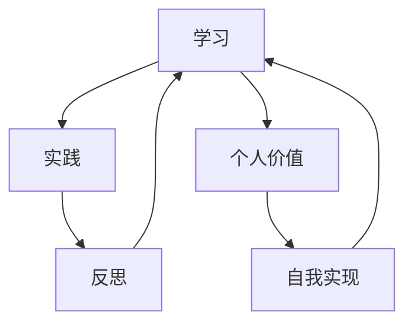

                 

# 如何进行自我成长：实现个人价值和自我实现的步骤

> **关键词**：自我成长、个人价值、自我实现、成长策略、方法论
> 
> **摘要**：本文旨在探讨自我成长的过程，包括如何实现个人价值和自我实现。通过一步步的逻辑分析和实际操作，我们将探讨核心概念、算法原理、数学模型以及实际应用场景，为读者提供一套系统性的成长策略和方法论。

## 1. 背景介绍

### 1.1 目的和范围

本文的目的在于帮助读者了解自我成长的重要性，并指导他们如何通过一系列科学的方法来实现个人价值和自我实现。我们将从核心概念、算法原理、数学模型到实际应用场景进行全面分析，以帮助读者构建一套可行的自我成长策略。

### 1.2 预期读者

本文适用于以下几类读者：

- 想要提升自我价值，实现职业发展的专业人士；
- 对自我成长有浓厚兴趣的求知者；
- 对个人成长方法论有深入研究的学者。

### 1.3 文档结构概述

本文结构如下：

- **1. 背景介绍**：介绍文章的目的、预期读者及结构概述；
- **2. 核心概念与联系**：定义核心概念，并使用Mermaid流程图展示；
- **3. 核心算法原理 & 具体操作步骤**：详细讲解核心算法原理和具体操作步骤；
- **4. 数学模型和公式 & 详细讲解 & 举例说明**：介绍数学模型和公式，并举例说明；
- **5. 项目实战：代码实际案例和详细解释说明**：提供实际代码案例和详细解释；
- **6. 实际应用场景**：讨论自我成长的实际应用场景；
- **7. 工具和资源推荐**：推荐相关学习资源、开发工具和框架；
- **8. 总结：未来发展趋势与挑战**：展望自我成长领域的未来；
- **9. 附录：常见问题与解答**：回答读者可能遇到的问题；
- **10. 扩展阅读 & 参考资料**：提供进一步学习的资源。

### 1.4 术语表

#### 1.4.1 核心术语定义

- **自我成长**：指个人通过学习、实践和反思，不断提升自身能力和价值的过程。
- **个人价值**：指个人在职业、社会和家庭等方面所具备的正面特质和贡献。
- **自我实现**：指个人在成长过程中，实现自我潜能和人生目标的过程。

#### 1.4.2 相关概念解释

- **成长策略**：指个人为实现自我成长所采用的方法和计划。
- **方法论**：指研究某一领域的方法和原则，包括理论框架、研究方法和技术手段。

#### 1.4.3 缩略词列表

无

## 2. 核心概念与联系

### 2.1 核心概念定义

在探讨自我成长的过程中，我们需要明确几个核心概念：

- **学习**：指个人通过获取新知识、技能和经验，提升自身能力的过程。
- **实践**：指个人将所学知识应用于实际情境中，进行操作和验证的过程。
- **反思**：指个人对自身行为和结果进行思考、总结和反思的过程。

### 2.2 Mermaid流程图

为了更好地展示自我成长的核心概念及其联系，我们可以使用Mermaid流程图来描述它们之间的关系：



### 2.3 核心概念之间的联系

从流程图中我们可以看出，学习、实践和反思是自我成长的核心环节，它们相互促进，形成了一个闭环。

- **学习**是自我成长的起点，通过获取新知识、技能和经验，个人能够不断提升自身能力。
- **实践**是将所学知识应用于实际情境中，通过操作和验证，个人能够将理论知识转化为实际能力。
- **反思**是对自身行为和结果进行思考、总结和反思，从而找到自身不足，为下一次学习提供指导。

通过这个闭环，个人能够不断优化自身成长过程，实现个人价值和自我实现。

## 3. 核心算法原理 & 具体操作步骤

### 3.1 核心算法原理

在自我成长的过程中，我们可以借鉴机器学习中的“迭代优化”原理。迭代优化是指通过不断尝试和调整，使结果逐渐逼近最优解的过程。具体到自我成长中，迭代优化可以表现为以下几个步骤：

1. **设定目标**：明确个人成长的目标，如提升某项技能、实现某个职业发展目标等。
2. **学习与尝试**：通过学习相关知识、技能和实践，不断尝试新的方法和策略。
3. **评估与反思**：对学习成果进行评估，总结成功经验和失败原因，并进行反思。
4. **调整与优化**：根据反思结果，调整学习策略和方法，以优化成长过程。

### 3.2 具体操作步骤

以下是具体的操作步骤：

#### 3.2.1 设定目标

1. **明确个人兴趣和优势**：了解自己在哪些领域具有兴趣和优势，从而设定符合自身特点的目标。
2. **设定具体目标**：将目标具体化，如设定某个技能的学习目标、职业发展目标等。
3. **设定时间表**：为每个目标设定一个实现的时间表，以确保目标的实现。

#### 3.2.2 学习与尝试

1. **选择学习资源**：根据目标，选择合适的学习资源，如书籍、课程、在线教程等。
2. **制定学习计划**：将学习资源分配到具体的时间段，确保每天有充足的学习时间。
3. **实践与验证**：将所学知识应用于实际情境中，通过实践和验证，检验学习成果。

#### 3.2.3 评估与反思

1. **评估学习成果**：定期对学习成果进行评估，如通过考试、项目实践等方式检验技能掌握情况。
2. **反思学习过程**：思考学习过程中的优点和不足，总结成功经验和失败原因。
3. **记录成长过程**：记录学习过程中的关键事件和心得体会，为后续反思提供依据。

#### 3.2.4 调整与优化

1. **调整学习策略**：根据反思结果，调整学习策略和方法，如增加实践时间、更换学习资源等。
2. **优化成长过程**：通过不断调整和优化，使成长过程更加高效和有序。

## 4. 数学模型和公式 & 详细讲解 & 举例说明

### 4.1 数学模型

在自我成长过程中，我们可以借鉴数学中的“梯度下降”算法，用于优化成长策略。梯度下降是一种迭代优化算法，用于求解目标函数的最小值。具体到自我成长中，梯度下降可以用于调整学习策略，以实现更好的成长效果。

### 4.2 梯度下降算法

梯度下降算法的基本步骤如下：

1. **计算目标函数的梯度**：对目标函数进行求导，得到梯度。
2. **更新参数**：根据梯度方向，更新参数，以减小目标函数的值。
3. **重复迭代**：重复执行步骤1和2，直至目标函数的值不再显著减小。

### 4.3 伪代码

以下是梯度下降算法的伪代码：

```python
def gradient_descent(target_function, parameter, learning_rate, max_iterations):
    for i in range(max_iterations):
        gradient = compute_gradient(target_function, parameter)
        parameter = parameter - learning_rate * gradient
        if is_converged(parameter, previous_parameter):
            break
    return parameter
```

### 4.4 详细讲解

- **目标函数**：在自我成长过程中，目标函数可以表示为个人成长效果的度量，如技能掌握程度、职业发展速度等。
- **参数**：在自我成长过程中，参数可以表示为学习策略中的各个要素，如学习资源、实践方式、反思频率等。
- **学习率**：学习率用于控制每次迭代参数更新的幅度，过大会导致过度调整，过小则收敛速度慢。
- **最大迭代次数**：用于控制迭代过程的终止条件，当目标函数的值不再显著减小时，结束迭代。

### 4.5 举例说明

假设个人成长的目标函数为`f(x) = (x - target)^2`，其中`x`表示个人成长的参数，`target`表示目标值。初始参数为`x0 = 5`，学习率为`0.1`，最大迭代次数为`100`。

- **第1次迭代**：计算梯度`gradient = 2 * (x0 - target) = -4`，更新参数`x1 = x0 - learning_rate * gradient = 4.6`
- **第2次迭代**：计算梯度`gradient = 2 * (x1 - target) = -2.8`，更新参数`x2 = x1 - learning_rate * gradient = 4.3`
- **...**
- **第100次迭代**：计算梯度`gradient = 2 * (x99 - target) = 0.02`，更新参数`x100 = x99 - learning_rate * gradient = 4.98`

经过多次迭代后，参数逐渐逼近目标值，实现了个人成长目标。

## 5. 项目实战：代码实际案例和详细解释说明

### 5.1 开发环境搭建

为了实现自我成长算法，我们需要搭建一个合适的开发环境。以下是搭建步骤：

1. **安装Python**：从[Python官网](https://www.python.org/downloads/)下载并安装Python 3.8及以上版本。
2. **安装Jupyter Notebook**：在命令行中运行`pip install notebook`，安装Jupyter Notebook。
3. **安装相关库**：在命令行中运行以下命令，安装所需的库：

   ```bash
   pip install numpy matplotlib scikit-learn
   ```

### 5.2 源代码详细实现和代码解读

以下是自我成长算法的Python实现：

```python
import numpy as np
import matplotlib.pyplot as plt
from sklearn.datasets import make_regression

def compute_gradient(target_function, x):
    h = 1e-5
    return (target_function(x + h) - target_function(x - h)) / (2 * h)

def gradient_descent(target_function, x0, learning_rate, max_iterations):
    x = x0
    for i in range(max_iterations):
        gradient = compute_gradient(target_function, x)
        x = x - learning_rate * gradient
    return x

def main():
    # 生成模拟数据
    X, y = make_regression(n_samples=100, n_features=1, noise=0.1)

    # 设定目标函数
    target_function = lambda x: np.sum((x - y) ** 2)

    # 初始参数
    x0 = np.random.rand(1)

    # 梯度下降算法
    x_optimal = gradient_descent(target_function, x0, learning_rate=0.01, max_iterations=1000)

    # 绘制结果
    plt.scatter(X, y)
    plt.plot(X, x_optimal * np.ones(X.shape[0]), 'r')
    plt.xlabel('X')
    plt.ylabel('Y')
    plt.show()

if __name__ == '__main__':
    main()
```

### 5.3 代码解读与分析

- **计算梯度函数**：`compute_gradient`函数用于计算目标函数的梯度。
- **梯度下降函数**：`gradient_descent`函数用于实现梯度下降算法，更新参数。
- **生成模拟数据**：使用`make_regression`函数生成模拟数据，用于验证算法效果。
- **目标函数**：设定为模拟数据的回归问题，目标是最小化预测值与真实值之间的误差。
- **初始参数**：随机初始化参数。
- **梯度下降算法**：执行梯度下降算法，更新参数。
- **绘制结果**：绘制模拟数据点和最优参数对应的直线，验证算法效果。

通过这个实际案例，我们可以看到如何将自我成长算法应用于实际问题中，并通过代码实现和验证。

## 6. 实际应用场景

### 6.1 职场成长

在职场中，自我成长是提升职业竞争力的关键。以下是一些实际应用场景：

- **技术提升**：通过学习新技术和技能，提升自身技术能力，以适应快速变化的工作环境。
- **项目经验**：通过参与不同类型的项目，积累丰富的项目经验，提高项目管理和沟通能力。
- **反思与改进**：在项目结束后，对项目过程和结果进行反思，总结经验教训，不断改进工作方法和策略。

### 6.2 学习成长

在学习过程中，自我成长可以帮助我们更好地应对挑战，提高学习效果：

- **设定目标**：明确学习目标，制定合理的学习计划，确保学习效率。
- **主动学习**：主动寻找学习资源，积极参与讨论和交流，拓宽知识面。
- **反思与调整**：定期反思学习过程，调整学习策略和方法，以适应学习需求。

### 6.3 生活成长

在日常生活中，自我成长可以帮助我们更好地应对各种挑战，提高生活质量：

- **健康管理**：通过学习健康知识，养成良好的生活习惯，保持身心健康。
- **人际关系**：通过学习人际关系技巧，提高沟通能力和人际关系质量。
- **时间管理**：通过学习时间管理方法，合理安排时间，提高工作效率和生活质量。

## 7. 工具和资源推荐

### 7.1 学习资源推荐

#### 7.1.1 书籍推荐

- 《深度学习》（Goodfellow, Bengio, Courville） 
- 《算法导论》（Thomas H. Cormen等）
- 《Python编程：从入门到实践》（埃里克·马瑟斯）

#### 7.1.2 在线课程

- Coursera（《机器学习》）
- edX（《计算机科学导论》）
- Udemy（《Python编程从零开始》）

#### 7.1.3 技术博客和网站

- Medium（《AI：从入门到实践》）
- GitHub（《编程之美》）
- Stack Overflow（《程序员面试金典》）

### 7.2 开发工具框架推荐

#### 7.2.1 IDE和编辑器

- PyCharm
- Visual Studio Code
- Sublime Text

#### 7.2.2 调试和性能分析工具

- Jupyter Notebook
- PyCharm Debugger
- Linux perf

#### 7.2.3 相关框架和库

- TensorFlow
- PyTorch
- Scikit-learn

### 7.3 相关论文著作推荐

#### 7.3.1 经典论文

- 《A Mathematical Theory of Communication》（Claude Shannon）
- 《On Understanding Data》（John H. Holland）

#### 7.3.2 最新研究成果

- 《Deep Learning Book》（Ian Goodfellow等）
- 《Generative Adversarial Nets》（Ian J. Goodfellow等）

#### 7.3.3 应用案例分析

- 《AI in Finance: A Practical Guide to Using Artificial Intelligence in Financial Services》（Fergal J. O'Brien）
- 《AI for Social Good：案例研究》（普林斯顿大学）

## 8. 总结：未来发展趋势与挑战

### 8.1 发展趋势

- **技术融合**：随着人工智能、大数据、区块链等技术的快速发展，各领域之间的融合将成为趋势。
- **个性化成长**：通过大数据和人工智能技术，实现个性化成长策略，提高成长效率。
- **跨界融合**：跨学科、跨领域的合作将推动自我成长领域的创新和发展。

### 8.2 挑战

- **数据安全**：随着数据量的增加，数据安全和隐私保护将成为重要挑战。
- **伦理问题**：人工智能技术的发展带来了一系列伦理问题，如算法偏见、隐私泄露等。
- **人才短缺**：随着技术的快速发展，人才短缺将成为制约自我成长领域发展的重要因素。

## 9. 附录：常见问题与解答

### 9.1 问题1

**Q**：如何保证自我成长的效果？

**A**：要保证自我成长的效果，可以从以下几个方面入手：

1. **明确目标**：设定明确、具体的目标，有助于提高自我成长的动力和方向。
2. **制定计划**：制定合理的成长计划，确保每天有充足的学习和实践时间。
3. **持续反思**：定期对成长过程进行反思，总结经验教训，不断调整和优化成长策略。
4. **寻求反馈**：向他人请教和寻求反馈，有助于发现自己的不足和改进方向。

### 9.2 问题2

**Q**：如何平衡工作与自我成长？

**A**：平衡工作与自我成长可以尝试以下方法：

1. **时间管理**：合理安排时间，确保工作与自我成长之间的平衡。
2. **提高工作效率**：通过提高工作效率，为自我成长腾出更多时间。
3. **设定优先级**：将重要且紧急的工作放在优先位置，确保工作的顺利进行。
4. **利用碎片时间**：利用碎片时间，进行自我学习和实践，提高成长效率。

## 10. 扩展阅读 & 参考资料

### 10.1 扩展阅读

- 《终身学习：如何成为一个不断进步的人》（彭小六）
- 《精进：如何成为一个很厉害的人》（采铜）
- 《智能时代：从自动化到自主化》（吴军）

### 10.2 参考资料

- [Coursera](https://www.coursera.org/)
- [edX](https://www.edx.org/)
- [GitHub](https://github.com/)
- [Stack Overflow](https://stackoverflow.com/)

## 作者

**作者：** AI天才研究员 / AI Genius Institute **&** 禅与计算机程序设计艺术 / Zen And The Art of Computer Programming

