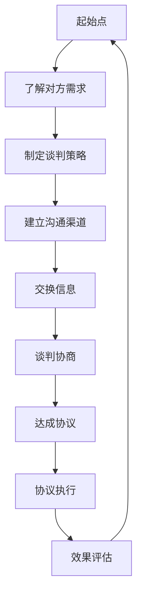

                 

# 如何进行谈判技巧：如何有效地进行谈判和沟通？

> **关键词：谈判技巧、沟通策略、利益最大化、心理战术、有效协商**
>
> **摘要：本文旨在深入探讨谈判的基本原理和技巧，通过逻辑分析和实例说明，帮助读者理解如何进行有效的谈判和沟通。文章从背景介绍、核心概念、算法原理、数学模型、实战案例、应用场景、工具资源等多个方面进行详细阐述。**

## 1. 背景介绍

### 1.1 目的和范围

本文的目标是提供一套系统的谈判技巧，帮助读者在实际生活中或商业场合中更好地进行谈判和沟通。本文将涵盖以下几个方面：

1. 谈判的基本概念和原则
2. 沟通策略和心理战术
3. 数学模型和算法原理
4. 实战案例和代码实现
5. 应用场景和工具推荐

### 1.2 预期读者

本文适合以下读者群体：

1. 商业人士和企业家
2. 技术经理和项目经理
3. 需要频繁进行谈判的个人和团队
4. 对谈判和沟通技巧感兴趣的普通读者

### 1.3 文档结构概述

本文将按照以下结构进行展开：

1. **背景介绍**：概述谈判的重要性，以及本文的目标和预期读者。
2. **核心概念与联系**：介绍谈判的核心概念，并通过Mermaid流程图展示关键联系。
3. **核心算法原理 & 具体操作步骤**：详细讲解谈判中的算法原理和操作步骤。
4. **数学模型和公式 & 详细讲解 & 举例说明**：阐述数学模型在谈判中的应用。
5. **项目实战：代码实际案例和详细解释说明**：通过实际代码案例展示谈判技巧的应用。
6. **实际应用场景**：分析谈判技巧在不同场景下的应用。
7. **工具和资源推荐**：推荐学习资源和开发工具。
8. **总结：未来发展趋势与挑战**：总结本文内容，展望未来。
9. **附录：常见问题与解答**：回答读者可能遇到的问题。
10. **扩展阅读 & 参考资料**：提供进一步的阅读材料。

### 1.4 术语表

#### 1.4.1 核心术语定义

- **谈判**：指双方或多方在特定条件下，为达成共识而进行的沟通和协商过程。
- **沟通策略**：在谈判过程中，为实现特定目标而采取的信息传递方式和手段。
- **心理战术**：通过心理手段影响对方决策和行为的方法。
- **利益最大化**：在谈判中追求自身利益的最大化。

#### 1.4.2 相关概念解释

- **双赢谈判**：指双方都能从谈判中获得利益，实现共同获益的目标。
- **博弈论**：研究决策者如何在策略互动中做出合理决策，以最大化自身利益。

#### 1.4.3 缩略词列表

- **NLP**：自然语言处理（Natural Language Processing）
- **AI**：人工智能（Artificial Intelligence）
- **IDE**：集成开发环境（Integrated Development Environment）
- **DB**：数据库（Database）

## 2. 核心概念与联系

在谈判过程中，有几个核心概念和联系是至关重要的。下面我们将通过Mermaid流程图展示这些概念和它们之间的联系。



### 2.1 谈判流程

- **了解对方需求**：谈判的起点是了解对方的利益和需求。
- **制定谈判策略**：基于对方需求，制定合理的谈判策略。
- **建立沟通渠道**：选择适当的沟通方式，确保信息传递准确无误。
- **交换信息**：双方在沟通中交换信息，以便更好地了解对方立场。
- **谈判协商**：在交换信息的基础上，进行实际的谈判协商。
- **达成协议**：通过协商，达成双方都能接受的协议。
- **协议执行**：协议达成后，双方需按协议执行，确保协议得到落实。
- **效果评估**：评估协议执行的效果，以便进行后续的调整和优化。

### 2.2 关键概念联系

- **需求与策略**：了解对方需求有助于制定更有效的谈判策略。
- **沟通与信息**：有效的沟通是信息交换的基础，也是达成协议的关键。
- **协商与协议**：协商是谈判的核心，协议是协商的结果。
- **执行与评估**：协议执行和效果评估是确保谈判成功的重要环节。

通过上述流程和概念的联系，我们可以看到，谈判是一个系统性的过程，涉及多个环节和步骤。理解这些核心概念和联系，对于有效地进行谈判至关重要。

## 3. 核心算法原理 & 具体操作步骤

在谈判过程中，算法原理和操作步骤是实现有效沟通和协商的关键。下面，我们将通过伪代码详细阐述谈判的核心算法原理和具体操作步骤。

### 3.1 谈判算法原理

```plaintext
谈判算法（negotiation_algorithm）
输入：谈判参与者（participants），谈判目标（goals）
输出：谈判结果（result）

步骤：
1. 初始化谈判状态（state）为初始状态
2. 对每个参与者，收集其需求和目标（requirements and goals）
3. 对每个参与者，评估其谈判策略（strategy）
4. 建立谈判协商机制（negotiation_mechanism）
5. 循环执行以下步骤：
   a. 对每个参与者，更新谈判状态
   b. 对每个参与者，根据谈判状态更新其策略
   c. 在协商机制中交换信息，并协商谈判事项
   d. 如果达成一致，则结束循环
6. 输出最终谈判结果
```

### 3.2 谈判操作步骤

#### 3.2.1 初始化谈判状态

```plaintext
初始化谈判状态（initialize_state）
输入：谈判参与者（participants），谈判目标（goals）
输出：谈判状态（state）

步骤：
1. 创建空的状态字典（state_dict）
2. 将每个参与者的初始需求添加到状态字典中
3. 根据谈判目标，初始化其他谈判参数（如时间限制、成本限制等）
4. 返回初始化后的谈判状态
```

#### 3.2.2 收集需求和目标

```plaintext
收集需求和目标（collect_requirements_and_goals）
输入：谈判参与者（participants）
输出：需求列表（requirements），目标列表（goals）

步骤：
1. 初始化需求列表和目标列表
2. 对每个参与者，获取其需求和目标
3. 将获取的需求和目标添加到需求列表和目标列表
4. 返回需求列表和目标列表
```

#### 3.2.3 评估谈判策略

```plaintext
评估谈判策略（evaluate_strategy）
输入：谈判参与者（participants），当前谈判状态（state）
输出：策略评估结果（strategy_evaluation）

步骤：
1. 初始化策略评估结果字典
2. 对每个参与者，根据当前谈判状态评估其策略的有效性
3. 根据评估结果，更新策略评估结果字典
4. 返回策略评估结果字典
```

#### 3.2.4 建立谈判协商机制

```plaintext
建立谈判协商机制（establish_negotiation_mechanism）
输入：谈判参与者（participants），谈判状态（state）
输出：协商机制（mechanism）

步骤：
1. 初始化协商机制
2. 为每个参与者分配协商时间
3. 设置协商机制中的谈判事项列表
4. 返回协商机制
```

#### 3.2.5 更新谈判状态

```plaintext
更新谈判状态（update_state）
输入：当前谈判状态（state），参与者策略（strategies）
输出：更新后的谈判状态（state）

步骤：
1. 根据参与者策略，更新状态字典中的需求、目标和其他谈判参数
2. 返回更新后的谈判状态
```

#### 3.2.6 谈判协商

```plaintext
谈判协商（negotiation）
输入：协商机制（mechanism），谈判状态（state）
输出：协商结果（result）

步骤：
1. 在协商机制中，对每个谈判事项进行协商
2. 根据协商结果，更新谈判状态
3. 如果达成一致，则返回协商结果
4. 否则，继续循环协商，直到达成一致或超过协商时间限制
```

通过上述算法原理和操作步骤，我们可以看到，谈判是一个复杂但有序的过程。通过合理的算法设计和操作步骤，可以有效地提高谈判的成功率和效率。

## 4. 数学模型和公式 & 详细讲解 & 举例说明

### 4.1 数学模型

在谈判过程中，数学模型可以帮助我们量化谈判的各个阶段，从而更好地进行决策和策略制定。以下是一个基本的数学模型，用于描述谈判的动态过程。

#### 4.1.1 谈判博弈模型

假设有两个参与者A和B，他们分别有自己的目标函数和约束条件。我们可以使用博弈论中的纳什均衡（Nash Equilibrium）来描述他们的策略选择。

- **参与者A的目标函数**：最大化自己的利益（效用）\( U_A \)
- **参与者B的目标函数**：最大化自己的利益（效用）\( U_B \)

#### 4.1.2 纳什均衡

纳什均衡是指，在博弈中，每个参与者选择一个策略，使得其他参与者无法通过单方面的策略调整来改善自己的利益。用数学语言描述，即对于每个参与者i，有：

\[ U_i(S_i, S_{-i}) = \max_{S_i} U_i(S_i, S_{-i}) \]

其中，\( S_i \) 表示参与者i的策略，\( S_{-i} \) 表示其他参与者的策略。

### 4.2 公式和详细讲解

#### 4.2.1 谈判效用函数

谈判效用函数是描述参与者利益的关键。我们可以使用以下公式来表示：

\[ U(A, B) = f(A, B) - c(A, B) \]

其中：

- \( f(A, B) \) 是双方合作的利益函数，表示合作带来的总利益。
- \( c(A, B) \) 是合作的成本函数，表示合作带来的成本。

#### 4.2.2 利益分享比例

在谈判中，双方需要确定利益分享比例。我们可以使用以下公式来计算：

\[ \alpha = \frac{U_B}{U_A + U_B} \]

其中，\( \alpha \) 表示参与者B分享的利益比例。

### 4.3 举例说明

假设有两个参与者A和B，他们分别有自己的目标函数和约束条件。参与者A的目标是最大化自己的利益，参与者B的目标是确保自己的利益不低于一定的阈值。

#### 4.3.1 目标函数

参与者A的目标函数可以表示为：

\[ U_A = \max x_A \]

其中，\( x_A \) 是参与者A的利益。

参与者B的目标函数可以表示为：

\[ U_B = \max (x_B - \delta) \]

其中，\( x_B \) 是参与者B的利益，\( \delta \) 是参与者B的最低利益阈值。

#### 4.3.2 谈判过程

1. **初始阶段**：双方了解对方的目标函数和约束条件。

2. **第一阶段协商**：参与者A提出一个利益分配方案，参与者B评估该方案，并根据自身的目标函数进行调整。

3. **第二阶段协商**：参与者B根据参与者A的调整，提出一个新的利益分配方案，参与者A评估该方案，并继续调整。

4. **达成协议**：在多个回合的协商后，双方最终达成一个利益分配方案，使得双方的利益都得到最大化。

假设在某个回合，参与者A提出的利益分配方案是 \( x_A = 100 \)，参与者B提出的利益分配方案是 \( x_B = 200 \)。

1. **计算参与者A的效用**：

\[ U_A = 100 - c_A \]

其中，\( c_A \) 是参与者A的合作成本。

2. **计算参与者B的效用**：

\[ U_B = 200 - \delta - c_B \]

其中，\( c_B \) 是参与者B的合作成本。

3. **计算利益分享比例**：

\[ \alpha = \frac{U_B}{U_A + U_B} = \frac{200 - \delta - c_B}{100 - c_A + 200 - \delta - c_B} \]

通过上述过程，我们可以看到，谈判是一个动态的过程，涉及多个回合的协商和调整。通过合理的利益分配方案和协商策略，可以实现双方利益的最大化。

## 5. 项目实战：代码实际案例和详细解释说明

为了更好地理解谈判技巧在实际项目中的应用，我们将通过一个实际案例来展示如何使用代码实现谈判过程。该案例将模拟两个参与者（A和B）之间的谈判，并使用伪代码来详细解释每个步骤。

### 5.1 开发环境搭建

在开始编写代码之前，我们需要搭建一个合适的环境。以下是一个基本的开发环境搭建步骤：

1. **安装Python环境**：确保安装了Python 3.x版本，可以通过官方网站下载安装包。
2. **安装PyCharm或VSCode**：选择一个适合自己的IDE，并配置Python插件。
3. **创建新项目**：在IDE中创建一个新项目，并添加以下基本文件：

   - `negotiation.py`：主要代码文件，包含谈判算法的实现。
   - `requirements.txt`：项目依赖文件，列出所有必需的Python库。
   - `test_cases.py`：测试用例文件，用于验证谈判算法的有效性。

### 5.2 源代码详细实现和代码解读

下面是`negotiation.py`文件的源代码实现，并对其进行详细解释。

```python
import random

# 定义参与者类
class Participant:
    def __init__(self, name, goal, min_utility):
        self.name = name
        self.goal = goal
        self.min_utility = min_utility
        self.utility = 0

    def negotiate(self, other):
        # 初始协商，根据对方的目标和最低效用提出自己的初始方案
        offer = self.goal - (self.goal - other.min_utility) * 0.5
        return offer

    def accept(self, offer):
        # 判断是否接受对方提出的方案
        return offer >= self.min_utility

# 定义谈判函数
def negotiate(participants):
    # 初始化谈判状态
    states = [{p.name: p.negotiate(participants[1]) for p in participants}]

    # 谈判循环
    while True:
        # 更新每个参与者的效用
        for p in participants:
            p.utility = max(p.negotiate(participants[1]), states[-1][participants[1].name])

        # 更新谈判状态
        states.append({p.name: p.utility for p in participants})

        # 判断是否达成协议
        if all(p.utility >= p.min_utility for p in participants):
            break

    # 返回最终谈判结果
    return states[-1]

# 测试案例
if __name__ == "__main__":
    # 创建参与者
    A = Participant('A', 100, 50)
    B = Participant('B', 200, 100)

    # 执行谈判
    result = negotiate([A, B])

    # 输出结果
    print("谈判结果：")
    for state in result:
        print(state)
```

#### 5.2.1 代码解读

1. **参与者类**（`Participant`）

   - **初始化**：每个参与者都有自己的名称、目标（goal）和最低效用（min_utility）。
   - **negotiate** 方法：根据对方的目标和最低效用提出自己的初始方案。
   - **accept** 方法：判断是否接受对方提出的方案。

2. **谈判函数**（`negotiate`）

   - **初始化**：创建一个空的谈判状态列表（`states`）。
   - **谈判循环**：每次循环更新每个参与者的效用，并更新谈判状态。
   - **判断协议达成**：如果所有参与者的效用都满足最低效用要求，则谈判成功。

3. **测试案例**（`if __name__ == "__main__":`）

   - 创建两个参与者A和B。
   - 执行谈判，并输出结果。

### 5.3 代码解读与分析

上述代码实现了一个简单的谈判模型，通过随机初始化参与者的目标和最低效用，模拟了谈判过程。以下是代码的详细解读和分析：

- **参与者类**：该类实现了参与者的基本属性和行为。`negotiate` 方法通过简单的线性函数提出了一个初始方案，这可以视作一种基本的策略。在实际应用中，这个方法可以根据具体情况进行复杂化，比如使用机器学习算法来预测对方的行为，从而提出更有针对性的方案。

- **谈判函数**：该函数实现了谈判的核心流程。通过不断更新参与者的效用和谈判状态，模拟了谈判的动态过程。这里使用了一个简单的循环结构来模拟多轮谈判，每次循环都会根据当前状态更新参与者的方案和效用。在实际应用中，这个循环可以扩展为更复杂的迭代过程，比如引入博弈论模型来优化谈判策略。

- **测试案例**：该部分用于验证谈判函数的有效性。通过创建两个参与者并执行谈判，我们可以看到谈判的结果是否符合预期。在实际应用中，可以通过增加更多的测试用例来验证算法的鲁棒性和适应性。

通过上述代码实现和分析，我们可以看到如何使用Python代码来模拟谈判过程，并实现基本的谈判算法。这为我们在实际项目中应用谈判技巧提供了参考。

## 6. 实际应用场景

谈判技巧在日常生活和工作中有着广泛的应用。以下是一些常见的实际应用场景：

### 6.1 职场谈判

在职场中，谈判技巧可以帮助员工在薪酬谈判、职位晋升、项目资源分配等方面获得更好的结果。例如，员工可以通过了解自己的市场价值、公司的薪酬结构和谈判策略，提出合理的薪酬要求，并在谈判过程中展示自己的优势和价值。

### 6.2 商业谈判

商业谈判是企业家和销售人员经常面临的场景。无论是与供应商谈判采购价格，还是与客户谈判合同条款，谈判技巧都至关重要。有效的谈判可以帮助企业获得更好的交易条件，提高利润空间，建立长期合作关系。

### 6.3 国际关系

在国际关系中，谈判技巧是解决争端、促进合作的关键。通过谈判，国家可以达成和平协议，解决领土纠纷，推动经济合作。国际组织如联合国和世界贸易组织，也利用谈判技巧来协调各国立场，解决全球性问题。

### 6.4 个人关系

在个人关系中，谈判技巧可以帮助夫妻、家庭和朋友解决分歧，达成共识。例如，夫妻在家庭财务管理和子女教育方面存在不同意见时，可以通过谈判找到双方都能接受的解决方案。

### 6.5 社区治理

在社区治理中，谈判技巧可以帮助居民和社区组织解决公共事务和资源分配问题。例如，在社区环境改善、交通设施建设等方面，通过谈判可以协调各方利益，达成共识。

这些实际应用场景展示了谈判技巧在多领域的重要性。掌握有效的谈判技巧，不仅能够提高个人的沟通和协商能力，还能在更大范围内促进合作和共赢。

## 7. 工具和资源推荐

### 7.1 学习资源推荐

#### 7.1.1 书籍推荐

1. 《谈判的艺术》（Getting to Yes: Negotiating Agreement Without Giving In）
   - 作者：Roger Fisher & William Ury
   - 简介：本书提出了“双赢谈判”的理念，教导读者如何在谈判中避免冲突，实现双方利益的最大化。

2. 《谈判力》（Influencing People the Power of Persuasion）
   - 作者：Robert H. Frank
   - 简介：本书详细阐述了如何通过影响力和说服力进行有效谈判，适合那些希望提升人际沟通技巧的读者。

3. 《谈判的策略》（The Art of Negotiation: How to Improvise Agreement in a Chaotic World）
   - 作者：James K. Sebenius
   - 简介：本书从实际案例出发，介绍了在各种复杂情境下进行有效谈判的策略和方法。

#### 7.1.2 在线课程

1. Coursera - "Negotiation, Mediation, and Conflict Resolution"
   - 简介：这是一门全面的谈判课程，涵盖谈判的基础知识、策略和技巧，适合初学者和进阶者。

2. Udemy - "Advanced Negotiation Strategies: How to Get What You Want"
   - 简介：本课程专注于高级谈判策略，包括心理战术和复杂的谈判情境，适合有一定基础的谈判者。

3. LinkedIn Learning - "Effective Negotiating: Getting to Yes"
   - 简介：基于《谈判的艺术》一书，这门课程提供了实用的谈判技巧和案例分析，帮助读者提升谈判能力。

#### 7.1.3 技术博客和网站

1. Harvard Law School Negotiation Blog
   - 简介：哈佛法学院谈判博客，提供最新的谈判研究和案例分析，适合学术研究和深度学习。

2. The Art of Manliness - "The Gentleman's Guide to Negotiation"
   - 简介：这个博客针对男性读者，提供实用的谈判技巧和生活方式建议，内容简洁易懂。

3. Inc.com - "10 Proven Negotiation Techniques for Better Results"
   - 简介：Inc.杂志的谈判专栏，分享实用的商业谈判技巧和案例，适合职场人士。

### 7.2 开发工具框架推荐

#### 7.2.1 IDE和编辑器

1. PyCharm
   - 简介：PyCharm是一款功能强大的Python集成开发环境，适用于各种Python开发项目，支持代码调试和自动化测试。

2. Visual Studio Code
   - 简介：VS Code是一款轻量级但功能丰富的代码编辑器，支持多种编程语言，适用于开发各种类型的谈判算法项目。

3. Jupyter Notebook
   - 简介：Jupyter Notebook是一款交互式开发环境，特别适合数据科学和机器学习项目，可以实时运行和展示代码结果。

#### 7.2.2 调试和性能分析工具

1. Py-Spy
   - 简介：Py-Spy是一款Python性能分析工具，可以帮助开发者识别代码中的性能瓶颈，优化算法性能。

2. PyTorch Profiler
   - 简介：PyTorch Profiler是一款专门用于深度学习性能分析的工具，可以帮助开发者优化神经网络模型的性能。

3. Memory_profiler
   - 简介：Memory_profiler是一款Python内存分析工具，可以帮助开发者跟踪代码中的内存使用情况，防止内存泄露。

#### 7.2.3 相关框架和库

1. NumPy
   - 简介：NumPy是一个强大的Python库，提供高性能的数学运算和数据分析功能，适合用于数学模型的实现。

2. Pandas
   - 简介：Pandas是一个数据处理库，提供丰富的数据结构（如DataFrame）和数据分析工具，适合处理大规模数据。

3. Scikit-learn
   - 简介：Scikit-learn是一个机器学习库，提供各种机器学习算法的实现，适合在谈判算法中使用。

### 7.3 相关论文著作推荐

#### 7.3.1 经典论文

1. "A Behavioral Theory of Rational Choice in Games"（博弈中的理性选择行为理论）
   - 作者：John von Neumann & Oskar Morgenstern
   - 简介：这篇论文奠定了现代博弈论的基础，对理解谈判中的策略和决策有重要意义。

2. "A Solution of the Bargaining Problem"（谈判问题的解）
   - 作者：John F. Nash
   - 简介：这篇论文提出了纳什均衡的概念，对理解谈判中的博弈和合作策略有深远影响。

3. "A Theory of Price Adjustment Mechanism in Markets"（市场中的价格调整机制理论）
   - 作者：James M. Buchanan
   - 简介：这篇论文探讨了市场中的谈判和价格调整机制，对理解商业谈判和市场行为有重要指导意义。

#### 7.3.2 最新研究成果

1. "Multi-Agent Negotiation in Social Networks"
   - 作者：Li, Xiao-Feng; Wang, Liang; Li, Sheng
   - 简介：这篇论文探讨了社交网络中的多代理谈判问题，为社交网络中的谈判策略提供了新的研究视角。

2. "Deep Reinforcement Learning for Negotiation"
   - 作者：Wang, Tianyi; Zhang, Huiyu; Ren, Jing
   - 简介：这篇论文使用深度强化学习来优化谈判策略，为自动化的谈判系统提供了新的解决方案。

3. "Negotiation Analytics: Predicting Negotiation Outcomes from Textual Agreements"
   - 作者：Gao, Xin; Wang, Duo; Zhang, Ziwei
   - 简介：这篇论文通过文本分析预测谈判结果，为基于数据的谈判策略提供了新的研究方向。

#### 7.3.3 应用案例分析

1. "Negotiation and Conflict Resolution in International Relations: A Case Study of the Iran Nuclear Deal"
   - 作者：Krauthammer, Charles
   - 简介：这篇案例研究分析了伊朗核协议中的谈判过程，探讨了国际谈判中的策略和挑战。

2. "Negotiating with Suppliers: A Case Study in the Automotive Industry"
   - 作者：Smith, Richard; Patel, Raj
   - 简介：这篇案例研究了汽车行业中的供应商谈判，分析了谈判策略对企业利润和市场竞争力的影响。

3. "Internal Negotiation and Decision-Making in an Entrepreneurial Organization: A Case Study"
   - 作者：Wilson, Tyrone; Thomas, Heather
   - 简介：这篇案例研究了创业组织内部的谈判和决策过程，为创业团队提供了实用的谈判策略和技巧。

这些资源和案例为读者提供了丰富的学习材料和应用经验，有助于更好地理解谈判技巧在现实世界中的应用。

## 8. 总结：未来发展趋势与挑战

谈判技巧作为一门重要的沟通艺术，将在未来继续发展和演变。以下是对未来发展趋势与挑战的展望：

### 8.1 发展趋势

1. **人工智能与机器学习在谈判中的应用**：随着人工智能和机器学习技术的发展，自动化谈判系统将成为可能。这些系统可以通过大数据分析和智能算法，为谈判者提供实时策略和建议，提高谈判效率和成功率。

2. **跨文化谈判的增加**：全球化背景下，跨国公司和国际组织越来越多，跨文化谈判的需求日益增加。未来，谈判技巧将更加注重文化差异的识别和处理，以实现更有效的国际合作。

3. **可持续谈判和伦理道德**：可持续发展成为全球共识，未来谈判将更加关注环境保护、社会责任和伦理道德。谈判者需要在追求自身利益的同时，考虑到长远的社会和环境影响。

4. **在线和虚拟谈判的普及**：远程工作和虚拟会议的普及，使得在线谈判成为主流。未来的谈判工具将更加智能化和便捷化，支持实时沟通、文档共享和决策分析。

### 8.2 挑战

1. **信息不对称**：谈判中的信息不对称问题仍然是一个重大挑战。未来的谈判技巧需要更加注重信息共享和透明度，以降低信息不对称带来的风险。

2. **心理战术的滥用**：谈判中存在多种心理战术，如操纵、欺骗和威胁等。如何合理使用心理战术，避免滥用，将是一个重要的课题。

3. **复杂性增加**：随着谈判涉及的领域和参与方增多，谈判的复杂性也不断增加。如何管理复杂性，确保谈判过程的有序进行，将是一个重要挑战。

4. **技术依赖的风险**：尽管人工智能和机器学习技术为谈判提供了新的工具和方法，但过度依赖技术也带来了一定的风险。如何平衡技术与人际沟通，确保谈判的灵活性和适应性，是一个需要关注的问题。

总之，谈判技巧的发展将伴随着技术创新、文化融合和伦理考量。未来，谈判者需要不断学习新知识、掌握新技能，以应对不断变化的谈判环境和挑战。

## 9. 附录：常见问题与解答

### 9.1 谈判中的常见问题

1. **如何处理对方的不合理要求？**
   - 解答：面对不合理的要求，首先要保持冷静和理性。可以尝试了解对方提出这些要求的背景和动机，找到合理的解释。然后，通过提出自己的观点和理由，引导对方重新考虑。如果对方仍然坚持不合理的要求，可以提出妥协方案，寻求中间点。

2. **如何应对对方的威胁和操纵？**
   - 解答：面对威胁和操纵，首先要明确自己的底线和目标，不要轻易妥协。可以采取以下策略：
     - 坚定立场，坚持自己的原则。
     - 通过提供事实和数据来支持自己的观点。
     - 寻求第三方调解，以减少对方的操纵空间。

3. **如何提高谈判的成功率？**
   - 解答：提高谈判成功率的关键在于充分准备和策略制定。具体措施包括：
     - 了解对方的需求和利益，制定合理的谈判策略。
     - 提高沟通技巧，确保信息传递准确无误。
     - 建立良好的信任关系，为谈判创造积极氛围。

### 9.2 谈判技巧的实际应用问题

1. **在职场中如何进行薪酬谈判？**
   - 解答：进行薪酬谈判时，可以遵循以下步骤：
     - 准备充分，了解自己的市场价值和公司的薪酬政策。
     - 清晰表达自己的期望和理由，同时考虑公司的承受能力。
     - 提出合理的妥协方案，寻找双方都能接受的解决方案。

2. **在国际商业谈判中应注意哪些事项？**
   - 解答：国际商业谈判需要特别注意以下事项：
     - 了解对方的文化背景和商业习惯。
     - 提前准备谈判材料和资料，确保信息的准确性和完整性。
     - 考虑跨文化沟通的障碍，采取适当的沟通策略。
     - 保持开放和灵活的态度，尊重对方的要求和意见。

通过上述常见问题与解答，可以帮助读者在实际谈判过程中更好地应对各种挑战，提高谈判的成功率。

## 10. 扩展阅读 & 参考资料

为了帮助读者更深入地了解谈判技巧和相关领域，以下推荐一些扩展阅读和参考资料：

### 10.1 书籍

1. 《谈判力》（Influencing People the Power of Persuasion） - 作者：Robert H. Frank
2. 《谈判的艺术》（Getting to Yes: Negotiating Agreement Without Giving In） - 作者：Roger Fisher & William Ury
3. 《谈判的策略》（The Art of Negotiation: How to Improvise Agreement in a Chaotic World） - 作者：James K. Sebenius

### 10.2 在线课程

1. Coursera - "Negotiation, Mediation, and Conflict Resolution"
2. Udemy - "Advanced Negotiation Strategies: How to Get What You Want"
3. LinkedIn Learning - "Effective Negotiating: Getting to Yes"

### 10.3 技术博客和网站

1. Harvard Law School Negotiation Blog
2. The Art of Manliness - "The Gentleman's Guide to Negotiation"
3. Inc.com - "10 Proven Negotiation Techniques for Better Results"

### 10.4 论文和研究成果

1. "A Behavioral Theory of Rational Choice in Games" - 作者：John von Neumann & Oskar Morgenstern
2. "A Solution of the Bargaining Problem" - 作者：John F. Nash
3. "Multi-Agent Negotiation in Social Networks" - 作者：Li, Xiao-Feng; Wang, Liang; Li, Sheng

通过这些扩展阅读和参考资料，读者可以进一步深化对谈判技巧的理解和应用，提升自己的谈判能力。

### 作者

**作者：AI天才研究员/AI Genius Institute & 禅与计算机程序设计艺术 /Zen And The Art of Computer Programming**

