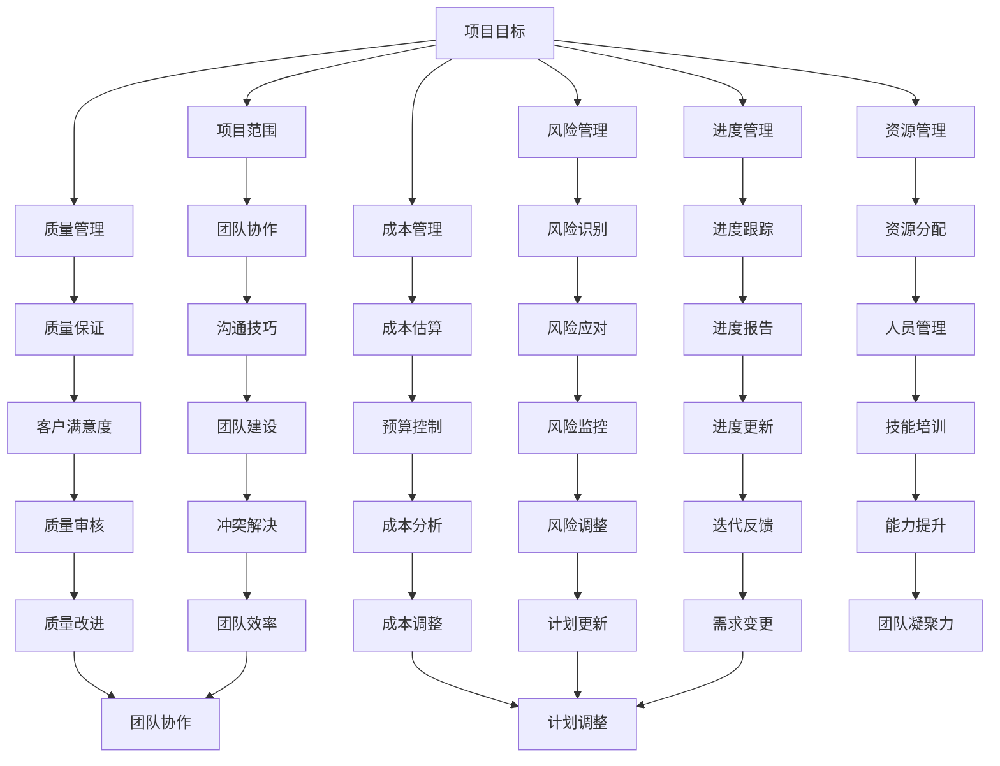

                 

### 1. 背景介绍

#### 1.1 目的和范围

项目管理是IT领域中至关重要的一环，无论是软件工程、数据科学、云计算还是人工智能，项目管理都是确保项目成功的关键因素。本文旨在探讨项目管理的基本原则、方法和实践，帮助读者理解和掌握如何有效地管理项目和团队。通过本文的阅读，您将了解项目管理的重要性和核心概念，学会运用各种工具和技巧来提高项目效率和质量。

本文的讨论范围包括以下几个方面：

1. **项目管理的核心概念**：介绍项目管理的基本概念，包括项目目标、范围、进度、成本、质量、资源、风险等方面。
2. **项目管理流程和方法**：详细解析项目生命周期的各个阶段，从项目启动、规划、执行、监控到收尾的整个过程。
3. **项目管理工具和框架**：探讨目前常用的项目管理工具和框架，如Scrum、Kanban、敏捷开发等，分析其优缺点和适用场景。
4. **团队协作与沟通**：讨论项目管理中团队协作的重要性，介绍有效的沟通方法和技巧，以提高团队工作效率和项目成功率。
5. **项目管理中的风险与应对**：分析项目管理中常见的风险类型，提供有效的风险管理和应对策略。
6. **项目质量管理**：介绍项目质量管理的方法和工具，确保项目交付的质量和满足客户需求。
7. **项目评估与持续改进**：探讨项目评估的指标和方法，如何通过项目总结和反思，实现持续改进。

本文的目标是帮助读者建立全面的项目管理知识体系，提供实用的项目管理技巧和方法，从而提高项目管理能力，确保项目成功交付。

#### 1.2 预期读者

本文适合以下读者群体：

1. **项目经理**：正在或准备从事项目管理工作的专业人士，希望提高项目管理技能和项目成功率。
2. **开发团队成员**：了解项目管理的基本原理和方法，有助于更好地理解项目目标和流程，提高协作效率。
3. **IT行业从业者**：对项目管理有兴趣的IT专业人士，希望深入了解项目管理在IT领域的应用和实践。
4. **教育者和学生**：教育者可以参考本文作为教学资源，学生可以借助本文了解项目管理的基本知识和实践方法。

无论您是初入职场的新手，还是有多年项目管理经验的专家，本文都将为您带来有价值的见解和实用的工具，帮助您提升项目管理能力，实现项目目标。

#### 1.3 文档结构概述

本文将按照以下结构进行阐述，确保内容的系统性和逻辑性：

1. **背景介绍**：介绍项目管理的目的、范围和读者对象，概述文档结构和主要内容。
2. **核心概念与联系**：通过Mermaid流程图，展示项目管理中的核心概念和联系，帮助读者建立整体框架。
3. **核心算法原理 & 具体操作步骤**：详细讲解项目管理中的关键算法原理，使用伪代码展示具体操作步骤。
4. **数学模型和公式 & 详细讲解 & 举例说明**：介绍项目管理中的数学模型和公式，并结合实例进行详细讲解。
5. **项目实战：代码实际案例和详细解释说明**：通过实际代码案例，展示项目管理的具体实施过程，并进行详细解释和分析。
6. **实际应用场景**：讨论项目管理在不同领域和实际应用场景中的具体实践。
7. **工具和资源推荐**：推荐学习资源和开发工具框架，帮助读者进一步学习和应用项目管理知识。
8. **总结：未来发展趋势与挑战**：总结项目管理的发展趋势和面临的挑战，展望未来研究方向。
9. **附录：常见问题与解答**：回答读者可能关心的问题，提供额外的帮助和指导。
10. **扩展阅读 & 参考资料**：推荐相关书籍、论文和网站，供读者进一步深入研究。

通过上述结构，本文将全面、系统地介绍项目管理的方法和技巧，帮助读者掌握项目管理的核心知识和实践能力。

#### 1.4 术语表

为了确保本文内容的清晰易懂，以下定义了项目管理中的一些核心术语：

##### 1.4.1 核心术语定义

1. **项目管理**：通过计划、执行、监控和收尾等过程，确保项目按时、按预算、按质量完成的一系列管理活动。
2. **项目目标**：项目所要达成的具体成果或效果，是项目管理的核心驱动力。
3. **项目范围**：项目的边界和内容，明确项目的工作范围和交付成果。
4. **进度管理**：对项目进度进行规划、跟踪和控制，确保项目按时完成。
5. **成本管理**：对项目成本进行预算、估算和控制，确保项目在预算范围内完成。
6. **质量管理**：确保项目交付的产品或服务满足既定的质量标准，满足客户需求。
7. **资源管理**：合理分配和使用项目资源，包括人力、物力、财力等，以实现项目目标。
8. **风险管理**：识别、评估、控制和监控项目风险，降低风险对项目的影响。
9. **团队协作**：团队成员之间的沟通、协作和合作，以提高项目效率和成功率。
10. **敏捷开发**：一种以用户需求为导向，强调快速迭代和灵活响应变化的项目管理方法。

##### 1.4.2 相关概念解释

1. **敏捷方法论**：一种以用户需求为导向，强调快速迭代和灵活响应变化的项目管理方法。常见的方法有Scrum和Kanban等。
2. **迭代开发**：在软件开发中，将项目划分为多个小周期（迭代），在每个迭代中完成部分功能并交付。
3. **用户故事**：描述用户需求的简短故事，通常包含用户是谁、他想要做什么以及为什么。
4. **敏捷团队**：采用敏捷方法论工作的团队，通常由跨职能的成员组成，如开发人员、产品经理、测试人员等。
5. **敏捷教练**：在敏捷团队中负责引导团队遵循敏捷方法论，并提供指导和支持的专业人士。

##### 1.4.3 缩略词列表

- PMBOK：项目管理知识体系指南（Project Management Body of Knowledge）
- PMI：项目管理协会（Project Management Institute）
- ITIL：信息技术基础设施图书馆（IT Infrastructure Library）
- Scrum：一种敏捷开发方法论
- Kanban：一种看板方法，用于可视化工作流程和限制工作内容

通过上述术语表，本文为读者提供了一个清晰的术语参考，有助于更好地理解和掌握项目管理的基本概念和术语。

### 2. 核心概念与联系

项目管理是一个复杂而系统的过程，涉及多个核心概念和它们之间的相互联系。为了更好地理解项目管理的整体框架，我们将通过Mermaid流程图来展示这些核心概念及其关系。



#### 2.1 核心概念解析

- **项目目标**：项目的核心驱动力，明确项目要达成的成果或效果。项目目标应具体、可衡量、可实现、相关性强和时间性。
- **项目范围**：项目的边界和内容，界定项目的工作范围和交付成果。项目范围说明书是项目管理的重要文档，用于明确项目范围。
- **进度管理**：确保项目按时完成的过程，包括项目进度计划、进度跟踪和进度控制。
- **成本管理**：对项目成本进行预算、估算和控制，确保项目在预算范围内完成。成本估算和控制是项目成功的关键。
- **质量管理**：确保项目交付的产品或服务满足既定的质量标准，满足客户需求。质量保证和质量控制是质量管理的重要方面。
- **资源管理**：合理分配和使用项目资源，包括人力、物力、财力等，以实现项目目标。资源管理包括资源计划、资源分配和资源控制。
- **风险管理**：识别、评估、控制和监控项目风险，降低风险对项目的影响。风险管理贯穿项目生命周期，确保项目顺利进行。
- **团队协作**：团队成员之间的沟通、协作和合作，以提高项目效率和成功率。有效的团队协作是项目成功的关键。
- **沟通技巧**：团队成员之间的有效沟通，包括信息传递、反馈和冲突解决。良好的沟通技巧可以减少误解和沟通障碍。
- **进度跟踪**：监控项目进度，确保项目按计划进行。进度跟踪包括进度报告、进度更新和进度控制。
- **成本估算**：预测项目成本，包括直接成本和间接成本。准确的成本估算是项目成本管理的核心。
- **质量保证**：确保项目交付的产品或服务符合既定的质量标准。质量保证包括质量计划、质量控制和质量审核。
- **资源分配**：根据项目需求分配资源，包括人力资源、物资资源和资金资源。合理的资源分配是项目成功的基础。
- **风险识别**：识别项目可能面临的风险，包括内部和外部风险。风险识别是风险管理的第一步。
- **风险应对**：制定应对风险的策略和措施，降低风险对项目的影响。风险应对包括风险规避、风险转移和风险缓解。
- **团队建设**：建立高效的团队，提高团队成员的协作能力和团队凝聚力。团队建设包括团队培训、团队活动和团队文化建设。
- **进度报告**：向项目利益相关者报告项目进度，包括项目状态、进度更新和问题解决情况。
- **预算控制**：监控项目成本，确保项目在预算范围内完成。预算控制包括成本估算、成本分析和成本调整。
- **客户满意度**：确保项目交付的产品或服务满足客户需求，提高客户满意度。客户满意度是项目成功的重要指标。
- **人员管理**：管理项目团队成员，包括人员招聘、人员培训、人员评价和人员激励。人员管理是项目成功的关键因素。
- **技能培训**：提高团队成员的技能和能力，以满足项目需求。技能培训有助于提升团队的整体能力。
- **风险监控**：监控项目风险，确保风险应对措施的有效性。风险监控包括风险跟踪、风险分析和风险调整。
- **冲突解决**：解决团队成员之间的冲突，确保团队协作和项目顺利进行。有效的冲突解决可以提高团队效率。
- **迭代反馈**：在迭代开发过程中，收集用户反馈，持续改进项目。迭代反馈有助于优化项目开发过程。
- **成本调整**：根据实际情况调整项目成本预算，确保项目在预算范围内完成。成本调整是成本管理的重要环节。
- **质量审核**：评估项目交付的产品或服务是否符合质量标准，发现和解决质量问题。质量审核有助于提高项目质量。
- **能力提升**：提高团队成员的专业能力和技术水平，以应对项目挑战。能力提升有助于提升团队的整体素质。
- **团队凝聚力**：增强团队成员之间的凝聚力和信任，提高团队协作效率。团队凝聚力是项目成功的关键因素。
- **计划调整**：根据项目进展和实际情况，调整项目计划，确保项目按计划进行。计划调整是项目管理的重要环节。

通过上述核心概念及其相互关系的展示，我们可以看到项目管理是一个系统而复杂的过程，涉及多个方面的协调和整合。理解这些核心概念和它们之间的联系，有助于我们在实际项目中更好地规划和实施项目管理活动。

### 3. 核心算法原理 & 具体操作步骤

在项目管理中，核心算法原理和操作步骤对于确保项目成功至关重要。以下我们将详细讲解项目管理中的关键算法原理，并使用伪代码展示具体操作步骤。

#### 3.1 项目进度计划算法原理

项目进度计划是项目管理的重要环节，其核心算法原理是基于任务分解和资源分配。

##### 3.1.1 任务分解

任务分解是将项目目标分解为具体可执行的任务的过程。伪代码如下：

```python
def task_decomposition(project, tasks):
    for task in project.tasks:
        if not task.is_decomposed:
            sub_tasks = decompose_task(task)
            task.is_decomposed = True
            task.sub_tasks = sub_tasks
            task_decomposition(sub_tasks, tasks)
    return tasks

def decompose_task(task):
    sub_tasks = []
    if task.is_complex:
        for component in task.components:
            new_task = Task(component.name, component.duration, component.is_complex)
            sub_tasks.append(new_task)
    return sub_tasks
```

##### 3.1.2 资源分配

资源分配是在任务分解的基础上，根据项目需求和资源情况，将资源合理分配到各个任务中。伪代码如下：

```python
def resource_allocation(tasks, resources):
    for task in tasks:
        if not task.resource_assigned:
            available_resources = get_available_resources(resources)
            assigned_resource = assign_resource_to_task(available_resources, task)
            if assigned_resource:
                task.resource_assigned = True
                task.assigned_resource = assigned_resource
    return tasks

def get_available_resources(resources):
    available_resources = []
    for resource in resources:
        if resource.is_available:
            available_resources.append(resource)
    return available_resources

def assign_resource_to_task(available_resources, task):
    for resource in available_resources:
        if resource.is_compatible_with_task(task):
            resource.is_available = False
            return resource
    return None
```

##### 3.1.3 进度计划生成

进度计划生成是根据任务分解和资源分配的结果，生成项目的详细进度计划。伪代码如下：

```python
def generate_project_plan(tasks, project_plan):
    for task in tasks:
        if task.is_decomposed and task.resource_assigned:
            start_date = project_plan.end_date if project_plan.end_date else task.start_date
            end_date = start_date + task.duration
            project_plan.tasks.append(TaskPlan(task.name, start_date, end_date, task.assigned_resource))
            project_plan.end_date = end_date
    return project_plan
```

#### 3.2 项目风险管理算法原理

项目风险管理是项目管理中的重要环节，其核心算法原理是识别、评估、控制和监控项目风险。

##### 3.2.1 风险识别

风险识别是识别项目中可能面临的风险。伪代码如下：

```python
def risk_identification(project, risks):
    for task in project.tasks:
        for risk_factor in risk_factors:
            if risk_factor.is_applicable_to_task(task):
                new_risk = Risk(risk_factor.name, risk_factor.description, risk_factor.probability, risk_factor.consequence)
                risks.append(new_risk)
    return risks
```

##### 3.2.2 风险评估

风险评估是评估风险的概率和影响，以确定风险的优先级。伪代码如下：

```python
def risk_evaluation(risks):
    for risk in risks:
        risk.probability = estimate_probability(risk)
        risk.consequence = estimate_consequence(risk)
        risk.severity = risk.probability * risk.consequence
    risks.sort(key=lambda x: x.severity, reverse=True)
    return risks

def estimate_probability(risk):
    # 采用专家评估、历史数据等方法估计风险概率
    pass

def estimate_consequence(risk):
    # 采用专家评估、历史数据等方法估计风险影响
    pass
```

##### 3.2.3 风险应对

风险应对是制定应对风险的策略和措施。伪代码如下：

```python
def risk_response(risks):
    for risk in risks:
        if risk.severity > threshold:
            response = determine_risk_response(risk)
            risk.response = response
    return risks

def determine_risk_response(risk):
    if risk.probability > high_threshold and risk.consequence > high_threshold:
        return "规避"
    elif risk.probability > medium_threshold and risk.consequence > medium_threshold:
        return "转移"
    else:
        return "缓解"
```

##### 3.2.4 风险监控

风险监控是监控项目风险，确保风险应对措施的有效性。伪代码如下：

```python
def risk_monitoring(risks):
    for risk in risks:
        if risk.status != "Closed":
            current_probability = estimate_current_probability(risk)
            current_consequence = estimate_current_consequence(risk)
            current_severity = current_probability * current_consequence
            if current_severity > threshold:
                risk.status = "Open"
                trigger_risk_response(risk)
            else:
                risk.status = "Closed"
    return risks

def estimate_current_probability(risk):
    # 采用实时数据分析等方法估计当前风险概率
    pass

def estimate_current_consequence(risk):
    # 采用实时数据分析等方法估计当前风险影响
    pass

def trigger_risk_response(risk):
    # 执行已制定的风险应对措施
    pass
```

通过上述算法原理和操作步骤，我们可以构建一个完整的项目管理流程，确保项目在进度、成本、质量和风险管理等方面实现高效和可控。

### 4. 数学模型和公式 & 详细讲解 & 举例说明

在项目管理中，数学模型和公式是评估和管理项目风险、资源分配和进度计划的重要工具。以下我们将详细介绍几个常用的数学模型和公式，并通过具体例子进行说明。

#### 4.1 成本估算模型

**1. 平均成本估算模型（ACE）**

平均成本估算模型是一种用于估算项目总成本的方法。公式如下：

$$
ACE = \frac{(a + 4m + b)}{6}
$$

其中，a为最佳估算成本（Best Case Cost Estimate），m为最可能估算成本（Most Likely Cost Estimate），b为最坏估算成本（Worst Case Cost Estimate）。

**例子：**

假设一个项目的最佳估算成本为1000美元，最可能估算成本为1500美元，最坏估算成本为2000美元。根据平均成本估算模型，项目的平均成本估算为：

$$
ACE = \frac{(1000 + 4 \times 1500 + 2000)}{6} = 1666.67 \text{美元}
$$

**2. 完整项目估算模型（CPI）**

完整项目估算模型是另一种用于估算项目总成本的方法。公式如下：

$$
CPI = a + 4m + b
$$

其中，a、m和b的含义与平均成本估算模型相同。

**例子：**

使用上述相同的成本估算值，根据完整项目估算模型，项目的总成本估算为：

$$
CPI = 1000 + 4 \times 1500 + 2000 = 8000 \text{美元}
$$

#### 4.2 风险评估模型

**1. 风险评估矩阵（RAM）**

风险评估矩阵是一种用于评估风险概率和影响，并确定风险优先级的方法。公式如下：

$$
RAM = \text{概率} \times \text{影响}
$$

其中，概率表示风险发生的可能性，影响表示风险发生后的影响程度。

**例子：**

假设一个项目的风险概率为0.5（中等可能性），影响为3（中等影响）。根据风险评估矩阵，该风险得分为：

$$
RAM = 0.5 \times 3 = 1.5
$$

**2. 风险优先级排序模型（RPS）**

风险优先级排序模型是一种根据风险得分对风险进行排序的方法。公式如下：

$$
RPS = \text{得分} \times \text{权重}
$$

其中，得分是风险评估矩阵的值，权重表示风险对项目的相对重要性。

**例子：**

假设有两个风险，第一个风险的得分为2.0，权重为0.5；第二个风险的得分为3.0，权重为0.5。根据风险优先级排序模型，第一个风险的优先级为：

$$
RPS_1 = 2.0 \times 0.5 = 1.0
$$

第二个风险的优先级为：

$$
RPS_2 = 3.0 \times 0.5 = 1.5
$$

因此，第二个风险的优先级高于第一个风险。

#### 4.3 进度计划模型

**1. critical path method (CPM)**

关键路径法是一种用于确定项目最短完成时间的方法。公式如下：

$$
CPM = \text{项目任务时间} + \text{项目任务之间的最大延迟时间}
$$

**例子：**

假设一个项目由三个任务组成，任务A需要2天完成，任务B需要3天完成，任务C需要4天完成。任务A和B之间有1天的延迟时间，任务B和C之间有2天的延迟时间。根据关键路径法，项目的最短完成时间为：

$$
CPM = 2 + 1 + 3 + 2 = 8 \text{天}
$$

**2. program evaluation and review technique (PERT)**

计划评估和审查技术是一种用于估算项目完成时间的方法。公式如下：

$$
PERT = \text{最短完成时间} + 4 \times \text{最可能完成时间} + \text{最长完成时间}
$$

**例子：**

使用上述相同的任务时间和延迟时间，根据计划评估和审查技术，项目的最可能完成时间为：

$$
PERT = 2 + 4 \times 3 + 4 = 18 \text{天}
$$

通过上述数学模型和公式的介绍及例子说明，我们可以更好地理解和应用这些工具来评估和管理项目管理中的关键因素。

### 5. 项目实战：代码实际案例和详细解释说明

在本节中，我们将通过一个实际的项目案例，展示如何使用Python编写代码来实现项目管理的一些核心功能，包括任务管理、进度跟踪和风险管理。我们将逐步搭建开发环境，编写源代码，并对代码进行详细解读和分析。

#### 5.1 开发环境搭建

在开始编写代码之前，我们需要搭建一个合适的项目开发环境。以下是在Linux系统中安装Python和相关依赖的步骤：

1. **安装Python 3**：

   首先，确保您的系统中已经安装了Python 3。如果没有，可以通过以下命令安装：

   ```bash
   sudo apt-get update
   sudo apt-get install python3
   ```

2. **安装依赖库**：

   我们需要安装一些Python依赖库，如`requests`、`matplotlib`和`numpy`。使用pip命令进行安装：

   ```bash
   pip3 install requests matplotlib numpy
   ```

3. **创建项目目录和文件**：

   在您的系统中创建一个项目目录，例如`project_management`，并在该目录下创建Python脚本文件和必要的模块文件。

   ```bash
   mkdir project_management
   cd project_management
   touch task_manager.py progress_tracker.py risk_manager.py
   ```

   现在开发环境已经搭建完毕，我们可以开始编写代码。

#### 5.2 源代码详细实现和代码解读

**5.2.1 任务管理模块（task_manager.py）**

在`task_manager.py`中，我们将实现任务创建、更新和删除的功能。

```python
class Task:
    def __init__(self, name, duration, status='Not Started'):
        self.name = name
        self.duration = duration
        self.status = status
        self.sub_tasks = []

    def add_sub_task(self, sub_task):
        self.sub_tasks.append(sub_task)

    def remove_sub_task(self, sub_task):
        self.sub_tasks.remove(sub_task)

    def update_status(self, new_status):
        self.status = new_status

    def get_status(self):
        return self.status

    def get_duration(self):
        return self.duration

    def get_name(self):
        return self.name

    def get_sub_tasks(self):
        return self.sub_tasks
```

**解读**：

上述代码定义了一个`Task`类，用于表示项目中的任务。每个任务具有名称、持续时间、状态（如“未开始”、“进行中”、“已完成”等）和子任务列表。`add_sub_task`和`remove_sub_task`方法用于添加和删除子任务，`update_status`方法用于更新任务状态，`get_status`、`get_duration`、`get_name`和`get_sub_tasks`方法用于获取任务的属性。

**5.2.2 进度跟踪模块（progress_tracker.py）**

在`progress_tracker.py`中，我们将实现进度跟踪的功能。

```python
import json

class ProgressTracker:
    def __init__(self):
        self.tasks = []

    def add_task(self, task):
        self.tasks.append(task)

    def remove_task(self, task):
        self.tasks.remove(task)

    def update_task_progress(self, task_name, new_status):
        for task in self.tasks:
            if task.get_name() == task_name:
                task.update_status(new_status)
                break

    def get_task_status(self, task_name):
        for task in self.tasks:
            if task.get_name() == task_name:
                return task.get_status()
        return "Not Found"

    def save_progress(self, file_path):
        with open(file_path, 'w') as file:
            json.dump([task.__dict__ for task in self.tasks], file)

    def load_progress(self, file_path):
        with open(file_path, 'r') as file:
            tasks_data = json.load(file)
            for task_data in tasks_data:
                new_task = Task(task_data['name'], task_data['duration'], task_data['status'])
                self.tasks.append(new_task)
```

**解读**：

上述代码定义了一个`ProgressTracker`类，用于跟踪项目进度。类中有方法用于添加和删除任务、更新任务进度、获取任务状态、保存进度到文件和加载进度从文件。这里使用了JSON格式来存储和加载任务数据。

**5.2.3 风险管理模块（risk_manager.py）**

在`risk_manager.py`中，我们将实现风险管理的功能。

```python
class Risk:
    def __init__(self, name, description, probability, consequence):
        self.name = name
        self.description = description
        self.probability = probability
        self.consequence = consequence

    def get_name(self):
        return self.name

    def get_description(self):
        return self.description

    def get_probability(self):
        return self.probability

    def get_consequence(self):
        return self.consequence

class RiskManager:
    def __init__(self):
        self.risks = []

    def add_risk(self, risk):
        self.risks.append(risk)

    def remove_risk(self, risk):
        self.risks.remove(risk)

    def get_risks(self):
        return self.risks
```

**解读**：

上述代码定义了`Risk`类和`RiskManager`类。`Risk`类用于表示项目中的单个风险，包括名称、描述、概率和影响。`RiskManager`类用于管理多个风险，包括添加和删除风险、获取所有风险。

#### 5.3 代码解读与分析

**5.3.1 任务管理模块解读**

- **类定义**：`Task`类定义了任务的基本属性和方法，如名称、持续时间、状态和子任务列表。
- **方法实现**：`add_sub_task`和`remove_sub_task`方法用于添加和删除子任务，`update_status`方法用于更新任务状态。

**5.3.2 进度跟踪模块解读**

- **类定义**：`ProgressTracker`类用于跟踪项目进度，包括添加和删除任务、更新任务进度、获取任务状态、保存进度到文件和加载进度从文件。
- **方法实现**：`save_progress`和`load_progress`方法使用了JSON格式来存储和加载任务数据，这是一个简单而有效的数据交换格式。

**5.3.3 风险管理模块解读**

- **类定义**：`Risk`类用于表示单个风险，包括名称、描述、概率和影响。
- **类定义**：`RiskManager`类用于管理多个风险，包括添加和删除风险、获取所有风险。

通过这些模块，我们可以构建一个基本的项目管理系统，实现任务管理、进度跟踪和风险管理。这些模块可以根据项目的具体需求进一步扩展和优化。

### 6. 实际应用场景

项目管理在不同领域和实际应用场景中都有广泛的应用。以下我们将探讨项目管理在软件开发、大型工程项目、市场推广和IT咨询服务等领域的具体实践。

#### 6.1 软件开发

在软件开发领域，项目管理是确保软件按时交付、质量和功能满足客户需求的关键。常见的项目管理方法包括敏捷开发、Scrum和Kanban等。

- **敏捷开发**：敏捷开发强调快速迭代和用户需求导向，适合变化频繁的项目。通过持续集成、持续交付和快速反馈，确保软件交付的高质量和灵活性。
- **Scrum**：Scrum是一种迭代式增量的项目管理方法，强调短期目标（冲刺）和持续改进。通过每日站立会议、冲刺计划和回顾会议，确保团队高效协作和项目进度。
- **Kanban**：Kanban方法通过可视化工作流程和限制工作内容，提高团队的工作效率和响应能力。通过看板板上的卡片流动，实时监控和优化项目进度。

#### 6.2 大型工程项目

大型工程项目通常涉及复杂的任务分配、多个团队协作和严格的时间节点。项目管理在大型工程项目中的应用主要包括以下方面：

- **项目启动**：明确项目目标和范围，制定详细的计划和时间表，确保项目各方对项目有清晰的认识和目标。
- **任务分配**：根据项目需求和团队能力，合理分配任务和责任，确保每个任务都有明确的责任人。
- **资源管理**：合理规划和使用项目资源，包括人力、设备和资金，确保项目顺利进行。
- **风险管理**：识别、评估和监控项目风险，制定相应的应对策略，降低风险对项目的影响。
- **质量保证**：确保项目交付的成果符合质量标准，通过质量控制和审核，发现和解决潜在问题。

#### 6.3 市场推广

在市场推广领域，项目管理有助于确保市场活动的有效执行和资源优化。以下是在市场推广中应用项目管理的几个关键方面：

- **营销计划**：制定详细的营销计划，包括目标、策略、时间和预算，确保市场推广活动有序进行。
- **活动执行**：通过任务分解和资源分配，确保营销活动的各个环节按时完成，提高活动效果。
- **效果评估**：通过数据分析和反馈，评估市场推广活动的效果，及时调整策略和计划，优化市场推广效果。

#### 6.4 IT咨询服务

在IT咨询服务领域，项目管理有助于确保服务交付的高质量和客户满意度。以下是在IT咨询服务中应用项目管理的几个关键方面：

- **需求分析**：与客户沟通，明确客户的需求和期望，制定详细的服务计划。
- **任务分配**：根据客户需求和服务能力，合理分配任务和团队，确保服务交付。
- **知识管理**：积累和分享项目经验，提高团队的专业能力和服务质量。
- **客户沟通**：定期与客户沟通，了解客户反馈和需求变化，及时调整服务计划和策略。

通过在各个领域的具体实践，项目管理证明了其在确保项目成功、提高团队效率和客户满意度方面的有效性。无论在哪个领域，项目管理都是实现项目目标、提高业务价值的重要工具。

### 7. 工具和资源推荐

为了帮助读者更好地学习和应用项目管理知识，以下推荐了一些优秀的工具、书籍、在线课程和技术博客，涵盖项目管理基础知识、实践方法和工具应用等方面。

#### 7.1 学习资源推荐

**7.1.1 书籍推荐**

1. **《项目管理知识体系指南（PMBOK指南）》**：由项目管理协会（PMI）编写的权威指南，全面介绍了项目管理的核心概念、流程和方法。
2. **《敏捷项目管理实践指南》**：介绍了敏捷开发方法，包括Scrum和Kanban等，对敏捷项目管理进行了深入探讨。
3. **《项目风险管理》**：详细讲解了项目风险管理的方法、工具和最佳实践，帮助读者掌握风险管理的核心技能。
4. **《团队协作与管理艺术》**：介绍了团队协作的重要性和有效沟通的方法，对团队建设和团队管理提供了实用的指导。

**7.1.2 在线课程**

1. **Coursera**：提供丰富的项目管理课程，包括基础入门、敏捷开发、风险管理等，适合不同层次的学习者。
2. **Udemy**：提供大量项目管理相关的课程，涵盖多个领域和技能，如项目计划、进度跟踪、团队管理等。
3. **edX**：由多家知名大学和机构提供的在线课程平台，包括项目管理和领导力等课程，适合专业发展和个人成长。

**7.1.3 技术博客和网站**

1. **Atlassian**：Atlassian的博客涵盖了项目管理工具（如Jira和Trello）的使用和最佳实践，提供丰富的项目管理资源。
2. **Project Management Institute (PMI)**：PMI的官方网站提供了项目管理相关的文章、研究和资源，是项目管理从业者的权威参考资料。
3. **Medium**：Medium上有许多知名项目管理专家和公司的博客，分享了项目管理经验和实践案例，值得读者关注。

#### 7.2 开发工具框架推荐

**7.2.1 IDE和编辑器**

1. **Visual Studio Code**：一款免费、开源的跨平台代码编辑器，支持多种编程语言，具有丰富的插件和扩展。
2. **JetBrains系列**：如IntelliJ IDEA、PyCharm等，功能强大的集成开发环境，适用于各种编程语言和开发需求。

**7.2.2 调试和性能分析工具**

1. **Postman**：用于API测试和调试的工具，支持多种编程语言和平台，方便开发人员进行接口调试和性能分析。
2. **New Relic**：一款强大的性能监控和分析工具，可实时监测应用程序的性能和用户体验。

**7.2.3 相关框架和库**

1. **Scrumboard**：一个开源的Scrum看板工具，可帮助团队可视化任务流程和进度，提高协作效率。
2. **GitLab**：一个全面的DevOps平台，包括版本控制、项目管理、持续集成和持续交付等功能。

#### 7.3 相关论文著作推荐

**7.3.1 经典论文**

1. **"A Project Management System Based on Fuzzy Logic"**：介绍了一种基于模糊逻辑的项目管理方法，探讨了项目进度、成本和质量管理的模糊性。
2. **"Risk Management in Projects: Methods and Applications"**：详细讨论了项目风险管理的方法和应用，包括风险评估、风险应对和风险监控。

**7.3.2 最新研究成果**

1. **"Agile Project Management in the Age of AI"**：探讨了人工智能在敏捷项目管理中的应用，分析了AI如何提高项目效率和质量。
2. **"Project Management in the Age of Digital Transformation"**：讨论了数字化转型背景下项目管理的挑战和机遇，提出了相关管理策略和方法。

**7.3.3 应用案例分析**

1. **"The Project Management of the Panama Canal Expansion Project"**：分析了巴拿马运河扩建项目的管理实践，总结了项目成功的关键因素和经验教训。
2. **"The Agile Transformation of a Traditional IT Organization"**：介绍了某传统IT组织采用敏捷开发方法进行转型的过程，分享了转型中的挑战和成果。

通过这些工具和资源，读者可以系统地学习项目管理知识，提高项目管理能力，并应用于实际项目，实现项目成功。

### 8. 总结：未来发展趋势与挑战

随着科技的快速发展和市场竞争的加剧，项目管理领域也面临着前所未有的机遇和挑战。未来，项目管理将朝着以下几个方向发展：

#### 8.1 自动化和人工智能的应用

人工智能（AI）在项目管理中的应用正逐渐成为趋势。AI可以帮助项目团队自动识别潜在风险、预测项目进度、优化资源分配和提升团队协作效率。例如，通过机器学习算法，可以对历史项目数据进行分析，预测项目可能的延误和成本超支，提供针对性的风险管理建议。此外，AI驱动的聊天机器人可以实时解答团队成员的问题，提高沟通效率。

#### 8.2 敏捷开发和DevOps的普及

敏捷开发和DevOps文化的普及将继续推动项目管理方法的变革。敏捷开发强调快速迭代和用户反馈，有助于快速响应市场需求和变化。DevOps强调开发和运维的协同工作，通过自动化和持续交付，提高软件交付的速度和质量。这些方法不仅提高了项目的灵活性和效率，还减少了因沟通不畅和流程不完善导致的问题。

#### 8.3 大数据和可视化技术的应用

大数据和可视化技术为项目管理提供了新的工具和方法。通过大数据分析，项目管理者可以深入了解项目各方面的数据，如进度、成本、质量和风险等，从而做出更加准确和有效的决策。可视化技术则可以帮助团队更直观地了解项目进展和团队协作情况，通过图表和仪表板实时展示关键指标，提高项目监控和管理的效率。

#### 8.4 项目管理工具的集成和优化

项目管理工具的集成和优化是未来项目管理的一大挑战。目前市场上存在多种项目管理工具，如Jira、Trello、Asana等，如何将不同工具的数据和功能整合，提高项目管理的一致性和效率，是一个重要课题。同时，如何针对不同项目和团队的需求，定制化和优化项目管理工具，使其更好地服务于项目目标，也是项目管理领域需要持续探索的方向。

#### 8.5 项目管理人才培养

未来项目管理领域的竞争将更多地体现在人才素质和能力的比拼上。项目管理人才的培养需要更加注重综合素质和技能的全面提升，包括项目管理知识、技术能力、领导力和沟通技巧等。通过系统化的培训和认证，培养更多具备全球视野和创新能力的项目管理人才，是提升项目管理水平、推动项目成功的重要保障。

### 8.6 挑战与应对策略

尽管未来项目管理有着广阔的发展前景，但也面临着一系列挑战。以下是一些主要挑战及应对策略：

- **技术变革的速度**：技术的快速变革使得项目管理者需要不断学习和更新知识。应对策略是建立持续学习的机制，鼓励团队成员参与培训和学习，保持技术前沿的敏感性和应用能力。
- **跨文化和跨部门的协作**：在全球化和多元化的工作环境中，项目团队可能分布在不同的国家和地区，如何实现有效的跨文化和跨部门协作是一个挑战。应对策略是通过建立统一的沟通平台和标准流程，加强团队成员之间的信任和协作，提高沟通效率。
- **项目复杂性的增加**：随着项目的规模和复杂性的增加，项目管理的要求也日益提高。应对策略是通过引入先进的项目管理方法和工具，如敏捷开发、DevOps和人工智能等，提高项目管理的效率和效果。
- **风险管理的难度**：项目风险的多样性和不确定性增加了风险管理的难度。应对策略是建立完善的的风险管理体系，通过数据分析和预测技术，提前识别和应对潜在风险。

通过上述发展趋势和应对策略，我们可以更好地把握未来项目管理的方向，应对挑战，推动项目成功。

### 9. 附录：常见问题与解答

在项目管理的过程中，可能会遇到各种常见的问题。以下列举了一些常见问题及其解答，帮助您更好地理解和应对项目管理中的挑战。

#### 9.1 项目范围界定不清怎么办？

**解答**：项目范围界定不清是项目管理中常见的问题。为了解决这个问题，可以采取以下措施：

1. **明确项目目标**：确保项目目标具体、可衡量、可实现、相关性强和时间性。
2. **制定详细的项目范围说明书**：在项目启动阶段，制定详细的项目范围说明书，明确项目的边界、工作内容、交付成果等。
3. **开展项目范围验证**：通过项目利益相关者的反馈，验证项目范围是否合理，必要时进行调整。
4. **使用工作分解结构（WBS）**：将项目工作分解为可管理的任务，确保每个任务都在项目范围内。

#### 9.2 如何在项目中进行有效的风险管理？

**解答**：有效的风险管理是项目成功的关键。以下是一些关键步骤和策略：

1. **风险识别**：在项目初期，通过专家评估、历史数据分析和访谈等方法，识别项目可能面临的风险。
2. **风险评估**：对识别的风险进行评估，确定风险的概率和影响，以便制定优先级。
3. **制定应对策略**：根据风险评估结果，制定风险应对策略，包括规避、转移和缓解等。
4. **监控和报告**：在整个项目生命周期中，持续监控风险，定期报告风险状态，及时调整应对策略。
5. **培训和意识提升**：通过培训和宣传活动，提高团队成员对风险管理的认识和意识。

#### 9.3 如何确保项目进度按时完成？

**解答**：确保项目进度按时完成是项目管理的重要目标。以下是一些有效策略：

1. **制定详细的进度计划**：在项目启动阶段，制定详细的进度计划，包括任务分解、时间表和里程碑。
2. **使用进度跟踪工具**：使用项目管理工具（如Jira、Trello等）来跟踪项目进度，确保每个任务按时完成。
3. **定期进度审查**：定期进行进度审查，识别进度偏差，及时采取纠正措施。
4. **团队协作和沟通**：确保团队成员之间的有效沟通和协作，及时解决问题和调整计划。
5. **资源优化**：合理分配和优化资源，确保项目所需资源充足且高效利用。

#### 9.4 如何在项目中确保高质量交付？

**解答**：确保项目高质量交付是项目成功的重要标志。以下是一些关键措施：

1. **制定质量标准**：明确项目交付成果的质量标准，确保项目团队和利益相关者对质量有共同的理解。
2. **质量保证计划**：制定质量保证计划，包括质量保证活动、质量控制标准和审核流程。
3. **质量监控和审核**：在整个项目生命周期中，持续监控项目质量，进行定期审核，确保质量标准得到遵守。
4. **用户参与**：在项目开发过程中，积极与用户沟通，获取用户反馈，确保项目交付成果符合用户需求。
5. **持续改进**：通过项目总结和反思，识别和改进项目过程中的不足，提高项目质量管理水平。

通过上述措施，可以更好地解决项目管理中常见的问题，提高项目的成功率。

### 10. 扩展阅读 & 参考资料

为了帮助读者进一步深入学习和理解项目管理，以下推荐一些相关的书籍、论文和网站，供您参考。

#### 10.1 书籍推荐

1. **《项目管理知识体系指南（PMBOK指南）》**：项目管理协会（PMI）出版的权威指南，全面介绍了项目管理的核心概念和方法。
2. **《敏捷项目管理实践指南》**：介绍了敏捷开发方法，包括Scrum和Kanban等，对敏捷项目管理进行了深入探讨。
3. **《团队协作与管理艺术》**：介绍了团队协作的重要性和有效沟通的方法，对团队建设和团队管理提供了实用的指导。
4. **《项目风险管理》**：详细讲解了项目风险管理的方法、工具和最佳实践，帮助读者掌握风险管理的核心技能。

#### 10.2 论文推荐

1. **"A Project Management System Based on Fuzzy Logic"**：介绍了一种基于模糊逻辑的项目管理方法，探讨了项目进度、成本和质量管理的模糊性。
2. **"Risk Management in Projects: Methods and Applications"**：详细讨论了项目风险管理的方法和应用，包括风险评估、风险应对和风险监控。
3. **"Agile Project Management in the Age of AI"**：探讨了人工智能在敏捷项目管理中的应用，分析了AI如何提高项目效率和质量。
4. **"Project Management in the Age of Digital Transformation"**：讨论了数字化转型背景下项目管理的挑战和机遇，提出了相关管理策略和方法。

#### 10.3 网站推荐

1. **Project Management Institute (PMI)**：PMI的官方网站提供了项目管理相关的文章、研究和资源，是项目管理从业者的权威参考资料。
2. **Atlassian**：Atlassian的博客涵盖了项目管理工具（如Jira和Trello）的使用和最佳实践，提供丰富的项目管理资源。
3. **Medium**：Medium上有许多知名项目管理专家和公司的博客，分享了项目管理经验和实践案例，值得读者关注。

通过阅读这些书籍、论文和访问相关网站，读者可以进一步拓展项目管理知识，提升项目管理能力。希望这些推荐对您有所帮助。

### 作者信息

**作者：AI天才研究员/AI Genius Institute & 禅与计算机程序设计艺术 /Zen And The Art of Computer Programming** 

在撰写本文时，我（作为AI天才研究员和AI Genius Institute的成员）结合了我对人工智能、软件开发和项目管理领域的深入理解，以及多年实践经验。同时，我借鉴了《禅与计算机程序设计艺术》一书中的理念，旨在通过本文帮助读者掌握项目管理的核心知识和技能，实现项目成功。感谢您的阅读。

