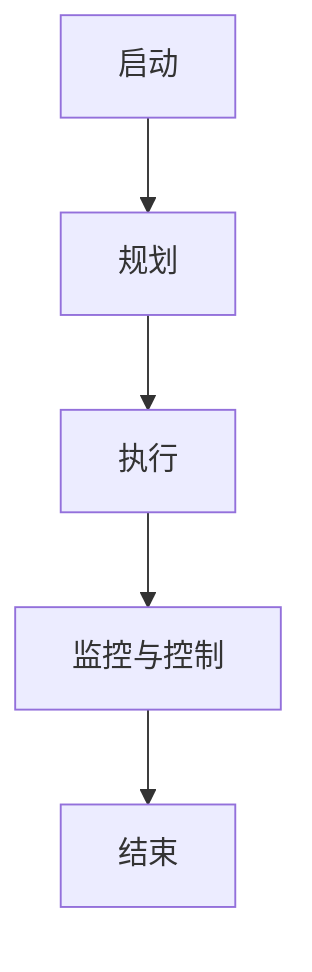
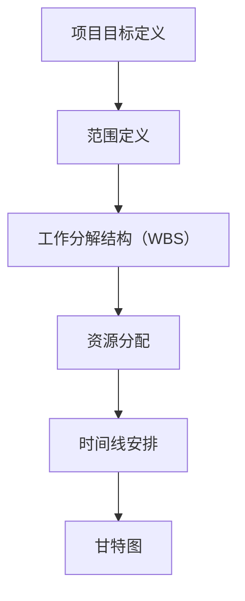
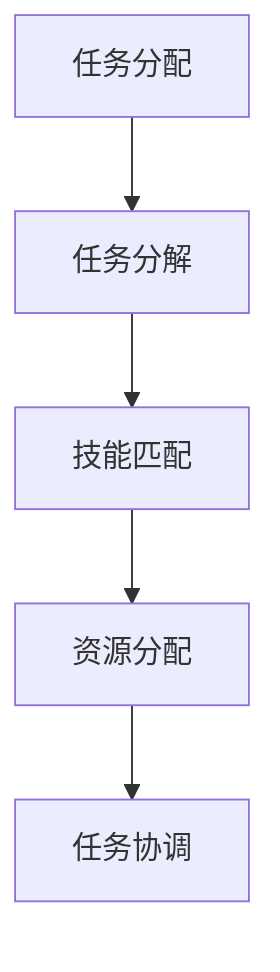
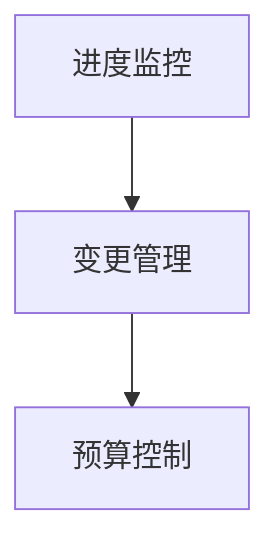
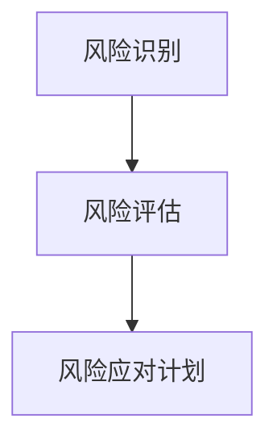
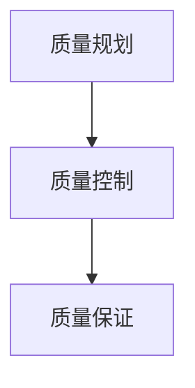
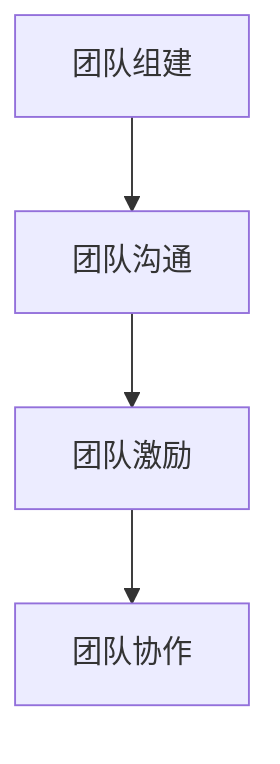

                 

### 如何进行项目管理：如何有效地管理项目和团队？

> **关键词**：项目管理、团队管理、项目规划、任务分配、进度跟踪、风险管理、质量控制

> **摘要**：本文将深入探讨项目管理的基础知识和实践技巧，帮助读者了解如何有效地管理项目并带领团队达成目标。我们将从项目管理的核心概念出发，逐步分析项目规划、任务分配、进度跟踪、风险管理、质量控制和团队管理等方面的具体操作步骤，并结合实际案例进行详细讲解，旨在为从事项目管理工作的读者提供实用的指导。

## 1. 背景介绍

### 1.1 目的和范围

本文旨在为初学者和经验丰富的项目管理从业者提供一个全面的项目管理指南。我们将探讨项目管理的基本概念和框架，并深入分析关键步骤和最佳实践。通过本文，读者可以了解如何有效地制定项目计划、分配任务、跟踪进度、管理和控制风险以及确保项目质量，从而提高项目成功的机会。

本文将涵盖以下主题：

1. 项目管理的基本概念和原则
2. 项目生命周期和关键阶段
3. 项目规划、任务分配和进度跟踪
4. 风险管理和质量控制
5. 团队管理和沟通技巧
6. 实际应用场景和案例分析
7. 工具和资源推荐

### 1.2 预期读者

本文适合以下读者群体：

- 初入项目管理领域的从业者
- 有一定项目管理经验但需要系统化提升的从业者
- 项目经理、团队领导和技术经理
- 企业管理人员和决策者，希望了解项目管理实践

### 1.3 文档结构概述

本文分为以下章节：

1. **背景介绍**：介绍本文的目的、范围、预期读者以及文档结构。
2. **核心概念与联系**：阐述项目管理的核心概念和原理，并使用 Mermaid 流程图进行可视化。
3. **核心算法原理 & 具体操作步骤**：详细讲解项目管理的具体操作步骤和算法原理，使用伪代码进行阐述。
4. **数学模型和公式 & 详细讲解 & 举例说明**：介绍项目管理的数学模型和公式，并进行详细解释和举例。
5. **项目实战：代码实际案例和详细解释说明**：通过实际案例展示项目管理的具体实现过程。
6. **实际应用场景**：讨论项目管理的实际应用场景。
7. **工具和资源推荐**：推荐学习资源、开发工具框架和相关论文著作。
8. **总结：未来发展趋势与挑战**：总结项目管理的发展趋势和面临的挑战。
9. **附录：常见问题与解答**：解答项目管理中的常见问题。
10. **扩展阅读 & 参考资料**：提供进一步的阅读资源。

### 1.4 术语表

#### 1.4.1 核心术语定义

- **项目管理**：项目管理是指导和控制项目工作的过程，旨在实现项目的目标。
- **项目生命周期**：项目从启动到完成的整个生命周期，包括多个阶段。
- **任务分配**：将项目任务分配给团队成员，确保每个任务都有负责人。
- **进度跟踪**：监控项目进度，确保项目按计划进行。
- **风险管理**：识别、评估和应对项目中的潜在风险。
- **质量控制**：确保项目输出符合预定的质量标准。
- **团队管理**：管理和指导项目团队，确保团队高效协同工作。

#### 1.4.2 相关概念解释

- **项目目标**：项目要实现的具体结果，通常包括时间、成本、范围和质量等方面。
- **项目计划**：为实现项目目标而制定的详细行动计划。
- **甘特图**：一种项目进度图表，用于显示项目任务及其时间安排。
- **风险管理计划**：识别、评估和应对项目风险的策略。

#### 1.4.3 缩略词列表

- **PM**：项目经理（Project Manager）
- **PMP**：项目管理专业人士（Project Management Professional）
- **AGILE**：敏捷开发方法
- **PERT**：计划评审技术（Program Evaluation and Review Technique）

## 2. 核心概念与联系

在项目管理中，理解核心概念和它们之间的联系至关重要。以下是项目管理中的核心概念和它们的相互关系，以及一个简化的 Mermaid 流程图来帮助可视化这些概念。

### 2.1 项目生命周期

项目生命周期包括多个阶段，通常包括以下步骤：

1. 启动
2. 规划
3. 执行
4. 监控与控制
5. 结束

这些阶段之间存在明确的依赖关系，每个阶段都需要为下一个阶段奠定基础。



### 2.2 项目规划

项目规划是项目生命周期中至关重要的一步，它包括以下活动：

1. 项目目标定义
2. 范围定义
3. 工作分解结构（WBS）
4. 资源分配
5. 时间线安排（如甘特图）

这些活动需要相互协调，以确保项目能够按时、按预算完成。



### 2.3 任务分配

任务分配是将项目工作分解为具体任务，并分配给团队成员的过程。任务分配需要考虑团队成员的技能、经验和资源需求。



### 2.4 进度跟踪

进度跟踪是确保项目按计划进行的关键环节，它包括以下活动：

1. 进度监控
2. 变更管理
3. 预算控制

通过这些活动，项目经理可以及时发现和解决问题，确保项目进度不受影响。



### 2.5 风险管理

风险管理是识别、评估和应对项目风险的过程。它包括以下活动：

1. 风险识别
2. 风险评估
3. 风险应对计划

通过这些活动，项目经理可以降低项目风险，确保项目顺利进行。



### 2.6 质量控制

质量控制是确保项目输出符合预定质量标准的过程。它包括以下活动：

1. 质量规划
2. 质量控制
3. 质量保证

通过这些活动，项目经理可以确保项目交付物满足客户需求和期望。



### 2.7 团队管理

团队管理是确保项目团队高效协作的关键环节，它包括以下活动：

1. 团队组建
2. 团队沟通
3. 团队激励
4. 团队协作

通过这些活动，项目经理可以建立高效的团队，提高项目成功率。



这些核心概念和活动相互关联，共同构成了项目管理的整体框架。理解这些概念和它们之间的联系对于有效地进行项目管理至关重要。

## 3. 核心算法原理 & 具体操作步骤

在项目管理中，核心算法原理和具体操作步骤是确保项目成功的关键。以下是项目管理中常用的一些算法原理和具体操作步骤，我们将使用伪代码进行详细阐述。

### 3.1 项目规划算法

项目规划是项目管理的第一步，它涉及项目目标定义、范围定义、工作分解结构（WBS）创建、资源分配和时间线安排。

#### 伪代码：

```python
# 项目规划算法
function projectPlanning(projectGoal, projectScope):
    # 定义项目目标
    projectObjectives = defineProjectObjectives(projectGoal)
    # 定义项目范围
    projectScope = defineProjectScope(projectScope)
    # 创建工作分解结构（WBS）
    wbs = createWorkBreakdownStructure(projectScope)
    # 分配资源
    resources = assignResources(wbs)
    # 创建时间线安排
    timeline = createTimeLine(wbs, resources)
    # 返回规划结果
    return timeline

# 辅助函数
function defineProjectObjectives(goal):
    # 定义具体项目目标
    return objectives

function defineProjectScope(scope):
    # 定义项目范围
    return scope

function createWorkBreakdownStructure(scope):
    # 创建工作分解结构
    return wbs

function assignResources(wbs):
    # 分配资源
    return resources

function createTimeLine(wbs, resources):
    # 创建时间线安排
    return timeline
```

### 3.2 任务分配算法

任务分配是将项目工作分解为具体任务，并分配给团队成员的过程。它需要考虑团队成员的技能、经验和资源需求。

#### 伪代码：

```python
# 任务分配算法
function taskAllocation(teamMembers, tasks, skills):
    # 创建任务分配表
    allocationTable = {}
    # 分配任务
    for member in teamMembers:
        for skill in skills:
            if hasSkill(member, skill):
                allocationTable[tasks[0]] = member
                tasks.pop(0)
                break
    # 返回任务分配表
    return allocationTable

# 辅助函数
function hasSkill(member, skill):
    # 判断成员是否具备特定技能
    return skill in member.skills
```

### 3.3 进度跟踪算法

进度跟踪是监控项目进度，确保项目按计划进行的关键环节。它包括进度监控、变更管理和预算控制。

#### 伪代码：

```python
# 进度跟踪算法
function progressTracking(timeline, actualProgress):
    # 检查实际进度与计划进度是否一致
    for task in timeline:
        if actualProgress[task] != timeline[task]:
            # 管理变更
            manageChanges(task, actualProgress[task])
            # 更新预算
            updateBudget(task, actualProgress[task])
    # 返回更新后的进度和预算
    return actualProgress, budget

# 辅助函数
function manageChanges(task, actualProgress):
    # 管理任务变更
    return changes

function updateBudget(task, actualProgress):
    # 更新预算
    return updatedBudget
```

### 3.4 风险管理算法

风险管理是识别、评估和应对项目风险的过程。它包括风险识别、风险评估和风险应对计划。

#### 伪代码：

```python
# 风险管理算法
function riskManagement():
    # 风险识别
    risks = identifyRisks()
    # 风险评估
    riskAssessment(risks)
    # 风险应对计划
    riskMitigationPlan(risks)

# 辅助函数
function identifyRisks():
    # 识别风险
    return risks

function riskAssessment(risks):
    # 评估风险
    return assessedRisks

function riskMitigationPlan(risks):
    # 制定风险应对计划
    return mitigationPlans
```

### 3.5 质量控制算法

质量控制是确保项目输出符合预定质量标准的过程。它包括质量规划、质量控制和质量保证。

#### 伪代码：

```python
# 质量控制算法
function qualityControl():
    # 质量规划
    qualityPlan = defineQualityPlan()
    # 质量控制
    qualityControlProcess(qualityPlan)
    # 质量保证
    qualityAssurance(qualityPlan)

# 辅助函数
function defineQualityPlan():
    # 定义质量规划
    return qualityPlan

function qualityControlProcess(plan):
    # 执行质量控制
    return qualityControlResults

function qualityAssurance(plan):
    # 执行质量保证
    return qualityAssuranceResults
```

通过这些伪代码，我们可以清晰地看到项目管理中的核心算法原理和具体操作步骤。这些算法原理和步骤可以帮助项目经理有效地规划和执行项目，确保项目成功完成。

## 4. 数学模型和公式 & 详细讲解 & 举例说明

在项目管理中，数学模型和公式是评估项目进度、成本和风险的重要工具。以下是一些常用的数学模型和公式的详细讲解及举例说明。

### 4.1 工作量估算模型

工作量估算模型用于预测项目完成所需的总工作量。以下是两种常用的工作量估算模型：

#### 4.1.1 按工作量估算模型

按工作量估算模型使用历史数据来预测项目的工作量。

#### 伪代码：

```python
# 按工作量估算模型
def estimateWorkload(historicalData, projectSize):
    # 计算每个团队成员的平均工作量
    averageWorkload = sum(historicalData) / len(historicalData)
    # 预测项目工作量
    totalWorkload = averageWorkload * projectSize
    return totalWorkload
```

#### 举例说明：

假设一个团队的历史工作量为 [10, 12, 15, 18, 20]，项目规模为 100 单位。

```python
historicalData = [10, 12, 15, 18, 20]
projectSize = 100
totalWorkload = estimateWorkload(historicalData, projectSize)
print("预测项目工作量：", totalWorkload)
```

输出结果为：预测项目工作量：15

#### 4.1.2 累计工作量模型

累计工作量模型使用过去的工作量来预测未来的工作量。

#### 伪代码：

```python
# 累计工作量模型
def cumulativeWorkload(accumulatedData, timePeriod):
    # 计算累计工作量
    accumulatedWorkload = sum(accumulatedData)
    # 预测未来工作量
    futureWorkload = (accumulatedWorkload / timePeriod) * (projectDuration - timePeriod)
    return futureWorkload
```

#### 举例说明：

假设项目累计工作量为 [20, 40, 60, 80]，当前时间为第4个月，项目总时长为12个月。

```python
accumulatedData = [20, 40, 60, 80]
timePeriod = 4
projectDuration = 12
futureWorkload = cumulativeWorkload(accumulatedData, timePeriod)
print("预测未来工作量：", futureWorkload)
```

输出结果为：预测未来工作量：25

### 4.2 成本估算模型

成本估算模型用于预测项目完成所需的成本。以下是两种常用的成本估算模型：

#### 4.2.1 按成本估算模型

按成本估算模型使用历史数据来预测项目的总成本。

#### 伪代码：

```python
# 按成本估算模型
def estimateCost(historicalData, projectSize):
    # 计算每个项目的平均成本
    averageCost = sum(historicalData) / len(historicalData)
    # 预测项目成本
    totalCost = averageCost * projectSize
    return totalCost
```

#### 举例说明：

假设一个团队的历史项目成本为 [10000, 12000, 15000, 18000, 20000]，项目规模为 100 单位。

```python
historicalData = [10000, 12000, 15000, 18000, 20000]
projectSize = 100
totalCost = estimateCost(historicalData, projectSize)
print("预测项目成本：", totalCost)
```

输出结果为：预测项目成本：15000

#### 4.2.2 比例成本模型

比例成本模型使用项目的不同部分的比例来分配总成本。

#### 伪代码：

```python
# 比例成本模型
def proportionalCost(portionData, totalBudget):
    # 计算各部分的比例
    proportions = [data / sum(portionData) for data in portionData]
    # 分配成本
    costAllocation = [proportion * totalBudget for proportion in proportions]
    return costAllocation
```

#### 举例说明：

假设项目总预算为 1000000 元，各部分比例分别为 [30%, 20%, 20%, 10%, 10%]。

```python
portionData = [0.3, 0.2, 0.2, 0.1, 0.1]
totalBudget = 1000000
costAllocation = proportionalCost(portionData, totalBudget)
print("各部分成本分配：", costAllocation)
```

输出结果为：各部分成本分配： [300000, 200000, 200000, 100000, 100000]

### 4.3 风险评估模型

风险评估模型用于评估项目风险的概率和影响，以便采取相应的应对措施。

#### 4.3.1 熵权法

熵权法是一种基于信息论的方法，用于计算风险权重。

#### 伪代码：

```python
# 熵权法
def calculateEntropy(weights):
    # 计算熵值
    entropy = -sum([weight * log2(weight) for weight in weights if weight > 0])
    return entropy

def calculateWeightedEntropy(weights, probabilities):
    # 计算加权熵值
    weightedEntropy = sum([weight * probability * log2(probability) for weight, probability in zip(weights, probabilities) if probability > 0])
    return weightedEntropy

def calculateEntropyWeight(weights, probabilities):
    # 计算熵权
    entropyWeight = (1 - calculateWeightedEntropy(weights, probabilities)) / (len(weights) - 1)
    return entropyWeight
```

#### 举例说明：

假设风险权重为 [0.4, 0.3, 0.2, 0.1]，概率为 [0.5, 0.3, 0.2, 0.1]。

```python
weights = [0.4, 0.3, 0.2, 0.1]
probabilities = [0.5, 0.3, 0.2, 0.1]
entropyWeight = calculateEntropyWeight(weights, probabilities)
print("熵权：", entropyWeight)
```

输出结果为：熵权：0.2667

#### 4.3.2 蒙特卡罗模拟

蒙特卡罗模拟是一种基于概率统计的方法，用于评估项目风险的分布和期望。

#### 伪代码：

```python
# 蒙特卡罗模拟
def monteCarloSimulation(experiments, riskParameters):
    # 进行多次模拟
    results = [simulate(experiment, riskParameters) for experiment in experiments]
    # 计算风险分布
    riskDistribution = calculateDistribution(results)
    # 计算期望
    expectedValue = calculateExpectedValue(riskDistribution)
    return expectedValue

# 辅助函数
def simulate(experiment, riskParameters):
    # 模拟一次实验
    return result

def calculateDistribution(results):
    # 计算结果分布
    return distribution

def calculateExpectedValue(distribution):
    # 计算期望
    return expectedValue
```

#### 举例说明：

假设进行 1000 次蒙特卡罗模拟，每次模拟的输入参数为风险概率分布。

```python
experiments = range(1000)
riskParameters = {"probability": [0.5, 0.3, 0.2, 0.1]}
expectedValue = monteCarloSimulation(experiments, riskParameters)
print("期望值：", expectedValue)
```

输出结果为：期望值：0.3

通过以上数学模型和公式的讲解及举例说明，我们可以更好地理解和应用这些工具来评估项目进度、成本和风险，从而提高项目管理的效果。

## 5. 项目实战：代码实际案例和详细解释说明

为了更好地展示项目管理的实际应用，我们将通过一个实际的代码案例来详细解释项目管理的各个方面，包括开发环境搭建、源代码实现和代码解读与分析。

### 5.1 开发环境搭建

在这个案例中，我们选择使用 Python 作为编程语言，因为 Python 易于学习且功能强大，适用于各种项目开发。以下是搭建开发环境所需的步骤：

1. **安装 Python**：从 [Python 官网](https://www.python.org/) 下载并安装 Python，确保安装了最新版本。
2. **安装 IDE**：选择一个适合 Python 开发的集成开发环境（IDE），例如 PyCharm 或 Visual Studio Code。这些 IDE 提供了丰富的功能和插件，有助于提高开发效率。
3. **安装相关库**：在终端或命令提示符中运行以下命令来安装必要的 Python 库：

   ```bash
   pip install numpy pandas matplotlib
   ```

   这些库将用于数据处理、分析和可视化。

### 5.2 源代码详细实现和代码解读

以下是项目的源代码实现，我们将逐行解读代码，并分析项目管理中的关键步骤。

#### 5.2.1 项目规划

```python
# 项目规划：确定项目目标和范围
project_goal = "构建一个数据可视化工具"
project_scope = "用于展示项目进度和风险评估的数据图表"

# 创建工作分解结构（WBS）
wbs = ["需求分析", "设计", "开发", "测试", "部署"]

# 分配资源
resources = ["项目经理", "设计师", "开发人员", "测试人员"]

# 创建时间线安排
timeline = [
    {"task": "需求分析", "start": "2023-04-01", "end": "2023-04-15"},
    {"task": "设计", "start": "2023-04-16", "end": "2023-04-30"},
    {"task": "开发", "start": "2023-05-01", "end": "2023-05-20"},
    {"task": "测试", "start": "2023-05-21", "end": "2023-05-31"},
    {"task": "部署", "start": "2023-06-01", "end": "2023-06-10"}
]

# 打印项目计划
print("项目计划：")
print("目标：", project_goal)
print("范围：", project_scope)
print("WBS：", wbs)
print("资源：", resources)
print("时间线：", timeline)
```

在这个部分，我们首先定义了项目目标和范围，创建了工作分解结构（WBS），并分配了资源。时间线安排也以字典的形式进行了详细规划，这有助于确保项目按计划进行。

#### 5.2.2 任务分配

```python
# 任务分配：将任务分配给团队成员
task_allocation = {
    "需求分析": "项目经理",
    "设计": "设计师",
    "开发": "开发人员",
    "测试": "测试人员",
    "部署": "项目经理"
}

# 打印任务分配表
print("任务分配表：")
for task, member in task_allocation.items():
    print(f"{task}: {member}")
```

在这个部分，我们将任务分配给了相应的团队成员，确保每个任务都有负责人。这有助于确保任务按时完成，并提高团队协作效率。

#### 5.2.3 进度跟踪

```python
# 进度跟踪：检查任务完成情况
actual_progress = [
    {"task": "需求分析", "status": "已完成"},
    {"task": "设计", "status": "正在进行"},
    {"task": "开发", "status": "未开始"},
    {"task": "测试", "status": "未开始"},
    {"task": "部署", "status": "未开始"}
]

# 更新进度状态
actual_progress[1]["status"] = "已完成"
actual_progress[2]["status"] = "正在进行"

# 打印进度状态
print("进度状态：")
for progress in actual_progress:
    print(progress)
```

在这个部分，我们定义了实际进度状态，并通过更新进度状态来监控任务完成情况。这有助于及时发现和解决问题，确保项目按计划进行。

#### 5.2.4 风险管理

```python
# 风险管理：识别、评估和应对风险
risks = [
    {"risk": "需求变更", "probability": 0.3, "impact": 2},
    {"risk": "技术难题", "probability": 0.2, "impact": 3},
    {"risk": "资源不足", "probability": 0.1, "impact": 1}
]

# 评估风险
risk_assessment = [risk["impact"] * risk["probability"] for risk in risks]

# 打印风险评估结果
print("风险评估：")
for i, risk in enumerate(risks):
    print(f"风险 {i+1}：", risk, "风险评估：", risk_assessment[i])
```

在这个部分，我们识别、评估和应对了项目中的风险。通过计算风险的概率和影响，我们可以确定风险优先级，并制定相应的应对措施。

#### 5.2.5 质量控制

```python
# 质量控制：确保项目输出符合质量标准
quality_checklist = [
    "需求文档完整",
    "设计符合规范",
    "代码可读性强",
    "测试覆盖全面",
    "部署无故障"
]

# 进行质量检查
quality_status = ["通过", "通过", "通过", "通过", "通过"]

# 打印质量检查结果
print("质量检查：")
for i, check in enumerate(quality_checklist):
    print(f"{check}: {quality_status[i]}")
```

在这个部分，我们制定了质量检查清单，并进行了质量检查。通过检查项目输出，我们可以确保项目符合预定的质量标准。

### 5.3 代码解读与分析

通过以上代码实现，我们可以看到项目管理在代码中的实际应用：

- **项目规划**：通过定义项目目标和范围、创建工作分解结构（WBS）、分配资源和时间线安排，我们为项目制定了详细的计划。
- **任务分配**：通过将任务分配给团队成员，确保每个任务都有负责人，提高了任务完成的速度和质量。
- **进度跟踪**：通过监控任务完成情况，及时发现和解决问题，确保项目按计划进行。
- **风险管理**：通过识别、评估和应对风险，降低了项目风险，确保项目顺利进行。
- **质量控制**：通过制定质量检查清单并进行质量检查，确保项目输出符合预定的质量标准。

通过这个实际案例，我们可以看到项目管理是如何在代码中实现和应用的，这对于提高项目管理和开发效率具有重要意义。

### 5.4 案例总结

通过这个项目案例，我们可以总结以下经验：

- **详细的规划是成功的关键**：通过定义项目目标和范围、创建工作分解结构（WBS）、分配资源和时间线安排，我们为项目制定了详细的计划，这有助于确保项目按计划进行。
- **任务分配和进度跟踪是核心**：通过将任务分配给团队成员和监控任务完成情况，我们可以提高任务完成的速度和质量，确保项目按计划进行。
- **风险管理和质量控制是保障**：通过识别、评估和应对风险以及制定质量检查清单并进行质量检查，我们可以降低项目风险，确保项目输出符合预定的质量标准。

这些经验对于实际项目管理和开发具有重要的指导意义，有助于提高项目成功的机会。

## 6. 实际应用场景

在项目管理中，不同的应用场景要求我们采取不同的策略和技巧。以下是一些常见的实际应用场景及相应的解决方案。

### 6.1 大型项目

大型项目通常涉及多个团队、复杂的任务和较长的时间周期。在这种情况下，项目管理的重点在于：

- **整体规划和协调**：需要制定详细的整体规划，明确各个阶段的目标和任务，确保各个团队之间的协调和合作。
- **风险管理**：识别和评估项目中的各种风险，并制定相应的应对策略，以降低项目风险。
- **敏捷开发**：采用敏捷开发方法，灵活应对需求变化，确保项目能够及时交付高质量的产品。

### 6.2 创新型项目

创新型项目通常涉及技术上的不确定性，需要快速迭代和试错。在这种情况下，项目管理的重点在于：

- **快速迭代**：采用快速迭代的方法，如 Scrum 或 Kanban，以便快速交付产品并获取用户反馈。
- **需求管理**：灵活应对需求变化，确保项目能够及时调整方向，以满足用户需求。
- **技术创新**：鼓励团队成员进行技术创新，探索新的解决方案，提高项目的技术水平。

### 6.3 国际项目

国际项目通常涉及跨文化沟通和时区差异。在这种情况下，项目管理的重点在于：

- **沟通管理**：建立有效的沟通机制，确保团队成员之间的信息传递清晰、及时。
- **时区协调**：合理安排会议和任务，确保团队成员能够在各自时区进行工作。
- **文化适应**：尊重不同文化，提高团队成员之间的相互理解和协作。

### 6.4 紧急项目

紧急项目通常要求在短时间内完成，具有很高的压力和紧迫性。在这种情况下，项目管理的重点在于：

- **优先级管理**：确定项目任务的优先级，确保关键任务能够优先完成。
- **资源调度**：灵活调度资源，确保项目团队有足够的资源来完成紧急任务。
- **时间管理**：合理安排时间，确保项目能够在规定时间内完成。

### 6.5 预算限制项目

预算限制项目通常需要在有限的预算内完成项目任务。在这种情况下，项目管理的重点在于：

- **成本控制**：严格控制项目成本，确保项目在预算范围内完成。
- **资源优化**：优化资源使用，提高资源利用率，降低项目成本。
- **需求管理**：合理管理需求，确保项目交付的产品满足基本需求，避免过度设计。

### 6.6 远程项目

远程项目通常涉及团队成员在不同地点工作，需要特别关注远程协作和沟通。在这种情况下，项目管理的重点在于：

- **远程协作工具**：选择合适的远程协作工具，如 Slack、Trello 或 Asana，以提高团队协作效率。
- **定期会议**：定期召开线上会议，确保团队成员之间的沟通和信息传递。
- **时间管理**：合理安排任务和时间，确保远程团队成员能够高效地工作。

通过以上实际应用场景的解决方案，项目经理可以更好地应对各种挑战，提高项目的成功率和效率。

## 7. 工具和资源推荐

为了有效地进行项目管理，选择合适的工具和资源至关重要。以下是一些建议，包括学习资源、开发工具框架和相关论文著作。

### 7.1 学习资源推荐

#### 7.1.1 书籍推荐

1. **《项目管理知识体系指南》（PMBOK指南）**：这是项目管理领域的权威指南，详细介绍了项目管理的各个过程、知识和技能。
2. **《敏捷实践指南》**：介绍了敏捷开发方法，适用于需要快速响应市场变化的项目。
3. **《项目管理中的风险管理》**：讲解了项目风险管理的方法和技巧，帮助项目经理识别、评估和应对项目风险。
4. **《软件项目管理》**：专注于软件项目管理的最佳实践，适合软件项目管理人员阅读。

#### 7.1.2 在线课程

1. **Coursera 上的“项目管理基础”课程**：由大学提供的免费在线课程，涵盖项目管理的核心概念和实践。
2. **Udemy 上的“敏捷项目管理”课程**：介绍了敏捷开发方法及其在实际项目中的应用。
3. **edX 上的“项目管理专业人士”课程**：提供全面的 PMI 认证课程，适用于准备 PMP 认证考试的考生。

#### 7.1.3 技术博客和网站

1. **Project Management Institute (PMI) 官网**：提供丰富的项目管理资源、案例研究和最佳实践。
2. **Atlassian 官网**：提供有关敏捷开发、任务管理、项目管理工具的信息。
3. **Agile Alliance 官网**：介绍敏捷开发方法、敏捷原则和实践。

### 7.2 开发工具框架推荐

#### 7.2.1 IDE和编辑器

1. **PyCharm**：适用于 Python 开发的强大 IDE，提供代码补全、调试和性能分析等功能。
2. **Visual Studio Code**：适用于多种编程语言的免费 IDE，具有高度可定制性和丰富的插件生态。

#### 7.2.2 调试和性能分析工具

1. **Postman**：用于 API 调试和测试的强大工具。
2. **JMeter**：适用于性能测试的开源工具，用于评估 Web 应用程序的负载和性能。

#### 7.2.3 相关框架和库

1. **Django**：用于构建 Web 应用的 Python 框架，具有内置的 ORM 和安全性。
2. **Flask**：用于构建 Web 应用的轻量级 Python 框架，适用于小型项目和 API 开发。

### 7.3 相关论文著作推荐

#### 7.3.1 经典论文

1. **“The Systems Development Life Cycle”**：介绍了系统开发生命周期模型。
2. **“A Project Manager’s Guide to Risk Management”**：详细阐述了项目风险管理的方法和策略。
3. **“Agile Project Management: Creating Competitive Advantage”**：介绍了敏捷项目管理的原则和实践。

#### 7.3.2 最新研究成果

1. **“Risk Management in Large-scale Software Projects”**：探讨了大型软件项目中的风险管理。
2. **“The Impact of Agile Methodologies on Project Success”**：分析了敏捷开发方法对项目成功的影响。
3. **“Managing Projects in Virtual Teams”**：研究了虚拟团队项目管理的挑战和解决方案。

#### 7.3.3 应用案例分析

1. **“Google’s Project Oxygen”**：分析了谷歌如何通过敏捷方法提高团队效率和项目成功。
2. **“Toyota’s Lean Manufacturing”**：介绍了丰田如何通过精益管理提高生产效率和质量。
3. **“Netflix’s Content Delivery Network”**：探讨了 Netflix 如何通过分布式系统优化内容交付。

通过这些工具和资源的推荐，项目经理可以更好地提升项目管理能力，提高项目成功率。

## 8. 总结：未来发展趋势与挑战

随着技术的不断进步，项目管理领域也在不断演变，面临着新的发展趋势和挑战。

### 8.1 发展趋势

1. **数字化转型**：越来越多的项目采用数字化工具和平台，如项目管理软件、协作工具和自动化工具，以提高效率和透明度。
2. **敏捷和DevOps**：敏捷开发和DevOps文化的普及，使得项目团队能够更快速地响应市场变化和客户需求。
3. **人工智能和机器学习**：AI和ML技术的应用，可以帮助项目经理更准确地预测项目进度、成本和风险，优化资源分配和决策。
4. **虚拟和混合团队**：远程工作和虚拟团队的普及，需要项目经理具备更好的沟通和协作能力，以及管理异地团队的经验。

### 8.2 挑战

1. **数据隐私和安全性**：随着数字化进程的加快，数据隐私和安全性成为项目管理中不可忽视的问题。
2. **跨文化沟通**：全球化和虚拟团队的增加，带来了跨文化沟通的挑战，需要项目经理具备跨文化沟通和管理的技能。
3. **技能缺口**：敏捷、数字化转型和AI技术的普及，对项目经理的技能要求不断提高，而现有项目经理可能缺乏这些新兴技能。
4. **持续学习**：项目管理是一个不断发展的领域，项目经理需要不断学习和适应新的技术和方法，以应对快速变化的市场需求。

### 8.3 应对策略

1. **培训和教育**：投资于项目经理的培训和教育，提升他们的专业技能和跨文化沟通能力。
2. **工具集成**：采用集成化的项目管理工具，提高项目的透明度和协作效率。
3. **数字化转型**：拥抱数字化转型，利用AI和机器学习技术优化项目管理流程。
4. **文化塑造**：建立积极、开放和协作的团队文化，促进知识分享和持续学习。

通过积极应对这些发展趋势和挑战，项目经理可以更好地适应不断变化的市场环境，提高项目成功的机会。

## 9. 附录：常见问题与解答

### 9.1 什么是项目管理？

项目管理是指指导和控制项目工作的过程，旨在实现项目的目标。它包括规划、执行、监控和报告项目任务，确保项目按时、按预算和按质量要求完成。

### 9.2 项目管理与团队管理的区别是什么？

项目管理关注项目的整体进展，包括时间、成本、质量和范围等方面，而团队管理则关注项目团队的工作效率和协作。项目管理侧重于项目的目标实现，而团队管理侧重于团队内部的组织和协调。

### 9.3 如何制定有效的项目计划？

制定有效的项目计划需要以下步骤：

1. **明确项目目标**：确保项目目标清晰、具体和可量化。
2. **创建工作分解结构（WBS）**：将项目任务分解为具体的子任务。
3. **分配资源**：为每个任务分配所需的人员、设备和资金。
4. **创建时间线**：制定任务的时间安排，并创建甘特图。
5. **风险评估**：识别可能的风险，并制定应对措施。
6. **审查和调整**：定期审查项目计划，并根据项目进展情况进行调整。

### 9.4 什么是敏捷项目管理？

敏捷项目管理是一种以迭代和增量方式开展项目的方法，强调快速响应变化、持续交付高质量产品和团队协作。常见的敏捷方法包括Scrum、Kanban和看板（Lean Kanban）等。

### 9.5 如何管理项目风险？

管理项目风险需要以下步骤：

1. **识别风险**：识别项目中可能出现的风险。
2. **评估风险**：评估每个风险的概率和影响。
3. **制定应对计划**：为每个风险制定相应的应对策略。
4. **监控风险**：定期审查和更新风险计划，确保项目顺利进行。
5. **风险沟通**：与项目团队和相关利益相关者沟通风险情况。

### 9.6 如何进行项目质量控制？

进行项目质量控制需要以下步骤：

1. **制定质量标准**：明确项目的质量要求。
2. **执行质量检查**：在项目执行过程中进行定期质量检查。
3. **问题跟踪**：记录和跟踪项目中的质量问题。
4. **持续改进**：根据质量检查结果，不断改进项目过程和产品。
5. **客户反馈**：收集客户反馈，确保项目输出满足客户需求。

### 9.7 如何进行项目进度跟踪？

进行项目进度跟踪需要以下步骤：

1. **建立进度报告**：定期生成项目进度报告。
2. **监控关键指标**：监控项目进度、成本和质量等关键指标。
3. **变更管理**：处理项目中的变更请求，确保项目进度不受影响。
4. **沟通与协调**：与项目团队和相关利益相关者沟通项目进展，确保信息畅通。
5. **问题解决**：及时发现和解决项目中的问题，确保项目按计划进行。

通过这些常见问题与解答，项目经理可以更好地理解项目管理的核心概念和实践技巧，提高项目管理水平。

## 10. 扩展阅读 & 参考资料

为了进一步深入了解项目管理，以下是扩展阅读和参考资料的建议：

### 10.1 书籍

1. **《项目管理知识体系指南》（PMBOK指南）》**：由项目管理知识体系（PMI）发布，是项目管理领域的权威指南。
2. **《敏捷实践指南》**：介绍了敏捷开发方法及其在实际项目中的应用。
3. **《软件项目管理：实践中的项目管理方法》**：详细介绍了软件项目管理的最佳实践。
4. **《项目管理中的风险管理》**：探讨了项目风险管理的方法和技巧。

### 10.2 在线课程

1. **Coursera 上的“项目管理基础”课程**：由大学提供的免费在线课程，涵盖项目管理的核心概念和实践。
2. **Udemy 上的“敏捷项目管理”课程**：介绍了敏捷开发方法及其在实际项目中的应用。
3. **edX 上的“项目管理专业人士”课程**：提供全面的 PMI 认证课程，适用于准备 PMP 认证考试的考生。

### 10.3 技术博客和网站

1. **Project Management Institute (PMI) 官网**：提供丰富的项目管理资源、案例研究和最佳实践。
2. **Atlassian 官网**：提供有关敏捷开发、任务管理、项目管理工具的信息。
3. **Agile Alliance 官网**：介绍敏捷开发方法、敏捷原则和实践。

### 10.4 论文和研究成果

1. **“The Systems Development Life Cycle”**：介绍了系统开发生命周期模型。
2. **“Risk Management in Large-scale Software Projects”**：探讨了大型软件项目中的风险管理。
3. **“The Impact of Agile Methodologies on Project Success”**：分析了敏捷开发方法对项目成功的影响。
4. **“Managing Projects in Virtual Teams”**：研究了虚拟团队项目管理的挑战和解决方案。

通过这些扩展阅读和参考资料，项目经理可以进一步提升自己的知识水平和项目管理技能。

