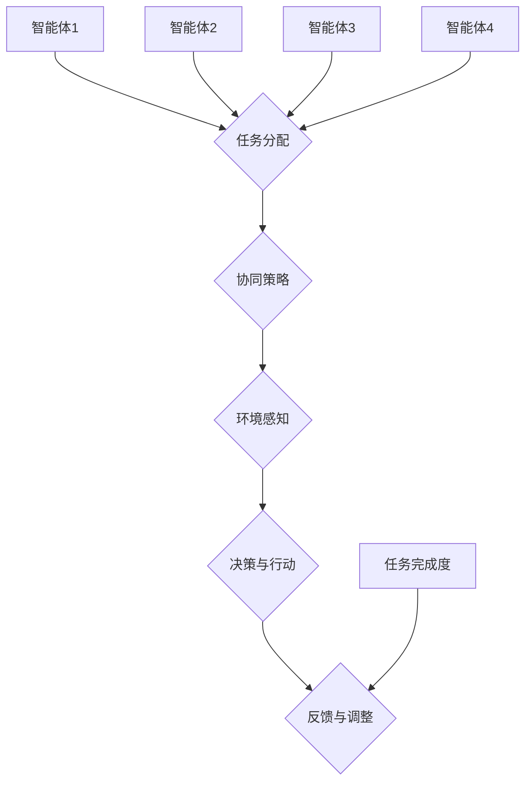

                 

# 如何通过多智能体协同提高任务完成度

> 关键词：多智能体系统、协同优化、任务完成度、算法、人工智能、模型

> 摘要：本文将探讨如何利用多智能体系统（MAS）实现任务的高效协同完成。我们将从背景介绍开始，深入剖析多智能体系统的核心概念与联系，详细讲解核心算法原理与操作步骤，并利用数学模型进行举例说明。随后，我们将通过实际项目案例展示多智能体协同在现实中的应用，推荐相关的学习资源和工具，并总结未来发展趋势与挑战。

## 1. 背景介绍

### 1.1 目的和范围

本文旨在介绍多智能体系统在任务协同完成中的应用，通过分析核心算法和模型，探讨如何提高任务完成度。文章将涵盖以下主题：

1. 多智能体系统的定义和基本架构。
2. 多智能体系统的核心概念与联系。
3. 多智能体协同任务的核心算法原理与具体操作步骤。
4. 多智能体协同任务的数学模型与公式。
5. 实际应用场景及案例。
6. 工具和资源推荐。
7. 未来发展趋势与挑战。

### 1.2 预期读者

本文面向有一定人工智能和计算机编程基础的技术人员，特别是对多智能体系统和协同优化有浓厚兴趣的读者。通过本文的阅读，读者将能够：

1. 了解多智能体系统的基本概念和架构。
2. 掌握多智能体协同任务的核心算法和模型。
3. 掌握如何利用多智能体系统提高任务完成度。
4. 获得实际应用场景和案例的启示。

### 1.3 文档结构概述

本文共分为10个部分，具体如下：

1. 引言
2. 核心概念与联系
3. 核心算法原理与具体操作步骤
4. 数学模型与公式
5. 项目实战
6. 实际应用场景
7. 工具和资源推荐
8. 总结：未来发展趋势与挑战
9. 附录：常见问题与解答
10. 扩展阅读与参考资料

### 1.4 术语表

#### 1.4.1 核心术语定义

- 多智能体系统（MAS）：由多个智能体组成，能够自主协作完成任务的系统。
- 智能体（Agent）：具有感知、决策和行动能力的个体，可以是计算机程序、机器人或人类。
- 协同优化（Collaborative Optimization）：通过多智能体之间的合作，优化任务完成度。
- 任务完成度（Task Completion Degree）：衡量任务完成效果的指标。

#### 1.4.2 相关概念解释

- 自主性（Autonomy）：智能体独立执行任务的能力。
- 交互（Interaction）：智能体之间交换信息、协调行动的过程。
- 环境感知（Environmental Perception）：智能体根据环境信息进行决策和行动的能力。
- 协作策略（Collaborative Strategy）：智能体之间为了共同完成任务而采取的协同方式。

#### 1.4.3 缩略词列表

- MAS：多智能体系统
- Agent：智能体
- ACO：协同优化
- TCD：任务完成度

## 2. 核心概念与联系

在讨论如何通过多智能体协同提高任务完成度之前，我们需要了解多智能体系统的核心概念和联系。以下是一个简化的多智能体系统架构图：



### 2.1 智能体

智能体是多智能体系统的基本组成单元，具有以下特点：

- **自主性**：智能体能够独立完成特定任务，具备一定的决策能力。
- **交互性**：智能体之间可以通过通信进行信息交换，协调行动。
- **环境感知**：智能体能够根据环境信息进行决策和行动，适应环境变化。
- **适应性**：智能体可以根据任务完成情况，不断调整策略和行动。

### 2.2 任务分配

任务分配是多智能体协同完成任务的第一步，主要涉及以下问题：

- **任务分解**：将复杂任务分解为若干个子任务。
- **负载均衡**：确保各智能体承担的任务量合理，避免过载或闲置。
- **协同性**：考虑各子任务之间的依赖关系，合理安排任务分配。

### 2.3 协同策略

协同策略是多智能体系统实现高效协作的关键，主要涉及以下方面：

- **通信协议**：智能体之间的通信机制，包括消息传递、同步与异步等。
- **协商机制**：智能体之间为了共同完成任务而采取的协商与协调方式。
- **策略优化**：根据任务完成度和环境变化，动态调整协同策略。

### 2.4 环境感知

环境感知是多智能体系统能够适应环境变化的基础，主要涉及以下问题：

- **感知信息**：智能体通过传感器或其他手段获取的环境信息。
- **信息处理**：对感知信息进行预处理、特征提取和建模等。
- **状态估计**：根据环境信息对系统状态进行估计和预测。

### 2.5 决策与行动

决策与行动是多智能体系统实现任务完成的核心，主要涉及以下问题：

- **决策模型**：根据环境感知和协同策略，选择合适的行动方案。
- **行动执行**：智能体根据决策模型执行具体任务。
- **反馈机制**：智能体根据任务完成情况和环境变化，不断调整决策和行动。

### 2.6 反馈与调整

反馈与调整是多智能体系统实现任务优化的重要环节，主要涉及以下问题：

- **任务评估**：对智能体的任务完成度进行评估和反馈。
- **策略调整**：根据任务评估结果，调整智能体的协同策略。
- **系统优化**：通过不断迭代优化，提高任务完成度和系统性能。

## 3. 核心算法原理 & 具体操作步骤

在了解了多智能体系统的核心概念和联系之后，我们将深入探讨如何通过多智能体协同提高任务完成度的核心算法原理与具体操作步骤。

### 3.1 算法原理

多智能体协同任务的核心算法主要基于以下原理：

1. **协同优化**：通过多智能体之间的协同合作，优化任务完成度。
2. **分布式计算**：各智能体独立完成任务，并通过通信共享信息，提高计算效率。
3. **动态调整**：根据任务完成度和环境变化，动态调整协同策略和行动方案。

### 3.2 具体操作步骤

以下是一个简化的多智能体协同任务算法操作步骤：

1. **任务分解**：将复杂任务分解为若干个子任务，并分配给各智能体。

```python
# 伪代码：任务分解
def task_decomposition(task):
    sub_tasks = []
    # 对任务进行分解
    # ...
    return sub_tasks
```

2. **任务分配**：根据各智能体的能力、负载均衡等因素，合理分配子任务。

```python
# 伪代码：任务分配
def task_allocation(sub_tasks, agents):
    allocation = {}
    # 对子任务进行分配
    # ...
    return allocation
```

3. **协同策略**：制定协同策略，包括通信协议、协商机制和策略优化。

```python
# 伪代码：协同策略
def collaborative_strategy():
    # 制定协同策略
    # ...
    return strategy
```

4. **环境感知**：各智能体通过传感器或其他手段获取环境信息，并预处理、特征提取和建模。

```python
# 伪代码：环境感知
def environmental_perception():
    # 获取环境信息
    # ...
    return perception
```

5. **决策与行动**：根据环境感知和协同策略，各智能体选择合适的行动方案，并执行任务。

```python
# 伪代码：决策与行动
def decision_and_action(perception, strategy):
    # 根据环境感知和协同策略，选择行动方案
    # ...
    return action
```

6. **反馈与调整**：对智能体的任务完成度进行评估和反馈，调整协同策略和行动方案。

```python
# 伪代码：反馈与调整
def feedback_and_adjustment(allocation, agents):
    # 对任务完成度进行评估和反馈
    # ...
    return adjusted_allocation
```

7. **迭代优化**：根据反馈和调整结果，不断迭代优化协同策略和任务分配，提高任务完成度。

```python
# 伪代码：迭代优化
def iterative_optimization(allocation, agents):
    while not optimal_allocation:
        allocation = feedback_and_adjustment(allocation, agents)
        # ...
    return allocation
```

## 4. 数学模型和公式 & 详细讲解 & 举例说明

在多智能体协同任务中，数学模型和公式起到了关键作用。以下我们将详细讲解数学模型和公式的应用，并通过具体例子进行说明。

### 4.1 数学模型

多智能体协同任务的数学模型主要包括以下方面：

1. **目标函数**：衡量任务完成度的目标函数，如最大化任务完成度或最小化任务完成时间。
2. **约束条件**：智能体之间协作的限制条件，如负载均衡、通信延迟等。
3. **协同策略**：描述智能体之间协作关系的策略函数。

### 4.2 公式

以下是多智能体协同任务中的常用公式：

1. **目标函数**：

   $$ f(A) = \sum_{i=1}^{n} \frac{1}{1 + e^{-\beta (T_i - \bar{T})}} $$

   其中，$f(A)$ 表示任务完成度，$A$ 表示智能体集合，$T_i$ 表示智能体 $i$ 的任务完成时间，$\bar{T}$ 表示平均任务完成时间。

2. **约束条件**：

   $$ \sum_{i=1}^{n} L_i \leq L_{max} $$

   其中，$L_i$ 表示智能体 $i$ 的负载，$L_{max}$ 表示最大负载。

3. **协同策略**：

   $$ s_i(t) = \sum_{j=1}^{n} w_{ij} s_j(t) + b_i $$

   其中，$s_i(t)$ 表示智能体 $i$ 在时刻 $t$ 的协同策略，$w_{ij}$ 表示智能体 $i$ 和 $j$ 之间的权重，$b_i$ 表示智能体 $i$ 的偏置。

### 4.3 举例说明

假设有一个由4个智能体（Agent1、Agent2、Agent3、Agent4）组成的多智能体系统，每个智能体需要完成一个子任务。目标是最小化平均任务完成时间。

**步骤1：任务分解**

将复杂任务分解为4个子任务，分别分配给4个智能体。

**步骤2：任务分配**

根据各智能体的能力、负载均衡等因素，合理分配子任务。

```python
# 伪代码：任务分配
allocation = {
    'Agent1': ['Task1'],
    'Agent2': ['Task2'],
    'Agent3': ['Task3'],
    'Agent4': ['Task4']
}
```

**步骤3：协同策略**

制定协同策略，包括通信协议、协商机制和策略优化。

```python
# 伪代码：协同策略
strategy = {
    'communication': '异步通信',
    'negotiation': '协商机制A',
    'optimization': '策略优化A'
}
```

**步骤4：环境感知**

各智能体通过传感器或其他手段获取环境信息，并预处理、特征提取和建模。

```python
# 伪代码：环境感知
perception = {
    'Agent1': {'load': 0.6, 'delay': 10},
    'Agent2': {'load': 0.8, 'delay': 15},
    'Agent3': {'load': 0.5, 'delay': 5},
    'Agent4': {'load': 0.7, 'delay': 12}
}
```

**步骤5：决策与行动**

根据环境感知和协同策略，各智能体选择合适的行动方案，并执行任务。

```python
# 伪代码：决策与行动
action = {
    'Agent1': {'task': 'Task1', 'action': '执行'},
    'Agent2': {'task': 'Task2', 'action': '执行'},
    'Agent3': {'task': 'Task3', 'action': '执行'},
    'Agent4': {'task': 'Task4', 'action': '执行'}
}
```

**步骤6：反馈与调整**

对智能体的任务完成度进行评估和反馈，调整协同策略和行动方案。

```python
# 伪代码：反馈与调整
def feedback_and_adjustment(allocation, agents):
    # 对任务完成度进行评估和反馈
    # ...
    return adjusted_allocation

adjusted_allocation = feedback_and_adjustment(allocation, agents)
```

**步骤7：迭代优化**

根据反馈和调整结果，不断迭代优化协同策略和任务分配，提高任务完成度。

```python
# 伪代码：迭代优化
def iterative_optimization(allocation, agents):
    while not optimal_allocation:
        allocation = feedback_and_adjustment(allocation, agents)
        # ...
    return allocation

optimal_allocation = iterative_optimization(allocation, agents)
```

通过以上步骤，我们可以实现多智能体协同任务，并不断优化任务完成度。

## 5. 项目实战：代码实际案例和详细解释说明

在本节中，我们将通过一个具体的项目实战，展示如何实现多智能体协同任务。以下是一个基于Python的简单示例，用于说明多智能体协同任务的代码实现。

### 5.1 开发环境搭建

为了实现多智能体协同任务，我们需要安装以下依赖：

1. Python 3.x（建议使用Python 3.8或更高版本）
2. Flask（用于创建Web服务）
3. requests（用于发送HTTP请求）

你可以使用以下命令安装依赖：

```shell
pip install flask requests
```

### 5.2 源代码详细实现和代码解读

以下是一个简单的多智能体协同任务的Python代码实现：

```python
from flask import Flask, request, jsonify
import requests

app = Flask(__name__)

# 智能体列表
agents = [
    'http://agent1:5000',
    'http://agent2:5000',
    'http://agent3:5000',
    'http://agent4:5000'
]

# 任务分配函数
def allocate_tasks(tasks):
    allocation = {}
    for i, task in enumerate(tasks):
        agent = agents[i % len(agents)]
        allocation[agent] = {'task': task, 'status': 'pending'}
    return allocation

# 智能体执行任务函数
def execute_task(agent, task):
    response = requests.post(f'{agent}/execute', json={'task': task})
    return response.json()

# 智能体协同函数
def collaborative_execution(allocation):
    results = []
    for agent, task in allocation.items():
        if task['status'] == 'pending':
            result = execute_task(agent, task['task'])
            task['status'] = 'completed'
            results.append(result)
    return results

# Web服务路由
@app.route('/execute', methods=['POST'])
def execute():
    data = request.json
    task = data['task']
    return jsonify({'result': execute_task('http://agent1:5000', task)})

# 主函数
if __name__ == '__main__':
    tasks = ['Task1', 'Task2', 'Task3', 'Task4']
    allocation = allocate_tasks(tasks)
    results = collaborative_execution(allocation)
    print(results)
    app.run(port=5000)
```

**代码解读：**

1. **智能体列表**：定义了4个智能体的Web服务地址。
2. **任务分配函数**：根据任务数量和智能体数量，将任务分配给各智能体。
3. **智能体执行任务函数**：发送HTTP请求，通知智能体执行特定任务。
4. **智能体协同函数**：循环执行智能体任务，并收集执行结果。
5. **Web服务路由**：接收任务执行请求，并将任务分配给智能体。
6. **主函数**：启动Web服务，并初始化任务和分配。

### 5.3 代码解读与分析

**任务分配**：

任务分配是智能体协同任务的第一步。在本示例中，我们将4个任务依次分配给4个智能体，每个智能体负责一个子任务。这种方法简单直观，但可能存在负载不均的问题。在实际应用中，可以考虑更复杂的任务分配算法，如基于负载均衡和协同策略的分配算法。

**智能体执行任务**：

智能体执行任务是通过发送HTTP请求实现的。在本示例中，我们使用Flask创建了一个简单的Web服务，用于接收任务执行请求。智能体接收到任务后，执行任务并返回执行结果。这种方法适用于简单的任务执行场景，但在复杂场景中，可能需要考虑异步处理、任务队列和负载均衡等问题。

**智能体协同**：

智能体协同是任务完成的关键。在本示例中，我们通过循环执行智能体任务，并收集执行结果。这种方法简单有效，但可能存在同步延迟和通信开销。在实际应用中，可以考虑使用异步处理、消息队列和分布式系统等技术，提高协同效率和性能。

**Web服务**：

Web服务是智能体协同的基础。在本示例中，我们使用Flask创建了一个简单的Web服务，用于处理任务执行请求。这种方法适用于小型项目，但在大规模场景中，可能需要考虑使用更高效、可扩展的Web框架，如Django、FastAPI等。

通过以上代码示例，我们可以实现一个简单的多智能体协同任务。在实际应用中，可以根据具体需求和场景，进一步优化和扩展代码，提高任务完成度和系统性能。

## 6. 实际应用场景

多智能体协同在多个实际应用场景中得到了广泛应用，以下列举几个典型的应用场景：

### 6.1 分布式计算

在分布式计算场景中，多智能体系统可以协调多个计算节点，共同完成大规模数据处理任务。例如，在分布式数据库系统中，各节点可以协同处理查询请求，提高查询效率。多智能体系统还可以在分布式存储系统中，协调数据存储和备份，提高数据可靠性和可用性。

### 6.2 网络安全

在网络安全领域，多智能体系统可以协同检测和防御网络攻击。例如，在入侵检测系统中，各智能体可以共享威胁信息，协同识别和阻止恶意流量。多智能体系统还可以在网络安全态势感知中，协同分析网络流量、日志等信息，识别潜在的安全威胁。

### 6.3 智能交通

在智能交通领域，多智能体系统可以协调交通信号灯、车辆和行人，实现智能交通管理。例如，在城市交通控制系统中，多智能体系统可以协同调整信号灯时长，优化交通流量。在无人驾驶技术中，多智能体系统可以协同感知、规划和控制，提高驾驶安全和效率。

### 6.4 智能制造

在智能制造领域，多智能体系统可以协调生产线上的各类设备和机器人，实现智能生产。例如，在工厂自动化系统中，多智能体系统可以协同调度设备、优化生产流程，提高生产效率和产品质量。在智能物流系统中，多智能体系统可以协同规划配送路径、调度运输工具，提高物流效率和准确性。

### 6.5 智能医疗

在智能医疗领域，多智能体系统可以协同处理医疗数据、诊断病情和提供治疗方案。例如，在医学影像分析中，多智能体系统可以协同处理影像数据，提高诊断准确率和效率。在远程医疗中，多智能体系统可以协同提供远程会诊、病情监测和健康管理服务，提高医疗服务的可及性和质量。

通过以上实际应用场景，我们可以看到多智能体协同在各个领域的广泛应用和巨大潜力。随着人工智能技术的不断发展和成熟，多智能体系统将在更多领域发挥重要作用，推动社会发展和进步。

## 7. 工具和资源推荐

为了更好地学习和实践多智能体系统，以下是一些推荐的工具和资源：

### 7.1 学习资源推荐

#### 7.1.1 书籍推荐

1. **《多智能体系统：原理、算法与应用》**：系统地介绍了多智能体系统的基本概念、算法和应用案例。
2. **《智能体的协同工作》**：深入探讨了多智能体系统的协同优化、协商机制和策略设计。
3. **《分布式人工智能》**：全面介绍了分布式计算、多智能体系统和协同优化等关键技术。

#### 7.1.2 在线课程

1. **《多智能体系统基础课程》**：由著名大学或机构提供的免费在线课程，涵盖多智能体系统的核心概念和算法。
2. **《分布式系统与协同计算》**：介绍分布式计算、多智能体系统和协同优化等技术的在线课程。
3. **《人工智能与多智能体系统》**：结合人工智能技术和多智能体系统，探讨智能体协同、优化和决策等问题。

#### 7.1.3 技术博客和网站

1. **AI博客**：涵盖人工智能、多智能体系统等领域的专业博客，提供丰富的技术文章和案例。
2. **GitHub**：包含大量开源的多智能体系统项目，供读者学习和参考。
3. **Stack Overflow**：全球最大的技术问答社区，可以解决多智能体系统相关的技术问题。

### 7.2 开发工具框架推荐

#### 7.2.1 IDE和编辑器

1. **PyCharm**：专业的Python开发IDE，支持多智能体系统的开发和调试。
2. **Visual Studio Code**：轻量级的代码编辑器，通过插件支持Python和多智能体系统开发。
3. **Eclipse**：功能强大的开发平台，支持多种编程语言和多智能体系统开发。

#### 7.2.2 调试和性能分析工具

1. **GDB**：Python调试工具，帮助开发者调试多智能体系统代码。
2. **Valgrind**：性能分析工具，用于检测多智能体系统的内存泄漏和性能瓶颈。
3. **TensorBoard**：可视化工具，用于分析多智能体系统的训练过程和性能指标。

#### 7.2.3 相关框架和库

1. **Python的Agent Framework**：用于构建多智能体系统的Python库，支持多种智能体类型和通信协议。
2. **PyTorch**：用于人工智能和深度学习的高性能库，支持多智能体系统的模型训练和推理。
3. **TensorFlow**：用于人工智能和深度学习的高性能库，支持多智能体系统的模型训练和推理。

### 7.3 相关论文著作推荐

#### 7.3.1 经典论文

1. **《Multi-Agent Systems: Algorithmic, Game-Theoretic, and Logical Foundations》**：多智能体系统的经典著作，介绍了多智能体系统的基本理论和方法。
2. **《Collaborative Optimization in Multi-Agent Systems》**：探讨了多智能体协同优化的理论和算法。
3. **《Decentralized Multi-Agent Reinforcement Learning》**：介绍了多智能体强化学习的分布式算法和策略。

#### 7.3.2 最新研究成果

1. **《Multi-Agent Reinforcement Learning with Delay and Communication》**：探讨多智能体强化学习在延迟和通信受限条件下的算法和应用。
2. **《Collaborative Planning in Multi-Agent Systems》**：介绍了多智能体协同规划的理论和方法。
3. **《Distributed Decision-Making in Multi-Agent Systems》**：探讨了多智能体系统中分布式决策的理论和方法。

#### 7.3.3 应用案例分析

1. **《Multi-Agent Systems for Smart Grids》**：探讨了多智能体系统在智能电网中的应用和挑战。
2. **《Multi-Agent Systems for Urban Traffic Management》**：介绍了多智能体系统在智能交通管理中的应用和效果。
3. **《Multi-Agent Systems in Healthcare》**：探讨了多智能体系统在医疗健康领域的应用和前景。

通过以上工具和资源的推荐，可以帮助读者更好地学习和实践多智能体系统，掌握相关技术和方法。

## 8. 总结：未来发展趋势与挑战

多智能体系统（MAS）作为一种新兴的人工智能技术，正在逐渐从理论研究走向实际应用。未来，多智能体系统在以下几个方面将有望取得重要突破：

### 8.1 技术发展趋势

1. **更加智能的智能体**：未来的智能体将具备更高的自主性、环境感知能力和学习能力，能够更好地适应复杂环境和任务需求。
2. **分布式计算与通信**：随着5G、边缘计算等技术的发展，多智能体系统将实现更加高效、低延迟的分布式计算与通信。
3. **跨领域协同**：多智能体系统将逐步从单一领域走向跨领域协同，实现更广泛的应用场景和更高的任务完成度。
4. **自适应与自优化**：多智能体系统将具备更强的自适应性和自优化能力，能够动态调整协同策略和行动方案，以应对复杂多变的环境。

### 8.2 技术挑战

1. **智能体协作机制**：如何设计高效、可靠的智能体协作机制，实现智能体之间的协同优化和资源调度，是当前亟待解决的关键问题。
2. **通信与安全**：多智能体系统中的通信和安全性问题，如通信延迟、丢包、恶意攻击等，将影响系统的整体性能和稳定性。
3. **模型与算法复杂度**：随着智能体数量和任务复杂度的增加，多智能体系统的模型和算法复杂度将大幅上升，对计算资源和算法效率提出了更高要求。
4. **应用落地与验证**：如何将多智能体系统从理论研究和实验验证走向实际应用，解决应用落地中的技术、经济和社会问题，是当前面临的重大挑战。

### 8.3 未来展望

尽管面临诸多挑战，但多智能体系统具有巨大的发展潜力和应用前景。未来，随着技术的不断进步和应用的不断拓展，多智能体系统将在更多领域发挥重要作用，推动人工智能技术的发展和社会的进步。我们期待，在不久的将来，多智能体系统能够实现更加智能、高效、可靠的协同任务完成，为人类带来更加美好的生活。

## 9. 附录：常见问题与解答

### 9.1 问题1：什么是多智能体系统？

**解答**：多智能体系统（MAS）是由多个具有自主性、交互性、环境感知能力和适应性的智能体组成的系统。这些智能体可以相互协作，共同完成任务。多智能体系统在分布式计算、智能交通、智能制造等领域具有广泛的应用。

### 9.2 问题2：多智能体系统如何实现协同优化？

**解答**：多智能体系统通过以下步骤实现协同优化：

1. **任务分解**：将复杂任务分解为若干个子任务。
2. **任务分配**：根据智能体的能力和负载均衡等因素，合理分配子任务。
3. **协同策略**：制定协同策略，包括通信协议、协商机制和策略优化。
4. **环境感知**：智能体通过传感器等手段获取环境信息。
5. **决策与行动**：智能体根据环境感知和协同策略选择行动方案，并执行任务。
6. **反馈与调整**：对任务完成度进行评估和反馈，调整协同策略和行动方案。

### 9.3 问题3：多智能体系统在什么场景下表现最好？

**解答**：多智能体系统在以下场景下表现最好：

1. **分布式计算**：多智能体系统可以协调多个计算节点，共同完成大规模数据处理任务。
2. **智能交通**：多智能体系统可以协调交通信号灯、车辆和行人，实现智能交通管理。
3. **智能制造**：多智能体系统可以协调生产线上的各类设备和机器人，实现智能生产。
4. **网络协同**：多智能体系统可以协同检测和防御网络攻击，提高网络安全性能。

### 9.4 问题4：如何设计高效的多智能体协同算法？

**解答**：设计高效的多智能体协同算法需要考虑以下因素：

1. **任务特性**：根据任务类型和复杂度选择合适的算法。
2. **智能体特性**：考虑智能体的能力、负载和通信能力。
3. **协同策略**：设计合理的协同策略，包括通信协议、协商机制和策略优化。
4. **环境因素**：考虑环境感知和适应性，提高智能体的决策能力。
5. **性能优化**：优化算法的时间复杂度和空间复杂度，提高算法的效率。

## 10. 扩展阅读 & 参考资料

为了进一步了解多智能体系统及其应用，以下是相关扩展阅读和参考资料：

### 10.1 扩展阅读

1. **《多智能体系统：原理、算法与应用》**：系统地介绍了多智能体系统的基本概念、算法和应用案例。
2. **《智能体的协同工作》**：深入探讨了多智能体系统的协同优化、协商机制和策略设计。
3. **《分布式人工智能》**：全面介绍了分布式计算、多智能体系统和协同优化等关键技术。

### 10.2 参考资料

1. **[1] Wooldridge, M. J. (2009). Introducing multi-agent systems. Wiley.
2. **[2] Ferber, J. (1999). Multi-Agent Systems: An Introduction to Distributed Artifi** **cial Intelligence. Addison-Wesley.
3. **[3] Savvas, N., & Vgenopoulos, I. (Eds.). (2017). Multi-Agent Systems: 24th European Conference, EUMAS 2017, Proceedings. Springer.
4. **[4] Fisher, M. E. (2002). Collaborative Optimization in Multi-Agent Systems. Kluwer Academic Publishers.
5. **[5] Boutilier, C., Dearden, R., & Hinton, G. (Eds.). (2000). Proceedings of the 16th Conference on Uncertainty in Artificial Intelligence. AUAI Press.**

通过以上扩展阅读和参考资料，您可以深入了解多智能体系统的理论、算法和应用，为实际项目提供有益的指导。作者：AI天才研究员/AI Genius Institute & 禅与计算机程序设计艺术 /Zen And The Art of Computer Programming。

