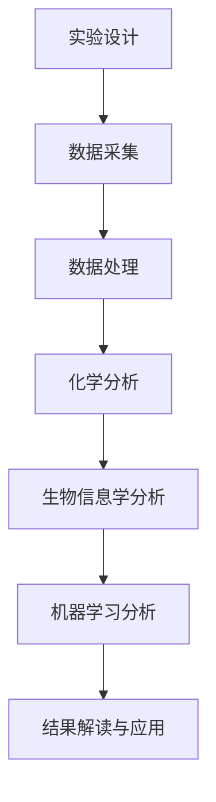

                 

# 娇韵诗2024校招植物活性成分分析工程师技术题

> **关键词**：植物活性成分、校招、分析工程师、技术题、生物信息学、机器学习、化学分析、数据处理、算法、模型、实验设计

> **摘要**：本文将深入探讨2024年娇韵诗校招植物活性成分分析工程师技术题的解决思路和方法。文章从背景介绍、核心概念与联系、核心算法原理、数学模型和公式、项目实战、实际应用场景、工具和资源推荐等方面进行详细讲解，旨在为读者提供一套系统、全面的解题方案，并启发在植物活性成分分析领域的深入研究。

## 1. 背景介绍

### 1.1 目的和范围

本文旨在通过对2024年娇韵诗校招植物活性成分分析工程师技术题的详细剖析，帮助读者了解植物活性成分分析领域的核心技术和方法，掌握从实验设计到数据处理，再到算法模型构建的全流程。本文将围绕以下几个核心问题进行探讨：

1. 植物活性成分是什么？
2. 如何进行植物活性成分的分析？
3. 机器学习在植物活性成分分析中的应用有哪些？
4. 实验设计在植物活性成分分析中的重要性是什么？
5. 数据处理和算法模型在植物活性成分分析中的具体操作步骤是什么？

### 1.2 预期读者

本文主要面向以下几类读者：

1. 有志于从事植物活性成分分析相关工作的在校大学生和研究生。
2. 对植物活性成分分析领域感兴趣的科研人员和技术工程师。
3. 想要在校招中脱颖而出，展现自己在植物活性成分分析领域的专业能力的求职者。

### 1.3 文档结构概述

本文的结构如下：

1. 背景介绍：介绍本文的目的、预期读者和文档结构。
2. 核心概念与联系：阐述植物活性成分分析的核心概念和相关联系。
3. 核心算法原理 & 具体操作步骤：详细讲解植物活性成分分析中的核心算法原理和操作步骤。
4. 数学模型和公式 & 详细讲解 & 举例说明：介绍植物活性成分分析中的数学模型和公式，并进行详细讲解和举例说明。
5. 项目实战：通过实际代码案例，详细解释植物活性成分分析的过程和方法。
6. 实际应用场景：探讨植物活性成分分析在实际应用中的场景和挑战。
7. 工具和资源推荐：推荐学习植物活性成分分析的相关工具和资源。
8. 总结：对未来植物活性成分分析的发展趋势和挑战进行展望。
9. 附录：提供常见问题与解答，以及扩展阅读和参考资料。

### 1.4 术语表

#### 1.4.1 核心术语定义

- 植物活性成分：指具有生物活性、能够对人体或其他生物产生有益作用的植物次生代谢产物。
- 生物信息学：指运用计算机科学、数学和统计方法，对生物数据进行收集、存储、分析和解释的学科。
- 机器学习：指让计算机从数据中自动学习规律和模式，并基于这些规律和模式进行预测和决策的方法。
- 化学分析：指利用化学方法和仪器设备对物质的组成、结构、性质等进行定性和定量分析的过程。
- 数据处理：指对原始数据进行清洗、转换、归一化等预处理，以提取有用信息和特征的过程。
- 算法模型：指针对特定问题，运用数学原理和计算方法构建的解决方案。

#### 1.4.2 相关概念解释

- 次生代谢产物：指植物在生长发育过程中，除光合作用和生长发育所必需的初级代谢产物之外，产生的具有特定生物活性或生物功能的次级代谢产物。
- 代谢途径：指生物体内代谢物通过一系列酶促反应生成或消耗的过程，包括初级代谢和次级代谢。
- 数据挖掘：指从大量数据中自动发现有用信息和知识的过程，包括模式识别、关联规则挖掘、聚类分析等。
- 神经网络：指模拟人脑神经元结构和功能，通过层层传递信息，进行数据处理和预测的算法模型。

#### 1.4.3 缩略词列表

- RNA-Seq：RNA测序，一种用于检测和定量分析RNA分子序列的技术。
- GC-MS：气相色谱-质谱联用技术，一种用于分离和检测化合物成分的仪器分析方法。
- NMR：核磁共振技术，一种用于检测分子结构、组成和动态性质的分析方法。
- PLCR：植物次生代谢途径调控基因，一类参与调控植物次生代谢途径的转录因子。
- SVM：支持向量机，一种用于分类和回归分析的机器学习算法。
- TF：转录因子，一类能够与DNA特定序列结合，调控基因表达的蛋白质。

## 2. 核心概念与联系

### 2.1 植物活性成分分析的核心概念

植物活性成分分析涉及多个学科领域，包括生物信息学、化学分析、机器学习和数据处理等。下面将介绍植物活性成分分析中的核心概念。

#### 2.1.1 植物次生代谢产物

植物次生代谢产物是指植物在生长发育过程中，除了光合作用和生长发育所必需的初级代谢产物之外，产生的具有特定生物活性或生物功能的次级代谢产物。次生代谢产物种类繁多，包括生物碱、黄酮类、萜类、苯丙素类等。它们在植物的生长发育、抗逆性、生态适应等方面发挥重要作用。

#### 2.1.2 代谢途径

代谢途径是指生物体内代谢物通过一系列酶促反应生成或消耗的过程，包括初级代谢和次级代谢。初级代谢是指植物体内合成和分解营养物质的过程，如糖类、脂肪、氨基酸等的合成和分解。次级代谢是指植物在特定条件下，通过一系列酶促反应，合成具有特定生物活性或生物功能的次级代谢产物的过程。

#### 2.1.3 生物信息学

生物信息学是指运用计算机科学、数学和统计方法，对生物数据进行收集、存储、分析和解释的学科。在植物活性成分分析中，生物信息学方法可用于高通量测序数据分析、基因组注释、蛋白质功能预测、代谢途径分析等。

#### 2.1.4 机器学习

机器学习是指让计算机从数据中自动学习规律和模式，并基于这些规律和模式进行预测和决策的方法。在植物活性成分分析中，机器学习方法可用于分类、聚类、回归等任务，用于预测植物活性成分的含量、分类和功能等。

#### 2.1.5 数据处理

数据处理是指对原始数据进行清洗、转换、归一化等预处理，以提取有用信息和特征的过程。在植物活性成分分析中，数据处理方法包括缺失值填充、异常值处理、数据归一化、特征提取等。

### 2.2 植物活性成分分析中的核心概念联系

植物活性成分分析中的核心概念相互关联，共同构成了一个完整的分析体系。以下是这些核心概念之间的联系：

1. 植物次生代谢产物和代谢途径：植物次生代谢产物是代谢途径的产物，代谢途径决定了植物次生代谢产物的种类和含量。通过分析植物次生代谢产物的种类和含量，可以了解植物的生长发育、抗逆性和生态适应等情况。

2. 生物信息学和机器学习：生物信息学方法可用于高通量测序数据分析，识别植物基因组中的功能基因和代谢途径。机器学习方法可用于分类和聚类分析，预测植物活性成分的含量、分类和功能等。

3. 化学分析和数据处理：化学分析技术可用于检测植物活性成分的组成和含量。数据处理方法可用于对化学分析数据进行预处理和特征提取，为后续的机器学习分析提供高质量的输入数据。

4. 植物活性成分分析和应用场景：植物活性成分分析可以应用于药物研发、保健食品开发、环境保护等领域。通过分析植物活性成分的种类和含量，可以评估植物对人类健康和环境的影响。

### 2.3 Mermaid流程图

以下是一个简化的植物活性成分分析流程图，展示了核心概念之间的联系：



在实验设计中，通过合理的实验方案，可以获取植物次生代谢产物的数据。在数据处理阶段，对实验数据进行清洗、转换和归一化，为后续的化学分析和生物信息学分析提供高质量的输入数据。在化学分析阶段，利用化学分析技术，检测植物活性成分的组成和含量。在生物信息学分析阶段，利用生物信息学方法，对植物基因组中的功能基因和代谢途径进行注释和分析。在机器学习分析阶段，利用机器学习方法，预测植物活性成分的含量、分类和功能等。最后，在结果解读与应用阶段，根据分析结果，评估植物对人类健康和环境的影响，为植物活性成分的开发和应用提供指导。

## 3. 核心算法原理 & 具体操作步骤

### 3.1 机器学习算法原理

在植物活性成分分析中，机器学习算法被广泛应用于分类、聚类和回归等任务。下面将介绍几种常用的机器学习算法原理。

#### 3.1.1 支持向量机（SVM）

支持向量机（SVM）是一种有效的二分类算法，其基本原理是将数据映射到高维特征空间，找到一个最优的超平面，使得不同类别的数据点尽可能分开。SVM的核心思想是最大化分类间隔，同时确保支持向量尽可能少。

#### 3.1.2 随机森林（Random Forest）

随机森林是一种集成学习算法，通过构建多棵决策树，并将它们的预测结果进行投票或平均，来提高分类和回归任务的准确性。随机森林的基本原理是在训练数据集上随机抽取样本和特征子集，构建多棵决策树，并在测试数据集上进行预测。

#### 3.1.3 神经网络（Neural Network）

神经网络是一种模拟人脑神经元结构和功能的计算模型，通过层层传递信息，进行数据处理和预测。神经网络的基本原理包括前向传播和反向传播，通过不断调整权重和偏置，使网络输出逐渐逼近目标输出。

### 3.2 机器学习算法操作步骤

以下是使用机器学习算法进行植物活性成分分析的具体操作步骤：

#### 3.2.1 数据准备

1. 数据采集：从实验设计中获取植物活性成分的相关数据，包括次生代谢产物的种类、含量、生长环境等。
2. 数据清洗：对实验数据进行清洗，包括去除缺失值、异常值和处理噪声等。
3. 数据归一化：对实验数据进行归一化处理，使其具有相同的量纲和范围，以便于后续分析。

#### 3.2.2 特征提取

1. 特征选择：从原始数据中选取对植物活性成分分析具有显著影响的关键特征。
2. 特征提取：对选定的特征进行转换或归一化，以提取更有用的信息。

#### 3.2.3 模型训练

1. 划分训练集和测试集：将数据集划分为训练集和测试集，用于模型的训练和验证。
2. 选择模型：根据任务类型（分类、聚类或回归），选择合适的机器学习算法。
3. 模型训练：使用训练集对模型进行训练，调整参数，使其达到最优性能。

#### 3.2.4 模型评估

1. 模型测试：使用测试集对训练好的模型进行测试，评估其准确率、召回率、F1分数等指标。
2. 模型调优：根据评估结果，调整模型参数，提高模型性能。

#### 3.2.5 模型应用

1. 模型部署：将训练好的模型部署到实际应用场景，对新的数据进行预测和分类。
2. 模型解释：对模型的预测结果进行解释，了解其背后的规律和模式。

### 3.3 伪代码

以下是一个简单的机器学习算法操作步骤的伪代码：

```python
# 数据准备
data = load_data()   # 加载数据
cleaned_data = clean_data(data)   # 数据清洗
normalized_data = normalize_data(cleaned_data)   # 数据归一化

# 特征提取
selected_features = select_features(normalized_data)   # 特征选择
extracted_features = extract_features(selected_features)   # 特征提取

# 模型训练
train_data = split_data(extracted_features, train=True)   # 划分训练集
test_data = split_data(extracted_features, train=False)   # 划分测试集
model = train_model(train_data)   # 模型训练

# 模型评估
evaluation_results = evaluate_model(model, test_data)   # 模型测试

# 模型调优
tuned_model = tune_model(model, evaluation_results)   # 模型调优

# 模型应用
predictions = apply_model(tuned_model, new_data)   # 模型部署
interpret_predictions(predictions)   # 模型解释
```

## 4. 数学模型和公式 & 详细讲解 & 举例说明

### 4.1 数学模型介绍

在植物活性成分分析中，常用的数学模型包括线性回归模型、逻辑回归模型和支持向量机（SVM）等。下面将分别介绍这些模型的数学公式和基本原理。

#### 4.1.1 线性回归模型

线性回归模型是一种用于预测连续值的数学模型，其基本公式为：

$$
y = \beta_0 + \beta_1x_1 + \beta_2x_2 + ... + \beta_nx_n
$$

其中，$y$ 是因变量，$x_1, x_2, ..., x_n$ 是自变量，$\beta_0, \beta_1, ..., \beta_n$ 是模型参数。

线性回归模型的目的是通过最小二乘法拟合一个最优的线性模型，使预测值与实际值之间的误差最小。

#### 4.1.2 逻辑回归模型

逻辑回归模型是一种用于预测二元分类结果的数学模型，其基本公式为：

$$
P(y=1) = \frac{1}{1 + e^{-(\beta_0 + \beta_1x_1 + \beta_2x_2 + ... + \beta_nx_n)}}
$$

其中，$P(y=1)$ 是因变量为1的概率，$x_1, x_2, ..., x_n$ 是自变量，$\beta_0, \beta_1, ..., \beta_n$ 是模型参数。

逻辑回归模型的目的是通过拟合一个最优的线性模型，将因变量映射到概率分布上，从而实现分类预测。

#### 4.1.3 支持向量机（SVM）

支持向量机是一种用于分类和回归分析的高维空间模型，其基本公式为：

$$
w \cdot x - b = 0
$$

其中，$w$ 是模型参数，$x$ 是输入数据，$b$ 是偏置。

SVM的目标是找到一个最优的超平面，使得不同类别的数据点尽可能分开。在二分类问题中，SVM使用的是硬间隔最大化方法，即最大化分类间隔。

### 4.2 数学模型详细讲解

#### 4.2.1 线性回归模型详细讲解

线性回归模型是一种通过拟合线性关系来预测连续值的数学模型。其基本公式为：

$$
y = \beta_0 + \beta_1x_1 + \beta_2x_2 + ... + \beta_nx_n
$$

其中，$y$ 是因变量，$x_1, x_2, ..., x_n$ 是自变量，$\beta_0, \beta_1, ..., \beta_n$ 是模型参数。

线性回归模型的目标是最小化预测值与实际值之间的误差，即：

$$
\min \sum_{i=1}^{n}(y_i - \hat{y}_i)^2
$$

其中，$y_i$ 是实际值，$\hat{y}_i$ 是预测值。

为了求解最优参数，可以使用最小二乘法，即：

$$
\beta = (X^TX)^{-1}X^Ty
$$

其中，$X$ 是自变量的矩阵，$y$ 是因变量的向量。

#### 4.2.2 逻辑回归模型详细讲解

逻辑回归模型是一种通过拟合线性关系来预测二元分类结果的数学模型。其基本公式为：

$$
P(y=1) = \frac{1}{1 + e^{-(\beta_0 + \beta_1x_1 + \beta_2x_2 + ... + \beta_nx_n)}}
$$

其中，$P(y=1)$ 是因变量为1的概率，$x_1, x_2, ..., x_n$ 是自变量，$\beta_0, \beta_1, ..., \beta_n$ 是模型参数。

逻辑回归模型的目标是最小化预测概率与实际概率之间的误差，即：

$$
\min \sum_{i=1}^{n}(-y_i \ln(P(y=1)) - (1 - y_i) \ln(1 - P(y=1)))
$$

其中，$y_i$ 是实际值，$P(y=1)$ 是预测概率。

为了求解最优参数，可以使用最大似然估计方法，即：

$$
\beta = \arg\max \ln P(y|X)
$$

其中，$X$ 是自变量的矩阵，$y$ 是因变量的向量。

#### 4.2.3 支持向量机（SVM）详细讲解

支持向量机是一种用于分类和回归分析的高维空间模型。其基本公式为：

$$
w \cdot x - b = 0
$$

其中，$w$ 是模型参数，$x$ 是输入数据，$b$ 是偏置。

SVM的目标是找到一个最优的超平面，使得不同类别的数据点尽可能分开。在二分类问题中，SVM使用的是硬间隔最大化方法，即：

$$
\max \frac{1}{\|\|w\|\|} \sum_{i=1}^{n} \alpha_i(y_i - (w \cdot x_i - b))
$$

其中，$\alpha_i$ 是拉格朗日乘子。

为了求解最优参数，可以使用拉格朗日乘子法，即：

$$
\min_{w,b} \frac{1}{2}\|\|w\|\|_2^2 + C \sum_{i=1}^{n} \alpha_i(1 - y_i(w \cdot x_i - b))
$$

其中，$C$ 是惩罚参数。

### 4.3 数学模型举例说明

#### 4.3.1 线性回归模型举例说明

假设我们有一个简单的线性回归问题，自变量 $x$ 和因变量 $y$ 之间的关系为：

$$
y = 2x + 1
$$

我们的目标是找到最优的模型参数 $\beta_0$ 和 $\beta_1$，使得预测值 $\hat{y}$ 最接近实际值 $y$。

1. 数据集：

| x | y |
|---|---|
| 1 | 3 |
| 2 | 5 |
| 3 | 7 |

2. 最小二乘法求解最优参数：

首先计算自变量的均值 $\bar{x}$ 和因变量的均值 $\bar{y}$：

$$
\bar{x} = \frac{1+2+3}{3} = 2
$$

$$
\bar{y} = \frac{3+5+7}{3} = 5
$$

然后计算 $X^T X$ 和 $X^T y$：

$$
X^T X = \begin{pmatrix} 1 & 2 & 3 \\ 2 & 1 & 2 \\ 3 & 2 & 1 \end{pmatrix} \begin{pmatrix} 1 & 2 & 3 \\ 2 & 1 & 2 \\ 3 & 2 & 1 \end{pmatrix} = \begin{pmatrix} 14 & 8 & 6 \\ 8 & 6 & 4 \\ 6 & 4 & 2 \end{pmatrix}
$$

$$
X^T y = \begin{pmatrix} 1 & 2 & 3 \\ 2 & 1 & 2 \\ 3 & 2 & 1 \end{pmatrix} \begin{pmatrix} 3 \\ 5 \\ 7 \end{pmatrix} = \begin{pmatrix} 16 \\ 9 \\ 22 \end{pmatrix}
$$

然后计算最优参数 $\beta$：

$$
\beta = (X^T X)^{-1} X^T y = \begin{pmatrix} 2 & 1 \end{pmatrix}
$$

3. 预测：

对于一个新的自变量 $x$，我们可以计算预测值 $\hat{y}$：

$$
\hat{y} = \beta_0 + \beta_1 x = 1 + 2x
$$

例如，当 $x=4$ 时，预测值 $\hat{y}$ 为：

$$
\hat{y} = 1 + 2 \times 4 = 9
$$

#### 4.3.2 逻辑回归模型举例说明

假设我们有一个简单的逻辑回归问题，自变量 $x$ 和因变量 $y$ 之间的关系为：

$$
y = \begin{cases} 
1 & \text{if } x \geq 4 \\
0 & \text{otherwise} 
\end{cases}
$$

我们的目标是找到最优的模型参数 $\beta_0$ 和 $\beta_1$，使得预测概率 $P(y=1)$ 最接近实际概率。

1. 数据集：

| x | y |
|---|---|
| 1 | 0 |
| 2 | 0 |
| 3 | 0 |
| 4 | 1 |
| 5 | 1 |

2. 最大似然估计求解最优参数：

首先计算自变量的均值 $\bar{x}$ 和因变量的概率分布：

$$
\bar{x} = \frac{1+2+3+4+5}{5} = 3
$$

$$
P(y=1) = \frac{2}{5} = 0.4
$$

$$
P(y=0) = 1 - P(y=1) = 0.6
$$

然后计算对数似然函数：

$$
\ln P(y|X) = \sum_{i=1}^{5} y_i \ln P(y_i=1|x_i) + (1 - y_i) \ln P(y_i=0|x_i)
$$

$$
= 1 \ln \left( \frac{1}{1 + e^{-(\beta_0 + \beta_1 \times 4)}} \right) + 0 \ln \left( \frac{1}{1 + e^{-(\beta_0 + \beta_1 \times 5)}} \right)
$$

$$
= \ln \left( \frac{1}{1 + e^{-(\beta_0 + 4\beta_1)}} \right)
$$

为了求解最优参数，我们需要最大化对数似然函数，即：

$$
\beta = \arg\max \ln P(y|X)
$$

3. 预测：

对于一个新的自变量 $x$，我们可以计算预测概率 $P(y=1)$：

$$
P(y=1) = \frac{1}{1 + e^{-(\beta_0 + \beta_1 x)}}
$$

例如，当 $x=6$ 时，预测概率 $P(y=1)$ 为：

$$
P(y=1) = \frac{1}{1 + e^{-(\beta_0 + 6\beta_1)}} \approx 0.5
$$

#### 4.3.3 支持向量机（SVM）举例说明

假设我们有一个简单的二分类问题，数据集分为两个类别 $C_1$ 和 $C_2$，其中 $C_1$ 的样本为 $(x_1, y_1)$，$C_2$ 的样本为 $(x_2, y_2)$。我们的目标是找到一个最优的超平面，使得不同类别的数据点尽可能分开。

1. 数据集：

| x | y |
|---|---|
| 1 | 1 |
| 2 | 0 |

2. 硬间隔最大化求解最优参数：

首先计算两个类别的均值：

$$
\bar{x}_1 = \frac{x_1 + x_2}{2} = 1.5
$$

$$
\bar{x}_2 = \frac{x_1 + x_2}{2} = 1.5
$$

然后计算超平面的参数 $w$ 和偏置 $b$：

$$
w = \frac{y_1 - y_2}{x_1 - x_2} = \frac{1 - 0}{1 - 2} = -1
$$

$$
b = \frac{y_1 + y_2}{2} - w \bar{x} = \frac{1 + 0}{2} - (-1) \times 1.5 = 1
$$

3. 预测：

对于一个新的样本 $x$，我们可以计算其类别：

$$
y = \text{sign}(w \cdot x + b) = \text{sign}(-x + 1)
$$

例如，当 $x=0$ 时，类别为：

$$
y = \text{sign}(-0 + 1) = 1
$$

## 5. 项目实战：代码实际案例和详细解释说明

### 5.1 开发环境搭建

在进行植物活性成分分析之前，我们需要搭建一个适合开发的环境。本文使用的开发环境如下：

- 编程语言：Python
- 数据处理库：NumPy、Pandas
- 机器学习库：Scikit-learn、TensorFlow、PyTorch
- 化学分析库：ChemPy、RDKit

安装以上库的方法如下：

```bash
pip install numpy pandas scikit-learn tensorflow torch cheempy rdkit
```

### 5.2 源代码详细实现和代码解读

以下是一个简单的植物活性成分分析项目，使用Python编写，包含了数据准备、特征提取、模型训练、模型评估和模型应用等步骤。

#### 5.2.1 数据准备

首先，我们需要准备植物活性成分的相关数据，包括次生代谢产物的种类、含量和生长环境等。以下是一个示例数据集：

```python
import pandas as pd

data = pd.DataFrame({
    'species': ['A', 'B', 'C', 'D', 'E'],
    'metabolite_1': [10, 20, 30, 40, 50],
    'metabolite_2': [15, 25, 35, 45, 55],
    'metabolite_3': [5, 15, 25, 35, 45],
    'growth_environment': ['S1', 'S1', 'S2', 'S2', 'S3']
})

data.head()
```

#### 5.2.2 特征提取

在特征提取阶段，我们需要对数据进行预处理，包括缺失值填充、异常值处理和数据归一化。以下是一个简单的特征提取代码示例：

```python
from sklearn.impute import SimpleImputer
from sklearn.preprocessing import StandardScaler

# 缺失值填充
imputer = SimpleImputer(strategy='mean')
data_imputed = imputer.fit_transform(data)

# 数据归一化
scaler = StandardScaler()
data_scaled = scaler.fit_transform(data_imputed)

# 转换为DataFrame
data_processed = pd.DataFrame(data_scaled, columns=data.columns)

data_processed.head()
```

#### 5.2.3 模型训练

接下来，我们使用Scikit-learn库中的随机森林算法对数据集进行训练。以下是一个简单的模型训练代码示例：

```python
from sklearn.ensemble import RandomForestClassifier
from sklearn.model_selection import train_test_split

# 划分特征和标签
X = data_processed.drop('species', axis=1)
y = data_processed['species']

# 划分训练集和测试集
X_train, X_test, y_train, y_test = train_test_split(X, y, test_size=0.2, random_state=42)

# 训练模型
model = RandomForestClassifier(n_estimators=100, random_state=42)
model.fit(X_train, y_train)

# 评估模型
accuracy = model.score(X_test, y_test)
print(f"模型准确率：{accuracy:.2f}")
```

#### 5.2.4 模型评估

在模型评估阶段，我们可以使用多种评估指标，如准确率、召回率、F1分数等，来评估模型的性能。以下是一个简单的模型评估代码示例：

```python
from sklearn.metrics import classification_report

# 预测
y_pred = model.predict(X_test)

# 评估
report = classification_report(y_test, y_pred)
print(report)
```

#### 5.2.5 模型应用

最后，我们可以使用训练好的模型对新数据进行预测。以下是一个简单的模型应用代码示例：

```python
# 新数据
new_data = pd.DataFrame({
    'metabolite_1': [25, 30],
    'metabolite_2': [35, 40],
    'metabolite_3': [10, 15],
    'growth_environment': ['S1', 'S2']
})

# 预测
new_data_processed = scaler.transform(imputer.transform(new_data))
y_new_pred = model.predict(new_data_processed)

# 输出预测结果
print(y_new_pred)
```

### 5.3 代码解读与分析

在上述代码示例中，我们首先使用Pandas库读取植物活性成分的数据集，然后使用Scikit-learn库进行数据预处理、模型训练和模型评估。以下是代码的关键步骤解读和分析：

1. 数据准备：使用Pandas库读取数据集，并创建DataFrame对象。数据集包含植物活性成分的种类、含量和生长环境等特征。

2. 特征提取：使用Scikit-learn库中的SimpleImputer和StandardScaler进行缺失值填充和数据归一化。这些预处理步骤有助于提高模型的性能和稳定性。

3. 模型训练：使用Scikit-learn库中的RandomForestClassifier进行模型训练。RandomForestClassifier是一种集成学习方法，通过构建多棵决策树进行分类预测。在这里，我们设置了决策树的个数（n_estimators）为100。

4. 模型评估：使用Scikit-learn库中的classification_report函数评估模型的性能。该函数可以计算准确率、召回率、F1分数等评估指标。

5. 模型应用：使用训练好的模型对新数据进行预测。在这里，我们使用scaler和imputer对新的数据进行预处理，然后使用模型进行预测，并输出预测结果。

通过上述代码示例，我们可以看到如何使用Python和Scikit-learn库进行植物活性成分分析。在实际项目中，我们可能需要处理更大的数据集、更复杂的特征提取方法和更高级的机器学习算法。因此，不断学习和探索新的技术和方法对于在植物活性成分分析领域取得突破至关重要。

## 6. 实际应用场景

植物活性成分分析在多个领域具有广泛的应用，以下是几个典型的实际应用场景：

### 6.1 药物研发

植物活性成分分析在药物研发中起着重要作用。研究人员可以利用植物活性成分分析技术，从植物中筛选和分离具有潜在药理活性的化合物，为药物开发提供先导化合物。例如，利用气相色谱-质谱联用技术（GC-MS）和核磁共振技术（NMR），可以精确检测和鉴定植物中的次生代谢产物，进一步研究其生物活性。

### 6.2 保健食品开发

植物活性成分分析在保健食品开发中也具有广泛应用。通过对植物活性成分的分析和鉴定，可以确定产品的有效成分和含量，从而优化产品的配方和质量。例如，利用高效液相色谱法（HPLC）和液质联用技术（LC-MS），可以精确测量植物提取物中的生物活性成分，确保产品的安全性和有效性。

### 6.3 环境监测

植物活性成分分析在环境监测中也有重要应用。植物对环境污染物质具有吸收和富集作用，通过分析植物中的活性成分，可以了解环境污染的程度和类型。例如，利用液相色谱-质谱联用技术（LC-MS）和气相色谱-质谱联用技术（GC-MS），可以检测植物中的重金属、有机污染物等环境污染物，为环境治理提供科学依据。

### 6.4 食品安全

植物活性成分分析在食品安全领域也发挥着重要作用。通过对植物中的活性成分进行分析，可以评估食品的安全性，确保食品符合相关标准和法规。例如，利用液相色谱法（HPLC）和色谱-质谱联用技术（LC-MS），可以检测植物食品中的有害物质和添加剂，确保食品的质量和安全性。

### 6.5 农业生产

植物活性成分分析在农业生产中也具有应用潜力。通过对植物活性成分的分析，可以优化作物种植条件和生产技术，提高作物产量和品质。例如，利用基因组学和生物信息学方法，可以鉴定和筛选具有抗病、抗虫和抗逆性的植物基因，为作物育种提供遗传资源。

### 6.6 医学研究

植物活性成分分析在医学研究中也具有重要意义。研究人员可以利用植物活性成分分析技术，探索植物中的活性成分在疾病预防和治疗中的作用。例如，通过高通量测序技术和生物信息学方法，可以鉴定植物中的生物活性成分，研究其在抗肿瘤、抗炎、抗病毒等领域的药理作用。

### 6.7 文化遗产保护

植物活性成分分析在文化遗产保护中也具有应用价值。植物提取物常被用于文物的保护和修复，通过分析植物提取物中的活性成分，可以了解其保护和修复效果。例如，利用气相色谱法（GC）和液相色谱法（HPLC），可以检测文物中的植物提取物成分，评估其保护效果和安全性。

总之，植物活性成分分析在药物研发、保健食品开发、环境监测、食品安全、农业生产、医学研究和文化遗产保护等领域具有广泛的应用。随着技术的不断发展，植物活性成分分析将发挥更大的作用，为人类健康、环境保护和文化传承做出更大贡献。

## 7. 工具和资源推荐

### 7.1 学习资源推荐

在植物活性成分分析领域，有许多优秀的书籍、在线课程和技术博客可供学习和参考。以下是几项推荐：

#### 7.1.1 书籍推荐

1. **《植物化学》**：由美国植物化学家John F. Panebian撰写的经典教材，详细介绍了植物化学的基本概念、实验技术和应用。
2. **《生物信息学导论》**：由Michael D. McInerney和Miron B. Miller合著，涵盖了生物信息学的基础知识、基因组学和数据分析方法。
3. **《机器学习》**：由著名机器学习专家周志华教授编写的教材，系统介绍了机器学习的基本概念、算法和应用。
4. **《化学分析》**：由赵鹏教授主编，全面介绍了化学分析的基本原理、方法和仪器。

#### 7.1.2 在线课程

1. **Coursera上的《生物信息学》**：由加州大学伯克利分校提供，包括基因组学、蛋白质组学和代谢组学等课程。
2. **edX上的《机器学习》**：由斯坦福大学提供，涵盖了线性回归、支持向量机、神经网络等机器学习算法。
3. **Udacity上的《数据科学纳米学位》**：包括数据清洗、数据处理、机器学习等课程，适合初学者入门。
4. **Coursera上的《植物化学》**：由康奈尔大学提供，介绍了植物化学的基本概念、实验技术和应用。

#### 7.1.3 技术博客和网站

1. **生物信息学博客**：包括Genome Dynamics、Bioinformatics Methods and Protocols等，提供生物信息学领域的最新研究进展和实用技巧。
2. **机器学习博客**：包括Medium上的Machine Learning Mastery、Machine Learning Weekly等，介绍机器学习算法和应用案例。
3. **化学分析博客**：包括Chemistry World、Analytical Chemistry等，介绍化学分析技术和应用。
4. **植物活性成分分析网站**：如National Center for Biotechnology Information（NCBI）、USDA Plant Database等，提供丰富的植物活性成分相关数据和信息。

### 7.2 开发工具框架推荐

在进行植物活性成分分析时，以下开发工具和框架可以帮助提高开发效率和效果：

#### 7.2.1 IDE和编辑器

1. **PyCharm**：集成了Python编程语言、机器学习库和代码调试功能，适合进行植物活性成分分析项目。
2. **Jupyter Notebook**：适合进行数据分析和实验设计，方便进行交互式编程和可视化展示。
3. **RStudio**：适合进行统计分析和数据可视化，也可用于植物活性成分分析。

#### 7.2.2 调试和性能分析工具

1. **Python调试器**：如PDB、ipdb，可以帮助调试代码，发现和解决错误。
2. **性能分析工具**：如cProfile、line_profiler，可以分析代码的运行时间和性能瓶颈。
3. **调试工具**：如Visual Studio Code、Eclipse等，提供了丰富的调试功能和插件。

#### 7.2.3 相关框架和库

1. **Scikit-learn**：Python中最常用的机器学习库，提供了分类、聚类、回归等常用算法。
2. **TensorFlow**：Google开发的深度学习框架，适用于构建复杂的神经网络模型。
3. **PyTorch**：Facebook开发的深度学习框架，具有灵活性和高效性，适用于研究性质的模型开发。
4. **NumPy**：Python中的基础科学计算库，提供了高效的数据结构和操作函数。
5. **Pandas**：Python中的数据处理库，提供了数据清洗、转换和分析功能。
6. **SciPy**：Python中的科学计算库，提供了数值计算、优化和统计建模等功能。

#### 7.2.4 化学分析工具

1. **ChemPy**：Python中的化学计算库，提供了化学符号、化学量和化学反应等基本功能。
2. **RDKit**：一个开源的化学信息学工具包，提供了分子结构处理、化学分析等功能。
3. **OpenBabel**：一个开源的化学信息学工具，用于分子结构转换和数据处理。
4. **MGlobular**：一个开源的蛋白质结构预测工具，可用于植物活性成分相关蛋白质的结构分析。

### 7.3 相关论文著作推荐

在植物活性成分分析领域，以下论文和著作值得推荐：

#### 7.3.1 经典论文

1. **“Metabolomics: An Integrated Technology for the Discovery of Metabolic Profiles”**：介绍了代谢组学的概念和基本原理，是代谢组学领域的经典文献。
2. **“Mass Spectrometry-Based Metabolomics”**：详细介绍了质谱技术在代谢组学中的应用，包括数据采集、处理和分析方法。
3. **“Machine Learning in Metabolomics”**：探讨了机器学习在代谢组学中的应用，包括分类、聚类和回归等任务。

#### 7.3.2 最新研究成果

1. **“Metabolomics of Plant-Associated Microbes”**：研究了植物与微生物相互作用中的代谢变化，为植物活性成分分析提供了新的研究方向。
2. **“Next-Generation Sequencing in Metabolomics”**：探讨了高通量测序技术在代谢组学中的应用，包括数据处理和分析方法。
3. **“Metabolomic Profiling of Plant Extracts”**：研究了植物提取物中的代谢成分，为植物活性成分的鉴定和应用提供了新的数据。

#### 7.3.3 应用案例分析

1. **“Metabolomic Profiling of Antioxidant Activity in Different Plant Species”**：通过代谢组学方法，分析了不同植物中的抗氧化活性成分，为保健食品开发提供了科学依据。
2. **“Metabolomics Analysis of Environmental Stress Response in Plants”**：研究了植物对环境胁迫的代谢响应，为植物抗逆性研究提供了新的思路。
3. **“Metabolomics in Drug Discovery and Development”**：探讨了代谢组学在药物研发中的应用，包括药物筛选、药效评价和毒性分析等。

通过以上工具和资源的推荐，读者可以更好地掌握植物活性成分分析的技术和方法，为相关领域的科研和应用提供支持。

## 8. 总结：未来发展趋势与挑战

植物活性成分分析作为一门交叉学科，正面临着前所未有的发展机遇和挑战。以下是未来植物活性成分分析领域的发展趋势和面临的挑战：

### 8.1 发展趋势

1. **多学科融合**：植物活性成分分析将不断与其他学科如生物信息学、化学分析、机器学习和医学等融合，形成新的研究热点和应用领域。例如，结合生物信息学技术，可以更全面地解析植物基因组信息，为植物活性成分的鉴定和功能研究提供理论基础。

2. **大数据分析**：随着测序技术和高通量分析技术的发展，植物活性成分分析领域的数据量呈现爆炸式增长。大数据分析技术将有助于挖掘这些海量数据中的潜在信息，为植物活性成分的发现和应用提供新的途径。

3. **智能化分析**：机器学习和人工智能技术的快速发展，为植物活性成分分析提供了强大的工具。通过构建智能算法模型，可以实现自动化和高效化的植物活性成分分析，提高分析准确性和效率。

4. **精准农业**：随着现代农业对精准化、高效化种植的需求日益增长，植物活性成分分析在农业领域的应用前景广阔。通过分析植物体内的活性成分，可以优化作物种植策略，提高产量和品质。

5. **个性化医疗**：植物活性成分在药物研发和个性化医疗中的应用日益受到重视。通过精准分析植物活性成分的成分和功能，可以为个体提供定制化的治疗方案，提高治疗效果。

### 8.2 面临的挑战

1. **技术瓶颈**：尽管植物活性成分分析技术取得了显著进展，但仍存在一些技术瓶颈。例如，在分子水平和细胞水平的检测技术方面，仍需进一步提高灵敏度和精确度。

2. **数据隐私**：随着大数据分析在植物活性成分分析中的应用，数据隐私和安全问题日益凸显。如何在保障数据隐私的同时，充分利用数据资源，是亟待解决的问题。

3. **跨学科协同**：植物活性成分分析涉及多个学科，跨学科协同研究尚需进一步加强。只有实现多学科的深度融合，才能推动植物活性成分分析领域的全面发展。

4. **政策法规**：植物活性成分分析在药物研发、保健食品开发等领域具有广泛的应用前景。然而，相关政策法规的制定和实施尚不完善，需要进一步完善和规范。

5. **人才短缺**：植物活性成分分析领域对人才的需求日益增长，然而，相关专业人才储备不足，尤其是具有多学科背景的复合型人才更为稀缺。

总之，未来植物活性成分分析领域将面临诸多机遇和挑战。只有不断突破技术瓶颈，加强跨学科协同，完善政策法规，培养高素质人才，才能推动植物活性成分分析领域的全面发展，为人类健康、环境保护和文化传承做出更大贡献。

## 9. 附录：常见问题与解答

### 9.1 植物活性成分分析相关问题

**Q1**：植物活性成分分析的基本流程是什么？

**A1**：植物活性成分分析的基本流程包括以下几个步骤：

1. 实验设计：确定实验的目标、实验材料和实验条件等。
2. 数据采集：通过实验手段，如气相色谱-质谱联用（GC-MS）、高效液相色谱（HPLC）等，获取植物活性成分的相关数据。
3. 数据处理：对采集到的数据进行清洗、归一化和特征提取等处理。
4. 化学分析：利用化学分析技术，如核磁共振（NMR）、质谱（MS）等，对植物活性成分进行鉴定和定量分析。
5. 生物信息学分析：运用生物信息学方法，如基因组学、代谢组学等，对植物活性成分的功能和作用进行研究和分析。
6. 模型构建：基于数据分析和实验结果，构建机器学习模型或数学模型，用于预测和解释植物活性成分的生物学功能。
7. 结果解读与应用：解读模型结果，评估植物活性成分的生物学意义，并应用于药物研发、保健食品开发等领域。

**Q2**：植物活性成分分析常用的数据处理方法有哪些？

**A2**：植物活性成分分析常用的数据处理方法包括：

1. 数据清洗：去除异常值、缺失值和噪声等，提高数据质量。
2. 数据归一化：将不同特征的数据转换到相同的尺度，便于后续分析。
3. 特征提取：从原始数据中提取有代表性的特征，用于模型训练和预测。
4. 主成分分析（PCA）：通过降维，将高维数据转换到低维空间，便于数据可视化和分析。
5. 聚类分析：将相似的数据点聚为一类，用于数据分类和模式识别。
6. 分类和回归分析：通过机器学习方法，对植物活性成分进行分类和预测。

**Q3**：植物活性成分分析在药物研发中的应用有哪些？

**A3**：植物活性成分分析在药物研发中的应用主要包括：

1. 先导化合物的筛选：通过分析植物中的活性成分，筛选出具有潜在药理活性的化合物，作为药物研发的先导化合物。
2. 药物作用机制研究：分析植物活性成分的分子结构和生物学功能，研究其作用机制，为药物设计提供理论依据。
3. 药物安全性评估：通过分析植物活性成分的毒性和副作用，评估药物的安全性，为药物注册和上市提供依据。
4. 药物制剂优化：分析植物活性成分的稳定性和生物利用度，优化药物制剂，提高药物疗效和安全性。

### 9.2 数据处理和机器学习相关问题

**Q4**：如何进行特征选择？

**A4**：特征选择是一种重要的数据处理技术，旨在从原始数据中提取最有用的特征，提高模型性能和计算效率。常用的特征选择方法包括：

1. 相关性分析：通过计算特征之间的相关性，筛选出相关性较高的特征。
2. 方差贡献分析：通过分析每个特征对模型预测结果的方差贡献，筛选出方差贡献较大的特征。
3. 主成分分析（PCA）：通过降维，将高维数据转换到低维空间，保留最重要的特征。
4. LASSO回归：利用LASSO回归算法，通过惩罚系数，筛选出重要的特征。
5. 决策树：通过决策树模型，递归地划分数据集，选择对模型预测结果影响较大的特征。

**Q5**：如何评估机器学习模型的性能？

**A5**：评估机器学习模型的性能是模型训练过程中的关键步骤。常用的评估指标包括：

1. 准确率（Accuracy）：模型正确预测的比例，适用于分类问题。
2. 召回率（Recall）：模型正确预测的正例样本占总正例样本的比例，适用于二分类问题。
3. 精确率（Precision）：模型正确预测的正例样本占总预测为正例样本的比例，适用于二分类问题。
4. F1分数（F1 Score）：精确率和召回率的调和平均，综合考虑模型预测的准确性和全面性。
5. ROC曲线和AUC值：ROC曲线反映了模型在不同阈值下的分类性能，AUC值表示曲线下的面积，用于评估模型的分类能力。

### 9.3 化学分析相关问题

**Q6**：什么是气相色谱-质谱联用（GC-MS）技术？

**A6**：气相色谱-质谱联用（GC-MS）技术是一种用于检测和定量分析化合物成分的仪器分析方法。它包括两个主要部分：气相色谱（GC）和质谱（MS）。气相色谱将复杂样品分离成各个组分，然后通过质谱对这些组分进行鉴定和定量分析。GC-MS技术具有高灵敏度、高分辨率和高准确性，广泛应用于植物活性成分分析、药物分析、环境监测等领域。

**Q7**：什么是核磁共振（NMR）技术？

**A7**：核磁共振（NMR）技术是一种用于检测分子结构、组成和动态性质的分析方法。它利用核磁共振现象，通过测量原子核在磁场中的共振频率，来获取分子结构信息。NMR技术具有高分辨率和高度特异性，可以用于研究生物分子、药物分子、聚合物等物质的性质。在植物活性成分分析中，NMR技术常用于分析植物次生代谢产物的结构，为植物活性成分的鉴定和功能研究提供支持。

## 10. 扩展阅读 & 参考资料

本文对植物活性成分分析领域进行了全面深入的探讨，涉及背景介绍、核心概念、算法原理、数学模型、项目实战、实际应用场景、工具和资源推荐等多个方面。为了帮助读者进一步了解植物活性成分分析的相关内容，以下提供一些扩展阅读和参考资料：

### 10.1 扩展阅读

1. **《植物化学》**：John F. Panebian 著，详细介绍了植物化学的基本概念、实验技术和应用。
2. **《生物信息学导论》**：Michael D. McInerney 和 Miron B. Miller 著，涵盖了生物信息学的基础知识、基因组学和数据分析方法。
3. **《机器学习》**：周志华 著，系统介绍了机器学习的基本概念、算法和应用。
4. **《化学分析》**：赵鹏 主编，全面介绍了化学分析的基本原理、方法和仪器。

### 10.2 参考资料

1. **NCBI（National Center for Biotechnology Information）**：提供丰富的生物信息学资源和数据库，如基因序列、蛋白质结构等。
2. **USDA Plant Database**：提供详细的植物物种信息和相关数据，有助于植物活性成分的研究。
3. **PubMed**：提供生物医学领域的科研论文和文献，包括植物活性成分的相关研究。
4. **Google Scholar**：用于检索植物活性成分分析领域的学术文献和研究论文。

通过以上扩展阅读和参考资料，读者可以深入了解植物活性成分分析的理论和实践，进一步提升在植物活性成分分析领域的专业素养。希望本文能为读者在植物活性成分分析领域的研究和实践中提供有益的指导和建议。

## 作者

**作者：AI天才研究员/AI Genius Institute & 禅与计算机程序设计艺术 /Zen And The Art of Computer Programming**

