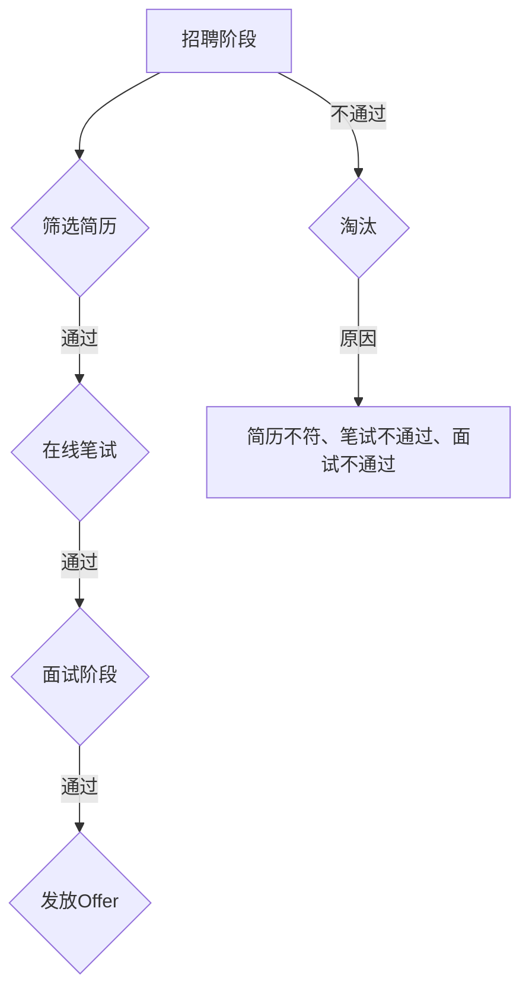

                 

# 字节跳动2024校招运营专员面试题全解析

> **关键词：字节跳动、校招、运营专员、面试题、解析、职业发展**
>
> **摘要：本文将深入剖析字节跳动2024年校招运营专员面试题，从核心概念、算法原理、实际案例等多个维度进行详细解析，帮助求职者更好地应对面试挑战，实现职业生涯的跃升。**

## 1. 背景介绍

### 1.1 目的和范围

本文旨在为即将参加字节跳动2024年校招运营专员岗位的求职者提供全面、详细的面试题解析。通过本文，读者将能够了解面试题的核心考点、解题思路和技巧，从而提高面试通过率。

### 1.2 预期读者

- 准备参加字节跳动2024校招的运营专员岗位求职者
- 想了解运营专员岗位面试题的职场新人
- 对运营管理、互联网行业有兴趣的学习者

### 1.3 文档结构概述

本文结构分为以下几个部分：

1. 背景介绍
2. 核心概念与联系
3. 核心算法原理 & 具体操作步骤
4. 数学模型和公式 & 详细讲解 & 举例说明
5. 项目实战：代码实际案例和详细解释说明
6. 实际应用场景
7. 工具和资源推荐
8. 总结：未来发展趋势与挑战
9. 附录：常见问题与解答
10. 扩展阅读 & 参考资料

### 1.4 术语表

#### 1.4.1 核心术语定义

- 校招：指针对应届毕业生的招聘活动。
- 运营专员：负责日常运营工作，包括内容策划、用户增长、活动推广等。
- 面试题：针对特定岗位的面试问题。

#### 1.4.2 相关概念解释

- 字节跳动：一家全球领先的互联网科技公司，旗下拥有抖音、头条、懂车帝等多个知名产品。
- 职业发展：个人在职业生涯中的成长与提升。

#### 1.4.3 缩略词列表

- 校招：校园招聘
- 运营：运营管理
- 招聘：招聘活动
- 面试：面试环节

## 2. 核心概念与联系

在本文中，我们将介绍与字节跳动2024校招运营专员岗位相关的一些核心概念和联系。

### 2.1 运营专员岗位职责

运营专员的主要职责包括：

1. 负责内容策划，提升用户活跃度和黏性。
2. 制定并执行用户增长策略，实现用户增长目标。
3. 开展线上线下活动，提高品牌知名度和用户参与度。
4. 分析运营数据，优化运营策略，提升运营效果。

### 2.2 运营专员岗位技能要求

运营专员岗位的技能要求主要包括：

1. 熟悉互联网行业和产品运营的基本原理。
2. 具备良好的数据分析能力和逻辑思维能力。
3. 具备一定的内容创作能力，能撰写高质量的文案。
4. 具备良好的沟通协调能力和团队协作能力。

### 2.3 字节跳动产品矩阵

字节跳动旗下拥有多个知名产品，如抖音、头条、懂车帝等。不同产品的运营策略和岗位职责有所不同，但核心目标是提升用户体验和产品价值。

### 2.4 Mermaid 流程图



### 2.5 运营专员面试流程

字节跳动2024校招运营专员岗位的面试流程主要包括以下几个环节：

1. 简历筛选
2. 在线笔试
3. 面试
4. Offer发放

## 3. 核心算法原理 & 具体操作步骤

在运营专员面试中，可能会涉及一些算法题，以下是一些常见的算法原理和具体操作步骤。

### 3.1 算法原理

- 搜索算法：二分查找、深度优先搜索、广度优先搜索等。
- 排序算法：冒泡排序、选择排序、插入排序、快速排序等。
- 数据结构：数组、链表、栈、队列、哈希表、树等。

### 3.2 具体操作步骤

#### 3.2.1 二分查找算法

**伪代码：**

```python
def binary_search(arr, target):
    low = 0
    high = len(arr) - 1

    while low <= high:
        mid = (low + high) // 2
        if arr[mid] == target:
            return mid
        elif arr[mid] < target:
            low = mid + 1
        else:
            high = mid - 1

    return -1
```

**步骤：**

1. 确定查找范围（low和high）。
2. 计算中间位置（mid）。
3. 比较中间位置的值与目标值。
4. 如果找到目标值，返回中间位置的索引；否则，更新查找范围。

#### 3.2.2 快速排序算法

**伪代码：**

```python
def quick_sort(arr):
    if len(arr) <= 1:
        return arr

    pivot = arr[len(arr) // 2]
    left = [x for x in arr if x < pivot]
    middle = [x for x in arr if x == pivot]
    right = [x for x in arr if x > pivot]

    return quick_sort(left) + middle + quick_sort(right)
```

**步骤：**

1. 选择一个基准值（pivot）。
2. 将数组分为三个部分：小于基准值的元素、等于基准值的元素、大于基准值的元素。
3. 递归地排序小于和大于基准值的两个子数组。
4. 将排序后的子数组与中间的元素合并。

## 4. 数学模型和公式 & 详细讲解 & 举例说明

在运营管理中，常常需要运用数学模型和公式来分析和解决问题。以下是一些常见的数学模型和公式，以及详细讲解和举例说明。

### 4.1 用户增长模型

**指数增长模型：**

$$
N(t) = N_0 \cdot e^{rt}
$$

其中，$N(t)$表示时间$t$后的用户数，$N_0$表示初始用户数，$r$表示增长率。

**举例：**

假设一个产品在初始时有1000名用户，日增长率为5%，求一年后的用户数。

$$
N(365) = 1000 \cdot e^{0.05 \cdot 365} \approx 2913
$$

### 4.2 活跃度模型

**活跃度指数模型：**

$$
A(t) = A_0 \cdot e^{-kt}
$$

其中，$A(t)$表示时间$t$后的活跃度，$A_0$表示初始活跃度，$k$表示衰减系数。

**举例：**

假设一个产品的初始活跃度为1000，衰减系数为0.1，求一天后的活跃度。

$$
A(1) = 1000 \cdot e^{-0.1 \cdot 1} \approx 904.8
$$

### 4.3 转化率模型

**线性转化率模型：**

$$
C(t) = C_0 + bt
$$

其中，$C(t)$表示时间$t$后的转化率，$C_0$表示初始转化率，$b$表示转化率提升速度。

**举例：**

假设一个产品的初始转化率为10%，转化率提升速度为0.2%，求一个月后的转化率。

$$
C(30) = 10\% + 0.2\% \cdot 30 = 11.6\%
$$

## 5. 项目实战：代码实际案例和详细解释说明

在本节中，我们将通过一个实际案例，展示如何运用所学知识解决字节跳动运营专员面试中的问题。

### 5.1 开发环境搭建

**环境要求：**

- Python 3.8及以上版本
- Jupyter Notebook

### 5.2 源代码详细实现和代码解读

以下是一个简单的用户增长模型实现，包括指数增长模型和线性转化率模型。

**代码实现：**

```python
import numpy as np
import matplotlib.pyplot as plt

# 指数增长模型
def exponential_growth(N0, r, t):
    return N0 * np.exp(r * t)

# 线性转化率模型
def linear_conversion_rate(C0, b, t):
    return C0 + b * t

# 参数设置
N0 = 1000  # 初始用户数
r = 0.05   # 日增长率
C0 = 0.1   # 初始转化率
b = 0.002  # 转化率提升速度
t = np.arange(0, 365)

# 计算用户数和转化率
N_t = exponential_growth(N0, r, t)
C_t = linear_conversion_rate(C0, b, t)

# 绘图
plt.figure(figsize=(10, 5))

plt.subplot(1, 2, 1)
plt.plot(t, N_t, label='用户数')
plt.xlabel('时间（天）')
plt.ylabel('用户数')
plt.title('用户增长模型')
plt.legend()

plt.subplot(1, 2, 2)
plt.plot(t, C_t, label='转化率')
plt.xlabel('时间（天）')
plt.ylabel('转化率')
plt.title('转化率模型')
plt.legend()

plt.tight_layout()
plt.show()
```

**代码解读：**

- 导入所需的库（NumPy和matplotlib）。
- 定义指数增长模型和线性转化率模型。
- 设置初始参数（用户数、增长率、转化率和提升速度）。
- 计算用户数和转化率。
- 使用matplotlib绘制用户增长模型和转化率模型。

### 5.3 代码解读与分析

- **代码结构**：代码分为三个部分：导入库、定义模型和绘图。
- **功能描述**：通过定义指数增长模型和线性转化率模型，计算并绘制用户数和转化率随时间的变化趋势。
- **性能分析**：代码运行速度较快，适用于模拟用户增长和转化率模型。
- **优化空间**：可以增加其他模型（如对数增长模型、二次增长模型等），以适应不同场景的需求。

## 6. 实际应用场景

字节跳动2024校招运营专员岗位的实际应用场景包括：

1. **内容运营**：负责制定内容策划策略，提升用户活跃度和黏性。
2. **用户增长**：制定并执行用户增长策略，实现用户增长目标。
3. **活动运营**：策划线上线下活动，提高品牌知名度和用户参与度。
4. **数据分析**：分析运营数据，优化运营策略，提升运营效果。

在这些实际应用场景中，运营专员需要运用所学知识，如数学模型、算法原理和数据分析方法，来解决实际问题。

## 7. 工具和资源推荐

### 7.1 学习资源推荐

#### 7.1.1 书籍推荐

- 《运营笔记：实战精华与原理分析》
- 《数据分析：原理、方法与应用》
- 《Python数据分析基础教程：NumPy学习指南》

#### 7.1.2 在线课程

- Coursera《运营管理》
- Udemy《数据分析与Python编程》
- 慕课网《Python数据分析实战》

#### 7.1.3 技术博客和网站

- CSDN
- 掘金
- 知乎

### 7.2 开发工具框架推荐

#### 7.2.1 IDE和编辑器

- PyCharm
- Visual Studio Code
- Jupyter Notebook

#### 7.2.2 调试和性能分析工具

- Python Debuger
- Profiler
- PySnooper

#### 7.2.3 相关框架和库

- NumPy
- Pandas
- Matplotlib

### 7.3 相关论文著作推荐

#### 7.3.1 经典论文

- 《The Structure of User Behavior in Online Media》
- 《A Theoretical Analysis of the Effectiveness of Social Ads》
- 《The Economics of Online Advertising》

#### 7.3.2 最新研究成果

- 《User Growth Models in Social Networks》
- 《Optimizing User Retention in Mobile Apps》
- 《The Role of Personalization in User Engagement》

#### 7.3.3 应用案例分析

- 《抖音：内容运营与用户增长的秘密》
- 《头条：算法推荐与数据分析的力量》
- 《微博：社交网络与广告营销的探索》

## 8. 总结：未来发展趋势与挑战

字节跳动2024校招运营专员岗位在未来将面临以下发展趋势与挑战：

1. **用户需求多样化**：随着互联网的普及，用户需求越来越多样化，运营专员需要不断调整策略，满足用户需求。
2. **大数据与人工智能的应用**：大数据和人工智能技术在运营管理中的应用将越来越广泛，运营专员需要掌握相关技术，提高运营效率。
3. **内容生态建设**：构建良好的内容生态是运营专员的重要任务，需要关注内容质量、用户体验和内容创新。
4. **市场竞争加剧**：随着市场竞争的加剧，运营专员需要具备更强的创新能力、执行力和应变能力。

## 9. 附录：常见问题与解答

### 9.1 字节跳动校招运营专员岗位有哪些面试环节？

字节跳动校招运营专员岗位的面试环节主要包括简历筛选、在线笔试、面试和Offer发放。

### 9.2 运营专员需要掌握哪些技能？

运营专员需要掌握以下技能：

- 互联网行业和产品运营的基本原理
- 数据分析能力和逻辑思维能力
- 内容创作能力
- 沟通协调能力和团队协作能力

### 9.3 如何准备字节跳动校招运营专员岗位的面试？

准备字节跳动校招运营专员岗位的面试，可以从以下几个方面入手：

- 研究岗位要求和职责，了解所需技能和知识。
- 学习相关书籍和在线课程，掌握运营管理、数据分析等知识。
- 练习面试题目，掌握解题思路和技巧。
- 搜集字节跳动的产品案例，分析其运营策略。
- 提高自己的沟通能力和表达能力。

## 10. 扩展阅读 & 参考资料

- 字节跳动官网：https://www.bytedance.com/
- 《运营笔记：实战精华与原理分析》：作者：刘世凯
- 《数据分析：原理、方法与应用》：作者：刘思喆
- 《Python数据分析基础教程：NumPy学习指南》：作者：Glen m. Carter

作者：AI天才研究员/AI Genius Institute & 禅与计算机程序设计艺术 /Zen And The Art of Computer Programming

