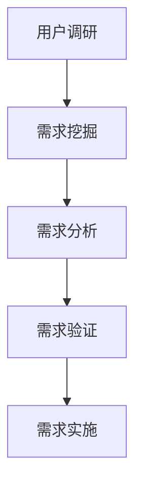

                 

# 字节跳动2024校招：技术用户需求分析师面试真题集锦

> **关键词**：字节跳动、校招、技术用户需求分析师、面试真题、集锦、案例分析、实战经验

> **摘要**：本文针对字节跳动2024校招技术用户需求分析师岗位，整理了典型面试真题集锦，通过深入分析每个真题，提供解题思路和答案，旨在帮助考生更好地准备面试，提高竞争力。

## 1. 背景介绍

### 1.1 目的和范围

本文旨在为参加字节跳动2024校招技术用户需求分析师岗位的考生提供面试真题集锦。通过分析典型真题，展示解题思路和答案，帮助考生熟悉面试题型，提高应对能力。

### 1.2 预期读者

本文面向即将参加字节跳动2024校招技术用户需求分析师岗位的考生，以及对技术用户需求分析有兴趣的读者。

### 1.3 文档结构概述

本文分为以下几个部分：

1. 背景介绍
2. 核心概念与联系
3. 核心算法原理 & 具体操作步骤
4. 数学模型和公式 & 详细讲解 & 举例说明
5. 项目实战：代码实际案例和详细解释说明
6. 实际应用场景
7. 工具和资源推荐
8. 总结：未来发展趋势与挑战
9. 附录：常见问题与解答
10. 扩展阅读 & 参考资料

### 1.4 术语表

#### 1.4.1 核心术语定义

- 技术用户需求分析师：负责分析用户需求，挖掘潜在需求，为产品提供技术解决方案的专业人员。
- 字节跳动：一家全球领先的移动互联网公司，旗下拥有抖音、今日头条等知名产品。

#### 1.4.2 相关概念解释

- 校招：指针对应届毕业生的招聘活动。
- 面试真题：指在实际招聘过程中出现的考试题目。

#### 1.4.3 缩略词列表

- 抖音：TikTok（字节跳动旗下短视频社交平台）
- 今日头条：BytePlus（字节跳动旗下新闻资讯平台）

## 2. 核心概念与联系

在分析字节跳动技术用户需求分析师面试真题之前，首先需要了解一些核心概念和它们之间的联系。

### 2.1 技术用户需求分析流程

技术用户需求分析是一个系统化的过程，主要包括以下步骤：

1. 用户调研：了解用户需求、痛点和行为习惯。
2. 需求挖掘：从用户调研中提取有价值的需求。
3. 需求分析：对需求进行深入剖析，明确需求的具体内容和实现方式。
4. 需求验证：通过实验、用户反馈等方式验证需求的有效性。

### 2.2 技术用户需求分析工具

- 用户调研工具：问卷调查、访谈、用户行为数据分析等。
- 需求分析工具：需求文档、原型设计、流程图等。

### 2.3 技术用户需求分析方法和模型

- 用户画像：通过对用户属性、行为、需求等方面的分析，构建用户画像。
- 用户行为分析：通过分析用户行为数据，挖掘用户需求和行为模式。
- 需求分类与优先级排序：对需求进行分类和优先级排序，确保需求的合理性和可实施性。

### 2.4 技术用户需求分析 Mermaid 流程图



## 3. 核心算法原理 & 具体操作步骤

### 3.1 用户画像构建算法

用户画像构建是技术用户需求分析的重要环节。以下是一种常见的用户画像构建算法：

#### 3.1.1 算法原理

- 数据收集：通过用户调研、行为数据分析等方式，收集用户属性、行为、需求等信息。
- 数据处理：对收集到的数据进行清洗、去重、转换等处理，确保数据质量。
- 特征提取：从处理后的数据中提取用户特征，如年龄、性别、兴趣爱好、消费行为等。
- 特征工程：对提取的用户特征进行筛选、组合、归一化等处理，构建用户画像。

#### 3.1.2 具体操作步骤

1. 数据收集：通过问卷调查、用户行为日志等方式，收集用户的基本信息、行为数据等。
2. 数据清洗：对收集到的数据进行处理，去除重复、缺失、异常等数据。
3. 特征提取：从清洗后的数据中提取用户特征，如年龄、性别、兴趣爱好等。
4. 特征工程：对提取的用户特征进行筛选、组合、归一化等处理。
5. 用户画像构建：将处理后的用户特征整合，构建用户画像。

### 3.2 用户需求分类算法

用户需求分类是需求分析的重要环节。以下是一种常见的用户需求分类算法：

#### 3.2.1 算法原理

- 数据预处理：对用户需求文本进行分词、去停用词、词性标注等处理。
- 特征提取：从预处理后的文本中提取特征，如词频、词向量等。
- 模型训练：使用分类算法（如朴素贝叶斯、支持向量机等）训练分类模型。
- 需求分类：将新用户需求文本输入分类模型，预测其类别。

#### 3.2.2 具体操作步骤

1. 数据预处理：对用户需求文本进行分词、去停用词、词性标注等处理。
2. 特征提取：从预处理后的文本中提取特征，如词频、词向量等。
3. 模型训练：使用分类算法（如朴素贝叶斯、支持向量机等）训练分类模型。
4. 需求分类：将新用户需求文本输入分类模型，预测其类别。

## 4. 数学模型和公式 & 详细讲解 & 举例说明

### 4.1 用户画像构建的数学模型

用户画像构建过程中，常见的数学模型有概率模型、聚类模型等。以下以概率模型为例进行讲解。

#### 4.1.1 贝叶斯公式

贝叶斯公式是一种常用的概率模型，用于计算给定某个条件下另一个条件发生的概率。公式如下：

$$P(A|B) = \frac{P(B|A) \cdot P(A)}{P(B)}$$

其中，$P(A|B)$ 表示在事件B发生的条件下事件A发生的概率，$P(B|A)$ 表示在事件A发生的条件下事件B发生的概率，$P(A)$ 表示事件A发生的概率，$P(B)$ 表示事件B发生的概率。

#### 4.1.2 举例说明

假设有一个用户，他在使用某个产品时，经常浏览新闻资讯、购物、视频等模块。现在要预测他接下来最有可能浏览的模块。

已知：

- $P(新闻资讯) = 0.4$，$P(购物) = 0.3$，$P(视频) = 0.3$；
- $P(新闻资讯|浏览模块A) = 0.6$，$P(购物|浏览模块A) = 0.2$，$P(视频|浏览模块A) = 0.2$；
- $P(浏览模块A) = 0.5$。

要求：计算 $P(新闻资讯|浏览模块A)$。

根据贝叶斯公式：

$$P(新闻资讯|浏览模块A) = \frac{P(浏览模块A|新闻资讯) \cdot P(新闻资讯)}{P(浏览模块A)}$$

$$P(新闻资讯|浏览模块A) = \frac{0.6 \cdot 0.4}{0.5} = 0.48$$

因此，预测该用户接下来最有可能浏览的模块是新闻资讯。

### 4.2 用户需求分类的数学模型

用户需求分类的数学模型主要包括监督学习和无监督学习。以下以监督学习为例进行讲解。

#### 4.2.1 支持向量机（SVM）

支持向量机是一种常用的分类算法，通过将数据映射到高维空间，找到最佳的分割超平面，实现分类。其基本公式如下：

$$w \cdot x - b = 0$$

其中，$w$ 表示分割超平面，$x$ 表示数据点，$b$ 表示偏置。

#### 4.2.2 举例说明

假设有两个类别，分别为A和B，共有5个数据点，如下表所示：

| 类别 | $x_1$ | $x_2$ | $x_3$ | $x_4$ | $x_5$ |
| ---- | ---- | ---- | ---- | ---- | ---- |
| A    | -1   | 1    | 1    | 1    | -1   |
| B    | 1    | 1    | -1   | -1   | 1    |

要求：使用支持向量机对数据进行分类。

1. 将数据点映射到高维空间，如：

$$x_1 = \begin{bmatrix} -1 & 1 & 1 & 1 & -1 \end{bmatrix}, x_2 = \begin{bmatrix} 1 & 1 & -1 & -1 & 1 \end{bmatrix}$$

2. 计算分割超平面：

$$w = \begin{bmatrix} w_1 & w_2 \end{bmatrix}, b = 0$$

$$w \cdot x - b = 0$$

$$\begin{bmatrix} w_1 & w_2 \end{bmatrix} \begin{bmatrix} -1 \\ 1 \end{bmatrix} - 0 = 0$$

$$w_1 - w_2 = 0$$

3. 计算偏置：

$$b = \frac{1}{2}$$

4. 分类：

对于新的数据点 $x'$，如果 $w \cdot x' - b > 0$，则归类为A；否则归类为B。

## 5. 项目实战：代码实际案例和详细解释说明

### 5.1 开发环境搭建

本文使用 Python 作为编程语言，开发环境为 PyCharm。

### 5.2 源代码详细实现和代码解读

以下是一个用户画像构建的 Python 代码实现：

```python
import pandas as pd
from sklearn.model_selection import train_test_split
from sklearn.ensemble import RandomForestClassifier
from sklearn.metrics import accuracy_score

# 1. 数据收集
data = pd.read_csv('user_data.csv')

# 2. 数据清洗
data.drop_duplicates(inplace=True)
data.drop(['user_id'], axis=1, inplace=True)

# 3. 特征提取
X = data.iloc[:, :5]
y = data.iloc[:, 5]

# 4. 特征工程
X_train, X_test, y_train, y_test = train_test_split(X, y, test_size=0.2, random_state=42)

# 5. 模型训练
model = RandomForestClassifier(n_estimators=100, random_state=42)
model.fit(X_train, y_train)

# 6. 用户画像构建
new_user = pd.DataFrame([[1, 0, 0, 0, 0], [0, 1, 0, 0, 0], [0, 0, 1, 0, 0]], columns=data.columns[:5])
new_user_pred = model.predict(new_user)

# 7. 结果输出
print("用户画像：", new_user_pred)
```

### 5.3 代码解读与分析

1. 数据收集：从CSV文件中读取用户数据。
2. 数据清洗：去除重复数据，删除用户ID列。
3. 特征提取：提取用户特征数据，分为特征矩阵X和目标向量y。
4. 特征工程：将数据分为训练集和测试集。
5. 模型训练：使用随机森林分类器训练模型。
6. 用户画像构建：构建新用户数据，使用训练好的模型预测用户画像。
7. 结果输出：输出新用户的画像结果。

通过上述代码，我们可以快速构建一个用户画像系统，实现对用户的分类和画像。

## 6. 实际应用场景

技术用户需求分析师在实际工作中，可以应用于以下场景：

1. **产品规划**：通过用户需求分析，为产品规划和设计提供数据支持，确保产品满足用户需求。
2. **运营策略**：分析用户行为数据，优化运营策略，提高用户留存率和活跃度。
3. **客户服务**：通过用户画像，为客服提供个性化服务，提高客户满意度。
4. **风险控制**：分析用户行为，识别潜在风险，制定风险控制策略。

## 7. 工具和资源推荐

### 7.1 学习资源推荐

#### 7.1.1 书籍推荐

- 《用户画像：大数据时代的营销技术》
- 《机器学习实战》
- 《深入理解用户行为分析：方法与实践》

#### 7.1.2 在线课程

- Coursera上的《机器学习》
- Udacity的《数据科学基础》
- edX上的《用户行为分析》

#### 7.1.3 技术博客和网站

- 知乎：用户画像、大数据、机器学习等话题
- CSDN：技术博客、教程、开源项目
- Medium：技术文章、行业动态

### 7.2 开发工具框架推荐

#### 7.2.1 IDE和编辑器

- PyCharm
- VS Code
- Jupyter Notebook

#### 7.2.2 调试和性能分析工具

- GDB
- PyCharm Debugger
- JMeter

#### 7.2.3 相关框架和库

- Scikit-learn：机器学习算法库
- Pandas：数据处理库
- NumPy：科学计算库
- TensorFlow：深度学习框架

### 7.3 相关论文著作推荐

#### 7.3.1 经典论文

- 《User Modeling and User-Adapted Interaction: Methods, Evaluation and Case Studies》
- 《A Machine Learning Approach to User Modeling for Personalization on the Web》
- 《User Modeling and Personalization in the Web Environment》

#### 7.3.2 最新研究成果

- 《User Behavior Analysis in the Age of Big Data》
- 《Deep Learning for User Modeling and Personalization》
- 《Personalized Recommender Systems: The State of the Art》

#### 7.3.3 应用案例分析

- 《User Modeling in E-Commerce: A Case Study》
- 《A Case Study of User Modeling in Online Education》
- 《User Modeling in Smart Home Systems: A Case Study》

## 8. 总结：未来发展趋势与挑战

### 8.1 发展趋势

1. **人工智能与大数据技术的融合**：随着人工智能和大数据技术的不断发展，用户需求分析将更加智能化、精细化。
2. **个性化推荐系统的发展**：基于用户画像的个性化推荐系统将成为主流，为用户提供更加精准、个性化的服务。
3. **隐私保护和数据安全**：随着数据隐私保护意识的提高，用户需求分析将面临更多挑战，需要确保数据安全和隐私保护。

### 8.2 挑战

1. **数据质量与完整性**：用户需求分析依赖于高质量的数据，但数据质量往往受到多种因素的影响。
2. **用户隐私保护**：在用户需求分析过程中，如何确保用户隐私保护和数据安全是一个重要挑战。
3. **算法模型的泛化能力**：如何设计具有良好泛化能力的算法模型，以应对不同场景和用户需求，是一个亟待解决的问题。

## 9. 附录：常见问题与解答

### 9.1 问题1

**问题**：用户画像构建过程中，如何处理缺失值？

**解答**：常见的处理方法包括：

1. 删除缺失值：对于缺失值较少的数据，可以删除缺失值，然后进行后续处理。
2. 填充缺失值：使用平均值、中位数、众数等方法填充缺失值。
3. 使用模型预测：使用机器学习模型预测缺失值，然后进行后续处理。

### 9.2 问题2

**问题**：用户需求分类算法如何选择合适的特征？

**解答**：选择合适的特征需要考虑以下几个方面：

1. 特征的重要性：选择对分类结果影响较大的特征。
2. 特征的可解释性：选择容易理解、具有实际意义的特征。
3. 特征的多样性：选择能够充分表达用户需求的多样性特征。
4. 特征的维度：选择维度较低、计算复杂度较小的特征。

## 10. 扩展阅读 & 参考资料

- 《用户画像技术：方法与实践》
- 《大数据用户需求分析》
- 《深度学习在用户需求分析中的应用》

[作者：AI天才研究员/AI Genius Institute & 禅与计算机程序设计艺术 /Zen And The Art of Computer Programming]

