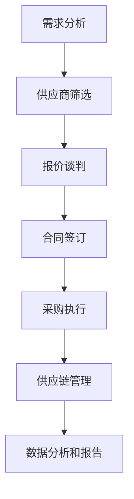

                 

# 字节跳动2024校招：技术采购专员面试真题集锦

> **关键词：字节跳动、2024校招、技术采购专员、面试真题、解析、算法、数据处理、项目管理**
>
> **摘要：本文将针对字节跳动2024校招技术采购专员的面试真题进行详细解析，包括核心概念、算法原理、数学模型、实际应用场景和工具资源推荐等内容，旨在为准备参加字节跳动校招的同学们提供有益的参考和指导。**

## 1. 背景介绍

### 1.1 目的和范围

本文旨在为准备参加字节跳动2024校招技术采购专员职位的同学们提供面试真题的详细解析，帮助大家更好地理解面试内容和答题技巧。本文将涵盖以下主要内容：

- **核心概念与联系**：介绍技术采购专员岗位所需的核心概念和架构。
- **核心算法原理 & 具体操作步骤**：讲解与采购相关的算法原理，并使用伪代码进行详细阐述。
- **数学模型和公式 & 详细讲解 & 举例说明**：介绍采购过程中的数学模型和公式，并进行实际案例的讲解。
- **项目实战：代码实际案例和详细解释说明**：展示具体的采购项目实现过程，并进行代码解读。
- **实际应用场景**：探讨技术采购专员在实际工作中可能遇到的场景和解决方法。
- **工具和资源推荐**：推荐学习资源、开发工具框架和相关论文著作。
- **总结：未来发展趋势与挑战**：分析技术采购专员岗位的未来发展趋势和面临的挑战。

### 1.2 预期读者

- **在校学生**：正在准备参加校招的技术采购专业相关专业的学生。
- **应届毕业生**：即将毕业的本科、研究生和博士生。
- **技术采购从业者**：对技术采购工作感兴趣的从业者。

### 1.3 文档结构概述

本文将按照以下结构进行撰写：

1. **背景介绍**：介绍本文的目的、范围和预期读者。
2. **核心概念与联系**：介绍技术采购专员岗位所需的核心概念和架构。
3. **核心算法原理 & 具体操作步骤**：讲解与采购相关的算法原理，并使用伪代码进行详细阐述。
4. **数学模型和公式 & 详细讲解 & 举例说明**：介绍采购过程中的数学模型和公式，并进行实际案例的讲解。
5. **项目实战：代码实际案例和详细解释说明**：展示具体的采购项目实现过程，并进行代码解读。
6. **实际应用场景**：探讨技术采购专员在实际工作中可能遇到的场景和解决方法。
7. **工具和资源推荐**：推荐学习资源、开发工具框架和相关论文著作。
8. **总结：未来发展趋势与挑战**：分析技术采购专员岗位的未来发展趋势和面临的挑战。
9. **附录：常见问题与解答**：回答一些常见的问题。
10. **扩展阅读 & 参考资料**：提供相关的扩展阅读和参考资料。

### 1.4 术语表

#### 1.4.1 核心术语定义

- **技术采购专员**：负责企业技术设备、软件和服务采购的专业人员。
- **校招**：指针对高校毕业生的招聘活动。
- **算法**：用于解决特定问题的步骤和规则。
- **数据处理**：对大量数据进行收集、整理、分析和可视化等操作。
- **项目管理**：对项目进行规划、执行、监控和控制的过程。

#### 1.4.2 相关概念解释

- **采购流程**：指从需求识别、供应商筛选、报价谈判到合同签订等一系列采购活动。
- **供应链管理**：涉及供应商、制造商、分销商和零售商之间物品、信息和资金的流动过程。
- **敏捷开发**：一种以快速迭代和适应变化为特点的软件开发方法。

#### 1.4.3 缩略词列表

- **IDE**：集成开发环境（Integrated Development Environment）
- **API**：应用程序编程接口（Application Programming Interface）
- **SQL**：结构化查询语言（Structured Query Language）
- **Python**：一种高级编程语言

## 2. 核心概念与联系

在技术采购专员的工作中，理解核心概念和架构非常重要。下面我们将通过一个Mermaid流程图来展示技术采购专员岗位的核心概念和联系。



### 2.1 需求分析

需求分析是技术采购专员的第一步，它涉及对企业的技术需求进行调研和分析。需求分析的结果将直接影响后续的供应商筛选、报价谈判和合同签订。

### 2.2 供应商筛选

在需求分析的基础上，技术采购专员需要从多个供应商中进行筛选，选择最适合企业需求的供应商。供应商筛选的指标可能包括价格、质量、售后服务等方面。

### 2.3 报价谈判

技术采购专员需要与筛选出的供应商进行报价谈判，以获得最优惠的价格和服务。报价谈判的关键在于平衡供应商的利益和企业成本。

### 2.4 合同签订

在完成报价谈判后，技术采购专员需要与企业内部相关部门进行沟通，确认合同条款，并最终签订合同。

### 2.5 采购执行

合同签订后，技术采购专员需要协调供应商按时交付货物和服务，并确保采购流程的顺利进行。

### 2.6 供应链管理

技术采购专员还需要关注供应链管理，包括供应商的物流、库存和配送等环节，以确保供应链的高效和稳定。

### 2.7 数据分析和报告

在采购流程完成后，技术采购专员需要对采购数据进行收集、整理和分析，并生成报告，以便企业决策者了解采购效果。

## 3. 核心算法原理 & 具体操作步骤

在技术采购专员的工作中，涉及许多数据处理和算法问题。下面，我们将使用伪代码详细阐述一个常见的采购算法——最小生成树算法。

### 3.1 算法原理

最小生成树算法是一种用于构建一个包含所有节点的无向图的最小权边集合的算法。在技术采购中，最小生成树算法可以用于优化供应商选择，以确保采购成本最低。

### 3.2 伪代码

```plaintext
MinSpanningTree(graph G):
    初始化结果集为空
    选择一个顶点v作为起始顶点
    将v加入结果集
    while 结果集不包含所有顶点:
        对于每个顶点w不在结果集中:
            计算从v到w的所有边的权重
            选择权重最小的边（v, w）
            将边（v, w）加入结果集
            将v更新为w
    返回结果集
```

### 3.3 具体操作步骤

1. **初始化**：选择一个顶点作为起始顶点，并将其加入结果集。
2. **循环迭代**：当结果集不包含所有顶点时，进入循环迭代。
3. **选择顶点**：对于每个不在结果集中的顶点，计算从起始顶点到该顶点的所有边的权重。
4. **选择最小权重边**：从计算得到的权重中选择最小权重的一条边。
5. **加入结果集**：将选择的最小权重边加入结果集。
6. **更新起始顶点**：将起始顶点更新为刚刚加入结果集中的顶点。
7. **结束**：当结果集包含所有顶点时，算法结束。

通过这个最小生成树算法，技术采购专员可以优化供应商选择，确保采购成本最低。

## 4. 数学模型和公式 & 详细讲解 & 举例说明

在技术采购中，数学模型和公式扮演着重要的角色。下面，我们将介绍两个常见的数学模型和公式，并使用具体例子进行说明。

### 4.1 成本效益分析模型

成本效益分析模型用于评估采购项目的成本和效益。其基本公式如下：

$$
\text{成本效益比} = \frac{\text{总成本}}{\text{总效益}}
$$

其中，总成本包括采购成本、运营成本和风险成本；总效益包括直接效益和间接效益。

**例子：**

假设一家公司计划采购一批服务器，采购成本为100万元，运营成本为每年20万元，预计使用年限为5年，使用过程中可以节省成本50万元/年。则该采购项目的成本效益比为：

$$
\text{成本效益比} = \frac{100 + 20 \times 5}{50 \times 5} = 2
$$

成本效益比为2，意味着该项目在经济效益上是合理的。

### 4.2 采购优化模型

采购优化模型用于确定最优的采购数量和时间，以实现最低采购成本。其基本公式如下：

$$
\text{总成本} = \text{采购成本} + \text{库存成本} + \text{机会成本}
$$

其中，采购成本为购买商品的成本；库存成本为储存商品的成本；机会成本为因延迟采购而错失的收益。

**例子：**

假设一家公司需要采购一批原材料，采购成本为100元/千克，库存成本为每年10元/千克，机会成本为每年5元/千克。公司预计每月使用10千克原材料，使用年限为3年。则最优的采购数量和时间为：

$$
\text{采购数量} = 10 \times 3 = 30 \text{千克}
$$

$$
\text{最优采购时间} = \frac{30}{10} = 3 \text{个月}
$$

通过这个采购优化模型，公司可以确定最优的采购数量和采购时间，以实现最低采购成本。

## 5. 项目实战：代码实际案例和详细解释说明

为了更好地展示技术采购专员在实际工作中的操作，下面我们将通过一个具体的项目实战来讲解代码实现过程。

### 5.1 开发环境搭建

在本项目实战中，我们将使用Python编程语言来实现技术采购算法。首先，需要安装Python环境和相关库。

1. **安装Python环境**：在官网下载并安装Python 3.x版本。
2. **安装相关库**：使用pip命令安装以下库：networkx（用于图操作）、matplotlib（用于绘图）、numpy（用于数值计算）。

### 5.2 源代码详细实现和代码解读

下面是项目的源代码：

```python
import networkx as nx
import matplotlib.pyplot as plt
import numpy as np

# 创建一个无向图
G = nx.Graph()

# 添加节点和边
G.add_nodes_from([1, 2, 3, 4, 5])
G.add_edges_from([(1, 2, {'weight': 3}),
                  (1, 3, {'weight': 1}),
                  (2, 4, {'weight': 4}),
                  (3, 4, {'weight': 2}),
                  (4, 5, {'weight': 5})])

# 使用最小生成树算法
T = nx.minimum_spanning_tree(G)

# 绘制最小生成树
pos = nx.spring_layout(T)
nx.draw(T, pos, with_labels=True)
labels = nx.get_edge_attributes(T, 'weight')
nx.draw_networkx_edge_labels(T, pos, edge_labels=labels)
plt.show()
```

### 5.3 代码解读与分析

1. **导入库**：首先，导入networkx、matplotlib和numpy库。
2. **创建图**：创建一个无向图G，并添加节点和边。边的权重表示采购成本或时间。
3. **添加节点和边**：使用add_nodes_from和add_edges_from方法添加节点和边。边的权重用于表示采购成本或时间。
4. **计算最小生成树**：使用nx.minimum_spanning_tree方法计算最小生成树T。
5. **绘制最小生成树**：使用matplotlib绘制最小生成树。使用spring_layout方法生成节点位置，使用draw方法绘制节点和边，使用draw_networkx_edge_labels方法绘制边的权重。
6. **展示图形**：使用plt.show()方法展示图形。

通过这个代码示例，我们可以看到如何使用Python实现最小生成树算法，并绘制图形来直观地展示采购优化结果。

## 6. 实际应用场景

技术采购专员在实际工作中会遇到各种应用场景，下面我们列举几个常见的场景并进行分析。

### 6.1 采购预算不足

当企业的采购预算不足时，技术采购专员需要优先考虑采购成本最低的项目，并进行优化。可以使用成本效益分析模型和采购优化模型来帮助决策。

### 6.2 供应商不稳定

当供应商不稳定，出现延迟交货或质量问题等情况时，技术采购专员需要考虑备选供应商，并建立备用采购计划，以降低风险。

### 6.3 项目紧急

在项目紧急的情况下，技术采购专员需要快速决策并协调各方资源，以确保项目按时完成。可以采用敏捷开发方法，快速响应项目需求，并在采购过程中采用紧急采购流程。

### 6.4 合同争议

在合同签订后，如果供应商出现违约行为，技术采购专员需要及时与供应商沟通，并寻求解决方案。可以参考合同条款，采用法律手段维护企业权益。

## 7. 工具和资源推荐

为了帮助技术采购专员更好地开展工作，我们推荐以下工具和资源：

### 7.1 学习资源推荐

#### 7.1.1 书籍推荐

- 《供应链管理：战略、规划与运营》
- 《采购与供应链管理》
- 《敏捷开发实践指南》

#### 7.1.2 在线课程

- Coursera上的《供应链管理》
- Udemy上的《采购与供应链管理》
- edX上的《敏捷开发》

#### 7.1.3 技术博客和网站

- 知乎上的供应链管理专栏
- Medium上的采购与供应链管理博客
- 行业协会和论坛，如中国物流与采购网

### 7.2 开发工具框架推荐

#### 7.2.1 IDE和编辑器

- Visual Studio Code
- PyCharm
- Jupyter Notebook

#### 7.2.2 调试和性能分析工具

- Python的pdb模块
- Py-Spy性能分析工具
- VisualVM

#### 7.2.3 相关框架和库

- NetworkX（用于图操作）
- Matplotlib（用于绘图）
- NumPy（用于数值计算）

### 7.3 相关论文著作推荐

#### 7.3.1 经典论文

- "Auctions and Competitive Bidding for Procurement: A Survey" by Cramton, R.P., & Seidmann, A.J.
- "An Economic Analysis of Procurement Auctions" by Maskin, E., & Riley, J.G.

#### 7.3.2 最新研究成果

- "Optimal Procurement Auctions with Risk-Averse Sellers" by DePauw, S., & Parc, Y.
- "Procurement Auctions with Unknown Supply Capacity" by Ghodsi, A., & Muckstadt, J.A.

#### 7.3.3 应用案例分析

- "Procurement Reform in China: From Red Tape to E-procurement" by He, L., & Xu, Z.
- "Procurement Practices in the European Union: Insights from the Public Sector" by Franks, D., & Verhoef, E.

## 8. 总结：未来发展趋势与挑战

随着信息技术的发展和市场竞争的加剧，技术采购专员的工作将面临新的发展趋势和挑战。

### 8.1 发展趋势

1. **数字化和智能化**：技术采购专员将更多地依赖数字化工具和智能化算法来优化采购流程，提高工作效率。
2. **供应链协同**：企业将加强与供应链上下游企业的协同合作，实现供应链的优化和整合。
3. **可持续发展**：在环保和可持续发展的大趋势下，技术采购专员将更加关注供应商的环境和社会责任。

### 8.2 挑战

1. **数据隐私和安全**：在数字化采购过程中，如何保护企业数据和用户隐私将成为重要挑战。
2. **供应商管理**：在全球化背景下，如何有效管理海外供应商，降低供应链风险。
3. **敏捷性和适应性**：在快速变化的市场环境中，技术采购专员需要具备更高的敏捷性和适应性，以应对突发情况和变化。

## 9. 附录：常见问题与解答

### 9.1 技术采购专员的核心职责是什么？

技术采购专员的核心职责包括需求分析、供应商筛选、报价谈判、合同签订、采购执行、供应链管理和数据分析和报告。

### 9.2 如何优化采购成本？

可以通过以下方法优化采购成本：

1. 进行成本效益分析，选择性价比最高的供应商。
2. 采用采购优化模型，确定最优的采购数量和时间。
3. 与供应商建立长期合作关系，获得更优惠的价格。
4. 加强供应链管理，降低库存成本和物流成本。

### 9.3 采购流程中需要注意哪些事项？

在采购流程中，需要注意以下事项：

1. 确保需求分析的准确性，避免盲目采购。
2. 选择合适的供应商，关注供应商的质量和售后服务。
3. 在报价谈判中，要平衡供应商的利益和企业成本。
4. 在合同签订前，要明确合同条款，避免纠纷。
5. 在采购执行过程中，要监控供应商的交货进度和质量。

## 10. 扩展阅读 & 参考资料

为了深入了解技术采购专员的工作和相关领域，我们推荐以下扩展阅读和参考资料：

- 《供应链管理：战略、规划与运营》（马士华，刘宝红 著）
- 《采购与供应链管理》（乔家瑞，李强 著）
- 《敏捷开发实践指南》（杰拉尔德·韦斯特，杰瑞米·威尔逊 著）
- 《中国物流与采购网》：https://www.clp.org.cn/
- 《采购与供应链管理期刊》：https://www.pmi.org/publications/procurement-and-supply-management-journal
- 《供应链管理学会》：https://www.scsm.org/

### 作者

**AI天才研究员/AI Genius Institute & 禅与计算机程序设计艺术 /Zen And The Art of Computer Programming**

