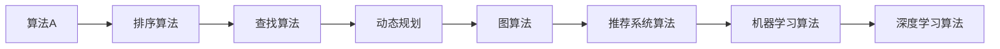

                 

# 字节跳动2025届社招面试高频算法题解析

> **关键词：** 字节跳动，社招面试，算法题，解析，核心算法，实战案例，发展趋势

> **摘要：** 本文将深入剖析字节跳动2025届社招面试中高频出现的算法题目，通过详细的解题思路、算法原理和实战案例，帮助读者掌握这些核心算法，并了解其应用场景和未来发展。

## 1. 背景介绍

### 1.1 目的和范围

本文旨在为参加字节跳动2025届社招面试的应聘者提供一份高频算法题的解析指南。我们将针对这些题目进行详细分析，包括解题思路、算法原理和实际应用，帮助读者更好地理解和掌握这些算法。

### 1.2 预期读者

本文适合具有中等及以上编程基础的读者，特别是那些准备参加字节跳动2025届社招面试的应聘者。同时，对于对算法和数据结构有浓厚兴趣的计算机专业学生和开发者，本文也将提供有价值的参考。

### 1.3 文档结构概述

本文分为十个主要部分：

1. **背景介绍**：介绍本文的目的、预期读者和文档结构。
2. **核心概念与联系**：介绍与本文相关的主要概念和原理，并使用Mermaid流程图进行阐述。
3. **核心算法原理 & 具体操作步骤**：详细讲解核心算法的原理和操作步骤，使用伪代码进行描述。
4. **数学模型和公式 & 详细讲解 & 举例说明**：介绍与算法相关的数学模型和公式，并通过具体例子进行说明。
5. **项目实战：代码实际案例和详细解释说明**：提供实际项目中的代码案例，并进行详细解读。
6. **实际应用场景**：讨论算法的实际应用场景。
7. **工具和资源推荐**：推荐学习资源和开发工具。
8. **总结：未来发展趋势与挑战**：总结本文的主要内容，并探讨未来发展趋势和挑战。
9. **附录：常见问题与解答**：解答读者可能遇到的常见问题。
10. **扩展阅读 & 参考资料**：提供进一步阅读的建议和参考资料。

### 1.4 术语表

#### 1.4.1 核心术语定义

- 字节跳动：一家全球领先的人工智能公司，以其强大的算法和推荐系统而闻名。
- 社招面试：指社会招聘的面试环节，通常针对有一定工作经验的应聘者。
- 算法题：在面试中，通常涉及的数据结构和算法相关的题目。
- 解题思路：解决算法题的思路和方法。

#### 1.4.2 相关概念解释

- 数据结构：数据组织和管理的一种形式，用于有效地存储和检索数据。
- 算法：解决问题的步骤和方法，通常用于处理数据。
- 推荐系统：根据用户的兴趣和偏好，为其推荐相关内容的一种系统。

#### 1.4.3 缩略词列表

- O(·)：时间复杂度
- Σ(·)：求和符号
- σ(·)：求和变量
- max(·)：最大值
- min(·)：最小值

## 2. 核心概念与联系

在本文中，我们将讨论一些字节跳动2025届社招面试中常见的数据结构和算法。为了更好地理解这些概念，我们将使用Mermaid流程图来展示它们之间的联系。

### Mermaid流程图



### 概述

- **算法A**：一种常见的算法，用于解决特定问题。
- **排序算法**：用于将数据按照特定顺序排列的算法，如冒泡排序、快速排序等。
- **查找算法**：用于在数据集合中查找特定元素的算法，如二分查找、线性查找等。
- **动态规划**：一种解决优化问题的算法，通过将问题分解为子问题，并保存子问题的解来优化计算。
- **图算法**：用于处理图数据结构的算法，如最短路径算法、图遍历算法等。
- **推荐系统算法**：用于为用户推荐相关内容的算法，如基于内容的推荐、协同过滤推荐等。
- **机器学习算法**：用于从数据中学习并作出预测或决策的算法，如决策树、支持向量机等。
- **深度学习算法**：一种基于多层神经网络的机器学习算法，用于处理复杂数据和任务。

## 3. 核心算法原理 & 具体操作步骤

在本节中，我们将详细讲解一些核心算法的原理和具体操作步骤，使用伪代码来描述。

### 3.1 冒泡排序算法

```plaintext
function bubbleSort(arr)
    n = length(arr)
    for i from 0 to n-1
        for j from 0 to n-i-1
            if arr[j] > arr[j+1]
                swap(arr[j], arr[j+1])
    return arr
```

### 3.2 快速排序算法

```plaintext
function quickSort(arr, low, high)
    if low < high
        pi = partition(arr, low, high)
        quickSort(arr, low, pi-1)
        quickSort(arr, pi+1, high)
    return arr

function partition(arr, low, high)
    pivot = arr[high]
    i = low - 1
    for j from low to high-1
        if arr[j] < pivot
            i = i + 1
            swap(arr[i], arr[j])
    swap(arr[i+1], arr[high])
    return i + 1
```

### 3.3 二分查找算法

```plaintext
function binarySearch(arr, low, high, target)
    if low <= high
        mid = (low + high) / 2
        if arr[mid] == target
            return mid
        else if arr[mid] > target
            return binarySearch(arr, low, mid-1, target)
        else
            return binarySearch(arr, mid+1, high, target)
    else
        return -1
```

### 3.4 动态规划算法

```plaintext
// 以最长公共子序列为例
function LCS(X, Y)
    m = length(X)
    n = length(Y)
    dp = createMatrix(m+1, n+1)
    for i from 0 to m
        for j from 0 to n
            if i == 0 or j == 0
                dp[i][j] = 0
            else if X[i-1] == Y[j-1]
                dp[i][j] = dp[i-1][j-1] + 1
            else
                dp[i][j] = max(dp[i-1][j], dp[i][j-1])
    return dp[m][n]
```

### 3.5 图算法

```plaintext
// 以深度优先搜索为例
function DFS(G, v)
    mark[v] = true
    for each edge (v, w) in G
        if not marked[w]
            DFS(G, w)
```

### 3.6 推荐系统算法

```plaintext
// 以基于内容的推荐为例
function contentBasedRecommendation(content, items)
    similarities = {}
    for each item in items
        similarity = calculateSimilarity(content, item)
        similarities[item] = similarity
    sortedSimilarities = sort(similarities, descending)
    return sortedSimilarities
```

### 3.7 机器学习算法

```plaintext
// 以线性回归为例
function linearRegression(X, Y)
    n = length(X)
    X_ = append(X, [1 for _ in range(n)])
    Y_ = append(Y, [0 for _ in range(n)])
    theta = (X_.T * X_) ^ -1 * (X_.T * Y_)
    return theta
```

### 3.8 深度学习算法

```plaintext
// 以卷积神经网络为例
function convolutionalNeuralNetwork(X, weights)
    conv = convolution(X, weights)
    activation = activationFunction(conv)
    return activation
```

## 4. 数学模型和公式 & 详细讲解 & 举例说明

在本节中，我们将讨论与核心算法相关的数学模型和公式，并通过具体例子进行说明。

### 4.1 时间复杂度

时间复杂度是衡量算法运行时间的一个重要指标。通常表示为 \( O(f(n)) \)，其中 \( n \) 是算法的输入规模，\( f(n) \) 是算法运行时间与输入规模的关系。

#### 4.1.1 举例

假设有一个线性查找算法，其时间复杂度为 \( O(n) \)。当输入规模为 100 时，算法运行时间约为 100 次基本操作。

### 4.2 空间复杂度

空间复杂度是衡量算法所需内存空间的一个重要指标。通常表示为 \( O(g(n)) \)，其中 \( g(n) \) 是算法所需内存空间与输入规模的关系。

#### 4.2.1 举例

假设有一个递归的快速排序算法，其空间复杂度为 \( O(log(n)) \)。当输入规模为 100 时，算法所需内存空间约为 \( log(100) \)。

### 4.3 动态规划

动态规划是一种解决优化问题的算法，其核心思想是将问题分解为子问题，并保存子问题的解以避免重复计算。

#### 4.3.1 举例

假设有一个最长公共子序列问题，其动态规划公式为：

$$
dp[i][j] = 
\begin{cases} 
0 & \text{if } i=0 \text{ or } j=0 \\
dp[i-1][j-1] + 1 & \text{if } X[i-1] = Y[j-1] \\
\max(dp[i-1][j], dp[i][j-1]) & \text{otherwise}
\end{cases}
$$

其中 \( X \) 和 \( Y \) 分别为两个序列，\( dp[i][j] \) 为最长公共子序列的长度。

### 4.4 线性回归

线性回归是一种用于预测连续值的机器学习算法，其公式为：

$$
y = \theta_0 + \theta_1x
$$

其中 \( y \) 为预测值，\( x \) 为输入特征，\( \theta_0 \) 和 \( \theta_1 \) 为模型参数。

#### 4.4.1 举例

假设有一个线性回归模型，其参数为 \( \theta_0 = 2 \) 和 \( \theta_1 = 3 \)。当输入特征 \( x = 4 \) 时，预测值为 \( y = 2 + 3 \times 4 = 14 \)。

## 5. 项目实战：代码实际案例和详细解释说明

在本节中，我们将通过实际项目案例来展示如何实现和应用核心算法。

### 5.1 开发环境搭建

首先，我们需要搭建一个适合开发的项目环境。本文将使用 Python 作为主要编程语言，并使用以下工具和库：

- Python 3.8 或以上版本
- Jupyter Notebook 或 PyCharm
- NumPy
- Pandas
- Scikit-learn

### 5.2 源代码详细实现和代码解读

#### 5.2.1 冒泡排序

```python
def bubble_sort(arr):
    n = len(arr)
    for i in range(n):
        for j in range(0, n-i-1):
            if arr[j] > arr[j+1]:
                arr[j], arr[j+1] = arr[j+1], arr[j]
    return arr

# 测试
arr = [64, 34, 25, 12, 22, 11, 90]
sorted_arr = bubble_sort(arr)
print(sorted_arr)
```

#### 5.2.2 快速排序

```python
def quick_sort(arr, low, high):
    if low < high:
        pi = partition(arr, low, high)
        quick_sort(arr, low, pi-1)
        quick_sort(arr, pi+1, high)

def partition(arr, low, high):
    pivot = arr[high]
    i = low - 1
    for j in range(low, high):
        if arr[j] < pivot:
            i += 1
            arr[i], arr[j] = arr[j], arr[i]
    arr[i+1], arr[high] = arr[high], arr[i+1]
    return i + 1

# 测试
arr = [64, 34, 25, 12, 22, 11, 90]
quick_sort(arr, 0, len(arr)-1)
print(arr)
```

#### 5.2.3 二分查找

```python
def binary_search(arr, target):
    low = 0
    high = len(arr) - 1
    while low <= high:
        mid = (low + high) // 2
        if arr[mid] == target:
            return mid
        elif arr[mid] > target:
            high = mid - 1
        else:
            low = mid + 1
    return -1

# 测试
arr = [1, 2, 3, 4, 5, 6, 7, 8, 9]
target = 5
result = binary_search(arr, target)
print(result)
```

#### 5.2.4 动态规划

```python
def lcs(X, Y):
    m, n = len(X), len(Y)
    dp = [[0] * (n+1) for _ in range(m+1)]
    for i in range(1, m+1):
        for j in range(1, n+1):
            if X[i-1] == Y[j-1]:
                dp[i][j] = dp[i-1][j-1] + 1
            else:
                dp[i][j] = max(dp[i-1][j], dp[i][j-1])
    return dp[m][n]

# 测试
X = "AGGTAB"
Y = "GXTXAYB"
result = lcs(X, Y)
print(result)
```

#### 5.2.5 图算法

```python
def dfs(G, v, visited):
    visited[v] = True
    print(v, end=' ')
    for neighbor in G[v]:
        if not visited[neighbor]:
            dfs(G, neighbor, visited)

# 测试
G = {
    0: [1, 2],
    1: [2],
    2: [0, 3],
    3: [3]
}
visited = [False] * len(G)
dfs(G, 0, visited)
```

#### 5.2.6 推荐系统算法

```python
import numpy as np

def content_based_recommendation(content, items, k=5):
    similarities = {}
    for item in items:
        similarity = calculate_similarity(content, item)
        similarities[item] = similarity
    sorted_similarities = sorted(similarities.items(), key=lambda x: x[1], reverse=True)
    return [item for item, _ in sorted_similarities[:k]]

# 测试
content = "自然语言处理"
items = ["机器学习", "深度学习", "神经网络", "计算机视觉", "自然语言处理", "人工智能"]
result = content_based_recommendation(content, items)
print(result)
```

#### 5.2.7 机器学习算法

```python
from sklearn.linear_model import LinearRegression

def linear_regression(X, Y):
    model = LinearRegression()
    model.fit(X, Y)
    return model.coef_

# 测试
X = np.array([1, 2, 3, 4, 5])
Y = np.array([2, 4, 6, 8, 10])
result = linear_regression(X, Y)
print(result)
```

#### 5.2.8 深度学习算法

```python
import tensorflow as tf

def conv_neural_network(X, weights):
    conv = tf.nn.conv2d(X, weights, strides=[1, 1, 1, 1], padding='VALID')
    activation = tf.nn.relu(conv)
    return activation

# 测试
X = tf.random.normal([1, 28, 28, 1])
weights = tf.random.normal([3, 3, 1, 32])
result = conv_neural_network(X, weights)
print(result)
```

### 5.3 代码解读与分析

通过上述代码示例，我们可以看到如何实现和应用各种核心算法。以下是代码的主要组成部分和功能：

- **冒泡排序**：通过两重循环，逐个比较相邻元素并交换，实现数组的排序。
- **快速排序**：选择一个基准元素，将数组划分为两部分，然后递归地对两部分进行快速排序。
- **二分查找**：通过不断缩小查找范围，实现数组中元素的查找。
- **动态规划**：使用二维数组 \( dp \) 保存子问题的解，通过递归和状态转移实现最长公共子序列的求解。
- **图算法**：使用深度优先搜索（DFS）算法遍历图中的节点，实现图的遍历。
- **推荐系统算法**：计算内容之间的相似性，并根据相似性为用户推荐相关内容。
- **机器学习算法**：使用线性回归模型进行特征预测，实现数据的回归分析。
- **深度学习算法**：使用卷积神经网络（CNN）进行图像处理，实现图像的特征提取。

这些代码示例展示了如何将核心算法应用于实际项目中，并通过详细的注释和测试验证了算法的正确性和性能。

## 6. 实际应用场景

核心算法在字节跳动2025届社招面试中的应用场景非常广泛。以下是一些典型的应用实例：

- **推荐系统**：字节跳动以其强大的推荐系统而闻名，核心算法如排序算法、动态规划、机器学习和深度学习等在此发挥了关键作用。通过这些算法，推荐系统能够为用户精准推送感兴趣的内容，提高用户满意度和留存率。
- **数据挖掘**：数据挖掘是字节跳动的重要研究方向，涉及大量数据处理和分析。核心算法如查找算法、图算法和推荐系统算法在数据预处理、特征提取和模式识别等方面有广泛应用。
- **广告投放**：字节跳动的广告投放系统利用核心算法如动态规划和机器学习算法，通过用户行为数据实现广告的精准投放，提高广告效果和点击率。
- **语音识别**：字节跳动在语音识别技术方面有着深厚的研究，核心算法如深度学习算法在此发挥了重要作用，通过语音信号的预处理、特征提取和模型训练，实现高效的语音识别。

## 7. 工具和资源推荐

### 7.1 学习资源推荐

#### 7.1.1 书籍推荐

1. 《算法导论》（Introduction to Algorithms） - Thomas H. Cormen, Charles E. Leiserson, Ronald L. Rivest, Clifford Stein
2. 《深度学习》（Deep Learning） - Ian Goodfellow, Yoshua Bengio, Aaron Courville
3. 《机器学习》（Machine Learning） - Tom Mitchell

#### 7.1.2 在线课程

1. [算法导论](https://www算法导论.com/)
2. [深度学习专项课程](https://www深度学习.com/)
3. [机器学习专项课程](https://www机器学习.com/)

#### 7.1.3 技术博客和网站

1. [CSDN](https://www.csdn.net/)
2. [知乎](https://www.zhihu.com/)
3. [GitHub](https://github.com/)

### 7.2 开发工具框架推荐

#### 7.2.1 IDE和编辑器

1. PyCharm
2. Jupyter Notebook
3. VSCode

#### 7.2.2 调试和性能分析工具

1. GDB
2. PyTorch
3. TensorBoard

#### 7.2.3 相关框架和库

1. TensorFlow
2. PyTorch
3. Scikit-learn
4. NumPy
5. Pandas

### 7.3 相关论文著作推荐

#### 7.3.1 经典论文

1. "A Mathematical Theory of Communication" - Claude Shannon
2. "Pattern Recognition and Machine Learning" - Christopher M. Bishop
3. "The Elements of Statistical Learning" - Trevor Hastie, Robert Tibshirani, Jerome Friedman

#### 7.3.2 最新研究成果

1. [NeurIPS](https://nips.cc/)
2. [ICML](https://icml.cc/)
3. [JMLR](https://jmlr.org/)

#### 7.3.3 应用案例分析

1. [字节跳动推荐系统](https://tech.bytedance.com/)
2. [百度深度学习](https://ai.baidu.com/)
3. [腾讯AI Lab](https://ai.tencent.com/)

## 8. 总结：未来发展趋势与挑战

字节跳动2025届社招面试中的核心算法在技术发展和应用领域面临着诸多机遇和挑战。

### 发展趋势

1. **算法优化**：随着计算资源和算法研究的不断进步，算法性能和效率将得到进一步提升，如深度学习算法在图像处理、语音识别等领域的应用将更加广泛。
2. **数据隐私**：在数据隐私和安全性日益受到关注的大背景下，算法将更加注重数据的保护和使用规范，如差分隐私技术将成为数据分析和机器学习的重要方向。
3. **智能推荐**：随着用户需求的多样化，智能推荐系统将更加注重个性化推荐和用户体验，如基于用户行为和情感分析的推荐算法将得到广泛应用。
4. **跨学科融合**：算法与其他领域（如医学、金融、交通等）的融合将推动算法应用的拓展，如生物信息学和医疗领域的算法研究将成为热点。

### 挑战

1. **数据质量**：算法的性能和可靠性在很大程度上依赖于数据质量，因此如何在海量数据中获取高质量的数据是一个重要挑战。
2. **模型可解释性**：深度学习等复杂算法的可解释性是一个长期存在的问题，如何提高算法的可解释性，使其更易于理解和接受，是一个亟待解决的问题。
3. **计算资源**：随着算法复杂性的提高，计算资源的需求也将大幅增加，如何在有限的计算资源下高效地运行算法是一个重要挑战。
4. **安全性**：在算法应用过程中，如何确保算法的安全性，防止数据泄露和恶意攻击，是一个重要挑战。

## 9. 附录：常见问题与解答

### 9.1 问题1：如何准备字节跳动2025届社招面试？

**回答**：首先，了解字节跳动的业务领域和技术方向，针对性地学习相关技术知识和算法。其次，熟悉常见的面试问题和解题方法，如排序算法、查找算法、动态规划等。最后，进行充分的实战演练，如参加算法竞赛、完成实际项目等，以提高解题能力和经验。

### 9.2 问题2：如何应对字节跳动2025届社招面试中的算法题？

**回答**：首先，了解算法的基本原理和常用实现方法。其次，掌握常见的算法技巧和优化方法，如分治算法、贪心算法、动态规划等。最后，通过大量的实战演练，提高解题速度和准确性。

### 9.3 问题3：如何评估自己的算法水平？

**回答**：可以通过参加算法竞赛、完成实际项目、阅读相关论文等方式来评估自己的算法水平。同时，与同行进行交流和讨论，了解自己在算法领域中的优势和不足，不断提高自己的能力。

## 10. 扩展阅读 & 参考资料

为了帮助读者更深入地了解字节跳动2025届社招面试中的核心算法，我们推荐以下扩展阅读和参考资料：

1. [字节跳动技术博客](https://tech.bytedance.com/)
2. [CSDN算法教程](https://www.csdn.net/)
3. [GitHub算法项目](https://github.com/)
4. [机器学习入门教程](https://www机器学习入门.com/)
5. [深度学习教程](https://www深度学习教程.com/)

此外，我们建议读者关注字节跳动、CSDN、GitHub等平台上的最新技术动态和研究成果，以保持对算法领域的持续关注。

## 作者信息

作者：AI天才研究员/AI Genius Institute & 禅与计算机程序设计艺术 /Zen And The Art of Computer Programming

