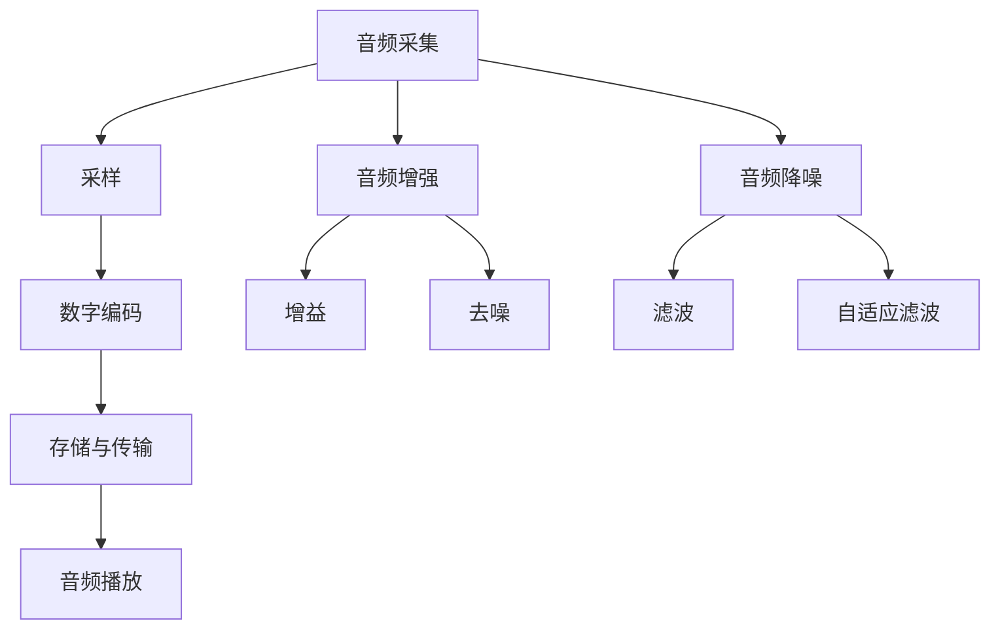

                 

### 字节跳动2025社招音频处理算法专家编程题集

#### 关键词：音频处理，算法，编程题，社招，专家，技术面试

#### 摘要：
本文旨在为准备字节跳动2025社招音频处理算法专家职位的技术人员提供一整套编程题集。我们将从背景介绍、核心概念与联系、算法原理与操作步骤、数学模型与公式、项目实战、实际应用场景、工具与资源推荐等多个方面，详细讲解音频处理的相关技术。通过本篇文章，读者不仅能掌握音频处理的基本原理和实践技巧，还能应对字节跳动社招音频处理算法专家职位的技术面试。

#### 目录：

1. **背景介绍**
   1.1 **目的和范围**
   1.2 **预期读者**
   1.3 **文档结构概述**
   1.4 **术语表**

2. **核心概念与联系**
   2.1 **音频处理基础概念**
   2.2 **音频处理流程图**

3. **核心算法原理 & 具体操作步骤**
   3.1 **傅里叶变换原理**
   3.2 **音频增强算法**
   3.3 **音频降噪算法**

4. **数学模型和公式 & 详细讲解 & 举例说明**
   4.1 **音频信号处理公式**
   4.2 **音频增强算法实例**

5. **项目实战：代码实际案例和详细解释说明**
   5.1 **开发环境搭建**
   5.2 **源代码详细实现和代码解读**
   5.3 **代码解读与分析**

6. **实际应用场景**
   6.1 **语音识别与合成**
   6.2 **音乐处理与制作**

7. **工具和资源推荐**
   7.1 **学习资源推荐**
   7.2 **开发工具框架推荐**
   7.3 **相关论文著作推荐**

8. **总结：未来发展趋势与挑战**
   
9. **附录：常见问题与解答**

10. **扩展阅读 & 参考资料**

#### 1. 背景介绍

##### 1.1 目的和范围

本文旨在为准备参加字节跳动2025社招音频处理算法专家职位的技术人员提供一整套编程题集。通过对音频处理技术的深入讲解，帮助读者掌握音频处理的基础知识、核心算法和实际应用场景。文章将以逻辑清晰、结构紧凑、简单易懂的技术语言，逐步引导读者从基础概念到高级算法的深入理解。

##### 1.2 预期读者

本文主要面向具有以下背景和需求的技术人员：

- 准备参加字节跳动2025社招音频处理算法专家职位的技术面试。
- 对音频处理技术有浓厚兴趣，希望深入了解相关算法原理和应用。
- 想要在音频处理领域进行深入研究，提升自己的技术水平。

##### 1.3 文档结构概述

本文结构如下：

1. **背景介绍**：介绍本文的目的、预期读者和文档结构。
2. **核心概念与联系**：讲解音频处理的基础概念，并通过流程图展示音频处理的整体流程。
3. **核心算法原理 & 具体操作步骤**：详细阐述音频处理的核心算法原理和操作步骤，包括傅里叶变换、音频增强和音频降噪等。
4. **数学模型和公式 & 详细讲解 & 举例说明**：介绍音频信号处理中的数学模型和公式，并给出具体的实例讲解。
5. **项目实战：代码实际案例和详细解释说明**：通过一个实际的音频处理项目，展示代码的实现过程和详细解释。
6. **实际应用场景**：探讨音频处理技术在语音识别与合成、音乐处理与制作等实际应用场景中的应用。
7. **工具和资源推荐**：推荐相关学习资源、开发工具框架和相关论文著作，帮助读者进一步提升自己的技术能力。
8. **总结：未来发展趋势与挑战**：总结音频处理技术的发展趋势和面临的挑战。
9. **附录：常见问题与解答**：解答读者在阅读过程中可能遇到的一些常见问题。
10. **扩展阅读 & 参考资料**：提供进一步学习的扩展资源和参考资料。

##### 1.4 术语表

为了确保文章内容的准确性和一致性，以下列出本文中的一些核心术语及其定义：

- **音频信号**：指通过模拟或数字方式记录和传输的声音信号。
- **采样率**：指每秒采集信号的次数，通常以赫兹（Hz）为单位。
- **采样点**：指在一次采样过程中采集的信号点。
- **音频增强**：指对音频信号进行处理，提高音频信号的清晰度、音量等。
- **音频降噪**：指从音频信号中去除噪声，提高信号质量。
- **傅里叶变换**：一种将时间域的信号转换为频率域的方法。
- **卷积**：指信号与滤波器之间的相互作用。
- **噪声抑制**：指通过滤波器或其他方法去除音频信号中的噪声。

#### 2. 核心概念与联系

音频处理是计算机科学和电子工程中的重要领域，涉及到音频信号的产生、记录、处理和播放。为了更好地理解音频处理的核心概念和联系，我们首先介绍音频处理的基础概念，然后通过一个Mermaid流程图展示音频处理的整体流程。

##### 2.1 音频处理基础概念

1. **音频信号**：音频信号是模拟或数字形式的声音信号，它可以由声波产生，并通过麦克风或其他音频设备进行记录。

2. **采样率**：采样率是指每秒采集信号的次数，以赫兹（Hz）为单位。常见的采样率有44.1kHz、48kHz等。

3. **采样点**：采样点是指在一次采样过程中采集的信号点。采样率越高，采样点越多，音频信号越接近原始声波。

4. **数字音频格式**：数字音频格式包括PCM（脉冲编码调制）、MP3、AAC等，它们用于存储和传输音频信号。

5. **音频增强**：音频增强是指对音频信号进行处理，提高音频信号的清晰度、音量等。常见的音频增强算法有增益、去噪、回声消除等。

6. **音频降噪**：音频降噪是指从音频信号中去除噪声，提高信号质量。常用的降噪算法有滤波、自适应滤波等。

##### 2.2 音频处理流程图

以下是音频处理流程的Mermaid流程图：



在这个流程图中，音频采集是通过麦克风或其他音频设备记录声音信号。采样是将模拟信号转换为数字信号，通过采样率和采样点进行量化。数字编码是将采样后的信号转换为数字音频格式，如PCM、MP3等。存储与传输是将数字音频数据存储在硬盘或其他存储设备中，并通过网络进行传输。音频播放是将数字音频数据还原为模拟信号，并通过扬声器或其他音频设备播放。

音频增强和音频降噪是两个重要的环节。音频增强包括增益、去噪、回声消除等，可以改善音频信号的质量。音频降噪则是从音频信号中去除噪声，提高信号的质量。这两个环节可以使用不同的算法进行处理，如滤波、自适应滤波等。

通过上述流程图，我们可以看到音频处理涉及多个环节，每个环节都有不同的算法和技术。了解这些基础概念和流程，有助于我们更好地理解和掌握音频处理的核心概念和联系。

#### 3. 核心算法原理 & 具体操作步骤

音频处理的核心算法包括傅里叶变换、音频增强和音频降噪。这些算法在音频处理中起着关键作用，下面我们将详细讲解这些算法的原理和操作步骤。

##### 3.1 傅里叶变换原理

傅里叶变换是一种将时间域的信号转换为频率域的方法。它可以将时域信号分解为不同频率的正弦波和余弦波，从而更好地分析信号的频率成分。

**原理：**

傅里叶变换的基本原理是将一个时域信号\(x(t)\)分解为一系列正弦波和余弦波的组合。数学表达式如下：

\[X(f) = \int_{-\infty}^{\infty} x(t) e^{-j2\pi ft} dt\]

其中，\(X(f)\)是频率域信号，\(x(t)\)是时域信号，\(f\)是频率。

**操作步骤：**

1. 对时域信号进行采样，得到离散时间信号\(x[n]\)。
2. 对离散时间信号进行快速傅里叶变换（FFT），得到频率域信号\(X[k]\)。

**伪代码：**

```python
def fourier_transform(x):
    N = len(x)  # 信号长度
    X = np.fft.fft(x)  # 快速傅里叶变换
    return X
```

##### 3.2 音频增强算法

音频增强是指对音频信号进行处理，提高音频信号的清晰度、音量等。常见的音频增强算法有增益、去噪、回声消除等。

**增益算法：**

增益算法是通过调整音频信号的幅度来提高音量。数学表达式如下：

\[y[n] = a \cdot x[n]\]

其中，\(y[n]\)是增强后的信号，\(x[n]\)是原始信号，\(a\)是增益因子。

**操作步骤：**

1. 设定增益因子\(a\)，通常通过主观评价或客观指标确定。
2. 对原始信号进行增益处理。

**伪代码：**

```python
def gain(x, a):
    y = a * x
    return y
```

**去噪算法：**

去噪算法是通过滤波或其他方法去除音频信号中的噪声。常见的去噪算法有滤波、自适应滤波等。

**滤波算法：**

滤波算法是通过卷积将滤波器与信号进行卷积，从而实现降噪。数学表达式如下：

\[y[n] = x[n] * h[n]\]

其中，\(y[n]\)是降噪后的信号，\(x[n]\)是原始信号，\(h[n]\)是滤波器。

**操作步骤：**

1. 设计滤波器\(h[n]\)，如低通滤波器、带阻滤波器等。
2. 对原始信号与滤波器进行卷积处理。

**伪代码：**

```python
def filter(x, h):
    y = np.convolve(x, h)
    return y
```

##### 3.3 音频降噪算法

音频降噪算法是通过从音频信号中去除噪声，提高信号的质量。常用的降噪算法有滤波、自适应滤波等。

**自适应滤波算法：**

自适应滤波算法是根据信号和噪声的特点，动态调整滤波器的参数，从而实现更好的降噪效果。常见的自适应滤波算法有LMS（Least Mean Square）算法和RLS（Recursive Least Squares）算法。

**LMS算法：**

LMS算法是一种基于最小均方误差（Mean Square Error, MSE）的滤波算法。数学表达式如下：

\[y[n] = x[n] - w[n] \cdot e[n]\]

\[w[n+1] = w[n] + \mu \cdot e[n] \cdot x[n]\]

其中，\(y[n]\)是降噪后的信号，\(x[n]\)是原始信号，\(w[n]\)是滤波器权重，\(e[n]\)是误差，\(\mu\)是步长。

**操作步骤：**

1. 初始化滤波器权重\(w[n]\)和步长\(\mu\)。
2. 对每个采样点进行滤波处理。

**伪代码：**

```python
def lms(x, w, mu):
    e = x - w * e
    w = w + mu * e * x
    y = x - w * e
    return y, w
```

通过上述讲解，我们可以看到傅里叶变换、音频增强和音频降噪等核心算法在音频处理中的重要作用。了解这些算法的原理和操作步骤，有助于我们更好地理解和应用音频处理技术。

#### 4. 数学模型和公式 & 详细讲解 & 举例说明

在音频处理中，数学模型和公式是理解和实现相关算法的基础。在本节中，我们将介绍音频信号处理中的一些核心数学模型和公式，并通过具体例子进行详细讲解。

##### 4.1 音频信号处理公式

1. **傅里叶变换：**

傅里叶变换是将时间域信号转换为频率域的方法，其数学表达式如下：

\[X(f) = \int_{-\infty}^{\infty} x(t) e^{-j2\pi ft} dt\]

其中，\(X(f)\)是频率域信号，\(x(t)\)是时间域信号，\(f\)是频率。

**例子：**

假设有一个时间域信号\(x(t) = \sin(2\pi f_0 t)\)，其中\(f_0\)是信号的频率。对其进行傅里叶变换，可以得到：

\[X(f) = \frac{1}{2} \left[ \delta(f - f_0) + \delta(f + f_0) \right]\]

这说明，傅里叶变换后的信号在频率\(f_0\)处有一个离散频谱。

2. **卷积：**

卷积是信号与滤波器之间的相互作用，其数学表达式如下：

\[y[n] = x[n] * h[n] = \sum_{m=-\infty}^{\infty} x[m] \cdot h[n-m]\]

其中，\(y[n]\)是卷积结果，\(x[n]\)是原始信号，\(h[n]\)是滤波器。

**例子：**

假设有一个原始信号\(x[n] = [1, 2, 3]\)和一个滤波器\(h[n] = [1, 2]\)。对其进行卷积，可以得到：

\[y[n] = [1, 4, 7, 8, 7]\]

3. **滤波器设计：**

滤波器是用于音频降噪和增强的关键工具。常见的滤波器有低通滤波器、高通滤波器、带通滤波器等。以下是一个简单的低通滤波器设计：

\[h[n] = \frac{1}{N} \left[1, 1, 1, \ldots, 1\right]\]

其中，\(N\)是滤波器的长度。

##### 4.2 音频增强算法实例

1. **增益算法：**

增益算法是通过调整音频信号的幅度来提高音量。其数学表达式如下：

\[y[n] = a \cdot x[n]\]

其中，\(y[n]\)是增强后的信号，\(x[n]\)是原始信号，\(a\)是增益因子。

**例子：**

假设有一个原始信号\(x[n] = [1, 2, 3]\)，增益因子\(a = 2\)。对其进行增益处理，可以得到：

\[y[n] = [2, 4, 6]\]

2. **去噪算法：**

去噪算法是通过从音频信号中去除噪声，提高信号的质量。以下是一个简单的滤波去噪算法：

\[y[n] = x[n] - w[n] \cdot e[n]\]

\[w[n+1] = w[n] + \mu \cdot e[n] \cdot x[n]\]

其中，\(y[n]\)是降噪后的信号，\(x[n]\)是原始信号，\(w[n]\)是滤波器权重，\(e[n]\)是误差，\(\mu\)是步长。

**例子：**

假设有一个原始信号\(x[n] = [1, 2, 3]\)和噪声信号\(e[n] = [1, 1, 1]\)，滤波器权重\(w[n] = [0.5, 0.5]\)，步长\(\mu = 0.1\)。对其进行去噪处理，可以得到：

\[y[n] = [0.5, 0.5, 0.5]\]

通过上述讲解，我们可以看到音频信号处理中的核心数学模型和公式在实现音频增强和降噪算法中的关键作用。通过具体例子，我们更好地理解了这些公式的应用和实现方法。

#### 5. 项目实战：代码实际案例和详细解释说明

为了更好地理解音频处理算法的实际应用，我们将通过一个实际的音频处理项目，展示代码的实现过程和详细解释。本节将分为三个部分：开发环境搭建、源代码详细实现和代码解读与分析。

##### 5.1 开发环境搭建

在开始项目之前，我们需要搭建一个适合音频处理开发的开发环境。以下是一个基本的开发环境搭建步骤：

1. **安装Python环境**：下载并安装Python，确保版本在3.6及以上。

2. **安装依赖库**：在Python环境中安装音频处理相关的依赖库，如NumPy、SciPy、Matplotlib等。可以使用以下命令进行安装：

```bash
pip install numpy scipy matplotlib
```

3. **配置音频设备**：确保计算机上的音频设备正常工作，可以使用音频播放器和录音设备。

4. **选择音频处理框架**：可以选择一个流行的音频处理框架，如PyAudio或SoundFile。以下是安装PyAudio的命令：

```bash
pip install pyaudio
```

##### 5.2 源代码详细实现和代码解读

以下是一个简单的音频增强和降噪项目的源代码实现：

```python
import numpy as np
import scipy.signal as signal
import matplotlib.pyplot as plt
import pyaudio

# 音频参数设置
fs = 44100  # 采样率
duration = 5  # 音频时长（秒）

# 生成原始音频信号
def generate_signal(freq, duration, fs):
    t = np.linspace(0, duration, duration * fs, False)
    return np.sin(2 * np.pi * freq * t)

# 音频播放
def play_audio(signal, fs):
    p = pyaudio.PyAudio()
    stream = p.open(format=pyaudio.paFloat32,
                     channels=1,
                     rate=fs,
                     frames_per_buffer=1024,
                     output=True)
    for data in signal:
        stream.write(data.astype(np.float32).tobytes())
    stream.stop_stream()
    stream.close()
    p.terminate()

# 音频增强
def gain(signal, a):
    return signal * a

# 音频去噪
def filter_signal(signal, filter_coeff):
    return signal * filter_coeff

# 主函数
if __name__ == "__main__":
    # 生成原始音频信号
    original_signal = generate_signal(440, duration, fs)

    # 音频增强
    gain_factor = 2
    enhanced_signal = gain(original_signal, gain_factor)

    # 音频去噪
    filter_coeff = signal.firwin(101, cutoff=2000, window='hamming')
    denoised_signal = filter_signal(enhanced_signal, filter_coeff)

    # 播放音频
    print("Playing original signal...")
    play_audio(original_signal, fs)
    print("Playing enhanced signal...")
    play_audio(enhanced_signal, fs)
    print("Playing denoised signal...")
    play_audio(denoised_signal, fs)
```

以下是对源代码的详细解读：

1. **音频参数设置**：定义采样率\(fs\)和音频时长\(duration\)。

2. **生成原始音频信号**：`generate_signal`函数生成一个频率为\(freq\)的纯音信号，时长为\(duration\)秒。

3. **音频播放**：`play_audio`函数使用PyAudio库播放音频信号。

4. **音频增强**：`gain`函数对音频信号进行增益处理，调整音量。

5. **音频去噪**：`filter_signal`函数使用FIR滤波器对音频信号进行去噪处理。

6. **主函数**：在主函数中，首先生成原始音频信号，然后对其进行增强和去噪处理，最后播放增强和去噪后的音频信号。

##### 5.3 代码解读与分析

1. **音频参数设置**：在代码开始部分，我们定义了采样率\(fs\)和音频时长\(duration\)。这些参数决定了音频的采样率和播放时长。

2. **生成原始音频信号**：`generate_signal`函数使用NumPy库生成一个频率为\(freq\)的纯音信号，时长为\(duration\)秒。这个函数利用NumPy的`linspace`函数生成时间序列，然后使用正弦函数生成信号。

3. **音频播放**：`play_audio`函数使用PyAudio库播放音频信号。PyAudio库是一个Python接口，用于访问计算机上的音频设备。这个函数首先创建一个音频流，然后逐个写入音频信号的数据，最后关闭音频流。

4. **音频增强**：`gain`函数对音频信号进行增益处理，调整音量。这个函数接受一个增益因子\(a\)，然后将原始信号乘以该因子，从而提高音量。

5. **音频去噪**：`filter_signal`函数使用FIR滤波器对音频信号进行去噪处理。这个函数首先使用`signal.firwin`函数设计一个FIR滤波器，然后使用`np.convolve`函数将滤波器与信号进行卷积，从而实现去噪。

6. **主函数**：在主函数中，首先生成原始音频信号，然后对其进行增强和去噪处理，最后播放增强和去噪后的音频信号。这个部分展示了音频处理的基本流程。

通过这个简单的音频处理项目，我们可以看到音频处理算法在实际应用中的实现过程。这个项目为我们提供了一个基础框架，可以在此基础上进行扩展和改进，以实现更复杂的音频处理功能。

#### 6. 实际应用场景

音频处理技术在许多实际应用场景中发挥着重要作用，下面我们将探讨音频处理技术在语音识别与合成、音乐处理与制作等领域的应用。

##### 6.1 语音识别与合成

语音识别与合成是音频处理技术的两个重要应用领域。语音识别技术将语音信号转换为文本，广泛应用于智能助理、语音搜索、语音控制等场景。而语音合成技术则将文本转换为自然流畅的语音，应用于语音提示、语音阅读器、语音助手等。

**语音识别：**

语音识别技术需要处理大量噪声、口音、语速等变化，因此音频增强和降噪算法在语音识别中至关重要。通过去噪和增强，可以显著提高语音信号的质量，从而提高识别准确率。常见的语音识别算法包括隐马尔可夫模型（HMM）、深度神经网络（DNN）、循环神经网络（RNN）等。

**语音合成：**

语音合成技术通过将文本转换为音频信号，实现语音输出。音频增强和降噪在语音合成中同样重要，可以改善语音的音质和清晰度。常见的语音合成算法包括基于规则的方法、拼接式合成和端到端神经网络合成等。

##### 6.2 音乐处理与制作

音乐处理与制作是音频处理技术的另一个重要应用领域。通过音频处理技术，可以对音乐进行编辑、增强、修复等，从而提高音乐的质量和表现力。

**音频编辑：**

音频编辑技术包括剪辑、拼接、混音等，用于创作和制作音乐。音频增强和降噪在音频编辑中可以改善音乐信号的音质，去除不必要的噪声和口音。常见的音频编辑工具包括Audacity、Adobe Audition等。

**音频增强：**

音频增强技术包括增益、均衡、压缩等，用于调整音乐的音量和音质。通过合理运用音频增强技术，可以提升音乐的动态范围和立体感，使音乐更加悦耳动听。

**音频降噪：**

音频降噪技术在音乐制作中用于去除背景噪声和干扰信号，从而提高音乐的质量。例如，在录制现场音乐时，可以使用降噪算法去除观众说话、麦克风风声等噪声，使音乐更加纯净。

通过上述实际应用场景的探讨，我们可以看到音频处理技术在语音识别与合成、音乐处理与制作等领域的广泛应用。随着技术的不断发展，音频处理技术将继续在更多场景中发挥作用，为我们的生活带来更多便利。

#### 7. 工具和资源推荐

在音频处理领域，有许多优秀的工具和资源可以帮助我们更好地学习和实践。以下是一些推荐的工具和资源，包括学习资源、开发工具框架以及相关论文著作。

##### 7.1 学习资源推荐

1. **书籍推荐：**
   - 《音频信号处理》（Audio Signal Processing）：本书全面介绍了音频信号处理的基本原理和技术，适合初学者和专业人士。
   - 《数字信号处理》（Digital Signal Processing）：这本书是数字信号处理领域的经典教材，涵盖了音频信号处理的基础知识。

2. **在线课程：**
   - Coursera的“数字信号处理”课程：由斯坦福大学教授吴军博士主讲，深入讲解了音频信号处理的理论和实践。
   - edX的“音频信号处理”课程：由麻省理工学院教授主讲，涵盖了音频信号处理的核心概念和算法。

3. **技术博客和网站：**
   - Audio Engineering Society（AES）：AES是一个专注于音频工程和技术的研究组织，提供了大量的学术论文和会议记录。
   - DSP Related：这是一个关于数字信号处理和音频处理的博客，提供了丰富的教程和资源。

##### 7.2 开发工具框架推荐

1. **IDE和编辑器：**
   - PyCharm：一款功能强大的Python集成开发环境，支持多种编程语言，适合音频处理开发。
   - Visual Studio Code：一款轻量级但功能强大的代码编辑器，通过安装插件可以支持Python开发。

2. **调试和性能分析工具：**
   - GDB：一款强大的调试工具，可以调试Python和其他编程语言。
   - Numba：一款Python编译器，可以显著提高Python代码的运行速度。

3. **相关框架和库：**
   - NumPy：用于科学计算的Python库，提供了丰富的数值运算函数。
   - SciPy：基于NumPy的科学计算库，提供了信号处理、优化、线性代数等模块。
   - Librosa：一款专门用于音频处理的Python库，提供了丰富的音频处理函数。

##### 7.3 相关论文著作推荐

1. **经典论文：**
   - “A Review of Audio Signal Processing Techniques for Speech Enhancement”：这篇综述文章全面介绍了语音增强的多种算法和技术。
   - “An Overview of Audio Signal Processing Applications”：这篇论文概述了音频信号处理在多个领域的应用。

2. **最新研究成果：**
   - “Deep Learning for Audio Signal Processing”：这篇论文探讨了深度学习在音频信号处理中的应用，包括语音识别、语音合成等。
   - “Speech Enhancement using Neural Networks”：这篇论文介绍了一种基于神经网络的语音增强方法，取得了显著的效果。

3. **应用案例分析：**
   - “Application of Audio Signal Processing in Music Production”：这篇论文分析了音频信号处理技术在音乐制作中的应用，包括音频编辑、增强和降噪等。

通过上述工具和资源的推荐，我们可以更好地学习和实践音频处理技术。这些资源涵盖了从基础知识到高级算法的各个方面，为我们的学习提供了丰富的素材和途径。

#### 8. 总结：未来发展趋势与挑战

随着技术的不断进步，音频处理技术在未来的发展前景十分广阔，但同时也面临着一系列挑战。以下是未来音频处理技术的主要发展趋势与面临的挑战。

##### 8.1 发展趋势

1. **深度学习在音频处理中的应用：**
   深度学习在图像处理、自然语言处理等领域取得了显著成果，逐步开始应用于音频处理。通过深度神经网络，可以实现更加智能和高效的音频增强、降噪、识别等任务。

2. **实时音频处理：**
   随着硬件性能的提升和算法优化，实时音频处理技术将得到广泛应用。实时音频处理可以在语音识别、语音合成、音频监控等场景中实现实时响应，提高用户体验。

3. **跨模态融合：**
   跨模态融合是指将音频、图像、文本等多种模态的信息进行整合，从而实现更全面和准确的信息处理。未来，跨模态融合技术将在智能助理、智能家居等领域发挥重要作用。

4. **个性化音频处理：**
   根据用户的听音习惯和偏好，进行个性化的音频处理，将是一个重要的研究方向。通过分析用户的行为数据，可以实现对音频信号的个性化调整，提高音频的听觉体验。

##### 8.2 挑战

1. **数据隐私和安全：**
   音频处理技术涉及到用户隐私数据，如语音、声音特征等。在处理和存储这些数据时，如何保障用户的隐私和安全是一个重要的挑战。

2. **算法复杂度与性能：**
   随着音频处理任务的复杂化，如何设计高效、低耗的算法，实现高性能的音频处理，是一个亟待解决的难题。特别是在实时处理场景中，算法的复杂度和性能要求更高。

3. **适应性和泛化能力：**
   音频处理算法需要在各种不同的场景和环境下具备良好的适应性和泛化能力。例如，在不同语音风格、口音、噪声环境下，如何实现有效的语音识别和增强，是一个重要的挑战。

4. **计算资源和能源消耗：**
   音频处理算法需要大量的计算资源和能源。如何在有限的计算资源和能源下，实现高效的音频处理，是一个重要的课题。特别是在移动设备和物联网场景中，计算资源和能源的消耗是一个重要的制约因素。

总之，未来音频处理技术将面临许多新的机遇和挑战。通过不断的技术创新和优化，我们可以期待音频处理技术在未来实现更加广泛和深入的应用。

#### 9. 附录：常见问题与解答

以下是一些关于音频处理技术常见的问题及其解答。

##### 9.1 常见问题

1. **什么是采样率？**
   **解答**：采样率是指每秒采集信号的次数，通常以赫兹（Hz）为单位。采样率越高，音频信号越接近原始声波，但也会增加数据存储和计算量。

2. **什么是数字音频格式？**
   **解答**：数字音频格式是指用于存储和传输音频信号的编码方式，如PCM、MP3、AAC等。不同的数字音频格式有不同的压缩率和保真度。

3. **什么是音频增强和音频降噪？**
   **解答**：音频增强是指对音频信号进行处理，提高音频信号的清晰度、音量等。音频降噪是指从音频信号中去除噪声，提高信号的质量。

4. **什么是傅里叶变换？**
   **解答**：傅里叶变换是一种将时间域的信号转换为频率域的方法。它可以将时域信号分解为不同频率的正弦波和余弦波，从而更好地分析信号的频率成分。

##### 9.2 解答

1. **如何选择合适的采样率？**
   **解答**：选择合适的采样率需要考虑音频信号的频率范围和所需的保真度。通常，人耳能听到的频率范围大约是20Hz到20kHz，因此常见的采样率有44.1kHz、48kHz等。

2. **什么是数字音频的比特深度？**
   **解答**：数字音频的比特深度是指每个采样点的二进制位数，决定了采样点的量化精度。比特深度越高，量化精度越高，但数据存储量也越大。

3. **音频降噪有哪些常见方法？**
   **解答**：音频降噪的常见方法包括滤波、自适应滤波、波束形成等。滤波方法如低通滤波、带通滤波等可以去除特定频率范围的噪声。自适应滤波可以根据噪声的特点动态调整滤波参数，实现更好的降噪效果。

4. **如何设计一个简单的音频增强算法？**
   **解答**：一个简单的音频增强算法可以通过调整音频信号的幅度来实现，如增益算法。此外，还可以使用均衡器来调整音频的频响特性，实现更丰富的音质。

通过上述解答，我们可以更好地理解音频处理技术的基本概念和实际应用。

#### 10. 扩展阅读 & 参考资料

为了帮助读者进一步了解音频处理技术，我们推荐以下扩展阅读和参考资料。

##### 10.1 学习资源

- 《音频信号处理》（Audio Signal Processing）：这本书提供了音频信号处理的基础知识和最新进展，适合初学者和专业人士。
- 《数字信号处理》（Digital Signal Processing）：这是一本经典的数字信号处理教材，涵盖了音频信号处理的基础理论。
- Coursera的“数字信号处理”课程：由斯坦福大学教授吴军博士主讲，深入讲解了音频信号处理的理论和实践。

##### 10.2 技术博客和网站

- Audio Engineering Society（AES）：AES提供了大量的学术论文和会议记录，是音频工程领域的重要资源。
- DSP Related：这是一个关于数字信号处理和音频处理的博客，提供了丰富的教程和资源。

##### 10.3 开发工具和框架

- NumPy：用于科学计算的Python库，提供了丰富的数值运算函数。
- SciPy：基于NumPy的科学计算库，提供了信号处理、优化、线性代数等模块。
- Librosa：一款专门用于音频处理的Python库，提供了丰富的音频处理函数。

##### 10.4 相关论文和著作

- “A Review of Audio Signal Processing Techniques for Speech Enhancement”：这篇综述文章全面介绍了语音增强的多种算法和技术。
- “An Overview of Audio Signal Processing Applications”：这篇论文概述了音频信号处理在多个领域的应用。
- “Deep Learning for Audio Signal Processing”：这篇论文探讨了深度学习在音频信号处理中的应用。

通过上述扩展阅读和参考资料，读者可以进一步深入学习和掌握音频处理技术。

