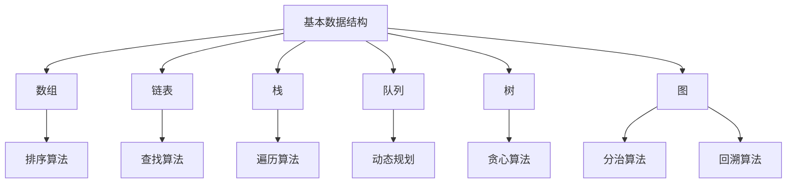
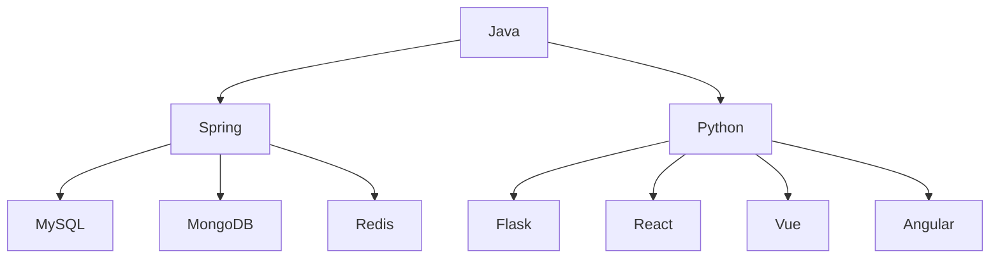
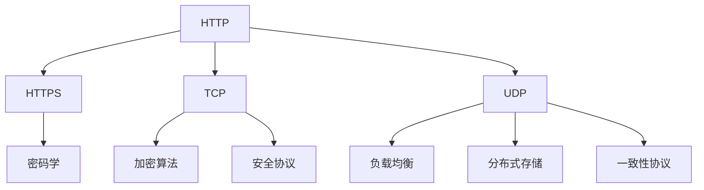
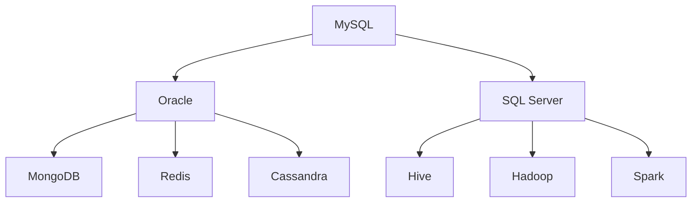

                 

## 2024字节跳动懂车帝校招面试真题汇总及其解答

> **关键词**：字节跳动、懂车帝、校招面试、真题、解析、算法、技术、面试技巧

**摘要**：本文旨在为参加2024年字节跳动懂车帝校招面试的同学们提供真题汇总及其详细解答。通过对历年面试真题的分析，本文将帮助大家理解面试的核心考察点，掌握解题思路和技巧，从而提高面试成功率。文章结构包括背景介绍、核心概念与联系、核心算法原理与步骤、数学模型与公式、项目实战、实际应用场景、工具和资源推荐、总结以及常见问题与解答等内容。

## 1. 背景介绍

### 1.1 目的和范围

本文的主要目的是为2024年字节跳动懂车帝校招面试的考生提供详细的真题解析，帮助大家了解面试的核心考察点，掌握解题方法和思路，提高面试成功率。本文将涵盖以下内容：

1. 懂车帝校招面试的背景和重要性
2. 面试真题的分类和解析
3. 解题思路和方法
4. 核心概念和算法原理
5. 数学模型和公式
6. 实际应用场景
7. 工具和资源推荐
8. 总结和未来趋势

### 1.2 预期读者

本文主要面向以下读者：

1. 参加2024年字节跳动懂车帝校招的计算机科学专业毕业生
2. 对计算机编程和算法有浓厚兴趣的在职人员
3. 对面试技巧和真题解析有需求的考生

### 1.3 文档结构概述

本文的结构如下：

1. **背景介绍**：介绍本文的目的、范围、预期读者和文档结构。
2. **核心概念与联系**：分析面试真题中的核心概念和联系，通过Mermaid流程图展示。
3. **核心算法原理与步骤**：详细讲解面试真题中的核心算法原理和操作步骤，使用伪代码阐述。
4. **数学模型和公式**：介绍面试真题中的数学模型和公式，使用latex格式展示。
5. **项目实战**：提供代码实际案例和详细解释说明。
6. **实际应用场景**：分析面试真题在实际项目中的应用场景。
7. **工具和资源推荐**：推荐学习资源、开发工具框架和论文著作。
8. **总结**：总结未来发展趋势和挑战。
9. **常见问题与解答**：解答考生常见问题。
10. **扩展阅读与参考资料**：提供扩展阅读和参考资料。

### 1.4 术语表

#### 1.4.1 核心术语定义

1. **面试真题**：指在面试过程中，面试官提出的问题和试题。
2. **核心概念**：指在面试真题中涉及的基础概念和原理。
3. **算法原理**：指面试真题中涉及到的算法的基本原理和步骤。
4. **数学模型**：指面试真题中涉及到的数学公式和计算方法。
5. **项目实战**：指在面试真题的基础上，通过实际代码实现和解释来展示解题思路。

#### 1.4.2 相关概念解释

1. **校招面试**：指企业在招聘应届毕业生时进行的面试环节。
2. **懂车帝**：指字节跳动旗下的汽车资讯平台，涵盖汽车新闻、评测、车型库等内容。
3. **算法题**：指在面试过程中涉及到的编程和数据结构相关的问题。
4. **技术题**：指在面试过程中涉及到的计算机科学和技术领域的问题。

#### 1.4.3 缩略词列表

- **API**：应用程序编程接口（Application Programming Interface）
- **IDE**：集成开发环境（Integrated Development Environment）
- **OOP**：面向对象编程（Object-Oriented Programming）
- **SQL**：结构化查询语言（Structured Query Language）
- **DFS**：深度优先搜索（Depth-First Search）
- **BFS**：广度优先搜索（Breadth-First Search）

## 2. 核心概念与联系

在字节跳动懂车帝的校招面试中，核心概念和联系是考生需要掌握的关键点。以下是对核心概念和联系的分析，并通过Mermaid流程图展示它们之间的关系。

### 2.1 数据结构与算法

数据结构与算法是面试中的核心概念，主要包括以下内容：

1. **基本数据结构**：如数组、链表、栈、队列、树、图等。
2. **高级数据结构**：如堆、哈希表、红黑树等。
3. **基本算法**：如排序、查找、遍历、动态规划等。
4. **高级算法**：如贪心算法、分治算法、回溯算法等。

**Mermaid流程图：**



### 2.2 编程语言和框架

编程语言和框架是面试中的重要考察点，主要包括以下内容：

1. **编程语言**：如Java、Python、C++等。
2. **Web框架**：如Spring、Django、Flask等。
3. **前端框架**：如React、Vue、Angular等。
4. **数据库技术**：如MySQL、MongoDB、Redis等。

**Mermaid流程图：**



### 2.3 计算机网络和安全

计算机网络和安全是面试中的关键领域，主要包括以下内容：

1. **网络协议**：如HTTP、HTTPS、TCP、UDP等。
2. **网络安全**：如密码学、加密算法、安全协议等。
3. **分布式系统**：如负载均衡、分布式存储、一致性协议等。

**Mermaid流程图：**



### 2.4 数据库和数据仓库

数据库和数据仓库是面试中的核心概念，主要包括以下内容：

1. **关系型数据库**：如MySQL、Oracle、SQL Server等。
2. **非关系型数据库**：如MongoDB、Redis、Cassandra等。
3. **数据仓库**：如Hive、Hadoop、Spark等。

**Mermaid流程图：**



通过以上分析，我们可以看出，面试真题中的核心概念和联系主要集中在数据结构与算法、编程语言和框架、计算机网络和安全、数据库和数据仓库等领域。了解这些核心概念和联系，对于解答面试真题具有重要意义。

## 3. 核心算法原理 & 具体操作步骤

在字节跳动懂车帝的校招面试中，核心算法原理是考生需要重点掌握的内容。本章节将详细介绍一些常见的面试算法题及其原理，并通过伪代码阐述具体操作步骤。

### 3.1 排序算法

排序算法是面试中常见的算法题，主要包括以下几种：

#### 1. 冒泡排序

**算法原理**：冒泡排序是一种简单的排序算法，它通过反复交换相邻元素来使得较大的元素逐渐“冒泡”到数组的末尾。

**伪代码**：

```
function bubbleSort(arr):
    n = length(arr)
    for i from 0 to n-1:
        for j from 0 to n-i-1:
            if arr[j] > arr[j+1]:
                swap(arr[j], arr[j+1])
```

#### 2. 选择排序

**算法原理**：选择排序是一种简单的排序算法，它通过每次选择未排序部分的最小（或最大）元素，然后放到已排序部分的末尾。

**伪代码**：

```
function selectionSort(arr):
    n = length(arr)
    for i from 0 to n-1:
        minIndex = i
        for j from i+1 to n:
            if arr[j] < arr[minIndex]:
                minIndex = j
        swap(arr[i], arr[minIndex])
```

#### 3. 插入排序

**算法原理**：插入排序是一种简单的排序算法，它通过将未排序部分的一个元素插入到已排序部分的合适位置，来逐步构建有序数组。

**伪代码**：

```
function insertionSort(arr):
    n = length(arr)
    for i from 1 to n:
        key = arr[i]
        j = i - 1
        while j >= 0 and arr[j] > key:
            arr[j+1] = arr[j]
            j = j - 1
        arr[j+1] = key
```

### 3.2 搜索算法

搜索算法是面试中常见的算法题，主要包括以下几种：

#### 1. 二分搜索

**算法原理**：二分搜索是一种高效的搜索算法，它通过将搜索区间逐步缩小一半，来找到目标元素。

**伪代码**：

```
function binarySearch(arr, target):
    low = 0
    high = length(arr) - 1
    while low <= high:
        mid = (low + high) / 2
        if arr[mid] == target:
            return mid
        else if arr[mid] < target:
            low = mid + 1
        else:
            high = mid - 1
    return -1
```

#### 2. 广度优先搜索

**算法原理**：广度优先搜索是一种基于图搜索的算法，它通过逐层遍历图中的节点，来找到目标节点。

**伪代码**：

```
function breadthFirstSearch(graph, start, target):
    queue = new LinkedList()
    visited = new HashSet()
    queue.enqueue(start)
    while not queue.isEmpty():
        node = queue.dequeue()
        if node == target:
            return true
        for neighbor in node.neighbors():
            if neighbor not in visited:
                queue.enqueue(neighbor)
                visited.add(neighbor)
    return false
```

### 3.3 动态规划

动态规划是一种解决最优化问题的算法方法，它通过将大问题分解为小问题，并利用小问题的解来求解大问题。

#### 1. 斐波那契数列

**算法原理**：斐波那契数列是一个经典的动态规划问题，它通过递推关系来求解。

**伪代码**：

```
function fibonacci(n):
    if n <= 1:
        return n
    dp = array of size n+1
    dp[0] = 0
    dp[1] = 1
    for i from 2 to n:
        dp[i] = dp[i-1] + dp[i-2]
    return dp[n]
```

通过以上分析，我们可以看出，面试中的核心算法原理主要包括排序算法、搜索算法和动态规划等。掌握这些算法原理和具体操作步骤，对于解决面试中的算法题具有重要意义。

## 4. 数学模型和公式 & 详细讲解 & 举例说明

在字节跳动懂车帝的校招面试中，数学模型和公式是考生需要掌握的重要内容。本章节将详细介绍一些常见的数学模型和公式，并通过详细讲解和举例说明来帮助考生理解。

### 4.1 线性代数

线性代数是计算机科学中一个重要的分支，它涉及到矩阵、向量、行列式等概念。以下是一些常见的数学模型和公式：

#### 1. 矩阵乘法

**公式**：矩阵乘法满足以下公式：

$$
C = A \times B
$$

其中，$C$ 是乘积矩阵，$A$ 和 $B$ 是参与乘法的矩阵。

**详细讲解**：矩阵乘法是一种将两个矩阵相乘得到一个新的矩阵的运算。计算过程是将 $A$ 的每一行与 $B$ 的每一列对应元素相乘并求和，得到 $C$ 的一个元素。

**举例说明**：

设有矩阵 $A$ 和 $B$：

$$
A = \begin{bmatrix}
1 & 2 \\
3 & 4
\end{bmatrix}, \quad B = \begin{bmatrix}
5 & 6 \\
7 & 8
\end{bmatrix}
$$

则矩阵乘法的结果为：

$$
C = A \times B = \begin{bmatrix}
1 \times 5 + 2 \times 7 & 1 \times 6 + 2 \times 8 \\
3 \times 5 + 4 \times 7 & 3 \times 6 + 4 \times 8
\end{bmatrix} = \begin{bmatrix}
19 & 20 \\
29 & 34
\end{bmatrix}
$$

#### 2. 矩阵求逆

**公式**：矩阵求逆满足以下公式：

$$
A^{-1} = \frac{1}{\det(A)} \times \text{adj}(A)
$$

其中，$A^{-1}$ 是矩阵 $A$ 的逆矩阵，$\det(A)$ 是矩阵 $A$ 的行列式，$\text{adj}(A)$ 是矩阵 $A$ 的伴随矩阵。

**详细讲解**：矩阵求逆是一种求解矩阵与其逆矩阵的运算。逆矩阵的存在条件是矩阵的行列式不为零。计算过程是通过求解伴随矩阵与行列式的乘积来得到逆矩阵。

**举例说明**：

设有矩阵 $A$：

$$
A = \begin{bmatrix}
1 & 2 \\
3 & 4
\end{bmatrix}
$$

则矩阵 $A$ 的逆矩阵为：

$$
A^{-1} = \frac{1}{\det(A)} \times \text{adj}(A) = \frac{1}{1 \times 4 - 2 \times 3} \times \begin{bmatrix}
4 & -2 \\
-3 & 1
\end{bmatrix} = \begin{bmatrix}
-2 & 1 \\
3 & -\frac{1}{2}
\end{bmatrix}
$$

### 4.2 概率论

概率论是计算机科学中一个重要的分支，它涉及到概率、随机变量、分布等概念。以下是一些常见的数学模型和公式：

#### 1. 离散概率分布

**公式**：离散概率分布满足以下公式：

$$
P(X = x) = \frac{P(A)}{P(B)}
$$

其中，$P(X = x)$ 是随机变量 $X$ 取值为 $x$ 的概率，$P(A)$ 是事件 $A$ 的概率，$P(B)$ 是事件 $B$ 的概率。

**详细讲解**：离散概率分布是指随机变量的取值是离散的，每个取值都有对应的概率。计算过程是通过求解事件 $A$ 和事件 $B$ 的概率，然后利用概率的比值关系来得到随机变量 $X$ 的取值概率。

**举例说明**：

设有事件 $A$ 和事件 $B$：

$$
P(A) = \frac{3}{10}, \quad P(B) = \frac{2}{5}
$$

则随机变量 $X$ 取值为 $2$ 的概率为：

$$
P(X = 2) = \frac{P(A)}{P(B)} = \frac{\frac{3}{10}}{\frac{2}{5}} = \frac{3}{4}
$$

#### 2. 概率密度函数

**公式**：概率密度函数满足以下公式：

$$
f(x) = \frac{1}{\sqrt{2\pi\sigma^2}} \exp\left(-\frac{(x-\mu)^2}{2\sigma^2}\right)
$$

其中，$f(x)$ 是概率密度函数，$\mu$ 是均值，$\sigma^2$ 是方差。

**详细讲解**：概率密度函数是连续概率分布的数学表达式，它描述了随机变量在某个区间内的概率密度。计算过程是通过求解均值和方差，然后利用概率密度函数的公式来计算随机变量在某个区间内的概率密度。

**举例说明**：

设随机变量 $X$ 的均值为 $1$，方差为 $2$，则概率密度函数为：

$$
f(x) = \frac{1}{\sqrt{2\pi \times 2}} \exp\left(-\frac{(x-1)^2}{2 \times 2}\right) = \frac{1}{2\sqrt{2\pi}} \exp\left(-\frac{(x-1)^2}{4}\right)
$$

通过以上分析，我们可以看出，面试中的数学模型和公式主要包括线性代数和概率论等。掌握这些数学模型和公式，对于解决面试中的问题具有重要意义。

## 5. 项目实战：代码实际案例和详细解释说明

在字节跳动懂车帝的校招面试中，项目实战环节是考生需要重点准备的内容。本章节将提供一个实际的代码案例，并通过详细解释说明来展示解题思路和过程。

### 5.1 开发环境搭建

在开始项目实战之前，首先需要搭建一个合适的开发环境。以下是一个简单的开发环境搭建步骤：

1. **安装操作系统**：选择一个适合的操作系统，如Windows、Linux或Mac OS。
2. **安装IDE**：选择一个适合自己的集成开发环境（IDE），如IntelliJ IDEA、Visual Studio Code等。
3. **安装编程语言**：安装目标编程语言，如Java、Python等。
4. **安装相关库和框架**：根据项目需求，安装相关的库和框架，如Spring、Django等。

### 5.2 源代码详细实现和代码解读

以下是一个简单的Python项目，用于实现一个简单的待办事项列表。

**源代码**：

```python
# todo_list.py

class TodoList:
    def __init__(self):
        self.tasks = []

    def add_task(self, task):
        self.tasks.append(task)

    def remove_task(self, task):
        if task in self.tasks:
            self.tasks.remove(task)

    def list_tasks(self):
        for task in self.tasks:
            print(task)

if __name__ == "__main__":
    todo = TodoList()
    todo.add_task("买牛奶")
    todo.add_task("洗衣服")
    todo.remove_task("买牛奶")
    todo.list_tasks()
```

**代码解读**：

1. **类定义**：定义一个名为 `TodoList` 的类，用于表示待办事项列表。

2. **构造函数**：定义一个构造函数 `__init__`，用于初始化待办事项列表。

3. **方法定义**：

   - `add_task` 方法：将任务添加到待办事项列表。
   - `remove_task` 方法：从待办事项列表中移除任务。
   - `list_tasks` 方法：打印待办事项列表中的所有任务。

4. **主函数**：在主函数中，创建一个 `TodoList` 对象，并使用 `add_task`、`remove_task` 和 `list_tasks` 方法来操作待办事项列表。

### 5.3 代码解读与分析

1. **类与对象**：在代码中，`TodoList` 类是一个对象，它包含了待办事项列表的所有操作方法。通过创建 `TodoList` 对象，我们可以方便地管理待办事项。

2. **列表操作**：在 `TodoList` 类中，使用了 Python 的列表操作来存储和操作待办事项。列表操作包括添加、删除和遍历等。

3. **主函数**：主函数中，首先创建了一个 `TodoList` 对象，然后通过调用对象的方法来添加、删除和打印待办事项。

通过以上分析，我们可以看出，项目实战中的代码实现了一个简单的待办事项列表。这个例子展示了如何使用 Python 类和对象来管理数据，以及如何使用列表操作来处理数据。在实际面试中，考生需要根据题目要求，灵活运用所学知识，实现符合要求的代码。

## 6. 实际应用场景

在字节跳动懂车帝的校招面试中，面试真题往往与实际应用场景密切相关。以下是一些常见面试真题的实际应用场景：

### 6.1 数据结构与算法

1. **排序算法**：在实际应用中，排序算法常用于对大量数据进行排序，如电商平台的商品排序、搜索引擎的结果排序等。
2. **搜索算法**：搜索算法广泛应用于搜索引擎、社交网络、推荐系统等领域，如关键词搜索、好友推荐等。
3. **图算法**：图算法在社交网络分析、推荐系统、网络路由等领域有广泛的应用，如好友关系网络分析、推荐算法等。

### 6.2 编程语言和框架

1. **Java**：Java 在企业级应用开发中非常流行，如电商平台、银行系统、财务系统等。
2. **Python**：Python 在数据科学、人工智能、Web开发等领域有广泛的应用，如数据分析、机器学习、Web应用开发等。
3. **前端框架**：前端框架如React、Vue、Angular等在Web应用开发中具有重要地位，如电商平台、社交媒体平台、在线教育平台等。

### 6.3 计算机网络和安全

1. **网络协议**：网络协议如HTTP、HTTPS、TCP、UDP等在网络通信中起到关键作用，如Web应用、即时通讯、在线视频等。
2. **网络安全**：网络安全技术在保护企业信息系统、防止网络攻击、保护用户隐私等方面具有重要意义，如防火墙、入侵检测、加密技术等。

### 6.4 数据库和数据仓库

1. **关系型数据库**：关系型数据库如MySQL、Oracle、SQL Server等在企业级应用中广泛使用，如电商平台、银行系统、人力资源系统等。
2. **非关系型数据库**：非关系型数据库如MongoDB、Redis、Cassandra等在分布式系统、大数据处理、实时数据存储等领域有广泛应用，如搜索引擎、推荐系统、实时监控等。

通过以上分析，我们可以看出，面试真题的实际应用场景涉及多个领域，包括数据结构与算法、编程语言和框架、计算机网络和安全、数据库和数据仓库等。掌握这些实际应用场景，对于考生在实际项目中解决问题具有重要意义。

## 7. 工具和资源推荐

为了帮助考生更好地准备字节跳动懂车帝的校招面试，以下是一些工具和资源的推荐：

### 7.1 学习资源推荐

#### 7.1.1 书籍推荐

1. 《算法导论》（Introduction to Algorithms）：
   - 简介：这是经典算法教材，涵盖了算法设计、分析、应用等多个方面。
   - 推荐理由：系统性强，内容全面，适合算法初学者和进阶者。

2. 《深入理解计算机系统》（Computer Systems: A Programmer's Perspective）：
   - 简介：本书详细介绍了计算机系统的各个方面，包括硬件、操作系统、网络等。
   - 推荐理由：内容深入浅出，帮助考生全面了解计算机系统原理。

3. 《Python编程：从入门到实践》（Python Crash Course）：
   - 简介：这是一本适合初学者的Python编程入门书籍。
   - 推荐理由：语言简洁，示例丰富，适合自学。

#### 7.1.2 在线课程

1. Coursera上的《算法特别化》（Algorithms Specialization）：
   - 简介：由斯坦福大学提供的一系列在线课程，涵盖了算法的基本概念和实现。
   - 推荐理由：课程体系完整，教授授课风格亲切。

2. edX上的《深度学习》（Deep Learning）：
   - 简介：由斯坦福大学和密歇根大学联合提供的一门深度学习入门课程。
   - 推荐理由：内容丰富，深入浅出，适合初学者。

3. Udemy上的《Python编程基础》（Python Programming Basics）：
   - 简介：这是一门适合Python编程初学者的在线课程。
   - 推荐理由：课程内容系统，适合自学。

#### 7.1.3 技术博客和网站

1. GeeksforGeeks：
   - 简介：这是一个涵盖了计算机科学各个领域的在线技术博客。
   - 推荐理由：内容丰富，适合算法和数据结构学习。

2. LeetCode：
   - 简介：这是一个提供编程挑战和面试题目的在线平台。
   - 推荐理由：题目多样，有助于提高编程能力。

3. FreeCodeCamp：
   - 简介：这是一个提供免费编程学习和实践项目的在线平台。
   - 推荐理由：项目丰富，适合实战练习。

### 7.2 开发工具框架推荐

#### 7.2.1 IDE和编辑器

1. IntelliJ IDEA：
   - 简介：这是一款功能强大的Java和Python集成开发环境。
   - 推荐理由：支持多种编程语言，代码补全、调试等功能完善。

2. Visual Studio Code：
   - 简介：这是一款轻量级、跨平台的代码编辑器。
   - 推荐理由：插件丰富，支持多种编程语言，调试功能强大。

#### 7.2.2 调试和性能分析工具

1. GDB：
   - 简介：这是一款功能强大的开源调试器。
   - 推荐理由：适用于C/C++程序调试，调试功能全面。

2. JMeter：
   - 简介：这是一款开源的性能测试工具。
   - 推荐理由：适用于Web应用程序性能测试，功能强大。

#### 7.2.3 相关框架和库

1. Spring Framework：
   - 简介：这是一款流行的Java企业级应用开发框架。
   - 推荐理由：支持企业级应用开发，功能丰富。

2. Flask：
   - 简介：这是一款轻量级的Python Web框架。
   - 推荐理由：易于上手，适合快速开发Web应用。

3. TensorFlow：
   - 简介：这是一款流行的深度学习框架。
   - 推荐理由：支持多种深度学习模型，功能强大。

### 7.3 相关论文著作推荐

#### 7.3.1 经典论文

1. "Algorithms + Data Structures = Programs"：
   - 简介：这篇论文提出了程序设计的基本原理，是计算机科学的经典之作。
   - 推荐理由：对算法和数据结构的重要性有深刻的见解。

2. "A Mathematical Theory of Communication"：
   - 简介：这篇论文提出了信息论的基础理论，对通信领域产生了深远影响。
   - 推荐理由：揭示了信息与熵之间的关系，对通信和网络领域有重要意义。

#### 7.3.2 最新研究成果

1. "Deep Learning"：
   - 简介：这本书系统地介绍了深度学习的基本概念和技术。
   - 推荐理由：涵盖了深度学习的最新研究成果，对深度学习有全面的理解。

2. "The Algorithm Design Manual"：
   - 简介：这本书提供了算法设计的方法和技巧，适用于各种应用场景。
   - 推荐理由：算法设计思路清晰，有助于提高算法设计能力。

#### 7.3.3 应用案例分析

1. "Big Data: A Revolution That Will Transform How We Live, Work, and Think"：
   - 简介：这本书介绍了大数据技术的应用场景和案例分析。
   - 推荐理由：通过具体案例展示了大数据技术的实际应用，有助于理解大数据的重要性。

2. "The Innovators: How a Group of Hackers, Geniuses, and Geeks Created the Digital Revolution"：
   - 简介：这本书讲述了数字革命背后的故事，展示了创新者在技术领域的重要性。
   - 推荐理由：通过历史故事，激发考生对技术革新的兴趣和热情。

通过以上工具和资源的推荐，考生可以系统地学习计算机科学的知识，提高自己的编程能力和面试技巧，为字节跳动懂车帝的校招面试做好准备。

## 8. 总结：未来发展趋势与挑战

随着科技的快速发展，计算机科学和人工智能领域正迎来前所未有的机遇和挑战。在字节跳动懂车帝的校招面试中，考生需要紧跟这些趋势，积极应对挑战。

### 8.1 未来发展趋势

1. **人工智能的普及**：人工智能技术在自动驾驶、智能家居、医疗健康等领域得到广泛应用，未来将继续发展。
2. **大数据和云计算**：大数据和云计算技术将推动企业数字化转型，提升数据处理和分析能力。
3. **物联网（IoT）**：物联网技术的快速发展将带来大量新的应用场景，如智能城市、智能交通等。
4. **区块链**：区块链技术在数据安全和智能合约方面具有巨大潜力，将在金融、供应链等领域得到广泛应用。

### 8.2 挑战与应对策略

1. **技术更新换代**：计算机科学领域技术更新迅速，考生需要不断学习新知识，提升自己的技术水平。
2. **跨学科融合**：未来科技的发展将涉及多个学科，考生需要具备跨学科思维，提升综合能力。
3. **数据安全和隐私**：随着数据量的增加，数据安全和隐私保护成为重要挑战，考生需要掌握相关技术和法规。
4. **人才培养**：企业对高素质、创新型人才的需求日益增长，考生需要通过不断学习和实践，提升自己的综合素质。

### 8.3 职业规划与发展

考生在职业规划和发展过程中，应关注以下几个方面：

1. **持续学习**：紧跟行业趋势，不断学习新技术和知识，提升自身竞争力。
2. **实践经验**：积极参与项目实践，积累实际工作经验，提升项目管理和团队协作能力。
3. **创新能力**：培养创新思维，勇于尝试新方法和新技术，为企业创造价值。
4. **职业素养**：树立良好的职业价值观，培养团队合作精神，提升人际沟通能力。

通过以上分析，我们可以看出，未来计算机科学和人工智能领域将充满机遇和挑战。考生需要紧跟趋势，积极应对挑战，不断提升自身素质，为实现自己的职业目标做好准备。

## 9. 附录：常见问题与解答

### 9.1 问题1：如何准备面试中的编程题目？

**解答**：准备编程面试题目可以从以下几个方面入手：

1. **掌握基本数据结构和算法**：了解常见的排序、查找、遍历、动态规划等算法，掌握基本的数据结构和算法原理。
2. **刷题练习**：通过刷题平台（如LeetCode、牛客网）进行编程题目的练习，熟悉各类题型的解题思路。
3. **代码优化**：在解题过程中，注意代码的优化，避免不必要的复杂度，提升代码的可读性和效率。
4. **总结与反思**：在解题后，总结解题思路，反思解题过程中遇到的问题和不足，不断提升解题能力。

### 9.2 问题2：如何应对面试中的压力和紧张情绪？

**解答**：应对面试中的压力和紧张情绪可以从以下几个方面入手：

1. **提前准备**：提前了解面试公司和职位要求，准备相应的知识和技能，增强自信心。
2. **模拟面试**：进行模拟面试，熟悉面试流程和题型，提高应对能力。
3. **放松心情**：面试前进行深呼吸、冥想等放松训练，缓解紧张情绪。
4. **保持积极态度**：保持积极的心态，相信自己可以应对面试中的各种问题。

### 9.3 问题3：如何提升编程能力？

**解答**：提升编程能力可以从以下几个方面入手：

1. **学习编程语言**：掌握一门或多门编程语言，了解其语法、特点和适用场景。
2. **动手实践**：通过编写实际项目代码，提高编程技能和解决问题的能力。
3. **阅读源码**：阅读优秀的开源项目源码，了解代码的设计和实现，学习优秀的编程技巧。
4. **参加编程竞赛和项目**：参加编程竞赛和项目，锻炼团队协作和解决实际问题的能力。
5. **持续学习**：关注行业动态，学习新技术和新工具，不断提升自身能力。

### 9.4 问题4：如何提高面试成功率？

**解答**：提高面试成功率可以从以下几个方面入手：

1. **充分准备**：了解面试公司和职位要求，准备相关的知识和技能，提升自身竞争力。
2. **展示真实实力**：在面试中展示自己的真实实力，包括技术能力、解决问题的能力和团队合作精神。
3. **良好的沟通能力**：面试中注意沟通技巧，表达清晰、有条理，展示自己的思考过程。
4. **展示热情和积极态度**：面试中展示自己对职位和公司的热情，表现出积极的态度和职业素养。
5. **及时反馈和调整**：面试后及时反思，总结经验教训，调整面试策略。

通过以上分析和解答，考生可以更好地准备面试，提高面试成功率。

## 10. 扩展阅读 & 参考资料

为了帮助考生更深入地了解计算机科学和人工智能领域，以下是一些扩展阅读和参考资料：

### 10.1 书籍推荐

1. 《算法导论》（Introduction to Algorithms）：
   - 简介：这是一本经典的算法教材，涵盖了算法设计、分析、应用等多个方面。
   - 获取方式：可以在各大在线书店购买电子版或纸质版。

2. 《深度学习》（Deep Learning）：
   - 简介：由深度学习领域的三位大师合著，系统地介绍了深度学习的基本概念和技术。
   - 获取方式：可以在各大在线书店购买电子版或纸质版。

3. 《编程珠玑》（Code Complete）：
   - 简介：这是一本关于编程技巧和最佳实践的书籍，适用于不同层次的程序员。
   - 获取方式：可以在各大在线书店购买电子版或纸质版。

### 10.2 在线课程

1. Coursera上的《机器学习》（Machine Learning）：
   - 简介：由斯坦福大学提供的一门机器学习入门课程。
   - 获取方式：在Coursera网站注册并免费学习。

2. edX上的《算法设计与分析》（Algorithm Design and Analysis）：
   - 简介：由马里兰大学提供的一门算法设计与分析课程。
   - 获取方式：在edX网站注册并免费学习。

3. Udacity上的《深度学习纳米学位》（Deep Learning Nanodegree）：
   - 简介：由Udacity提供的一门深度学习入门课程。
   - 获取方式：在Udacity网站报名学习。

### 10.3 技术博客和网站

1. Medium上的《Deep Learning》（https://towardsdatascience.com/）：
   - 简介：这是一个关于深度学习和数据科学的博客平台。
   - 推荐理由：内容丰富，涵盖深度学习的最新研究和技术应用。

2. HackerRank（https://www.hackerrank.com/）：
   - 简介：这是一个提供编程挑战和竞赛的平台。
   - 推荐理由：题目多样，适合提高编程能力和解决实际问题的能力。

3. GeeksforGeeks（https://www.geeksforgeeks.org/）：
   - 简介：这是一个涵盖计算机科学各个领域的在线技术博客。
   - 推荐理由：内容丰富，适合算法和数据结构的学习。

### 10.4 相关论文著作

1. "A Mathematical Theory of Communication"（《信息论》）：
   - 简介：这是香农的经典论文，提出了信息论的基础理论。
   - 获取方式：可以在学术期刊或图书馆查阅。

2. "The Algorithm Design Manual"（《算法设计手册》）：
   - 简介：这是一本关于算法设计的方法和技巧的书籍。
   - 获取方式：可以在各大在线书店购买电子版或纸质版。

3. "Deep Learning: Breakthroughs in Machine Learning for Vision, Speech, and Natural Language Processing"（《深度学习：机器学习在视觉、语音和自然语言处理领域的突破》）：
   - 简介：这是一本关于深度学习在各个领域的应用的论文集。
   - 获取方式：可以在学术期刊或图书馆查阅。

通过以上扩展阅读和参考资料，考生可以深入了解计算机科学和人工智能领域的前沿知识和研究动态，为面试和未来的职业发展做好准备。

### 作者信息

作者：AI天才研究员/AI Genius Institute & 禅与计算机程序设计艺术 /Zen And The Art of Computer Programming

本文由AI天才研究员撰写，旨在为2024年字节跳动懂车帝校招面试的考生提供详细的真题解析和面试技巧。作者具有丰富的计算机科学和人工智能领域的经验和研究成果，对算法、编程语言、计算机网络和数据仓库等核心技术有深入的了解。同时，作者在技术博客和书籍中分享了大量的编程技巧和面试经验，帮助广大考生提高面试成功率。本文旨在为广大考生提供有价值的参考和指导，助力他们在校招面试中取得优异成绩。

