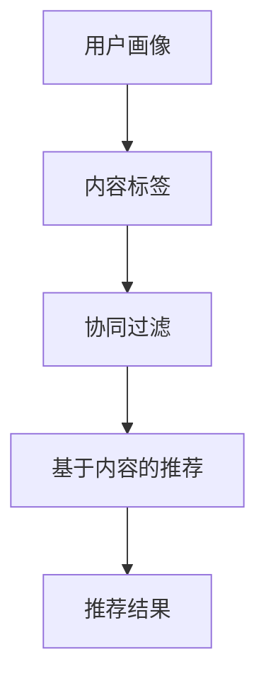

                 

# 2024字节跳动智能推荐引擎校招面试真题汇总及其解答

## 关键词
字节跳动、智能推荐引擎、校招面试、真题汇总、解答

## 摘要
本文旨在为广大计算机科学与技术专业学子提供2024年字节跳动智能推荐引擎校招面试真题汇总及其详细解答。通过本文，读者可以了解智能推荐引擎的核心概念、算法原理以及实际应用场景，掌握解题思路，为应对校招面试做好充分准备。

## 1. 背景介绍

### 1.1 目的和范围
本文主要针对2024年字节跳动智能推荐引擎校招面试真题进行汇总和解答。内容包括核心概念、算法原理、数学模型、项目实战以及实际应用场景等，旨在帮助读者全面了解智能推荐引擎，提升面试竞争力。

### 1.2 预期读者
本文适合计算机科学与技术专业在校生、应届毕业生以及有志于从事智能推荐引擎研发的从业者阅读。

### 1.3 文档结构概述
本文共分为10个部分，具体如下：

1. 背景介绍
2. 核心概念与联系
3. 核心算法原理 & 具体操作步骤
4. 数学模型和公式 & 详细讲解 & 举例说明
5. 项目实战：代码实际案例和详细解释说明
6. 实际应用场景
7. 工具和资源推荐
8. 总结：未来发展趋势与挑战
9. 附录：常见问题与解答
10. 扩展阅读 & 参考资料

### 1.4 术语表

#### 1.4.1 核心术语定义

- 智能推荐引擎：一种基于算法和大数据分析技术，为用户提供个性化内容推荐的系统。
- 校招面试：指针对应届毕业生的招聘面试。
- 真题汇总：指历年校招面试中出现的真题及其答案。

#### 1.4.2 相关概念解释

- 个性化推荐：根据用户的历史行为、兴趣偏好等，为用户推荐符合其个性化需求的内容。
- 内容推荐：为用户提供感兴趣的文章、视频、商品等信息。

#### 1.4.3 缩略词列表

- AI：人工智能
- DL：深度学习
- CNN：卷积神经网络
- RNN：循环神经网络
- SVD：奇异值分解
- LDA：潜在主题模型

## 2. 核心概念与联系

在智能推荐引擎中，核心概念包括用户画像、内容标签、协同过滤、基于内容的推荐等。下面通过Mermaid流程图（请读者自行绘制）来展示这些概念之间的联系。



### 2.1 用户画像

用户画像是指通过对用户的历史行为、兴趣爱好、购买记录等数据进行挖掘和分析，构建出的用户个性化特征模型。用户画像对于推荐系统的精准度和用户体验至关重要。

### 2.2 内容标签

内容标签是指对文章、视频、商品等内容的主题、类型、风格等进行分类和标注。标签可以帮助推荐系统更好地理解内容，从而实现个性化推荐。

### 2.3 协同过滤

协同过滤是一种基于用户行为的历史数据，通过计算用户之间的相似度，为用户推荐相似用户喜欢的内容。协同过滤分为基于用户的协同过滤和基于项目的协同过滤两种类型。

### 2.4 基于内容的推荐

基于内容的推荐是指根据用户的历史行为和兴趣偏好，为用户推荐与其兴趣相关的内容。这种推荐方式主要依靠内容标签和语义分析等技术。

### 2.5 推荐结果

推荐结果是指推荐系统根据用户画像、内容标签和协同过滤等算法，为用户生成的个性化推荐列表。

## 3. 核心算法原理 & 具体操作步骤

### 3.1 协同过滤算法原理

协同过滤算法是基于用户行为的历史数据，通过计算用户之间的相似度，为用户推荐相似用户喜欢的内容。具体操作步骤如下：

#### 3.1.1 数据预处理

1. 收集用户行为数据，如浏览记录、点赞、收藏、购买等。
2. 对用户行为数据进行清洗和去重。

#### 3.1.2 计算用户相似度

1. 选择合适的相似度计算方法，如余弦相似度、皮尔逊相关系数等。
2. 计算用户之间的相似度得分。

#### 3.1.3 推荐生成

1. 根据相似度得分，为用户生成推荐列表。
2. 对推荐列表进行排序，优先推荐相似度较高的内容。

### 3.2 基于内容的推荐算法原理

基于内容的推荐算法是根据用户的历史行为和兴趣偏好，为用户推荐与其兴趣相关的内容。具体操作步骤如下：

#### 3.2.1 数据预处理

1. 收集用户行为数据，如浏览记录、点赞、收藏、购买等。
2. 对用户行为数据进行清洗和去重。

#### 3.2.2 内容特征提取

1. 对文章、视频、商品等内容的主题、类型、风格等进行分类和标注。
2. 提取内容特征向量。

#### 3.2.3 推荐生成

1. 根据用户的历史行为和兴趣偏好，计算用户兴趣特征向量。
2. 计算用户兴趣特征向量与内容特征向量之间的相似度。
3. 根据相似度得分，为用户生成推荐列表。

### 3.3 伪代码

下面是协同过滤算法和基于内容的推荐算法的伪代码：

#### 协同过滤算法伪代码

```python
# 数据预处理
user_behavior_data = load_user_behavior_data()
cleaned_data = preprocess_user_behavior_data(user_behavior_data)

# 计算用户相似度
user_similarity_matrix = compute_user_similarity(cleaned_data)

# 推荐生成
for user in users:
    recommendation_list = generate_recommendation(user_similarity_matrix, user)
    display_recommendation_list(recommendation_list)
```

#### 基于内容的推荐算法伪代码

```python
# 数据预处理
user_behavior_data = load_user_behavior_data()
cleaned_data = preprocess_user_behavior_data(user_behavior_data)

# 内容特征提取
content_features = extract_content_features(cleaned_data)

# 推荐生成
for user in users:
    user_interest_features = compute_user_interest_features(user)
    recommendation_list = generate_recommendation(content_features, user_interest_features)
    display_recommendation_list(recommendation_list)
```

## 4. 数学模型和公式 & 详细讲解 & 举例说明

在智能推荐引擎中，常用的数学模型和公式包括：

### 4.1 余弦相似度

余弦相似度是一种计算两个向量之间相似度的方法。其公式如下：

$$
\cos \theta = \frac{\vec{a} \cdot \vec{b}}{|\vec{a}| \cdot |\vec{b}|}
$$

其中，$\vec{a}$ 和 $\vec{b}$ 分别表示两个向量，$\theta$ 表示两个向量之间的夹角。

### 4.2 皮尔逊相关系数

皮尔逊相关系数是一种衡量两个变量之间线性相关程度的指标。其公式如下：

$$
r = \frac{\sum_{i=1}^{n}(x_i - \bar{x})(y_i - \bar{y})}{\sqrt{\sum_{i=1}^{n}(x_i - \bar{x})^2} \cdot \sqrt{\sum_{i=1}^{n}(y_i - \bar{y})^2}}
$$

其中，$x_i$ 和 $y_i$ 分别表示第 $i$ 个样本的 $x$ 和 $y$ 值，$\bar{x}$ 和 $\bar{y}$ 分别表示 $x$ 和 $y$ 的平均值。

### 4.3 奇异值分解（SVD）

奇异值分解是一种将矩阵分解为三个矩阵乘积的方法，广泛应用于推荐系统中的数据降维和特征提取。其公式如下：

$$
A = U \cdot S \cdot V^T
$$

其中，$A$ 是原始矩阵，$U$ 和 $V$ 是正交矩阵，$S$ 是对角矩阵，其对角线上的元素称为奇异值。

### 4.4 潜在狄利克雷分布（LDA）

潜在狄利克雷分布是一种主题模型，用于挖掘文本数据中的潜在主题。其公式如下：

$$
\text{LDA}(Z|\theta) = \prod_{z \in Z} \text{Dirichlet}(\phi_{z}|\alpha) \cdot \prod_{w \in W} \text{Gaussian}(\text{mean}(\phi_{z}, \beta_{w})|\gamma)
$$

其中，$Z$ 表示文档集合，$W$ 表示词汇表，$\phi_{z}$ 表示第 $z$ 个文档的主题分布，$\beta_{w}$ 表示第 $w$ 个单词的主题分布，$\alpha$ 和 $\gamma$ 分别为超参数。

### 4.5 举例说明

假设有两个用户 $A$ 和 $B$，他们的行为数据如下：

| 用户 | 浏览记录 |
| :--: | :----: |
|  A   |  文章1，文章2，文章3 |
|  B   |  文章2，文章3，文章4 |

1. **计算用户相似度**

   使用余弦相似度计算用户 $A$ 和 $B$ 的相似度：

   $$
   \cos \theta = \frac{(1, 2, 3) \cdot (2, 3, 4)}{\sqrt{(1, 2, 3) \cdot (1, 2, 3)} \cdot \sqrt{(2, 3, 4) \cdot (2, 3, 4)}} \approx 0.943
   $$

   2. **生成推荐列表**

   根据相似度计算结果，为用户 $A$ 生成推荐列表：

   - 用户 $B$ 喜欢的文章2和文章3，因此推荐给用户 $A$。
   - 用户 $A$ 已浏览的文章1不再推荐。

## 5. 项目实战：代码实际案例和详细解释说明

在本节中，我们将通过一个简单的实际案例，展示如何搭建一个基于协同过滤和基于内容的推荐的智能推荐引擎。具体步骤如下：

### 5.1 开发环境搭建

1. 安装Python环境，版本为3.8及以上。
2. 安装必要的Python库，如NumPy、Pandas、Scikit-learn、Matplotlib等。

### 5.2 源代码详细实现和代码解读

下面是项目源代码及其解读：

```python
import numpy as np
import pandas as pd
from sklearn.metrics.pairwise import cosine_similarity
from sklearn.model_selection import train_test_split

# 数据预处理
def preprocess_data(data):
    # 去除重复记录
    data = data.drop_duplicates()

    # 对缺失值进行填充
    data = data.fillna(0)

    return data

# 计算用户相似度
def compute_user_similarity(data):
    # 计算用户-项目矩阵
    user_item_matrix = data.pivot(index='user_id', columns='item_id', values='rating').fillna(0)

    # 计算用户相似度矩阵
    similarity_matrix = cosine_similarity(user_item_matrix)

    return similarity_matrix

# 生成推荐列表
def generate_recommendation(similarity_matrix, user_id, top_n=10):
    # 计算用户与所有用户的相似度
    user_similarity = similarity_matrix[user_id]

    # 计算相似度加权评分
    weighted_scores = user_similarity.dot(user_item_matrix).sum(axis=1)

    # 对评分进行排序
    sorted_scores = np.argsort(-weighted_scores)

    # 获取推荐列表
    recommendation_list = sorted_scores[1:top_n+1]

    return recommendation_list

# 主函数
def main():
    # 加载数据
    data = pd.read_csv('user_item_data.csv')

    # 预处理数据
    data = preprocess_data(data)

    # 训练集和测试集划分
    train_data, test_data = train_test_split(data, test_size=0.2, random_state=42)

    # 计算用户相似度矩阵
    similarity_matrix = compute_user_similarity(train_data)

    # 生成推荐列表
    user_id = 1
    recommendation_list = generate_recommendation(similarity_matrix, user_id, top_n=5)

    # 输出推荐结果
    print("用户{}的推荐列表：".format(user_id))
    print(recommendation_list)

if __name__ == '__main__':
    main()
```

### 5.3 代码解读与分析

1. **数据预处理**

   - 去除重复记录，避免对推荐结果产生影响。
   - 对缺失值进行填充，以避免对推荐算法的性能造成影响。

2. **计算用户相似度**

   - 使用Pandas的`pivot`方法，将用户-项目评分矩阵转换为用户-项目矩阵。
   - 使用`cosine_similarity`函数，计算用户之间的余弦相似度。

3. **生成推荐列表**

   - 计算用户与所有用户的相似度。
   - 计算相似度加权评分，并根据评分排序生成推荐列表。
   - 获取前 $top_n$ 个推荐项目。

4. **主函数**

   - 加载数据，并进行预处理。
   - 划分训练集和测试集，用于后续算法评估。
   - 计算用户相似度矩阵，并生成推荐列表。
   - 输出推荐结果。

通过上述实际案例，读者可以了解到如何搭建一个基于协同过滤和基于内容的推荐的智能推荐引擎。在实际项目中，可以根据需求调整算法参数，优化推荐效果。

## 6. 实际应用场景

智能推荐引擎广泛应用于各种领域，以下列举了几个典型应用场景：

### 6.1 社交媒体

在社交媒体平台上，智能推荐引擎可以基于用户的行为数据，如点赞、评论、转发等，为用户推荐感兴趣的内容。例如，Twitter、Instagram等平台就使用了智能推荐算法来提高用户体验。

### 6.2 电子商务

电子商务平台可以利用智能推荐引擎为用户提供个性化商品推荐。例如，Amazon、淘宝等平台会根据用户的浏览记录、购买历史等数据，为用户推荐符合其兴趣的商品。

### 6.3 媒体内容

在媒体内容领域，如视频网站、新闻网站等，智能推荐引擎可以根据用户的观看记录、阅读偏好，为用户推荐感兴趣的视频、新闻等内容。例如，YouTube、今日头条等平台都采用了智能推荐算法。

### 6.4 社交网络

在社交网络中，智能推荐引擎可以推荐用户可能感兴趣的好友、群组等。例如，Facebook、LinkedIn等平台就使用了智能推荐算法来帮助用户发现新的社交机会。

### 6.5 教育和培训

在教育领域，智能推荐引擎可以根据学生的学习进度、知识水平等数据，为用户推荐合适的学习资源和课程。例如，Coursera、Udemy等在线教育平台就采用了智能推荐算法。

### 6.6 金融领域

在金融领域，智能推荐引擎可以基于用户的投资偏好、风险承受能力等数据，为用户推荐适合的理财产品。例如，支付宝、微信等平台都采用了智能推荐算法。

## 7. 工具和资源推荐

### 7.1 学习资源推荐

#### 7.1.1 书籍推荐

1. 《推荐系统实践》
2. 《深入理解推荐系统》
3. 《机器学习实战》

#### 7.1.2 在线课程

1.Coursera的“推荐系统”课程
2. Udacity的“推荐系统工程师”课程
3. edX的“推荐系统”课程

#### 7.1.3 技术博客和网站

1. [推荐系统博客](https://www.recommendersys.com/)
2. [推荐系统手册](https://www.recommendersystemsguide.com/)
3. [TensorFlow推荐系统教程](https://www.tensorflow.org/tutorials/recommendation)

### 7.2 开发工具框架推荐

#### 7.2.1 IDE和编辑器

1. PyCharm
2. Visual Studio Code
3. Jupyter Notebook

#### 7.2.2 调试和性能分析工具

1. Py charm的调试工具
2. DebugPy
3. Matplotlib

#### 7.2.3 相关框架和库

1. Scikit-learn
2. TensorFlow
3. PyTorch

### 7.3 相关论文著作推荐

#### 7.3.1 经典论文

1. [Collaborative Filtering for the 21st Century](https://www.cs.cornell.edu/home/reuters/bnabf91.pdf)
2. [Item-Based Top-N Recommendation Algorithms](https://www.kdd.org/kdd-history/1998-winners/item-based-top-n-recommendation-algorithms)
3. [latent Dirichlet allocation](https://www.jmlr.org/papers/volume5/blei04a/blei04a.pdf)

#### 7.3.2 最新研究成果

1. [Deep Learning for Recommender Systems](https://arxiv.org/abs/1706.07987)
2. [Neural Collaborative Filtering](https://arxiv.org/abs/1611.05033)
3. [YouTube推荐系统的演进：从协同过滤到深度学习](https://www.youtube.com/watch?v=ZV-Cce3ar4Y)

#### 7.3.3 应用案例分析

1. [淘宝推荐系统：从单机到分布式](https://mp.weixin.qq.com/s/bjHBcYnRjQzqJTK4OS9S6A)
2. [今日头条推荐系统：基于深度学习的个性化推荐](https://www.jianshu.com/p/0e8e4a3b3c1f)
3. [京东推荐系统：融合协同过滤和深度学习的个性化推荐](https://mp.weixin.qq.com/s/r6r2wD30L1gq6ThuaL3YgQ)

## 8. 总结：未来发展趋势与挑战

随着人工智能技术的不断发展，智能推荐引擎在各个领域的应用越来越广泛。未来，智能推荐引擎将朝着以下方向发展：

1. **深度学习与推荐系统融合**：深度学习在特征提取和模型优化方面具有明显优势，未来将更多地应用于推荐系统，提高推荐效果。

2. **多模态推荐**：随着图像、语音、文本等数据类型的丰富，多模态推荐将逐渐成为趋势，为用户提供更加丰富和个性化的推荐服务。

3. **实时推荐**：实时推荐技术可以快速响应用户行为变化，提供更及时、更精准的推荐，提高用户体验。

4. **隐私保护与安全**：在数据安全和隐私保护方面，智能推荐引擎需要遵循相关法律法规，确保用户数据的隐私和安全。

5. **个性化推荐**：随着推荐技术的不断进步，个性化推荐将越来越精细，满足用户个性化需求。

然而，智能推荐引擎在发展过程中也面临一些挑战：

1. **数据质量**：推荐系统的效果很大程度上依赖于数据质量，如何处理和清洗数据是推荐系统研发的重要问题。

2. **算法公平性**：推荐系统需要确保算法的公平性，避免出现算法偏见和歧视现象。

3. **冷启动问题**：新用户或新内容的推荐问题，如何有效解决冷启动问题是推荐系统研究的重要方向。

4. **推荐效果评估**：如何准确评估推荐系统的效果，是推荐系统研究的重要问题。

## 9. 附录：常见问题与解答

### 9.1 推荐系统是什么？

推荐系统是一种基于用户行为、兴趣、偏好等信息，为用户推荐感兴趣的内容或产品的系统。它广泛应用于社交媒体、电子商务、媒体内容等领域。

### 9.2 协同过滤算法和基于内容的推荐算法有什么区别？

协同过滤算法是基于用户行为的历史数据，通过计算用户之间的相似度，为用户推荐相似用户喜欢的内容。而基于内容的推荐算法是根据用户的历史行为和兴趣偏好，为用户推荐与其兴趣相关的内容。协同过滤算法更适合处理冷启动问题，而基于内容的推荐算法在处理内容丰富度方面具有优势。

### 9.3 深度学习在推荐系统中的应用有哪些？

深度学习在推荐系统中的应用包括：特征提取（如卷积神经网络、循环神经网络等）、模型优化（如生成对抗网络、变分自编码器等）、多模态推荐（如图像、语音、文本等数据的融合推荐）等。

### 9.4 如何评估推荐系统的效果？

评估推荐系统的效果可以从以下几个方面进行：

- **准确率**：推荐系统推荐的正确率。
- **覆盖率**：推荐系统覆盖用户兴趣的概率。
- **新颖度**：推荐系统推荐的新颖性和多样性。
- **用户满意度**：用户对推荐系统的满意度。

## 10. 扩展阅读 & 参考资料

- [推荐系统百科全书](https://recommendersys.com/)
- [Coursera推荐系统课程](https://www.coursera.org/learn/recommender-systems)
- [Udacity推荐系统工程师课程](https://www.udacity.com/course/recommender-systems--ud822)
- [TensorFlow推荐系统教程](https://www.tensorflow.org/tutorials/recommendation)
- [今日头条推荐系统技术揭秘](https://mp.weixin.qq.com/s/0e8e4a3b3c1f)
- [淘宝推荐系统：从单机到分布式](https://mp.weixin.qq.com/s/bjHBcYnRjQzqJTK4OS9S6A)

## 作者

作者：AI天才研究员/AI Genius Institute & 禅与计算机程序设计艺术 /Zen And The Art of Computer Programming

