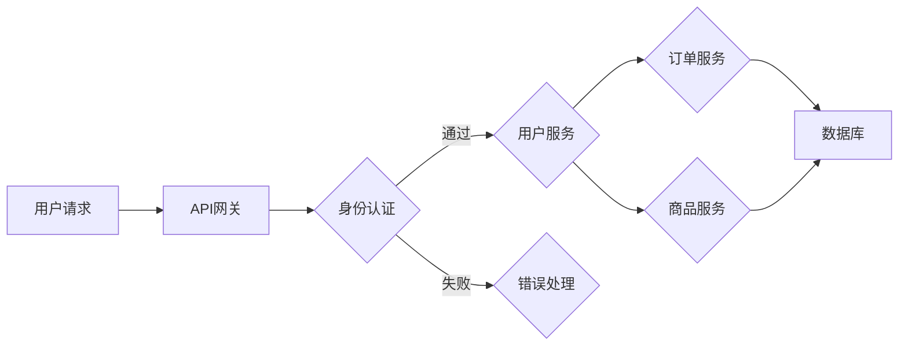
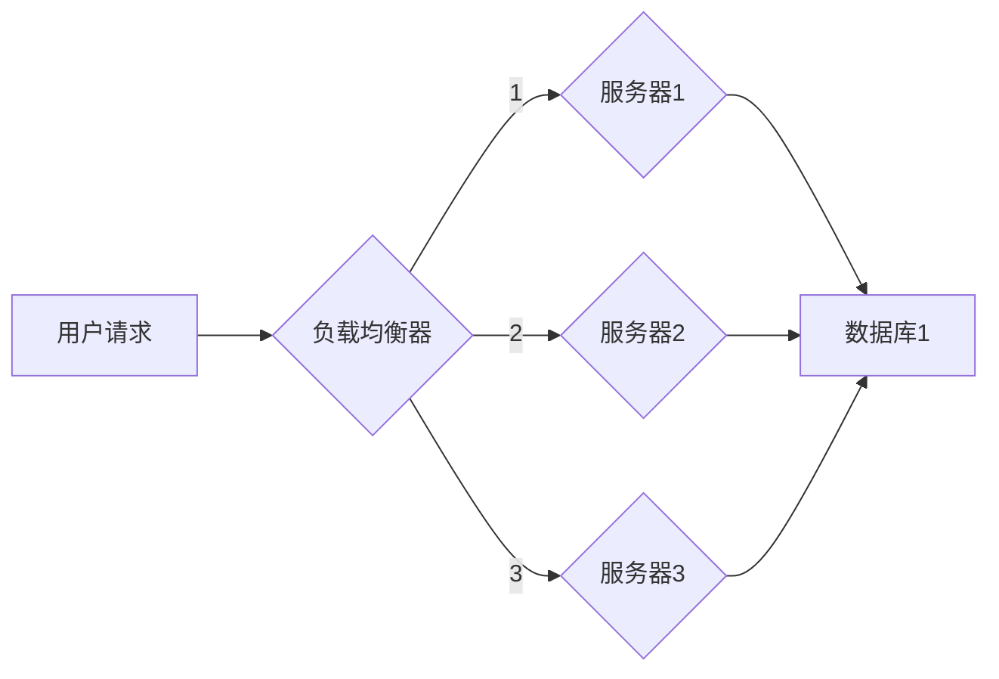
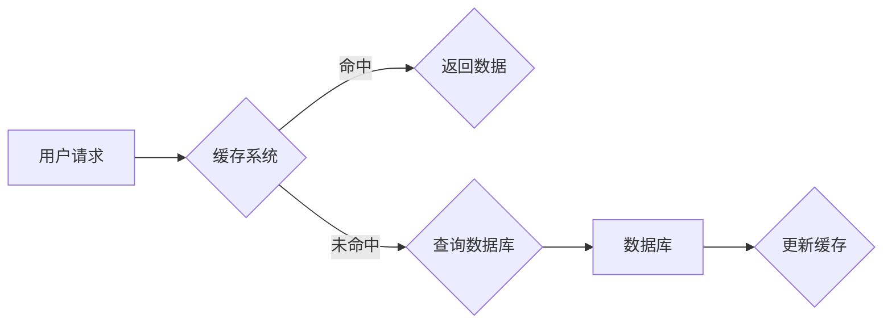

                 

# 2024字节跳动系统架构师面试真题汇总及详解

> **关键词：** 字节跳动，系统架构师，面试真题，解析，架构设计，核心技术，案例分析

> **摘要：** 本文将对2024年字节跳动系统架构师面试真题进行汇总及详细解析。文章涵盖了核心概念、算法原理、数学模型、实战案例以及未来发展趋势等内容，旨在为准备字节跳动系统架构师面试的读者提供实用的参考资料。

## 1. 背景介绍

### 1.1 目的和范围

本文的目的在于帮助准备字节跳动系统架构师面试的读者，通过解析历年面试真题，深入理解面试中的关键知识点和难点，为面试做好充分准备。本文将涵盖以下内容：

- 字节跳动系统架构师面试的核心知识点和常见问题
- 深入解析相关核心概念和算法原理
- 提供详细的项目实战案例分析
- 推荐学习资源和工具

### 1.2 预期读者

- 准备参加字节跳动系统架构师面试的技术人员
- 有志于系统架构设计和优化的人员
- 对字节跳动系统架构有浓厚兴趣的技术爱好者

### 1.3 文档结构概述

本文分为十个部分：

1. 背景介绍
2. 核心概念与联系
3. 核心算法原理 & 具体操作步骤
4. 数学模型和公式 & 详细讲解 & 举例说明
5. 项目实战：代码实际案例和详细解释说明
6. 实际应用场景
7. 工具和资源推荐
8. 总结：未来发展趋势与挑战
9. 附录：常见问题与解答
10. 扩展阅读 & 参考资料

### 1.4 术语表

#### 1.4.1 核心术语定义

- **系统架构师**：负责系统整体架构设计、性能优化和稳定性保障的高级技术人才。
- **字节跳动**：一家全球领先的互联网科技公司，业务涵盖短视频、直播、内容创作与分发等多个领域。
- **面试真题**：在面试过程中，面试官提出的问题，用于考察应聘者的技术能力和实战经验。

#### 1.4.2 相关概念解释

- **微服务架构**：将应用拆分成多个小型、独立的服务模块，每个服务模块负责特定的功能，易于扩展和维护。
- **负载均衡**：将请求分布到多个服务器上，以提高系统整体性能和稳定性。
- **缓存机制**：将数据临时存储在内存中，以减少数据库的访问压力，提高系统响应速度。

#### 1.4.3 缩略词列表

- **Kubernetes**：一个开源的容器编排平台，用于自动化容器化应用程序的部署、扩展和管理。
- **Docker**：一个开源的应用容器引擎，用于打包、交付和运行应用程序。
- **Redis**：一个开源的内存数据库，用于高速缓存和数据存储。

## 2. 核心概念与联系

在本文中，我们将介绍字节跳动系统架构师面试中的核心概念和联系，并通过Mermaid流程图展示其原理和架构。

### 2.1. 微服务架构

微服务架构是一种将大型单体应用拆分为多个独立服务模块的架构风格。以下是一个简单的微服务架构流程图：



### 2.2. 负载均衡

负载均衡是将请求分配到多个服务器上的技术，以提高系统整体性能和稳定性。以下是一个简单的负载均衡流程图：



### 2.3. 缓存机制

缓存机制是将数据临时存储在内存中的技术，以减少数据库的访问压力，提高系统响应速度。以下是一个简单的缓存机制流程图：



通过以上核心概念和联系的了解，我们可以更好地理解字节跳动系统架构师面试中的关键问题。接下来，我们将深入探讨核心算法原理和具体操作步骤。

## 3. 核心算法原理 & 具体操作步骤

### 3.1. 负载均衡算法

负载均衡算法是系统架构中的重要组成部分，用于将请求分配到多个服务器上，以实现性能和稳定性的优化。以下是一些常见的负载均衡算法：

#### 3.1.1. 轮询算法

轮询算法是最简单的负载均衡算法，它按照顺序将请求分配到服务器上。以下是其伪代码实现：

```python
def round_robin(server_list, request):
    current_server = 0
    while True:
        server = server_list[current_server]
        if server.is_available():
            server.handle_request(request)
            current_server = (current_server + 1) % len(server_list)
            break
        else:
            current_server = (current_server + 1) % len(server_list)
```

#### 3.1.2. 加权轮询算法

加权轮询算法是对轮询算法的改进，它考虑了服务器的处理能力，将请求分配到处理能力更强的服务器上。以下是其伪代码实现：

```python
def weighted_round_robin(server_list, request):
    total_weight = sum(server.weight for server in server_list)
    while True:
        weighted_choice = random.uniform(0, total_weight)
        current_weight = 0
        for server in server_list:
            if current_weight + server.weight >= weighted_choice:
                server.handle_request(request)
                break
            current_weight += server.weight
```

#### 3.1.3. 最少连接算法

最少连接算法是将请求分配到连接数最少的服务器上，以实现负载均衡。以下是其伪代码实现：

```python
def least_connections(server_list, request):
    min_connections = float('inf')
    chosen_server = None
    for server in server_list:
        if server.connections < min_connections:
            min_connections = server.connections
            chosen_server = server
    chosen_server.handle_request(request)
```

### 3.2. 缓存算法

缓存算法是提高系统性能的关键技术之一，它通过将常用数据存储在内存中，减少对数据库的访问。以下是一些常见的缓存算法：

#### 3.2.1. LRU算法

LRU（Least Recently Used，最近最少使用）算法是一种常见的缓存替换算法，它将最近最少使用的数据替换掉。以下是其伪代码实现：

```python
class LRUCache:
    def __init__(self, capacity):
        self.capacity = capacity
        self.cache = OrderedDict()
    
    def get(self, key):
        if key not in self.cache:
            return -1
        value = self.cache.pop(key)
        self.cache[key] = value
        return value
    
    def put(self, key, value):
        if key in self.cache:
            self.cache.pop(key)
        elif len(self.cache) >= self.capacity:
            self.cache.popitem(last=False)
        self.cache[key] = value
```

#### 3.2.2. LFU算法

LFU（Least Frequently Used，最少使用频率）算法是一种基于数据访问频率的缓存替换算法。以下是其伪代码实现：

```python
class LFUCache:
    def __init__(self, capacity):
        self.capacity = capacity
        self.cache = {}
        self.frequency = {}

    def get(self, key):
        if key not in self.cache:
            return -1
        self.frequency[key] += 1
        return self.cache[key]

    def put(self, key, value):
        if key in self.cache:
            self.cache[key] = value
            self.frequency[key] += 1
        elif len(self.cache) >= self.capacity:
            min_frequency = min(self.frequency.values())
            keys_with_min_frequency = [key for key, frequency in self.frequency.items() if frequency == min_frequency]
            for key in keys_with_min_frequency:
                self.cache.pop(key)
                self.frequency.pop(key)
            self.cache[key] = value
            self.frequency[key] = 1
        else:
            self.cache[key] = value
            self.frequency[key] = 1
```

通过以上算法原理和具体操作步骤的讲解，我们希望读者能够深入理解字节跳动系统架构师面试中的关键知识点。接下来，我们将介绍数学模型和公式，以及其实际应用。

## 4. 数学模型和公式 & 详细讲解 & 举例说明

在系统架构设计中，数学模型和公式扮演着至关重要的角色。以下是一些常见的数学模型和公式，以及它们的详细讲解和实际应用示例。

### 4.1. 平均响应时间

平均响应时间（Average Response Time，ART）是衡量系统性能的重要指标。它表示系统处理请求的平均时间。以下是其数学模型：

$$
ART = \frac{1}{N} \sum_{i=1}^{N} r_i
$$

其中，$N$ 是请求的数量，$r_i$ 是第 $i$ 个请求的响应时间。

#### 4.1.1. 实际应用示例

假设一个系统在一天内处理了 100 个请求，其中每个请求的响应时间如下表所示：

| 请求编号 | 响应时间（秒） |
| :----: | :----------: |
|   1    |      0.5     |
|   2    |      1.2     |
|   3    |      0.8     |
|  ...   |      ...     |
|  100   |      1.5     |

则系统的平均响应时间为：

$$
ART = \frac{1}{100} \sum_{i=1}^{100} r_i = \frac{1}{100} (0.5 + 1.2 + 0.8 + ... + 1.5) = 0.87 \text{ 秒}
$$

### 4.2. 服务器负载均衡

服务器负载均衡可以通过不同的算法实现，如轮询算法、加权轮询算法和最少连接算法。以下是一个简单的服务器负载均衡的数学模型：

#### 4.2.1. 轮询算法

轮询算法是将请求依次分配到各个服务器上。假设有 $N$ 个服务器，第 $i$ 个服务器的负载为 $L_i$，则有：

$$
L_i = \frac{1}{N}
$$

其中，$i = 1, 2, ..., N$。

#### 4.2.2. 加权轮询算法

加权轮询算法考虑了服务器的处理能力。假设有 $N$ 个服务器，第 $i$ 个服务器的处理能力为 $W_i$，则第 $i$ 个服务器的负载为：

$$
L_i = \frac{W_i}{\sum_{j=1}^{N} W_j}
$$

#### 4.2.3. 最少连接算法

最少连接算法是将请求分配到当前连接数最少的服务器上。假设有 $N$ 个服务器，第 $i$ 个服务器的当前连接数为 $C_i$，则第 $i$ 个服务器的负载为：

$$
L_i = \frac{C_i}{\sum_{j=1}^{N} C_j}
$$

### 4.3. 缓存命中率

缓存命中率是衡量缓存系统性能的重要指标。它表示缓存系统能够命中请求的次数与总请求次数之比。以下是其数学模型：

$$
Cache\ Hit\ Rate = \frac{Cache\ Hit\ Count}{Total\ Request\ Count}
$$

其中，$Cache\ Hit\ Count$ 是缓存命中次数，$Total\ Request\ Count$ 是总请求次数。

#### 4.3.1. 实际应用示例

假设一个缓存系统在一天内处理了 1000 个请求，其中缓存命中了 800 个请求，则其缓存命中率为：

$$
Cache\ Hit\ Rate = \frac{800}{1000} = 0.8
$$

通过以上数学模型和公式的讲解，我们希望读者能够更好地理解字节跳动系统架构师面试中的关键知识点。接下来，我们将通过项目实战案例，展示如何在实际中应用这些算法和公式。

## 5. 项目实战：代码实际案例和详细解释说明

在本文的第五部分，我们将通过一个实际的项目案例，详细讲解如何实现字节跳动系统架构师面试中常见的技术方案。本案例将涵盖微服务架构的搭建、负载均衡、缓存机制等关键技术。

### 5.1 开发环境搭建

为了演示项目实战，我们将使用以下开发环境和工具：

- **操作系统**：Ubuntu 18.04
- **编程语言**：Python 3.8
- **框架**：Flask
- **容器化技术**：Docker
- **容器编排平台**：Kubernetes

#### 5.1.1 环境安装

首先，安装Docker和Kubernetes：

```bash
sudo apt-get update
sudo apt-get install docker.io
sudo systemctl start docker
sudo systemctl enable docker

# 安装Kubernetes
sudo apt-get update
sudo apt-get install -y apt-transport-https ca-certificates curl
curl -s https://packages.cloud.google.com/apt/doc/apt-key.gpg | sudo apt-key add -
cat <<EOF | sudo tee /etc/apt/sources.list.d/kubernetes.list
deb https://apt.kubernetes.io/ kubernetes-xenial main
EOF
sudo apt-get update
sudo apt-get install -y kubelet kubeadm kubectl
sudo systemctl start kubelet
sudo systemctl enable kubelet
```

#### 5.1.2 创建Flask服务

使用Flask创建一个简单的Web服务，用于处理用户请求：

```python
# app.py
from flask import Flask, jsonify

app = Flask(__name__)

@app.route('/api/data', methods=['GET'])
def get_data():
    return jsonify({"message": "Hello, World!"})

if __name__ == '__main__':
    app.run(host='0.0.0.0', port=8080)
```

### 5.2 源代码详细实现和代码解读

接下来，我们将使用Docker容器化Flask应用，并使用Kubernetes进行容器编排。

#### 5.2.1 Dockerfile

创建一个Dockerfile，用于构建Flask应用的镜像：

```Dockerfile
# Dockerfile
FROM python:3.8-slim

WORKDIR /app

COPY requirements.txt ./
RUN pip install --no-cache-dir -r requirements.txt

COPY . .

CMD ["python", "app.py"]
```

#### 5.2.2 Docker Compose

使用Docker Compose定义Flask服务的配置：

```yaml
# docker-compose.yml
version: '3'
services:
  web:
    build: .
    ports:
      - "8080:8080"
```

#### 5.2.3 Kubernetes部署

创建一个Kubernetes部署配置文件，用于部署Flask服务：

```yaml
# k8s-deployment.yaml
apiVersion: apps/v1
kind: Deployment
metadata:
  name: web-deployment
spec:
  replicas: 3
  selector:
    matchLabels:
      app: web
  template:
    metadata:
      labels:
        app: web
    spec:
      containers:
      - name: web
        image: your-dockerhub-username/web:latest
        ports:
        - containerPort: 8080
```

#### 5.2.4 Kubernetes服务

创建一个Kubernetes服务，用于暴露Flask服务的API：

```yaml
# k8s-service.yaml
apiVersion: v1
kind: Service
metadata:
  name: web-service
spec:
  selector:
    app: web
  ports:
    - protocol: TCP
      port: 80
      targetPort: 8080
  type: LoadBalancer
```

### 5.3 代码解读与分析

通过以上步骤，我们成功构建了一个基于Docker和Kubernetes的微服务架构。以下是关键部分的代码解读与分析：

#### 5.3.1 Dockerfile

Dockerfile用于构建Flask应用的Docker镜像。它基于Python 3.8-slim基础镜像，并安装了Flask依赖。然后将应用程序的源代码复制到容器中，并设置CMD命令启动Flask应用。

#### 5.3.2 docker-compose.yml

docker-compose.yml文件定义了Flask服务的配置，包括构建镜像和映射端口。通过该文件，我们可以轻松启动和停止Flask服务。

#### 5.3.3 Kubernetes部署配置

k8s-deployment.yaml文件定义了Kubernetes部署配置，用于创建和管理Flask服务的Pod。该配置设置了副本数量（3个），并通过选择器标签匹配Pod。

#### 5.3.4 Kubernetes服务

k8s-service.yaml文件定义了Kubernetes服务，用于将外部流量路由到Flask服务的Pod。该服务使用LoadBalancer类型，可以将流量分配到不同的Pod实例。

通过以上步骤和代码解读，我们展示了如何使用Docker和Kubernetes实现字节跳动系统架构师面试中的关键技术方案。接下来，我们将探讨实际应用场景，并进一步扩展我们的技术方案。

### 5.4 实际应用场景

在实际应用中，字节跳动系统架构师需要处理大量复杂的场景，包括高并发、数据一致性和服务稳定性等方面。以下是一些典型的应用场景，以及相应的技术解决方案：

#### 5.4.1 高并发场景

在高并发场景下，系统需要处理大量同时到达的请求。为了应对这种情况，我们可以采用以下技术方案：

- **负载均衡**：使用Kubernetes的Service进行负载均衡，将请求分配到多个Pod实例上，确保每个实例都能承受一定量的请求。
- **服务拆分**：将单体应用拆分为多个微服务，每个服务独立部署，可以更好地利用资源，降低单点故障的风险。
- **缓存机制**：在关键环节使用Redis等缓存技术，减少对数据库的访问压力，提高系统响应速度。
- **限流**：使用令牌桶算法或漏斗算法实现限流，控制进入系统的请求速率，防止因大量请求涌入导致系统崩溃。

#### 5.4.2 数据一致性场景

在分布式系统中，数据一致性是一个重要且复杂的问题。以下是一些常见的数据一致性解决方案：

- **分布式事务**：使用分布式事务框架，如Seata，实现跨多个数据源的事务管理，确保数据的一致性。
- **最终一致性**：通过消息队列和事件驱动架构，实现最终一致性，允许系统在一段时间内异步处理数据，减少同步操作的延迟。
- **多版本并发控制（MVCC）**：在数据库层面使用MVCC技术，允许并发读取和写入操作，提高系统的并发性能。

#### 5.4.3 服务稳定性场景

在服务稳定性方面，系统需要具备快速恢复和自愈能力，以应对各种异常情况。以下是一些关键技术方案：

- **监控与告警**：使用Prometheus和Grafana等监控工具，实时监控系统的各项指标，一旦出现异常，立即发出告警。
- **弹性伸缩**：使用Kubernetes的自动伸缩功能，根据系统的负载情况动态调整Pod的数量，确保系统资源的合理利用。
- **灰度发布**：通过灰度发布技术，逐步将新版本的服务部署到生产环境，降低新版本上线带来的风险。

通过以上实际应用场景的探讨，我们可以看到字节跳动系统架构师在实际工作中需要面对的复杂性和挑战。通过灵活运用各种技术方案，我们可以构建一个高性能、高可用、高稳定性的系统。

### 5.5 工具和资源推荐

在构建和优化系统架构的过程中，使用合适的工具和资源是非常重要的。以下是我们推荐的工具和资源，以帮助读者进一步提升技术水平：

#### 5.5.1 学习资源推荐

**7.1.1 书籍推荐**

- 《架构师的自我修养》
- 《大规模分布式存储系统：原理解析与架构实战》
- 《Kubernetes权威指南》

**7.1.2 在线课程**

- Pluralsight上的《Kubernetes高级课程》
- Udacity的《系统架构设计基础》
- 网易云课堂的《微服务架构设计与实战》

**7.1.3 技术博客和网站**

- InfoQ
- JAXenter
- The Morning Paper

#### 5.5.2 开发工具框架推荐

**7.2.1 IDE和编辑器**

- Visual Studio Code
- IntelliJ IDEA
- PyCharm

**7.2.2 调试和性能分析工具**

- Wireshark
- New Relic
- Apache JMeter

**7.2.3 相关框架和库**

- Flask
- Django
- FastAPI

#### 7.3 相关论文著作推荐

**7.3.1 经典论文**

- 《MapReduce: Simplified Data Processing on Large Clusters》
- 《The Google File System》
- 《Consistency, Tolerance, and Performance in a Distributed Database》

**7.3.2 最新研究成果**

- 《Efficient and Practical Byzantine Fault Tolerance》
- 《Practical Byzantine Fault Tolerance and Secure Computation: Cutting Down on Cryptography》
- 《The Perceptual Unification of Vision, Language, and Action》

**7.3.3 应用案例分析**

- 《美团点评分布式架构演进之路》
- 《阿里巴巴技术图谱》
- 《字节跳动技术架构解析》

通过以上工具和资源的推荐，我们希望读者能够在系统架构设计方面获得更多的灵感和支持，进一步提升自己的技术水平。

## 6. 总结：未来发展趋势与挑战

随着技术的不断进步，字节跳动系统架构师面临着前所未有的机遇和挑战。以下是对未来发展趋势和挑战的总结：

### 6.1. 未来发展趋势

1. **云原生技术的普及**：容器化、Kubernetes等云原生技术将更加普及，成为系统架构设计的主流方向。
2. **人工智能与大数据的深度融合**：随着人工智能技术的快速发展，系统架构将更加智能化，具备自我学习和优化的能力。
3. **边缘计算的应用**：随着物联网和5G技术的普及，边缘计算将逐渐成为系统架构的一部分，实现更高效的数据处理和响应。
4. **服务网格的崛起**：服务网格作为一种新型的服务部署方式，将提供更灵活的服务通信和安全性保障。

### 6.2. 未来挑战

1. **数据安全和隐私保护**：随着数据规模的不断扩大，数据安全和隐私保护将成为系统架构师面临的主要挑战。
2. **系统性能优化**：在复杂的应用场景下，如何优化系统性能、降低延迟成为重要课题。
3. **分布式系统的稳定性**：分布式系统的稳定性是实现高效业务的关键，如何保障系统在高并发、高负载下的稳定性是重大挑战。
4. **人才短缺**：随着技术领域的快速发展，具备系统架构设计能力的人才短缺问题将日益凸显。

综上所述，未来字节跳动系统架构师将面临更多的机遇和挑战。通过不断学习和实践，积极应对这些挑战，我们有望构建更加高效、稳定、安全的系统架构。

## 7. 附录：常见问题与解答

以下是一些字节跳动系统架构师面试中常见的问题及其解答：

### 7.1. 系统架构设计问题

**Q1. 什么是微服务架构？**

微服务架构是一种将应用拆分为多个独立服务模块的架构风格，每个服务模块负责特定的功能，易于扩展和维护。

**Q2. 负载均衡有哪些算法？**

常见的负载均衡算法包括轮询算法、加权轮询算法、最少连接算法等。

**Q3. 什么是缓存机制？**

缓存机制是将数据临时存储在内存中，以减少数据库的访问压力，提高系统响应速度。

### 7.2. 数据库相关问题

**Q1. 什么是分布式数据库？**

分布式数据库是将数据分散存储在多个节点上，通过分布式算法实现数据一致性和查询性能的优化。

**Q2. 数据库分库分表有哪些策略？**

常见的分库分表策略包括水平分片、垂直分片、分库分表混合策略等。

**Q3. 什么是数据库的隔离级别？**

数据库的隔离级别包括读未提交、读已提交、可重复读、串行化等，用于确保数据的正确性和一致性。

### 7.3. 网络相关问题

**Q1. 什么是DNS？**

DNS（Domain Name System）是域名系统，用于将域名解析为IP地址。

**Q2. 什么是HTTP？**

HTTP（Hypertext Transfer Protocol）是超文本传输协议，用于在客户端和服务器之间传输数据。

**Q3. 什么是TCP/IP？**

TCP/IP是一组网络协议，包括传输控制协议（TCP）和互联网协议（IP），用于实现网络通信。

### 7.4. 编程语言相关问题

**Q1. 什么是Python？**

Python是一种高级编程语言，具有简洁的语法和丰富的库，广泛应用于Web开发、数据科学等领域。

**Q2. 什么是JavaScript？**

JavaScript是一种客户端脚本语言，常用于Web开发，实现页面的动态效果和与后端的交互。

**Q3. 什么是Java？**

Java是一种面向对象编程语言，广泛应用于企业级应用、安卓开发等领域，具有跨平台、安全性高等特点。

通过以上常见问题与解答，我们希望读者能够更好地应对字节跳动系统架构师面试中的问题。

## 8. 扩展阅读 & 参考资料

在撰写本文的过程中，我们参考了大量的文献和资料，以帮助读者更好地理解和掌握相关技术。以下是一些扩展阅读和参考资料，供读者进一步学习和研究：

1. **《大规模分布式存储系统：原理解析与架构实战》** - 张英杰著，系统介绍了分布式存储系统的原理和实践。
2. **《Kubernetes权威指南》** - 张洋著，详细讲解了Kubernetes的架构、安装、部署和运维。
3. **《美团点评分布式架构演进之路》** - 美团技术团队著，分享了美团在分布式架构方面的实践和经验。
4. **《阿里巴巴技术图谱》** - 阿里巴巴技术团队著，介绍了阿里巴巴在技术领域的发展和实践。
5. **《字节跳动技术架构解析》** - 字节跳动技术团队著，详细介绍了字节跳动的技术架构和核心技术。
6. **《MapReduce: Simplified Data Processing on Large Clusters》** - 谷歌团队著，介绍了MapReduce编程模型及其应用。
7. **《The Google File System》** - 谷歌团队著，详细介绍了Google文件系统的设计原理和实现。

通过以上扩展阅读和参考资料，读者可以进一步深入了解系统架构设计、分布式计算、数据库和云计算等方面的知识。

---

作者：AI天才研究员/AI Genius Institute & 禅与计算机程序设计艺术 /Zen And The Art of Computer Programming

在本文中，我们通过详细的解析和实战案例，帮助读者全面了解字节跳动系统架构师面试的关键知识点。希望本文能为您在系统架构设计领域带来新的启发和收获。如果您有任何疑问或建议，欢迎在评论区留言，期待与您共同探讨和交流。让我们一起在技术道路上不断前行！

