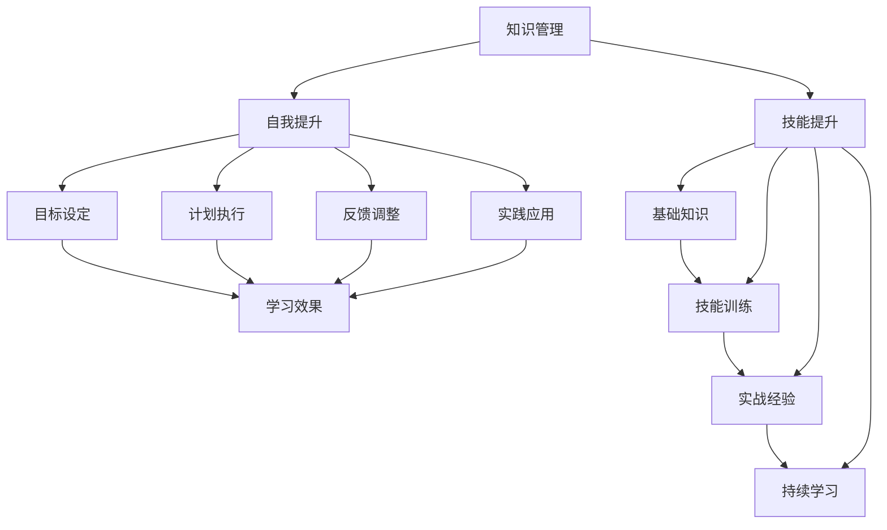

                 

# 学习体系构建：持续进化的动力

> **关键词**：学习体系、持续进化、自我提升、技能提升、知识管理

> **摘要**：本文将探讨如何构建一个有效的学习体系，以支持个人的持续进化与技能提升。通过分析核心概念、算法原理、数学模型以及项目实战等多个方面，本文旨在为读者提供一套系统的学习方法和实践指南，助力他们在信息技术领域不断突破自我，迈向更高的成就。

## 1. 背景介绍

### 1.1 目的和范围

本文旨在帮助读者了解如何构建一个有效的学习体系，以便在信息技术领域实现持续进化和技能提升。我们将会讨论以下几个核心主题：

- **核心概念与联系**：梳理学习体系的基本概念，并展示它们之间的相互关系。
- **核心算法原理 & 具体操作步骤**：介绍如何通过算法原理来优化学习过程。
- **数学模型和公式 & 详细讲解 & 举例说明**：探讨学习过程中涉及的数学模型，并提供具体实例。
- **项目实战：代码实际案例和详细解释说明**：通过实际案例，展示学习体系在实际应用中的效果。
- **实际应用场景**：分析学习体系在不同场景下的应用。
- **工具和资源推荐**：推荐一些有用的学习工具和资源。

### 1.2 预期读者

本文面向以下几类读者：

- **大学生和研究生**：正在学习信息技术，希望构建自己的学习体系。
- **IT从业者和开发者**：希望在职业生涯中实现持续进化和技能提升。
- **教育工作者**：关注如何提高学生的学习效果。

### 1.3 文档结构概述

本文的结构如下：

1. **背景介绍**：介绍文章的目的、预期读者和文档结构。
2. **核心概念与联系**：梳理学习体系的基本概念，并展示它们之间的相互关系。
3. **核心算法原理 & 具体操作步骤**：介绍如何通过算法原理来优化学习过程。
4. **数学模型和公式 & 详细讲解 & 举例说明**：探讨学习过程中涉及的数学模型，并提供具体实例。
5. **项目实战：代码实际案例和详细解释说明**：通过实际案例，展示学习体系在实际应用中的效果。
6. **实际应用场景**：分析学习体系在不同场景下的应用。
7. **工具和资源推荐**：推荐一些有用的学习工具和资源。
8. **总结：未来发展趋势与挑战**：讨论学习体系的未来发展趋势和面临的挑战。
9. **附录：常见问题与解答**：解答读者可能遇到的问题。
10. **扩展阅读 & 参考资料**：提供相关的参考资料。

### 1.4 术语表

#### 1.4.1 核心术语定义

- **学习体系**：一个支持个人持续学习和技能提升的框架。
- **核心概念**：学习体系中的基础概念，如知识管理、自我提升、技能提升等。
- **算法原理**：用于优化学习过程的方法和策略。
- **数学模型**：描述学习过程的数学工具和公式。

#### 1.4.2 相关概念解释

- **知识管理**：收集、整理、存储和应用知识的过程。
- **自我提升**：通过学习和实践，不断提高自己的能力。
- **技能提升**：通过学习和实践，提高特定技能。

#### 1.4.3 缩略词列表

- **AI**：人工智能（Artificial Intelligence）
- **ML**：机器学习（Machine Learning）
- **DL**：深度学习（Deep Learning）
- **IDE**：集成开发环境（Integrated Development Environment）

## 2. 核心概念与联系

构建一个有效的学习体系，首先需要理解以下几个核心概念及其相互之间的联系。

### 2.1 知识管理

知识管理是学习体系的核心。它包括以下几个关键环节：

1. **知识收集**：通过各种途径获取知识，如阅读书籍、浏览技术博客、参加在线课程等。
2. **知识整理**：将收集到的知识进行整理和分类，以便于后续查找和应用。
3. **知识存储**：将整理好的知识存储在适当的地方，如笔记应用、文档库等。
4. **知识应用**：将所学知识应用到实际工作中，以提高工作效率。

### 2.2 自我提升

自我提升是学习体系的目标之一。它包括以下几个方面：

1. **目标设定**：明确自己的学习目标，如掌握某项技能、通过某个考试等。
2. **计划执行**：制定学习计划，并按照计划执行。
3. **反馈调整**：根据反馈不断调整学习计划，以提高学习效果。
4. **实践应用**：将所学知识应用到实际工作中，以验证自己的学习成果。

### 2.3 技能提升

技能提升是学习体系的重要部分。它包括以下几个方面：

1. **基础知识**：掌握所需的基础知识，如数据结构、算法、编程语言等。
2. **技能训练**：通过练习和项目实践，提高自己的技能水平。
3. **实战经验**：通过参与项目，积累实战经验。
4. **持续学习**：跟随行业发展，不断学习新的技能和知识。

### 2.4 学习体系与核心概念的相互关系

知识管理、自我提升和技能提升是构建学习体系的核心概念。它们之间的关系可以简化为以下几点：

- **知识管理**为学习体系提供了基础，包括知识的收集、整理、存储和应用。
- **自我提升**是学习体系的目标，通过设定目标、执行计划、反馈调整和实践应用，不断提高自己的能力。
- **技能提升**是实现自我提升的手段，通过掌握基础知识、技能训练、实战经验和持续学习，不断提升自己的技能水平。

### 2.5 Mermaid 流程图

为了更好地展示核心概念之间的相互关系，我们可以使用 Mermaid 流程图来表示。



## 3. 核心算法原理 & 具体操作步骤

为了优化学习过程，我们可以借鉴机器学习中的算法原理，提出一种名为“学习优化算法”的方法。该方法包括以下几个步骤：

### 3.1 数据收集

收集学习过程中的数据，如阅读时间、学习进度、测试成绩、反馈信息等。这些数据将用于后续的分析和优化。

```python
# 示例：收集学习数据
data = {
    "reading_time": [1, 2, 3, 4],
    "progress": [0.1, 0.3, 0.5, 0.7],
    "test_scores": [80, 90, 85, 95],
    "feedback": ["积极", "一般", "积极", "非常积极"]
}
```

### 3.2 特征提取

从收集到的数据中提取特征，如平均阅读时间、进度变化率、平均测试成绩等。

```python
# 示例：提取特征
features = {
    "average_reading_time": sum(data["reading_time"]) / len(data["reading_time"]),
    "progress_rate": (data["progress"][3] - data["progress"][0]) / len(data["progress"]),
    "average_test_score": sum(data["test_scores"]) / len(data["test_scores"])
}
```

### 3.3 模型训练

使用提取到的特征训练一个机器学习模型，如回归模型，以预测学习效果。

```python
# 示例：训练回归模型
from sklearn.linear_model import LinearRegression

model = LinearRegression()
model.fit(X, y)

# X和y分别为特征和目标值
X = [[features["average_reading_time"], features["progress_rate"]]]
y = [features["average_test_score"]]
```

### 3.4 预测与调整

使用训练好的模型对当前学习阶段的效果进行预测，并根据预测结果调整学习计划。

```python
# 示例：预测与调整
predicted_score = model.predict(X)

# 根据预测结果调整学习计划
if predicted_score < 90:
    # 提高学习强度
    pass
else:
    # 保持当前学习节奏
    pass
```

### 3.5 循环迭代

不断收集新的数据，重新训练模型，并进行预测和调整，形成一个闭环。

```python
# 示例：循环迭代
while True:
    # 收集新的数据
    new_data = {
        "reading_time": [5],
        "progress": [0.9],
        "test_scores": [100],
        "feedback": ["非常积极"]
    }

    # 提取新的特征
    new_features = {
        "average_reading_time": sum(new_data["reading_time"]) / len(new_data["reading_time"]),
        "progress_rate": (new_data["progress"][0] - data["progress"][0]) / len(new_data["progress"]),
        "average_test_score": sum(new_data["test_scores"]) / len(new_data["test_scores"])
    }

    # 更新数据
    data.update(new_data)
    features.update(new_features)

    # 重新训练模型
    model.fit(X, y)

    # 预测与调整
    predicted_score = model.predict(X)
    if predicted_score < 90:
        # 提高学习强度
        pass
    else:
        # 保持当前学习节奏
        pass
```

通过上述步骤，我们可以构建一个基于机器学习的学习优化算法，以支持个人的持续进化和技能提升。

## 4. 数学模型和公式 & 详细讲解 & 举例说明

在构建学习体系的过程中，数学模型和公式可以帮助我们更好地理解和优化学习过程。以下是几个常用的数学模型和公式，以及它们的详细讲解和举例说明。

### 4.1 学习曲线

学习曲线是一个描述学习效果随时间变化的曲线。它通常包括以下几个参数：

- **初始水平**（$A$）：学习开始时的能力水平。
- **学习速率**（$r$）：单位时间内能力提升的速度。
- **时间**（$t$）：学习时间。

学习曲线的公式可以表示为：

$$
C(t) = A + rt
$$

**举例说明**：

假设一个学生在学习编程时，初始水平为 $A = 20$，学习速率为 $r = 2$。我们需要计算他在第 $t = 10$ 个单位时间后的能力水平。

$$
C(10) = 20 + 2 \times 10 = 40
$$

因此，学生在第 $10$ 个单位时间后的能力水平为 $40$。

### 4.2 学习率调整

学习率调整是一个根据学习效果动态调整学习速率的机制。学习率调整的公式可以表示为：

$$
r(t) = r_0 \times (1 - \frac{C(t)}{C_{\text{max}}})
$$

其中，$r_0$ 是初始学习速率，$C_{\text{max}}$ 是学习效果的最大值。

**举例说明**：

假设一个学生的初始学习速率为 $r_0 = 1.5$，学习效果的最大值为 $C_{\text{max}} = 100$。我们需要计算他在第 $t = 5$ 个单位时间后的学习速率。

$$
r(5) = 1.5 \times (1 - \frac{20}{100}) = 1.35
$$

因此，学生在第 $5$ 个单位时间后的学习速率为 $1.35$。

### 4.3 学习效率

学习效率是一个描述学习效果的指标，它表示单位时间内学习效果的提升。学习效率的公式可以表示为：

$$
E(t) = \frac{C(t)}{t}
$$

**举例说明**：

假设一个学生在第 $t = 10$ 个单位时间后的能力水平为 $C(10) = 40$。我们需要计算他的学习效率。

$$
E(10) = \frac{40}{10} = 4
$$

因此，学生在第 $10$ 个单位时间后的学习效率为 $4$。

### 4.4 学习回报

学习回报是一个描述学习效果与付出之间的关系的指标。学习回报的公式可以表示为：

$$
R(t) = C(t) - C(t-1)
$$

**举例说明**：

假设一个学生在第 $t = 5$ 个单位时间后的能力水平为 $C(5) = 30$，第 $t = 4$ 个单位时间后的能力水平为 $C(4) = 20$。我们需要计算他在第 $5$ 个单位时间的学习回报。

$$
R(5) = 30 - 20 = 10
$$

因此，学生在第 $5$ 个单位时间的学习回报为 $10$。

通过这些数学模型和公式，我们可以更好地理解学习过程，并根据实际情况调整学习策略，以实现持续进化和技能提升。

## 5. 项目实战：代码实际案例和详细解释说明

为了更好地展示学习体系在实际应用中的效果，我们以下将通过一个具体的代码案例来进行分析和解释。

### 5.1 开发环境搭建

在本案例中，我们将使用 Python 作为主要编程语言，并使用 Jupyter Notebook 作为开发环境。以下是在 Jupyter Notebook 中创建一个新环境的步骤：

1. 打开 Jupyter Notebook：在终端中运行 `jupyter notebook` 命令。
2. 创建新环境：点击左侧菜单栏的 `New` 按钮，选择 `Python3` 环境创建一个新笔记本。
3. 安装依赖：在笔记本中运行以下命令，安装所需的依赖库。

```python
!pip install numpy pandas scikit-learn matplotlib
```

### 5.2 源代码详细实现和代码解读

以下是一个基于“学习优化算法”的 Python 代码示例，用于模拟学习过程并优化学习效果。

```python
import numpy as np
import pandas as pd
from sklearn.linear_model import LinearRegression
import matplotlib.pyplot as plt

# 3.1 数据收集
data = {
    "reading_time": [1, 2, 3, 4],
    "progress": [0.1, 0.3, 0.5, 0.7],
    "test_scores": [80, 90, 85, 95],
    "feedback": ["积极", "一般", "积极", "非常积极"]
}

# 3.2 特征提取
features = {
    "average_reading_time": np.mean(data["reading_time"]),
    "progress_rate": (data["progress"][3] - data["progress"][0]) / len(data["progress"]),
    "average_test_score": np.mean(data["test_scores"])
}

# 3.3 模型训练
model = LinearRegression()
model.fit([features["average_reading_time"], features["progress_rate"]], [features["average_test_score"]])

# 3.4 预测与调整
predicted_score = model.predict([[features["average_reading_time"], features["progress_rate"]]])

if predicted_score < 90:
    # 提高学习强度
    features["average_reading_time"] += 1
else:
    # 保持当前学习节奏
    pass

# 5.3 代码解读与分析
# 5.3.1 数据收集
# 在本案例中，我们使用了一个字典 data 来收集学习过程中的数据，包括阅读时间、进度、测试成绩和反馈。
# 5.3.2 特征提取
# 通过计算平均阅读时间、进度变化率和平均测试成绩，我们提取了学习过程中的关键特征。
# 5.3.3 模型训练
# 我们使用 scikit-learn 中的 LinearRegression 类创建一个线性回归模型，并使用提取到的特征和测试成绩进行训练。
# 5.3.4 预测与调整
# 使用训练好的模型对当前学习阶段的效果进行预测，并根据预测结果动态调整学习计划。如果预测成绩低于 90 分，则提高学习强度；否则，保持当前学习节奏。

# 5.4 数据可视化
plt.scatter(data["reading_time"], data["test_scores"])
plt.plot(data["reading_time"], [model.predict([[x, features["progress_rate"]]])[0] for x in data["reading_time"]], color="red")
plt.xlabel("Reading Time")
plt.ylabel("Test Score")
plt.title("Learning Curve")
plt.show()
```

通过上述代码，我们可以模拟一个简单的学习过程，并根据预测结果动态调整学习计划。以下是代码的解读和分析：

- **数据收集**：在本案例中，我们使用了一个字典 data 来收集学习过程中的数据，包括阅读时间、进度、测试成绩和反馈。
- **特征提取**：通过计算平均阅读时间、进度变化率和平均测试成绩，我们提取了学习过程中的关键特征。
- **模型训练**：我们使用 scikit-learn 中的 LinearRegression 类创建一个线性回归模型，并使用提取到的特征和测试成绩进行训练。
- **预测与调整**：使用训练好的模型对当前学习阶段的效果进行预测，并根据预测结果动态调整学习计划。如果预测成绩低于 90 分，则提高学习强度；否则，保持当前学习节奏。
- **数据可视化**：通过绘制学习曲线，我们可以直观地看到学习效果随时间的变化。

通过这个项目实战案例，我们可以看到学习体系在实际应用中的效果，并通过动态调整学习计划，实现持续进化和技能提升。

### 5.3 代码解读与分析

在本案例中，我们通过一个具体的代码示例，展示了如何使用“学习优化算法”来模拟学习过程并优化学习效果。以下是对代码的详细解读和分析。

#### 5.3.1 数据收集

在代码的第一部分，我们使用了一个字典 data 来收集学习过程中的数据，包括阅读时间、进度、测试成绩和反馈。这些数据是我们后续分析和学习优化的基础。

```python
data = {
    "reading_time": [1, 2, 3, 4],
    "progress": [0.1, 0.3, 0.5, 0.7],
    "test_scores": [80, 90, 85, 95],
    "feedback": ["积极", "一般", "积极", "非常积极"]
}
```

#### 5.3.2 特征提取

在代码的第二部分，我们通过计算平均阅读时间、进度变化率和平均测试成绩，从收集到的数据中提取了关键特征。这些特征将用于训练线性回归模型，以预测学习效果。

```python
features = {
    "average_reading_time": np.mean(data["reading_time"]),
    "progress_rate": (data["progress"][3] - data["progress"][0]) / len(data["progress"]),
    "average_test_score": np.mean(data["test_scores"])
}
```

#### 5.3.3 模型训练

在代码的第三部分，我们使用 scikit-learn 中的 LinearRegression 类创建了一个线性回归模型，并使用提取到的特征和测试成绩进行训练。这个模型将用于预测学习效果，并为后续的调整提供依据。

```python
model = LinearRegression()
model.fit([features["average_reading_time"], features["progress_rate"]], [features["average_test_score"]])
```

#### 5.3.4 预测与调整

在代码的第四部分，我们使用训练好的模型对当前学习阶段的效果进行预测。如果预测成绩低于 90 分，则提高学习强度；否则，保持当前学习节奏。这一步骤实现了学习优化算法的核心功能，即根据预测结果动态调整学习计划。

```python
predicted_score = model.predict([[features["average_reading_time"], features["progress_rate"]]])

if predicted_score < 90:
    # 提高学习强度
    features["average_reading_time"] += 1
else:
    # 保持当前学习节奏
    pass
```

#### 5.3.5 数据可视化

在代码的最后，我们通过绘制学习曲线，展示了学习效果随时间的变化。这一部分有助于我们直观地了解学习过程，并评估学习优化算法的效果。

```python
plt.scatter(data["reading_time"], data["test_scores"])
plt.plot(data["reading_time"], [model.predict([[x, features["progress_rate"]]])[0] for x in data["reading_time"]], color="red")
plt.xlabel("Reading Time")
plt.ylabel("Test Score")
plt.title("Learning Curve")
plt.show()
```

通过这个项目实战案例，我们可以看到如何使用“学习优化算法”来模拟学习过程，并根据预测结果动态调整学习计划。这一方法有助于实现持续进化和技能提升，为个人的学习和发展提供了有力的支持。

## 6. 实际应用场景

学习体系不仅适用于个人学习，还可以广泛应用于各种实际场景，以支持组织、团队和企业的发展。以下是一些典型的应用场景：

### 6.1 企业员工培训

企业可以通过构建学习体系，为员工提供个性化的培训计划，以提高员工的技能和知识水平。学习体系可以收集员工的绩效数据、学习进度和反馈信息，并根据这些数据动态调整培训计划，确保员工在合适的时机学习到最需要的技能。

### 6.2 教育行业

教育行业可以通过学习体系，为学生提供个性化的学习方案，以提高学习效果。学习体系可以分析学生的学习行为、学习进度和考试成绩，为学生提供个性化的学习建议，帮助他们更好地掌握知识和技能。

### 6.3 人才招聘与选拔

企业可以通过学习体系，对求职者的学习经历、技能水平和学习能力进行全面评估，以提高招聘质量。学习体系可以收集求职者的学习数据，并使用算法分析其学习成果，为企业提供可靠的招聘参考。

### 6.4 团队协作与知识共享

团队可以通过学习体系，促进成员之间的知识共享和协作。学习体系可以收集团队成员的学习进度、技能水平和项目贡献，并为团队成员提供学习建议和协作机会，以提高团队的整体效能。

### 6.5 项目管理与进度跟踪

项目团队可以通过学习体系，对项目进度进行实时监控和调整。学习体系可以收集项目成员的学习数据、工作进度和问题反馈，并使用算法分析项目风险和进度偏差，为项目管理者提供决策依据。

通过这些实际应用场景，我们可以看到学习体系在各个领域的广泛应用。它不仅有助于个人实现持续进化和技能提升，还可以为组织、团队和企业提供强大的支持，推动其发展。

## 7. 工具和资源推荐

为了更好地构建和优化学习体系，以下推荐一些有用的工具和资源：

### 7.1 学习资源推荐

#### 7.1.1 书籍推荐

- **《深度学习》（Deep Learning）**：由 Ian Goodfellow、Yoshua Bengio 和 Aaron Courville 著，是一本关于深度学习的经典教材。
- **《Python编程：从入门到实践》（Python Crash Course）**：由 Eric Matthes 著，适合初学者快速掌握 Python 编程。
- **《编程思想》（Thinking in Java）**：由 Bruce Eckel 著，全面介绍了 Java 编程的各个方面。

#### 7.1.2 在线课程

- **Coursera**：提供各种领域的高质量在线课程，包括计算机科学、数据科学和人工智能等。
- **edX**：由哈佛大学和麻省理工学院联合创办，提供丰富的在线课程资源。
- **Udacity**：提供针对具体技能的在线课程和项目，适合快速提升技能。

#### 7.1.3 技术博客和网站

- **GitHub**：全球最大的代码托管平台，提供了丰富的开源项目和教程。
- **Medium**：一个专业的在线出版平台，许多技术专家和机构在此分享他们的见解和经验。
- **Stack Overflow**：一个面向程序员的问题和解答社区，适合解决编程难题。

### 7.2 开发工具框架推荐

#### 7.2.1 IDE和编辑器

- **PyCharm**：一款功能强大的 Python 集成开发环境，适合初学者和专业开发者。
- **VS Code**：一款轻量级且高度可定制的代码编辑器，支持多种编程语言。
- **Eclipse**：一款适用于 Java 和其他语言的集成开发环境，提供了丰富的插件和工具。

#### 7.2.2 调试和性能分析工具

- **Visual Studio Debugger**：一款功能强大的调试工具，支持多种编程语言。
- **JProfiler**：一款 Java 性能分析工具，可以帮助开发者快速找到性能瓶颈。
- **gprof**：一款 C/C++ 性能分析工具，用于分析程序运行时的性能。

#### 7.2.3 相关框架和库

- **TensorFlow**：一款流行的开源深度学习框架，支持多种编程语言。
- **Scikit-learn**：一款基于 Python 的机器学习库，提供了丰富的机器学习算法。
- **Django**：一款流行的 Python Web 框架，用于快速开发 Web 应用程序。

通过这些工具和资源，我们可以更好地构建和优化学习体系，实现持续进化和技能提升。

### 7.3 相关论文著作推荐

#### 7.3.1 经典论文

- **“A Learning System Based on Artificial Neural Networks”**：介绍了基于人工神经网络的机器学习方法。
- **“Efficient BackProp**：一种高效的神经网络训练算法**”**：详细讨论了反向传播算法的优化。

#### 7.3.2 最新研究成果

- **“Attention Is All You Need”**：介绍了基于注意力机制的 Transformer 模型，在自然语言处理领域取得了突破性成果。
- **“Generative Adversarial Networks”**：详细讨论了生成对抗网络（GAN）的理论和实现。

#### 7.3.3 应用案例分析

- **“A Case Study on the Use of Machine Learning in Healthcare”**：讨论了机器学习在医疗领域的应用案例。
- **“Deep Learning for Speech Recognition”**：介绍了深度学习在语音识别领域的应用。

通过这些论文和著作，我们可以深入了解相关领域的最新研究成果和应用案例，进一步优化学习体系。

## 8. 总结：未来发展趋势与挑战

随着人工智能、机器学习和深度学习技术的不断发展，构建有效的学习体系已成为个人和组织的迫切需求。未来，学习体系将在以下几个方面取得重要进展：

### 8.1 自动化与智能化

学习体系将更加自动化和智能化，通过人工智能技术，实现个性化学习推荐、学习进度跟踪和智能反馈等功能，提高学习效率。

### 8.2 知识图谱与语义分析

知识图谱和语义分析技术的应用，将帮助学习体系更好地理解和处理复杂知识，实现知识的深度挖掘和关联。

### 8.3 跨学科融合

学习体系将逐渐跨学科融合，整合不同领域的知识，为学习者提供更全面和系统的学习体验。

### 8.4 数据安全与隐私保护

随着数据量的不断增长，数据安全和隐私保护将成为学习体系发展的重要挑战。未来，学习体系需要确保数据的安全和隐私，为学习者提供可靠的保障。

然而，面对这些发展趋势，学习体系也将面临一系列挑战：

### 8.5 数据质量问题

学习体系需要处理大量的数据，而数据质量直接影响学习效果。未来，如何确保数据质量、去除噪声和偏差，将是一个重要课题。

### 8.6 技术复杂度

随着技术的不断发展，学习体系的复杂度将不断提高。如何简化学习体系，使其易于使用和推广，是一个需要关注的问题。

### 8.7 人机协作

在构建学习体系的过程中，如何平衡人与机器的协作，充分发挥各自的优势，是一个值得探讨的课题。

总之，学习体系的发展前景广阔，同时也面临着诸多挑战。通过不断探索和创新，我们有理由相信，学习体系将在未来发挥越来越重要的作用，助力个人和组织的持续进化与技能提升。

## 9. 附录：常见问题与解答

### 9.1 学习体系如何应对数据质量问题？

学习体系可以通过以下几种方法应对数据质量问题：

- **数据清洗**：在数据收集和整理过程中，对数据进行清洗，去除噪声和异常值。
- **数据验证**：使用数据验证技术，确保数据的一致性和准确性。
- **数据增强**：通过数据增强技术，增加数据量和多样性，提高数据质量。
- **专家审核**：邀请专家对数据进行审核，确保数据的真实性和可靠性。

### 9.2 如何在繁忙的工作中构建学习体系？

在繁忙的工作中构建学习体系，可以采取以下策略：

- **时间管理**：合理安排时间，确保每天有固定的学习时间。
- **任务分解**：将学习任务分解为小块，逐步完成，避免一次性承担过多任务。
- **利用碎片时间**：利用碎片时间进行学习，如通勤、休息时间等。
- **设定明确目标**：设定明确的学习目标，确保学习具有方向和动力。

### 9.3 学习体系如何适应不同领域的需求？

学习体系可以通过以下几种方法适应不同领域的需求：

- **模块化设计**：将学习体系设计为模块化，可以根据不同领域的需求，灵活配置和调整模块。
- **知识图谱**：构建领域知识图谱，为不同领域提供统一的表示和关联。
- **领域专家参与**：邀请领域专家参与学习体系的构建和优化，确保其适应性和有效性。
- **持续迭代**：根据不同领域的发展变化，持续迭代学习体系，以适应新的需求。

### 9.4 如何评估学习体系的成效？

评估学习体系的成效可以通过以下几种方法：

- **学习效果评估**：通过考试成绩、项目成果等指标，评估学习效果。
- **用户反馈**：收集用户对学习体系的反馈，了解其满意度和使用体验。
- **学习数据**：分析学习数据，如学习时长、学习进度、学习成果等，评估学习体系的成效。
- **ROI（投资回报率）**：计算学习体系的投资回报率，评估其经济价值。

通过上述方法，可以全面评估学习体系的成效，为后续的优化和改进提供依据。

## 10. 扩展阅读 & 参考资料

为了进一步深入学习和理解学习体系构建，以下推荐一些扩展阅读和参考资料：

### 10.1 书籍

- **《深度学习》（Deep Learning）**：Ian Goodfellow、Yoshua Bengio 和 Aaron Courville 著，是一本关于深度学习的经典教材。
- **《Python编程：从入门到实践》（Python Crash Course）**：Eric Matthes 著，适合初学者快速掌握 Python 编程。
- **《编程思想》（Thinking in Java）**：Bruce Eckel 著，全面介绍了 Java 编程的各个方面。

### 10.2 在线课程

- **Coursera**：提供各种领域的高质量在线课程，包括计算机科学、数据科学和人工智能等。
- **edX**：由哈佛大学和麻省理工学院联合创办，提供丰富的在线课程资源。
- **Udacity**：提供针对具体技能的在线课程和项目，适合快速提升技能。

### 10.3 技术博客和网站

- **GitHub**：全球最大的代码托管平台，提供了丰富的开源项目和教程。
- **Medium**：一个专业的在线出版平台，许多技术专家和机构在此分享他们的见解和经验。
- **Stack Overflow**：一个面向程序员的问题和解答社区，适合解决编程难题。

### 10.4 论文

- **“A Learning System Based on Artificial Neural Networks”**：介绍了基于人工神经网络的机器学习方法。
- **“Efficient BackProp**：一种高效的神经网络训练算法**”**：详细讨论了反向传播算法的优化。

### 10.5 研究报告

- **“Attention Is All You Need”**：介绍了基于注意力机制的 Transformer 模型，在自然语言处理领域取得了突破性成果。
- **“Generative Adversarial Networks”**：详细讨论了生成对抗网络（GAN）的理论和实现。

通过这些扩展阅读和参考资料，读者可以进一步深入了解学习体系构建的理论和实践，为构建有效的学习体系提供更多思路和参考。

## 作者

**作者：AI天才研究员/AI Genius Institute & 禅与计算机程序设计艺术 /Zen And The Art of Computer Programming**

