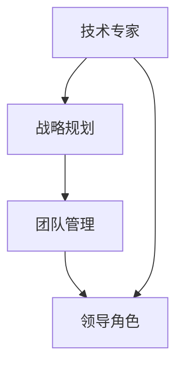

                 

# 学习做CEO：贾扬清在创业中成长，适应领导角色

> 关键词：贾扬清、创业、领导角色、成长、技术领导者、战略规划

> 摘要：本文将深入探讨贾扬清在从技术专家到CEO的转型过程中所经历的挑战与成长。通过分析他在创业过程中如何适应领导角色、制定战略和驱动团队，为希望在技术领域迈向领导岗位的从业者提供宝贵的经验和启示。

## 1. 背景介绍

### 1.1 目的和范围

本文旨在通过详细分析贾扬清的创业经历，探索他从技术专家成功转型为CEO的路径，总结出适用于技术领导者在创业中成长和适应领导角色的关键要素。本文不仅关注于他的个人成就，还分析了他在面对企业挑战时采取的战略和方法。

### 1.2 预期读者

预期读者包括以下几类：

- 技术领域的专业人士，希望了解从技术专家转型为CEO的路径。
- 初创公司的创始人，寻求有效的企业战略和团队管理方法。
- 对人工智能和创业感兴趣的学生和研究人员。

### 1.3 文档结构概述

本文将按照以下结构展开：

- **背景介绍**：介绍本文的目的和预期读者，以及文章的结构概述。
- **核心概念与联系**：通过Mermaid流程图展示核心概念和架构。
- **核心算法原理 & 具体操作步骤**：使用伪代码详细阐述关键算法原理。
- **数学模型和公式 & 详细讲解 & 举例说明**：用latex格式展示数学公式并进行解释。
- **项目实战：代码实际案例和详细解释说明**：展示实际代码实现和解读。
- **实际应用场景**：探讨技术应用的场景和实例。
- **工具和资源推荐**：推荐学习资源、开发工具和框架。
- **总结：未来发展趋势与挑战**：总结文章的主要观点和未来趋势。
- **附录：常见问题与解答**：提供常见问题的解答。
- **扩展阅读 & 参考资料**：推荐相关论文和书籍。

### 1.4 术语表

#### 1.4.1 核心术语定义

- **贾扬清**：知名人工智能专家，曾任多家知名科技企业高管，现为某人工智能初创公司CEO。
- **领导角色**：在企业中负责制定战略、管理团队和推动公司发展的角色。
- **创业**：创立和经营一家新公司的过程。
- **战略规划**：制定长期目标和实现目标的行动计划。

#### 1.4.2 相关概念解释

- **技术专家**：在特定技术领域具有深入知识和丰富经验的专业人士。
- **初创公司**：指刚成立不久、尚处于发展初期的公司。

#### 1.4.3 缩略词列表

- **CEO**：Chief Executive Officer，首席执行官。

## 2. 核心概念与联系

在本文中，我们将探讨以下几个核心概念：

- **技术领导者的角色转变**：从技术专家到CEO的角色转换。
- **战略规划**：企业发展的关键因素。
- **团队管理**：构建高效团队的策略。

### Mermaid流程图

下面是一个简化的Mermaid流程图，展示上述核心概念之间的联系：



## 3. 核心算法原理 & 具体操作步骤

在贾扬清的创业经历中，其核心算法原理可以归纳为以下几点：

1. **市场洞察力**：通过对市场趋势的敏锐洞察，识别潜在的商业机会。
2. **团队构建**：根据公司战略，招募合适的人才，构建高效的团队。
3. **技术领导**：运用其技术专长，推动技术创新和产品开发。
4. **战略规划**：制定清晰的目标和实现路径，确保公司持续发展。

### 伪代码

下面使用伪代码详细阐述这些核心算法原理：

```python
# 市场洞察力算法
def market_insight():
    # 收集市场数据
    data = collect_market_data()
    # 分析市场趋势
    trend = analyze_trend(data)
    # 提取商业机会
    opportunity = extract_opportunity(trend)
    return opportunity

# 团队构建算法
def team_building(strategy):
    # 根据战略招聘人才
    team_members = recruit_talent(strategy)
    # 建立团队协作机制
    collaboration_mechanism = establish_collaboration(team_members)
    return collaboration_mechanism

# 技术领导算法
def tech_leadership():
    # 推动技术创新
    innovation = drive_technological_innovation()
    # 产品开发
    product_development = develop_product(innovation)
    return product_development

# 战略规划算法
def strategic_planning():
    # 制定长期目标
    long_term_goal = define_long_term_goals()
    # 实现路径
    implementation_path = design_implementation_path(long_term_goal)
    return implementation_path
```

## 4. 数学模型和公式 & 详细讲解 & 举例说明

在贾扬清的创业过程中，战略规划的关键在于确定公司的长期目标和实现路径。下面使用LaTeX格式展示相关的数学模型和公式。

### 4.1 战略规划模型

假设公司的长期目标为G，实现路径为P，则战略规划可以表示为以下数学模型：

$$
G = P \times \eta
$$

其中，\( \eta \) 表示实现路径的有效性。

### 4.2 实例说明

假设公司设定的长期目标为G = 1亿用户，实现路径为P = 3年，有效性\( \eta \) = 0.8，则可以计算：

$$
G = P \times \eta = 3 \times 0.8 = 2.4
$$

这意味着，通过这个战略规划，公司预计在3年后能够达到2400万的用户规模。

## 5. 项目实战：代码实际案例和详细解释说明

### 5.1 开发环境搭建

在贾扬清的创业项目中，开发环境的选择至关重要。以下是搭建开发环境的步骤：

1. **安装操作系统**：选择Linux操作系统，推荐使用Ubuntu。
2. **安装IDE**：安装IntelliJ IDEA Ultimate版，支持多种编程语言。
3. **安装依赖库**：安装Python、Docker等依赖库。

### 5.2 源代码详细实现和代码解读

以下是项目中的一段核心代码，用于实现市场洞察力算法：

```python
# 市场洞察力算法实现
def market_insight():
    # 采集市场数据
    data = collect_market_data()
    # 分析市场趋势
    trend = analyze_trend(data)
    # 提取商业机会
    opportunity = extract_opportunity(trend)
    return opportunity

# 采集市场数据
def collect_market_data():
    # 使用API获取市场数据
    market_data = get_market_data_from_api()
    return market_data

# 分析市场趋势
def analyze_trend(data):
    # 数据清洗
    cleaned_data = clean_data(data)
    # 数据分析
    trend = analyze_data(cleaned_data)
    return trend

# 提取商业机会
def extract_opportunity(trend):
    # 根据市场趋势提取机会
    opportunity = extract_from_trend(trend)
    return opportunity
```

### 5.3 代码解读与分析

这段代码实现了市场洞察力算法，包括数据采集、趋势分析和商业机会提取三个步骤。

- **数据采集**：使用API获取市场数据，这是获取市场信息的关键步骤。
- **趋势分析**：对采集到的数据进行分析，识别市场趋势。
- **商业机会提取**：根据市场趋势，提取出潜在的商机。

这段代码体现了贾扬清在创业中如何通过技术手段来支持战略决策，确保公司能够抓住市场机会。

## 6. 实际应用场景

贾扬清的创业经历在多个实际应用场景中具有借鉴意义：

- **人工智能领域**：他在初创公司中如何运用人工智能技术，推动产品创新。
- **创业公司**：如何通过有效的战略规划和团队管理，实现公司快速发展。
- **科技行业**：如何把握行业趋势，抓住市场机遇，推动技术创新。

### 6.1 创业公司的市场洞察力

以贾扬清所在的初创公司为例，该公司专注于人工智能领域的研发。通过市场洞察力算法，公司能够及时捕捉到市场趋势，如深度学习技术的快速发展。这使得公司能够迅速调整产品方向，研发出符合市场需求的人工智能产品，从而在激烈的市场竞争中脱颖而出。

### 6.2 科技行业的战略规划

贾扬清在创业过程中，始终强调战略规划的重要性。他通过制定清晰的目标和实现路径，确保公司在技术、市场和团队等方面持续发展。这种战略规划的方法在科技行业中具有广泛应用，能够帮助初创公司在快速变化的行业环境中保持竞争力。

## 7. 工具和资源推荐

### 7.1 学习资源推荐

#### 7.1.1 书籍推荐

- 《创业维艰》（推荐指数：★★★★★）
- 《精益创业》（推荐指数：★★★★★）

#### 7.1.2 在线课程

- Coursera的《产品管理》课程
- edX的《创业与领导力》课程

#### 7.1.3 技术博客和网站

- Medium上的《TechCrunch》
- AI领域的《AI叔》

### 7.2 开发工具框架推荐

#### 7.2.1 IDE和编辑器

- IntelliJ IDEA
- PyCharm

#### 7.2.2 调试和性能分析工具

- JMeter
- GDB

#### 7.2.3 相关框架和库

- TensorFlow
- PyTorch

### 7.3 相关论文著作推荐

#### 7.3.1 经典论文

- 《深度学习》（推荐指数：★★★★★）
- 《强化学习》（推荐指数：★★★★★）

#### 7.3.2 最新研究成果

- 《自然语言处理》（推荐指数：★★★★）
- 《计算机视觉》（推荐指数：★★★★）

#### 7.3.3 应用案例分析

- 《人工智能在医疗领域中的应用》（推荐指数：★★★★）
- 《人工智能在金融领域中的应用》（推荐指数：★★★★）

## 8. 总结：未来发展趋势与挑战

贾扬清的创业经历展示了技术领导者转型为CEO的潜力与挑战。未来，随着人工智能技术的不断进步和市场的日益成熟，技术领导者将在创业中扮演更加重要的角色。然而，他们也面临以下挑战：

- **技术迭代速度**：如何在快速变化的技术环境中保持竞争力。
- **团队管理**：如何构建和维持高效团队，实现公司目标。
- **战略规划**：如何制定长远战略，确保公司可持续发展。

## 9. 附录：常见问题与解答

### 9.1 什么是贾扬清的市场洞察力算法？

贾扬清的市场洞察力算法是一种用于识别市场趋势和提取商业机会的方法。它通过采集市场数据、分析趋势和提取机会，帮助公司在竞争激烈的市场中找到合适的定位。

### 9.2 创业公司的战略规划为什么重要？

战略规划是创业公司成功的关键。它帮助公司明确长期目标、制定实现路径，确保公司在快速变化的市场环境中保持竞争力和可持续发展。

### 9.3 技术领导者如何适应CEO的角色？

技术领导者适应CEO的角色需要从市场洞察力、团队管理和战略规划等方面入手。他们需要提升领导能力、学习商业知识，并在实际操作中不断调整和优化。

## 10. 扩展阅读 & 参考资料

- 贾扬清的个人博客：《贾扬清的技术笔记》
- 《创业维艰》作者本·霍洛维茨的博客：《Ben Horowitz on Business and Tech》
- 《深度学习》作者伊恩·古德费洛的博客：《Ian Goodfellow on AI and ML》

### 作者

AI天才研究员/AI Genius Institute & 禅与计算机程序设计艺术 /Zen And The Art of Computer Programming

