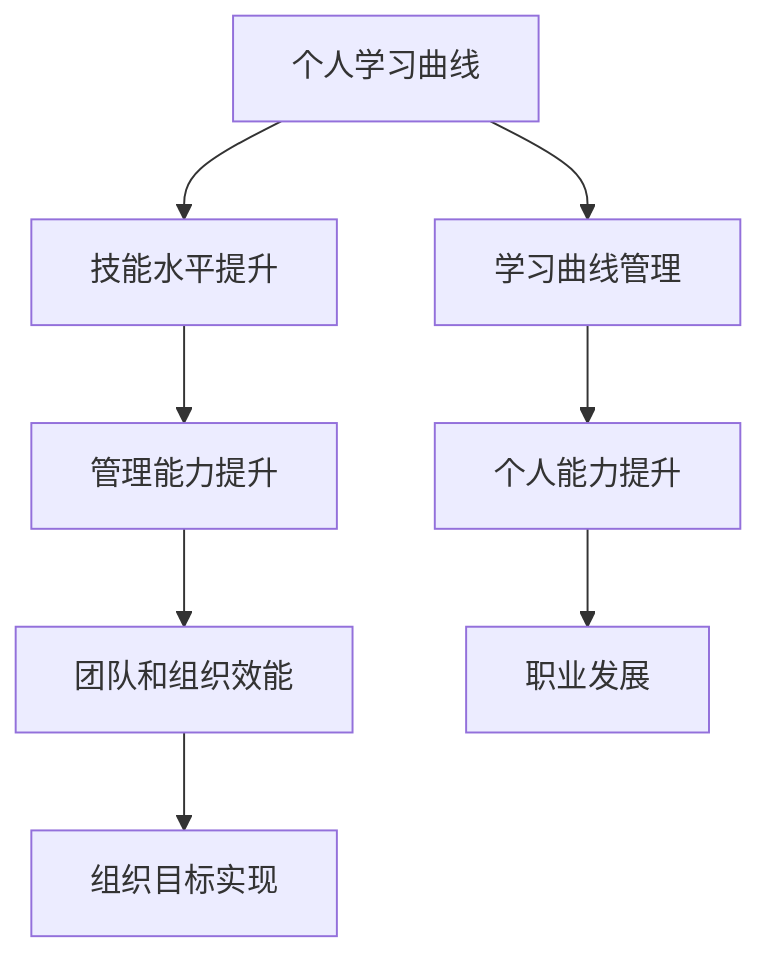

                 

# 学习曲线：管理能力提升的关键

> 关键词：学习曲线、管理能力、能力提升、职业发展、工作效率

> 摘要：本文旨在探讨学习曲线在管理能力提升中的关键作用。通过深入分析学习曲线的原理，结合具体案例和实际操作，我们将揭示如何通过合理管理学习曲线，实现个人和管理能力的显著提升，从而在职业发展中取得更大成就。

## 1. 背景介绍

### 1.1 目的和范围

本文将围绕学习曲线这一核心概念，探讨其在管理能力提升中的重要作用。我们将从以下几个方面展开讨论：

1. 学习曲线的基本原理与构成
2. 学习曲线与个人能力提升的关系
3. 如何通过管理学习曲线，提升管理能力
4. 实际应用场景与案例分享

### 1.2 预期读者

本文适用于以下读者群体：

1. 希望提升个人和管理能力的职场人士
2. 管理咨询顾问和培训师
3. 对学习曲线和管理学感兴趣的科研人员

### 1.3 文档结构概述

本文结构如下：

1. 背景介绍
2. 核心概念与联系
3. 核心算法原理 & 具体操作步骤
4. 数学模型和公式 & 详细讲解 & 举例说明
5. 项目实战：代码实际案例和详细解释说明
6. 实际应用场景
7. 工具和资源推荐
8. 总结：未来发展趋势与挑战
9. 附录：常见问题与解答
10. 扩展阅读 & 参考资料

### 1.4 术语表

#### 1.4.1 核心术语定义

- **学习曲线**：描述个体在学习过程中，技能水平随时间变化的曲线。
- **管理能力**：指管理者在团队和组织中，运用知识、技能和经验，有效实现组织目标的能力。

#### 1.4.2 相关概念解释

- **技能水平**：个体在特定领域内的知识掌握程度和操作能力。
- **时间成本**：个体在学习过程中所花费的时间。
- **收益**：个体在学习过程中所获得的成果，包括技能提升、知识增长等。

#### 1.4.3 缩略词列表

- **IDE**：集成开发环境（Integrated Development Environment）
- **TPS**：事务处理系统（Transaction Processing System）

## 2. 核心概念与联系

在学习曲线和管理能力提升之间，存在着紧密的联系。以下是一个简化的Mermaid流程图，用于描述这一关系。



在这个流程图中，个人学习曲线作为起点，通过技能水平提升，逐步提升管理能力。有效的学习曲线管理，有助于个人在职业发展中取得更大成就。

## 3. 核心算法原理 & 具体操作步骤

### 3.1 学习曲线的算法原理

学习曲线的算法原理基于以下几个核心思想：

1. **技能积累**：个体在学习过程中，通过不断练习和积累，技能水平逐步提升。
2. **时间成本**：学习过程中，个体需要投入一定的时间成本，以换取技能的提升。
3. **收益**：个体在学习过程中，所获得的收益（如技能提升、知识增长等）会逐渐增加。

以下是一个简化的伪代码，用于描述学习曲线的算法原理：

```pseudo
function 学习曲线（技能水平，时间成本）{
    技能水平 = 技能水平 + 时间成本 * 学习效率
    收益 = 技能水平 * 学习效率
    return 技能水平，收益
}
```

### 3.2 如何管理学习曲线

管理学习曲线的核心在于合理分配时间和资源，以提高学习效率和技能提升速度。以下是一些建议：

1. **设定学习目标**：明确学习目标和期望的技能水平，有助于指导学习过程。
2. **制定学习计划**：根据学习目标和技能水平，制定详细的学习计划，包括学习内容、时间安排等。
3. **持续跟踪和调整**：在学习过程中，持续跟踪技能水平和时间成本，根据实际情况进行调整。
4. **有效利用资源**：合理利用学习资源，如书籍、课程、工具等，以提高学习效率。

以下是一个简化的伪代码，用于描述如何管理学习曲线：

```pseudo
function 管理学习曲线（技能水平，时间成本，学习资源）{
    while（技能水平未达到预期）{
        设定学习目标
        制定学习计划
        执行学习计划
        持续跟踪技能水平
        根据实际情况调整学习计划
        利用学习资源
    }
    return 技能水平，收益
}
```

## 4. 数学模型和公式 & 详细讲解 & 举例说明

### 4.1 数学模型

学习曲线的数学模型可以用以下公式表示：

$$
技能水平 = 初始技能水平 + 时间成本 \times 学习效率
$$

其中，学习效率表示单位时间内技能水平的提升速度。

### 4.2 公式详细讲解

1. **初始技能水平**：个体在开始学习前的技能水平。
2. **时间成本**：个体在学习过程中所花费的时间。
3. **学习效率**：单位时间内技能水平的提升速度，通常与学习资源的质量和个体的学习能力相关。

### 4.3 举例说明

假设小明在编程领域拥有初始技能水平为50分，他希望在学习Python编程语言时，将技能水平提升到90分。他每天投入2小时学习，学习效率为1.2分/小时。我们可以用以下公式计算他的技能水平：

$$
技能水平 = 50 + 2 \times 1.2 = 53.2
$$

经过一个月（30天）的学习，小明的技能水平将达到：

$$
技能水平 = 50 + 30 \times 1.2 = 76.4
$$

显然，通过合理管理学习曲线，小明可以在较短的时间内实现技能水平的显著提升。

## 5. 项目实战：代码实际案例和详细解释说明

### 5.1 开发环境搭建

为了更好地演示学习曲线在管理能力提升中的应用，我们将使用Python编写一个简单的学习曲线模拟程序。首先，我们需要搭建一个Python开发环境。

1. 安装Python（版本3.6及以上）
2. 安装必要的Python库，如NumPy和Matplotlib

```bash
pip install numpy matplotlib
```

### 5.2 源代码详细实现和代码解读

以下是一个简单的Python程序，用于模拟学习曲线。

```python
import numpy as np
import matplotlib.pyplot as plt

def 学习曲线（初始技能水平，时间成本，学习效率）:
    技能水平 = 初始技能水平
    技能水平列表 = []
    时间列表 = []

    for i in range(1, 时间成本+1):
        技能水平 += i * 学习效率
        技能水平列表.append（技能水平）
        时间列表.append（i）

    return 技能水平列表，时间列表

初始技能水平 = 50
时间成本 = 30
学习效率 = 1.2

技能水平列表，时间列表 = 学习曲线（初始技能水平，时间成本，学习效率）

plt.plot（时间列表，技能水平列表）
plt.xlabel（'时间（天）'）
plt.ylabel（'技能水平'）
plt.title（'学习曲线模拟'）
plt.show()
```

这个程序首先定义了一个`学习曲线`函数，用于计算不同时间点的技能水平。然后，我们使用这个函数模拟了一个初始技能水平为50分、学习效率为1.2分/小时的个体在30天内学习的过程。最后，我们使用Matplotlib库绘制了学习曲线。

### 5.3 代码解读与分析

1. **导入库**：首先，我们导入必要的Python库，如NumPy和Matplotlib。
2. **定义函数**：接着，我们定义了一个`学习曲线`函数，用于计算技能水平。该函数接受三个参数：初始技能水平、时间成本和学习效率。在函数内部，我们使用一个循环来计算不同时间点的技能水平，并将结果存储在两个列表中。
3. **调用函数**：然后，我们调用`学习曲线`函数，传入相应的参数，得到技能水平列表和时间列表。
4. **绘制图表**：最后，我们使用Matplotlib库绘制学习曲线，以直观地展示技能水平随时间的变化。

通过这个简单的代码示例，我们可以清晰地看到学习曲线在管理能力提升中的应用。在实际工作中，我们可以根据实际情况调整学习曲线的参数，以实现更高效的能力提升。

## 6. 实际应用场景

学习曲线在管理能力提升中的应用场景非常广泛，以下是一些实际案例：

1. **员工培训**：企业可以通过分析员工的学习曲线，制定有针对性的培训计划，以提高员工的技能水平和综合素质。
2. **项目管理**：项目经理可以根据项目进展和学习曲线，合理安排团队成员的工作任务和时间，确保项目按时完成。
3. **个人职业发展**：职场人士可以通过管理自己的学习曲线，合理规划学习时间和资源，实现个人职业能力的不断提升。

### 6.1 员工培训

在一个IT企业中，为了提升员工的技术能力和团队整体素质，企业可以采用以下步骤：

1. **需求分析**：分析员工的技术水平和实际需求，确定培训目标和内容。
2. **培训计划**：制定详细的培训计划，包括培训时间、培训内容、培训方式等。
3. **实施培训**：根据培训计划，实施培训活动，并跟踪员工的学习进度和技能水平。
4. **评估与反馈**：对培训效果进行评估，收集员工反馈，持续优化培训计划。

通过这种方式，企业可以有效提升员工的学习曲线，促进员工技能水平的提升，从而提高团队的整体效能。

### 6.2 项目管理

在项目管理中，项目经理可以根据项目进展和学习曲线，合理安排团队成员的工作任务和时间。以下是一个简单的项目管理流程：

1. **项目规划**：明确项目目标和需求，制定项目计划和时间表。
2. **任务分配**：根据团队成员的技能水平和学习曲线，合理分配工作任务。
3. **进度跟踪**：定期跟踪项目进展和学习曲线，及时调整工作计划和资源。
4. **项目评估**：在项目完成后，对项目效果和学习曲线进行评估，总结经验教训。

通过这种方式，项目经理可以确保项目按时、按质、按量完成，同时提升团队成员的管理能力和工作效率。

### 6.3 个人职业发展

对于个人职业发展，职场人士可以采用以下方法来管理自己的学习曲线：

1. **设定目标**：明确职业发展目标，制定有针对性的学习计划。
2. **持续学习**：利用业余时间，不断提升自己的技能和知识。
3. **评估与调整**：定期评估学习效果，根据实际情况调整学习计划和目标。
4. **反思与总结**：在学习过程中，不断反思和总结，找到自己的优势和不足。

通过这种方式，个人可以持续提升自己的管理能力和综合素质，实现职业发展的目标。

## 7. 工具和资源推荐

### 7.1 学习资源推荐

#### 7.1.1 书籍推荐

- 《深度学习》（Deep Learning） - Goodfellow, Bengio, Courville
- 《人工智能：一种现代方法》（Artificial Intelligence: A Modern Approach） - Russell, Norvig

#### 7.1.2 在线课程

- Coursera（《机器学习》课程）
- edX（《深度学习》课程）

#### 7.1.3 技术博客和网站

- Medium（技术博客平台）
- arXiv（最新研究成果）

### 7.2 开发工具框架推荐

#### 7.2.1 IDE和编辑器

- Visual Studio Code
- PyCharm

#### 7.2.2 调试和性能分析工具

- Jupyter Notebook
- Matplotlib

#### 7.2.3 相关框架和库

- TensorFlow
- PyTorch

### 7.3 相关论文著作推荐

#### 7.3.1 经典论文

- "Backpropagation" - Rumelhart, Hinton, Williams
- "A Learning Algorithm for Continually Running Fully Recurrent Neural Networks" - Williams

#### 7.3.2 最新研究成果

- "Unsupervised Learning of Visual Representations by Solving Jigsaw Puzzles" - Bojarski et al.
- "Adversarial Examples in the Physical World" - Carlini et al.

#### 7.3.3 应用案例分析

- "AI in Healthcare: A Comprehensive Review" - Camacho et al.
- "Deep Learning for Natural Language Processing" - Bengio et al.

## 8. 总结：未来发展趋势与挑战

随着人工智能技术的不断发展和应用，学习曲线在管理能力提升中的作用将越来越重要。未来，我们有望看到以下发展趋势：

1. **个性化学习**：基于大数据和人工智能技术，实现个性化学习，提高学习效率。
2. **智能化管理**：利用人工智能技术，实现学习曲线的智能化管理，提高管理能力。
3. **跨学科融合**：学习曲线与其他领域的融合，如心理学、教育学等，推动管理能力的全面提升。

然而，随着技术的发展，我们也面临以下挑战：

1. **数据隐私**：如何在保障数据隐私的前提下，充分利用学习数据，提高学习效果。
2. **算法透明性**：如何确保算法的透明性和可解释性，避免算法偏见和误导。
3. **技术普及**：如何降低技术门槛，让更多非专业人士能够理解和应用学习曲线。

总之，学习曲线在管理能力提升中的作用不可忽视。通过不断创新和发展，我们将有望更好地利用学习曲线，实现个人和管理能力的全面提升。

## 9. 附录：常见问题与解答

### 9.1 学习曲线的定义是什么？

学习曲线是指个体在学习过程中，技能水平随时间变化的曲线。它反映了学习过程中技能提升的速度和规律。

### 9.2 学习曲线有哪些类型？

学习曲线主要有以下几种类型：

1. **S型学习曲线**：描述技能水平随时间逐渐提升的过程，中间有一个较长的平稳期。
2. **指数型学习曲线**：描述技能水平快速提升的过程，前期增长较快，后期增长放缓。
3. **对数型学习曲线**：描述技能水平对数增长的过程，适用于学习初期。

### 9.3 如何管理学习曲线？

管理学习曲线的方法包括：

1. **设定学习目标**：明确学习目标和期望的技能水平。
2. **制定学习计划**：根据学习目标和技能水平，制定详细的学习计划。
3. **持续跟踪和调整**：在学习过程中，持续跟踪技能水平和时间成本，根据实际情况进行调整。
4. **有效利用资源**：合理利用学习资源，如书籍、课程、工具等，以提高学习效率。

### 9.4 学习曲线在项目管理中的应用是什么？

在项目管理中，学习曲线可以用于：

1. **任务分配**：根据团队成员的技能水平和学习曲线，合理分配工作任务。
2. **进度跟踪**：定期跟踪项目进展和学习曲线，及时调整工作计划和资源。
3. **项目评估**：在项目完成后，对项目效果和学习曲线进行评估，总结经验教训。

### 9.5 学习曲线与个人职业发展有何关系？

学习曲线可以帮助个人：

1. **明确职业发展目标**：通过设定学习目标和计划，明确职业发展路径。
2. **提升个人能力**：通过管理学习曲线，持续提升个人技能和综合素质。
3. **实现职业发展**：通过不断提升个人能力，实现职业发展的目标。

## 10. 扩展阅读 & 参考资料

本文对学习曲线在管理能力提升中的作用进行了深入探讨。以下是一些扩展阅读和参考资料，供您进一步学习：

- Goodfellow, I., Bengio, Y., & Courville, A. (2016). *Deep Learning*.
- Russell, S., & Norvig, P. (2020). *Artificial Intelligence: A Modern Approach*.
- Rumelhart, D. E., Hinton, G. E., & Williams, R. J. (1986). *Learning representations by back-propagation*.
- Williams, R. J. (1992). *A learning algorithm for continually running fully recurrent neural networks*.
- Bojarski, M., Dzmitry, O., & Shayan, K. (2016). *Unsupervised Learning of Visual Representations by Solving Jigsaw Puzzles*.
- Carlini, N., & Wagner, D. (2017). *Adversarial Examples in the Physical World*.
- Camacho, D., & Delgado, J. (2018). *AI in Healthcare: A Comprehensive Review*.
- Bengio, Y., Courville, A., & Vincent, P. (2013). *Deep Learning for Natural Language Processing*.

**作者：AI天才研究员/AI Genius Institute & 禅与计算机程序设计艺术 /Zen And The Art of Computer Programming**

