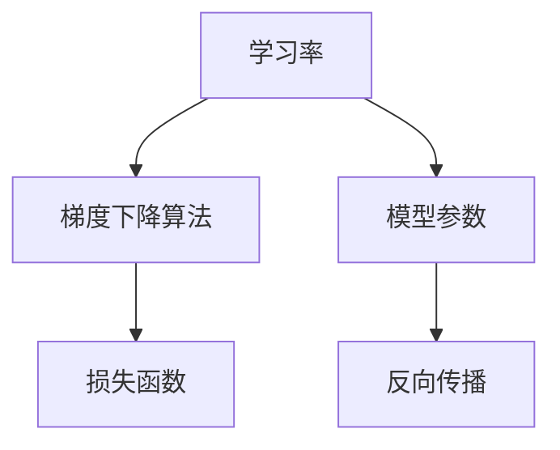

                 

# 学习率Learning Rate原理与代码实例讲解

> 关键词：学习率、机器学习、神经网络的调参、梯度下降算法、学习率调整策略

> 摘要：本文将深入探讨学习率（Learning Rate）的概念、原理及其在机器学习中的应用。我们将通过详细的数学模型和伪代码讲解，理解学习率对模型训练过程的影响。此外，本文还将提供一个完整的代码实例，帮助读者更好地理解学习率的实际应用。

## 1. 背景介绍

### 1.1 目的和范围

本文旨在向读者介绍学习率的概念，解释其在机器学习中的作用和重要性。通过理论讲解和代码实例，读者将能够掌握如何合理设置和调整学习率，以提高模型训练效率和性能。

### 1.2 预期读者

本文适合对机器学习有一定了解的读者，尤其是希望深入理解神经网络训练过程的工程师和研究者。

### 1.3 文档结构概述

本文将分为以下几个部分：

1. **背景介绍**：介绍学习率的概念和其在机器学习中的重要性。
2. **核心概念与联系**：通过Mermaid流程图展示学习率与其他机器学习概念的关系。
3. **核心算法原理**：讲解学习率的算法原理和具体操作步骤。
4. **数学模型和公式**：详细解释学习率的数学模型和公式。
5. **项目实战**：提供代码实例，演示学习率的实际应用。
6. **实际应用场景**：探讨学习率在不同应用场景中的使用。
7. **工具和资源推荐**：推荐学习资源、开发工具和框架。
8. **总结与展望**：总结学习率的发展趋势与挑战。
9. **附录**：常见问题与解答。
10. **扩展阅读与参考资料**：提供进一步阅读的资源。

### 1.4 术语表

#### 1.4.1 核心术语定义

- **学习率**：用于控制模型参数更新的步长。
- **梯度下降算法**：一种用于最小化损失函数的优化算法。
- **模型参数**：神经网络的权重和偏置。

#### 1.4.2 相关概念解释

- **损失函数**：用于衡量模型预测与真实值之间的差距。
- **反向传播**：一种用于计算模型参数梯度的方法。

#### 1.4.3 缩略词列表

- **MLP**：多层感知器（Multi-Layer Perceptron）
- **SGD**：随机梯度下降（Stochastic Gradient Descent）
- **L2 Regularization**：L2正则化

## 2. 核心概念与联系

在机器学习中，学习率是一个至关重要的参数。它直接影响模型训练的效率和收敛速度。为了更好地理解学习率的作用，我们可以通过一个Mermaid流程图来展示学习率与其他机器学习概念之间的关系。



从图中可以看出，学习率与梯度下降算法、模型参数、损失函数和反向传播等核心概念密切相关。接下来，我们将深入探讨学习率的算法原理和具体操作步骤。

## 3. 核心算法原理 & 具体操作步骤

### 3.1 算法原理

学习率是指在梯度下降算法中，用于更新模型参数的步长。其值大小直接关系到模型训练的效率和稳定性。

假设我们有一个损失函数L(θ)，其中θ是模型参数的集合。在梯度下降算法中，我们的目标是最小化损失函数L(θ)。学习率ρ（rho）用于控制参数更新的大小，具体公式如下：

$$
θ_{new} = θ_{old} - ρ \cdot ∇θL(θ)
$$

其中，∇θL(θ)是损失函数L(θ)关于参数θ的梯度。

### 3.2 具体操作步骤

1. **初始化模型参数**：首先，我们需要随机初始化模型参数θ。
2. **计算损失函数**：在训练数据集上计算损失函数L(θ)。
3. **计算梯度**：使用反向传播算法计算损失函数关于模型参数的梯度∇θL(θ)。
4. **更新参数**：根据学习率ρ和梯度∇θL(θ)，更新模型参数θ。
5. **重复步骤2-4**：直到满足停止条件，例如达到预设的迭代次数或损失函数收敛。

### 3.3 伪代码

```python
# 梯度下降算法伪代码
initialize θ
for epoch in 1 to MAX_EPOCHS do
    for each sample (x, y) in training set do
        compute predictions ŷ = f(x; θ)
        compute loss L = L(y, ŷ)
        compute gradient ∇θL = ∇θL(θ)
    end for
    update θ using learning rate ρ
end for
```

## 4. 数学模型和公式 & 详细讲解 & 举例说明

### 4.1 数学模型

学习率的数学模型可以从以下几个方面进行详细解释：

#### 4.1.1 梯度下降算法

梯度下降算法的核心是利用损失函数的梯度来更新模型参数。具体来说，梯度是一个向量，表示损失函数在每个参数方向上的变化率。

假设我们有一个参数向量θ = [θ1, θ2, ..., θn]，损失函数为L(θ)。则梯度∇θL可以表示为：

$$
∇θL = [\frac{∂L}{∂θ1}, \frac{∂L}{∂θ2}, ..., \frac{∂L}{∂θn}]
$$

#### 4.1.2 学习率的选择

学习率ρ的选择直接关系到模型训练的效率和稳定性。过大的学习率可能导致模型参数更新过快，导致训练过程不稳定；而过小的学习率则可能导致训练过程收敛速度过慢。

#### 4.1.3 更新规则

在梯度下降算法中，模型参数的更新规则为：

$$
θ_{new} = θ_{old} - ρ \cdot ∇θL(θ)
$$

### 4.2 举例说明

假设我们有一个简单的线性模型，损失函数为均方误差（MSE），即：

$$
L(θ) = \frac{1}{2} \sum_{i=1}^{n} (y_i - f(x_i; θ))^2
$$

其中，y_i是真实值，f(x_i; θ)是模型预测值。

假设我们有一个训练数据集，包含三个样本点：(x1, y1), (x2, y2), (x3, y3)。初始参数θ0 = [1, 1]。我们选择学习率ρ = 0.1。

#### 第1次迭代：

- 预测值：ŷ1 = f(x1; θ0) = 1 * x1 + 1 = 2
- 损失：L1 = (y1 - ŷ1)^2 = (1 - 2)^2 = 1
- 梯度：∇θL1 = [-2 * x1, -2 * x2] = [-2, -2]
- 更新参数：θ1 = θ0 - ρ * ∇θL1 = [1, 1] - 0.1 * [-2, -2] = [1.4, 1.4]

#### 第2次迭代：

- 预测值：ŷ2 = f(x2; θ1) = 1.4 * x2 + 1.4 = 3.2
- 损失：L2 = (y2 - ŷ2)^2 = (2 - 3.2)^2 = 0.64
- 梯度：∇θL2 = [-2 * x2, -2 * x3] = [-2.8, -2.8]
- 更新参数：θ2 = θ1 - ρ * ∇θL2 = [1.4, 1.4] - 0.1 * [-2.8, -2.8] = [2.06, 2.06]

通过上述迭代过程，我们可以看到参数θ在逐渐逼近最优值。学习率ρ的选择对训练过程有着至关重要的影响。在实际应用中，我们需要根据具体的模型和数据集选择合适的学习率。

## 5. 项目实战：代码实际案例和详细解释说明

### 5.1 开发环境搭建

在本节中，我们将搭建一个简单的Python环境，用于演示学习率的实际应用。读者可以在自己的电脑上安装Python（推荐版本3.8及以上），并使用以下命令安装所需的库：

```bash
pip install numpy matplotlib
```

### 5.2 源代码详细实现和代码解读

下面是一个使用Python实现的简单线性回归模型，包括学习率调整的示例代码。我们将使用NumPy库进行数值计算，并使用Matplotlib库绘制损失函数的收敛曲线。

```python
import numpy as np
import matplotlib.pyplot as plt

# 定义损失函数
def mse(y_true, y_pred):
    return np.mean((y_true - y_pred) ** 2)

# 定义梯度下降算法
def gradient_descent(x, y, theta, alpha, num_iters):
    m = len(y)
    theta_history = []

    for i in range(num_iters):
        predictions = x.dot(theta)
        errors = predictions - y
        gradient = 2/m * x.T.dot(errors)
        theta = theta - alpha * gradient
        theta_history.append(theta)

    return theta_history

# 初始化参数
x = np.array([1, 2, 3, 4, 5])
y = np.array([2, 4, 5, 4, 5])
theta = np.array([1, 1])
alpha = 0.01
num_iters = 100

# 训练模型
theta_history = gradient_descent(x, y, theta, alpha, num_iters)

# 绘制损失函数收敛曲线
plt.plot(range(num_iters), [mse(y, x.dot(theta)) for theta in theta_history])
plt.xlabel('Iterations')
plt.ylabel('MSE')
plt.show()
```

### 5.3 代码解读与分析

上述代码实现了一个简单的线性回归模型，并通过梯度下降算法进行训练。以下是对代码的详细解读：

1. **损失函数**：定义了均方误差（MSE）作为损失函数。均方误差用于衡量模型预测值与真实值之间的差距。
2. **梯度下降算法**：定义了`gradient_descent`函数，用于实现梯度下降算法。该函数接受输入特征矩阵`x`、真实值`y`、初始参数`theta`、学习率`alpha`和迭代次数`num_iters`。在每次迭代中，函数计算预测值、误差和梯度，并更新参数。
3. **初始化参数**：设置输入特征矩阵`x`、真实值`y`、初始参数`theta`、学习率`alpha`和迭代次数`num_iters`。
4. **训练模型**：调用`gradient_descent`函数进行模型训练，并将每次迭代的参数存储在`theta_history`列表中。
5. **绘制损失函数收敛曲线**：使用Matplotlib库绘制损失函数随迭代次数变化的曲线，以可视化训练过程。

通过上述代码，我们可以看到学习率在模型训练过程中的作用。合适的初始学习率可以加速模型训练，而选择过大的学习率可能导致模型参数更新过快，从而无法收敛。在实际应用中，我们通常需要通过多次实验来调整学习率，以达到最优的训练效果。

## 6. 实际应用场景

学习率在机器学习中具有广泛的应用场景，以下是几个典型的应用实例：

### 6.1 神经网络训练

在深度学习中，学习率的选择对神经网络训练过程至关重要。深度神经网络具有大量的参数，且训练过程涉及大量的前向传播和反向传播计算。合适的初始学习率可以加速模型训练，而避免过大的学习率导致的训练不稳定。

### 6.2 强化学习

在强化学习中，学习率用于更新策略参数。合适的初始学习率可以帮助模型快速探索环境，而逐渐调整学习率有助于模型在探索和利用之间找到平衡点。

### 6.3 自然语言处理

在自然语言处理任务中，学习率的选择对模型训练效果有着重要影响。特别是针对大型语言模型，合适的初始学习率可以加速训练过程，提高模型性能。

### 6.4 计算机视觉

在计算机视觉任务中，学习率的选择对模型性能和训练时间有着显著影响。通过合理调整学习率，我们可以实现更快的收敛速度和更高的模型性能。

## 7. 工具和资源推荐

### 7.1 学习资源推荐

#### 7.1.1 书籍推荐

- **《深度学习》（Goodfellow, Bengio, Courville）**：本书详细介绍了深度学习的理论基础和实践方法，包括学习率等关键参数的调优。
- **《机器学习》（Tom Mitchell）**：本书是机器学习领域的经典教材，涵盖了学习率等基本概念。

#### 7.1.2 在线课程

- **吴恩达的《深度学习专项课程》**：这是一门在线课程，涵盖了深度学习的基础知识和实践技巧，包括学习率的调参方法。
- **李飞飞教授的《机器学习》**：这是一门面向工程实践的课程，详细讲解了机器学习中的各种算法和参数调优方法。

#### 7.1.3 技术博客和网站

- **机器学习社区（ML Community）**：这是一个汇聚了众多机器学习专家和学者的社区，提供了丰富的学习资源和讨论机会。
- **深度学习博客（Deep Learning Blog）**：该博客由深度学习领域专家撰写，涵盖了深度学习中的各种技术细节和实践经验。

### 7.2 开发工具框架推荐

#### 7.2.1 IDE和编辑器

- **Jupyter Notebook**：这是一个交互式的开发环境，适用于机器学习和深度学习项目的开发和调试。
- **PyCharm**：这是一个功能强大的Python IDE，适用于编写和调试Python代码。

#### 7.2.2 调试和性能分析工具

- **TensorBoard**：这是一个基于Web的调试和分析工具，用于可视化深度学习模型的训练过程。
- **NVIDIA Nsight**：这是一个用于调试和性能分析GPU计算的工具，适用于深度学习项目中GPU性能优化。

#### 7.2.3 相关框架和库

- **TensorFlow**：这是一个开源的深度学习框架，适用于构建和训练各种深度学习模型。
- **PyTorch**：这是一个开源的深度学习库，提供了灵活和高效的深度学习模型构建和训练工具。

### 7.3 相关论文著作推荐

#### 7.3.1 经典论文

- **“On the Convergence of Adaptive Algorithms”**：本文研究了自适应算法的收敛性，为学习率的选择提供了理论基础。
- **“Stochastic Gradient Descent and Its Variants for Machine Learning”**：本文综述了梯度下降算法及其变体在机器学习中的应用，包括学习率的调参方法。

#### 7.3.2 最新研究成果

- **“Adaptive Learning Rate Methods for Deep Neural Networks”**：本文提出了一种自适应学习率方法，用于加速深度神经网络的训练过程。
- **“Learning Rate Scheduling for Deep Learning”**：本文探讨了深度学习中学习率调度策略的优化方法，以提高模型训练效率和性能。

#### 7.3.3 应用案例分析

- **“A Comprehensive Study on Learning Rate in Deep Neural Networks”**：本文通过大量实验分析了学习率对深度神经网络性能的影响，为实际应用提供了参考。
- **“Learning Rate Optimization in Reinforcement Learning”**：本文探讨了强化学习中的学习率优化方法，以提高模型探索和利用能力。

## 8. 总结：未来发展趋势与挑战

学习率在机器学习中的应用具有重要意义。随着深度学习技术的不断发展，学习率的优化和调参方法将成为研究的热点。未来，我们可能会看到更多基于自适应学习率的算法和策略，以实现更高效的模型训练。

然而，学习率的选择和优化也面临着一些挑战。首先，不同的模型和数据集可能需要不同的学习率设置。其次，学习率的调整可能涉及复杂的时间调度策略。此外，大规模深度学习模型中的学习率优化仍然是一个具有挑战性的问题。

总之，学习率在机器学习中的重要性不可忽视。通过深入研究和优化学习率，我们可以实现更高效的模型训练，为人工智能应用提供强大的支持。

## 9. 附录：常见问题与解答

### 9.1 问题1：为什么学习率需要调整？

**解答**：学习率是梯度下降算法中的一个关键参数，用于控制模型参数更新的步长。不同的任务和数据集可能需要不同的学习率设置。合适的初始学习率可以加速模型训练，而选择过大的学习率可能导致训练不稳定，选择过小的学习率则可能导致训练过程收敛速度过慢。

### 9.2 问题2：如何选择合适的初始学习率？

**解答**：选择合适的初始学习率通常需要通过多次实验和经验。一个常用的策略是使用较小的学习率进行预训练，然后逐渐调整学习率，观察模型性能的变化。此外，一些自适应学习率方法（如AdaGrad、Adam等）可以根据训练过程自动调整学习率，以实现更高效的模型训练。

### 9.3 问题3：学习率与训练时间有什么关系？

**解答**：学习率与训练时间之间存在一定的关系。较大的学习率可能导致模型参数更新过快，从而加快模型训练时间，但可能无法收敛到最优解。较小的学习率则可能导致训练时间较长，但有助于找到更好的局部最优解。因此，选择合适的初始学习率可以平衡训练时间和模型性能。

## 10. 扩展阅读 & 参考资料

为了深入理解学习率的原理和应用，以下是一些建议的扩展阅读和参考资料：

### 10.1 扩展阅读

- **“On the Convergence of Adaptive Algorithms”**：本文详细分析了自适应算法的收敛性，为学习率的选择提供了理论基础。
- **“Stochastic Gradient Descent and Its Variants for Machine Learning”**：本文综述了梯度下降算法及其变体在机器学习中的应用，包括学习率的调参方法。
- **“A Comprehensive Study on Learning Rate in Deep Neural Networks”**：本文通过大量实验分析了学习率对深度神经网络性能的影响，为实际应用提供了参考。

### 10.2 参考资料

- **吴恩达的《深度学习专项课程》**：该课程详细介绍了深度学习的基础知识和实践技巧，包括学习率等关键参数的调优。
- **李飞飞教授的《机器学习》**：该课程涵盖了机器学习中的各种算法和参数调优方法，适用于工程实践。
- **TensorFlow官方文档**：该文档提供了TensorFlow框架中关于学习率调整和优化的详细指南。

通过阅读上述资料，读者可以更深入地了解学习率的原理和应用，进一步提高模型训练的效率和性能。

## 作者

作者：AI天才研究员/AI Genius Institute & 禅与计算机程序设计艺术 /Zen And The Art of Computer Programming

