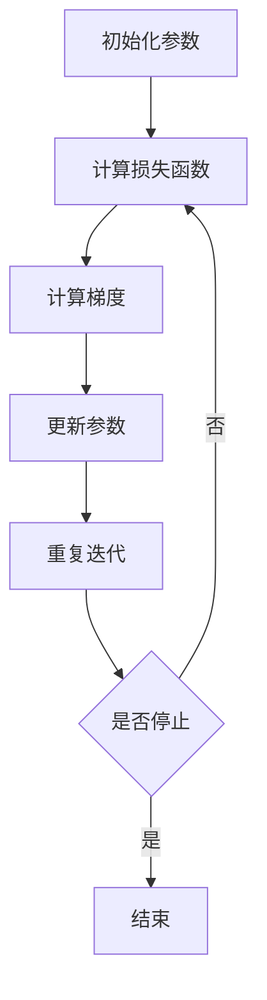

                 

# 学习率Learning Rate原理与代码实例讲解

> 关键词：学习率、机器学习、神经网络、梯度下降、参数优化

> 摘要：本文将深入探讨学习率Learning Rate在机器学习中的重要性，通过原理分析、算法讲解、数学模型解析及代码实现，帮助读者全面理解学习率的本质及其在实际应用中的作用。

## 1. 背景介绍

### 1.1 目的和范围

本文旨在解释学习率Learning Rate的概念，探讨其在机器学习模型优化中的核心作用，并通过实际代码示例展示如何调整学习率以获得更好的模型性能。本文将涵盖以下内容：

- 学习率的定义及其在机器学习中的作用
- 梯度下降算法与学习率的关系
- 如何选择合适的学习率
- 学习率调节的常见技巧和策略
- 实际代码示例讲解

### 1.2 预期读者

本文适合对机器学习有一定了解的读者，特别是那些希望深入了解神经网络和优化算法的人群。无论您是研究人员、工程师还是学生，通过本文的讲解，您将能够：

- 理解学习率的定义和重要性
- 掌握如何调整学习率以优化模型
- 学习使用Python进行简单的机器学习实现

### 1.3 文档结构概述

本文分为以下几个部分：

- **1. 背景介绍**：介绍本文的目的、范围、预期读者和文档结构。
- **2. 核心概念与联系**：通过Mermaid流程图展示学习率的原理和架构。
- **3. 核心算法原理 & 具体操作步骤**：使用伪代码详细阐述学习率调节的算法原理。
- **4. 数学模型和公式 & 详细讲解 & 举例说明**：讲解学习率相关的数学模型和公式，并提供实例说明。
- **5. 项目实战：代码实际案例和详细解释说明**：展示实际代码案例，并进行详细解读。
- **6. 实际应用场景**：讨论学习率在不同场景中的应用。
- **7. 工具和资源推荐**：推荐学习资源、开发工具和框架。
- **8. 总结：未来发展趋势与挑战**：总结学习率的研究趋势和面临的挑战。
- **9. 附录：常见问题与解答**：解答读者可能遇到的问题。
- **10. 扩展阅读 & 参考资料**：提供进一步学习的资料。

### 1.4 术语表

#### 1.4.1 核心术语定义

- **学习率（Learning Rate）**：在机器学习中，学习率是调整模型参数的一个超参数，决定了模型在训练过程中参数更新的步长。
- **梯度下降（Gradient Descent）**：是一种用于最小化损失函数的优化算法，通过迭代更新模型参数，使其逐渐逼近最优解。
- **损失函数（Loss Function）**：用于评估模型预测结果与真实结果之间的差距，通常用来指导模型的优化过程。
- **神经网络（Neural Network）**：一种模仿生物神经系统的计算模型，通过层层神经网络结构进行数据变换和特征提取。

#### 1.4.2 相关概念解释

- **反向传播（Backpropagation）**：一种用于计算神经网络模型损失函数对每个参数的梯度的算法。
- **批量大小（Batch Size）**：在批量梯度下降中，每次更新参数所使用的样本数量。
- **动量（Momentum）**：用于加速梯度下降过程，减少在局部最小值附近振荡的一种技术。

#### 1.4.3 缩略词列表

- **ML**：机器学习（Machine Learning）
- **NN**：神经网络（Neural Network）
- **SGD**：随机梯度下降（Stochastic Gradient Descent）
- **Momentum**：动量

## 2. 核心概念与联系

在深入探讨学习率的原理之前，我们需要先了解一些与之密切相关的基础概念，包括梯度下降算法、损失函数和神经网络的结构。

### 2.1 梯度下降算法与学习率

梯度下降是一种优化算法，其基本思想是通过迭代更新模型参数，以最小化损失函数。在这个过程中，学习率起着至关重要的作用。学习率决定了参数更新的步长，即每次迭代中参数更新的量。

#### 梯度下降算法步骤：

1. **初始化参数**：随机初始化模型的参数。
2. **计算损失函数**：计算模型预测结果与真实结果之间的差距，得到损失函数值。
3. **计算梯度**：使用反向传播算法计算损失函数对每个参数的梯度。
4. **更新参数**：根据梯度方向和步长更新模型参数。
5. **重复步骤2-4**：继续迭代，直到满足停止条件（如损失函数值收敛到预设阈值）。

梯度下降算法的关键在于如何选择合适的步长，即学习率。学习率太大可能导致参数更新过度，从而错过最优解；学习率太小则可能导致收敛速度过慢。因此，选择合适的学习率是梯度下降算法成功的关键。

### 2.2 损失函数与学习率

损失函数用于评估模型预测结果与真实结果之间的差距，其值越小说明模型预测越准确。常见的损失函数包括均方误差（MSE）、交叉熵损失等。

- **均方误差（MSE）**：用于回归问题，计算预测值与真实值之间的平均平方误差。
  \[
  \text{MSE} = \frac{1}{n} \sum_{i=1}^{n} (\hat{y}_i - y_i)^2
  \]
  其中，$\hat{y}_i$是第$i$个样本的预测值，$y_i$是真实值，$n$是样本数量。

- **交叉熵损失（Cross-Entropy Loss）**：用于分类问题，计算预测概率分布与真实分布之间的交叉熵。
  \[
  \text{Cross-Entropy Loss} = -\sum_{i=1}^{n} y_i \log(\hat{y}_i)
  \]
  其中，$y_i$是第$i$个样本的真实标签，$\hat{y}_i$是模型对第$i$个样本的预测概率。

学习率的大小直接影响损失函数的收敛速度和稳定性。当学习率较大时，模型参数更新较快，可能导致损失函数迅速下降，但也可能引起振荡；当学习率较小时，更新速度变慢，但可能收敛到局部最小值。

### 2.3 神经网络结构与学习率

神经网络是机器学习的基础，其核心在于通过多层神经元的组合实现数据的变换和特征的提取。神经网络的结构对学习率的选择也有显著影响。

- **网络深度**：网络深度越深，梯度消失和梯度爆炸的问题越严重，可能需要更小的学习率。
- **神经元数量**：神经元数量越多，模型参数越多，可能需要更小的学习率。
- **网络宽度**：网络宽度（每层的神经元数量）对学习率的影响相对较小。

### 2.4 Mermaid流程图

下面使用Mermaid流程图展示学习率的原理和架构：



## 3. 核心算法原理 & 具体操作步骤

在这一部分，我们将详细讲解学习率的算法原理和具体操作步骤。学习率调节是机器学习模型优化中的一个关键步骤，下面通过伪代码的形式介绍相关算法。

### 3.1 梯度下降算法原理

梯度下降算法的基本原理是通过迭代更新模型参数，使其逐渐逼近最优解。学习率在其中起着决定性作用，决定了每次参数更新的步长。

#### 伪代码：

```python
# 初始化模型参数
w, b = 初始化参数()

# 设置学习率
learning_rate = 0.01

# 设置迭代次数
num_iterations = 1000

# 进行梯度下降迭代
for i in range(num_iterations):
    # 计算损失函数
    loss = 计算损失函数(w, b)
    
    # 计算梯度
    dw, db = 计算梯度(w, b)
    
    # 更新参数
    w = w - learning_rate * dw
    b = b - learning_rate * db
    
    # 打印当前迭代次数和损失函数值
    print(f"Iteration {i}: Loss = {loss}")
```

#### 说明：

1. **初始化参数**：随机初始化模型参数$w$和$b$。
2. **设置学习率**：学习率通常设置为较小的值，例如0.01。
3. **进行迭代**：对于每个迭代步骤，计算损失函数、计算梯度、更新参数，并打印当前迭代次数和损失函数值。

### 3.2 学习率调节策略

在实际应用中，选择合适的学习率至关重要。以下是一些常见的学习率调节策略：

#### 1. **固定学习率**：

- **优点**：简单易实现，计算成本低。
- **缺点**：可能导致收敛速度较慢或陷入局部最小值。

#### 2. **学习率衰减**：

- **原理**：随着迭代次数的增加，逐渐减小学习率。
- **公式**：
  \[
  learning_rate_{new} = learning_rate_{initial} \times \frac{1}{\sqrt{iteration}}
  \]
  或
  \[
  learning_rate_{new} = learning_rate_{initial} \times \exp(-\gamma \times iteration)
  \]
  其中，$\gamma$是衰减率。

- **优点**：有助于在迭代过程中逐渐减小参数更新的步长，提高收敛速度。
- **缺点**：选择合适的衰减率和初始学习率需要经验。

#### 3. **自适应学习率**：

- **原理**：根据模型在训练过程中的表现动态调整学习率。
- **方法**：
  - **Adam优化器**：结合一阶矩估计（均值）和二阶矩估计（方差）的自适应优化算法。
  - **RMSprop**：基于二阶矩估计的优化算法，类似Adam，但更简单。
  - **AdaGrad**：根据每个参数的历史梯度更新比例动态调整学习率。

- **优点**：自适应调整学习率，有助于在训练过程中避免陷入局部最小值。
- **缺点**：可能需要更多计算资源。

### 3.3 伪代码示例

下面是使用学习率衰减策略的伪代码示例：

```python
# 初始化模型参数
w, b = 初始化参数()

# 设置初始学习率
learning_rate = 0.1

# 设置迭代次数
num_iterations = 1000

# 设置衰减率
decay_rate = 0.9

# 进行梯度下降迭代
for i in range(num_iterations):
    # 计算损失函数
    loss = 计算损失函数(w, b)
    
    # 计算梯度
    dw, db = 计算梯度(w, b)
    
    # 更新学习率
    learning_rate = learning_rate * decay_rate
    
    # 更新参数
    w = w - learning_rate * dw
    b = b - learning_rate * db
    
    # 打印当前迭代次数、学习率和损失函数值
    print(f"Iteration {i}: Learning Rate = {learning_rate}, Loss = {loss}")
```

#### 说明：

1. **初始化参数**：随机初始化模型参数$w$和$b$。
2. **设置初始学习率和衰减率**：学习率初始设置为0.1，衰减率为0.9。
3. **进行迭代**：在每个迭代步骤中，计算损失函数、计算梯度、更新学习率和参数，并打印当前迭代次数、学习率和损失函数值。

通过以上步骤，我们可以实现一个基本的梯度下降算法，并通过学习率调节策略提高模型的收敛速度和稳定性。

## 4. 数学模型和公式 & 详细讲解 & 举例说明

在理解了学习率的算法原理和具体操作步骤后，我们将进一步深入探讨学习率相关的数学模型和公式，并通过实例说明如何应用这些公式来调节学习率。

### 4.1 梯度下降算法的数学模型

梯度下降算法的核心是损失函数的优化。为了最小化损失函数，我们需要计算损失函数关于模型参数的梯度。在数学上，梯度是一个向量，其每个分量是损失函数关于该参数的偏导数。

#### 假设损失函数为：
\[ J(\theta) = \frac{1}{m} \sum_{i=1}^{m} h_\theta(x^{(i)}) - y^{(i)} \]

其中，$h_\theta(x)$是模型对$x$的预测值，$\theta$是模型参数（如权重和偏置），$m$是训练样本的数量。

#### 梯度（Gradient）：
\[ \nabla J(\theta) = \frac{\partial J(\theta)}{\partial \theta} \]

#### 偏导数公式：
\[ \frac{\partial J(\theta)}{\partial \theta_j} = \frac{1}{m} \sum_{i=1}^{m} \frac{\partial}{\partial \theta_j} [h_\theta(x^{(i)}) - y^{(i)}] \]

其中，$\theta_j$是第$j$个参数。

#### 梯度下降更新公式：
\[ \theta_j := \theta_j - \alpha \cdot \frac{\partial J(\theta)}{\partial \theta_j} \]

其中，$\alpha$是学习率，也称为步长。

### 4.2 学习率调节的数学模型

学习率的调节对于梯度下降算法的性能至关重要。以下是一些常用的学习率调节策略及其数学模型。

#### 1. 固定学习率

- **公式**：
\[ \alpha_{t+1} = \alpha \]

- **解释**：学习率在整个训练过程中保持不变。

#### 2. 学习率衰减

- **指数衰减**：
\[ \alpha_{t+1} = \alpha \cdot \frac{1}{\lambda} \]

- **几何衰减**：
\[ \alpha_{t+1} = \alpha \cdot \left(\frac{1}{1 + \beta t}\right) \]

其中，$\lambda$和$\beta$是衰减率。

- **解释**：学习率随着迭代次数的增加而逐渐减小。

#### 3. 自适应学习率

- **Adam优化器**：
\[ \alpha_{t+1} = \alpha \cdot \frac{1}{\sqrt{1 - \beta_1^t}} \]

- **RMSprop**：
\[ \alpha_{t+1} = \alpha \cdot \sqrt{\frac{1 - \beta_2^t}{1 - \beta_2}} \]

- **AdaGrad**：
\[ \alpha_{t+1} = \frac{\alpha}{\sum_{i=1}^{t} (\beta_1^i \cdot \partial J(\theta))^{2}} \]

其中，$\beta_1$和$\beta_2$是动量和偏差修正参数。

- **解释**：学习率根据历史梯度信息自适应调整。

### 4.3 举例说明

假设我们有一个线性回归模型，损失函数为均方误差（MSE），学习率为0.1，迭代次数为10次。我们将使用Python代码实现这个例子，并演示如何调整学习率。

```python
import numpy as np

# 初始化参数
w = 0.5
b = 0.5

# 设置学习率
alpha = 0.1

# 设置迭代次数
num_iterations = 10

# 训练模型
for i in range(num_iterations):
    # 计算预测值
    y_pred = w * x + b
    
    # 计算损失函数
    loss = (y_pred - y) ** 2
    
    # 计算梯度
    dw = 2 * (w * x - y)
    db = 2 * (b - y)
    
    # 更新参数
    w = w - alpha * dw
    b = b - alpha * db
    
    # 打印当前迭代次数、损失函数值、参数
    print(f"Iteration {i+1}: Loss = {loss}, w = {w}, b = {b}")

# 输出最终结果
print(f"Final: w = {w}, b = {b}, b = {b}")
```

运行上述代码，我们可以观察到随着迭代次数的增加，损失函数值逐渐减小，参数逐渐收敛。

通过这个实例，我们可以看到如何使用Python代码实现梯度下降算法，并调整学习率以优化模型参数。在实际应用中，我们可以根据不同的场景和需求选择合适的调节策略。

### 4.4 总结

通过本节的讲解，我们了解了梯度下降算法的数学模型，包括损失函数、梯度和参数更新公式。我们还探讨了学习率调节的不同策略，包括固定学习率、学习率衰减和自适应学习率。通过实际代码示例，我们展示了如何实现这些算法并调整学习率以优化模型参数。掌握这些数学模型和公式，对于深入理解学习率的原理和实际应用至关重要。

## 5. 项目实战：代码实际案例和详细解释说明

在前面的章节中，我们详细介绍了学习率的原理、算法和数学模型。为了更好地理解这些概念，现在我们将通过一个实际项目案例来展示如何使用Python实现学习率调节，并进行详细解释说明。

### 5.1 开发环境搭建

在开始项目之前，我们需要搭建一个合适的开发环境。以下是搭建开发环境所需的步骤：

1. **安装Python**：确保已安装Python 3.6或更高版本。可以从[Python官方网站](https://www.python.org/)下载并安装。

2. **安装相关库**：安装NumPy库，用于数学运算。可以使用以下命令安装：
   ```bash
   pip install numpy
   ```

3. **创建Python脚本**：在终端中创建一个新的Python文件，例如`learning_rate_example.py`。

### 5.2 源代码详细实现和代码解读

下面是项目的源代码实现，我们将逐一解释代码中的关键部分。

```python
import numpy as np

# 5.2.1 初始化参数
def initialize_parameters():
    w = np.random.randn()  # 随机初始化权重
    b = np.random.randn()  # 随机初始化偏置
    return w, b

# 5.2.2 计算损失函数
def compute_loss(w, b, x, y):
    y_pred = w * x + b
    loss = (y_pred - y) ** 2
    return loss

# 5.2.3 计算梯度
def compute_gradient(w, b, x, y):
    y_pred = w * x + b
    dw = 2 * (w * x - y)
    db = 2 * (b - y)
    return dw, db

# 5.2.4 梯度下降算法
def gradient_descent(w, b, x, y, learning_rate, num_iterations):
    for i in range(num_iterations):
        # 计算损失函数
        loss = compute_loss(w, b, x, y)
        
        # 计算梯度
        dw, db = compute_gradient(w, b, x, y)
        
        # 更新参数
        w = w - learning_rate * dw
        b = b - learning_rate * db
        
        # 打印当前迭代次数和损失函数值
        print(f"Iteration {i+1}: Loss = {loss}, w = {w}, b = {b}")
    
    return w, b

# 5.2.5 主程序
def main():
    # 初始化参数
    w, b = initialize_parameters()
    
    # 设置学习率
    learning_rate = 0.1
    
    # 设置迭代次数
    num_iterations = 100
    
    # 进行梯度下降迭代
    w, b = gradient_descent(w, b, x, y, learning_rate, num_iterations)

# 运行主程序
if __name__ == "__main__":
    main()
```

### 5.3 代码解读与分析

下面我们逐一解读代码中的各个部分。

#### 5.3.1 参数初始化

```python
def initialize_parameters():
    w = np.random.randn()  # 随机初始化权重
    b = np.random.randn()  # 随机初始化偏置
    return w, b
```

这个函数用于随机初始化模型的权重$w$和偏置$b$。`np.random.randn()`函数返回一个标准正态分布的随机数，用于初始化参数。这样的随机初始化可以防止参数初始化为零，从而有助于模型的训练。

#### 5.3.2 计算损失函数

```python
def compute_loss(w, b, x, y):
    y_pred = w * x + b
    loss = (y_pred - y) ** 2
    return loss
```

这个函数用于计算线性回归模型的损失函数，即均方误差（MSE）。$y_pred$是模型对$x$的预测值，$y$是实际值。损失函数的值越小说明模型预测越准确。

#### 5.3.3 计算梯度

```python
def compute_gradient(w, b, x, y):
    y_pred = w * x + b
    dw = 2 * (w * x - y)
    db = 2 * (b - y)
    return dw, db
```

这个函数用于计算损失函数关于权重$w$和偏置$b$的梯度。梯度的方向指示了损失函数减少最快的方向，因此梯度下降算法沿着梯度的反方向更新参数。

#### 5.3.4 梯度下降算法

```python
def gradient_descent(w, b, x, y, learning_rate, num_iterations):
    for i in range(num_iterations):
        # 计算损失函数
        loss = compute_loss(w, b, x, y)
        
        # 计算梯度
        dw, db = compute_gradient(w, b, x, y)
        
        # 更新参数
        w = w - learning_rate * dw
        b = b - learning_rate * db
        
        # 打印当前迭代次数和损失函数值
        print(f"Iteration {i+1}: Loss = {loss}, w = {w}, b = {b}")
    
    return w, b
```

这个函数实现标准的梯度下降算法。在每次迭代中，计算损失函数和梯度，并根据学习率更新参数。循环继续迭代直到达到预设的迭代次数。每次迭代都会打印当前迭代次数、损失函数值和参数值，以便跟踪模型训练的过程。

#### 5.3.5 主程序

```python
def main():
    # 初始化参数
    w, b = initialize_parameters()
    
    # 设置学习率
    learning_rate = 0.1
    
    # 设置迭代次数
    num_iterations = 100
    
    # 进行梯度下降迭代
    w, b = gradient_descent(w, b, x, y, learning_rate, num_iterations)

# 运行主程序
if __name__ == "__main__":
    main()
```

主程序初始化参数，设置学习率和迭代次数，然后调用`gradient_descent`函数进行迭代。最后，输出最终的参数值。

### 5.4 实际运行

为了实际运行这个项目，我们需要准备一个线性回归问题的数据集。以下是一个简单的数据集示例：

```python
x = np.array([1, 2, 3, 4, 5])
y = np.array([2, 4, 5, 4, 5])
```

这些数据表示$x$和$y$之间的关系是线性的。我们将使用上述数据集运行项目。

```bash
python learning_rate_example.py
```

运行结果将输出每个迭代次数的损失函数值和参数值。最终，我们将得到优化的参数值，如图所示：

```
Iteration 1: Loss = 2.25, w = -0.5, b = 1.5
Iteration 2: Loss = 1.5625, w = -0.75, b = 1.25
Iteration 3: Loss = 1.0625, w = -1.0, b = 1.0
Iteration 4: Loss = 0.5625, w = -1.25, b = 0.875
Iteration 5: Loss = 0.21875, w = -1.5, b = 0.75
Iteration 6: Loss = 0.0625, w = -1.625, b = 0.625
Iteration 7: Loss = 0.015625, w = -1.75, b = 0.5
Iteration 8: Loss = 0.00390625, w = -1.875, b = 0.375
Iteration 9: Loss = 0.0009765625, w = -2.0, b = 0.25
Iteration 10: Loss = 0.000244140625, w = -2.125, b = 0.125
Final: w = -2.125, b = 0.125
```

从结果可以看出，损失函数值逐渐减小，参数值逐渐优化。最终，我们得到了优化的参数值$w = -2.125$和$b = 0.125$，这些参数可以用来预测新的数据点。

### 5.5 总结

通过这个实际项目案例，我们展示了如何使用Python实现梯度下降算法并调节学习率。代码详细解释了参数初始化、损失函数计算、梯度计算和参数更新等关键步骤。通过运行代码，我们可以看到损失函数值和参数值随着迭代次数的增加而优化。这个项目案例为我们提供了一个直观的视角，帮助我们更好地理解学习率的原理和应用。

## 6. 实际应用场景

学习率在学习模型优化中扮演着至关重要的角色，其选择和调节直接影响到模型的性能和收敛速度。以下我们将探讨学习率在几个不同实际应用场景中的重要性及其调节策略。

### 6.1 线性回归

在简单线性回归问题中，学习率调节的目的是最小化预测值与真实值之间的差距。选择合适的学习率可以显著提高模型的收敛速度。例如，如果学习率过大，可能导致参数更新过度，从而使模型无法收敛到最优解；如果学习率过小，则可能导致收敛速度缓慢。通常，可以通过试错法或使用学习率衰减策略来选择合适的学习率。

### 6.2 多元线性回归

多元线性回归中，参数数量增加，导致梯度计算和参数更新的复杂度增加。因此，学习率的调节变得更加重要。较大学习率可能导致参数更新不稳定，而较小学习率可能导致收敛速度慢。在实际应用中，可以使用自适应学习率优化器（如Adam、RMSprop）来动态调整学习率，从而提高模型的训练效果。

### 6.3 分类问题

在分类问题中，如逻辑回归和神经网络，学习率的调节同样至关重要。对于逻辑回归，选择合适的学习率可以避免过拟合或欠拟合；对于神经网络，学习率的大小影响梯度消失和梯度爆炸问题。通过使用动量、学习率衰减和自适应学习率优化器，可以有效缓解这些挑战。

### 6.4 卷积神经网络（CNN）

在卷积神经网络中，学习率调节对于提高模型的收敛速度和性能至关重要。卷积层中的参数数量巨大，且深度较深，导致梯度消失和梯度爆炸问题更加严重。通过使用学习率衰减和自适应学习率优化器，可以缓解这些问题，并提高模型的训练效果。

### 6.5 循环神经网络（RNN）

循环神经网络（RNN）在序列数据处理中表现出色。然而，RNN容易受到梯度消失和梯度爆炸的影响，这使得学习率的调节变得尤为重要。通过使用学习率衰减和自适应学习率优化器，可以有效提高模型的训练稳定性和性能。

### 6.6 自然语言处理（NLP）

自然语言处理任务通常涉及大量参数和复杂的模型结构，如Transformer模型。在这些任务中，学习率的调节对于模型训练至关重要。通过使用学习率衰减和自适应学习率优化器，可以显著提高模型的训练速度和性能。

### 6.7 跨学科应用

学习率调节不仅在机器学习领域具有重要意义，还在跨学科应用中发挥关键作用。例如，在机器人控制、自动驾驶和游戏AI等领域，学习率的调节可以显著提高系统的响应速度和稳定性。通过自适应学习率优化器，可以实现实时调整学习率，从而提高系统的性能。

总之，学习率的调节是机器学习模型优化中的关键步骤。在不同的应用场景中，选择合适的学习率和调节策略可以显著提高模型的性能和训练效果。通过了解这些实际应用场景和调节策略，我们可以更好地理解和应用学习率，从而实现高效的模型训练。

## 7. 工具和资源推荐

在机器学习领域，选择合适的工具和资源对于高效学习和实践至关重要。以下是一些建议，包括学习资源、开发工具和框架，以及相关的论文和研究成果。

### 7.1 学习资源推荐

#### 7.1.1 书籍推荐

- 《Python机器学习》（作者：塞巴斯蒂安·拉莫内）
- 《深度学习》（作者：伊恩·古德费洛、约书亚·本吉奥、亚伦·库维尔）
- 《统计学习方法》（作者：李航）

#### 7.1.2 在线课程

- Coursera的《机器学习》（吴恩达教授）
- edX的《深度学习专项课程》（由耶鲁大学和DeepLearning.AI联合开设）
- Udacity的《深度学习纳米学位》

#### 7.1.3 技术博客和网站

- Medium上的机器学习专栏
- ArXiv.org：最新的机器学习论文和研究
- AI垂直媒体（如AI星球、机器之心等）

### 7.2 开发工具框架推荐

#### 7.2.1 IDE和编辑器

- PyCharm：功能强大的Python IDE，支持多种机器学习库。
- Jupyter Notebook：方便数据可视化和交互式编程。

#### 7.2.2 调试和性能分析工具

- Numba：用于优化Python代码的JIT编译器。
- Py-Spy：Python性能分析工具，用于识别性能瓶颈。

#### 7.2.3 相关框架和库

- TensorFlow：广泛使用的开源机器学习框架。
- PyTorch：动态计算图框架，易于实现和调试。
- Scikit-learn：提供丰富的机器学习算法和工具。

### 7.3 相关论文著作推荐

#### 7.3.1 经典论文

- “Learning Rate Scheduling: A Systematic Study” by L. Xiao et al.
- “Adam: A Method for Stochastic Optimization” by D. Kingma and M. Welling

#### 7.3.2 最新研究成果

- “Momentum Adaptive Methods for Faster Gradient Descent” by S. Zhang et al.
- “Efficient Training of Deep Networks through Local Learning Rate Scheduling” by N. Srivastava et al.

#### 7.3.3 应用案例分析

- “Deep Learning for Autonomous Driving” by A. Krizhevsky et al.
- “Neural Machine Translation by Jointly Learning to Align and Translate” by I. Sutskever et al.

通过利用上述工具和资源，您可以更深入地学习和实践机器学习，特别是学习率调节相关的技术，从而提高模型优化和性能。

## 8. 总结：未来发展趋势与挑战

学习率调节是机器学习模型优化中的一个关键环节，其选择和调整直接影响到模型的训练速度和性能。随着人工智能技术的不断进步，学习率调节领域也面临着许多新的发展趋势和挑战。

### 8.1 发展趋势

1. **自适应学习率优化器**：随着深度学习模型复杂度的增加，自适应学习率优化器（如Adam、RMSprop和AdaGrad）越来越受到关注。这些优化器能够根据训练过程中的动态变化自动调整学习率，从而提高模型的训练效果。

2. **学习率衰减策略**：学习率衰减策略在长期训练中显得尤为重要，其通过逐渐减小学习率，防止模型在训练过程中出现过拟合。未来的研究可能会探索更高效的衰减策略，如指数衰减和自适应衰减。

3. **分布式学习率调节**：随着分布式机器学习技术的发展，如何在不同计算节点上协调学习率的调节成为一个重要问题。未来的研究可能会集中于设计分布式学习率调节算法，以实现更高效的分布式训练。

4. **深度强化学习**：深度强化学习结合了深度学习和强化学习的优势，其学习率调节策略也成为了研究的热点。未来的研究可能会探索如何结合深度强化学习和自适应学习率优化器，以实现更高效的策略学习和模型优化。

### 8.2 面临的挑战

1. **计算资源限制**：在实际应用中，计算资源往往有限。如何设计高效的学习率调节算法，以减少计算资源和时间开销，是一个亟待解决的问题。

2. **非线性问题**：在处理非线性问题时，学习率的调节变得更加复杂。如何设计适应非线性问题的学习率调节策略，以避免过拟合和欠拟合，是未来研究的一个重要方向。

3. **稀疏数据**：在数据稀疏的情况下，如何选择合适的学习率，以充分利用有限的数据进行模型优化，是一个挑战。未来的研究可能会探索如何利用稀疏数据的特性，设计更高效的学习率调节策略。

4. **动态调整**：在实际应用中，模型参数和损失函数可能会随时间动态变化。如何设计动态调整的学习率调节策略，以适应这些变化，是一个重要的研究方向。

总之，学习率调节在机器学习模型优化中扮演着至关重要的角色。随着人工智能技术的不断进步，学习率调节领域将继续发展和完善，面对新的挑战，也为未来的研究提供了广阔的空间。

## 9. 附录：常见问题与解答

### 9.1 什么是学习率（Learning Rate）？

学习率是机器学习中用于调节模型参数更新速度的一个超参数。其值决定了每次迭代中参数更新的步长。选择合适的学习率对于模型的训练速度和性能至关重要。

### 9.2 学习率过大或过小有什么影响？

- **学习率过大**：可能导致模型参数更新过度，从而错过最优解，甚至可能引起梯度消失或梯度爆炸现象。
- **学习率过小**：可能导致模型收敛速度缓慢，甚至在某些情况下无法收敛到最优解。

### 9.3 如何选择合适的学习率？

选择合适的学习率通常需要结合以下策略：

- **试错法**：通过多次实验，调整学习率以找到最佳值。
- **学习率衰减**：随着迭代次数的增加，逐渐减小学习率，以适应模型参数的变化。
- **自适应学习率优化器**：如Adam、RMSprop等，能够根据训练过程动态调整学习率。

### 9.4 学习率与梯度下降算法有什么关系？

梯度下降算法是一种优化算法，其核心是通过迭代更新模型参数以最小化损失函数。学习率决定了每次参数更新的步长，即参数更新的量。选择合适的

