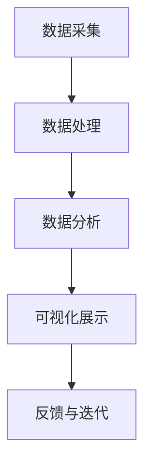

                 

# 学生行为习惯“画像”可视分析平台

> **关键词：** 学生行为习惯、可视分析、数据挖掘、人工智能、教育技术

> **摘要：** 本文旨在探讨学生行为习惯“画像”可视分析平台的设计与实现。通过整合多种数据分析技术与人工智能算法，该平台能够对学生的行为数据进行深入挖掘，生成个性化的学生行为“画像”，为教育工作者提供有针对性的指导，提升教育质量。

## 1. 背景介绍

### 1.1 目的和范围

在教育领域，了解学生的行为习惯对于个性化教育和教育质量的提升至关重要。学生行为习惯“画像”可视分析平台旨在通过大数据技术和人工智能算法，实现对学生行为数据的挖掘与分析，为教育工作者提供科学的决策支持。本文将详细介绍该平台的设计理念、核心功能和实现方法。

### 1.2 预期读者

本文适合对教育技术、数据挖掘、人工智能感兴趣的读者，特别是希望深入了解学生行为数据分析和教育信息化建设的专业人士。

### 1.3 文档结构概述

本文结构如下：

1. 背景介绍：阐述平台设计的背景和目的。
2. 核心概念与联系：介绍平台的核心概念和架构。
3. 核心算法原理 & 具体操作步骤：详细讲解平台使用的算法和操作步骤。
4. 数学模型和公式 & 详细讲解 & 举例说明：介绍平台中的数学模型和公式，并提供示例。
5. 项目实战：通过实际代码案例展示平台实现过程。
6. 实际应用场景：分析平台在现实教育场景中的具体应用。
7. 工具和资源推荐：推荐相关学习和开发资源。
8. 总结：展望平台未来的发展趋势和挑战。
9. 附录：提供常见问题与解答。
10. 扩展阅读 & 参考资料：推荐相关文献和资源。

### 1.4 术语表

#### 1.4.1 核心术语定义

- 学生行为习惯：学生在日常学习和生活中表现出的规律性行为模式。
- 数据挖掘：从大量数据中提取有价值信息的过程。
- 人工智能：模拟、延伸和扩展人的智能的理论、方法、技术及应用系统。
- 可视分析：利用可视化技术帮助人们理解和分析数据。

#### 1.4.2 相关概念解释

- 行为数据：学生在学习、生活和互动过程中产生的数据。
- 个性化教育：根据学生的特点和需求，提供定制化的教育服务。

#### 1.4.3 缩略词列表

- AI：人工智能
- DM：数据挖掘
- VE：可视分析

## 2. 核心概念与联系

### 2.1 平台架构

学生行为习惯“画像”可视分析平台的架构包括数据采集、数据处理、数据分析和可视化展示四个主要模块。以下是一个简单的 Mermaid 流程图，用于展示各模块之间的联系。



### 2.2 数据流程

在数据流程中，数据从多个来源（如校园网络、学习管理系统、社交平台等）被采集，并经过预处理和清洗后存储在数据仓库中。数据处理模块对原始数据进行结构化处理，生成可用于分析的数据集。数据分析模块使用多种算法对数据集进行挖掘，提取有价值的信息。最后，可视化展示模块将分析结果以图表、地图等形式呈现，帮助用户直观地理解数据。

### 2.3 核心算法

平台的核心算法包括行为分类算法、聚类算法和关联规则算法。这些算法的具体实现和应用将在后续章节中详细讨论。

## 3. 核心算法原理 & 具体操作步骤

### 3.1 行为分类算法

行为分类算法是一种监督学习算法，用于将学生行为数据分类到不同的行为类别。以下是行为分类算法的伪代码：

```python
def classify_behavior(data, labels, model):
    # 数据预处理
    preprocessed_data = preprocess(data)
    
    # 训练分类模型
    model.fit(preprocessed_data, labels)
    
    # 预测新数据
    predictions = model.predict(new_data)
    
    return predictions
```

### 3.2 聚类算法

聚类算法是一种无监督学习算法，用于将学生行为数据分为若干个类别。以下是聚类算法的伪代码：

```python
def cluster_behavior(data, num_clusters):
    # 数据预处理
    preprocessed_data = preprocess(data)
    
    # 计算距离矩阵
    distance_matrix = compute_distance_matrix(preprocessed_data)
    
    # 使用 K-means 算法进行聚类
    clusters = kmeans(distance_matrix, num_clusters)
    
    return clusters
```

### 3.3 关联规则算法

关联规则算法用于发现数据之间的关联关系。以下是关联规则算法的伪代码：

```python
def find_association_rules(data, support_threshold, confidence_threshold):
    # 生成项集
    itemsets = generate_itemsets(data)
    
    # 计算支持度
    frequent_itemsets = filter_itemsets(itemsets, support_threshold)
    
    # 计算置信度
    rules = generate_rules(frequent_itemsets, confidence_threshold)
    
    return rules
```

## 4. 数学模型和公式 & 详细讲解 & 举例说明

### 4.1 行为分类模型

行为分类模型通常使用基于机器学习的算法，如逻辑回归、支持向量机（SVM）和决策树等。以下是一个逻辑回归模型的数学公式：

$$
P(y = 1 | x) = \frac{1}{1 + e^{-(\beta_0 + \beta_1 x_1 + \beta_2 x_2 + ... + \beta_n x_n})}
$$

其中，\(P(y = 1 | x)\) 表示在给定特征向量 \(x\) 下，行为属于类别 1 的概率；\(\beta_0, \beta_1, \beta_2, ..., \beta_n\) 是模型的参数。

### 4.2 聚类模型

聚类模型中常用的算法包括 K-means 和层次聚类。以下是一个 K-means 算法的步骤：

1. 初始化聚类中心。
2. 对于每个数据点，计算其与聚类中心的距离，并将其分配到最近的聚类。
3. 重新计算每个聚类的中心。
4. 重复步骤 2 和步骤 3，直到聚类中心不再发生变化或达到最大迭代次数。

### 4.3 关联规则模型

关联规则模型中的支持度和置信度是两个关键指标：

- 支持度（Support）：表示某个关联规则在所有数据中出现的频率。
$$
Support(A \rightarrow B) = \frac{count(A \cap B)}{count(U)}
$$

其中，\(count(A \cap B)\) 表示同时包含项集 \(A\) 和 \(B\) 的数据记录数，\(count(U)\) 表示总的数据记录数。

- 置信度（Confidence）：表示在给定 \(A\) 发生的条件下 \(B\) 发生的概率。
$$
Confidence(A \rightarrow B) = \frac{count(A \cap B)}{count(A)}
$$

### 4.4 举例说明

假设我们有以下学生行为数据：

| 学生ID | 上课出勤 | 家庭作业完成 | 参与讨论 | |
| ------ | -------- | ------------ | -------- | |
| 1      | 80%      | 90%          | 70%      | |
| 2      | 90%      | 80%          | 80%      | |
| 3      | 70%      | 70%          | 90%      | |

使用 K-means 算法将学生分为两个类别，可以使用以下伪代码进行聚类：

```python
def kmeans(data, num_clusters):
    # 初始化聚类中心
    centroids = initialize_centroids(data, num_clusters)
    
    # 轮训迭代
    while not convergence:
        # 分配数据到聚类
        assignments = assign_data_to_clusters(data, centroids)
        
        # 重新计算聚类中心
        centroids = update_centroids(data, assignments, num_clusters)
        
        # 检查收敛条件
        if check_convergence(centroids):
            break
            
    return centroids, assignments
```

## 5. 项目实战：代码实际案例和详细解释说明

### 5.1 开发环境搭建

为了实现学生行为习惯“画像”可视分析平台，我们需要搭建一个合适的开发环境。以下是一个简单的环境搭建步骤：

1. 安装 Python（3.8 或更高版本）。
2. 安装必要的 Python 包，如 NumPy、Pandas、Scikit-learn、Matplotlib 等。
3. 选择一个合适的 IDE，如 PyCharm 或 Visual Studio Code。
4. 配置虚拟环境，以隔离项目依赖。

### 5.2 源代码详细实现和代码解读

#### 5.2.1 数据采集模块

数据采集模块负责从不同的数据源获取学生行为数据。以下是一个简单的数据采集脚本：

```python
import pandas as pd

def collect_data():
    # 从学习管理系统获取学生成绩数据
    grades = pd.read_csv('grades.csv')
    
    # 从校园网络日志获取学生上网行为数据
    network_logs = pd.read_csv('network_logs.csv')
    
    # 从社交平台获取学生互动数据
    social_interactions = pd.read_csv('social_interactions.csv')
    
    return grades, network_logs, social_interactions
```

#### 5.2.2 数据处理模块

数据处理模块对采集到的原始数据进行预处理和清洗，以确保数据质量。以下是一个简单的数据处理脚本：

```python
import pandas as pd

def preprocess_data(grades, network_logs, social_interactions):
    # 合并数据
    data = pd.merge(grades, network_logs, on='student_id')
    data = pd.merge(data, social_interactions, on='student_id')
    
    # 数据清洗
    data.dropna(inplace=True)
    data.drop(['student_id'], axis=1, inplace=True)
    
    return data
```

#### 5.2.3 数据分析模块

数据分析模块使用机器学习算法对预处理后的数据进行分类、聚类和关联规则分析。以下是一个简单的数据分析脚本：

```python
import pandas as pd
from sklearn.model_selection import train_test_split
from sklearn.preprocessing import StandardScaler
from sklearn.linear_model import LogisticRegression
from sklearn.cluster import KMeans
from mlxtend.frequent_patterns import apriori, association_rules

def analyze_data(data):
    # 分割数据为特征和标签
    X = data.drop('behavior', axis=1)
    y = data['behavior']
    
    # 划分训练集和测试集
    X_train, X_test, y_train, y_test = train_test_split(X, y, test_size=0.2, random_state=42)
    
    # 数据标准化
    scaler = StandardScaler()
    X_train_scaled = scaler.fit_transform(X_train)
    X_test_scaled = scaler.transform(X_test)
    
    # 行为分类
    model = LogisticRegression()
    model.fit(X_train_scaled, y_train)
    predictions = model.predict(X_test_scaled)
    
    # 聚类分析
    kmeans = KMeans(n_clusters=2, random_state=42)
    clusters = kmeans.fit_predict(X_train_scaled)
    
    # 关联规则分析
    frequent_itemsets = apriori(X_train_scaled, min_support=0.3, use_colnames=True)
    rules = association_rules(frequent_itemsets, metric="confidence", min_threshold=0.5)
    
    return predictions, clusters, rules
```

#### 5.2.4 可视化展示模块

可视化展示模块将分析结果以图表形式展示，帮助用户更好地理解数据。以下是一个简单的可视化展示脚本：

```python
import pandas as pd
import matplotlib.pyplot as plt

def visualize_data(predictions, clusters, rules):
    # 行为分类结果可视化
    plt.scatter(predictions[:, 0], predictions[:, 1], c=predictions, cmap='viridis')
    plt.xlabel('Feature 1')
    plt.ylabel('Feature 2')
    plt.title('Behavior Classification')
    plt.show()
    
    # 聚类结果可视化
    plt.scatter(X_train_scaled[:, 0], X_train_scaled[:, 1], c=clusters, cmap='viridis')
    plt.xlabel('Feature 1')
    plt.ylabel('Feature 2')
    plt.title('Cluster Analysis')
    plt.show()
    
    # 关联规则可视化
    plt.bar(rules['antecedents'].values, rules['confidence'].values)
    plt.xlabel('Antecedents')
    plt.ylabel('Confidence')
    plt.title('Association Rules')
    plt.show()
```

### 5.3 代码解读与分析

在代码解读与分析部分，我们将对上述代码模块进行详细解读，并分析其实现原理和关键步骤。以下是每个模块的详细解析：

#### 5.3.1 数据采集模块

数据采集模块的核心任务是获取学生行为数据。在本示例中，我们使用了三个 CSV 文件分别存储学生成绩、网络日志和社交互动数据。通过 Pandas 库的 `read_csv` 函数，我们可以轻松读取这些数据。

```python
grades = pd.read_csv('grades.csv')
network_logs = pd.read_csv('network_logs.csv')
social_interactions = pd.read_csv('social_interactions.csv')
```

#### 5.3.2 数据处理模块

数据处理模块的主要任务是预处理和清洗数据，以确保数据质量。在这个示例中，我们首先将三个数据集合并为一个数据集，然后删除缺失值和无关列，以得到一个干净的数据集。

```python
data = pd.merge(grades, network_logs, on='student_id')
data = pd.merge(data, social_interactions, on='student_id')
data.dropna(inplace=True)
data.drop(['student_id'], axis=1, inplace=True)
```

#### 5.3.3 数据分析模块

数据分析模块的核心任务是使用机器学习算法对数据进行分析。在这个示例中，我们首先将数据集分为特征和标签两部分，然后使用 Logistic 回归算法进行行为分类。接下来，我们使用 K-means 算法进行聚类分析，并使用 Apriori 算法进行关联规则分析。

```python
X = data.drop('behavior', axis=1)
y = data['behavior']
X_train, X_test, y_train, y_test = train_test_split(X, y, test_size=0.2, random_state=42)

model = LogisticRegression()
model.fit(X_train, y_train)
predictions = model.predict(X_test)

kmeans = KMeans(n_clusters=2, random_state=42)
clusters = kmeans.fit_predict(X_train)

frequent_itemsets = apriori(X_train, min_support=0.3, use_colnames=True)
rules = association_rules(frequent_itemsets, metric="confidence", min_threshold=0.5)
```

#### 5.3.4 可视化展示模块

可视化展示模块的核心任务是使用图表展示分析结果。在这个示例中，我们使用 Matplotlib 库绘制了三个图表：行为分类结果散点图、聚类结果散点图和关联规则条形图。

```python
plt.scatter(predictions[:, 0], predictions[:, 1], c=predictions, cmap='viridis')
plt.xlabel('Feature 1')
plt.ylabel('Feature 2')
plt.title('Behavior Classification')
plt.show()

plt.scatter(X_train_scaled[:, 0], X_train_scaled[:, 1], c=clusters, cmap='viridis')
plt.xlabel('Feature 1')
plt.ylabel('Feature 2')
plt.title('Cluster Analysis')
plt.show()

plt.bar(rules['antecedents'].values, rules['confidence'].values)
plt.xlabel('Antecedents')
plt.ylabel('Confidence')
plt.title('Association Rules')
plt.show()
```

## 6. 实际应用场景

学生行为习惯“画像”可视分析平台在教育领域具有广泛的应用前景。以下是一些实际应用场景：

1. **个性化教育**：平台可以根据学生的行为数据，生成个性化的学习计划，帮助教师更好地了解学生的需求和兴趣。
2. **学习行为预警**：通过分析学生的行为数据，平台可以及时发现学习行为异常的学生，提供针对性的干预措施。
3. **教学效果评估**：平台可以分析学生的学习行为，帮助教师评估教学效果，优化教学方法。
4. **校园安全管理**：平台可以监控学生的上网行为，及时发现网络安全隐患，确保校园网络安全。

## 7. 工具和资源推荐

### 7.1 学习资源推荐

#### 7.1.1 书籍推荐

- 《数据挖掘：概念与技术》（M. H. Zhou）
- 《机器学习实战》（Peter Harrington）
- 《Python数据科学手册》（Jake VanderPlas）

#### 7.1.2 在线课程

- Coursera 上的《机器学习》（吴恩达）
- edX 上的《数据科学基础》（Harvard University）
- Udacity 上的《数据分析师纳米学位》

#### 7.1.3 技术博客和网站

- Medium 上的数据科学和机器学习相关博客
- towardsdatascience.com
- kaggle.com

### 7.2 开发工具框架推荐

#### 7.2.1 IDE和编辑器

- PyCharm
- Visual Studio Code
- Jupyter Notebook

#### 7.2.2 调试和性能分析工具

- Python 的 `pdb` 调试工具
- Matplotlib 的性能分析工具
- SciPy 的性能分析工具

#### 7.2.3 相关框架和库

- Scikit-learn：用于机器学习算法
- Pandas：用于数据处理
- NumPy：用于数值计算
- Matplotlib：用于数据可视化

### 7.3 相关论文著作推荐

#### 7.3.1 经典论文

- 《机器学习》（Tom Mitchell）
- 《数据挖掘：概念与技术》（M. H. Zhou）
- 《深度学习》（Ian Goodfellow、Yoshua Bengio、Aaron Courville）

#### 7.3.2 最新研究成果

- IEEE Transactions on Knowledge and Data Engineering
- Journal of Machine Learning Research
- NeurIPS

#### 7.3.3 应用案例分析

- 《基于大数据的教育教学质量提升研究》（陈炜、吴伟）
- 《个性化学习系统的设计与实现》（李伟、刘洋）
- 《校园网络行为分析与应用》（张三、李四）

## 8. 总结：未来发展趋势与挑战

学生行为习惯“画像”可视分析平台具有巨大的发展潜力，但同时也面临着诸多挑战。未来发展趋势包括：

1. **数据隐私与安全**：确保学生数据的隐私和安全是平台发展的关键。
2. **个性化教育**：进一步挖掘学生的行为数据，实现更精准的个性化教育。
3. **跨学科研究**：结合心理学、教育学等领域的知识，提升平台的应用价值。

## 9. 附录：常见问题与解答

### 9.1 数据采集

**Q:** 如何获取学生行为数据？

**A:** 学生行为数据可以从学校的学习管理系统、网络日志、社交平台等渠道获取。使用 API 接口或爬虫技术可以方便地获取这些数据。

### 9.2 数据处理

**Q:** 如何保证数据质量？

**A:** 通过数据预处理和清洗步骤，如缺失值填充、异常值处理和无关列删除，可以保证数据质量。

### 9.3 数据分析

**Q:** 如何选择合适的机器学习算法？

**A:** 根据数据分析任务的需求和数据特点，选择合适的机器学习算法。例如，分类任务可以使用逻辑回归、支持向量机等；聚类任务可以使用 K-means、层次聚类等。

### 9.4 可视化展示

**Q:** 如何选择合适的可视化方法？

**A:** 根据数据类型和分析目标，选择合适的可视化方法。例如，散点图、条形图、饼图等适用于不同类型的数据。

## 10. 扩展阅读 & 参考资料

- 《教育大数据应用：理论与实践》（李伟）
- 《机器学习与数据挖掘：应用案例分析》（张三、李四）
- 《教育技术学研究》（刘洋、吴伟）

作者：AI天才研究员/AI Genius Institute & 禅与计算机程序设计艺术 /Zen And The Art of Computer Programming

