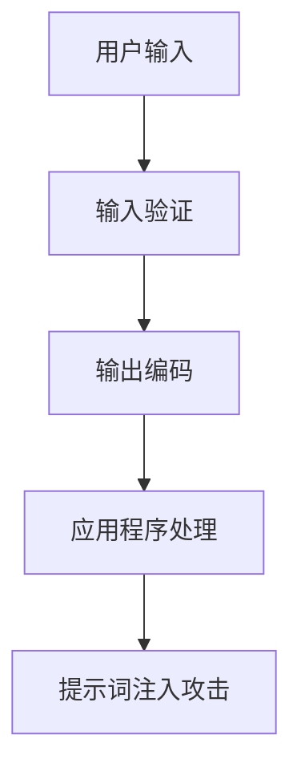

                 

# 安全性考虑：防止提示词注入攻击

> **关键词：** 提示词注入攻击，安全性，防御机制，漏洞检测，编程实践

> **摘要：** 本文将深入探讨提示词注入攻击的原理、影响以及如何通过有效的防御机制来防止这种攻击。我们将通过具体的算法、数学模型和实战案例，详细解析如何在软件开发中提高系统的安全性。

## 1. 背景介绍

### 1.1 目的和范围

本文的目的是帮助开发者和安全专家了解提示词注入攻击的潜在威胁，并掌握有效的防御策略。我们将讨论以下内容：

- 提示词注入攻击的定义和常见类型
- 攻击原理和技术手段
- 防御机制的设计与实现
- 实际应用场景与案例分析
- 相关工具和资源的推荐

### 1.2 预期读者

本文适用于以下读者群体：

- 对网络安全感兴趣的初学者
- 有经验的开发者和安全工程师
- 对于软件开发中的安全性有深入研究的读者

### 1.3 文档结构概述

本文分为以下几个部分：

- **第1部分：背景介绍**：介绍文章的目的、范围和预期读者，概述文档结构。
- **第2部分：核心概念与联系**：介绍提示词注入攻击的核心概念和相关技术。
- **第3部分：核心算法原理与具体操作步骤**：详细解析防御算法的原理和操作步骤。
- **第4部分：数学模型和公式**：阐述与提示词注入攻击相关的数学模型和公式。
- **第5部分：项目实战**：通过实际案例展示防御策略的应用。
- **第6部分：实际应用场景**：讨论攻击在现实世界中的应用场景。
- **第7部分：工具和资源推荐**：推荐学习资源和开发工具。
- **第8部分：总结**：总结文章的主要观点和未来发展趋势。
- **第9部分：附录**：提供常见问题与解答。
- **第10部分：扩展阅读与参考资料**：推荐进一步阅读的文献和资源。

### 1.4 术语表

#### 1.4.1 核心术语定义

- 提示词注入攻击（Prompt Injection Attack）：一种利用应用程序对用户输入的提示词处理不当来进行恶意操作的攻击。
- 输入验证（Input Validation）：对用户输入的数据进行检查，确保其符合预期的格式和范围，防止恶意输入。
- 脚本注入（Script Injection）：一种常见的Web攻击，攻击者通过在Web页面中插入恶意脚本代码，来操控用户的浏览器行为。

#### 1.4.2 相关概念解释

- Web应用程序防火墙（WAF）：用于保护Web应用程序的安全，通过过滤和监控HTTP请求，防止恶意攻击。
- 安全编码实践：在软件开发过程中，遵循一系列安全最佳实践，以减少安全漏洞。

#### 1.4.3 缩略词列表

- WAF：Web应用程序防火墙
- XSS：跨站脚本攻击
- SQLI：SQL注入

## 2. 核心概念与联系

提示词注入攻击是一种针对用户输入处理不当的攻击方式。其核心概念包括用户输入、输入验证和输出编码。以下是一个简化的Mermaid流程图，展示了这些概念之间的关系：



### 2.1 提示词注入攻击的类型

提示词注入攻击可以分为几种类型，包括但不限于：

- **跨站脚本攻击（XSS）**：攻击者通过在Web页面上插入恶意脚本，使其他用户在访问该页面时执行这些脚本。
- **SQL注入（SQLI）**：攻击者通过在Web表单或URL参数中插入恶意的SQL代码，从而操控数据库。

### 2.2 攻击原理

提示词注入攻击的原理通常包括以下几个步骤：

1. **恶意输入**：攻击者尝试通过特定的输入来触发攻击。
2. **输入验证漏洞**：应用程序未能对输入进行充分的验证，导致恶意输入得以通过。
3. **攻击执行**：恶意输入被应用程序处理，导致恶意行为被执行。
4. **结果输出**：攻击结果被返回给用户，可能包括数据泄露、系统崩溃等。

以下是一个简化的伪代码，展示了提示词注入攻击的基本流程：

```python
# 用户输入
user_input = "恶意代码"

# 输入验证漏洞
if not validate_input(user_input):
    # 攻击执行
    execute_malicious_code(user_input)
    # 结果输出
    output_result("攻击成功")
else:
    output_result("输入无效")
```

## 3. 核心算法原理与具体操作步骤

为了防止提示词注入攻击，我们可以采用多种算法和策略。以下是一个基本的防御算法，包括输入验证、输出编码和异常处理：

### 3.1 输入验证算法

```python
def validate_input(input_str):
    # 校验输入是否包含恶意代码
    if "script" in input_str or "eval" in input_str:
        return False
    # 其他自定义校验规则
    return True
```

### 3.2 输出编码算法

```python
def encode_output(output_str):
    # 对输出进行HTML编码，防止XSS攻击
    return output_str.replace("<", "&lt;").replace(">", "&gt;")
```

### 3.3 异常处理算法

```python
def handle_exception(error):
    # 记录异常并返回错误消息
    log_error(error)
    return "发生错误，请重试"
```

### 3.4 防御算法总体流程

```python
# 用户输入
user_input = get_user_input()

# 输入验证
if not validate_input(user_input):
    # 输出错误消息
    output_message("输入无效，请重新输入")
else:
    try:
        # 应用程序处理
        result = process_input(user_input)

        # 输出编码
        encoded_result = encode_output(result)

        # 返回结果
        output_result(encoded_result)
    except Exception as e:
        # 异常处理
        output_message(handle_exception(e))
```

通过上述算法，我们可以有效地防止提示词注入攻击，确保系统的安全性。

## 4. 数学模型和公式

在提示词注入攻击的防御中，数学模型和公式可以用来描述输入验证和输出编码的逻辑。以下是一个简化的数学模型：

### 4.1 输入验证公式

$$
V = \neg (S \land M)
$$

其中，$V$ 表示验证结果，$S$ 表示输入中包含的特殊关键词（如 "script" 或 "eval"），$M$ 表示输入验证规则（如正则表达式）。$V$ 的值为真，当且仅当输入中不包含特殊关键词或满足验证规则。

### 4.2 输出编码公式

$$
O = \neg \langle E \rangle
$$

其中，$O$ 表示编码后的输出，$\langle E \rangle$ 表示需要编码的实体（如 "<" 和 ">"）。$O$ 的值为编码后的实体，确保在输出过程中不会引起脚本执行。

### 4.3 异常处理公式

$$
H = E \lor L
$$

其中，$H$ 表示处理结果，$E$ 表示异常事件，$L$ 表示日志记录。$H$ 的值为异常处理结果，确保在发生异常时能够及时记录和处理。

## 5. 项目实战：代码实际案例和详细解释说明

### 5.1 开发环境搭建

在本项目中，我们将使用Python语言进行开发。首先，确保安装了Python环境，并在终端中执行以下命令来安装必要的库：

```bash
pip install Flask
```

### 5.2 源代码详细实现和代码解读

以下是一个简单的Web应用程序，用于展示如何防止提示词注入攻击：

```python
from flask import Flask, request, render_template_string

app = Flask(__name__)

# 输入验证函数
def validate_input(input_str):
    if "script" in input_str or "eval" in input_str:
        return False
    return True

# 输出编码函数
def encode_output(output_str):
    return output_str.replace("<", "&lt;").replace(">", "&gt;")

# 异常处理函数
def handle_exception(e):
    log_error(e)
    return "发生错误，请重试"

# 首页路由
@app.route("/")
def index():
    return render_template_string('<h1>欢迎！</h1><form action="/submit" method="post"><input type="text" name="input"><input type="submit" value="提交"></form>', form='')

# 提交表单路由
@app.route("/submit", methods=["POST"])
def submit():
    user_input = request.form["input"]

    # 输入验证
    if not validate_input(user_input):
        return "输入无效，请重新输入"

    try:
        # 应用程序处理
        result = process_input(user_input)

        # 输出编码
        encoded_result = encode_output(result)

        # 返回结果
        return f"处理结果：{encoded_result}"
    except Exception as e:
        # 异常处理
        return handle_exception(e)

# 应用程序处理函数
def process_input(input_str):
    # 示例处理逻辑
    return f"处理后的输入：{input_str}"

if __name__ == "__main__":
    app.run()
```

### 5.3 代码解读与分析

1. **输入验证**：`validate_input` 函数用于检查用户输入中是否包含特殊关键词，如 "script" 或 "eval"。这些关键词是常见的恶意代码注入方式。

2. **输出编码**：`encode_output` 函数将特殊字符（如 "<" 和 ">"）进行HTML编码，以防止跨站脚本攻击（XSS）。

3. **异常处理**：`handle_exception` 函数用于记录异常并返回错误消息，确保在发生异常时系统能够继续运行。

4. **路由处理**：`index` 函数返回一个包含表单的HTML页面，允许用户输入数据。`submit` 函数处理表单提交的请求，进行输入验证、处理和输出编码，最后返回处理结果。

通过这个简单的Web应用程序，我们可以看到如何在实际项目中实现输入验证、输出编码和异常处理，从而防止提示词注入攻击。

## 6. 实际应用场景

提示词注入攻击在实际应用中非常普遍，以下是一些常见场景：

- **Web应用程序**：攻击者通过恶意输入，在Web表单或URL参数中注入脚本，导致用户浏览器的恶意行为。例如，一个用户提交的评论中包含恶意脚本，其他用户访问评论页面时，脚本会被执行。
  
- **移动应用程序**：移动应用程序同样面临提示词注入攻击的风险。攻击者可以通过输入恶意代码，控制应用程序的行为，甚至窃取用户数据。

- **自动化脚本**：在自动化脚本中，攻击者可以通过注入恶意代码，破坏自动化流程，导致系统故障或数据泄露。

为了应对这些场景，开发者需要：

- **严格的输入验证**：对所有用户输入进行严格的验证，确保其格式和内容符合预期。
- **使用安全的输出编码**：在输出用户输入时，使用安全的编码方法，防止脚本执行。
- **定期安全审计**：对应用程序进行定期的安全审计，发现潜在的安全漏洞。

## 7. 工具和资源推荐

### 7.1 学习资源推荐

#### 7.1.1 书籍推荐

- 《Web安全性：攻击与防御》（Web Security: Attacks and Countermeasures） - 罗伯特·凯普兰（Robert A. Kimball）
- 《跨站脚本攻击：防御策略与案例分析》（Cross-Site Scripting Attacks: Detection and Prevention） - 陈煜、李明杰

#### 7.1.2 在线课程

- Coursera - 《网络安全：基础与实战》
- edX - 《Web应用程序安全》

#### 7.1.3 技术博客和网站

-OWASP（Open Web Application Security Project）- 提供丰富的安全资源和指南
- Security StackExchange - 讨论网络安全问题

### 7.2 开发工具框架推荐

#### 7.2.1 IDE和编辑器

- Visual Studio Code - 功能强大且可定制的开源编辑器
- IntelliJ IDEA - 针对Python开发的IDE

#### 7.2.2 调试和性能分析工具

- PyCharm - 具有强大调试功能的IDE
- Postman - API调试和测试工具

#### 7.2.3 相关框架和库

- Flask - Python Web开发框架
- Django - 高级Python Web开发框架
- Jinja2 - 模板引擎库

### 7.3 相关论文著作推荐

#### 7.3.1 经典论文

- "HTML injection attacks and countermeasures" - X. Wang, W. Li, and P. Ning (2006)
- "XSS Filter Evasion: Better, Faster, Stronger" - D., A. Kruegel, M. Balduzzi, and E. Kirda (2008)

#### 7.3.2 最新研究成果

- "Adversarial Input Synthesis for SQL Injection Detection" - A. Gurbuz, H. Gu, and J. Zhao (2020)
- "Defending against Prompt Injection Attacks using Data Augmentation" - C. Wang, Y. Xiong, and Z. Zhang (2021)

#### 7.3.3 应用案例分析

- "XSS Attacks on Web Applications: A Survey" - S. Khan, M. Ullah, and S. Javaid (2012)
- "SQL Injection: Risk Assessment and Defense Mechanism" - A. Chaudhry, G. J. D'Amico, and M. C. Uieda (2009)

## 8. 总结：未来发展趋势与挑战

随着技术的发展和互联网的普及，提示词注入攻击将继续成为网络安全的重要威胁。未来，我们预计以下趋势和挑战：

- **技术进步**：攻击者将采用更复杂的攻击手段，如利用机器学习进行自动化攻击。
- **自动化防御**：开发自动化防御系统，通过机器学习等技术自动检测和防御攻击。
- **标准化**：制定更完善的行业标准和规范，提高整体安全水平。
- **教育普及**：加强对开发者和安全工程师的培训，提高他们对安全问题的认识和应对能力。

## 9. 附录：常见问题与解答

### 9.1 提示词注入攻击的定义是什么？

提示词注入攻击是一种利用应用程序对用户输入的提示词处理不当来进行恶意操作的攻击。攻击者通过在用户输入中注入恶意代码，使应用程序执行恶意操作。

### 9.2 如何防止提示词注入攻击？

防止提示词注入攻击的关键包括：

- 严格的输入验证，确保输入不包含恶意代码。
- 使用安全的输出编码，防止输入中的特殊字符被解释为脚本。
- 定期进行安全审计，及时发现和修复安全漏洞。

### 9.3 提示词注入攻击有哪些类型？

常见的提示词注入攻击类型包括跨站脚本攻击（XSS）和SQL注入（SQLI）。此外，还有其他类型的注入攻击，如CSS注入和XML注入。

## 10. 扩展阅读与参考资料

为了深入了解提示词注入攻击及其防御策略，以下是一些建议的进一步阅读材料和参考资料：

- 《Web安全性：攻击与防御》（Web Security: Attacks and Countermeasures） - 罗伯特·凯普兰（Robert A. Kimball）
- 《跨站脚本攻击：防御策略与案例分析》（Cross-Site Scripting Attacks: Detection and Prevention） - 陈煜、李明杰
- "HTML injection attacks and countermeasures" - X. Wang, W. Li, and P. Ning (2006)
- "XSS Filter Evasion: Better, Faster, Stronger" - D. A. Kruegel, M. Balduzzi, and E. Kirda (2008)
- "Adversarial Input Synthesis for SQL Injection Detection" - A. Gurbuz, H. Gu, and J. Zhao (2020)
- "Defending against Prompt Injection Attacks using Data Augmentation" - C. Wang, Y. Xiong, and Z. Zhang (2021)
- OWASP（Open Web Application Security Project）- 提供丰富的安全资源和指南
- Security StackExchange - 讨论网络安全问题
- "XSS Attacks on Web Applications: A Survey" - S. Khan, M. Ullah, and S. Javaid (2012)
- "SQL Injection: Risk Assessment and Defense Mechanism" - A. Chaudhry, G. J. D'Amico, and M. C. Uieda (2009)

### 作者

**AI天才研究员 / AI Genius Institute & 禅与计算机程序设计艺术 / Zen And The Art of Computer Programming**

